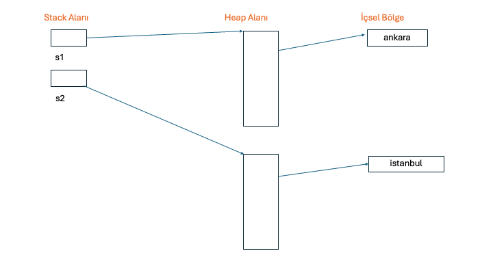
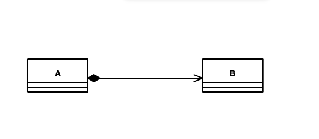
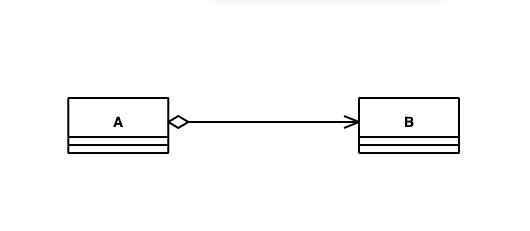
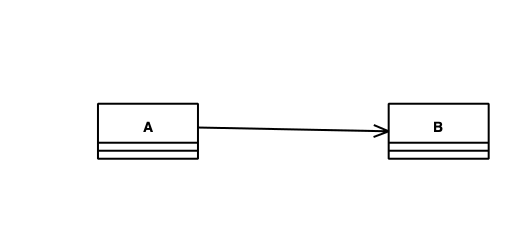
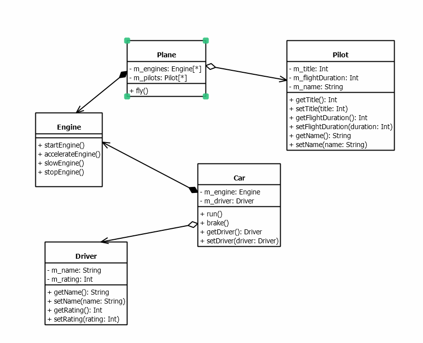
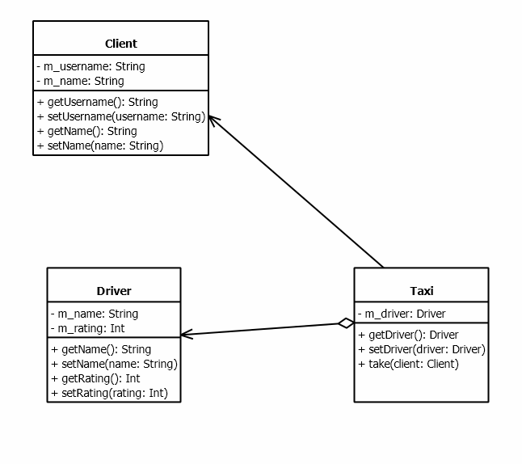

### C ve Sistem Programcıları Derneği
### Java ile Nesne Yönelimli Programlama
### Eğitmen: Oğuz KARAN

###### 21 Eylül 2024 - 22 Eylül 2024

> Java 1995 yılında Sun firmasında çalışan `James Gosling` tarafından tasarlanmıştır. Sun firması daha sonra Oracle tarafından satın alınmıştır ve şu an Java aslında Oracle firmasına aittir. Java 1.0 versiyonu ile çıkmıştır şu an 17 Eylül 2024 itibariyle Java 23 son sürüm olarak ilan edilmiştir. Java ismi hem programlama diline hem de ortama verilen genel bir isimdir. Java'da yıllar içerisinde pek çok değişiklikler olmuştur. Bu anlamda bazı sürümler majör bazı eklentilerle ve değişikliklerle yayınlanmıştır. Majör değişiklikler genel olarak programlama yaklaşımının bile değişebilmesine yol açabilen değişiklikleri kapsar. Bu anlamda programlama dilinde ve ortamında da değişiklikler olabilmektedir. Java sürümleri içerisinde majör değişikliklerin en belirgin olduğu iki sürüm Java 5 ve Java 8 sürümleridir. Bu sürümlerde Java'ya hem ortam hem de programlama dili anlamında radikal eklentiler yapılmıştır. Bazı sürümlerde yine önemli eklentiler olabilir ancak bunların sayısı az olabilmektedir. Örneğin Java 11, Java 17 ve Java 21 sürümleri bu şekildedir. Yine bazı sürümlerde çok önemli olmayan da değişiklikler olabilmektedir. Bazı sürümlerde eklenen değişiklikler **preview/experimental** denilen biçimdedir. Bu değişiklikler doğrudan kullanılamaz. Derleme işleminde bir takım switch'lerin verilmesi gerekir. 

##### Java Ortamının Temel Özellikleri

> **1. Ara kodlu Çalışma Sistemi:** C, C++ ve Go gibi dillerde yazılan kodlardan elde edilen (hangi aşamalardan geçilerek elde edildiği şu an için önemsizdir) çalışabilir dosya (executable file) sisteme (genel olarak işletim sistemi, donanım vb.) özgüdür ve bazı durumlarda yazılan kodlar her sisteme göre ayrı olabilmektedir. Eğer kod sistemden bağımsız olarak yani standart olarak yazılmışsa bile her sistem için ayrı executable file'lar elde edilmelidir. Oysa Java programlama dili ile yazılmış bir program derlendiğinde (compilation) elde edilen dosyanın içerisinde hiç bir sistemin dili olmayan yapay bir kod bulunur. Bu arakoda Java dünyasında **byte code (BC)** denilmektedir. BC doğrudan çalıştırılamaz. Çalıştırılabilmesi için ayrı bir uygulama gerekir. Bu uygulama BC'yi yorumlayarak makine koduna yani sisteme özgü kod dönüştürerek programı çalıştırır. Bu dönüştürme işlemine JIT (Just In Time) compilation denilmektedir. Geliştirme ve çalıştırma ortamında 3 tane temel kavram söz konusudur:
> - **JVM (Java Virtual Machine):** BC'yi makine koduna dönüştürür. JVM aslında BC'nin nasıl makine koduna dönüştürüleceğini tanımlayan soyut bir kavramdır.
>
> - **JRE (Java Runtime Environment):** Genel olarak Java ile yazılmış bir uygulamayı çalıştırmak (run) için gereken araçları ve uygulamaları içeren bir pakettir. Yani BC elde edildiğinde çalıştırılabilmesi için JRE'ye ihtiyaç vardır. 
> 
> - **JDK (Java Development Kit):** Geliştirme (development) araçlarını ve çalıştırma araçlarının bir çoğunu içeren bir pakettir. Buradaki çalıştırma araçları geliştirme aşamasında kullanılabilmektedir. 
> 
> Java 11 ile birlikte ticari kullanımlarda Oracle tarafından bazı değişikliklere gidilmiştir. Özet (genel) olarak şunlar söylenebilir: Java'da geliştirme ortamı ücretsizdir. Çalıştırma araçları kullanılan araca göre ücretlendirilebilmektedir. Tamamen ücretsiz olarak kullanılabilen çalıştırma araçları da mevcuttur. Bunlardan en tipik olanı "Open JRE"'dir. Burada anlatılanların detayları olduğu unutulmamalıdır. 
> 
> Java 11 ile Long Term Support (LTS) kavramı getirilmiştir. LTS sürümleri uzun süre desteklenen ve güncellemesi (hızlandırılması, hataların düzeltilmesi (bugfix) vb) uzun süre yapılan sürümlerdir. Java'da Java 8, 11, 17 ve 21 sürümleri LTS'dir. Ticari uygulamalarda genel olarak (hatta her zaman) LTS sürümleri kullanılır. 
> 
> Arakodlu çalışma sisteminin en önemli avantajı geliştirilen uygulamaların genel olarak sistemden bağımsız olarak çalıştırılabilmesidir. Bu kavrama "Write Once Run Anywhere (WORA)" denilmektedir. Şüphesiz bunun da ayrıntıları ve istisnaları vardır. 
> 
> Ayrıca unutulmamalıdır ki arakodlu çalışma sistemi az da olsa bir performans kaybına yol açar. Ancak Java'nın hedeflediği uygulamalar düşünüldüğünde bu kaybın pek de önemi yoktur.
> 
> **Anahtar Notlar:*** Aslında Java'da istenirse sisteme özgü çalışabilen bir executable file da son yıllarda elde edilebilmektedir. Bu işlem için genel olarak GraalVM kullanılmaktadır. GraalVM kullanımının belirli kısıtları olabilmektedir. GraalVM ve detayları "Java ile Uygulama 2" kursunda ele alınacaktır.
> 
> **2. Hızlı Uygulama Geliştirme Ortamı:** Java hızlı uygulama geliştirme (rapid application development) ortamı sunar. Bu anlamda hem öğrenmesi kolaydır hem de ürün çabuk elde edilir.
> 
> **3. Geniş bir sınıf kütüphanesi:** Java'da oldukça geniş sınıf kütüphanesi bulunur. Dosya işlemleri, veritabanı işlemleri vb. işlemler için hazır sınıflar bulunur. Java'nın standart olarak kullanılan kütüphanelerine "Java Standard Edition (Java SE)" denilmektedir. Ayrıca Java programlamada pratikte başka kişiler, organizasyonlar ve firmalar tarafından geliştirilmiş adeta standart gibi kullanılan pek çok kütüphane de bulunmaktadır.
> 
> **4. Güvenli çalışma ortamı:** Java'da yazılmış olan bir programın sisteme zarar verme olasılığı çok daha azdır. Yazılan bir program yüzünden yanlıkla sistemde bir problem olma olasığı oldukça düşüktür.

###### 28 Eylül 2024 - 29 Eylül 2024

##### Dil Kavramı

>İletişimde kullanılan sembollere dil denir. Dilin kurallarına gramer denir. Bir olgu en az aşağıdaki iki özelliğe sahipse bir dildir:
>**- Syntax:** Dilin öğelerinin doğru dizilimine denir. Örneğin "I am a programmer" cümlesinde dilin öğeleri doğru dizilmiştir. Cümle "am a programmer I" biçiminde yazılmış olsaydı syntax olarak hatalı olurdu.
>**- Semantic:** Doğru dizilmiş öğelerin anlamına denir. Öğeler doğru dizilse bile cümle anlamlı değilse yine hatalıdır
>
>Doğal dillerde syntax ve semantic dışında da öğeler bulunur. Bilgisayar bilimlerinde kullanılmak üzere tasarlanmış dillere bilgisayar dilleri (computer languages) denir. Bir bilgisayar dili akış (flow) içeriyorsa, o dile programlama dili (programming language) denir. Bu anlamda her programlama dili bilgisayar dilidir ancak her bilgisayar dili bir programlama dili olmayabilir. Örneğin, XML ve HTML programlama dilleri değildir ancak bilgisayar dilleridir. Bu anlamda Java akış içerdiğinden bir programlama dilidir. 
>
>Programlama dilleri zaman içerisinde birbirlerinden esinlenmişlerdir. Hatta bazı programlama kalıpları da bazı dillerden alınarak kullanılmaktadır. 
##### Programlama Dillerinin Sınıflandırılması

>Programlama dilleri çeşitli biçimlerde sınıflandırılabilse de genel olarak 3 şekilde sınıflandırma eğilimi söz konusudur:
>**- Seviyelerine göre sınıflandırma:** Programlama dilinin seviyesi (level) onun insan algısına yakınlığının bir ölçüsüdür. Yüksek seviyeli diller (high level languages) hem dil özellikleri, hem de uygulama geliştirme anlamında insan algısına yakınlıkları dolayısıyla genel olarak daha kolay öğrenilirler. Düşük seviyeli diller (low level languages) makineye daha yakın dillerdir. Olabilecek en düşük seviyeli dil makine dilidir (machine language).
>
>**- Programlama modeline göre sınıflandıma:** Bir programı yazarken kullanılan genel model önemlidir. Bazı dillerde sınıf yoktur. Program çeşitli alt programların (function) bir araya getirilmesiyle yazılır. Bu modele "procedural model" denir. Bazı dillerde sınıflar vardır ve programlar sınıflar kullanılarak yazılır. Bu modele "nesne yönelimli model (object oriented model)" denir. Bazı dillerde programlar matematiksel formül yazıyormuş gibi yazılır. Bu tarz programlama modeline "fonksiyonel model (functional model)" denir. Bazı diller birden fazla modeli desteklerler. Bu tarz dillere "multi-paradigm languages" denilmektedir. Birden fazla modeli destekleyen diller, modellerin tüm özelliklerini desteklemeyebilirler. 
>
>**- Kullanım alanına göre sınıflandırma:**  Dilin hangi alanlarda kullanılabileceğine göre sınıflandırmadır. Bazı diller birden fazla alanda kullanılabilirler. Bazı diller ise sadece bir alanda kullanılabilirler. Bu anlamda genel amaçlı diller, bilimsel ve mühendislik dilleri, veritabanı dilleri, oyun ve animasyon dilleri, yapay zeka dilleri vb. alanlar için diller söz konusu olabilmektedir.
>
>Buna göre Java, bilimsel ve mühendislik alanlarında, web uygulamalarında, yapay zeka uygulamalarında, mobil programlamada vb. kullanılabilen genel amaçlı, yüksek seviyeli, nesne yönelimli programlama modeli ile uygulama geliştirilebilen ve özellikle Java 8 ile birlikte fonksiyonel programlama modelinin de belirli ölçüde kullanılabildiği multi-paradigm bir dildir.
>
>**Anahtar Notlar:** Bir dilin bir çok alanda kullanılması, pratikte de ilgili alanda kullanılacağı anlamına gelmez. Bir alanda daha etkin kullanılabilen bir dil varsa o dil daha fazla tercih edilebilir.
>**Anahtar Notlar:** Yukarıda anlatılan kavramların detayları vardır. Zaman içerisinde anlaşılacaktır.

##### Temel Kavramlar

> **Çevirici Programlar, Derleyiciler ve Yorumlayıcılar:** Bir dilde yazılmış olan programı başka bir dile çeviren programlara çevirici program (translator) denir. Çevirici programlarda bir kaynak dil (source language) ve bir hedef dil (target/destination language) vardır. Kaynak dil yüksek seviyeli, hedef dil düşük seviyeli ise bu durumda çevirici programa derleyici (compiler) denir. Örneğin Java programlama dilinden Kotlin programlama diline dönüştürme yapan program bir translator, Java programlama dilinden BC'ye dönüştüren program ise bir derleyicidir. JVM'in BC'yi makine koduna dönüştürme faaliyeti de bir derleme işlemidir. Bu sebeple buna JIT compilation denir. Bazı dillerde yazılan programlar herhangi bir kod üretilmeden çalıştırılırlar. Bu tarz çalıştırma yapan programlara yorumlayıcı (interpreter) denir. Bazı diller hem derleyici ile hem de yorumlayıcı ile kullanılabilirler. Java pratikte derleyici ile kullanılan, Java 11 ile birlikte yorumlayıcı ile de kullanılabilebilen bir programlama dilidir. Yorumlayıcı ile kullanımı bu kursta ele alınmayacaktır. Yorumlayıcı ile kullanılan diller derleyici ile kullanılan dillere göre daha yavaş olma eğilimindedir. 
> 
>**Anahtar Notlar:** Bir uygulama tek bir java dosyasında oluşmak zorunda değildir. Hatta bir Java uygulaması yalnızca Java kodlarında da oluşmak zorunda değildir. Bu durumda farklı Java dosyaları ayrı ayrı derlenir. Hattı aynı dosyada bulunan farklı sınıflar bile ayrı ayrı derlenir. Bir ürün aslında tüm birimlerinin uygun şekilde derlenmesi ve ele alınması ile elde edilir. Bu işlem için genel olarak "build" terimi kullanılır. Build işlemi yalnızca derleme işlemi değildir. Yani bir uygulamanın ürün olarak elde edilme süreci build işlemidir. Burada anlatıların detayları konular içerisinde ele alınacaktır.
>
>**İşletim Sistemi:** İşletim sistemi (operating system) makinenin donanımını yöneten, bilgisayar ile kullanıcı arasında bir köprü oluşturan yazılımdır. Bir işletim sisteminin pek çok görevi vardır. Programları çalıştırmak, çeşitli cihazları ve aygıtları yönetmek, dosyaları ve dizinleri  (directory) organize etmek vb. görevler sayılabilir. İşletim sistemleri genel olarak iki gruba ayrılabilir: **masaüstü işletim sistemleri (desktop operating systems), mobil işletim sistemleri (mobile operating systems).** Şüphesiz başka çeşit işletim sistemleri de vardır. Popüler masaüstü işletim sistemleri Windows, Mac OS X, Unix ve Linux dağıtımları gibi işletim sistemleridir. Popüler mobil işletim sistemleri Android ve IOS'dur.
>
>**Açık kaynak kodlu yazılım, özgür yazılım ve mülkiyete sahip yazılım:** Özgür yazılım (free software) ve açık kaynak kodlu (open source) yazılımlar arasında farklar olsa da genel olarak aşağıdaki ortak özelliklere sahiptirler:
>- Bedavadır. Kullanılabilmesi için herhangi bir lisans gerekmez.
>- Kaynak kodlar sahiplenilemez. Kaynak koda ekleme yapıldığında ya da bir kaynak kod kullanıldığında kodlar kapatılamaz. Onların da açılması gerekir.
>- Çoğaltılabilir, izin almadan kullanılabilir.
>
>Bunun tam tersi olarak mülkiyete sahip (propriatery) yazlımlardır. Bu yazılımlar para verilerek kullanılır ve izin almadan çoğaltılamaz.
>
>**IDE (Integrated Development Environment):** Derleyicler ve yorumlayıcılar komut satırından çalışan ve basit arayüzlere sahip programlardır. Aslında teorik olarak bir uygulamadaki tüm Java dosyaları ve diğer dosyalar basit bir editör programla yazılıp komut satırından derlenebilir. Ancak bu, uygulama büyüdükçe zahmetli olmaya başlar. Bu da programcıya zaman kaybettirir. Bu amaçla pratikte yazılım geliştirmeyi kolaylaştırmak için IDE denilen yazılımlar kullanılır. IDE'lerde örneğin bir takım yardımlar veren editörler, tasarım araçları, test araçları, debug araçları vb. programcının geliştirme sırasında kullandığı araçlar bulunur. Java ile uygulama geliştirmede iki tane IDE yoğun olarak kullanılmaktadır: **Eclipse, IntelliJIDEA**. Biz kursumuzda belirli bir zaman (yaklaşık kursun yarısına kadar) Eclipse, sonrasında IntelliJIDEA kullanacağız.

###### Sembollerin İngilizce karşılıkları

| Sembol | İngilizce Karşılığı                         			|
|--------|------------------------------------------------------|
| +      | plus                                        			|
| -      | minus, hyphen, dash                         			|
| *      | asterisk                                    			|
| /      | slash                                       			|
| \      | backslash                                   			|
| .      | period, dot                                 			|
| ,      | comma                                       			|
| :      | colon                                       			|
| ;      | semicolon                                   			|
| “      | double quote                                			|
| '      | single quote                                			|
| (...)  | parenthesis left, right, opening, closing   			|
| [...]  | (square) parenthesis left, right, opening, closing	|
| {...}  | brace left, right, opening, closing 					|
| =      | equal sign                                  			|
| &      | ampersand                                   			|
| ~      | tilda                                       			|
| @      | at                                          			|
| <...>  | less than, greater than, angular bracket    			|
| ^      | caret                                       			|
| \|     | pipe                                        			|
| _      | underscore                                  			|
| ?      | question mark                               			|
| #      | sharp, number sign                          			|
| %      | percent sign                                			|
| !      | exclamation mark                            			|
| $      | dollar sign                                 			|
| ...    | ellipsis                                    			|

##### JDK Kurulumu ve Bilgisayarın Geliştirme için Hazır Hale Getirilmesi

>JDK'nın kurulumu için işletim sistemine aşağıdaki bağlantıdan ilgili "installer" program elde edilebilir:

[[https://www.oracle.com/tr/java/technologies/downloads/#jdk21-windows]]

>Burada LTS olması açısından minimum Java 17 kurulması önerilir. Ancak kursumuzda Java 21 özellikleri de belirli ölçüde ele alınacağından kurulumu uygun olabilir.  Kurulum aşamasından sonra java ve javac programları -version seçeneği ile çalıştırılarak versiyon kontrolü yapılabilir:`java -version`, `java -version`.

##### 5 Ekim 2024

>Aşağıdaki programı çalıştırmak için JDK'nın kurulu olan bir bilgisayarda aşağıdaki işlemlerin yapılması gerekir:
>
>1. Herhangi bir dizinde (directory) `csd` isimli bir dizin açılır. Buradaki `csd` isminin tamamı küçük harf olacak şekilde yazılacaktır.
>
>2. `csd` dizini içerisinde `App.java` isimli bir dosya açılır. Windows sisteminde uzantılar gizlenmişse görünür hale getirip uzantının `.java` olarak değiştirilmesi gerekir. Buradaki dosya isminin `App.java` biçiminde yazılması gerekir.
>
>3. Komut yorumlayıcı program (command prompt/terminal/shell) ile csd directory'sinin bulunduğu dizine geçilir. Dizin geçişi için `cd` komutu kullanılır. Örneğin `cd D:\Repositories\Java-Sep-2024\src\src-console`
>
>4. Herhangi bir editör program ile App.java dosyasının içerisine aşağıdaki programı yazınız.
> 
>5. Komut yorumlayıcı programda, csd'nin bulunduğu dizinde aşağıdaki komutları çalıştırarak derleme işlemi yapılır:

```java
javac csd/App.java` -> Windows dışı sistemler için 
javac csd\App.java` -> Windows sistemi için
```

> Derleme işleminde herhangi bir hata (error) mesajı alınmazsa derleme işlemi başarılıdır ve App.class isminde byte code üretilir.
>
>6. Komut yorumlayıcı programda aşağıdaki biçimde byte code çalıştırılır:

```java
java csd.App
```

>**Anahtar Notlar:** Buradaki bazı zorunluluklara ilişkin detaylar konular içerisinde ele alınacaktır.

```java
package csd;

class App {
	public static void main(String [] args) 
	{
		System.out.println("Hello, World");
	}
}
```

**Anahtar Notlar:** Bir program için programcı açısındanKal iki durum söz konusudur: **Derleme Zamanı (compile time), Çalışma zamanı (runtime)**. Derleme zamanı, derleme işlemine ilişkin süreçtir. Çalışma zamanı, programın çalıştırılmasına ilişkin süreçtir. Bu iki zaman birbirleriyle ilişkili bile olsa ayrı zamanlar ve kavramlar oldukları unutulmamalıdır.
##### Derleyicinin Verdiği Mesajlar

>Derleyiciler koda ilişkin bazı teşhis mesajları (diagnostics) verebilirler. 
>Derleyicilerin mesajları 3 gruba ayrılır:
>1. **Gerçek hatalar (errors):** Syntax veya semantic olarak geçersiz bir durumda derleyicinin verdiği mesajlardır. Bu durumda BC üretilmez. Programcının hatay yol açan kodları düzeltmesi ve derleme işlemini yeniden yapması gerektir.
>2. **Uyarılar (warnings):** Programcının olası programlama hatalarına yönelik mesajlardır. Uyarı mesajları arakodun üretimini engellemez. Programcı uyarı mesajlarını dikkate almalıdır. Özel bir durum yoksa uyarı mesajlarına yol açan durumlar ortadan kaldırılmalıdır. Bazı dıurumlarda programcının kullandığı bazı static kod analizi araçları da derleyici dışında bazı uyarılar verebilirler. Programcı bunları da mutlaka dikkate almalıdır ancak hepsinin ortadan kaldıılması gerekmeyebilir. Pratikte bir ürünün nihai (release) versiyonunda derleyicin tüm uyarı mesajlarının kaldırılmış olması gerekir. 
>3. **Ölümcül hatalar (fatal errors):** Derleme işleminin dahi tamamlanamadığı hatalardır. Örneğin derlenecek dosyanın bulunaması, erişim yetkisinin olmaması vb. durumlardır. Bu durumda programcı ölümcül hataya yol açan durumları oratadan kaldırıp derleme işlemini yapmalıdır. yani ölümcül hata durumunda programcının kodu ile ilgili bir durum yoktur.
>
>Derleme işleminin herhangi bir uyarı vermeden başarılı olması durumunda derleyiciler genel olarak hiç mesaj vermezler. Bazı derleyiciler işlemin başarılı olduğuna yönelik ya da firmaya ilişkin bilgi mesajları verebilirler. Bunlar genel teşhis mesajları kategorisine girmezler. Örneğin Oracle'ın javac derleyicisi hiç bir uyarı mesajı da yoksa hiç bir mesaj vermez.  
>
>Programın çalışma zamanında oluşan hatalı durumlara **exception** ya da **runtime error** denilmektedir. Exception handling konusuna kadar bir exception oluştuğunda program abnormal bir biçimde sonlanır olarak düşüneceğiz.

##### Atom (Token)
>Programlama dilinin bölünemeyen en küçük birimine atom denir. Java programlama dilinde atomlar şunlardır:
>- **Anahtar Sözcükler (keywords/reserved words):** Derleyicinin bildiği, tanıdığı sözcüklerdir. Anahtar sözcükler tek başına değişken ismi olamazlar.  Örneğin: `package`, `int`,  `void`, `static`
>- **Değişkenler (variables/identifiers):** İsmini programcının belirlediği ve belirli kurallara göre isimlendirilebilen atomlardır. Örneğin: `csd`, `App`, `String`
>- **Sabitler (literals/constants):** Program içerisinde doğrudan yazılan değerler denir. Örneğin: `67`, `3.4`
>- **Operatörler (operators):** Belirli bir işleme yol açan ve işlemin sonucunda bir değer üreten atomlara denir. Örneğin, `a + b` ifadesinde + bir operatördür, `!b` ifadesinde ! bir operatördür
>- **String'ler (strings/string literals):** İki tane iki tırnak (double quote) içerisinde yazılan yazılara tırnaklarıyla birlikte string ya da string literal denir. Örneğin `"Hello, World"`
>- **Ayraçlar (delimiters/punctuators):** Yukarıdakiler dışında kalan atomlara denir. Örneğin: `{` `}`, `(` `)`
>**Anahtar Notlar:** Derleme işlemi atomlara ayırmakla (tokenizing) ile başlar.
>
>**Anahtar Notlar:** Klavyeden tuşlandığında boşluk algısı yaratan karakterlere boşluk karakterleri (whitespaces) denir. Klavyeden tuşlanabilen tipik boşluk karakterleri şunlardır: `SPACE`, `TAB(ULAR)`, `ENTER`
>Java'da kod yazım kuralları şu şekilde özetlenebilir:
>- Atomlar arasında istenildiği kadar boşluk bırakılabilir
>- Anahtar sözcükler ve değişken atomlar kendi aralarında bitişik yazılamazlar, diğer tüm atomlar bitişik yazılabilirler


>Atomlar arasında istenildiği kadar boşluk bırakılabilir

```java
package csd;

class App {
	public static 					void main(					String [] args) 
	{
		


System.


out.


println("Hello, World");
	}
}
```

>Anahtar sözcükler ve değişken atomlar kendi aralarında bitişik yazılamazlar, diğer tüm atomlar bitişik yazılabilirler

```java
package csd;class App{public static void main(String[]args){System.out.println("Hello, World");}}
```

>Anahtar sözcükler ve değişken atomlar bitişik yazılamazlar. Aşağıdaki kodda error oluşur
```java
packagecsd;class App{public static void main(String[]args){System.out.println("Hello, World");}} 
```

>Programlamada derleyicinin görmezden geldiği kod parçalarına yorum satırları (comment lines) denir. Java'da iki çeşit yorum satırı yazılabilir. Yorum satırları okunabilirliği/algılanabilirliği olumsuz olarak etkilemeyecek şekilde koda eklenmelidir.

```java
package csd;

class App {
	public static void main(String [] args) 
	{
		System.out.println("Hello, World"); //Burayı derleyici görmez
		/*
			Burayı da 
			derleyici görmez
		*/
	}
}
```

##### 6 Ekim 2024

##### Eclipse IDE Programı

>Eclipse Java'nın ilk yıllarından beri free olarak kullanılabilen bir IDE programdır. Eclipse her desktop işletim sisteminde çalışabilen bir uygulamadır. Eclipse,  [Eclipse](http://www.eclipse.org)link'inde indirilip kurulabilir. Biz kursumuzda Eclipse ile açılmış tek bir proje üzerinde çalışacağız. Eclipse ile bir Hello, World programını çalıştırmak üzere bir proje açmak için işlemler şu şekilde yapılabilir:
>1. Wokspace için bir dizin belirenir
>2. Bir Java projesi açılır. Örneğin File -> New -> Java Project seçilebilir
>3. Açılan pencerede proje ismi yazılmalıdır. Biz burada `Sample` ismini, vereceğiz. Yine bu pencerede JRE altındaki `Use an execution environment JRE` en az JavaSE 17 olarak seçilmelidir. Yine aynı pencerede `Module` altındaki `Create module-info.java file` seçeneği kaldırılmalıdır. 
>4. Bir java dosyası eklemek için src dizininde New -> Class menüsü seçilebilir.
>5. Açılan pencede package text alanına csd, Name text alanına da App yazılmalıdır. 
>6. Bu işlemden program yazılarak çalıştırılabilir. Çalıştırmak pek çok yöntem vardır. Herhangi bir tanesi tercih edilebilir. Program çalıştırıldığıdan Eclipse kendi Console penceresi açarak ilgili çıktıları orada gösterir.
>
>**Anahtar Notlar:**  Aslında çalıştırma işlemi derleme işleminden sonra yapılmaktadır. Eclipse'de `build automatically` seçili ise her kod yazımında buil işlemi dolayısıyla derleme işlemi yapılır ve error oluşmazsa arakod üretilir. Eğer `build automatically` seçili değilken çalıştırılırsa önce build işlemi yapılır sonra üretilen arakod çalıştırılır.
>
>**Anahtar Notlar:** Bir IDE programda bir işlemi yapmanın birden fazla yöntemi olabilir ve genelde de birden fazla yönetimi vardır. Yukarıdaki proje açma aşamaları dışında da yöntemler bulunmaktadır.

##### Genel Biçim Anlatım Notasyonu

>Bir dilin kurallarının genel biçimlerini anlatmaya yönelik pek çok notasyon bulunmaktadır. Biz burada genel olarak "açısal parantez-köşeli parantez" tekniğini kullanacağız.  Bu teknikte zorunlu olarak bulunması gerekenlere açıklamada açısal parantezler içerisinde yazılır. Seçenekli (optional) olması durumunda ise köşeli parantezler arasında yazılır. Herhangi bir paranteze alınmayanlar da aynı şekilde bulunması gerekenler olacaktır. Ayrıca `//...` şeklinde kullanım durumunda "burada bir takım kodlar bulunabilir ancak şu an bizi ilgilendirmiyor" anlamına gelecektir. Yaklaşık 20 yıldır programlaya ilişkin kaynaklar, bir konuyu anlatırken uydurma bazı isimler kullanabilmektedir: foo, bar, tar, car, zar vb. Biz de gerektiğinde bu isimleri kullanacağız. 
##### Bildirim (Declaration)

Bir ismin derleyiciye tanıtılmasına **bildirim (declaration)** denir.

##### Hello  World Program Genel Açıklaması

>Bir java programı genel olarak paketlerden (package), paketler sınıflardan (class), sınıflar da metotlardan (method) oluşur.
>Paket bildiriminin genel biçimi şu şekildedir:
>
```java
package <paket ismi>
```

>Burada paket ismi daha sonra ele alacağımız değişken isimlendirme kurallarına uygun olmalıdır. Paketler konusu ileride çok detaylı bir biçimde ele alınacaktır. Biz paketler konusuna gelene kadar csd isimli bir paket altında çalışacağız. Bunula birlikte yine paketler konusuna gelene kadar tek bir java dosyası ile çalışacağız.
>
>Sınıf bildiriminin genel biçimi şu şekildedir:

```java
[bildirme ilişkin bazı anahtar sözcükler] class <sınıf ismi> {
	//...
}
```

>Burada sınıf ismi yine değişken isimlendirme kurallarına uygun bir isim olmalıdır. Sınıf bildiriminin detayları konular içerisinde ele alınacaktır. Sınıf kavramı Nesne Yönelimli Programlamanın (Object Oriented Programming) temel taşlarından biridir.

>Java'da alt programlara **metot (method)** denir. Metot bildirimi (method declaration) alt programın kodlarının yazılmasıdır. Bir metot bildirildikten sonra kodlarının çalıştırılabilmesi için **çağrılması (call/invoke)** gerekir. Metot bildiriminin genel biçimi:


```java
[erişim belirleyici] [static] <geri dönüş bilgisi> <metot ismi>([parametreler])
{
	//...
}
```

>Erişim belirleyici şunlardan biri olabilir: **public, protected, no-modifier, private**.  İlgili konuya gelene kadar tüm metotlarımızı public olarak bildireceğiz. Bir metot **static** veya **non-static** olabilir. static anahtar sözcüğü ile bildirilenler static, bildirilmeyenler non-static olur. İlgili konuya gelene kadar tüm metotları static olarak bildireceğiz. Bir metodun **geri dönüş değeri (return value)** olabilir ya da olmayabilir. Bir metodun geri dönüş değeri yoksa geri dönüş bilgisi yerine **void** anahtar sözcüğü yazılır. Hiç bir şey yazılmaması geçersizdir.  Metot ismi değişken isimlendirme kuralların uygun bir isim olmalıdır. Bir metodun parametreleri olabilir ya da olmayabilir. Metot parametreleri ileride ele alınacaktır. `{` ile `}` arasında kalan kod bölümüne **metodun gövdesi (method body)** denir. Metodun ne iş yaptığı yani kodları buraya yazılır.

##### 12 Ekim 2024

>static bir metodun çağrılmasının genel biçimi şu şekildedir:

```java
[paket ismi].[sınıf ismi].<metot ismi>([argümanlar]);
```

> Argüman kavramı ileride ele alınacaktır. **Bir metot çağrıldığında akış metodun kodlarına dallanır. Çağrılan metodun kodları çalıştırılır. Metot çağrısı bittiğinde akış çağrılan noktaya geri döner.** Akış main metodundan başlar. Akışın başladığı main metoduna **entry point** denir.  main metodu `java` programı tarafından (yani JVM) tarafında çağrılır. Özel bazı durumlar dışında main metodu bittiğinde program sonlanır. print ve println metotları aldıkları değerleri ekrana basmak için kullanılan standart metotlardır. Bu metotlar bir imleç (cursor) ile çalışırlar. İmlecin bulunduğu yere yazma yaparlar ve yazdıkları karakter kadar imleci ilerletirler. print metodu imleci yazdığı son karakterden sonraki konumda bırakır. println metodu yazdığı son karakterden sonra imleci bir sonraki satırın (line) başında bırakır. 

**Anahtar Notlar:** Aslında teknik olarak print ve println metotları ekrana yazma yapmazlar. Bu metotlar **standard output (stdout)** denilen bir dosyaya yazma yaparlar. stdout dosyası nereye yönlendirilmişse (redirection) yazma oraya yapılır. Bu durumda stdout dosyası ekrana yönlendirilmişse bu metotlar ekrana yazma yaparlar. Kursumuzda basitleştirmek için ekrana basma ya da ekrana yazdırma biçiminde kullanacağız. Benzer şekilde klavyeden okuma yapan metotlar okumayı **standard input (stdin)** denilen dosyadan yaparlar. stdout klavyeye yönlendirildiğinde okuma klavyeden yapılmış olur. Kursumuzda basitleştirmek için klavyeden okuma biçiminde kullanacağız. Masaüstü işletim sistemlerinin hemen hepsinde default olarak stdout ekrana, stdin de klavyeye yönlendirilmiştir. Ayrıca IDE'ler stdout'u kendi console pencerelerine yönlendirebilirler. 

**Anahtar Notlar:** print ve println metotları aslında non-static metotlardır. Bu anlamda System bir sınıf, out PrintStream türünden bir referans değişkendir. Bu kavramların detayları konular içerisinde ele alınacaktır. 

>Aşağıdaki örneği çalıştırıp sonucu gözlemleyiniz

```java
package csd;

class App {
	public static void main(String [] args)
	{
		System.out.println("Hello, World");	
		csd.Sample.foo();	
		csd.Sample.bar();	
		System.out.println("Goodbye, World");	
	}
}

class Sample {
	public static void foo()
	{
		System.out.println("foo");		
		csd.Sample.bar();		
		//...	
	}
	
	public static void bar()
	{	
		System.out.println("bar");		
		csd.Mample.tar();		
		//...	
	}
}

class Mample {
	public static void tar()
	{	
		System.out.println("tar");	
		//...	
	}
}
```

> Çağıran metodun (caller) ait olduğu sınıf ile çağrılan metodun (callee) ait olduğu sınıf aynı paket içerisindeyse, çağrı sırasında paket ismi kullanmaya gerek yoktur. Çağıran metot ile çağrılan metot aynı sınıf içerisindeyse çağrı sırasında paket ismi kullanılmamışsa sınıf ismi de yazmaya gerek yoktur. Aşağıdaki demo örneği inceleyiniz

```java
package csd;

class App {
	public static void main(String [] args)
	{
		System.out.println("Hello, World");	
		Sample.foo();	
		Sample.bar();	
		System.out.println("Goodbye, World");
	}

}

class Sample {
	public static void foo()
	{
		System.out.println("foo");		
		bar();
		
		//...
	
	}
	
	public static void bar()
	{	
		System.out.println("bar");		
		Mample.tar();		
		//...	
	}

}

class Mample {
	public static void tar()
	{	
		System.out.println("tar");	
		//...	
	}
}
```

##### Sayı Sistemleri

>Biz 10'luk sistemi **(decimal system)** kullanmaktayız. 10'luk sistemde sayıları ifade etmek için 10 sembol vardır:
>
>		0
>		1
>		2
>		3
>		4
>		5
>		6
>		7
>		8
>		9
>10'luk sistemde sayının her bir basamağı 10'nun kuvvetleriyle çarpılıp toplanmaktadır. Örneğin:
>
>		123.25 = 3 * 10^0 + 2 * 10^1 + 1 * 10^2 + 2 * 10^-1 + 5 * 10^-2
>Halbuki bilgisayarlar 2'lik sistemi **(binary system)** kullanmaktadır. 2'lik sistemde sayıları ifade etmek için 2 sembol kullanılmaktadır:
>
>		0 
>		1
>2'lik sistemde sayının her bir basamağına **bit (binary digit)** denilmektedir. 2'lik sistemde sayının her basamağı 2'nin kuvvetiyle çarpılarak sayı elde edilir. **Bit (binary digit)** en küçük bellek birimidir. 8 bite 1 byte denilmektedir. Genellikle bitler 4'erli gruplanarak yazılırlar. Örneğin:
>
>		1010 0010
>		
>Burada 1 byte'lık bir bilgi vardır. Byte temel bellek birimidir.
>
>Byte da küçük bir birimdir. Kilo diğer bilimlerde "1000 katı" anlamına gelmektedir. Ancak bilgisayarlar 2'lik sistemi kullandığj için 1000 katı iyi bir kat değildir. Bu nedenle genel olarak Kilo byte için 2'nin 10'uncu kuvveti olan 1024 katı kullanılır. Yani 1KB (kısaca 1K) 1024 byte'tır. Mega diğer bilimlerde kilonun 1000 katıdır. Dolayısıyla milyon kat anlamına gelmektedir. Ancak bilgisayar bilimlerinde genel olarak mega kilonun 1024 katı olarak alınır. Bu durumda 1 MB = 1024 x 1024 (2^20) byte'dır. Giga ise meganın 1024 katıdır. Bu durumda 1 GB = 1024 x1024 x 1024 byte'tır ( 2^30). Giga'dan sonra tera, tera'dan sonra peta, ondan sonra da exa gelmektedir.
>
>1 byte içerisinde yazılabilecek en küçük ve en büyük sayılar şöyledir:
>
>		0000 0000 ---> 0
>		1111 1111 ---> 255
>1 byte içerisinde 1 ve 0'ların bütün permütasyonları 256 tanedir. 2 byte içerisinde en büyük sayıyı yazacak olsak şöyle olurdu:
>
>		1111 1111 1111 1111 ---> 65535
>Biz burada ikilik sistemde tamsayıları ifade ettik. Ama bütün sayıları pozitif kabul ettik. Pekiyi negatif tamsayılar nasıl ifade edilmektedir?
>
>Bugün negatif tam sayıların ifade edilmesi için **ikiye tümleyen (two's complement)** sistemi denilen bir sistem kullanılmaktadır. Bu sistemde pozitif ve negatif sayılar birbirlerinin ikiye tümleyenidirler. İkiye tümleyen **bire tümleyene (one's complement)** bir eklenerek bulunmaktadır. Bir sayının bire tümleyeni sayıdaki 0'ların 1, 1'lerin 0 yapılmasıyla bulunur. Bu durumda ikiye tümleyen şöyle hesaplanır. örneğin aşağıdaki sayının ikiye tümleyenini bulmaya çalışalım:
>
>		0101 0110
>Sayının bire tümleyenine bir ekleyeceğiz:
>
>		1010 1001 + 0000 0001 = 1010 1010
>
>Aslında ikiye tümleyeni bulmanın kolay bir yolu da vardır: Sayıda sağdan sola ilk 1 görene kadar ilk 1 dahil olmak üzere aynısı yazılarak ilerlenir. Sonra 0'lar 1, 1'ler 0 yapılarak devam edilir. Örneğin:
>
>		0101 0110
>		
>sayının ikiye tümleyenini tek hamlede bulalım:
>
>		1010 1010
>		
>Negatif tam sayıları ifade edebilmek için kullanılan ikiye tümleme sisteminde **en soldaki bit (the most significant bit)** işaret bitidir (sign bit). Bu bit 0 ise sayı pozitif, 1 ise negatiftir. **Negatif ve pozitif tam sayılar birbirlerinin ikiye tümleyenidir.** Örneğin bu sistemde +10 yazmak isteyelim. Bunu işaret 0 yaparak yazabiliriz:
>
>		0000 1010	--->	+10
>
>Şimdi -10 yazmak isteyelim. Bunun için +10'un ikiye tümleyenini alalım:
>
>		1111 0110	--->	-10
>		
>Bu sistemde +n ile -n toplandığında 0 elde edilir:
>
>		  0000 1010	+ 1111 0110 = 0000 0000
>		  
>Bu sistemde tek bir sıfır vardır. O da tüm bitleri 0 olan sıfırdır. Bu sistemde 1 byte içerisinde yazılabilecek en büyük pozitif sayı şöyledir:
>
>		0111 1111	--->	+127
>		
>Şimdi bunun ikiye tümleyenini alalım:
>
>		1000 0001	--->	-127
>Pekiyi en küçük (negatif) sayı nedir? Bu sistemde bir tane sıfır olduğuna göre 256 tane permütasyon eşit bölünemez. Demek ki ya pozitif sayılar ya negatif sayılar bir tane daha fazla olmak zorundadır. Bu sistemde ikiye tümleyeni olmayan iki sayı vardır:
>
>		0000 0000 
>		1000 0000
>Birincisi 0'dır. İkinci sayı -127'den bir eksik olan sayıdır. O halde bu sayının -128 kabul edilmesi daha uygundur.
>
>Demek ki bu sistemde n byte içerisinde yazılabilecek en büyük pozitif sayı ilk biti 0 olan diğer tüm birleri 1 olan sayıdır. En küçük (negatif) sayı ise ilk biti 1 olan diğer tüm bitleri 0 olan sayıdır. Örneğin bu sistemde iki byte ile yazabileceğimiz en büyük pozitif sayı şöyledir:
>
>		0111 1111 1111 1111	--->	+32767
>		
>En küçük negatif sayı ise şöyledir:
>
>		1000 0000 0000 000	--->	-32768
>Bu sisteme ilişkin tipik sorular ve yanıtları şöyledir:
>
>**SORU**: Bu sistemde +n sayısını nasıl yazarsınız?\
>**CEVAP:** En soldaki bit 0 yapılıp n sayısı 2'lik sistemde yazılır.
>
>**SORU:** Bu sistemde -n nasıl yazarsınız?\
>**CEVAP:** Yazabiliyorsanız doğrudan yazın. Ancak doğrudan yazamıyorsanız önce +n değerini yazın ve ikiye tümleyenini alın. Örneğin bu sistemde -1 yazalım. Önce +1 yazalım:
>
>		0000 0001	--->	+1
>Şimdi bunun ikiye tümleyenini alalım:
>
>		1111 1111	---->	-1
>		
>**SORU:** Bu sistemde bir sayının kaç olduğu bize sorulsa bunu nasıl yanıtlarız?\
>**CEVAP:** Eğer en soldaki bit 0 ise sayının değeri doğrudan hesplanır. Eğer en soldaki bit 1 ise bu sayının negatif olduğunu gösterir. Bu durumda sayının ikiye tümleyeni alınır. Pozitifinden hareketle negatifi bulunur.
>Örneğin 1110 1110 sayısı kaçtır? Burada işaret biti 1 olduğuna göre sayı negatiftir. Negatif ve pozitif sayılar birbirlerinin ikiye tümleyenidirler. O zaman bu sayının ikiye tümleyenini alıp pozitifinden faydalanarak sayıyı bulalım:
>
>		0001 0010	--->	+18
>		
>o zaman bize sorulan sayı -18'dir.
>
>Bu sistemde örneğin 1 byte içerisinde yazılabilecek en büyük pozitif sayıya 1 ekleyelim:
>
>		0111 1111	--->	+127
>		1000 0000	--->	-128
>		
>Demek ki bu sistemde bir sayıyı üst limitten taşırırsak yüksek bir negatif sayıyla karşılaırız. Benzer şekilde alt limitten taşırırsak yüksek bir	pozitif sayı ile karşılaşırız
>
>Tamsayılar ikilik sistemde **işaretsiz (unsigned)** ya da **işaretli (signed)** sistemde yorumlanabilirler. İşaretsiz sistemde sayının en soldaki biti işaret biti olarak yorumlanmaz. Sayı herzaman sıfır ya da pozitiftir. İşaretli sistemde ise sayının en solundaki biti işaret bitidir. Sayı ikiye tümleyen aritmetiğine göre yorumlanır.
>
>İşlemciler aslında genellikle işaretli ve işaretsiz ayırımını yapmazlar. Çünkü ikisi de aslında aynı biçimde işleme sokulmaktadır. Sonucun yorumu değişmektedir.
>
>Pekiyi noktalı sayılar ikilik sistemde nasıl ifade edilmektedir? İşte insanlar noktalı sayıları ifade etmek için iki format geliştirmişlerdir. Bunlardan birine **sabit noktalı formatlar (fixed point formats)** diğerine **kayan noktalı formatlar (floating point formats)** denilmektedir. Sabit noktalı formatlar eski devirlerde basit bir mantıkla tasarlanmıştır. Bu formatlar bugün hala kullanılıyor olsa da büyük ölçüde artık bunların çağı kapanmıştır. Bugün kayan noktalı format denilen formatlar kullanılmaktadır.
>
>Sabit noktalı formatlarda noktalı sayı için n byte yer ayrılır. Noktanın yeri önceden bellidir. Örneğin sayı 4 byte ile ifade edilsin. Noktanın yeri de tam ortada olsun. Bu durumda sayının tam kısmı 2 byte ile noktalı kısmı 2 byte ile ifade edilir. Ancak sayının noktalı kısmı 2'nin negatif kuvvetleriyle kodlanmaktadır. Böylece iki sabit noktalı sayıyı paralel toplayıcılarla kolay bir biçimde toplayabiliriz: Örneğin bu sistemde 5.25 ile 6.25 sayılarını ifade edip toplayalım:
>
>		0000 0000 0000 0101 . 0100 0000 0000 0000	--->	5.25
>		0000 0000 0000 0110 . 0100 0000 0000 0000	--->	6.25
>		-----------------------------------------
>		0000 0000 0000 1011 . 1000 0000 0000 0000	--->	11.5
>Pekiyi bu yöntemin ne dezavantajı vardır? Yöntemin en önemli dezavantajı dinamik olmamasıdır.
>
>Sabit noktalı formatların dinamik olmaması nedeniyle kayan noktalı formatlar geliştirilmiştir. Bu formatlarda noktanın yeri sabit değildir. Noktanın yeri format içerisinde ayrıca tutulmaktadır. Noktalı sayının noktası yokmuş gibi ifade edilmesi durumunda sayının bu haline **mantis (mantissa)** denilmektedir. İşte kayan formatlarda sayı için ayrılan alanın bir bölümünde mantis bir bölümünde de "noktanın yeri" tutulmaktadır. Noktanın yerini belirleyen kısma **üstel kısım (exponential part)** denilmektedir. Tabii bir de sayının başında işaret biti bulunur. Bu durumda kayan noktalı bir sayının format aşağıdakine benzerdir:
>
>		`[işaret biti] [mantis] [noktanın yeri (exponential)]`
>		
>Bugün ağırlıklı kullanılan kayan noktalı format `IEEE 754` denilen formattır. Bu formatın üç farklı genişlikte biçimi vardır:
>
>		IEEE 754 - Short Real Format 	(4 byte)
>		IEEE 754 - Long Real Format 	(8 byte)
>		IEEE 754 - Extended Real Format (10 byte)
>		
>Bugün Intel, ARM, MIPS, Alpha, Power PC gibi yaygın işlemciler donanımsal olarak bu formatı desteklemektedir. Aynı zamanda bu format yaygın olarak Reel Sayı Ünitesi olmayan mikro denetleyicilerdeki derleyiciler tarafından da kullanılmaktadır.
>
>Kayan noktalı formatların (örneğin IEEE 754 formatının) en ilginç tarafı **yuvarlama hatası (rounding error)** denilen durumdur. Yuvarlama hatası	noktalı sayının tam olarak ifade edilemeyip onun yerine ona yakın bir sayının ifade edilmesiyle oluşan hatadır. Yuvarlama hatası sayıyı ilk kez depolarken de oluşabilir, aritmetik işlemlerin sonucunda da oluşabilir. Tabii noktalı sayıların bir bölümü bu formatta hiçbir yuvarlama hatasına maruz kalmadan ifade edilebilmektedir. Ancak bazı sayılarda bu hata oluşabilmektedir. Bu hatayı ortadan kaldırmanın yolu yoktur. Tabii sayı için daha fazla bir ayrılırsa yuvarlama hatasının etkisi de azalacaktır.
>	
>Yuvarlama hatalarından dolayı programlama dillerinde iki noktalı sayının tam eşitliğinin karşılaştırılması anlamlı değildir. Örneğin aşağıdaki işlemde	yuvarlama hatasından dolayı sayılar sanki eşit değişmiş gibi ele alınacaktır.
>
>		0.2 + 0.1 == 0.3 (false)
>		
>Pekiyi yuvarlama hatasının önemli olduğu ve bunun istenmediği tarzda uygulamalarda (örneğin finansal uygulamalarda, bilimsel birtakım uygulamalarda) ne yapmak gerekir? İşte bunun tek yolu noktalı sayıları kayan noktalı formatta tutmamak olabilir. Bazı programlama dillerinde noktalı sayıyı kayan noktalı formatta tutmayan böylece yuvarlama hatalarına maruz bırakmayan özel türler (örneğin C#'taki decimal) vardır. Ancak bu türler işlemciler tarafından desteklenmediği için yapay türlerdir. 
>
>Bilgisayar dünyasında çok kullanılan diğer bir sayı sistemi de 16'lık sistemdir. 16'lık sisteme İngilizce **hexadecimal system** denilmektedir. 16'lık sistemde sayıları ifade etmek için 16 sembol bulunmaktadır. İlk 10 sembol 10'luk sistemdeki sembollerden alınmıştır. Sonraki 6 sembol alfabetik karakterlerden alınmıştır:
>
>		0
>		1
>		2
>		3
>		4
>		5
>		6
>		7
>		8
>		9
>		A
>		B
>		C
>		D
>		E
>		F
>16'lık sistemdeki her bir basamağa **hex digit** denilmektedir. Örneğin:
>
>		1FC8
>		
>Burada 4 hex digit'lik bir sayı vardır. 16'lık sistemdeki bir sayıyı 10'luk sisteme dönüştürmek için her hex digit 16'lık kuvvetleriyle çarpılıp toplanır. Ancak 16'lık sistemdeki sayı kullanım gereği bakımından aslında 10'lu sisteme pek dönüştürülmez. 16'lık sistemdeki her bir hex digit 4 bit ile ifade edilebilmektedir:
>
>		0	0000
>		1	0001
>		2	0010
>		3	0011
>		4	0100
>		5	0101
>		6	0110
>		7	0111
>		8	1000
>		9	1001
>		A	1010
>		B	1011
>		C	1100
>		D	1101
>		E	1110
>		F	1111
>16'lık sistemden 2'lik sisteme dönüştürme yapmak çok kolaydır. Tek yapılacak şey bir hex digit'e karşılık yandaki tablodaki 4 biti getirmektir. Örneğin:
>
>		1FC9  =  0001 1111 1100 1001
>		FA3D  =  1111 1010 0011 1101
>		
>2'lik sistemdeki bir sayı da 16'lık sisteme çok kolay dönüştürülür. Tek yapılacak şey sayıyı dörderli gruplayıp ona karşı gelen hex digit'i yazmaktır. Örneğin:
>
>		1010 0001 1110 1000 0011 0101 = A1E835
>Bilgisayar dünyasında 16'lık sistem aslında 2'lik sistemin yoğun bir gösterimi olarak kullanılmaktadır. Yani 2'lik sistem çok yer kapladığı için kişiler 2'lik sistem yerine 16'lık sistemi kullanırlar. Bu nedenle belleği, dosyayı gösteren programlar bunları 2'lik sistem yerine 16'lık sistemde gösterirler.
>
>1 byte 2 hex digit ile ifade edilmektedir. Örneğin:
>
>		1A 23 5C 78
>		
>Burada 4 byte'lık bir bilgi vardır. Örneğin 2 byte içerisinde yazılabilecek en küçük negatif işaretli sayının hex karşılığı 8000 biçimindedir. Örneğin bir byte'lık işaretli sistemde yazılabilecek en büyük pozitif sayı 7F biçimindedir. İşareti tamsayı sisteminde 4 byte içerisinde -1 sayısı FFFFFFFF biçimindedir.

>Eskiden daha fazla kullanılıyor olsa da toplamda oldukça seyrek kullanılan diğer bir sayı sistemi de 8'lik sayı sistemidir. Bu sisteme İngilizce **octal system** denilmektedir. 8'lik sayı sistemindeki her bir basamağa **octal digit** denir. Octal digit sembolleri olarak 10'luk sistemin ilk 8 sembolü kullanılmaktadır:
>
>		0
>		1
>		2
>		3
>		4
>		5
>		6
>		7
>Her octal digit 3 bit ile ifade edilebilir:
>
>		0		000
>		1		001
>		2		010
>		3		011
>		4		100
>		5		101
>		6		110
>		7		111
>Bu durumda bir octal sayı 2'lik sisteme kolay bir biçimde dönüştürülebilir:
>
>		476		100 111 110
>		741		111	100	001
>Benzer biçimde 2'lik sistemdeki bir sayı da sağdan sola üçer bir gruplandırılarak 8'lik sisteme dönüştürülebilmektedir. Örneğin:
>
>		1011 1011	=  273
>		0111 1110	=  176
>		
>8'lik sistem de 2'lik sistemin yoğun bir gösterimi olarak kullanılmaktadır. Ancak 8'i tam ortalayamadığı için kullanımı seyrektir.

##### 13 Ekim 2024

##### Tür (type) Kavramı

>Bir değişkenin içerisindeki değerin ne kadar uzunlukta (length) tutulduğunu (yani bellekte o değişken için ne kadar yer ayrılacağını) ve değerin hangi formatta tutulduğunu  belirtir. Java'nın **temel türleri (primitive/built-in/predefined types)** şunlardır:

| Tür ismi | Uzunluk (byte) | Sınır Değerler                                 |
| -------- | -------------- | ---------------------------------------------- |
| short    | 2              | `[-32768, 32767]`                              |
| int      | 4              | `[-2147483648, +2147483647]`                   |
| long     | 8              | `[-9223372036854775808, +9223372036854775807]` |
| byte     | 1              | `[-128, +127]`                                 |
| float    | 4              | `[±3.6 * 10-38, ±3.6 * 10+38]`                 |
| double   | 8              | `[±1.6 * 10-308, ±1.6 * 10+308]`               |
| char     | 2              | `[0, 65535]`                                   |
| boolean  | -              | `true, false`                                  |

>**Açıklamalar:**
>
>- Java'da temel tür isimleri birer anahtar sözcüktür.
>- short, int, long ve byte türlerine **tamsayı türleri (integer/integral types)** denir.
>- Tamsayı türleri için işaretli sistemde ikiye tümleme formatı kullanılır. Java'da işaretsiz tamsayı türü yoktur.
>- double ve float türlerine **gerçek sayı türleri (real types)** denir. Gerçek sayı türleri için `IEEE 754` formatı kullanılır. Bu sebeple türlere **floating point types** da denilmektedir. Bu türlerle yapılan işlemlerde `IEEE 754` standardının çalışma sistemi gereği yuvarlama hataları (rounding error) oluşabilir. Bu yuvarlama hatalarının problem olabileceği uygulamalarda (örneğin  parasal ve finansal uygulamalarda) bu türler kullanılmaz. Bu tarz durumlarda hangi türlerin kullanılacağı ileride ele alınacaktır.
>- Programlamada kullanılan karakterler bir tabloda tutulurlar. Bu tabloya karakter tablosu denilmektedir. Programlamada pek çok karakter tablosu kullanılabilmektedir. Daha önceleri `ASCII` denilen ve 7 bit olarak tutulan ancak daha sonra 8 bit olarak ele alınan bir karakter tablosu vardır. Daha sonraları dünyada kullanılan pek çok karakterin de tutulabilmesi için `UNICODE` isimli bir karakter tablosu kullanılmaya başlanmıştır. `UNICODE` tablosunun ilk 128 karakteri `ASCII` ile aynıdır. `UNICODE` tablosunun da çeşitleri vardır. char türü içerisinde tutulan sayı ilgili tabloda sıra numarası olarak yorumlanır. Yani char türü içerisinde tutulan sayı aslında ilgili karakter tablosunda bir karakterin sıra numarasına karşılık gelir. Bu anlamda char türü `UNICODE` tablosunun 2 byte'ı ile uyumludur. Karakter tablolarına ilişkin detaylar ileride ele alıncaktır.
>- boolean türü mantıksal olarak doğru ve yanlış kavramlarını temsil eden bir türdür. boolean türünden bir değişken iki tane değer alabilir: true, false. Bu tür, örneğin flag değişkenlerde kullanılabilir. boolean türünün uzunluğu `Java Language Specifcation` dokümanında belirtilmemiştir. Zaten iki tane değer aldığı için de uzunluğunun kaç olduğunun programcı açısından önemi yoktur.
>- Her ne kadar 8 tane tür olsa da programcı tamsayı kullanacağı zaman önce int türünü düşünür, int türünün senaryoya uygun olmadığı durumda (örneğin daha fazla değer tutulması gerekirse) diğer türlerden uygun olanı tercih edilmelidir. Benzer şekilde gerçek sayılar için de öncelikle double türü düşünülmeli, duruma göre float türü tercih edilmelidir. Diğer türler (char ve boolean) zaten özel amaçlı türlerdir. Bu anlamda int ve double türlerine **default types** da denilmektedir
>- Java'da boolean türü dışında kalan temel türlerin uzunlukları her sistemde aynıdır. boolean türünün alabildiği iki tane değer olduğundan yani herhangi bir aralık söz konusu olmadığından programcı açısından uzunluğun da önemi yoktur.
>- `int` türüne "integer" demek yanlış bir tanım kullanmak demektir. integer kavramı tam sayılara verilen genel bir isimdir. int ise 4 byte'lık bir tamsayı türüdür. Ayrıca JavaSE'de Integer isimli önemli bir sınıf da bulunmaktadır.

**Anahtar Notlar:** Yazılar da aslında bilgisayar belleğinde 2'lik sistemde sayılar biçiminde tutulmaktadır. Bir yazıyı oluşturan elemanlara **karakter (character)** denilmektedir. İşte bir yazıda her bir karakter 2'lik sistemde bir sayı ile ifade edilir. Böylece yazı  aslında ikilik sistemde bir sayı dizisi gibi tutulmaktadır. İşte bir karakter için hangi sayının karşı geldiğini belirten tablolara **karakter tabloları (character table)** denilmektedir. Karakter tablosundaki karakter şekillerine **glyph** denilmektedir. Her karaktere tabloda bir sıra numarası verilmiştir. Buna da **code point (code point)** denilmektedir. Dünyanın ilk standart karakter tablosu `ASCII` (American Standard Code Information Interchange) denilen tablodur. `ASCII` tablosu aslında 7 bit bir tablodur. Dolayısıyla tabloda 128 tane glyph için code point bulundurulmuştur. `ASCII` dışında `IBM EBCDIC` tablosunu geliştirmiştir. Wang firması `WISCII` tablosunu kullanmıştır. `ASCII` tablosu Amerikalılar tarafından yalnızca İngilizce karakterleri ifade etmek için oluşturulmuştur. Bilgisayarlar yaygınlaşmaya başladığında farklı karakterlere sahip olan Türkiye gibi, Yunanistan gibi, Almanya gibi ülkeler bu `ASCII` tablosunu 8 bite çıkartıp elde edilen 128'lik yeni alanı kendi karakterlerini ifade etmek için kullanmışlardır. `ASCII` tablosunun ilk yarısı (yani [0, 128] numaraları karakterleri) standarttır. Ancak ikinci yarısı **code page (code page)** adı altında farklı ülkeler tarafından farklı yerleşimler yapılarak kullanılmaktadır. DOS zamanlarında Türkçe karakterler için `OEM 857` denilen code page kullanılıyordu. Daha sonra Microsoft Windows sistemlerinde Türkçe karakterler için `1254 code page`'i düzenledi. ISO, bu code page'leri standart hale getirmiştir. Bugün Türkçe karakterler `ISO` tarafından `ASCII 8859-9` Code page'i ile düzenlenmiştir. `ASCII` tablosu ve onların code page'leri uzun süre kullanılmış ve hala kullanılmakta olsa da maalesef karışıklıklara yol açmaktadır. İşte ortalama 20 yıldır artık karakterleri 2 byte içerisinde ifade ederek dünyanın bütün dillerinin ve ortak sembollerinin tek bir tabloya yerleştirilmesi ile ismine `UNICODE` denilen bir tablo oluşturulmuştur.

[Unicode Homepage &#x1F517;](https://home.unicode.org)

`UNICODE` tablo ISO tarafından `10646` ismiyle de bazı farklılıklarla standardize edilmiştir. `UNICODE` tablonun ilk 128 karakteri standart ASCII karakterleri, ikinci 128 karakteri `ISO 8859-9` code page'indeki karakterlerdir. Bir karakter tablosundaki code point'lerin ikilik sistemde ifade edilme biçimine **encoding** denilmektedir. ASCII code page'lerinde encoding doğrudan code point'in 1 byte'lık sayı karşılığıdır. Ancak `UNICODE` tablonun değişik encoding'leri kullanılmaktadır. `UNICODE` tablonun klasik encoding'i `UTF-16`'dır. Burada code point doğrudan 16 bit bir sayı biçiminde ifade edilir. `UTF-32` encoding'inde ise code point 32 bitlik bir sayı biçiminde ifade edilmektedir. Ancak `UNICODE` tablonun en yaygın kullanılan encoding'i `UTF-8` encoding'idir. `UTF-8` kodlamasında standart ASCII karakterler 1 byte ile, diğer karakterler 2 byte, 3 byte, 4 byte ve 5 byte ile kodlanabilmekedir. Türkçe karakterler `UTF-8` encoding'inde 2 byte yer kaplamaktadr. `UTF-8` encoding'i `UNICODE` bir yazının adeta sıkıştırılmış bir hali gibi düşünülebilir. Bugün pek çok programlama editörü default durumda dosyayı `UNICODE UTF-8` encoding'ine göre saklamaktadır.

>Aşağıdaki demo örneği çalıştırıp yuvarlama hatasını gözlemleyiniz. Kodun detaylarını şu an için önemsemeyiniz

```java
package csd;

class App {
	public static void main(String [] args)
	{
		double a = 0.1;
		double b = 0.2;
		double c;
		
		c = a + b;
		
		System.out.printf("c = %.20f%n", c);
		
		if (c == 0.3)
			System.out.println("Eşit");
		else
			System.out.println("Eşit değil");		
	}
}
```
>Aşağıdaki demo örneği çalıştırıp yuvarlama hatasını gözlemleyiniz. Kodun detaylarını şu an için önemsemeyiniz

```java
package csd;

class App {
	public static void main(String [] args)
	{
		float a = 0.1F;
		float b = 0.2F;
		float c;
		
		c = a + b;
		
		System.out.printf("a = %.20f%n", a);
		System.out.printf("b = %.20f%n", b);
		System.out.printf("c = %.20f%n", c);
		
		if (c == 0.3)
			System.out.println("Eşit");
		else
			System.out.println("Eşit değil");		
	}
}
```
##### Değişkenler

>Bellekte ayrılan bir bölge ile işlem yapılmasını sağlayan isimlerdir. Bir değişken için bellekte yer ayrılma detayları ele alınacaktır. 

**Anahtar Notlar:** Her değişken atom burada tanımlanan değişken değildir. Burada tanımlanan değişken bir değişken atomdur.

>Java'da bir isim bildirilmeden kullanılamaz. Değişken bildiriminin genel biçimi şu şekildedir: `<tür> <isim>;`.
>Her değişkenin bir türü vardır. Değişken ismi, değişken isimlendirme kurallarına uygun herhangi bir isim olabilir. Bir değişkene bildirim noktasında değer verilmesine **ilk değerleme (initialization)** denir. Bir değişken isminin derleyici tarafından görülebildiği kod aralığına **faaliyet alanı (scope)** denir. Bir değişkenin bellekte kalma süresine yani yaratılması ile yok edilmesi arasındaki süreye **ömür (storage duration)** denir. Dikkat edilirse scope derleme zamanına (compile time), storage duration ise çalışma zamanına (run time) ilişkin kavramlardır. Ömür kavramı adresler konusunda detaylı olarak ele alınacaktır.
>
>Java'da 3 çeşit değişken vardır:
>
>- Yerel değişkenler (local variables)
>- Parametre değişkenleri (parameter variables)
>- Sınıf veri elemanları (class member variables)
>
> Bir metot içerisinde `{` ile `}` arasında kalan bölgeye **blok (block)** denir. Bu anlamda metodun gövdesi de bir bloktur. Bir metot içerisinde istenildiği kadar içiçe (nested) veya ayrık (discrete/distinct) bloklar olabilir.

>Aşağıdaki demo örneği inceleyiniz

```java
package csd;

class App {
	public static void main(String [] args)
	{
		{
			//...
			{
				//...
			}
			
			//...
		}
		
		{
			//...
			{
				//...
			}
			{
				//...
			}
		}
	}
}

```
##### Yerel Değişkenler

>Bir blok içerisinde bildirilen değişkenlere yerel değişkenler (local variables) denir. Aynı yerde bildirilen yerel değişken aynı türdense bildirim virgül ile ayrılarak yapılabilir. Yerel bir değişkenin faaliyet alanı bildirildiği yerden bildirildiği bloğun sonuna kadardır.

>Aşağıdaki demo örneği inceleyiniz

```java
package csd;

class App {
	public static void main(String [] args)
	{
		int a, b, c; //yerel değişken
		double d, e;
		
		//...
	}
}

class Sample {
	public static void foo()
	{
		int x, y = 10, z; //yerel değişken
		boolean t = true; //yerel değişken
		
		{
			int u, m;
			
			//...
			
			u = 10;
		}
		
		u = 34; //error
		x = 30;
	}
}
```
>Aynı faaliyet alanı içerisinde aynı isimde yerel değişken bildirimi geçersizdir. Farklı faaliyet alanları içerisinde aynı isimde yerel değişken bildirimi geçerlidir

```java
class Sample {
	public static void foo()
	{
		int x;
		double x; //error
		
		{
			float x; //error
			//...
		}
		
		{
			int a;
			//...
		}
		
		{
			int a;
			
			//...
		}
		
		int a; 
		
		//...
	}
}
```

>Farklı faaliyet alanlarında aynı isimde yerel değişken bildirimi yapılabilmesi dolayısıyla aşağıdaki foo bar metotların n isimli değişkenler ayrı ayrı bildirilebilir

```java

class Sample {
	public static void foo()
	{
		int n;
		
		//...
	}
	
	public static void bar()
	{
		int n;
		
		//...
	}
}
```
>`println` ve `print` metotları aldıkları bir değişkenin değerini ekrana basarlar

```java
package csd;

class App {
	public static void main(String [] args)
	{
		int a = 10;
		double b = 0.45;
		
		System.out.println(a);
		System.out.println(b);
	}
}
```

>**Java'da değer verilmemiş bir değişken kullanılamaz.** Yerel değişkenlere otomatik olarak değer verilmez. Yerel bir değişkenin kullanılabilmesi için, kullanılmadan önce en az bir kez programcı tarafından değer verilmiş olması gerekir. Yani kısaca belirtmek gerekirse yerel bir değişkene değer verilmesi programcının sorumluluğundadır.
```java
package csd;

class App {
	public static void main(String [] args)
	{
		int a;	
		
		System.out.println(a);//error
		
		a = a + 3; //error
	}
}
```
**Anahtar Notlar:** Programlamada artık kullanılması önerilmez bir araç için **deprecated** terimi kullanılır. Deprecated olmanın çeşitli gerekçeleri olabilir. Programcı deprecated olan bir şeyi özel bir durum yoksa kullanmamlıdır. Deprecated olmanın gerekçeleri ve yerine kullanılacaklar çoğu zaman dökumante edilir.

##### 19 Ekim 2024

##### Değişken İsimlendirme Kuralları
Değişken isimlendirme kuralları tüm değişken atomlar için geçerlidir:
>- Değişken isimleri bir rakam karakteri ile başlatılamaz. Uygun bir karakter ile başlatılıp istenildiği kadar rakam karakteri ile devam ettirilebilir.
>- Değişken isimlerinde alfabetik karakterler kullanılabilir.
>- Değişken isimlerinde `_ (underscore)` karakteri kullanılabilir. Değişken isimleri alttire ile de başlatılabilir. Java 8 ile birlikte alttire karakterinin tek başına değişken ismi olması deprecated olmuştur, Java 9 ile birlikte de geçersiz duruma gelmiştir. Java 9 ile alttire karakteri tek başına bir anahtar sözcük durumundadır.
>- Anahtar sözcükler tek başına değişken ismi olamazlar.
> **Anahtar Notlar:** Java'da daha sonra eklenen bazı sözcükler kullanım yerine anahtar sözcük ya da değişken ismi olarak ele alınabilmektedir. Aslında bu sözcükler `Java Language Specification` dökumanında anahtar sözcükler listesinde değildir. Bu tip sözcüklere programlamada genel olarak `contextual keyword` terimi kullanılmaktadır.
>- Değişken isimleri bir boşluk (whitespace) karakteri içeremez
>- Değişken isimleri büyük-küçük harf duyarlıdır (case-sensitive). Aslında Java case-sensitive bir dildir. Örneğin anahtar söcüklerin tamamı küçük harf olarak yazılmalıdır.
>- Değişken isimlerinde `UNICODE` alfabetik karakterler kullanılabilir. Örneğin değişken isimlerinde Türkçe karakterler kullanılabilir.
>**Anahtar Notlar:** Her ne kadar değişken isimlerinde `UNICODE` alfabetik karakterler kullanılabilse de programcı İngilizce alfabedeki karakterleri tercih etmelidir. Hatta programcı bir değişken ismini İngilizce dışındaki herhangi bir dile özgü de vermemelidir. Değişken isimlerinde İngilizce tercih edilmelidir.
>- Değişken isimlerinde `$` karakteri kullanılabilir. Değişken isimleri `$` karakteri ile başatılabilir. `$` karakteri tek başına değişken ismi olabilir. Ancak `$` karakteri programcı tarafından değişken isimlerinde kullanılmamalıdır. Derleyiciler bazı durumlarda arakoda ilişkin dosyaya ve/veya arakoda içerisinde isimler üretirler. Derleyiciler ürettikleri bu isimlerde `$` karakterini de kullanırlar. Bu durumda programcının belirlediği isimler ile derleyicinin belirlediği isimlerin çakışma olasılığı yoktur. Zaten değişken isimlerinde `$` karakterinin kullanılabilmesinin nedeni budur. `JLS` dokümanında da `$` karakterinin değişken isimlendirmede kullanılabilmesi gerekçesi (rationale) bu şekilde açıklanmış ve programcıya kullanmaması önerilmiştir. 
>- JLS'de değişken isimlerinin maksimum karakter sayısı ile ilgili herhangi bir şey söylenmemiştir. Şüphesiz bir sınırı vardır. Ancak bu sınır oldukça fazla olma eğilimindedir. Dolayısıyla isimlendirme açısından bir sorun oluşturmaz.
>
>**Anahtar Notlar:**  Değişken isimlerinin okunabilirlik/algılanabilirlik açısından **kolay telaffuz edilebilir, anlamlı ve yeterince uzunlukta** olması önerilir. Bu öneri genel bir programlama `convention` olarak düşünülmelidir. Değişken isimlendirmede bazı teknikler de kullanılabilmektedir. Genel olarak programlama diline göre bir ya da birden fazla teknik kullanılabilmektedir.

##### Klavyeden Okuma İşlemleri

>Java'da klavyeden okuma yapmak (aslında `stdin`'den okuma yapmak) için pek çok sınıf ve metot bulunmaktadır. Biz kursumuzda ağırlıklı olarak `Scanner` isimli sınıfın `nextXXX` metotlarını kullanacağız. Belirli konulara gelene kadar bu kullanımları birer kalıp olarak düşüneceğiz. Kullanılan kalıpların detayları konular içerisinde anlaşılacaktır. Kullanılan kalıplarda IDE'lerin static kod analizi araçları ya da derleyici bir takım uyarı (warning) mesajları verebilecektir. İlgili konuya gelene kadar ve aksi belirtilmediği sürece bu uyarı mesajları dikkate alınmayacaktır. Buradaki kalıplarda istenen tür dışında bir değer girilmesi durumunda exception oluşacaktır.

>Aşağıdaki kalıpta int türden değerler okunmaktadır. Bu kalıpta değerler aralarında en az bir tane whitespace karakter olacak şekilde okunabilir

```java
package csd;

class App {
	public static void main(String [] args)
	{
		java.util.Scanner kb = new java.util.Scanner(System.in);
		
		System.out.print("İki sayı giriniz:");
		int a = kb.nextInt();
		int b = kb.nextInt();
		int sum;
		
		sum = a + b;
		
		System.out.println(sum);				
	}	
}
```

>Aşağıdaki kalıpta int türden değerler okunmaktadır. Bu kalıpta değerler aralarında ENTER karakteri ayrılacak şekilde girilmelidir. Diğer whitespace karakterlerin kullanımı exception oluşuturur

```java
package csd;

class App {
	public static void main(String [] args)
	{
		java.util.Scanner kb = new java.util.Scanner(System.in);
		
		System.out.print("Birinci sayıyı giriniz:");
		int a = Integer.parseInt(kb.nextLine());
		
		System.out.print("İkinci sayıyı giriniz:");
		int b = Integer.parseInt(kb.nextLine());
		int sum;
		
		sum = a + b;
		
		System.out.println(sum);				
	}	
}

```
>Aşağıdaki kalıpta double türden değerler okunmaktadır. Bu kalıpta değerler aralarında en az bir tane whitespace karakter olacak şekilde okunabilir

```java
package csd;

class App {
	public static void main(String [] args)
	{
		java.util.Scanner kb = new java.util.Scanner(System.in);
		
		System.out.print("İki sayı giriniz:");
		double a = kb.nextDouble();
		double b = kb.nextDouble();
		double sum;
		
		sum = a + b;
		
		System.out.println(sum);				
	}	
}
```

>Aşağıdaki kalıpta double türden değerler okunmaktadır. Bu kalıpta değerler aralarında ENTER karakteri ayrılacak şekilde girilmelidir. Diğer whitespace karakterlerin kullanımı exception oluşuturur

```java
package csd;

class App {
	public static void main(String [] args)
	{
		java.util.Scanner kb = new java.util.Scanner(System.in);
		
		System.out.print("Birinci sayıyı giriniz:");
		double a = Double.parseDouble(kb.nextLine());
		System.out.print("İkinci sayıyı giriniz:");
		double b = Double.parseDouble(kb.nextLine());
		double sum;
		
		sum = a + b;
		
		System.out.println(sum);				
	}	
}
```

>Aşağıdaki kalıpta double türden değerler okunmaktadır. Bu kalıpta değerler aralarında en az bir tane whitespace karakter olacak şekilde okunabilir
```java
package csd;

class App {
	public static void main(String [] args)
	{
		java.util.Scanner kb = new java.util.Scanner(System.in);
		
		System.out.print("İki sayı giriniz:");
		long a = kb.nextLong();	
		long b = kb.nextLong();
		long sum;
		
		sum = a + b;
		
		System.out.println(sum);				
	}	
}
```

>Aşağıdaki kalıpta double türden değerler okunmaktadır. Bu kalıpta değerler aralarında ENTER karakteri ayrılacak şekilde girilmelidir. Diğer whitespace karakterlerin kullanımı exception oluşuturur

```java
package csd;

class App {
	public static void main(String [] args)
	{
		java.util.Scanner kb = new java.util.Scanner(System.in);
		
		System.out.print("Birinci sayıyı giriniz:");
		long a = Long.parseLong(kb.nextLine());
		System.out.print("İkinci sayıyı giriniz:");
		long b = Long.parseLong(kb.nextLine());
		long sum;
		
		sum = a + b;
		
		System.out.println(sum);				
	}	
}
```
##### İfade Kavramı

>Sabitlerden operatörlerden ve değişkenlerden oluşan herhangi bir kombinasyona **ifade (expression)** denir. Bir ifade yalnızca sabitlerden (constants/literals) ve operatörlerden oluşuyorsa, bu ifadeye **sabit ifadesi (constant expression)** denir. Bir değişken ya da bir sabit tek başına bir ifadedir. Ancak bir operatör tek başına bir ifade değildir. Her ifadenin bir türü vardır. Bunun bir tane istisnası vardır ele alınacaktır.

##### Metotların Geri Dönüş Değerleri 

>Bir metodun geri dönüş değeri bilgisi yerine bir tür yazılırsa bu metodun **geri dönüş değeri (return value)** vardır denir. Tersine bir metodun geri dönüş değeri varsa geri dönüş değeri bilgisi yerine bir tür yazılır. Bir metodun değeri varsa, o metodun çağrısı bittiğinde çağrılan noktaya bir değer ile geri döner. Metodun geri dönüş değeri yoksa, metot sonlandığında çağrılan noktaya yalnızca geri döner. Yani bir değer ile geri dönmez. 
> Bir geri dönüş değeri varsa, geri dönüş değeri metot bildiriminde (yani metot içerisinde) **return deyimi (return statement)*** ile oluşuturulur. return deyiminin genel biçimi şu şekildedir:
`return [ifade]`
Görüldüğü gibi return deyimi tek başına ya da bir ifade ile kullanılabilmektedir. return deyimi nasıl kullanılırsa kullanılsın, akış return deyimine geldiğinde metot sonlanır. Yani return deyiminin birinci görevi metodu sonlandırmaktır. return deyimi ifade ile kullanılmışsa ifadenin değeri çağrılan noktaya aktarılır. Bu geri dönüş değeri denmesinin nedeni budur.

>Aşağıdaki demo örnekte add metodu çağrıldığında kullanıcıdan iki tane int türden değer istenmiş ve o değerlerin toplamına geri dönülmüştür. main metodu içerisinde ise add metodu çağrılmış, geri dönüş değeri 2 ile çarpılıp result değişkenine atanmıştır

```java
package csd;

class App {
	public static void main(String [] args)
	{
		int result;
		
		result = NumberUtil.add() * 2;
		
		//...
		
		System.out.println(result);
	}	
}

class NumberUtil {
	public static int add()
	{
		java.util.Scanner kb = new java.util.Scanner(System.in);
		
		System.out.print("İki sayı giriniz:");
		int a = kb.nextInt();
		int b = kb.nextInt();
		int total = a + b;
		
		return total;		
	}
}
```
>**Akış return deyimine geldiğinde return deyimine ilişkin ifade önce hesaplanır ve elde edilen değere geri dönülür.**

>Aşağıdaki demo örneği inceleyiniz

```java
package csd;

class App {
	public static void main(String [] args)
	{
		int result;
		
		result = NumberUtil.add() * 2;
		
		//...
		
		System.out.println(result);
	}	
}

class NumberUtil {
	public static int add()
	{
		java.util.Scanner kb = new java.util.Scanner(System.in);
		
		System.out.print("İki sayı giriniz:");
		int a = kb.nextInt();
		int b = kb.nextInt();		
		
		return a + b;
	}
}
```

>**Bir metodun geri dönüş değeri varsa return tek başına (yani ifade olmadan) kullanılamaz**

>Aşağıdaki demo örneği inceleyiniz

```java
class NumberUtil {
	public static int add()
	{
		java.util.Scanner kb = new java.util.Scanner(System.in);
		
		System.out.print("İki sayı giriniz:");
		int a = kb.nextInt();
		int b = kb.nextInt();
		int total = a + b;
		
		return; //error
	}
}
```
>**Bir metodun geri dönüş değeri olması akışın her noktasında metodun geri dönebiliyor olmasını yani return deyimi olmasını gerektirir. Aksi durumda error oluşur. Yani derleyici açısından metodun geri dönüş değeri varsa metot içerisinde bir değer dönülemeyeceği akış oluşmamalıdır.**

>Aşağıdaki demo örneği inceleyiniz

```java
class NumberUtil {
	public static int add() //error
	{
		java.util.Scanner kb = new java.util.Scanner(System.in);
		
		System.out.print("İki sayı giriniz:");
		int a = kb.nextInt();
		int b = kb.nextInt();	
		int total;
		
		total = a + b;
		
		if (total > 0)
			return total;
		//Akış buraya gelirse herhangi bir return olmadığından error oluşur
	}
}
```
>Aşağıdaki demo örneği inceleyiniz
```java
class NumberUtil {
	public static int add() //error
	{
		java.util.Scanner kb = new java.util.Scanner(System.in);
		
		System.out.print("İki sayı giriniz:");
		int a = kb.nextInt();
		int b = kb.nextInt();	
		int total;
		
		total = a + b;
		
		//Akış buraya gelirse herhangi bir return olmadığından error oluşur
	}
}
```

>Bir metodun geri dönüş değeri başka bir metodun geri dönüş olarak doğrudan yazılabilir.

>Aşağıdaki demo örneği inceleyiniz

```java
package csd;

class App {
	public static void main(String [] args)
	{
		int result;
		
		result = Util.getTotal() * 2;
		
		//...
		
		System.out.println(result);
	}	
}

class Util {
	public static int getTotal()
	{
		//...		
		System.out.println("Util.getTotal");
		
		return NumberUtil.add();
	} 
}

class NumberUtil {
	public static int add()
	{
		java.util.Scanner kb = new java.util.Scanner(System.in);
		
		System.out.print("İki sayı giriniz:");
		int a = kb.nextInt();
		int b = kb.nextInt();		
		
		return a + b;
	}
}
```

>Geri dönüş değeri olan bir metot için derleyici **geçici değişken (temporary variable)** yaratan ve işleme sokan bir kod üretir. Aşağıdaki demo örnekteki `**` ile belirtilen deyim için üretilen yaklaşık kod şu şekildedir:

```java
int temp = NumberUtil.add();

result = temp * 2;
```
>**Bu durumda geri dönüş değeri olan bir metot çağrısı ile geçici değişkene yapılan aktarım da bir atama (assignment) işlemidir.**

```java
package csd;

class App {
	public static void main(String [] args)
	{
		int result;
		
		result = NumberUtil.add() * 2; //**
		
		//...
		
		System.out.println(result);
	}	
}

class NumberUtil {
	public static int add()
	{
		java.util.Scanner kb = new java.util.Scanner(System.in);
		
		System.out.print("İki sayı giriniz:");
		int a = kb.nextInt();
		int b = kb.nextInt();	
		
		return a + b;
	}
}
```
##### 26 Ekim 2024

>Bir metodun geri dönüş değeri olmaması durumunda geri dönüş değeri bilgisi yerine **void** anahtar sözcüğü yazılır. Geri dönüş değeri olmayan metotlara **void metotlar (void methods)** denir. void bir metot sonlandığında çağrılan noktaya bir değer ile geri dönmez. Bu durumda void bir metot içerisinde return deyimi bir ifade ile kullanılamaz. Kullanılması durumunda error oluşur. void bir metot içerinde return deyimi ifade olmadan yani tek başına istenirse metodu sonlandırmak için kullanılabilir. Bu durumda void bir metot içerisinde return deyimi zorunlu değildir. void bir metot geri dönüş değeri varmış gibi yani çağırma ifadesi işleme sokulacak şekilde kullanılamaz. 

>Aşağıdaki demo örneği inceleyiniz

```java
package csd;

class App {
	public static void main(String [] args)
	{
		Util.printSum();
	}	
}

class Util {
	public static void printSum()
	{
		int sum = NumberUtil.add();
		
		//...
		
		System.out.println(sum);
	}
}

class NumberUtil {
	public static int add()
	{
		java.util.Scanner kb = new java.util.Scanner(System.in);
		
		System.out.print("İki sayı giriniz:");
		int a = kb.nextInt();
		int b = kb.nextInt();	
		
		return a + b;
	}
}
```

>Aşağıdaki demo örneği inceleyiniz

```java
package csd;

class App {
	public static void main(String [] args)
	{
		int a;
		
		a = Util.printSum(); //error
	}	
}

class Util {
	public static void printSum()
	{
		int sum = NumberUtil.add();
		
		//...
		
		System.out.println(sum);
	}
}

class NumberUtil {
	public static int add()
	{
		java.util.Scanner kb = new java.util.Scanner(System.in);
		
		System.out.print("İki sayı giriniz:");
		int a = kb.nextInt();
		int b = kb.nextInt();	
		
		return a + b;
	}
}

```

>Geri dönüş değeri olan bir metodun geri dönüş değeri işleme sokulmak zorunda değildir. Yani bu anlamda geri dönüş değeri olan bir metot, geri dönüş değeri yokmuş gibi çağrılabilir. Şüphesiz çağrılacak metodun da bu şekilde kullanımının anlamlı olması gerekir. Örneğin bir sayının mutlak değerine geri dönen bir metodun geri dönüş değerinin işleme sokulmnayacak şekilde çağrılması anlamsızdır. Ya da örneğin, bir grup bilgiyi dosyaya yazan bir metodun yazılabilmiş olan bilgi sayısına geri dönmesi durumunda programcı bu bilgiye ihtiyaç duymuyorsa bu metodu, geri dönüş değerini işleme sokmayacak şekilde çağırabilir. Burada bu şekilde çağırma algoritmaya göre anlamlı olabilir. 

>Aşağıdaki demo örneği inceleyiniz. Örnekte ** ile belirtilen çağrı olmasaydı add metodunun geri dönüş değerininin işleme sokulmaması anlamlı olur muydu?

```java
package csd;

class App {
	public static void main(String [] args)
	{
		NumberUtil.add();
	}	
}

class NumberUtil {
	public static int add()
	{
		java.util.Scanner kb = new java.util.Scanner(System.in);
		
		System.out.print("İki sayı giriniz:");
		int a = kb.nextInt();
		int b = kb.nextInt();		
		int sum = a + b;
		
		System.out.println(sum); //**
		
		return sum;
	}
}

```
>Aşağıdaki örnekte return deyimi void metodu sonlandırmak için kullanılmıştır

```java
package csd;

class App {
	public static void main(String [] args)
	{
		Util.printSum();
	}	
}

class Util {
	public static void printSum()
	{
		int sum = NumberUtil.add();
		
		if (sum < 0)
			return;
		
		System.out.println(sum);		
	}
}

class NumberUtil {
	public static int add()
	{
		java.util.Scanner kb = new java.util.Scanner(System.in);
		
		System.out.print("İki sayı giriniz:");
		int a = kb.nextInt();
		int b = kb.nextInt();		
		int sum = a + b;
		
		return sum;
	}
}

```

**Anahtar Notlar:** void bir metot çağrısı da bir ifadedir. Ancak bu ifadenin türü yoktur. void bir metot çağrısına ilişkin ifadeye **void expression** da denilmektedir. 

**Anahtar Notlar:** Bir metodun geri dönüş değeri o metodun bir çıktısıdır (output).

**Anahtar Notlar:** Java'da bir metot bir tane değere geri dönebilir.

##### Metotların Parametre Değişkenleri

>Metodun gövdesinden önce parantez içerisinde bildirilen değişkenlere parametre değişkenleri denir. Metot parametre değişkenleri virgül atomu ile listelenir. Değişkenler aynı türden olsalar bile tür bilgisi yazılmalıdır. Aksi durumda error oluşur. Metot parametre değişkenleri faaliyet alanı adeta metodun başında bildirilen yerel değişken gibidir. Yani metot boyunca görülebilirdir. Metot çağrılırken parametrelere geçilen ifadelere **argüman (argument)** denir. Bu anlamda metodun parametre değişkenleri metodun girdileridir (input). Bir metodun kaç tane parametre değişkeni varsa o kadar sayıda argüman ile çağrılmalıdır. Parametre değişkenleri değerlerini metot çağrısında, ilgili parametreye geçilen argümana ilişkin ifadenin değeri olarak alırlar. **Yani metot çağrısında önce argümana ilişkin ifade hesaplanır elde edilen değer parametre değişkenine aktarılır.** Bu anlamda argümanlardan parametrelere aktarım işlemi de bir atama işlemidir.

>Aşağıdaki demo örneği inceleyiniz

```java
package csd;

class App {
	public static void main(String [] args)
	{
		java.util.Scanner kb = new java.util.Scanner(System.in);
		System.out.print("İki sayı giriniz:");
		int a = kb.nextInt();
		int b = kb.nextInt();
		int result;
		
		result = NumberUtil.add(a, b);
		
		System.out.println(result);
		
		result = NumberUtil.multiply(a, b);
		
		System.out.println(result);		
	}	
}

class NumberUtil {
	public static int add(int a, int b)
	{		
		return a + b;
	}
	
	public static int multiply(int a, int b)
	{		
		return a * b;
	}
}

```

>Aşağıdaki durumda error oluşur. b parametre değişkeni için de tür bilgisi yazılmalıdır
```java
class NumberUtil {
	public static int add(int a, b) //error
	{		
		return a + b;
	}
}
```
>Aşağıdaki demo örnekte add metodu 3 tane argüman ile çağrıldığından error oluşur

```java
package csd;

class App {
	public static void main(String [] args)
	{
		java.util.Scanner kb = new java.util.Scanner(System.in);
		System.out.print("İki sayı giriniz:");
		int a = kb.nextInt();
		int b = kb.nextInt();	
		
		int result = NumberUtil.add(a, b, 10); //error
		
		System.out.println(result);
	}	
}

class NumberUtil {
	public static int add(int a, int b) 
	{		
		return a + b;
	}
}

```

>Aşağıdaki demo örneği inceleyiniz. Örnekte `a + 2` ve `b * 3` ifadeleri hesaplandıktan sonra add metodu çağrılır

```java
package csd;

class App {
	public static void main(String [] args)
	{
		java.util.Scanner kb = new java.util.Scanner(System.in);
		System.out.print("İki sayı giriniz:");
		int a = kb.nextInt();
		int b = kb.nextInt();
		int result;
				
		result = NumberUtil.add(a + 2, b * 3);
		
		System.out.println(result);	
	}	
}

class NumberUtil {
	public static int add(int a, int b) 
	{		
		return a + b;
	}
}

```
>Aşağıdaki demo örneği inceleyiniz
>**Anahtar Notlar:** Aşağıdaki gibi kompakt olarak ifadelerin okunabililiği/algılanabilirliği olumsuz anlamda etkilememesine dikkat edilmelidir
```java
package csd;

class App {
	public static void main(String [] args)
	{
		java.util.Scanner kb = new java.util.Scanner(System.in);
		System.out.print("İki sayı giriniz:");
		int a = kb.nextInt();
		int b = kb.nextInt();		
		
		System.out.println(NumberUtil.add(a + 2, b * 3));
	}	
}

class NumberUtil {
	public static int add(int a, int b) 
	{		
		return a + b;
	}
}

```

>**Anahtar Notlar:** Java'da 3 yerde atama işlemi söz konusudur:
>1. Atama operatörleri ile yapılan atama işlemi.
>2. Bir metodun geri dönüş değerinin geçici değişkene atanması.
>3. Argümanlardan parametrelere aktarım. 

>**Metot ne işe yarar? Problemin Çözümünde Neden Metotlar Yazalım?** Bu sorunun cevabı aşağıdaki maddelerle özetlenmiştir:
>- Bir işin çok fazla yapılması durumu kod tekrarına yol açar. Yazılım geliştirmede temel prensip **zorunlu olmadıkça kod tekrarı yapmamaktır.** Bu kavrama İngilizce olarak **DO NOT REPEAT YOURSELF (DRY)** denilmektedir. Bu durumda programcı bir metot yazarak kod tekrarını, o metodu çağırarak engellemiş olur.
>- Bir problemin çözümü metot çağırma yerine her yerde kodun tekrarlaması biçiminde yazılmışsa (implementation), bu durumda programcı kodda bir değişiklik yapmak istediğinde veya bir hata olduğunu farkedip düzeltmek istediğinde her yerde bunu yapmak zorunda kalır. Halbuki bu durumda metot yazılmış ve çağrılmış olursa sadece metot içerisinde değişiklik yapması yeterli olur.
>- Bir kod parçasının metot olarak yazılması onun bağımsız olarak test edilip doğrulanması veya varsa hatalarının bulunup düzeltimesi açısından önemlidir.
>- Bir problemin çözümü metot çağırma yerine her yerde kodun tekrarlaması biçiminde yazılmışsa (implementation), bu durumda kodun okunabilirliği/algılanabilirliği de azalabilir. Yani metot çağırarak okunabilirlik/algılanabilirlik artırılabilir.
>- Metotlar yazıldığında başka projelere de çeşitli yöntemlerle taşınarak kullanılabilir. Bu kavram **code reusability** kavramının bir parçasıdır.
>- Metodu çağıran programcı metodun nasıl yazıldığına ilişkin detayları bilmek zorunda değildir. Çünkü metodun çağrıldığı noktada nasıl yazıldığının önemi yoktur, ne yaptığı önemlidir.

**Anahtar Notlar:** Yukarıda anlatılan gerekçelerin en temel çözümü metotlar yazmak ve çağırmak biçimindedir. İleride ele alacağımız başka tekniklerle de metotlarla birlikte daha yüksek seviyeli çözümler de göreceğiz.

>`System.out.printf` metodu ile formatlı yazdırma yapılabilir. Bu metodun birinci parametresine geçilen argüman bir yazı (string literal vb.) olmalıdır. Metot birinci parametresi ile birlikte istenildiği kadar argüman alabilecek şekilde tasarlanmıştır. Değişken sayıda argüman alabilen metot (vararg methods) bildirimleri bu bölümde ele alınmayacaktır. printf metodunun birinci parametresine ilişkin yazının içerisinde `%` karakteri ile birlikte bazı özel karakterler kullanılabilmektedir. Bu özel karakterlere **format karakterleri (format specifiers)** denilmektedir. Bir format karaterinin yazı içerisinde `%` karakteri ile birlikte kullanılmasına ise **yer tutucu (place holder)** denir. Bir format karakteri özel bazı karakterler dışında bir türe karşılık gelir ve o yer tutucu yerine printf'e geçilen argümanın değeri yerleştirilerek formatlama yapılır. Format karakterlerinin bazıları şunlardır:

>**d:** Tamsayı türleri kullanılır. Sayının decimal olarak formatlanmasını sağlar
**x veya X:** Tamsayı türleri kullanılır. Sayının değerinin hexadecimal olarak formatlanmasını sağlar. Format karakterinin küçük veya büyük olmasına semboller küçük veya büyük yazılırlar.
**o:** Tamsayı türleri kullanılır. Sayının değerinin octal olarak formatlanmasını sağlar.
**f:** Gerçek sayı türleri için kullanılır.
**c:** char türü için kullanılır.
**b:** boolean türü için kullanılır.
**n:** İmleci bir sonraki satırın başına çekmek için kullanılır.
**%:** % karakterinin yazı içerisinde formatlanması için kullanılır.

>Tamsayılara ilişkin format karakterleri ve n format karakteri 

```java
package csd;

class App {
	public static void main(String [] args)
	{		
		java.util.Scanner kb = new java.util.Scanner(System.in);
		System.out.print("İki sayı giriniz:");
		int a = kb.nextInt();
		int b = kb.nextInt();		
		
		System.out.printf("Decimal -> %d + %d = %d%n", a, b, a + b);		
		System.out.printf("HexaDecimal -> %X + %X = %X%n", a, b, a + b);
		System.out.printf("HexaDecimal -> %x + %x = %x%n", a, b, a + b);	
		System.out.printf("Octal -> %o + %o = %o%n", a, b, a + b);
	}	
}

```

>Gerçek sayılara ilişkin format karakteri

```java
package csd;

class App {
	public static void main(String [] args)
	{		
		java.util.Scanner kb = new java.util.Scanner(System.in);
		System.out.print("İki sayı giriniz:");
		double a = kb.nextDouble();
		double b = kb.nextDouble();		
		
		System.out.printf("%f + %f = %f%n", a, b, a + b);		
	}	
}

```

##### 27 Ekim 2024

>char türüne ilişkin format karakteri

```java
package csd;

class App {
	public static void main(String [] args)
	{		
		char ch = 67;
		
		System.out.printf("ch = %c%n", ch);
	}	
}

```

>boolean türüne ilişkin format karakteri

```java
package csd;

class App {
	public static void main(String [] args)
	{		
		boolean flag = true;
		
		System.out.printf("flag = %b%n", flag);
	}	
}

```

>Aşağıdaki örnekte istenilen çıktı oluşmaz
>Çıktı -> İndirim oranı:%f

```java
package csd;

class App {
	public static void main(String [] args)
	{		
		java.util.Scanner kb = new java.util.Scanner(System.in);
		
		System.out.print("İndirim oranını giriniz:");
		double ratio = kb.nextDouble();
		
		System.out.printf("İndirim oranı:%%f%n", ratio);		
	}	
}

```

>Aşağıdaki örnekte `%` karakterinde geçerli bir format karakteri olmadığından exception oluştur

```java
package csd;

class App {
	public static void main(String [] args)
	{		
		java.util.Scanner kb = new java.util.Scanner(System.in);
		
		System.out.print("İndirim oranını giriniz:");
		double ratio = kb.nextDouble();
		
		System.out.printf("İndirim oranı:% %f%n", ratio);		
	}	
}

```
>Aşağıdaki demo örneği inceleyiniz

```java
package csd;

class App {
	public static void main(String [] args)
	{		
		java.util.Scanner kb = new java.util.Scanner(System.in);
		
		System.out.print("İndirim oranını giriniz:");
		double ratio = kb.nextDouble();
		
		System.out.printf("İndirim oranı:%% %f%n", ratio);		
	}	
}

```

>Aşağıdaki demo örneği inceleyiniz

```java
package csd;

class App {
	public static void main(String [] args)
	{		
		java.util.Scanner kb = new java.util.Scanner(System.in);
		
		System.out.print("İndirim oranını giriniz:");
		double ratio = kb.nextDouble();
		
		System.out.printf("İndirim oranı:%%%f%n", ratio);		
	}	
}

```

>Tamsayılar için `%` karakterinden sonra ve format karakterinden önce bir tamsayı yazıldığında formatlanan değerin basamak sayısı yer tutucu için yazılan sayıdan küçükse bu durumda geri kalan basamaklar soldan `space` karakteri ile beslenir. Eğer, yer tutucuya yazılan sayıdan önce sıfır yazılırsa geri kalan karakterler space yerine `sıfır` ile beslenir. Bu işleme **hizalama (alignment)** da denilmektedir. 

>Aşağıdaki demo örneği inceleyiniz

```java
package csd;

class App {
	public static void main(String [] args)
	{		
		java.util.Scanner kb = new java.util.Scanner(System.in);
		
		System.out.print("Doğum tarihini giriniz:");
		int day = kb.nextInt();
		int month = kb.nextInt();
		int year = kb.nextInt();
		
		System.out.printf("%2d/%2d/%4d%n", day, month, year);		
		System.out.printf("%02d/%02d/%04d%n", day, month, year);
	}	
}

```

>Aşağıdaki demo örneği inceleyiniz

```java
package csd;

class App {
	public static void main(String [] args)
	{		
		java.util.Scanner kb = new java.util.Scanner(System.in);
		
		System.out.print("Bir sayı giriniz:");
		int a = kb.nextInt();
		
		System.out.printf("a = %08Xh%n", a);
	}	
}

```

>`f` format karakteri için `%` karakterinden önce .karakteri ile birlikte bir tamsayı verildiğinde sayının ondalık kısmının kaç basamak olarak formatlanacağı belirlenebilmektedir. Burada geri kalan basamaklar bilimsel olarak (round) yuvarlanırlar. 

>Aşağıdaki demo örneği inceleyiniz

```java
package csd;

class App {
	public static void main(String [] args)
	{		
		java.util.Scanner kb = new java.util.Scanner(System.in);
		
		System.out.print("İki sayı giriniz:");
		double a = kb.nextDouble();
		double b = kb.nextDouble();
		
		System.out.printf("%.2f + %.2f = %.10f%n", a, b, a + b);
	}	
}

```

>Format karakteri ile karşılık geldiği argumanın türü aynı değilse genel olarak exception oluşur

>Aşağıdaki demo örneği inceleyiniz

```java
package csd;

class App {
	public static void main(String [] args)
	{		
		java.util.Scanner kb = new java.util.Scanner(System.in);
		
		System.out.print("İki sayı giriniz:");
		double a = kb.nextDouble();
		double b = kb.nextDouble();
		
		System.out.printf("%d + %d = %d%n", a, b, a + b);
	}	
}

```

>Her argümana ilişkin yer tutucunun karşılk geldiği argüman bulunmalıdır. Aksi durumda exception oluşur

>Aşağıdaki demo örneği inceleyiniz

```java
package csd;

class App {
	public static void main(String [] args)
	{		
		java.util.Scanner kb = new java.util.Scanner(System.in);
		
		System.out.print("İki sayı giriniz:");
		double a = kb.nextDouble();
		double b = kb.nextDouble();
		
		System.out.printf("%f + %f = %f%n", a, b);
	}	
}

```

>`%` karakterinden sonra geçerli bir format karakteri verilmemesi durumunda exception oluşur

>Aşağıdaki demo örneği inceleyiniz

```java
package csd;

class App {
	public static void main(String [] args)
	{		
		java.util.Scanner kb = new java.util.Scanner(System.in);
		
		System.out.print("İki sayı giriniz:");
		double a = kb.nextDouble();
		double b = kb.nextDouble();
		
		System.out.printf("%ğ + %f = %f%n", a, b, a+ b);
	}	
}

```

>Bu format karakterleri dışında da format karakterleri bulunmaktadır. Kurs içerisinde çeşitli konularda ele alınacaktır. Bu format karakterlerinin ayrıntıları da konular içerisinde ele alınacaktır.

**Anahtar Notlar:** printf metodu gibi kullanılan yani formatlamayı aynı biçimde yapan ancak en az printf kadar karşımıza çıkan bazı önemli metotlar vardır. Bu anlamda printf'in detayları bu metotların kullanımı açısından da önemlidir. 

> **Sınıf Çalışması:** Klavyeden girilen iki tane tamsayının toplamını, farkını ve çarpımını aşağıdaki formatta ekrana yazdıran programı yazınız: Girilen sayılar 10 ve 20 ise çıktı şu şekilde olmalıdır
> `10 + 20 = 30`
> `10 - 20 = -10`
> `10 * 20 = 200`

>**Çözüm:** 
```java
package csd;

class App {
	public static void main(String [] args)
	{		
		java.util.Scanner kb = new java.util.Scanner(System.in);
		
		System.out.print("İki sayı giriniz:");
		int a = kb.nextInt();
		int b = kb.nextInt();
		
		System.out.printf("%d + %d = %d%n", a, b, a + b);
		System.out.printf("%d - %d = %d%n", a, b, a - b);
		System.out.printf("%d * %d = %d%n", a, b, a * b);
	}	
}

```

##### Bölme İşlemi

>Tamsayılarla bölme işleminde sonucun noktadan sonraki kısmı atılır. Elde edilen sonuç tamsayı olarak çıkar. Tamsayılarda bölme işleminde payda sıfır ise exception oluşur. `IEEE 754` formatında sayılar dışında özel bazı değerler de vardır. Örneğin `NaN`, `Infinity` değerleri sırasıyla `Not a Number` ve `sonsuz` değerlerine karşılık gelmektedir. Bu durumda gerçek bölme işlemi yapıldığında payda sıfır pay sıfır dışı bir değerse, elde edilen sonuç payın işaretine göre pozitif veya negatif `Infinity`'dir. Eğer pay da sıfırsa bu durumda `NaN` değeri elde edilir. 

>Aşağıdaki demo örneği inceleyiniz

```java
package csd;

class App {
	public static void main(String [] args)
	{		
		java.util.Scanner kb = new java.util.Scanner(System.in);
		
		System.out.print("İki sayı giriniz:");
		int a = kb.nextInt();
		int b = kb.nextInt();
		int result;
		
		result = a / b;
		
		System.out.printf("%d / %d = %d%n", a, b, result);		
	}	
}

```
>Aşağıdaki demo örneği inceleyiniz

```java
package csd;

class App {
	public static void main(String [] args)
	{		
		java.util.Scanner kb = new java.util.Scanner(System.in);
		
		System.out.print("İki sayı giriniz:");
		double a = kb.nextDouble();
		double b = kb.nextDouble();
		double result;
		
		result = a / b;
		
		System.out.printf("%f / %f = %.20f%n", a, b, result);		
	}	
}

```

##### Standart Metotlar

>JavaSE'de standart olarak bildirilen pek çok metot bulunmaktadır. Programcı bir problemin çözümüne ilişkin işlem yapan standart metotlar varsa önce onlar kullanmayı tercih etmelidir. Eğer yoksa bazı iyi kütüphanelerde varsa onları tercih etmelidir. Hala yoksa bu durumda programcı ilgili işlemleri yapan metotları yazmalıdır. Ancak bu durum, programcının kullandığı bir metodun, standart olsun ya da olmasın nasıl yazıldığını gözardı etmesi anlamına gelmemelidir. Programcı, programlama yaşamı boyunca hepsini olmasa da hazır olarak kullandığı metotların nasıl yazıldığını öğrenmesi gerekir. Bunun hemen yapılması gerekmez.  
>
>Standart metotların, metot kullanmaya da ek olarak avantajları şu şekilde özetlenebilir:
>- Testleri yapılmıştır ve yeterince etkin olarak yazılmıştır. Hatta duruma göre zamanla metodun etkinliği de artırılmış olabilir.
>- Taşınabilirdir. Yani, standart metotların çağrıldığı kodlar herhangi bir üçüncü parti koda ya da kütüphaneye ihtiyaç duymadan derlenebilir. 
>
>Bu durumda bir metodun **ne iş yaptığını** anlamak için tipik olarak bir dökumantasyon oluşturulur. JavaSE içerisinde bulunan standart metotların (ait olduğu sınıfların da) dökumantasyonu [https://docs.oracle.com/](https://docs.oracle.com/) sitesindeki çeşitli sayfalarda bulunmaktadır. Ancak yine de ilgili dökumantasyon tüm detayıyla açıklama yapmayabilir. Genel olarak Java dökumantasyonu konu hakkında fikir vermek için yazılır. Duruma göre programcı başka kaynaklardan öğrenmek zorunda kalabilir.

**Anahtar Notlar:** `java.lang` paketi içerisinde sınıf (aslında user defined type'lar) isimleri herhangi bir işleme gerek olmaksızın her yerden görülebilirdir. Yani isimlere doğrudan erişilebilir. Örneğin, `System` sınıfı bu paket içerisindedir ve ismi doğrudan kullanılabilir. Ayrıntılar paketler konusunda ayrıca ele alınacaktır.

##### Matematiksel İşlemler Yapan Metotlar

>JavaSE'de matematiksel işlemler yapan metotların büyük bölümü `Math`isimli bir sınıf içerisinde bildirilmişlerdir. Bu sınıf `java.lang` paketi içerisinde bildirilmiştir. Bu metotların bazıları pek çok yerde kullanılabilmektedir. Bazıları Matematiksel işlemlerde kullanılır. Java programcısı Matematiksel işlemler gerektiğinde önce bu sınıfa bakmalı varsa bu sınıfın elemanlarından kullanmalıdır. Yoksa duruma göre başka alternatifler aramalı ya da kendisi yazmalıdır.

>Math sınıfının `sqrt` metodu parametresi ile aldığı double türden bir değerin karaköküne geri döner:
>$$\sqrt{a}$$

>Aşağıdaki demo örneği inceleyiniz

```java
package csd;

class App {
	public static void main(String [] args)
	{		
		java.util.Scanner kb = new java.util.Scanner(System.in);
		
		System.out.print("Bir sayı giriniz:");
		double a = kb.nextDouble();
				
		System.out.printf("sqrt(%f) = %f%n", a, Math.sqrt(a));		
	}	
}

```

>Math sınıfının `pow` metodu parametresi ile aldığı a ve b değerleri için $$a^b$$ değerine geri döner. 

>Aşağıdaki demo örneği inceleyiniz

```java
package csd;

class App {
	public static void main(String [] args)
	{		
		java.util.Scanner kb = new java.util.Scanner(System.in);
		
		System.out.print("Tabanı ve üssü sayı giriniz:");
		double a = kb.nextDouble();
		double b = kb.nextDouble();
				
		System.out.printf("pow(%f, %f) = %f%n", a, b, Math.pow(a, b));		
	}	
}

```

>**Sınıf Çalışması:** Parametresi ile aldığı kartezyen düzlemde iki noktaya ilişkin koordinat bilgilerine göre Euclid uzaklığına geri dönen `distance` isimli metodu `PointUtil` isimli bir sınıf içerisinde yazınız ve aşağıdaki kod ile test ediniz.
>
>**Açıklamalar:** 
>- Koordinat bilgileri double türden olacaktır
>- Euclid uzaklığı formülü
> $$distance = \sqrt{(x_1 - x_2)^2 + (y_1 - y_2)^2}$$
>biçimindedir.

>**Çözüm:**

```java
package csd;

class App {
	public static void main(String [] args)
	{		
		PointUtilTest.run();	
	}	
}

class PointUtilTest {
	public static void run()
	{
		java.util.Scanner kb = new java.util.Scanner(System.in);
		
		System.out.print("Koordinat bilgilerini giriniz:");
		double x1 = kb.nextDouble();
		double y1 = kb.nextDouble();
		double x2 = kb.nextDouble();
		double y2 = kb.nextDouble();
		double result = PointUtil.distance(x1, y1, x2, y2);
		
		System.out.printf("distance(%f, %f, %f, %f) = %f%n", x1, y1, x2, y2, result);						
	}
}

class PointUtil {
	public static double distance(double x1, double y1, double x2, double y2)
	{
		return Math.sqrt(Math.pow(x1 - x2, 2) + Math.pow(y1 - y2, 2));
	}
}
```


>**Sınıf Çalışması:** Parametresi ile aldığı kartezyen düzlemde iki noktaya ait koordinat bilgilerine göre Euclid uzaklığına geri dönen `distance` isimli metodu `PointUtil` isimli bir sınıf içerisinde yazınız ve aşağıdaki kod ile test ediniz.
>
>**Açıklamalar:** 
>- Koordinat bilgileri double türden olacaktır
>- Euclid uzaklığı formülü
> $$distance = \sqrt{(x_1 - x_2)^2 + (y_1 - y_2)^2}$$
>biçimindedir.

>**Çözüm:**

```java
package csd;

class App {
	public static void main(String [] args)
	{		
		PointUtilTest.run();	
	}	
}

class PointUtilTest {
	public static void run()
	{
		java.util.Scanner kb = new java.util.Scanner(System.in);
		
		System.out.print("Koordinat bilgilerini giriniz:");
		double x1 = kb.nextDouble();
		double y1 = kb.nextDouble();
		double x2 = kb.nextDouble();
		double y2 = kb.nextDouble();
		double result = PointUtil.distance(x1, y1, x2, y2);
		
		System.out.printf("distance(%f, %f, %f, %f) = %f%n", x1, y1, x2, y2, result);						
	}
}

class PointUtil {
	public static double distance(double x1, double y1, double x2, double y2)
	{
		return Math.sqrt((x1 - x2) * (x1 - x2) + (y1 - y2) * (y1 - y2));
	}
}
```

##### 2 Kasım 2024

>Math sınıfının `log, log10 ve log1p`metotları

>Aşağıdaki demo örneği inceleyiniz

```java
package csd;

class App {
	public static void main(String [] args)
	{		
		java.util.Scanner kb = new java.util.Scanner(System.in);
		
		System.out.print("Bir sayı giriniz:");
		double a = kb.nextDouble();
		
		System.out.printf("log(%f) = %f%n", a, Math.log(a));
		System.out.printf("log10(%f) = %f%n", a,  Math.log10(a));
		System.out.printf("log1p(%f) = %f%n", a, Math.log1p(a));
	}	
}

```
>Aşağıdaki demo örneği inceleyiniz

```java
package csd;

class App {
	public static void main(String [] args)
	{		
		MathUtilLogTest.run();
	}	
}

class MathUtilLogTest {
	public static void run()
	{
		java.util.Scanner kb = new java.util.Scanner(System.in);
		
		System.out.print("Tabanı ve argümanı giriniz:");
		double a = kb.nextDouble();
		double b = kb.nextDouble();
		
		System.out.printf("log(%f, %f) = %f%n", a, b, MathUtil.log(a, b));
	}
}

class MathUtil {
	public static double log(double a, double b)
	{
		return Math.log(b) / Math.log(a);
	}
}
```
>Math sınıfınının trigometrik işlemler yapan metotları `(sin, cos, tan, asin, acos, atan vb.)` radyan (radians) ölçü birimiyle çalışırlar. Ayrıca radyan ve derece dönüşümü için `toRadians ve toDegrees` isimli metotlarda bu sınıf içerisinde bulunmaktadır.

>Aşağıdaki demo örneği inceleyiniz

```java
package csd;

class App {
	public static void main(String [] args)
	{		
		java.util.Scanner kb = new java.util.Scanner(System.in);
		
		System.out.print("Derece değerini giriniz:");
		double a = kb.nextDouble();
		
		System.out.printf("sin(%f) = %f%n", a, Math.sin(Math.toRadians(a)));
	}	
}

```

>Math sınıfının `abs` metotları mutlak değer işlemi için kullanılır.

```java
package csd;

class App {
	public static void main(String [] args)
	{		
		java.util.Scanner kb = new java.util.Scanner(System.in);
		
		System.out.print("Bir sayı giriniz:");
		double a = kb.nextDouble();
		
		System.out.printf("abs(%f) = %f%n", a, Math.abs(a));
	}	
}

```

>Aşağıdaki demo örneği inceleyiniz. Örnekteki areEquals metodunun yazılış detayları şu an için önemsizdir. Mutlak değer kullanımına odaklanınız

```java
package csd;

class App {
	public static void main(String [] args)
	{		
		double a = 0.2, b = 0.1;
		double c;
		
		c = a + b;
		
		System.out.printf("c = %.20f%n", c);
		
		if (MathUtil.areEquals(c, 0.3, 0.00001))
			System.out.println("Eşit");
		else
			System.out.println("Eşit değil");
	}	
}

class MathUtil {
	public static boolean areEquals(double a, double b, double delta)
	{
		return Math.abs(a - b) < delta;
	}
}
```
>Aşağıdaki demo örneği inceleyiniz

```java
package csd;

class App {
	public static void main(String [] args)
	{		
		java.util.Scanner kb = new java.util.Scanner(System.in);
		
		System.out.print("İki sayı giriniz:");
		double a = kb.nextDouble();
		double b = kb.nextDouble();
		
		System.out.printf("min(%f, %f) = %f%n", a, b, Math.min(a, b));
		System.out.printf("max(%f, %f) = %f%n", a, b, Math.max(a, b));
	}	
}

```

>Aşağıdaki demo örneği inceleyiniz

```java
package csd;

class App {
	public static void main(String [] args)
	{		
		MathUtilMinMaxTest.run();
	}	
}

class MathUtilMinMaxTest {
	public static void run()
	{
		java.util.Scanner kb = new java.util.Scanner(System.in);
		
		System.out.print("Üç sayı giriniz:");
		double a = kb.nextDouble();
		double b = kb.nextDouble();
		double c = kb.nextDouble();
		
		System.out.printf("min(%f, %f, %f) = %f%n", a, b, c, MathUtil.min(a, b, c));
		System.out.printf("max(%f, %f, %f) = %f%n", a, b, c, MathUtil.max(a, b, c));
	}
}
class MathUtil {
	public static double min(double a, double b, double c) 
	{
		return Math.min(Math.min(a, b), c);
	}
	
	public static double max(double a, double b, double c) 
	{
		return Math.max(Math.max(a, b), c);
	}
}
```
>Math sınıfının `round, rint, ceil ve floor` metotları tamsayıya yuvarlama işlemi yapan önemli metotlardır. `round ve rint` metotları bilimsel yuvarlama yaparlar. round metodunun double parametreli versiyonu long türüne geri döner, rint metodu ise tamsayıya yuvarlanmış değeri olarak döndürür. Bu iki metodun arasındaki diğer farklar dökumanlardan öğrenilebilir. `ceil` metodu sayıdan büyük veya eşit olan en küçük tamsayıya geri döner. `floor` metodu sayıdan küçük veya eşit olan en büyük tamsayı değerini döndürür.

>Aşağıdaki demo örneği inceleyiniz

```java
package csd;

class App {
	public static void main(String [] args)
	{		
		java.util.Scanner kb = new java.util.Scanner(System.in);
		
		System.out.print("Bir sayı giriniz:");
		double a = kb.nextDouble();
		
		System.out.printf("round(%f) = %d%n", a, Math.round(a));
		System.out.printf("rint(%f) = %.20f%n", a, Math.rint(a));
		System.out.printf("ceil(%f) = %.20f%n", a, Math.ceil(a));
		System.out.printf("floor(%f) = %.20f%n", a, Math.floor(a));
	}	
}

```
**Anahtar Notlar:** Math sınıfında yukarıda anlatılanlar dışında pek çok metot bulunmaktadır. Burada özellikle çok kullanılanlar genel durumlarıyla ele alınmaya çalışılmıştır. Diğer metotlar da şüphesiz önemlidir. Gerekirse dökumanlardan öğrenilebilir.

##### 3 Kasım 2024

##### Sabitler

>Program içerisinde doğrudan yazılan bir değere **sabit (literals/constants)** denir. Anımsanacağı gibi iki tırnak içerisindeki yazılara **string literals** denir. **Sabitlerin de türleri vardır. Yani derleme aşamasında bir sabitin türü tespit edilir (type inference/deduction).** 


>Sabitlerin türleri aşağıdaki kurallara göre belirlenir:
>- Sayı nokta içermiyorsa, sonuna herhangi bir ek almamışsa ve int türü sınırları içerisinde kalıyorsa `int` türden bir sabittir. Sayı int türü sınırları dışındaysa error oluşur. Örneğin: 200, 100, 2000000000 vb.
>
>- Sayı nokta içermiyorsa, ve sonuna L (küçük veya büyük) ekini almışsa `long` türdendir. L son ekini bir sabit long türünün sınırları dışında ise error oluşur. Örneğin:100L, 3000000000L vb.
>**Anahtar Notlar:** Küçük harf L soneki bazı yazı türlerinde 1(bir) rakamına benzerliğinden dolayı kullanımı önerilmez. 
>
> - Java'da `byte ve short` türden sabit yoktur.
> - Sayı nokta içeriyorsa ve sonuna herhangi bir ek almamışsa `double` türdendir. Örneğin: 3.45, 0.1, 6.789 vb.
>
> - Sayı nokta içersin ya da içermesin sonuna D (küçük veya büyük) ekini alıyosa `double` türdendir. Örneğin: 10D, 10.3d vb.
>
>- Sayı nokta içersin ya da içermesin sonuna F (küçük veya büyük) ekini alıyorsa `float` türdendir. Örneğin: 10F, 3.4f vb.
>**Anahtar Notlar:** Nokta içeren ve noktadan sonraki kısmının tamamı sıfır olmayan bir double türden sabitin sonuna F (küçük ya da büyük) eki getirildiğinde sayının değeri float türü ile  temsil edilemiyorsa en yakın değerine yuvarlanır (rounding error).
>
>- `boolean` türden iki tane sabit vardır: true, false.
>
>- Tek tırnak içerisinde yazılan karakterlere ilişkin sembollere tırnakları ile beraber **karakter sabitleri (character literals)** denir. Karakter sabitleri `char` türdendir. Tek tırnak içerisinde, özel bazı durumlar dışında tek bir karakter yazılabilir. Aksi durumda error oluşur. Bir karakter sabiti ilgili karakterin karakter tablosundaki sıra numarasına karşılık gelir. Aslında biz char türden bir sabit yazarak o sabite ilişkin karakterin sıra numarasını elde etmiş olur. Bu sıra numarasını char türden bir değişken içeriisnde saklayarak mantıksal olarak o karakteri tutmuş oluruz. Bazı karakterler klavyedeki tuş kombinasyonlarıyla doğrudan yazılamazlar. Bazı karakterler ise doğrudan ekrana basılmazlar (non printable). Bu tarz karakterlere ilişkin sabitler tek tırnak içerisinde doğrudan yazılamazlar. Bu tarz karakterlere ilişkin sabitler, `\` karakteri ile birlikte özel bir karakter kullanılarak tek tırnak içerisinde yazılırlar. Sabitleri ters bölü yazılan karakterlere **escape sequence** karakterler denir. Java'da desteklenen escape sequence karakterler şunlardır:

| Karakter Sabiti  | Karakter Sabiti Adı      |
| --------------   | ------------------------ |
| `'\n'`           | Line Feed (LF)           |
| `'\r'`           | Carriage Return (CR)     |
| `'\t'`           | Tabular (horizontal tab) |
| `'\f'`           | Form feed                |
| `'\b'`           | Backspace                |
| `'\''`           | Single quote             |
| `'\"'`           | Double quote (optional)  |
| `'\\'`           | Back slash               |
| `'\0'`           | `null` character         |
| `'\s'`           | special whitespace character (Since Java 12)         |

>`LF` karakter sabiti

```java
package csd;

class App {
	public static void main(String [] args)
	{
		char c;
		
		c = '\n';
		
		System.out.print("Hello, World");
		System.out.print(c);
		System.out.print("Goodbye, World");
		System.out.print(c);
	}	
}

```

>`CR` karakter sabiti
>**Anahtar Notlar:** Aşağıdaki örneği işletim sisteminizin komut yorumlayıcı programı ile çalıştırmanız tavsiye edilir. Kullanılan IDE'lerin console pancereleri, ayarlarına göre `CR` karakterini farklı yorumlayabilir.

```java
package csd;

class App {
	public static void main(String [] args)
	{
		char c;
		
		c = '\r';
		
		System.out.print("Hello, World");
		System.out.print(c);
		System.out.print("Hi");
	}	
}

```
>Tek tırnak karakter sabiti `\` ile yazılmalıdır. Aksi durumda error oluşur. İki tırnak karakteri doğrudan ya da `\` ile yazılabilmektedir

```java
package csd;

class App {
	public static void main(String [] args)
	{
		char c1, c2, c3;
		
		c1 = '\'';
		c2 = '"';
		c3 = '\"';
	
		System.out.printf("c1 = %c, c2 = %c, c3 = %c%n", c1, c2, c3);
	}	
}

```

>Ters bölü karakterine ilişkin karakter sabiti de yine `\` ile yazılmalıdır. Aksi durumda error oluşur

```java
package csd;

class App {
	public static void main(String [] args)
	{
		char c;
		
		c = '\\';		
	
		System.out.printf("c = %c%n", c);
	}	
}

```
>Tab karakter sabiti

```java
package csd;

class App {
	public static void main(String [] args)
	{
		char c;
		
		c = '\t';		
	
		System.out.print("Ankara");
		System.out.print(c);
		System.out.println("İstanbul");
	}	
}

```

>Backspace karakter sabiti

```java
package csd;

class App {
	public static void main(String [] args)
	{
		char c;
		
		c = '\b';		
	
		System.out.print("Merhaba");
		System.out.print(c);
		System.out.println("Ali");		
	}	
}

```

>Escape sequence karakterler `string literal` içerisinde kendi anlamındadır. 

>Aşağıdaki demo örneği inceleyiniz

```java
package csd;

class App {
	public static void main(String [] args)
	{
		System.out.println("Hello\nWorld");
	}	
}

```

>Aşağıdaki demo örnekte tab ve LF karakterleri kullanıldığından çıktıyı inceleyiniz

```java
package csd;

class App {
	public static void main(String [] args)
	{
		System.out.println("C:\test\numbers.txt");
	}	
}

```

>Aşağıdaki demo örnekte iki tane ters bölü kullanıldığından artık tab ve LF karakterleri kullanılmamış olur

```java
package csd;

class App {
	public static void main(String [] args)
	{
		System.out.println("C:\\test\\numbers.txt");
	}	
}

```

>Aşağıdaki demo örnekte geçersiz escape sequence kullanıldığından error oluşur

```java
package csd;

class App {
	public static void main(String [] args)
	{
		System.out.println("C:\alert\virtuals.txt"); //error
	}	
}

```

>Aşağıdaki demo örneği inceleyiniz

```java
package csd;

class App {
	public static void main(String [] args)
	{
		System.out.println("\\\\192.168.1.103\\test\\numbers.txt"); 
	}	
}

```
>Tek tırnak karakteri string literal içerisinde doğrudan ya da `\` ile kullanılabilir. İki kullanım da tamamen aynı anlamdadır. İki tırnak karakteri string literal içerisinde ancak `\` ile kullanılabilmektedir

```java
package csd;

class App {
	public static void main(String [] args)
	{
		System.out.println("'C ve Sistem Programcıları Derneği'"); 
		System.out.println("\'C ve Sistem Programcıları Derneği\'");
		System.out.println("\"C ve Sistem Programcıları Derneği\"");
		System.out.println("\"C ve Sistem Programcıları Derneği'");		
	}	
}

```

>Bir karakter sabiti tek tırnak içerisinde `\u` ile birlikte sıra numarası yazılabilir. Sıra numarasının hexadecimal ve 2 byte olarak (4 hex digit) olarak yazılması gerekir. Aksi durumda error oluşur. 

>Aşağıdaki demo örneği inceleyiniz

```java
package csd;

class App {
	public static void main(String[] args) 
	{
		System.out.println('\u03A3');
	}
}

```

>Aşağıdaki demo örneği inceleyiniz

```java
package csd;

class App {
	public static void main(String[] args) 
	{
		int sum = 10;
		
		System.out.printf("\u03A3 of values:%d%n", sum);
	}
}

```

>Aslında `\u` değişken isimlendirmede de kullanılabilir. Ancak bu pratikte kullanılmaz.

>Aşağıdaki demo örneği inceleyiniz

```java
package csd;

class App {
	public static void main(String[] args) 
	{
		int \u03A3OfValues = 10;
		
		System.out.println(\u03A3OfValues);
	}
}

```

**Anahtar Notlar:** Java 12 ile birlikte ismine **text block** denilen bir string sabit yazma biçimi de eklenmiştir. Text bloklar ileride ele alınacaktır.

>Sayının noktadan sonraki kısmının tamamı sıfırsa, noktadan sonraki sıfır yazılmayabilir. Benzer şekilde sayının noktadan önceki kısmının tamamı sıfırsa yine noktadan önce sıfır yazılmayabilir. Yani `1.0` ile `1.` sabitleri birebir aynıdır, benzer şekilde `0.3` ile `.3` sabitleri birebir aynıdır.

>Aşağıdaki demo örneği inceleyiniz

```java
package csd;

class App {
	public static void main(String [] args)
	{
		System.out.println(1.0);
		System.out.println(1.);
		System.out.println(.3);
		System.out.println(0.3);		
	}	
}

```
>Bir sabit üstel olarak gösterilebilirler. Bu gösterilişe **bilimsel gösteriliş (scientific notation)** ya da **üstel gösteriliş (exponential notation)** denilmektedir. Üstel olarak gösterilen sabitler, değeri ne olursa olsun `double` türdendir.

>Aşağıdaki demo örneği inceleyiniz

```java
package csd;

class App {
	public static void main(String [] args)
	{	
		System.out.printf("%.0f%n", 6.02E+23);
		System.out.printf("%.0f%n", 6.02E23);
		System.out.printf("%.0f%n", 6.02e+23);
		System.out.printf("%.0f%n", 6.02e23);
	}	
}

```
>Tamsayı sabitleri `decimal`, `hexadecimal`, `octal` ve Java 7'den itibaren `binary` olarak yazılabilmektedir. Sabitin başına 0x (sıfır ve küçük veya büyük X) yazılırsa hexadecimal, sıfır yazılırsa octal ve 0b (sıfır ve küçük veya büyük B) yazılırsa binat olarak ele alınır. Yazılan sabitte ilgili sistemde geçerli olmayan bir basamak yazılması error oluşturur. 


>Aşağıdaki demo örneği inceleyiniz

```java
package csd;

class App {
	public static void main(String [] args)
	{	
		int a = 10;
		int b = 0xA;
		int c = 012;
		int d = 0b1010;
		
		System.out.println(a);
		System.out.println(b);
		System.out.println(c);
		System.out.println(d);
	}	
}

```
>Java 7 ile birlikte sabitlerin basamakları arasında alttire karakteri yazılabilmektedir. Alttire karakteri yalnızca iki basamak arasında istenildiği kadar sayıda yazılabilir. Yani örneğin hexadecimal bir sabitin öneki ile sabit arasında yazılamaz. Bu durumun bir tek istisnası vardır. Octal bir sabitin öneki ile sabit arasında alttire kullanımı geçerlidir.

>Aşağıdaki demo örneği inceleyiniz

```java
package csd;

class App {
	public static void main(String[] args)
	{
		int a = 1____________0;
		int b = 0x000_0000_1010_0001;
		int c = 0_12;
		
		System.out.println(a);
		System.out.println(b);
		System.out.println(c);
	}
}

```
###### Derleyicilerin Kod Optimizasyonu

>Derleyiciler yazılan bir kodun algoritmasını değiştirmeden, kodun daha iyi çalışmasını sağlamaya çalışır. Buna **derleyicilerin kod optimizasyonu (compiler code optimization)** denir. Derleyicilerin optimizasyonu genel olarak ikiye ayrılır: **speed optimization**, **size optimization**. Speed optimaztion hızlandırmak, size optimization ise kodu az yer kaplamasını sağlamak için yapılır. Burada hızlandırılan kodun algoritmanın değiştirilmesi olmadığı unutulmamalıdır. Yani bir derleyicinin programcının algoritmasını iyileştirmek gibi bir hedefi yoktur. Buradaki iyileştirme algoritmayı (yani hedefi) değiştirmeden yapılır. Derleyicilerin pek çok optimizasyonu bulunur. 

##### Constant Folding Optimization

>Derleyiciler sabit ifadelerinin değerlerini hesaplayıp byte code'a yazarlar. Buna **constant folding optimization** denir. Yani aslında sabit ifadelerinin hesaplanmasının çalışma zamanına bir etkisi yoktur. 

>Aşağıdaki demo örnekte 1 ile belirtilen ifadedeki sabit ifadesi hesaplanıp arakoda yazılır

```java
package csd;

class App {
	public static void main(String[] args) 
	{
		for (int i = 0; i < 10; ++i) {
			double value = 6.02E23 * 2.7182; //1
			
			//...
		}
	}
}

```

##### 9 Kasım 2024

##### Temel Operatörler

>Belirli bir işleme yol açan ve bu işlem sonucunda bir değer üreten atomlara **operatör (operator)** denir. Bir operatör ile işleme giren ifadelere (expression) **operand** denir. Bu bölümde temel operatörler ele alınacaktır. Bazı operatörler ilerleyen konular içerisinde, bazıları ise Java ile Uygulama geliştirme kurslarında ele alınacaktır. Bir operatörün öğrenilmesi, o operatör için aşağıdaki özelliklerin incelenmesi demektir:
>
>**Operatörün sınıflandırılması:**
>1. İşlevlerine göre sınıflandırma: İşlevlerine göre operatörler şu şekilde sınıflandırılabilir:
>- Aritmetik operatörler (Arithmetic operators)
>- Karşılaştırma operatörleri (Comparison operators)
>- Mantıksal operatörler (logical operators)
>- Bitsel operatörler (Bitwise operators)
>- Özel amaçlı operatörler (special pupose operators)
>
>2. Operand sayısına göre sınıflandırma:
>- Tek operandlı (unary)
>- İki operandlı (binary)
>- Üç operandlı (ternary)
>
>3. Operatörün konumuna göre sınıflandırma: Operatörün operandlarına göre nerede olduğu bilgisidir:
>- Önek (prefix)
>- Araek (infix)
>- Sonek (postfix)
>
>**Operatörün ürettiği değer (product value):** Operatörün işlemi sonucunda elde edilen değerdir.
>**Operatörün kısıtı (constraint):** Operatörün kullanımına ilişkin zorunluluklardır.
>**Operatörün yan etkisi (side effect):** Operatörün, operand ya da operandlarının değerini değiştirip değiştirmediği durumudur. Değiştiriyorsa operatörün yan etkisi vardır, değiştirmiyorsa yoktur.
>**Operatörün önceliği (precedence):** Operatör önceliği bir ifadede önceliği olan operatörün genel olarak daha önce işleme girmesidir. Bu durumun bazı istisnaları vardır. Aslında terminolojik olarak operatörün önceliği (operator precedence) ve işleme giriş sırası (order of evaluation) her operatör için aynı şeyler anlamına gelmez. Bazı operatörler öncelikli olmasına işlem sıraları farklı olabilmektedir. Önceliğe ilişkin basit bir örnek şu şekilde verilebilir: 
`a = b + c * d` işleminin yapılış sırası şöyledir:
`i1: c * d`
`i2: b + i1`
`i3: a = i2`
> Bir işlemi önceliklendirmek için Matematikteki gibi ifade parantez içerisine alınır. Önceliklendirme parantezi de aslında bir operatördür:
>`a = (b + c) * d` işleminin yapılış sırası şöyledir:
>
>`i1: b + c`
`i2: i1 * d`
`i3: a = i2`
>
>Bazı operatörler aynı öncelik seviyesinde olabilirler. Bu durumda, aynı öncelik seviyesindeki operatörlerin nasıl ele alınacağı **associativity** denilen bir kavram ile belirlidir. Bu anlamda **left associative** ve **right associative** terimleri kullanılır. Örneğin
>`a = b + c - d` işleminin yapılış sırası şöyledir:
>
>`i1: b + c`
`i2: i1 - d`
`i3: a = i2`

###### Aritmetik Operatörler
>Aritmetik operatörler şunlardır: `+, -, *, /, %, -, +, --, ++`. Bu operatörlerin operandları `boolean` türden olamaz. 

>`+, -, *, /` operatörleri iki operandlı ve araek durumundadır. Bu operatörler işlemin sonuca ilişkin değeri üretirler. Bu operatörlerin yan etkileri yoktur. `/` ve `*` operatörleri `+` ve `-` operatörlerinden yüksek önceliktedir. `/` ve `*` aynı öncelik grubundadır ve bu grup left asscociative'dir. `+` ve `-` aynı öncelik grubundadır ve bu grup da yine left asscociative'dir.

>Aşağıdaki demo örneği inceleyiniz
```java
package csd;

class App {
	public static void main(String[] args) 
	{
		java.util.Scanner kb = new java.util.Scanner(System.in);
		
		System.out.print("İki sayı giriniz:");
		int a = kb.nextInt();
		int b = kb.nextInt();
		
		System.out.printf("%d + %d = %d%n", a, b, a + b);
		System.out.printf("%d - %d = %d%n", a, b, a - b);
		System.out.printf("%d * %d = %d%n", a, b, a * b);
		System.out.printf("%d / %d = %d%n", a, b, a / b);
	}
}

```
>Mod işlemi için `%` atomu kullanılır. Mod alma işlemi de bölme işlemi kullanılarak yapıldığından bu operatör `/` ve `*` operatörleri ile aynı seviyededir. Bu operatör daha çok tamsayılarla kullanılsa da gerçek sayılar için de kullanılabilmektedir. Bu operatörün ikinci operandının negatif olmasının bir önemi yoktur. n pozitif bir sayı olmak üzere, bir sayının n sayısına göre modunu almakla -n sayısına göre modunu almak aynı sonucu verir. Bu opetörün birinci operandının pozitif olması durumu Matematikteki ile aynıdır ancak negatif olması durumunda operandın pozitif olması durumunda elde edilen değerin negatifi elde edilir. Yani bu operatörün birinci operandının negatif olması durumda elde edilen Matematikteki mod işleminden farklıdır.

>Aşağıdaki demo örneği çeşitli değerler ile sonuçları gözlemleyiniz
```java
package csd;

class App {
	public static void main(String[] args) 
	{
		java.util.Scanner kb = new java.util.Scanner(System.in);
		
		System.out.print("İki sayı giriniz:");
		int a = kb.nextInt();
		int b = kb.nextInt();
		
		System.out.printf("%d %% %d = %d%n", a, b, a % b);
	}
}

```

>**Sınıf Çalışması:** Parametresi ile aldığı 3 basamaklı bir sayının basamakları toplamına geri dönen `sumOf3Digits` metodunu `NumberUtil` sınıfı içerisinde yazınız ve aşağıdaki kod ile test ediniz.
>**Açıklamalar:** 
>- Metot sayının 3 basamaklı olup olmadığına ilişkin kontrol yapmayacaktır.
>- Metot negatif için basamakları toplamını pozitif olarak döndürecektir.
>- Metot içerisinde döngü kullanılmayacaktır. Zaten gerek de yoktur.
>**Çözüm 1**:
```java
package csd;

class App {
	public static void main(String[] args) 
	{
		NumberUtilSumOfDigitsTest.run();
	}
}


class NumberUtilSumOfDigitsTest {
	public static void run()
	{
		java.util.Scanner kb = new java.util.Scanner(System.in);
		
		System.out.print("3 basamaklı bir sayı giriniz:");
		int a = kb.nextInt();
		
		System.out.printf("%d sayısının basamakları toplamı:%d%n", a, NumberUtil.sumOf3Digits(a));
	}
}

class NumberUtil {
	public static int sumOf3Digits(int val)
	{
		int a = val / 100;
		int b = val / 10 % 10;
		int c = val % 10;
		
		return Math.abs(a + b + c);
	}
}

```

>**Çözüm 2:**
```java
package csd;

class App {
	public static void main(String[] args) 
	{
		NumberUtilSumOfDigitsTest.run();
	}
}


class NumberUtilSumOfDigitsTest {
	public static void run()
	{
		java.util.Scanner kb = new java.util.Scanner(System.in);
		
		System.out.print("3 basamaklı bir sayı giriniz:");
		int a = kb.nextInt();
		
		System.out.printf("%d sayısının basamakları toplamı:%d%n", a, NumberUtil.sumOf3Digits(a));
	}
}

class NumberUtil {
	public static int sumOf3Digits(int val)
	{
		int a = val / 100;
		int b = val % 100 / 10;
		int c = val % 10;
		
		return Math.abs(a + b + c);
	}
}

```
>Aşağıdaki demo örneği inceleyiniz
```java
package csd;

class App {
	public static void main(String[] args) 
	{
		java.util.Scanner kb = new java.util.Scanner(System.in);
		
		System.out.print("İki sayı giriniz:");
		double a = kb.nextDouble();
		double b = kb.nextDouble();
		
		System.out.printf("%f %% %f = %f%n", a, b, a % b);
	}
}
```

>İşaret `-` operatörü tek operandlı ve önek durumundadır. Bu operatör operandına ilişkin ifadenin değerinin ters işaretlisini üretir. Operatörün yan etkisi yoktur. Operatör ikinci öncelik seviyesindedir. Bu öncelik seviyesindeki operatörler `right associative` olarak ele alınırlar. İşaret `+' operatörü operandı olan ifade ile aynı değeri üretir.

>Aşağıdaki demo örneği inceleyiniz

```java
package csd;

class App {
	public static void main(String[] args) 
	{
		java.util.Scanner kb = new java.util.Scanner(System.in);
		
		System.out.print("Bir sayı giriniz:");
		int a = kb.nextInt();
		int b, c;
		
		b = -a;
		c = +a;
		
		System.out.printf("a = %d, b = %d, c = %d%n", a, b, c);
	}
}

```
>Aslında teknik olarak doğrudan negatif sabit yoktur. Nagatif bir sabit aslında bir sabite işaret `-` uygulamyarak yazılmış olur

**Anahtar Notlar:** Okunabilirlik/algılanabilirlik açısından binary bir operatör ile operandları arasında bir ve yalnız bir tane space karakteri yazılır. Yine özel bazı operatörler dışında unary bir operatör ile operandı bitişik olarak yazılır. 

>Aşağıdaki demo örneği inceleyiniz

```java
package csd;

class App {
	public static void main(String[] args) 
	{
		int a = 3, b = 2;
		int c;
		
		c = a - - - - - - - - - -b;
		
		System.out.printf("c = %d%n", c);
	}
}

```

>Aşağıdaki demo örneği inceleyiniz

```java
package csd;

class App {
	public static void main(String[] args) 
	{
		int c = - - - - - - - - - -2;
		
		System.out.printf("c = %d%n", c);
	}
}

```

##### 10 Kasım 2024

>`++` (increment) ve `--` (decrement) operatörleri tek operandlı operatörlerdir. Bu operatörler hem önek hem de sonek durumunda kullanılabilirler. Bu operatörlerin operandları değişken olmalıdır. Bu operatörlerin yan etkisi vardır.Bu operatörler boolean dışında kalan temel türden değişkenler ile kullanılabilirler. '++' operatörü operandına ilişkin değişkenin değerini 1 (bir) artırır, `--` operatörü operandına ilişkin değişkenin değerini 1(bir) azaltır. Bu operatörler konum olarak nasıl kullanılırsa kullanılsın ilgili yan etkiyi operandlarına yansıtırlar. Bu operatörlerin prefix ve postfix kullanımları arasındaki fark ürettiği değerdedir (işleme giren değer). `++` operatörü prefix kullanımda artırılmış değeri üretir, postfix kullanımda ise artırılmamış değeri üretir.  `--` operatörü prefix kullanımda azaltılmış değeri üretir, postfix kullanımda ise azaltılmamış değeri üretir. 

>Aşağıdaki demo örneği inceleyiniz

```java
package csd;

class App {
	public static void main(String[] args) 
	{
		int a = 10;
		
		++a; //a = a + 1
		
		System.out.printf("a = %d%n", a);
	}
}

```

>Aşağıdaki demo örneği inceleyiniz

```java
package csd;

class App {
	public static void main(String[] args) 
	{
		int a = 10;
		
		a++; //a = a + 1
		
		System.out.printf("a = %d%n", a);
	}
}

```

>Aşağıdaki demo örneği inceleyiniz

```java
package csd;

class App {
	public static void main(String[] args) 
	{
		int a = 10;
		int b;
		
		b = ++a; 
		
		System.out.printf("a = %d, b = %d%n", a, b);
	}
}

```

>Aşağıdaki demo örneği inceleyiniz

```java
package csd;

class App {
	public static void main(String[] args) 
	{
		int a = 10;
		int b;
		
		b = a++; 
		
		System.out.printf("a = %d, b = %d%n", a, b);
	}
}

```
>Aşağıdaki demo örneği inceleyiniz

```java
package csd;

class App {
	public static void main(String[] args) 
	{
		int a = 10;
		
		--a; //a = a - 1
		
		System.out.printf("a = %d%n", a);
	}
}

```

>Aşağıdaki demo örneği inceleyiniz

```java
package csd;

class App {
	public static void main(String[] args) 
	{
		int a = 10;
		
		a--; //a = a - 1
		
		System.out.printf("a = %d%n", a);
	}
}

```

>Aşağıdaki demo örneği inceleyiniz

```java
package csd;

class App {
	public static void main(String[] args) 
	{
		int a = 10;
		int b;
		
		b = --a; 
		
		System.out.printf("a = %d, b = %d%n", a, b);
	}
}

```

>Aşağıdaki demo örneği inceleyiniz

```java
package csd;

class App {
	public static void main(String[] args) 
	{
		int a = 10;
		int b;
		
		b = a--; 
		
		System.out.printf("a = %d, b = %d%n", a, b);
	}
}

```

>Java derleyicisi soldan sağa ve yukarıdan aşağıya doğru anlamlı en uzun ifadeyi atomlarına ayıracak (tokenizing) şekilde işlem yapar. Bu kurala genel olarak **maximal/maximum munch** denir.

>Aşağıdaki demo örneği inceleyiniz

```java
package csd;

class App {
	public static void main(String[] args) 
	{
		int a = 2, b = 3;
		int c;
		
		c = a+++b;
		
		System.out.printf("a = %d, b = %d, c = %d%n", a, b, c);
	}
}

```

```java
package csd;

class App {
	public static void main(String[] args) 
	{
		int a = 2, b = 3;
		int c;
		
		c = a++b; //error
		
		System.out.printf("a = %d, b = %d, c = %d%n", a, b, c);
	}
}

```
>Aşağıdaki demo örneği inceleyiniz

```java
package csd;

class App {
	public static void main(String[] args) 
	{
		int a = 2, b = 3;
		int c;
		
		c = a+-++b; 
		
		System.out.printf("a = %d, b = %d, c = %d%n", a, b, c);
	}
}

```

>Aşağıdaki demo örneği inceleyiniz

```java
package csd;

class App {
	public static void main(String[] args) 
	{
		int a = 2;
		int b;
		
		b = a++ + a--; 
		
		System.out.printf("a = %d, b = %d%n", a, b);
	}
}

```

>Aşağıdaki demo örneği inceleyiniz

```java

package csd;

class App {
	public static void main(String[] args) 
	{
		int a = 2;
		int b = 3;
		int c;
		
		c = ++a * ++b - --b / 3;
		
		System.out.printf("a = %d, b = %d, c = %d%n", a, b, c);
	}
}

```

>Aşağıdaki demo örneği giriniz

```java
package csd;

class App {
	public static void main(String[] args) 
	{
		int a = 2;
		int b = 4;
		int c;
		
		c = ++a + ++b - --b / 3;
		
		System.out.printf("a = %d, b = %d, c = %d%n", a, b, c);
	}
}

```
###### Temel Karşılaştırma Operatörleri

>Temel karşılaştırma operatörleri 6 tanedir: `>`, `<`, `<=`, `>=`, `==`, `!=`.
>Bu operatörler iki operandlı ve araek durumdadır. Bu operatörlerin ürettiği `boolean` türdendir. Karşılaştırma işlemi doğru `true`, yanlış ise `false` değerini üretirler. Bu operatörlerin yan etkisi yoktur. `>`, `<`, `<=`, `>=` operatörleri bilinen yani klasik karşılaştırma işlemi yapan operatörlerdir. `==` operatörü operandlarına ilişkin ifadelerin değerleri eşit ise `true`, değilse `false` değerini üretir. `!=` operatörü operandlarına ilişkin ifadelerin değerleri eşit değilse `true`, eşitse `false` değerini üretir. Bu operatörler ilgili işleme göre karşılaştırılabilen türler ile kullanılabilmektedir. Örneğin int türden iki değer `>` operatörü ile karşılaştırılabilir ancak boolean türden iki değer `>` operatörü ile karşılaştırılamaz. Örneğin, boolean türden iki ifade `==` ve `!=` operatörleri ile işleme sokulabilir.

>Aşağıdaki demo örneği inceleyiniz

```java
package csd;

class App {
	public static void main(String[] args) 
	{
		java.util.Scanner kb = new java.util.Scanner(System.in);
		
		System.out.print("İki sayı giriniz:");
		int a = kb.nextInt();
		int b = kb.nextInt();
		
		System.out.println(a > b);
		System.out.println(a < b);
		System.out.println(a >= b);
		System.out.println(a <= b);
		System.out.println(a == b);
		System.out.println(a != b);
	}
}

```

###### Metot Çağırma Operatörü

>Java'da metot çağırma metot çağırma operatörü (method call/invoke operator) ile yapılır. Bu operatör özel amaçlı ve araek durumundadır. Bu operatör operatör öncelik tablosunun birinci seviyesindedir. Bu operatör ilgili metot çağrılır ve metodun geri dönüş değeri varsa o değer üretilmiş olur. void bir metot çağrısı için bu operatöre ilişkin ifade void bir ifadedir (void expression). void expression'lar değeri olmaz. 

###### 16 Kasım 2024

###### Mantıksal Operatörler

>Mantıksal operatörler şunlardır: `&&`, `||', `!`. `&&` operatörü mantıksal VE (logical AND), `||` operatörü mantıksal VEYA (logical OR), `!` operatörü mantıksal DEĞİL (logical NOT) işlemlerini yaparlar. Bu operatörlerin operandları boolean türden olmalıdır. Aksi durumda error oluşur. Operatörlerin ürettiği değer de boolean türdendir. Bu operatörlerin yan etkileri yoktur.

>`&&` ve `||` operatörleri iki operandlı ve araek durumundadır. Bu operatörler `Mantık`'taki iligili operatörlere karşılık gelirler. `&&` ve `||` operatörlerine ilişkin doğruluk tablosu (truth table) aşağıdaki gibidir:

| a     | b     | a `&&` b    | a `\|\|`b   |
|:-----:|:-----:|:-----------:|:-----------:|
| T     | T     | T           | T           |
| T     | F     | F           | T           |
| F     | T     | F           | T           |
| F     | F     | F           | F           |

>Bu doğruluk tablosundan kısaca şu sonuçlar çıkartılabilir:
>- `&&` işlemi için en az biri yanlışsa sonuç yanlıştır.
>- `||` işlemi için en az biri doğruysa sonuç doğrudur.

>Aşağıdaki demo örneği inceleyiniz

```java
package csd;

class App {
	public static void main(String[] args) 
	{
		boolean result;
		
		result = Sample.foo() && Sample.bar();
		
		System.out.printf("result = %b%n", result);
	}
}

class Sample {
	public static boolean foo()
	{
		System.out.println("foo");
		
		return true;
	}
	
	public static boolean bar()
	{
		System.out.println("bar");
		
		return false;
	}
}

```
>Aşağıdaki demo örneği inceleyiniz
```java
package csd;

class App {
	public static void main(String[] args) 
	{
		boolean result;
		
		result = Sample.bar() || Sample.foo();		
		System.out.printf("result = %b%n", result);
	}
}

class Sample {
	public static boolean foo()
	{
		System.out.println("foo");
		
		return true;
	}
	
	public static boolean bar()
	{
		System.out.println("bar");
		
		return false;
	}
}

```
>**Bu operatörler doğru sonuca (yani Matematiksel olarak elde edilmesi gereken sonuca) en kısa yoldan ulaşmaya çalışırlar. Yani derleyici bu operatörlere ilişkin ifadeler için en kısa yoldan doğru sonuca ulaşacak kodu üretir. Bu sebeple bu operatörlerin bulunduğu ifadeler hesaplanmaya her zaman en soldan başlanır.** `&&`ve `||` operatörlerinin birinci operandı hesaplandığında elde edilen sonuç, ikinci operand hesaplansa bile değişmeyecekse ikinci operand hesaplanmaz. Örneğin `&&` işleminde birinci operanda ilişkin ifadenin sonucu false elde edilirse ikinci operanda ilişkin ifade hesaplanmaz. Çünkü hesaplansa bile sonuç değişmez. Benzer şekilde `||` işleminde birinci operanda ilişkin ifadenin sonucu true elde edilirse ikinci operanda ilişkin ifade hesaplanmaz. Çünkü hesaplansa bile sonuç değişmez. Buna **kısa devre davranışı (short circuit behaivor)** denilmektedir.

>Aşağıdaki demo örneği inceleyiniz

```java
package csd;

class App {
	public static void main(String[] args) 
	{
		boolean result;
		
		result = Sample.bar() && Sample.foo();		
		System.out.printf("result = %b%n", result);
	}
}

class Sample {
	public static boolean foo()
	{
		System.out.println("foo");
		
		return true;
	}
	
	public static boolean bar()
	{
		System.out.println("bar");
		
		return false;
	}
}

```

>Aşağıdaki demo örneği inceleyiniz

```java
package csd;

class App {
	public static void main(String[] args) 
	{
		boolean result;
		
		result = Sample.foo() || Sample.bar();		
		System.out.printf("result = %b%n", result);
	}
}

class Sample {
	public static boolean foo()
	{
		System.out.println("foo");
		
		return true;
	}
	
	public static boolean bar()
	{
		System.out.println("bar");
		
		return false;
	}
}

```

>Bu operatörler için doğru sonuca en kısa yoldan ulaşmak söz konusu olduğundan operatör önceliği ile işlem önceliği farklı olabilmektedir. Yani bu operatörlerin olduğu bir ifadede operatör önceliği ne olursa olsun işlem önceliği soldan başlayacak şekilde yapılır. Ancak elde edilen sonuç, operatör önceliğine uyularak elde edilen sonuç ile aynıdır. Yani bu operatörler kısa devre davranışını da kullanarak ile doğru sonuca en kısa yoldan ulaşırlar. 

>Aşağıdaki demo örneği inceleyiniz

```java
package csd;

class App {
	public static void main(String[] args) 
	{
		boolean result;
		
		result = Sample.foo() || Sample.bar() && Sample.tar();		
		System.out.printf("result = %b%n", result);
	}
}

class Sample {
	public static boolean foo()
	{
		System.out.println("foo");
		
		return true;
	}
	
	public static boolean bar()
	{
		System.out.println("bar");
		
		return false;
	}
	
	public static boolean tar()
	{
		System.out.println("tar");
		
		return false;
	}
}

```

>Aşağıdaki demo örneği inceleyiniz

```java
package csd;

class App {
	public static void main(String[] args) 
	{
		boolean result;
		
		result = Sample.bar() && Sample.foo() || Sample.tar();		
		System.out.printf("result = %b%n", result);
	}
}

class Sample {
	public static boolean foo()
	{
		System.out.println("foo");
		
		return true;
	}
	
	public static boolean bar()
	{
		System.out.println("bar");
		
		return false;
	}
	
	public static boolean tar()
	{
		System.out.println("tar");
		
		return false;
	}
}

```

>`&` (bitwise AND) ve `|` (bitwise OR) operatörleri tamsayılarla ve boolean türü ile kullanılabilen operatörlerdir. Bu operatörler karşılıkları bitleri ilgili işlemlere sokarlar ve ilgili sonucu üretirler. Bu operatörler ve diğer bitsel operatörlere ilişkin detaylar bu bölümde ele alınayacaktır.

>Aşağıdaki demo örneği inceleyiniz
```java
package csd;

class App {
	public static void main(String[] args) 
	{
		int a = 10; //0000000A <-> 00000000000000000000000000001010
		int b = 11; //0000000B <-> 00000000000000000000000000001011
		int c;
		
		c = a & b; //0000000A <-> 00000000000000000000000000001010
		System.out.printf("c = %08X%n", c); 
		c = a | b; //0000000B <-> 00000000000000000000000000001011
		System.out.printf("c = %08X%n", c);
	}
}

```

>`&` ve `|` operatörleri boolean türden ifadeler ile kullanıldığında mantıksal karşılıkları tek fark kısa devre davranışının olmamasıdır. Diğer bütün özellikler aynıdır.

>Aşağıdaki demo örneği inceleyiniz

```java
package csd;

class App {
	public static void main(String[] args) 
	{
		boolean result;
		
		result = Sample.foo() | Sample.bar() & Sample.tar();		
		System.out.printf("result = %b%n", result);
	}
}

class Sample {
	public static boolean foo()
	{
		System.out.println("foo");
		
		return true;
	}
	
	public static boolean bar()
	{
		System.out.println("bar");
		
		return false;
	}
	
	public static boolean tar()
	{
		System.out.println("tar");
		
		return false;
	}
}
```
>`!` (logical NOT) operatörü tek operandlı ve önek durumundadır. Operatörün yan etkisi yoktur. Bu operatör operandına ilişkin ifadenin değilini (yani true ise false, false ise true değerini) üretir. Bu operatörün doğruluk tablosu şu şekildedir:

| a     | `!a`  |
|:-----:|:-----:|
| T     | F     |
| F     | T     |

>Aşağıdaki demo örneği inceleyiniz

```java
package csd;

class App {
	public static void main(String[] args) 
	{
		boolean flag = true;
		
		flag = !flag;		
		System.out.println(flag);		
	}
}

```
>Atama operatörü (assignment operator) özel amaçlı, iki operandlı ve araek durumundadır. Operatörün birinci operandı bir değişken olmalıdır.  Operatörün yan etkisi vardır. Operatör sağdan sola önceliklidir. Operatörün ürettiği değer atanan değerdir. 

>Aşağıdaki demo örneği inceleyiniz

```java
package csd;

class App {
	public static void main(String[] args) 
	{
		int a, b, c;
		
		a = b = c = 10;
		
		System.out.printf("a = %d, b = %d, c = %d%n", a, b, c);
	}
}

```

>Aşağıdaki demo örnekte soldan sağa ikinci atama operatörünün birinci operandı değişken olmadığından error oluşur

```java
package csd;

class App {
	public static void main(String[] args) 
	{
		int a = 2, b = 3, c = 4;
		
		(a = b) = c = 10; //error
		
		System.out.printf("a = %d, b = %d, c = %d%n", a, b, c);
	}
}

```

>Aşağıdaki demo örneği inceleyiniz. Örnek geçerlidir değil mi?

```java
package csd;

class App {
	public static void main(String[] args) 
	{
		int a = 2, b = 3, c = 3;
		
		a = b = (c = 10);
		
		System.out.printf("a = %d, b = %d, c = %d%n", a, b, c);
	}
}

```
>Aşağıdaki demo örneği inceleyiniz. Örnek geçerlidir değil mi?

```java
package csd;

class App {
	public static void main(String[] args) 
	{
		int a = 2, b = 3, c = 3;
		
		a = (b = c = 10);
		
		System.out.printf("a = %d, b = %d, c = %d%n", a, b, c);
	}
}

```

>Java'da bir grup işlemli atama operatörü (compound/augmented assignmet operator) vardır. Bu operatörler iki operandlı ve araek durumundadır. Bu operatörlerin genel biçimi şu şekildedir:
>
>`<ifade1> <op>= <ifade2>`

>Bu biçimin yaklaşık karşılığı şu şekildedir:

>`<ifade1> = <ifade1> <op> <ifade2>`

>Bu operatörler atama işleminde kullanıldığından ifade1'in değişken olması zorunludur. Bu operatör kullanılabildiği durumda kesinlikle tercih edilmelidir. Örneğin programcı

>`a = a + b`

>ifadesini
>`a += b`
>biçiminde yazmalıdır. Operatörün ürettiği değer yine atanan değerdir. Aslında bu operatör okunabilirliği/algılanabilirliği artırması yanında bazı ifadelerin daha basit (yalın) olarak yazılmasını sağlar.

**Anahtar Notlar:** Aslında işlemli atama operatörlerinin genel biçimi yukarıdakinden biraz daha detaylıdır. Bu detaylar ileride ele alınacaktır.

>Aşağıdaki demo örneği inceleyiniz

```java
package csd;

class App {
	public static void main(String[] args) 
	{
		int a = 2, b = 3;
		
		a += b; //a = a + b
		
		System.out.printf("a = %d, b = %d%n", a, b);
	}
}

```

>Aşağıdaki demo örneği inceleyiniz

```java
package csd;

class App {
	public static void main(String[] args) 
	{
		int a = 2, b = 3, c = 2;
		
		a *= b + c; //a = a * (b + c);
		
		System.out.printf("a = %d, b = %d, c = %d%n", a, b, c);
	}
}

```

##### Operatör öncelik tablosu

| Operatör                                  | İlişkisi     |
|-------------------------------------------|--------------|
| () . [] new                               | Soldan sağa  |
| + - ++ -- ! ~ ()                          | Sağdan sola  |
| * / %                                     | Soldan sağa  |
| + -                                       | Soldan sağa  |
| << >> >>>                                 | Soldan sağa  |
| > < >= <= instanceof                      | Soldan sağa  |
| == !=                                     | Soldan sağa  |
| &                                         | Soldan sağa  |
| ^                                         | Soldan sağa  |
| \|                                        | Soldan sağa  |
| &&                                        | Soldan sağa  |
| \|\|                                      | Soldan sağa  |
| ?:                                        | Sağdan sola  |
| = *= /= %= += -= <<= >>= &= ^= \|= >>>=   | Sağdan sola  |

>`;` (noktalı virgül) Java 'da **sonlandırıcı karakter (terminator)** olarak kullanılır. Java'da başka sonlandırıcı karakter yoktur. Noktalı virgül genel olarak ifadeleri ve bazı deyimleri sonlandırmak için kullanılır. 

>Java'da **etkisiz ifadeler (code has no effect)** geçersizdir

```java
package csd;

class App {
	public static void main(String[] args) 
	{
		int a = 10, b = 10;
		
		a + b; //error
	}
}

```

>Derleyici akışın hiç bir zaman bir noktaya gelemeyeceğini anlayacağı kodlar için genel olarak error oluşturur. Bu tarz kodlara genel olara **unreachable codes** denir

```java
class Util {
	public static int square(int a)
	{
		return a * a;
		
		System.out.println("Unreachable code"); //error
	}
}
```

>Aşağıdaki demo örneği inceleyiniz. Hiç güzel bir örnek değil değil mi?

```java
package csd;

class App {
	public static void main(String[] args) 
	{
		int a = 10;
		
		a = a++;
		
		System.out.printf("a = %d%n", a);
	}
}

```

>Aşağıdaki demo örneği inceleyiniz. Hiç güzel bir örnek değil değil mi?

```java
package csd;

class App {
	public static void main(String[] args) 
	{
		int a = 10;
		
		a = ++a;
		
		System.out.printf("a = %d%n", a);
	}
}

```
##### 17 Kasım 2024

##### Deyimler

>Programın çalıştırılan parçalarına **deyim (statement)** denir. Bir program deyimlerin çalıştırılmasıyla çalışır. Java'da deyimler şunlardır:
>- **Basit Deyimler (Simple Statements):** Bir ifadenin sonuna noktalı virgül konduğunda oluşan deyimlerdir. Örneğin `System.out.println("Hello, World");` ya da örneğin `a = b + c;`. Basit deyim çalıştırıldığında, deyime ilişkin ifade hesaplanır. 
>- **Bileşik Deyimler (Compound Statements):** `{ ve }` arasında kalan yani bir blok bileşik deyimdir. Bileşik deyim çelıştırıldığında blok içerisindeki deyimler soldan sağa ve yukarıdan aşağıya olmak üzere sırasıyla çalıştırılır. Bu anlamda metodun gövdesi de aslında bir bileşik deyimdir. 
>- **Bildirim Deyimleri (Declaration Statements):** Bir değişkenin bildirildiği deyimlerdir. Bildirimi deyimi çalıştırıldığında bellekte o değişken için yer ayrılır. Örneğin `int a;` ya da `int a = 10;`
>- **Kontrol Deyimleri (Control Statements):** Akışa yön veren deyimlerdir. Her kontrol deyiminin kendine özgü çalıştırılma biçimi vardır. Dolayısıyla o deyim için ayrıca öğrenilmelidir. Java'da önemli bazı kontrol deyimleri şunlardır: **return deyimi (return statement)**, **if deyimi (if statement)**, **döngü deyimleri (loop statements)**, **break deyimi (break statement)**, **continue deyimi (continue statement)**, **switch deyimi (switch statement).** 
>- **Boş Deyim (Null/Empty Statement):** Noktalı virgülün tek başına kullanılması sonucunda oluşan deyimdir. Boş deyim çalıştırıldığında her hangi bir şey yapılmaz.

##### Temel Kontrol Deyimleri

Bu bölümde şu temel kontrol deyimleri ele alınacaktır: `if deyimi`, `döngü deyimleri (while, do-while, for)`, `break deyimi`, `continue deyimi`, `switch deyimi (ve switch expression)`.

###### if deyimi

>Neredeyse tüm programlama dillerinde bulunan bir deyimdir. Bu deyim koşula bağlı olarak akışın yönlenmesini sağlar. if deyiminin genel biçimi şu şekildedir:

```java
if (<koşul ifadesi>)
	<deyim>
[
else
	<deyim>
]
```
>if deyiminde koşul ifadesi (condition expression/predicate) boolean türden olmalıdır. Aksi durumda error oluşur. if deyiminde koşul ifadesinin değeri true ise doğru kısmına ilişkin deyim çalıştırılır, false ise else ismine ilişkin deyim (yani yanlış kısmına ilişkin deyim) çalıştırılır. if deyiminin else kısmı olmak zorunda değildir. if deyiminin else kısmı yoksa ve koşul ifadesinin değeri false ise, akış if deyiminden sonraki deyimden devam eder. if deyimi (varsa) else kısmı ile birlikte tek bir deyimdir.

>Aşağıdaki demo örneği inceleyiniz

```java
package csd;

class App {
	public static void main(String[] args) 
	{
		java.util.Scanner kb = new java.util.Scanner(System.in);
		
		System.out.print("Bir sayı giriniz:");
		int a = kb.nextInt();
		
		if (a % 2 == 0)
			a /= 2;
		else
			a *= 2;
		
		System.out.printf("a = %d%n", a);
	}
}

```

>Aşağıdaki demo örnekte if deyiminin doğru kısmında ve else kısmında bileşik deyim kullanılmıştır
```java
package csd;

class App {
	public static void main(String[] args) 
	{
		java.util.Scanner kb = new java.util.Scanner(System.in);
		
		System.out.print("Bir sayı giriniz:");
		int a = kb.nextInt();
		
		if (a % 2 == 0) {
			System.out.println("Çift sayı girdiniz");
			a /= 2;
		}
		else {
			System.out.println("Tek sayı girdiniz");
			a *= 2;
		}
		
		System.out.printf("a = %d%n", a);
	}
}

```

**Anahtar Notlar:** if deyiminde (ve döngü deyimlerinde) basit deyimin kullanılabildiği durumlarda bazı programcılar yine bileşik deyim kullanmayı tercih ederler. Diğer bir deyişle bu tip durumlarda hiç bir zaman basit deyim kullanmazlar. Bazı programcılar ise basit deyimin kullanılabildiği yerlerde bileşik deyim kullanmamayı tercih ederler. Bu yaklaşımların her ikisi de normal ve doğru yaklaşımlardır. Bir programcı ya da bir bir geliştirm takımı bu yaklaşımlar her hangi birisini tercih edebilir. Ancak bu tip durumlarda kotü yaklaşım karışık olarak kullanmaktır.

>Aşağıdaki demo örnekte if deyiminin else kısmı yoktur

```java
package csd;

class App {
	public static void main(String[] args) 
	{
		java.util.Scanner kb = new java.util.Scanner(System.in);
		
		System.out.print("Bir sayı giriniz:");
		int a = kb.nextInt();
		
		if (a % 2 == 0)		
			a /= 2;	
		
		System.out.printf("a = %d%n", a);
	}
}

```
>Aşağıdaki demo örnekte, if deyiminin doğru kısmında yanlışlıkla noktalı virgül konmasından dolayı boş deyim kullanılmış olur. Bu durumda error oluşmaz ancak şüphesiz algoritma doğru yazılmamış olur

```java
package csd;

class App {
	public static void main(String[] args) 
	{
		java.util.Scanner kb = new java.util.Scanner(System.in);
		
		System.out.print("Bir sayı giriniz:");
		int a = kb.nextInt();
		
		if (a % 2 == 0);
			a /= 2;	
		
		System.out.printf("a = %d%n", a);
	}
}

```

>Aşağıdaki demo örnekte else'in ait olduğu bir if deyimi olmadığından error oluşur.

```java
package csd;

class App {
	public static void main(String[] args) 
	{
		java.util.Scanner kb = new java.util.Scanner(System.in);
		
		System.out.print("Bir sayı giriniz:");
		int a = kb.nextInt();
		
		if (a % 2 == 0);			
			a /= 2;	
		else //error
			a *= 2;
		
		System.out.printf("a = %d%n", a);
	}
}

```

>Aşağıdaki demo örnekte else içteki if deyimine ait olur. Bu durumda `dangling else` denilmektedir. Bu durumda program doğru yazılmadı değil mi?

```java
package csd;

class App {
	public static void main(String[] args) 
	{
		java.util.Scanner kb = new java.util.Scanner(System.in);
		
		System.out.print("Bir sayı giriniz:");
		int a = kb.nextInt();
		
		if (a > 0)
			if (a % 2 == 0)
				System.out.println("Pozitif çift sayı girdiniz");
		else
			System.out.println("Pozitif sayı girmediniz");
	}
}

```

>Yukarıdaki dangling else durumundan oluşan hatalı yaklaşım bileşik deyim kullanılarak aşağıdaki gibi düzeltilebilir

```java

package csd;

class App {
	public static void main(String[] args) 
	{
		java.util.Scanner kb = new java.util.Scanner(System.in);
		
		System.out.print("Bir sayı giriniz:");
		int a = kb.nextInt();
		
		if (a > 0) {
			if (a % 2 == 0)
				System.out.println("Pozitif çift sayı girdiniz");
		}
		else
			System.out.println("Pozitif sayı girmediniz");
	}
}

```
>Aşağıdaki demo örnekte dangling else durumu yoktur

```java
package csd;

class App {
	public static void main(String[] args) 
	{
		java.util.Scanner kb = new java.util.Scanner(System.in);
		
		System.out.print("Bir sayı giriniz:");
		int a = kb.nextInt();
		
		if (a > 0)
			if (a % 2 == 0)
				System.out.println("Pozitif çift sayı girdiniz");
			else 
				System.out.println("Pozitif tek sayı giriniz");
		else
			System.out.println("Pozitif sayı girmediniz");
	}
}

```
>Aşağıdaki if deyiminin else kısmında bir if deyimi vardır

```java
package csd;

class App {
	public static void main(String[] args) 
	{
		java.util.Scanner kb = new java.util.Scanner(System.in);
		
		System.out.print("Bir sayı giriniz:");
		int a = kb.nextInt();
		
		if (a > 0)
			System.out.printf("%d pozitif bir sayıdır%n", a);
		else
			if (a == 0)
				System.out.println("Sıfır girdiniz");
			else
				System.out.printf("%d negatif bir sayıdır%n", a);
		
		System.out.println("Tekrar yapıyor musunuz?");
	}
}

```
>Yukarıdaki örnek aşağıdaki gibi daha okunabilir/algılanabilir yazılabilir. 

```java
package csd;

class App {
	public static void main(String[] args) 
	{
		java.util.Scanner kb = new java.util.Scanner(System.in);
		
		System.out.print("Bir sayı giriniz:");
		int a = kb.nextInt();
		
		if (a > 0)
			System.out.printf("%d pozitif bir sayıdır%n", a);
		else if (a == 0)
			System.out.println("Sıfır girdiniz");
		else
			System.out.printf("%d negatif bir sayıdır%n", a);
		
		System.out.println("Tekrar yapıyor musunuz?");
	}
}

```

>Yukarıdaki örnek aşağıdaki gibi yazılsaydı, problemin senaryosu gereği doğru çalışacaktı. Ancak koşullar ayrık (discrete/independent) olduğundan `else if` biçiminde yazılması hem gereksiz kontrolleri ortadan kaldıracak hem de okunabilir/algılanabilir yazılmış olacaktır. Bu durumda ayrık koşulların `else if` biçiminde yazılması ayrık olmayan koşulların okunabilirliğini/algılanabilirliğini artırır. 

```java
package csd;

class App {
	public static void main(String[] args) 
	{
		java.util.Scanner kb = new java.util.Scanner(System.in);
		
		System.out.print("Bir sayı giriniz:");
		int a = kb.nextInt();
		
		if (a > 0)
			System.out.printf("%d pozitif bir sayıdır%n", a);
		if (a == 0)
			System.out.println("Sıfır girdiniz");
		if (a < 0)
			System.out.printf("%d negatif bir sayıdır%n", a);
		
		System.out.println("Tekrar yapıyor musunuz?");
	}
}

```

>Aşağıdaki demo örnekte koşulların ayrık olmadığı gözlemleyiniz

```java
package csd;

class App {
	public static void main(String[] args) 
	{
		java.util.Scanner kb = new java.util.Scanner(System.in);
		
		System.out.print("Bir sayı giriniz:");
		int a = kb.nextInt();
		
		if (a > 6)
			System.out.printf("%d > 6%n", a);
		if (a > 10)
			System.out.printf("%d > 10%n", a);
		if (a > 11)
			System.out.printf("%d > 11%n", a);
		
		System.out.println("Tekrar yapıyor musunuz?");
	}
}

```
##### 23 Kasım 2024

>boolean türden ifadelerin koşul ifadelerinde `==` ve `!=` operatörleri ile kullanılması tavsiye ediilmez. Buna göre `==` operatörü ile kullanım yerine ifadenin doğrudan yazılması tavsiye edilir. `!=` operatörü yerine ise ifadenin mantıksal değili (logical not) yazılması tavsiye edilir.

>Aşağıdaki demo örneği inceleyiniz

```java
package csd;

class App {
	public static void main(String[] args) 
	{		
		java.util.Scanner kb = new java.util.Scanner(System.in);
		
		System.out.print("Bir sayı giriniz:");
		int a = kb.nextInt();
		
		Util.printEvenStatusByFlag(a % 2 == 0);
	}
}

class Util {
	public static void printEvenStatusByFlag(boolean flag) 
	{
		if (flag) //if (flag == true)
			System.out.println("Çift");
		else 
			System.out.println("Tek");			
	}
}

```
>Aşağıdaki demo örneği inceleyiniz

```java
package csd;

class App {
	public static void main(String[] args) 
	{		
		java.util.Scanner kb = new java.util.Scanner(System.in);
		
		System.out.print("Bir sayı giriniz:");
		int a = kb.nextInt();
		
		Util.printEvenStatusByFlag(a % 2 == 0);
	}
}

class Util {
	public static void printEvenStatusByFlag(boolean flag) 
	{
		if (!flag) //if (flag != true)
			System.out.println("Tek");
		else 
			System.out.println("Çift");			
	}
}

``` 

**Anahtar Notlar:** Geri dönüş değeri boolean olan metotların isimlendirilmesinde is, are, can vb. gibi önekler getirilir. Eğer metot ismi bir fiil  belirtiyorsa isimlendirme o fiilin çekimine göre yapılır. Örneğin bir ismin dosyada var olup olmadığını test eden metodun ismi `exists` veya `nameExits` biçiminde verilebilir.

>return deyiminin temel görevi metodu sonlandırmak olduğundan aşağıdaki isEven metodunda else anahtar sözcüğü gereksizdir. Bu şekilde kesinlikle yazılmaması tavsiye edilir.

```java
package csd;

class App {
	public static void main(String[] args) 
	{		
		java.util.Scanner kb = new java.util.Scanner(System.in);
		
		System.out.print("Bir sayı giriniz:");
		int a = kb.nextInt();
		
		if (NumberUtil.isEven(a))
			System.out.println("Çift sayı girdiniz");
		else
			System.out.println("Tek sayı girdiniz");
	}
}

class NumberUtil {
	public static boolean isEven(int a)
	{
		if (a % 2 == 0)
			return true;
		else
			return false;
	}
}
```

>Yukarıdaki örnek if deyimi kullanılacaksa aşağıdaki gibi yazılmalıdır

```java
package csd;

class App {
	public static void main(String[] args) 
	{		
		java.util.Scanner kb = new java.util.Scanner(System.in);
		
		System.out.print("Bir sayı giriniz:");
		int a = kb.nextInt();
		
		if (NumberUtil.isEven(a))
			System.out.println("Çift sayı girdiniz");
		else
			System.out.println("Tek sayı girdiniz");
	}
}

class NumberUtil {
	public static boolean isEven(int a)
	{
		if (a % 2 == 0)
			return true;
		
		return false;
	}
}
```

>Yukarıdaki isEven metodu aşağıdaki gibi yazılmalıdır

```java
package csd;

class App {
	public static void main(String[] args) 
	{		
		java.util.Scanner kb = new java.util.Scanner(System.in);
		
		System.out.print("Bir sayı giriniz:");
		int a = kb.nextInt();
		
		if (NumberUtil.isEven(a))
			System.out.println("Çift sayı girdiniz");
		else
			System.out.println("Tek sayı girdiniz");
	}
}

class NumberUtil {
	public static boolean isEven(int a)
	{
		return a % 2 == 0;
	}
}
```

>Aşağıdaki demo örneği inceleyiniz

```java
package csd;

class App {
	public static void main(String[] args) 
	{		
		java.util.Scanner kb = new java.util.Scanner(System.in);
		
		System.out.print("Bir sayı giriniz:");
		int a = kb.nextInt();
		
		if (NumberUtil.isOdd(a))
			System.out.println("Tek sayı girdiniz");
		else
			System.out.println("Çift sayı girdiniz");
	}
}

class NumberUtil {
	public static boolean isEven(int a)
	{
		return a % 2 == 0;
	}
	
	public static boolean isOdd(int a)
	{
		return !isEven(a);
	}
}
```

>**Sınıf Çalışması:** Katsayıları klavyeden alınan ikinci dereceden bir denklemin köklerini bulup ekrana basan programı aşağıdaki açıklamalara göre yazınız
>**Açıklamalar:**
- Program şu ana gördüklerimiz kullanılarak yazılacaktır.

- İkinci dereceden (quadratic) bir denklem

$$ax^2 + bx + c = 0$$

olsun. Buna göre delta $\Delta$ (discriminant)
$$\Delta = b^2 - 4ac$$
olarak belirlenir. Buna göre kökler şu şekilde hesaplanır:

1. if $\Delta$ > 0 ise kökler
	$$x_1 = \frac{-b + \sqrt{\Delta}}{2a}$$
	$$x_2 = \frac{-b - \sqrt{\Delta}}{2a}$$

2. if $\Delta$ = 0 ise kökler
	$$x_1 = x_2 = \frac{-b}{2a}$$

3. if $\Delta$ < 0 ise gerçek kök yok

**Not:** İleride daha iyisi yazılacaktır
**Çözüm:**

**Çözüm:**

```java
package csd;

class App {
	public static void main(String[] args) 
	{		
		QuadtraticEquationSolverApp.run();
	}
}

class QuadtraticEquationSolverApp {
	public static void run()
	{
		java.util.Scanner kb = new java.util.Scanner(System.in);
		
		System.out.print("İkinci dereceden denklemin katsayılarını giriniz:");
		double a = kb.nextDouble();
		double b = kb.nextDouble();
		double c = kb.nextDouble();
		
		EquationUtil.findQuadraticEquationRoots(a, b, c);
	}
}

class EquationUtil  {
	public static void printRoots(double a, double b, double delta)
	{
		double sqrtDelta = Math.sqrt(delta);		
		double x1 = (-b + sqrtDelta) / (2 * a);
		double x2 = (-b - sqrtDelta) / (2 * a);
		
		System.out.printf("x1 = %f, x2 = %f%n", x1, x2);
	}
	
	public static void printRoot(double a, double b)
	{
		System.out.printf("x1 = x2 = %f%n", -b / (2 * a));
	}
	
	public static double calculateDelta(double a, double b, double c)
	{
		return b * b - 4 * a * c;
	}
	
	public static void findQuadraticEquationRoots(double a, double b, double c)
	{
		double delta = calculateDelta(a, b, c);
		
		if (delta > 0) 
			printRoots(a, b, delta);
		else if (delta == 0) 
			printRoot(a, b);
		else 
			System.out.println("Gerçek kök yok");
	}
}
``` 

**Çözüm:**

```java
package csd;

class App {
	public static void main(String[] args) 
	{		
		QuadtraticEquationSolverApp.run();
	}
}

class QuadtraticEquationSolverApp {
	public static void run()
	{
		java.util.Scanner kb = new java.util.Scanner(System.in);
		
		System.out.print("İkinci dereceden denklemin katsayılarını giriniz:");
		double a = kb.nextDouble();
		double b = kb.nextDouble();
		double c = kb.nextDouble();
		
		EquationUtil.findQuadraticEquationRoots(a, b, c);
	}
}

class EquationUtil  {
	public static void printRoots(double a, double b, double delta)
	{
		double sqrtDelta = Math.sqrt(delta);		
		double x1 = (-b + sqrtDelta) / (2 * a);
		double x2 = (-b - sqrtDelta) / (2 * a);
		
		System.out.printf("x1 = %f, x2 = %f%n", x1, x2);
	}
		
	public static double calculateDelta(double a, double b, double c)
	{
		return b * b - 4 * a * c;
	}
	
	public static void findQuadraticEquationRoots(double a, double b, double c)
	{
		double delta = calculateDelta(a, b, c);
		
		if (delta >= 0) 
			printRoots(a, b, delta);
		else 
			System.out.println("Gerçek kök yok");
	}
}
```

##### Döngü Deyimleri

>Bir işin yinelemeli olarak yapılmasını sağlayan deyimlere **döngü deyimleri (loop statements)** denir. Java'da döngü deyimleri şunlardır:
>1.while döngü deyimi
>- Kontrolün başta yapıldığı while döngüsü (while döngüsü)
>- Kontrolün sonda yapıldığı while döngüsü (do-while)
>2.for döngü deyimi
>3.for-each (enhanced for loop) döngü deyimi  

**Anahtar Notlar:** while döngüsü dendiğinde akla ilk gelen kontrolün başta yapıldığı while döngüsüdür. Kontrolün sonra yapıldığı while döngüsü `do-while` döngüsü olarak adlandırılır. Buna göre kursumuz while döngüsü dendiğinde kontrolün başta yapıldığı, do-while döngüsü dendiğinde ise kontrolün sonra yapıldığı while döngüsü anlaşılacaktır.

**Anahtar Notlar:** for-each döngü deyimi ileride ele alınacaktır.

###### Kontrolün başta yapıldığı while döngüsü

>Bu deyimin genel biçimi şu şekildedir:
```java
while (<koşul ifadesi>) 
	<deyim>
```

>Burada koşul ifadesi boolean türden olmalıdır. Aksi durumda error oluşur. Burada koşul ifadesi true olduğu sürece döngü içerisindeki deyim yinelenir. Akış döngüye geldiğinde koşulun gerçeklenip gerçeklenmediğine bakılır, duruma göre döngüye hiç girilmeyebilir.

>Aşağıdaki demo örneği inceleyiniz

```java
package csd;

class App {
	public static void main(String[] args) 
	{		
		java.util.Scanner kb = new java.util.Scanner(System.in);
		
		System.out.print("Bir sayı giriniz:");
		int n = kb.nextInt();
		int i = 0;
		
		while (i < n) {
			System.out.printf("%d ", i);
			++i;
		}
		
		System.out.println("Tekrar yapıyor musunuz?");
	}
}

```
>Her zaman koşulu sağlayan yani koşul ifadesinin değeri her zaman true olan bir döngüye **sonsuz döngü (infinite loop)** denir. Sonsuz döng program boyunca sürekli yinelenen bir döngü olmak zorunda değildir. Örneğin sonsuz döngü içerisinde return deyimi kullanılıdığında döngünün içerisinde bulunduğu metot sonlanacağından döngü de dolaylı olarak sonlanmış olur. while döngüsü ile sonsuz döngü tipik olarak aşağıdaki gibi oluşturulabilir:
```java
while (true) 
	<deyim>
``` 
>while döngüsünde yanlışlıkla noktalı virgül konması durumu
```java
package csd;

class App {
	public static void main(String[] args) 
	{		
		java.util.Scanner kb = new java.util.Scanner(System.in);
		
		System.out.print("Bir sayı giriniz:");
		int n = kb.nextInt();
		int i = 0;
		
		while (i < n); {
			System.out.printf("%d ", i);
			++i;
		}
		
		System.out.println("Tekrar yapıyor musunuz?");
	}
}

```
>while döngüsü ile `n-kez yinelenen` döngü şu şekilde oluşturulabilir
```java
package csd;

class App {
	public static void main(String[] args) 
	{		
		java.util.Scanner kb = new java.util.Scanner(System.in);
		
		System.out.print("Bir sayı giriniz:");
		int n = kb.nextInt();
		int i = 0;
		
		while (i < n) {
			System.out.printf("%d ", i);
			++i;
		}
		
		System.out.println("Tekrar yapıyor musunuz?");
	}
}

```
>while döngüsü ile `n-kez yinelenen` döngü şu şekilde oluşturulabilir
```java
package csd;

class App {
	public static void main(String[] args) 
	{		
		java.util.Scanner kb = new java.util.Scanner(System.in);
		
		System.out.print("Bir sayı giriniz:");
		int n = kb.nextInt();
		int i = n - 1;
		
		while (i >= 0) {
			System.out.printf("%d ", i);
			--i;
		}
		
		System.out.println("Tekrar yapıyor musunuz?");
	}
}

```

>Aşağıdaki döngü kalıbı bazı programcılar tarafından kullanılan `n-kez yinelenen` bir döngüdür. Bu döngü kalıbını Java programcısı kullanmayacak olsa bile gördüğü zaman tanımalıdır. Bu döngü deyiminde `n` değerinin döngüden sonra artık eski değerinde olmadığına (-1 olur) dikkat ediniz. Demo örneği çeşitli değerler ile çalıştırıp sonucu gözlemleyiniz
```java
package csd;

class App {
	public static void main(String[] args) 
	{		
		java.util.Scanner kb = new java.util.Scanner(System.in);
		
		System.out.print("Bir sayı giriniz:");
		int n = kb.nextInt();	
		
		while (n-- > 0) 
			System.out.printf("n = %d%n", n);
		
		System.out.printf("Döngü sonrası -> n = %d%n", n);
		System.out.println("Tekrar yapıyor musunuz?");
	}
}

```
##### 30 Kasım 2024

>while döngüsünün koşul ifadesinde bir metodun geri dönüş değerinin bir değişkene atanması ve atanan değerin kontrol edilmesi idiomu bazı uygulamalarda kullanılabilmektedir. Bu idiomun okunabilirliği/algılanabilirliği olumsuz olarak etkilememesine dikkat edilmelidir.

>Aşağıdaki demo örneği inceleyiniz. Örnekte klavyeden sıfır girilene kadar alınan sayıların toplamı bulunmuştur. `(val = Integer.parseInt(kb.nextLine())) != 0` ifadesinde atama işleminin önceliklendirildiğine, aksi durumda error oluşacağına dikkat ediniz

```java
package csd;

class App {
	public static void main(String[] args)
	{		
		java.util.Scanner kb = new java.util.Scanner(System.in);
		
		System.out.println("Sayıları girmeye başlayınız:");
		int total = 0;
		int val;
		
		while ((val = Integer.parseInt(kb.nextLine())) != 0)
			total += val;
		
		System.out.printf("Toplam:%d%n", total);		
	}
}

```
>**Sınıf Çalışması:** Klavyeden sıfır girilene kadar alınan sayılardan pozitif olanların ve negatif olanların toplamlarını kaçar tane olduğunu ekrana yazdıran programı aşağıdaki örnek çıktılara göre yazınız:
>**Örnekler:** 
>10 tane pozitif ve 12 tane negatifi sayı girilmiş olsun ve toplamları sırasıyla 123 ve -45 olsun bu durumda çıktı şu şekilde olacaktır:

>_Toplam 10 tane pozitif sayı girdiniz. Girilen sayıların toplamı:123_
_Toplam 12 tane negatif sayı girdiniz. Girilen sayıların toplamı:-45_

>Hiç pozitif ya da negatif sayı girilmezse ilgili mesaj aşağıdaki gibi verilecektir:

>_Hiç pozitif sayı girmediniz_
>_Toplam 12 tane negatif sayı girdiniz. Girilen sayıların toplamı:-45_

>ya da 

>_Toplam 10 tane pozitif sayı girdiniz. Girilen sayıların toplamı:123_
>_Hiç negatif sayı girmediniz_

>ya da

>_Hiç pozitif sayı girmediniz_
>_Hiç negatif sayı girmediniz_

>**Çözüm:**
```java
package csd;

class App {
	public static void main(String[] args)
	{		
		PositiveNegativeSumCountApp.run();		
	}
}

class PositiveNegativeSumCountApp {
	public static void printPositivesReport(int posTotal, int posCount)
	{
		if (posCount != 0)
			System.out.printf("Toplam %d tane pozitif sayı girdiniz. Girilen sayıların toplamı:%d%n", posCount, posTotal);
		else
			System.out.println("Hiç pozitif sayı girmediniz");
	}
	
	public static void printNegativesReport(int negTotal, int negCount)
	{
		if (negCount != 0)
			System.out.printf("Toplam %d tane negatif sayı girdiniz. Girilen sayıların toplamı:%d%n", negCount, negTotal);
		else
			System.out.println("Hiç negatif sayı girmediniz");
	}
	
	public static void printReport(int posTotal, int posCount, int negTotal, int negCount)
	{
		printPositivesReport(posTotal, posCount);
		printNegativesReport(negTotal, negCount);
	}
	
	public static void run()
	{
		java.util.Scanner kb = new java.util.Scanner(System.in);
		
		int posTotal, negTotal, posCount, negCount;
		
		posTotal = negTotal = posCount = negCount = 0;
		
		int val = 0;
		
		
		System.out.println("Sayıları girmeye başlayınız:");
		while ((val = Integer.parseInt(kb.nextLine())) != 0) 
			if (val > 0) {
				posTotal += val;
				++posCount;
			}
			else {
				negTotal += val;
				++negCount;
			}
		
		printReport(posTotal, posCount, negTotal, negCount);				
	}
}

```

>**Sınıf Çalışması:** Parametresi ile alıdığı int türden bir sayının basamak sayısını döndüren `countDigits` isimli metodu `NumberUtil` sınıfı içerisinde yazınız ve test ediniz.
>**Çözüm:**
```java
package csd;

class App {
	public static void main(String[] args)
	{		
		NumberUtilCountDigitsTest.run();		
	}
}

class NumberUtilCountDigitsTest {
	public static void run()
	{
		java.util.Scanner kb = new java.util.Scanner(System.in);
		
		while (true) {
			System.out.print("Bir sayı giriniz:");
			int a = Integer.parseInt(kb.nextLine());
			
			System.out.printf("%d sayısının basamak sayısı:%d%n", a, NumberUtil.countDigits(a));
			
			if (a == 0)
				return;
		}
	}
}

class NumberUtil {
	public static int countDigits(int a)
	{
		if (a == 0)
			return 1;
		
		int count = 0;
		
		while (a != 0) {
			++count;
			a /= 10;
		}
		
		return count;
	}
}
```

>**Sınıf Çalışması:** Parametresi ile alıdığı int türden bir sayının basamakları toplamını döndüren `digitsSum` isimli metodu `NumberUtil` sınıfı içerisinde yazınız ve test ediniz.
>**Açıklamalar:**
>Metot negatif sayılar çin basamakların toplamını pozitif olarak döndürecektir
>**Çözüm:**
```java
package csd;

class App {
	public static void main(String[] args)
	{		
		NumberUtilDigitsSumTest.run();		
	}
}

class NumberUtilDigitsSumTest {
	public static void run()
	{
		java.util.Scanner kb = new java.util.Scanner(System.in);
		
		while (true) {
			System.out.print("Bir sayı giriniz:");
			int a = Integer.parseInt(kb.nextLine());
			
			System.out.printf("%d sayısının basamakları toplamı:%d%n", a, NumberUtil.digitsSum(a));
			
			if (a == 0)
				return;
		}
	}
}

class NumberUtil {
	public static int digitsSum(int a)
	{
		int total = 0;
		
		while (a != 0) {
			total += a % 10;
			a /= 10;
		}		
		
		return Math.abs(total);
	}
}
```

>**Sınıf Çalışması:** Parametresi ile aldığı int türden bir sayının tersini döndüren `reverse` isimli metodu `NumberUtil` sınıfı içerisinde yazınız ve test ediniz
**İpucu:** Bir sayının tersini aşağıdaki örneğe göre basit olarak bulabilirsiniz:

> Sayı 123 olsun: 3 -> 3 * 10 + 2 = 32 -> 32 * 10 + 1 = 321
**Çözüm:**
```java
package csd;

class App {
	public static void main(String[] args)
	{		
		NumberUtilReverseTest.run();		
	}
}

class NumberUtilReverseTest {
	public static void run()
	{
		java.util.Scanner kb = new java.util.Scanner(System.in);
		
		while (true) {
			System.out.print("Bir sayı giriniz:");
			int a = Integer.parseInt(kb.nextLine());
			
			System.out.printf("%d sayısının tersi:%d%n", a, NumberUtil.reverse(a));
			
			if (a == 0)
				return;
		}
	}
}

class NumberUtil {
	public static int reverse(int a)
	{
		int result = 0;
		
		while (a != 0) {
			result = result * 10 + a % 10;
			a /= 10;
		}
		
		return result;
	}
}
```

>**Sınıf Çalışması:** Parametresi ile aldığı bir sayının Armstrong sayısı olup olmadığını test eden `isArmstrong` isimli metodu aşağıdaki açıklamalara göre `NumberUtil` sınıfı içerisinde yazınız.

>**Açıklamalar:**
>- Basamaklarının basamak sayıncı kuvvetleri toplamı kendisine eşit olan sayılara Armstrong sayıları denir. Örneğin 153 bir Armstrong sayısıdır.
>- Metot negatif sayılar için false değerine geri dönecektir.
>- Metodunuzu 1 basamaklı, 2 basamaklı, 3 basamaklı, 4 basamaklı ve 5 basamaklı Armstrong sayılarını ekrana yazdıran bir kod ile test edebilirsiniz.
>- Math sınıfının pow metodu yerine parametreleri int türden olan bir pow metodu yazıp kullanınız.

**Çözüm:**

```java
package csd;

class App {
	public static void main(String[] args)
	{		
		NumberUtilIsArmstrongTest.run();		
	}
}

class NumberUtilIsArmstrongTest {
	public static void run()
	{
		int n = -1;
		
		while (n < 100_000) {
			if (NumberUtil.isArmstrong(n))
				System.out.println(n);
			
			++n;
		}
	}
}

class NumberUtil {
	public static boolean isArmstrong(int a)
	{
		return a >= 0 && calculateDigitsPowSum(a) == a;
	}
	
	public static int calculateDigitsPowSum(int a)
	{
		int result = 0;
		int n = countDigits(a);
		
		while (a != 0) {
			result += pow(a % 10, n);
			a /= 10;
		}
		
		return result;
	}
	
	public static int pow(int a, int b)
	{
		int result = 1;
		
		while (b-- > 0)
			result *= a;
		
		return result;
	}
	
	public static int countDigits(int a)
	{
		if (a == 0)
			return 1;
		
		int count = 0;
		
		while (a != 0) {
			++count;
			a /= 10;
		}
		
		return count;
	}
}
```
###### Kontrolün sonda yapıldığı while döngü deyimi

>Bu döngü deyimine `do-while` döngüsü de denilmektedir. Bu döngünün genel biçimi şu şekildedir:
```java
do 
	<deyim>
while (<koşul ifadesi>);
```

>Bu döngüde akış döngü deyimine geldiğinde koşul ifadesi hesaplanmaz yani koşul kontrol edilmez. Buna göre bu döngü deyiminin en az bir kez çalışacağı garanti altındadır. Yani bu döngüde ilk adım her zaman yapılır. while döngüsü kadar sık kullanılmasa da okunabilirliği/algılanabilirliği artırmak için tercih edilebilir. Bu döngü deyiminin kullanılırken okunabilirliğin/algılanabilirliğin olumsuz etkileneceği biçimde kullanılmamasına dikkat edilmelidir. 

>Aşağıdaki demo örneği inceleyiniz

```java
package csd;

class App {
	public static void main(String[] args)
	{		
		java.util.Scanner kb = new java.util.Scanner(System.in);
		
		System.out.print("Bir sayı giriniz:");
		int n = kb.nextInt();
		int i = 0;
		
		do {
			System.out.printf("%d ", i);
			++i;
		} while (i < n);
	}
}

```
>**Sınıf Çalışması:** Parametresi ile aldığı bir sayının Armstrong sayısı olup olmadığını test eden `isArmstrong` isimli metodu aşağıdaki açıklamalara göre `NumberUtil` sınıfı içerisinde yazınız.

>**Açıklamalar:**
>- Basamaklarının basamak sayıncı kuvvetleri toplamı kendisine eşit olan sayılara Armstrong sayıları denir. Örneğin 153 bir Armstrong sayısıdır.
>- Metot negatif sayılar için false değerine geri dönecektir.
>- Metodunuzu 1 basamaklı, 2 basamaklı, 3 basamaklı, 4 basamaklı ve 5 basamaklı Armstrong sayılarını ekrana yazdıran bir kod ile test edebilirsiniz.
>- Math sınıfının pow metodu yerine parametreleri int türden olan bir pow metodu yazıp kullanınız.

```java
package csd;

class App {
	public static void main(String[] args)
	{		
		NumberUtilIsArmstrongTest.run();		
	}
}

class NumberUtilIsArmstrongTest {
	public static void run()
	{
		int n = -1;
		
		while (n < 100_000) {
			if (NumberUtil.isArmstrong(n))
				System.out.println(n);
			
			++n;
		}
	}
}

class NumberUtil {
	public static boolean isArmstrong(int a)
	{
		return a >= 0 && calculateDigitsPowSum(a) == a;
	}
	
	public static int calculateDigitsPowSum(int a)
	{
		int result = 0;
		int n = countDigits(a);
		
		while (a != 0) {
			result += pow(a % 10, n);
			a /= 10;
		}
		
		return result;
	}
	
	public static int pow(int a, int b)
	{
		int result = 1;
		
		while (b-- > 0)
			result *= a;
		
		return result;
	}
	
	public static int countDigits(int a)
	{
		int count = 0;
		
		do {
			++count;
			a /= 10;
		} while (a != 0);
		
		return count;	
	}
}
```
>Yerel değişkenlerin faaliyet alanı (scope) kuralları gereği do-while döngüsü içerisinde bildirilen bir değişkene koşul ifadesinde erişilemez

>Aşağıdaki demo örneği inceleyiniz
```java
package csd;

class App {
	public static void main(String[] args)
	{		
		java.util.Scanner kb = new java.util.Scanner(System.in);
		
		do {
			System.out.print("Bir sayı giriniz:");			
			int a = Integer.parseInt(kb.nextLine());
			
			System.out.printf("%d * %d = %d%n", a, a, a * a);
		} while (a != 0); //error
	}
}
```
>Yukarıdaki örnek aşağıdaki gibi yapılabilir

```java
package csd;

class App {
	public static void main(String[] args)
	{		
		java.util.Scanner kb = new java.util.Scanner(System.in);
		int a;
		
		do {
			System.out.print("Bir sayı giriniz:");			
			a = Integer.parseInt(kb.nextLine());
			
			System.out.printf("%d * %d = %d%n", a, a, a * a);
		} while (a != 0);
	}
}

```

##### 1 Aralık 2024

##### for Döngü Deyimi

>for döngü deyimi Java'nın en kapsamlı ve dolayısıyla en yetenekli döngü deyimidir. Adeta diğer döngü deyimlerini de kapsar. for döngü deyiminin genel biçimi şu şekildedir:

```java
for ([Birinci kısım]; [İkinci kısım]; [Üçüncü kısım])
	<deyim>
```

>Bu döngünün kısımlarına ilişkin ifadelerin hesaplanması şu şekildedir:
- Birinci kısım: Akış for döngü deyimine geldiğinde yapılır. Bu ifade bir kez yapılır
- İkinci kısım: Burası koşul ifadesine ilişkin kısımdır, boolean türden olmalıdır. Akış for döngü deyimine geldiğinde koşul kontrolü yapılır. 
- Üçüncü kısım: Döngünün bir adımı tamamlandığında bir sonraki adım için koşulun kontrol edilmesinden önce yapılır. 

>Bu döngü deyiminin kısımlarının boş bırakılması ayrıca ele alınacaktır.

>Aşağıdaki demo örneği inceleyiniz

```java
package csd;

class App {
	public static void main(String[] args)
	{		
		java.util.Scanner kb = new java.util.Scanner(System.in);
	
		System.out.print("Bir sayı giriniz:");
		int n = kb.nextInt();
		int i;
		
		for (i = 0; i < n; ++i)
			System.out.printf("%d ", i);
		
		System.out.println();		
	}
}

```
>Aşağıdaki demo örneği inceleyiniz

```java
package csd;

class App {
	public static void main(String[] args)
	{		
		java.util.Scanner kb = new java.util.Scanner(System.in);
	
		System.out.print("Bir sayı giriniz:");
		int n = kb.nextInt();
		int i;
		
		for (i = n - 1; i >= 0; --i)
			System.out.printf("%d ", i);
		
		System.out.println();
	}
}
```
>Aşağıdaki demo örneği inceleyiniz

```java
package csd;

class App {
	public static void main(String[] args)
	{		
		java.util.Scanner kb = new java.util.Scanner(System.in);
	
		System.out.print("Bir sayı giriniz:");
		int n = kb.nextInt();
		int i;
		
		for (i = 0; i < n; i += 2)
			System.out.printf("%d ", i);
		
		System.out.println();
	}
}
```
>for döngüsünde iteratif olarak kullanılan değişkenlere genel olarak **döngü değişkeni (loop variable)** denilmektedir. 
>
>for döngüsünün birinci kısmında değişken bildirimi yapılabilir. Bu durumda değişkene ilk değer verilmesi gerekir. Birinci kısımda bildirilen değişkenin faaliyet alanı döngü boyuncadır. Döngüden sonra bu değişken kullanılamaz. Döngü değişkeninin döngüden çıktıktıktan sonraki değeri algoritmik açıdan gerekmiyorsa for döngüsünün birinci kısmında bildirilmesi kesinlikle tavsiye edilir. Döngü değişkenin birinci kısımda bildirilmesi, birinci kısımda bildirilmeyen döngülerin okunabililiğini/algılanabilirliğini artırır.

>Aşağıdaki demo örneği inceleyiniz

```java
package csd;

class App {
	public static void main(String[] args)
	{		
		java.util.Scanner kb = new java.util.Scanner(System.in);
	
		System.out.print("Bir sayı giriniz:");
		int n = kb.nextInt();
		
		for (int i = 0; i < n; ++i)
			System.out.printf("%d ", i);
		
		System.out.println();
	}
}
```

>Aşağıdaki demo örneği inceleyiniz

```java
package csd;

class App {
	public static void main(String[] args)
	{		
		java.util.Scanner kb = new java.util.Scanner(System.in);
	
		System.out.print("Bir sayı giriniz:");
		int n = kb.nextInt();
		
		for (int i = 0; i < n; ++i)
			System.out.printf("%d ", i);
		
		i = 20; //error
		System.out.println();
	}
}
```

>Aşağıdaki demo örneği inceleyiniz

```java
package csd;

class App {
	public static void main(String[] args)
	{		
		java.util.Scanner kb = new java.util.Scanner(System.in);
	
		System.out.print("Bir sayı giriniz:");
		int n = kb.nextInt();
		int i;
		
		for (i = 0; i < n; ++i)
			System.out.printf("%d ", i);
			
		System.out.printf("%ni = %d%n", i);
	}
}
```

>Aşağıdaki demo örneği inceleyiniz
```java
package csd;

class App {
	public static void main(String[] args)
	{		
		java.util.Scanner kb = new java.util.Scanner(System.in);
	
		System.out.print("Bir sayı giriniz:");
		int n = kb.nextInt();
		
		for (int i = 0; i < n; ++i)
			System.out.printf("%d ", i);
			
		System.out.println();
		
		for (int i = n - 1; i >= 0; --i)
			System.out.printf("%d ", i);
		
		System.out.println();
	}
}
```

>Aşağıdaki demo örnek i değişkeninin ilk döngüden sonraki değeri döngüden sonra kullanılmadığından okunabilirlik/algılanabilirlik açısından iyi yazılmamıştır. Bu örnekte i döngü değikeninin yukarıdaki gibi döngülerin birinci kısımlarından bildirilmesi iyi bir tekniktir

```java
package csd;

class App {
	public static void main(String[] args)
	{		
		java.util.Scanner kb = new java.util.Scanner(System.in);
	
		System.out.print("Bir sayı giriniz:");
		int n = kb.nextInt();	
		int i;
		
		for (i = 0; i < n; ++i)
			System.out.printf("%d ", i);
			
		System.out.println();
		
		for (i = n - 1; i >= 0; --i)
			System.out.printf("%d ", i);
		
		System.out.println();
	}
}
```
>Aşağıdaki örnekte for döngüsünde yanlışlıkla noktalı virgül kullanılmıştır

```java
package csd;

class App {
	public static void main(String[] args)
	{		
		java.util.Scanner kb = new java.util.Scanner(System.in);
	
		System.out.print("Bir sayı giriniz:");
		int n = kb.nextInt();	
		int i;
		
		for (i = 0; i < n; ++i);
			System.out.printf("%d ", i);
			
		System.out.printf("%ni = %d%n", i);		
	}
}
```
>Aşağıdaki örnekte yanlışlıkla noktalı koyulması dolayısıyla error oluşur

```java
package csd;

class App {
	public static void main(String[] args)
	{		
		java.util.Scanner kb = new java.util.Scanner(System.in);
	
		System.out.print("Bir sayı giriniz:");
		int n = kb.nextInt();	
		
		for (int i = 0; i < n; ++i);
			System.out.printf("%d ", i); //error
			
		System.out.println();		
	}
}
```
>for döngü deyiminin birinci üçüncü kısımlarında virgül atomu ifadeleri ayırmak için kullanılabilir. Java'da virgül bir bir operatör değildir. Virgülün bu şekilde kullanımı tamamen for döngü deyimine özgü bir sentakstır. 

>Aşağıdaki demo örneği inceleyiniz

```java
package csd;

class App {
	public static void main(String[] args)
	{		
		java.util.Scanner kb = new java.util.Scanner(System.in);
	
		System.out.print("Bir sayı giriniz:");
		int n = kb.nextInt();	
		
		for (int i = 0, k = 2 * n; i < n && k >= 0; ++i, --k)
			System.out.printf("(%d, %d)%n", i, k);		
	}
}
```
>for döngüsünde birinci kısımda değişken bildirimi yapılacaksa, virgül ile ayrılacak diğer ifadenin de aynı türden bir değişken bildirimi olması zorunludur. Aksi durumda error oluşur.

>Aşağıdaki demo örneği inceleyiniz

```java
package csd;

class App {
	public static void main(String[] args)
	{		
		java.util.Scanner kb = new java.util.Scanner(System.in);
	
		System.out.print("Bir sayı giriniz:");
		int n = kb.nextInt();	
		
		for (int i = 0, ++i; i < n && k >= 0; ++i, --k) //error
			System.out.printf("(%d, %d)%n", i, k);		
	}
}
```

>Aşağıdaki demo örneği inceleyiniz

```java
package csd;

class App {
	public static void main(String[] args)
	{		
		java.util.Scanner kb = new java.util.Scanner(System.in);
	
		System.out.print("Bir sayı giriniz:");
		int n = kb.nextInt();	
		
		for (int i = 0, long k = 2 * n; i < n && k >= 0; ++i, --k) //error
			System.out.printf("(%d, %d)%n", i, k);		
	}
}
```

>Aşağıdaki demo örnekte klavyeden sıfır girilene kadar alınan sayıların toplamı bulunmaktadır. Şüphesiz örnek özelinde bu yazım okunabilir değildir. for döngüsünün yeteneklerini göstermek için bir puzzle niteliğinde yazılmıştır

```java
package csd;

class App {
	public static void main(String[] args)
	{		
		java.util.Scanner kb = new java.util.Scanner(System.in);
	
		int total = 0;
		int val;
		
		for (System.out.println("Sayıları girmeye başlayınız"), System.out.print("Bir sayı giriniz:");
				(val = Integer.parseInt(kb.nextLine())) != 0; total += val, System.out.print("Bir sayı giriniz:"))
			;
		
		System.out.printf("Toplam:%d%n", total);
	}
}
```

>Aşağıdaki demo örneği inceleyiniz

```java
package csd;

class App {
	public static void main(String[] args)
	{		
		NumberUtilIsArmstrongTest.run();		
	}
}

class NumberUtilIsArmstrongTest {
	public static void run()
	{	
		for (int n = -1; n < 100_000; ++n) 
			if (NumberUtil.isArmstrong(n))
				System.out.println(n);
	}
}

class NumberUtil {
	public static boolean isArmstrong(int a)
	{
		return a >= 0 && calculateDigitsPowSum(a) == a;
	}
	
	public static int calculateDigitsPowSum(int a)
	{
		int result = 0;
		int n = countDigits(a);
		
		while (a != 0) {
			result += pow(a % 10, n);
			a /= 10;
		}
		
		return result;
	}
	
	public static int pow(int a, int b)
	{
		int result = 1;
		
		for (int i = 0; i < b; ++i)
			result *= a;
		
		return result;
	}
	
	public static int countDigits(int a)
	{
		int count = 0;
		
		do {
			++count;
			a /= 10;
		} while (a != 0);
		
		return count;	
	}
}
```

>for döngüsünde birinci kısmın boş bırakılması durumunda akış for döngü deyimine geldiğinde herhangi bir şey yapılmaz yani doğrudan koşul kontrol edilir

>Aşağıdaki demo örneği inceleyiniz

```java
package csd;

class App {
	public static void main(String[] args)
	{		
		java.util.Scanner kb = new java.util.Scanner(System.in);
		
		System.out.print("Bir sayı giriniz:");
		int n = kb.nextInt();
		int i = 0;
		
		//...
		
		for (; i < n; ++i)
			System.out.printf("%d ", i);
		
		System.out.printf("%ni = %d%n", i);	
	}
}

```

>for döngüsünde üçüncü kısmın boş bırakılması durumunda bir adım tamamlandığında bir sonraki adım için kontrol işleminden önce bir işlem yapılmaz

>Aşağıdaki demo örneği inceleyiniz

```java
package csd;

class App {
	public static void main(String[] args)
	{		
		java.util.Scanner kb = new java.util.Scanner(System.in);
		
		System.out.print("Bir sayı giriniz:");
		int n = kb.nextInt();
		
		for (int i = 0; i < n;) {
			System.out.printf("%d ", i);
			++i;
		}
		System.out.println();
	}
}
```

>Aşağıdaki kullanım while döngü deyimine benzetilebilir

```java
package csd;

class App {
	public static void main(String[] args)
	{		
		java.util.Scanner kb = new java.util.Scanner(System.in);
		
		System.out.print("Bir sayı giriniz:");
		int n = kb.nextInt();
		
		int i = 0;
		
		for (; i < n;) {
			System.out.printf("%d ", i);
			++i;
		}
		
		System.out.println();
	}
}

```

>for döngüsünün ikinci kısmının boş bırakılması sonsuz döngü anlamına gelir. Yani ikinci kısmı boş bırakmak ile ikinci kısma true sabit ifadesini yazmak aynı anşamdadır. Pek çok programcı for döngüsü ile sonsuz döngü oluştururken okunabilirlik açısından tüm kısımları boş bırakmayı tercih ederler:
```java
for (;;) 
	<deyim>
```

>Aşağıdaki demo örneği  inceleyiniz

```java
package csd;

class App {
	public static void main(String[] args)
	{		
		java.util.Scanner kb = new java.util.Scanner(System.in);
		
		System.out.print("Bir sayı giriniz:");
		int n = kb.nextInt();
		
		for (int i = 0; ; ++i)
			System.out.printf("%d ", i);	
	}
}
```
##### 7 Aralık 2024

>**Sınıf Çalışması:** Parametresi ile aldığı int türden bir sayının faktoriyel değerine geri dönen `factorial` isimli metodu `NumberUtil` sınıfı içerisinde aşağıdaki açıklamalara göre yazınız
>**Açıklamalar:**
>- Faktoriyel işlemi şu şekildedir:
>0! = 1
>1! = 1
>2!= 1 * 2
>...
>n! = 1 * 2 * ... * (n - 1) * n
>- Metot int türüne geri dönecektir.
>- Metot recursive olarak yazılmayacaktır.
>- Metot negatif sayılar için 1 değerine geri dönecektir.
>- Faktoriyel çok hızlı büyüyen bir fonksiyon olduğundan test kodunuzu 12! değerine kadar yapmanız tavsiye edilir.

**Çözüm:**
```java
package csd;

class App {
	public static void main(String[] args)
	{		
		NumberUtilFactorialTest.run();	
	}
}

class NumberUtilFactorialTest {
	public static void run()
	{
		for (int n = -1; n <= 12; ++n)
			System.out.printf("%d! = %d%n", n, NumberUtil.factorial(n));
	}
}

class NumberUtil {
	public static int factorial(int n)
	{
		int result = 1;
		
		for (int i = 2; i <= n; ++i)
			result *= i;
		
		return result;				
	}
}
```

>**Sınıf Çalışması:** Parametresi ile aldığı long türden bir sayının asal olup olmadığını test eden `isPrime` isimli metodu yazınız ve test ediniz.
>**Tanım:** Yalnızca 1 sayısına ve kendisine bölünebilen 1'den büyük sayılara asal sayılar denir.

**Çözüm:** Yavaş versiyion
```java
package csd;

class App {
	public static void main(String[] args)
	{		
		NumberUtilIsPrimeTest.run();	
	}
}

class NumberUtilIsPrimeTest {
	public static void run()
	{
		for (long a = -10; a <= 100; ++a)
			if (NumberUtil.isPrime(a))
				System.out.printf("%d ", a);
		
		System.out.println();
		System.out.println(NumberUtil.isPrime(1_000_003));
	}
}

class NumberUtil {
	public static boolean isPrime(long a)
	{
		if (a <= 1)
			return false;
		
		for (long i = 2; i <= a / 2; ++i)
			if (a % i == 0)
				return false;
		
		return true;
	}
}
```

>**Çözüm:** Daha hızlı versiyon
>**Kural:** Bir sayının asal sayı olması için gerek yeter koşul sayının karakökünden küçük veya eşit olan asal sayıların hepsine tam olarak bölünebilmesi gerekir (Sieve of Eratosthenes).

```java
package csd;

class App {
	public static void main(String[] args)
	{		
		NumberUtilIsPrimeTest.run();	
	}
}

class NumberUtilIsPrimeTest {
	public static void run()
	{
		for (long a = -10; a <= 100; ++a)
			if (NumberUtil.isPrime(a))
				System.out.printf("%d ", a);
		
		System.out.println();
		System.out.println(NumberUtil.isPrime(1_000_003));
	}
}

class NumberUtil {
	public static boolean isPrime(long a)
	{
		if (a <= 1)
			return false;
		
		if (a % 2 == 0)
			return a == 2;
		
		if (a % 3 == 0)
			return a == 3;
		
		if (a % 5 == 0)
			return a == 5;
		
		if (a % 7 == 0)
			return a == 7;
		
		for (long i = 11; i * i <= a; i += 2)
			if (a % i == 0)
				return false;
		
		return true;
	}
}
```


>Aşağıdaki basit ve manuel olarak yapılmış test ile metotlar karşılaştırılmıştır. Henüz daha test araçlarını görmediğimizden durumu göstermek bu şekilde yazılmıştır

```java
package csd;

class App {
	public static void main(String[] args)
	{		
		NumberUtilIsPrimeTest.run();	
	}
}

class NumberUtilIsPrimeTest {
	public static void run()
	{
		System.out.println(NumberUtil.isPrime(1_000_003));
		System.out.println(NumberUtil.isPrimeSlow(1_000_003));
	}
}

class NumberUtil {
	public static boolean isPrime(long a)
	{
		if (a <= 1)
			return false;
		
		if (a % 2 == 0)
			return a == 2;
		
		if (a % 3 == 0)
			return a == 3;
		
		if (a % 5 == 0)
			return a == 5;
		
		if (a % 7 == 0)
			return a == 7;
		
		int count = 0;
		
		for (long i = 11; i * i <= a; i += 2) {
			++count;
			if (a % i == 0)
				return false;
		}
		
		System.out.printf("isPrime -> count:%d%n", count);
		return true;
	}
	
	public static boolean isPrimeSlow(long a)
	{
		if (a <= 1)
			return false;
		
		int count = 0;
		
		for (long i = 2; i <= a / 2; ++i) {
			++count;
			if (a % i == 0)
				return false;
		}
		
		System.out.printf("isPrimeSlow -> count:%d%n", count);
		return true;
	}
}


```

>Aşağıdaki çok büyük asal sayıları test için kullanabilirsiniz:
>
>		6750161072220585911
>		1603318868174368979
>		6584583408148485263
>		6245098347044246839
>		6285871677077738093
>		5697859706174583067
>		710584055392819667
>		4935060337471977161
>		3728803592870153407
>		4331452335614730577
>		1386437196678024971
>		1677990107453991593
>		4765603950744460867
>		4498306523077899307
>		4434895834573449257

**Anahtar Notlar:** Bir sayının asal olup olmadığını test etmek için yukarıdaki algoritmadan hızlıları da vardır. Yukarıdaki algoritma ve implementasyonunun programcı tarafından bilinmesi önerilir. 

>**Sınıf Çalışması:** Parametremesi int türden pozitif `n`sayısı için n-inci asal sayıyı döndüren `nthPrime` isimli metodu NumburUtil sınıfı içerisinde yazınız ve test ediniz

>**Açıklamalar:** 
>- isPrime metodunun hızlı versiyonu kullanılacaktır.
>- n değerinin negatif olması durumu metot içerisinde kontrol edilmeyecektir.

>**Çözüm**

``` java
package csd;

class App {
	public static void main(String[] args)
	{		
		NumberUtilNthPrimeTest.run();	
	}
}

class NumberUtilNthPrimeTest {
	public static void run()
	{		
		for (int n = 1; n <= 50; ++n)
			System.out.printf("%d -> %d%n", n, NumberUtil.nthPrime(n));
	}
}

class NumberUtil {
	public static long nthPrime(int n)
	{
		long val = 2;
		int count = 0;
		
		for (long i = 2; count < n; ++i)
			if (isPrime(i)) {
				++count;
				val = i;
			}
		
		return val;
	}
	
	public static boolean isPrime(long a)
	{
		if (a <= 1)
			return false;
		
		if (a % 2 == 0)
			return a == 2;
		
		if (a % 3 == 0)
			return a == 3;
		
		if (a % 5 == 0)
			return a == 5;
		
		if (a % 7 == 0)
			return a == 7;
	
		for (long i = 11; i * i <= a; i += 2) 
			if (a % i == 0)
				return false;
		
		return true;
	}
}

```

>**Sınıf Çalışması:** Parametresi ile aldığı long türden bir sayıdan büyük olan ilk asal sayıya geri dönen `nextClosestPrime` metodunu yazınız ve aşağıdaki kod test ediniz

>**Açıklamalar:** 
>- isPrime metodunun hızlı versiyonu kullanılacaktır.
>- Metot taşma durumlarını kontrol etmeyecektir

**Çözüm:**
```java
package csd;

class App {
	public static void main(String[] args)
	{		
		NumberUtilBextClosestPrimeTest.run();	
	}
}

class NumberUtilBextClosestPrimeTest {
	public static void run()
	{		
		java.util.Scanner kb = new java.util.Scanner(System.in);
		
		while (true) {
			System.out.print("Bir sayı giriniz:");
			int a = Integer.parseInt(kb.nextLine());
			
			System.out.printf("%d sayısından büyük ilk asal sayı:%d%n", a, NumberUtil.nextClosestPrime(a));
			
			if (a == 0)
				return;
		}
	}
}

class NumberUtil {
	public static long nextClosestPrime(int a)
	{
		if (a < 2)
			return 2;
		
		while (!isPrime(++a))
			;
		
		return a;
	}
	
	public static boolean isPrime(long a)
	{
		if (a <= 1)
			return false;
		
		if (a % 2 == 0)
			return a == 2;
		
		if (a % 3 == 0)
			return a == 3;
		
		if (a % 5 == 0)
			return a == 5;
		
		if (a % 7 == 0)
			return a == 7;
	
		for (long i = 11; i * i <= a; i += 2) 
			if (a % i == 0)
				return false;
		
		return true;
	}
}

```

>**Sınıf Çalışması:** Parametresi ile aldığı long türden bir sayıdan büyük olan ilk asal sayıya geri dönen `nextClosestPrime` metodunu yazınız ve aşağıdaki kod test ediniz

>**Açıklamalar:** 
>- isPrime metodunun hızlı versiyonu kullanılacaktır.
>- Metot taşma durumlarını kontrol etmeyecektir

**Çözüm:**
```java
package csd;

class App {
	public static void main(String[] args)
	{		
		NumberUtilBextClosestPrimeTest.run();	
	}
}

class NumberUtilBextClosestPrimeTest {
	public static void run()
	{		
		java.util.Scanner kb = new java.util.Scanner(System.in);
		
		while (true) {
			System.out.print("Bir sayı giriniz:");
			int a = Integer.parseInt(kb.nextLine());
			
			System.out.printf("%d sayısından büyük ilk asal sayı:%d%n", a, NumberUtil.nextClosestPrime(a));
			
			if (a == 0)
				return;
		}
	}
}

class NumberUtil {
	public static long nextClosestPrime(int a)
	{
		if (a < 2)
			return 2;
		
		long i;

		for (i = a + 1; !isPrime(i); ++i)			 
			;
		
		return i;
	}
	
	public static boolean isPrime(long a)
	{
		if (a <= 1)
			return false;
		
		if (a % 2 == 0)
			return a == 2;
		
		if (a % 3 == 0)
			return a == 3;
		
		if (a % 5 == 0)
			return a == 5;
		
		if (a % 7 == 0)
			return a == 7;
	
		for (long i = 11; i * i <= a; i += 2) 
			if (a % i == 0)
				return false;
		
		return true;
	}
}

```
###### İçiçe Döngüler

>Bir döngünün deyimi başka bir döngü deyimi ise bu durumda **içiçe döngü (nested loop)** yazılmış olur. İçiçe döngüler genelde karşımıza  içiçe 2 döngü veya içiçe 3 döngü biçiminde çıkar. İçiçe 3'den fazla döngüler çok özel durumlarda (algoritmalarda) kullanılır.

>Aşağıdaki demo örneği inceleyiniz

```java
package csd;

class App {
	public static void main(String[] args)
	{		
		java.util.Scanner kb = new java.util.Scanner(System.in);
		
		System.out.print("İki sayı giriniz:");
		int m = kb.nextInt();
		int n = kb.nextInt();
		
		for (int i = 0; i < m; ++i)
			for (int k = n - 1; k >= 0; --k)
				System.out.printf("(%d, %d)%n", i, k);
	}
}
```

>Bazen programcının döngü içerisinde çağırdığı metot dolayısıyla içiçe döngü oluşabilir.

>Aşağıdaki demo örneği inceleyiniz

```java
package csd;

class App {
	public static void main(String[] args)
	{		
		java.util.Scanner kb = new java.util.Scanner(System.in);
		
		System.out.print("İki sayı giriniz:");
		int m = kb.nextInt();
		int n = kb.nextInt();
		
		for (int i = 0; i < m; ++i)
			Util.doWork(i, n);		
	}
}

class Util {
	public static void doWork(int i, int n)
	{
		for (int k = n - 1; k >= 0; --k)
			System.out.printf("(%d, %d)%n", i, k);
	}	
}
```

>Aşağıdaki demo örnekte 3 basamaklı Armstrong sayıları içiçe döngü kullanılarak bulunmuştur

```java
package csd;

class App {
	public static void main(String[] args)
	{		
		for (int a = 1; a <= 9; ++a)
			for (int b = 0; b <= 9; ++b)
				for (int c = 0; c <= 9; ++c)
					if (100 * a + 10 * b + c == a * a * a + b * b * b + c * c * c)
						System.out.printf("%d%d%d ", a, b, c);
		
		System.out.println();
	}
}

```

##### 8 Aralık 2024

>**Sınıf Çalışması:** Parametresi ile aldığı int türden bir `n` pozitif değeri için `n-inci` Fibonacci sayısına geri dönen `fibonacciNumber` isimli metodu yazınız ve test ediniz

>**Açıklamalar:**
>- İlk iki terimi 0 ve 1 olmak üzere bir sonraki terimin önceki iki terimin toplamıyla elde edilen seriye Fibonacci serisi, sayılara ise Fibonacci sayıları denir:
>0, 1, 1, 2, 3, 5, 8, 13, 21, ...
>- Metot `n` sayısının pozitif olup olmadığını kontrol etmeyecektir.
>- Metot recursive olarak yazılmayacaktır
>- Metot taşma durumlarını kontrol etmeyecektir.

>**Çözüm:**

```java
package csd;

class App {
	public static void main(String[] args)
	{		
		NumberUtilFibonacciNumberTest.run();
	}
}


class NumberUtilFibonacciNumberTest {
	public static void run()
	{
		java.util.Scanner kb = new java.util.Scanner(System.in);
		
		while (true) {
			System.out.print("Kaçıncı Fibonacci sayısını istiyorsunuz?");
			int n = Integer.parseInt(kb.nextLine());
			
			if (n <= 0)
				return;
			
			System.out.printf("%d. Fibonacci sayısı:%d%n", n, NumberUtil.fibonacciNumber(n));
		}
	}
}

class NumberUtil {
	public static int fibonacciNumber(int n)
	{
		if (n <= 2)
			return n - 1;
		
		int prev1 = 1, prev2 = 0, result = 1;
		
		for (int i = 3; i < n; ++i) {			
			prev2 = prev1;
			prev1 = result;
			result = prev1 + prev2;
		}
		
		return result;		
	}
}

```

>**Sınıf Çalışması:** Parametresi ile aldığı long türden bir sayıdan büyük ilk Fibonacci sayısına geri dönen `nextClosestFibonacciNumber` isimli metodu yazınız ve test ediniz

>**Açıklamalar:**
>- Metot recursive olarak yazılmayacaktır.
>- Metot taşma durumlarını kontrol etmeyecektir.

>**Çözüm-1:**
```java
package csd;

class App {
	public static void main(String[] args)
	{		
		NumberUtilNextClosestFibonacciNumberTest.run();
	}
}


class NumberUtilNextClosestFibonacciNumberTest {
	public static void run()
	{
		java.util.Scanner kb = new java.util.Scanner(System.in);
		
		while (true) {
			System.out.print("Bir sayı giriniz:");
			int a = Integer.parseInt(kb.nextLine());			
			
			System.out.printf("%d sayısından büyük ilk Fibonacci sayısı:%d%n", a, NumberUtil.nextClosestFibonacciNumber(a));
			
			if (a == 0)
				return;			
		}
	}
}

class NumberUtil {
	public static int nextClosestFibonacciNumber(int a)
	{
		if (a < 0)
			return 0;
		
		int prev1 = 1, prev2 = 0, next;
		
		while (true) {
			next = prev1 + prev2;
			if (next > a)
				return next;
			
			prev2 = prev1;
			prev1 = next;
		}		
	}
}
```

>**Çözüm-2:**
```java
package csd;

class App {
	public static void main(String[] args)
	{		
		NumberUtilNextClosestFibonacciNumberTest.run();
	}
}


class NumberUtilNextClosestFibonacciNumberTest {
	public static void run()
	{
		java.util.Scanner kb = new java.util.Scanner(System.in);
		
		while (true) {
			System.out.print("Bir sayı giriniz:");
			int a = Integer.parseInt(kb.nextLine());			
			
			System.out.printf("%d sayısından büyük ilk Fibonacci sayısı:%d%n", a, NumberUtil.nextClosestFibonacciNumber(a));
			
			if (a == 0)
				return;			
		}
	}
}

class NumberUtil {
	public static int nextClosestFibonacciNumber(int a)
	{
		if (a < 0)
			return 0;
		
		int prev1 = 1, prev2 = 0, next = prev1 + prev2;
		
		while (next <= a) {
			prev2 = prev1;
			prev1 = next;
			next = prev1 + prev2;			
		}		
		
		return next;
	}
}

```

>**Çözüm-3:**
```java
package csd;

class App {
	public static void main(String[] args)
	{		
		NumberUtilNextClosestFibonacciNumberTest.run();
	}
}

class NumberUtilNextClosestFibonacciNumberTest {
	public static void run()
	{
		java.util.Scanner kb = new java.util.Scanner(System.in);
		
		while (true) {
			System.out.print("Bir sayı giriniz:");
			int a = Integer.parseInt(kb.nextLine());			
			
			System.out.printf("%d sayısından büyük ilk Fibonacci sayısı:%d%n", a, NumberUtil.nextClosestFibonacciNumber(a));
			
			if (a == 0)
				return;			
		}
	}
}

class NumberUtil {
	public static int nextClosestFibonacciNumber(int a)
	{
		if (a < 0)
			return 0;
		
	
		int next = 1;
		
		for (int prev1 = 1, prev2 = 0; next <= a; prev2 = prev1, prev1 = next, next = prev1 + prev2)
			;
		
		return next;
	}
}

```
##### break Deyimi

>`break` deyimi döngü deyimlerinde ve switch deyiminde kullanılabilen bir kontrol deyimidir. Bir döngü deyiminde akış break deyimine geldiğinde döngü sonlanır. break deyiminin genel biçimi şu şekildedir:

```java
break [etiket (label) ismi];
```
break deyiminin tek başına (etiketsiz) kullanımında akış ilgili döngünün sonrasından devam eder. Yani, break deyiminin kullanıldığı akış break deyimine geldiğinde sonlanmış olur. break deyimin döngü veya switch deyimi dışında kullanımı error oluşturur. break deyimi hangi döngü deyimi içerisinde kullanılmışsa o döngü deyimi sonlanır. break deyimi algoritmaya bağlı olarak herhangi bir döngü deyiminde kullanılabileceği gibi tipik olarak sonsuz döngüden çıkış içinde kullanılabilir.

>**Sınıf Çalışması:** Parametresi ile aldığı long türden bir sayıdan büyük ilk Fibonacci sayısına geri dönen `nextClosestFibonacciNumber` isimli metodu yazınız ve test ediniz

>**Açıklamalar:**
>- Metot recursive olarak yazılmayacaktır.
>- Metot taşma durumlarını kontrol etmeyecektir.

>**Çözüm:**

```java
package csd;

class App {
	public static void main(String[] args)
	{		
		NumberUtilNextClosestFibonacciNumberTest.run();
	}
}


class NumberUtilNextClosestFibonacciNumberTest {
	public static void run()
	{
		java.util.Scanner kb = new java.util.Scanner(System.in);
		
		while (true) {
			System.out.print("Bir sayı giriniz:");
			int a = Integer.parseInt(kb.nextLine());			
			
			System.out.printf("%d sayısından büyük ilk Fibonacci sayısı:%d%n", a, NumberUtil.nextClosestFibonacciNumber(a));
			
			if (a == 0)
				break;			
		}
		
		System.out.println("Tekrar yapıyor musunuz?");
	}
}

class NumberUtil {
	public static int nextClosestFibonacciNumber(int a)
	{
		if (a < 0)
			return 0;
		
		int prev1 = 1, prev2 = 0, next;
		
		while (true) {
			next = prev1 + prev2;
			if (next > a)
				break;
			
			prev2 = prev1;
			prev1 = next;
		}		
		
		return next;
	}
}
```
> Aşağıdaki demo örnekte içteki döngüde bir koşul gerçekleştiğinde dıştaki döngü de sonlandırılmıştır. Bu işlemin flag değişken ile yapıldığına dikkat ediniz

```java
package csd;

class App {
	public static void main(String[] args)
	{	
		boolean exitLoopFlag = false;
		
		for (int i = 0; i < 30; ++i) {
			for (int k = 5; k >= 1; --k) {
				System.out.printf("(%d, %d)%n", i, k);
				
				if ((i + k) % 6 == 0) {
					exitLoopFlag = true;
					break;				
				}
			}
			
			if (exitLoopFlag)
				break;
			
		}
		
		System.out.println("Tekrar yapıyor musunuz?");
	}
}

```

>break deyiminin etiketli (labeled break) kullanımında, yazılan etiket isminin bildirilmiş olduğu döngü sonlanır. Etiket bildiriminin genel biçimi şu şekildedir:
```java
<etiket ismi>:
```
Etiket ismi değişken isimlendirme kurallarına uygun herhangi bir isim olabilir ancak bir convention olarak etiket isimlerinin tamamı büyük harf ile yazılır, birden fazla kelimeden oluşuyorsa kelimeler arasında alttire karakteri kullanılır. Etiket isimleri tipik olarak döngü deyimlerinde ve switch deyiminde bildirilebilir. Etiketli break deyimi tipik olarak, içiçe döngülerde içteki bir döngü içerisinde dıştaki döngüden çıkış olarak kullanılır. Etiket ismi bildirildiği deyim boyunca görülebilirdir (scope).

>Yukarıdaki demo örnek aşağıdaki gibi etiketli break kullanılarak daha okunabilir/algılanabilir yapılabilir

```java
package csd;

class App {
	public static void main(String[] args)
	{		
		EXIT_LOOP:
		for (int i = 0; i < 30; ++i) {
			for (int k = 5; k >= 1; --k) {
				System.out.printf("(%d, %d)%n", i, k);
				
				if ((i + k) % 6 == 0)
					break EXIT_LOOP;				
			}
		}
		
		System.out.println("Tekrar yapıyor musunuz?");
	}
}

```
##### continue Deyimi

> Bu deyim döngünün kendisini değil o anki adımını sonlandırır. continue deyimi yalnızca döngü deyimlerinde kullanılır. Aksi durumda error oluşur. Akış continue deyimine geldiğinde döngünün adımı sonlandırılır yani bir sonraki adıma geçmek için gereken işlemler yapılır. break deyimi kadar sık kullanılmasa da bazı durumda okunabilirliği/algılanabilirliği artırmak için kullanılabilir. 

>Aşağıdaki demo örneği inceleyiniz. Şüphesiz örnek continue kullanılmadan da yapılır

```java
package csd;

class App {
	public static void main(String[] args)
	{		
		java.util.Scanner kb = new java.util.Scanner(System.in);
		
		System.out.print("İki tane sayı giriniz:");
		int x = kb.nextInt();
		int y = kb.nextInt();
		
		for (int i = x; i <= y; ++i) {
			if (i % 2 != 0)
				continue;
			
			System.out.printf("%d ", i);
		}
		
		System.out.println();
	}
}

```

>Aslında continue deyimi de etiketli kullanılabilir. Ancak continue'nun etiketli kullanımı yapısal programlama tekniği açısından çok iyi olmadığından pratikte kullanılmaz. Burada continue deyiminin etiketli kullanımına detaylar ele alınmayacaktır.

>Aşağıdaki demo örneği inceleyiniz

```java
package csd;

class App {
	public static void main(String[] args)
	{		
		java.util.Scanner kb = new java.util.Scanner(System.in);
		
		System.out.print("İki tane sayı giriniz:");
		int x = kb.nextInt();
		int y = kb.nextInt();
		
		CONTINUE_LOOP:
		for (int i = x; i <= y; ++i) {
			for (int k = 2 * x; k <= 2 * y; ++k) {
				System.out.printf("(%d, %d)%n", i, k);
				
				if ((i + k) % 8 == 0)
					continue CONTINUE_LOOP;
			}
		}
		
		System.out.println();
	}
}

```
>Aşağıdaki demo menü uygulamasını inceleyiniz
>**Not:** İleride daha iyis yazılacaktır

```java
package csd;

class App {
	public static void main(String[] args)
	{		
		DemoMenuApp.run();
	}
}

class DemoMenuApp {
	public static void printMenu()
	{
		System.out.println("1.Add");
		System.out.println("2.Update");
		System.out.println("3.Delete");
		System.out.println("4.Search");
		System.out.println("5.Exit");
		System.out.print("Option:");
	}
	

	public static void add()
	{
		System.out.println("-----------------------------------");
		System.out.println("Add selected");
		System.out.println("-----------------------------------");
	}
	
	public static void update()
	{
		System.out.println("-----------------------------------");
		System.out.println("Update selected");
		System.out.println("-----------------------------------");
	}
	
	public static void delete()
	{
		System.out.println("-----------------------------------");
		System.out.println("Delete selected");
		System.out.println("-----------------------------------");
	}
	
	public static void search()
	{
		System.out.println("-----------------------------------");
		System.out.println("Search selected");
		System.out.println("-----------------------------------");
	}
	
	public static void doByOption(int option)
	{
		if (option == 1)
			add();
		else if (option == 2)
			update();
		else if (option == 3)
			delete();
		else
			search();
	}
	
	public static void run()
	{
		java.util.Scanner kb = new java.util.Scanner(System.in);
		
		while (true) {
			printMenu();
			int option = Integer.parseInt(kb.nextLine());
			
			if (option < 1 || option > 5) {
				System.out.println("-----------------------------------");
				System.out.println("Invalid option");
				System.out.println("-----------------------------------");
				continue;
			}
			
			if (option == 5)
				break;
			
			doByOption(option);
		}				
		
		System.out.println("-----------------------------------");
		System.out.println("Thanks");
		System.out.println("C and System Programmers Association");
		System.out.println("-----------------------------------");
	}
}

```
**Anahtar Notlar:** Bir programı herhangi bir metot içerisinde sonlandırmak için `System.exit` metodu çağrılabilir. Bu metot parametre olarak int türden çıkış kodu (exit code) bilgisini alır. Çıkış kodunun şu aşamada önemi yoktur

>Aşağıdaki demo menü uygulamasını inceleyiniz
>**Not:** İleride daha iyis yazılacaktır

```java
package csd;

class App {
	public static void main(String[] args)
	{		
		DemoMenuApp.run();
	}
}

class DemoMenuApp {
	public static void printMenu()
	{
		System.out.println("1.Add");
		System.out.println("2.Update");
		System.out.println("3.Delete");
		System.out.println("4.Search");
		System.out.println("5.Exit");
		System.out.print("Option:");
	}
	

	public static void add()
	{
		System.out.println("-----------------------------------");
		System.out.println("Add selected");
		System.out.println("-----------------------------------");
	}
	
	public static void update()
	{
		System.out.println("-----------------------------------");
		System.out.println("Update selected");
		System.out.println("-----------------------------------");
	}
	
	public static void delete()
	{
		System.out.println("-----------------------------------");
		System.out.println("Delete selected");
		System.out.println("-----------------------------------");
	}
	
	public static void search()
	{
		System.out.println("-----------------------------------");
		System.out.println("Search selected");
		System.out.println("-----------------------------------");
	}
	
	public static void exit()
	{
		System.out.println("-----------------------------------");
		System.out.println("Thanks");
		System.out.println("C and System Programmers Association");
		System.out.println("-----------------------------------");
		System.exit(0);
	}
	
	public static void invalidOption()
	{
		System.out.println("-----------------------------------");
		System.out.println("Invalid option");
		System.out.println("-----------------------------------");
	}
	
	public static void doByOption(int option)
	{
		if (option == 1)
			add();
		else if (option == 2)
			update();
		else if (option == 3)
			delete();
		else if (option == 4)
			search();
		else if (option == 5)
			exit();
		else
			invalidOption();
	}
	
	public static void run()
	{
		java.util.Scanner kb = new java.util.Scanner(System.in);
		
		while (true) {
			printMenu();			
			doByOption(Integer.parseInt(kb.nextLine()));
		}	
	}
}


```

##### 15 Aralık 2024

##### switch Deyimi

> `switch deyimi (switch statement)` sonlu sayıda ve sabitlerden oluşan seçeneklerin eşitlik karşılaştırması için kullanılan bir kontrol deyimidir. switch deyimi belirli koşullar altında if deyimi yerine kullanılabilir. Aslında bu deyim if deyimine göre okunabilirliği/algılanabilirliği artırdığı durumlarda tercih edilir. Şüphesiz if deyimi ile yapılabilen herşey switch deyimiyle yapılamaz. switch deyimine `Java 12` ile birlikte eklentiler yapılmıştır. Bu eklentiler ilerleyen sürümlerde de genişletilmiştir. Hatta bu anlamda `switch expression` da `Java 12` dile birlikte dile dahil edilmiştir. swicth deyimine Java 12'den itibaren yapılan eklentiler `switch expression` başlığı altında ileride ele alınacaktır. 
>
>switch deyiminin genel biçimi şu şekildedir:

```java
switch (<ifade>) {
	[case <sabit ifadesi>:
		<deyim>
	]
	[case <sabit ifadesi>:
		<deyim>
	]
	...

	[default:
		<deyim>
	]
}
```

>switch parantezi içerisindeki ifadenin tam sayı türünden (int, long, byte, short) VEYA char türden VEYA String türünden VEYA enum class türünden olmak zorundadır. Bunlar dışında kalan türler için error oluşur. String ve enum class'lar ileride ele alınacaktır. Bir case bölümüne ilişkin ifadenin switch parantezi içerisindeki ifadenin türünden sabit ifadesi olması zorunludur. switch parantezi içerisinde tür ile case bölümüne ilişkin türün farklı olabileceği bazı istisna durumlar vardır, ileride ele alınacaktır. switch deyiminin default bölümü (default case) zorunlu değildir. Akış switch deyimine geldiğinde parantez içerisindeki ifade hesaplanır. Elde edilen değer ile ilk case bölümünden başlamak üzere ilgili sabit ifadesi ile `==` karşılaştırması yapılır. true olan ilk case bölümüne ilişkin deyim çalıştırılır. Eğer hiç bir case bölümünün sabit ifadesi ile karşılaştırma sonucunda true değeri elde edilmezse varsa default kısmı çalıştırılır. switch deyimi tamamlandığında akış switch deyiminden sonraki deyimden devam eder. 


>Aşağıdaki demo örneğe ilişkin switch deyimin if deyimi karşılığı şu şekilde yazılabilir:

```java
if (plate == 34)
	System.out.println("İstanbul");
else if (plate == 67)
	System.out.println("Zonguldak");
else if (plate == 35)
	System.out.println("İzmir");
else if (plate == 6)
	System.out.println("Ankara");
else
	System.out.println("Geçersiz plaka girdiniz");
```

```java
package csd;

class App {
	public static void main(String[] args)
	{		
		java.util.Scanner kb = new java.util.Scanner(System.in);
		
		System.out.print("Plaka numarasını giriniz:");
		int plate = kb.nextInt();
		
		switch (plate) {
			case 34:
				System.out.println("İstanbul");
				break;
			case 67:
				System.out.println("Zonguldak");
				break;
			case 35:
				System.out.println("İzmir");
				break;
			case 6:
				System.out.println("Ankara");
				break;
			default:
				System.out.println("Geçersiz plaka girdiniz");
		}
		
		System.out.println("Tekrar yapıyor musunuz?");		
	}
}

```
>Aşağıdaki demo örneği inceleyiniz

```java
package csd;

class App {
	public static void main(String[] args)
	{		
		java.util.Scanner kb = new java.util.Scanner(System.in);
		
		System.out.print("Plaka numarasını giriniz:");
		int plate = kb.nextInt();
		
		switch (plate) {
			case 34:
				System.out.println("İstanbul");
				break;
			case 67:
				System.out.println("Zonguldak");
				break;
			case 35:
				System.out.println("İzmir");
				break;
			case 6:
				System.out.println("Ankara");
				break;
		}
		
		System.out.println("Tekrar yapıyor musunuz?");		
	}
}
```

>switch deyiminde **aşağı düşme (fall through)** özelliği vardır. switch deyiminde her hangi bölümü çalıştırdığında (case ya da default case) sonraki bir bölüme geçişi engelleyen hehangi kod görülene kadar girilen bölümler de çalıştırılır. break deyimi switch deyimini sonlandırılan ve tipik olarak aşağı düşme durumunu engelleyen bir deyimdir. 

>Aşağıdaki demo örneği inceleyiniz

```java
package csd;

class App {
	public static void main(String[] args)
	{		
		java.util.Scanner kb = new java.util.Scanner(System.in);
		
		System.out.print("Plaka numarasını giriniz:");
		int plate = kb.nextInt();
		
		switch (plate) {
			case 34:
				System.out.println("İstanbul");
				break;
			case 67:
				System.out.println("Zonguldak");				
			case 35:
				System.out.println("İzmir");				
			case 6:
				System.out.println("Ankara");
			default:
				System.out.println("Geçersiz plaka girdiniz");
		}
		
		System.out.println("Tekrar yapıyor musunuz?");		
	}
}

```
>switch deyiminin aşağı düşme özelliği yalnızca break deyimi ile engellenmeyebilir. Örneğin return deyimi, bir sonsuz döngü, continue deyimi gibi deyimler de dolaylı da olsa aşağı düşmeyi engeller.

>Aşağıdaki demo örneği incekleyiniz

```java
package csd;

class App {
	public static void main(String[] args)
	{		
		PlateApp.run();
	}
}


class PlateApp {
	public static void doWork()
	{
		java.util.Scanner kb = new java.util.Scanner(System.in);
		
		while (true) {
			System.out.print("Plaka numarasını giriniz:");
			int plate = kb.nextInt();
			
			switch (plate) {
				case 34:
					System.out.println("İstanbul");
					break;
				case 67:
					System.out.println("Zonguldak");
					break;
				case 35:
					System.out.println("İzmir");
					break;
				case 6:
					System.out.println("Ankara");
					break;
				case 0:
					return;
				default:
					System.out.println("Geçersiz plaka girdiniz");
			}
		}
	}
	
	public static void run()
	{		
		doWork();
		System.out.println("Tekrar yapıyor musunuz?");	
	}
}
```

>Aşağıdaki demo örneği inceleyiniz

```java
package csd;

class App {
	public static void main(String[] args)
	{		
		PlateApp.run();
	}
}


class PlateApp {
	public static void run()
	{		
		java.util.Scanner kb = new java.util.Scanner(System.in);
		
		EXIT_LOOP:
		while (true) {
			System.out.print("Plaka numarasını giriniz:");
			int plate = kb.nextInt();
			
			switch (plate) {
				case 34:
					System.out.println("İstanbul");
					break;
				case 67:
					System.out.println("Zonguldak");
					break;
				case 35:
					System.out.println("İzmir");
					break;
				case 6:
					System.out.println("Ankara");
					break;
				case 0:
					break EXIT_LOOP;
				default:
					System.out.println("Geçersiz plaka girdiniz");
			}
		}
		System.out.println("Tekrar yapıyor musunuz?");	
	}
}
```

>switch deyimin aşağı düşme özelliği bazı kodları basitleştirebilir

>Aşağıdaki demo örneği inceleyiniz

```java
package csd;

class App {
	public static void main(String[] args)
	{		
		java.util.Scanner kb = new java.util.Scanner(System.in);
		
		EXIT_LOOP:
		while (true) {
			System.out.print("Telefon kodunu giriniz:");
			int code = kb.nextInt();
			
			switch (code) {
				case 212:
				case 216:
					System.out.println("İstanbul");
					break;
				case 372:
					System.out.println("Zonguldak");
					break;
				case 232:
					System.out.println("İzmir");
					break;
				case 312:
					System.out.println("Ankara");
					break;
				case 0:
					break EXIT_LOOP;					
				default:
					System.out.println("Geçersiz kod girdiniz");
			}
		}
		System.out.println("Tekrar yapıyor musunuz?");
	}
}


```

>Aşağıdaki demo örneği inceleyiniz

```java
package csd;

class App {
	public static void main(String[] args)
	{		
		java.util.Scanner kb = new java.util.Scanner(System.in);
		
		EXIT_LOOP:
		while (true) {
			System.out.print("Telefon kodunu giriniz:");
			int code = kb.nextInt();
			
			switch (code) {
				case 212:
					System.out.print("Avrupa ");
				case 216:
					System.out.println("İstanbul");
					break;
				case 372:
					System.out.println("Zonguldak");
					break;
				case 232:
					System.out.println("İzmir");
					break;
				case 312:
					System.out.println("Ankara");
					break;
				case 0:
					break EXIT_LOOP;					
				default:
					System.out.println("Geçersiz kod girdiniz");
			}
		}
		System.out.println("Tekrar yapıyor musunuz?");
	}
}

```

>switch deyiminde case ve default bölümlerinin çok uzun tutulması durumu okunabilirliği/algılanabilirliği olumsuz etkiler. Böylesi durumlarda programcının ilgili bölümlere ilişkin işlemler için metot yazması ve çağırması daha uygun olur. 

>switch deyiminde default bölümün deyimin neresinde olduğunun önemi yoktur. Yani default bölümün ne zaman çalıştırılacağı değişiklik göstermez şüphesiz switch deyiminin son bölüm olarak yazılması okunabilirlik/algılanabilirlik açısından daha uygundur.

>Aşağıdaki demo örneği inceleyiniz. Örnekte default bölümde break deyimi olmazsa aşağı düşme olacaktır.

```java
package csd;

class App {
	public static void main(String[] args)
	{		
		java.util.Scanner kb = new java.util.Scanner(System.in);
		
		EXIT_LOOP:
		while (true) {
			System.out.print("Telefon kodunu giriniz:");
			int code = kb.nextInt();
			
			switch (code) {
				default:
					System.out.println("Geçersiz kod girdiniz");
					break;
				case 212:
					System.out.print("Avrupa ");
				case 216:
					System.out.println("İstanbul");
					break;
				case 372:
					System.out.println("Zonguldak");
					break;
				case 232:
					System.out.println("İzmir");
					break;
				case 312:
					System.out.println("Ankara");
					break;
				case 0:
					break EXIT_LOOP;					
				
			}
		}
		System.out.println("Tekrar yapıyor musunuz?");
	}
}

```

>Aşağıdaki demo örnekte case ifadesinin sabit ifadesi olması zorunluluğu dolayısıyla error oluşur

```java
package csd;

class App {
	public static void main(String[] args)
	{		
		java.util.Scanner kb = new java.util.Scanner(System.in);
		
		EXIT_LOOP:
		while (true) {
			System.out.print("Telefon kodunu giriniz:");
			int code = kb.nextInt();
			int c = 212;
			switch (code) {
				case c: //error
					System.out.print("Avrupa ");
				case 216:
					System.out.println("İstanbul");
					break;				
				case 372:
					System.out.println("Zonguldak");
					break;				
				case 232:
					System.out.println("İzmir");
					break;
				case 312:
					System.out.println("Ankara");
					break;
				case 0:
					break EXIT_LOOP;
				default:
					System.out.println("Geçersiz kod girdiniz");					
			}
		}
		System.out.println("Tekrar yapıyor musunuz?");
	}
}

```

>switch deyiminde aynı değere sahip birden fazla case bölümü geçersizdir

```java
package csd;

class App {
	public static void main(String[] args)
	{		
		java.util.Scanner kb = new java.util.Scanner(System.in);
		
		EXIT_LOOP:
		while (true) {
			System.out.print("Telefon kodunu giriniz:");
			int code = kb.nextInt();
			
			switch (code) {
				case 212:	
				case 216: //error
					System.out.println("İstanbul");
					break;
				case 216: //error
					System.out.println("İstanbul");
					break;
				case 372:
					System.out.println("Zonguldak");
					break;			
				case 232:
					System.out.println("İzmir");
					break;
				case 312:
					System.out.println("Ankara");
					break;
				case 0:
					break EXIT_LOOP;
				default:
					System.out.println("Geçersiz kod girdiniz");					
			}
		}
		System.out.println("Tekrar yapıyor musunuz?");
	}
}


```
>Aşağıdaki demo örnekte aynı değere sahip birden fazla case bölümü olduğundan error oluşur. Burada derleyici sabit ifadelerini arakoda yazarken constant folding optimization yaptığından aynı değere sahip birden fazla case bölümü olduğunu derleme zamanında anlar

```java
package csd;

class App {
	public static void main(String[] args)
	{		
		java.util.Scanner kb = new java.util.Scanner(System.in);
		
		EXIT_LOOP:
		while (true) {
			System.out.print("Telefon kodunu giriniz:");
			int code = kb.nextInt();
			
			switch (code) {
				case 212:	
				case 216: //error
					System.out.println("İstanbul");
					break;
				case 217 - 1: //error
					System.out.println("İstanbul");
					break;
				case 372:
					System.out.println("Zonguldak");
					break;			
				case 232:
					System.out.println("İzmir");
					break;
				case 312:
					System.out.println("Ankara");
					break;
				case 0:
					break EXIT_LOOP;
				default:
					System.out.println("Geçersiz kod girdiniz");					
			}
		}
		System.out.println("Tekrar yapıyor musunuz?");
	}
}
```

>Aşağıdaki örnekte switch deyimine ilişkin ifadenin (ve tabii ki case ifadesinin) double türden olması dolayısıyla error oluşur.

```java
package csd;

class App {
	public static void main(String[] args)
	{		
		java.util.Scanner kb = new java.util.Scanner(System.in);
		
		System.out.print("Bir sayı giriniz:");
		double a = kb.nextDouble();
		
		switch (a) { //error
		case 3.4: //error			
			
		}
		
		System.out.println("Tekrar yapıyor musunuz?");
	}
}
```

> switch deyiminin genel biçiminden de anlaşılacağı gibi switch deyiminde ne case bölümü ne de default bölüm zorunlu değildir. Hatta bu durumda switch deyiminde hiç bir bölüm de olmayabilir. Ancak pratikte case bölümü olmayan switch deyiminin bir kullanım amacı yoktur. Ancak bazı puzzle tarzı sorularda (hiç iyi sorular olmasa da) karşımıza çıkabilir. 

> Aşağıdaki demo örnekte switch deyimi kullanılarak switch deyimine ilişkin ifadenin değeri ekrana yazdırılmaktadır. (Ne kadar anlamsız olsa da puzzle olarak anlayınız)

```java
package csd;

class App {
	public static void main(String[] args)
	{		
		java.util.Scanner kb = new java.util.Scanner(System.in);
		
		System.out.print("Plaka numarasını giriniz:");
		int plate = kb.nextInt();
		
		switch (plate) {		
		default:			
			System.out.printf("plate = %d%n", plate);
		}
		
		System.out.println("Tekrar yapıyor musunuz?");		
	}
}
```

>Aşağıdaki demo menü uygulamasını inceleyiniz
>**Not:** İleride daha iyisi yazılacaktır

```java
package csd;

class App {
	public static void main(String[] args)
	{		
		DemoMenuApp.run();
	}
}

class DemoMenuApp {
	public static void printMenu()
	{
		System.out.println("1.Add");
		System.out.println("2.Update");
		System.out.println("3.Delete");
		System.out.println("4.Search");
		System.out.println("5.Exit");
		System.out.print("Option:");
	}
	

	public static void add()
	{
		System.out.println("-----------------------------------");
		System.out.println("Add selected");
		System.out.println("-----------------------------------");
	}
	
	public static void update()
	{
		System.out.println("-----------------------------------");
		System.out.println("Update selected");
		System.out.println("-----------------------------------");
	}
	
	public static void delete()
	{
		System.out.println("-----------------------------------");
		System.out.println("Delete selected");
		System.out.println("-----------------------------------");
	}
	
	public static void search()
	{
		System.out.println("-----------------------------------");
		System.out.println("Search selected");
		System.out.println("-----------------------------------");
	}
	
	public static void exit()
	{
		System.out.println("-----------------------------------");
		System.out.println("Thanks");
		System.out.println("C and System Programmers Association");
		System.out.println("-----------------------------------");
		System.exit(0);
	}
	
	public static void invalidOption()
	{
		System.out.println("-----------------------------------");
		System.out.println("Invalid option");
		System.out.println("-----------------------------------");
	}
	
	public static void doByOption(int option)
	{
		switch (option) {
			case 1:
				add();
				break;
			case 2: 
				update();
				break;
			case 3:
				delete();
				break;
			case 4:
				search();
				break;
			case 5:
				exit();
			default:
				invalidOption();
		}
	}
	
	public static void run()
	{
		java.util.Scanner kb = new java.util.Scanner(System.in);
		
		while (true) {
			printMenu();			
			doByOption(Integer.parseInt(kb.nextLine()));
		}	
	}
}
```

>**Sınıf Çalışması:** Parametresi ile aldığı bir yılın artık yıl olup olmadığını test eden `isLeapYear` isimli metodu yazınız ve test ediniz.

>**Artık yıl algoritması:** Bir yıl değeri 4 bölünüyor VE 100'e bölünmüyorsa VEYA 400'e bölünüyorsa artık yıldır.

>**Çözüm:**
```java
package csd;

class App {
	public static void main(String[] args)
	{		
		DateUtilIsLeapYearTest.run();
	}
}

class DateUtilIsLeapYearTest {
	public static void run()
	{
		for (int year = 1999; year <= 2104; ++year)
			if (DateUtil.isLeapYear(year))
				System.out.println(year);
	}
}

class DateUtil {
	public static boolean isLeapYear(int year)
	{
		return year % 4 == 0 && year % 100 != 0 || year % 400 == 0;
	}
}
```

>**Sınıf Çalışması:** Parametresi ile aldığı gün ay ve yıl bilgisine ilişkin tarihin geçerli bir tarih olup olmadığını döndüren `isValidDate` isimli metodu DateUtil sınıfı içerisinde yazınız ve aşağıdaki kod ile test ediniz.

>**Not:** İleride daha iyisi yazılacaktır

>**Çözüm-1:** 

```java
package csd;

class App {
	public static void main(String[] args)
	{		
		DateUtilIsValidDateTest.run();
	}
}

class DateUtilIsValidDateTest {
	public static void run()
	{
		java.util.Scanner kb = new java.util.Scanner(System.in);
		
		System.out.println("Gün, ay ve yıl bilgilerini giriniz:");
		int day = kb.nextInt();
		int month = kb.nextInt();
		int year = kb.nextInt();
		
		if (DateUtil.isValidDate(day, month, year))
			System.out.printf("%02d/%02d/%04d tarihi geçerlidir%n", day, month, year);
		else
			System.out.println("Geçersiz tarih");
	}
}

class DateUtil {
	public static boolean isValidDate(int day, int month, int year)
	{
		return 1 <= day && day <= 31 && 1 <= month && month <= 12 && day <= getDays(month, year);
	}
	
	public static int getDays(int month, int year)
	{
		int days = 31;
		
		switch (month) {
			case 4:
			case 6:
			case 9:
			case 11:
				days = 30;
				break;
			case 2:
				days = 28;
				if (isLeapYear(year))
					++days;		
		}		
		
		return days;
	}

	
	public static boolean isLeapYear(int year)
	{
		return year % 4 == 0 && year % 100 != 0 || year % 400 == 0;
	}
}
```

>**Çözüm-2:** (Çözümün doğrudan yapıldığına dikkat ediniz)

```java
package csd;

class App {
	public static void main(String[] args)
	{		
		DateUtilIsValidDateTest.run();
	}
}

class DateUtilIsValidDateTest {
	public static void run()
	{
		java.util.Scanner kb = new java.util.Scanner(System.in);
		
		System.out.println("Gün, ay ve yıl bilgilerini giriniz:");
		int day = kb.nextInt();
		int month = kb.nextInt();
		int year = kb.nextInt();
		
		if (DateUtil.isValidDate(day, month, year))
			System.out.printf("%02d/%02d/%04d tarihi geçerlidir%n", day, month, year);
		else
			System.out.println("Geçersiz tarih");
	}
}

class DateUtil {
	public static boolean isValidDate(int day, int month, int year)
	{
		if (day < 1 || day > 31 || month < 1 || month > 12)
			return false;
		
		int days = 31;
		
		switch (month) {
			case 4:
			case 6:
			case 9:
			case 11:
				days = 30;
				break;
			case 2:
				days = 28;
				if (isLeapYear(year))
					++days;		
		}	
		
		return day <= days;		
	}
	

	public static boolean isLeapYear(int year)
	{
		return year % 4 == 0 && year % 100 != 0 || year % 400 == 0;
	}
}
```
##### 21 Aralık 2024

>**Sınıf Çalışması:** Parametresi ile aldığı gün, ay ve yıl bilgilerine ilişkin tarihin yılın kaçıncı günü olduğunu döndüren `getDayOfYear` metodunu DateUtil sınıfı içerisinde aşağıdaki açıklamalaraq göre yazınız
>
>**Açıklamalar:** 
>- Metot geçersiz bir tarih için `-1` değerine geri dönecektir.
>- Metot yukarıdaki metotlar kullanılarak yazılabilir.
>- Metot şu ana kadar işlenmiş olan konular kullanılarak yazılacaktır.
>- Metot döngü kullanarak yazılmayacaktır.

>**Not:** İleride daha iyisi yazılacaktır.

>**Çözüm:**

```java
package csd;

class App {
	public static void main(String[] args)
	{		
		DateUtilgetDayOfYearTest.run();
	}
}

class DateUtilgetDayOfYearTest {
	public static void run()
	{
		java.util.Scanner kb = new java.util.Scanner(System.in);
		
		System.out.println("Gün, ay ve yıl bilgilerini giriniz:");
		int day = kb.nextInt();
		int month = kb.nextInt();
		int year = kb.nextInt();
		int dayOfYear = DateUtil.getDayOfYear(day, month, year);
	
		if (dayOfYear != -1)
			System.out.printf("%02d/%02d/%04d tarihi yılım %d. günüdür%n", day, month, year, dayOfYear);
		else
			System.out.println("Geçersiz tarih");
	}
}

class DateUtil {
	public static int getDayOfYear(int day, int month, int year)
	{
		if (!isValidDate(day, month, year))
			return -1;
		
		return getDayOfYearValue(day, month, year);
	}
	
	public static int getDayOfYearValue(int day, int month, int year)
	{
		int dayOfYear = day;
		
		switch (month - 1) {
			case 11:
				dayOfYear += 30;
			case 10:
				dayOfYear += 31;
			case 9:
				dayOfYear += 30;
			case 8:
				dayOfYear += 31;
			case 7:
				dayOfYear += 31;
			case 6:
				dayOfYear += 30;
			case 5:
				dayOfYear += 31;
			case 4:
				dayOfYear += 30;
			case 3:
				dayOfYear += 31;
			case 2:
				dayOfYear += 28;
				if (isLeapYear(year))
					++dayOfYear;
			case 1:
				dayOfYear += 31;
		}
		
		return dayOfYear;
	}
	
	public static boolean isValidDate(int day, int month, int year)
	{
		return 1 <= day && day <= 31 && 1 <= month && month <= 12 && day <= getDays(month, year);
	}
	
	public static int getDays(int month, int year)
	{
		int days = 31;
		
		switch (month) {
			case 4:
			case 6:
			case 9:
			case 11:
				days = 30;
				break;
			case 2:
				days = 28;
				if (isLeapYear(year))
					++days;		
		}		
		
		return days;
	}

	
	public static boolean isLeapYear(int year)
	{
		return year % 4 == 0 && year % 100 != 0 || year % 400 == 0;
	}
}
```
>**Sınıf Çalışması:** Parametresi ile aldığı gün, ay ve yıl bilgilerine ilişkin tarihin yılın hangi günü olduğu bilgisine geri dönen `getDayOfWeek` isimli metodu aşağıdaki açıklamalara göre DateUtil sınıfı içerisinde yazınız ve aşağıdaki kod ile test ediniz
>
>**Açıklamalar:** 
>- Metot geçersiz bir tarih için `-1` değerine geri dönecektir.
>- Tarihin hafa gününe geldiği aşağıdaki yöntemle belirlenecektir:
> 01.01.1900 ile ilgili tarih arasındaki toplam gün sayısı hesaplanır ve 7 değerine göre modu alınır. Bu durumda elde edilen değer 0 ise Pazar, 1 ise Pazartesi, ..., 6 ise Cumartesi gününe ilişkindir.
>- Metot yukarıdaki metotlar kullanılarak yazılabilir.
>- Metot şu ana kadar işlenmiş olan konular kullanılarak yazılacaktır.
>- 01.01.1900 öncesindeki tarihler geçersiz kabul edilecektir.

>**Not:** İleride daha iyisi yazılacaktır.

**Çözüm:**

```java
package csd;

class App {
	public static void main(String[] args)
	{		
		DateUtilGetDayOfWeekTest.run();
	}
}

class DateUtilGetDayOfWeekTest {
	public static void run()
	{
		java.util.Scanner kb = new java.util.Scanner(System.in);
		
		System.out.println("Gün, ay ve yıl bilgilerini giriniz:");
		int day = kb.nextInt();
		int month = kb.nextInt();
		int year = kb.nextInt();
		
		DateUtil.printDateTR(day, month, year);
	}
}

class DateUtil {
	public static void printDateTR(int day, int month, int year)
	{
		int dayOfWeek = getDayOfWeek(day, month, year);	
		
		
		switch (dayOfWeek) {
			case 0:
				System.out.printf("%02d/%02d/%04d Pazar%n", day, month, year);
				break;
			case 1:
				System.out.printf("%02d/%02d/%04d Pazartesi%n", day, month, year);
				break;
			case 2:
				System.out.printf("%02d/%02d/%04d Salı%n", day, month, year);
				break;
			case 3:
				System.out.printf("%02d/%02d/%04d Çarşamba%n", day, month, year);
				break;
			case 4:
				System.out.printf("%02d/%02d/%04d Perşembe%n", day, month, year);
				break;
			case 5:
				System.out.printf("%02d/%02d/%04d Cuma%n", day, month, year);
				break;
			case 6:
				System.out.printf("%02d/%02d/%04d Cumartesi%n", day, month, year);
				break;
			default:
				System.out.println("Geçersiz tarih");
		}
				
	}
	
	public static int getDayOfWeek(int day, int month, int year)
	{
		int totalDays;
		
		if (year < 1900 || (totalDays = getDayOfYear(day, month, year)) == -1)
			return -1;
		
		for (int y = 1900; y < year; ++y) {
			totalDays += 365;
			if (isLeapYear(y))
				++totalDays;
		}
		
		return totalDays % 7;		
	}
	
	public static int getDayOfYear(int day, int month, int year)
	{
		if (!isValidDate(day, month, year))
			return -1;
		
		return getDayOfYearValue(day, month, year);
	}
	
	public static int getDayOfYearValue(int day, int month, int year)
	{
		int dayOfYear = day;
		
		switch (month - 1) {
			case 11:
				dayOfYear += 30;
			case 10:
				dayOfYear += 31;
			case 9:
				dayOfYear += 30;
			case 8:
				dayOfYear += 31;
			case 7:
				dayOfYear += 31;
			case 6:
				dayOfYear += 30;
			case 5:
				dayOfYear += 31;
			case 4:
				dayOfYear += 30;
			case 3:
				dayOfYear += 31;
			case 2:
				dayOfYear += 28;
				if (isLeapYear(year))
					++dayOfYear;
			case 1:
				dayOfYear += 31;
		}
		
		return dayOfYear;
	}
	
	public static boolean isValidDate(int day, int month, int year)
	{
		return 1 <= day && day <= 31 && 1 <= month && month <= 12 && day <= getDays(month, year);
	}
	
	public static int getDays(int month, int year)
	{
		int days = 31;
		
		switch (month) {
			case 4:
			case 6:
			case 9:
			case 11:
				days = 30;
				break;
			case 2:
				days = 28;
				if (isLeapYear(year))
					++days;		
		}		
		
		return days;
	}

	public static boolean isLeapYear(int year)
	{
		return year % 4 == 0 && year % 100 != 0 || year % 400 == 0;
	}
}
```

##### switch Expression

>switch expression Java 12 ile birlikte `preview` olarak eklenmiştir. Java 14 ile birlikte `release` duruma gelmiştir. Java programcısı açısından switch expression Java 17 ile kullanılabilir durumdadır. Anımsanacağı gibi pratikte Java 8, 11, 17 ve 21 sürümleri LTS olduklarından kullanılmaktadır. Adından da anlaşılacağı gibi switch expression hem bir deyim hem de bir ifade olarak kullanılabilmektedir. İfade olarak kullanıldığında bir değer üretebilmektedir. switch expression ile birlikte klasik switch deyimi de, yeni eklenen **yield** anahtar sözcüğü ile birlikte bir ifade olarak kullanılabilmektedir. yield anahtar sözcüğü ileride detaylı olarak ele alınacaktır. 

**Anahtar Notlar:** Programlamada hem deyim hem de ifade olarak kullanılan sentaktik elemanlara **ifadesel deyim (expression statament)** de denilmektedir.

>switch expression'ın genel biçimi şu şekildedir:

```java
switch (<ifade>) {
	case <si>[,<si>, ...] -> <deyim veya ifade> 
	case <si>[,<si>, ...] -> <deyim veya ifade> 
	...

	[default -> <deyim veya ifade>]
}
```

>switch espression'ın parantezi içerisindeki ifadeye ilişkin kurallar klasik switch deyimi ile aynıdır. case bölümlerine ilişkin ifadelerin yine klasik switch deyiminde olduğu gibi sabit ifadesi (si) olması zorunludur. switch deyiminde aşağı düşme (fall through) özelliği yoktur. switch expression bir case bölümüne istenildiği sayıda sabit ifadesi virgül ile ayrılacak şekilde yazılabilir. Bu durumda `OR` işlemleri yapılmış olur.

>Aşağıdaki demo örneği inceleyiniz

```java
package csd;

class App {
	public static void main(String[] args)
	{		
		java.util.Scanner kb = new java.util.Scanner(System.in);
		
		System.out.print("Plaka numarasını giriniz:");
		int plate = kb.nextInt();
		
		switch (plate) {
			case 34 -> System.out.println("İstanbul");		
			case 67 -> System.out.println("Zonguldak");
			case 35 -> System.out.println("İzmir");
			case 6 -> System.out.println("Ankara");
			default -> System.out.println("Geçersiz plaka girdiniz");
		}
		
		System.out.println("Tekrar yapıyor musunuz?");		
	}
}
```

>Aşağıdaki demo örneği inceleyiniz

```java
package csd;

class App {
	public static void main(String[] args)
	{		
		java.util.Scanner kb = new java.util.Scanner(System.in);
		
		System.out.print("Telefon kodunu giriniz:");
		int code = kb.nextInt();
		
		switch (code) {
			case 212, 216 -> System.out.println("İstanbul");
			case 372 -> System.out.println("Zonguldak");
			case 232 ->	System.out.println("İzmir");				
			case 312-> System.out.println("Ankara");		
			default -> System.out.println("Geçersiz kod girdiniz");
		}
		
		System.out.println("Tekrar yapıyor musunuz?");
	}
}
```

>switch expression'a ilişkin bir case bölümünde birden fazla deyim kullanılacaksa veya break, return vb deyimler kullanılacaksa bileşik deyim olarak yazılmalıdır.

>Aşağıdaki demo örneği inceleyiniz

```java
package csd;

class App {
	public static void main(String[] args)
	{		
		java.util.Scanner kb = new java.util.Scanner(System.in);
		
		EXIT_LOOP:
		while (true) {
			System.out.print("Telefon kodunu giriniz:");
			int code = Integer.parseInt(kb.nextLine());
			
			switch (code) {
				case 212, 216 -> System.out.println("İstanbul");
				case 372 -> System.out.println("Zonguldak");
				case 232 ->	System.out.println("İzmir");				
				case 312-> System.out.println("Ankara");
				case 0 -> {break EXIT_LOOP;}
				default -> System.out.println("Geçersiz kod girdiniz");
			}
		}
		
		System.out.println("Tekrar yapıyor musunuz?");
	}
}
```

>switch expression ifade olarak kullanıldığında yani ifadenin değeri işleme sokulduğunda default case kesinlikle bulunmalıdır. Aksi durumda error oluşur. 

>Aşağıdaki demo örneği inceleyiniz

```java
package csd;

class App {
	public static void main(String[] args)
	{		
		java.util.Scanner kb = new java.util.Scanner(System.in);
		
		while (true) {
			System.out.print("Telefon kodunu giriniz:");
			int code = Integer.parseInt(kb.nextLine());
			
			if (code == 0)
				break;
			
			int plate = switch (code) {
				case 212, 216 -> 34;
				case 312 -> 6;
				case 372 -> 67;
				case 232 -> 35;
				default -> -1;
			};
			
			if (plate != -1)
				System.out.printf("Kod:%d -> Plaka:%d%n", code, plate);
			else
				System.out.println("Geçersiz giriş!...");
			
		}
		
		System.out.println("Tekrar yapıyor musunuz?");
	}
}

```
>Aşağıdaki demo örneği inceleyiniz

```java
package csd;

class App {
	public static void main(String[] args)
	{		
		java.util.Scanner kb = new java.util.Scanner(System.in);
		
		while (true) {
			System.out.print("Telefon kodunu giriniz:");
			int code = Integer.parseInt(kb.nextLine());
			
			if (code == 0)
				break;
			
			Util.printByCodeAndPlate(code, switch(code) {
				case 212, 216 -> 34;
				case 312 -> 6;
				case 372 -> 67;
				case 232 -> 35;
				default -> -1;
			});
			
		}
		
		System.out.println("Tekrar yapıyor musunuz?");
	}
}

class Util {
	public static void printByCodeAndPlate(int code, int plate)
	{
		if (plate != -1)
			System.out.printf("Kod:%d -> Plaka:%d%n", code, plate);
		else
			System.out.println("Geçersiz giriş!...");
		
	}
}

```

>Aşağıdaki demo örneği inceleyiniz

```java
package csd;

class App {
	public static void main(String[] args)
	{		
		java.util.Scanner kb = new java.util.Scanner(System.in);
		
		while (true) {
			System.out.print("Telefon kodunu giriniz:");
			int code = Integer.parseInt(kb.nextLine());
			
			if (code == 0)
				break;
			
			Util.printByCodeAndPlate(code);
			
		}
		
		System.out.println("Tekrar yapıyor musunuz?");
	}
}

class Util {
	public static void printByCodeAndPlate(int code)
	{
		int plate = getPlateByCode(code);
		
		if (plate != -1)
			System.out.printf("Kod:%d -> Plaka:%d%n", code, plate);
		else
			System.out.println("Geçersiz giriş!...");
		
	}
	
	public static int getPlateByCode(int code)
	{
		return switch(code) {
			case 212, 216 -> 34;
			case 312 -> 6;
			case 372 -> 67;
			case 232 -> 35;
			default -> -1;
		};
	}
}
```

>switch expression'da bir case bölümünde ya da default case'de birden fazla deyim yazılacaksa, bileşik deyim olarak yazılmalıdır. Bu durumda switch expression ürettiği değer yield anahtar sözüğü ile (yield statement) elde edilebilir. yield deyimi aynı zamanda switch expression'ı da sonlandırır. 

>Aşağıdaki demo örneği inceleyiniz

```java
package csd;

class App {
	public static void main(String[] args)
	{		
		java.util.Scanner kb = new java.util.Scanner(System.in);
		
		while (true) {
			System.out.print("Telefon kodunu giriniz:");
			int code = Integer.parseInt(kb.nextLine());
			
			if (code == 0)
				break;
			
			Util.printByCodeAndPlate(code);
			
		}
		
		System.out.println("Tekrar yapıyor musunuz?");
	}
}

class Util {
	public static void printByCodeAndPlate(int code)
	{
		int plate = getPlateByCode(code);
		
		if (plate != -1)
			System.out.printf("Kod:%d -> Plaka:%d%n", code, plate);
		else
			System.out.println("Geçersiz giriş!...");
		
	}
	
	public static int getPlateByCode(int code)
	{
		return switch(code) {
			case 212, 216 -> {System.out.println("İstanbul"); yield 34;}
			case 312 -> 6;
			case 372 -> 67;
			case 232 -> 35;
			default -> -1;
		};
	}
}
```
>yield deyimi ile klasik switch deyimi de expression olarak kullanılabilmektedir:

>Aşağıdaki demo örneği inceleyiniz

```java
package csd;

class App {
	public static void main(String[] args)
	{		
		java.util.Scanner kb = new java.util.Scanner(System.in);
		
		while (true) {
			System.out.print("Telefon kodunu giriniz:");
			int code = Integer.parseInt(kb.nextLine());
			
			if (code == 0)
				break;
			
			Util.printByCodeAndPlate(code);
			
		}
		
		System.out.println("Tekrar yapıyor musunuz?");
	}
}

class Util {
	public static void printByCodeAndPlate(int code)
	{
		int plate = getPlateByCode(code);
		
		if (plate != -1)
			System.out.printf("Kod:%d -> Plaka:%d%n", code, plate);
		else
			System.out.println("Geçersiz giriş!...");
		
	}
	
	public static int getPlateByCode(int code)
	{
		return switch(code) {
			case 212:
			case 216:				 
				yield 34;
			case 312: 
				yield 6;
			case 372:  yield 67;
			case 232: yield 35;
			default: yield -1;
		};
	}
}
```

>Ne zaman switch expression ne zaman klasik switch statement kullanılmalıdır? Programcı buna nasıl karar verecektir? Bu soruya genel bir cevap olarak **Gerekmedikçe klasik switch kullanılması önerilmez.** switch statement tipik olarak şu iki durumda gerekir:
>
> - Java 11 ve öncesinde geliştirilen bir proje için zaten switch expression kullanılamaz. Bu durumda switch statement kullanılır.
> - Aşağı düşme özelliğinin gerektiği durumlarda switch statement tercih edilir.

>Aşağıdaki demo menü uygulamasını inceleyiniz
>**Not:** İleride daha iyisi yazılacaktır

```java
package csd;

class App {
	public static void main(String[] args)
	{		
		DemoMenuApp.run();
	}
}

class DemoMenuApp {
	public static void printMenu()
	{
		System.out.println("1.Add");
		System.out.println("2.Update");
		System.out.println("3.Delete");
		System.out.println("4.Search");
		System.out.println("5.Exit");
		System.out.print("Option:");
	}
	

	public static void add()
	{
		System.out.println("-----------------------------------");
		System.out.println("Add selected");
		System.out.println("-----------------------------------");
	}
	
	public static void update()
	{
		System.out.println("-----------------------------------");
		System.out.println("Update selected");
		System.out.println("-----------------------------------");
	}
	
	public static void delete()
	{
		System.out.println("-----------------------------------");
		System.out.println("Delete selected");
		System.out.println("-----------------------------------");
	}
	
	public static void search()
	{
		System.out.println("-----------------------------------");
		System.out.println("Search selected");
		System.out.println("-----------------------------------");
	}
	
	public static void exit()
	{
		System.out.println("-----------------------------------");
		System.out.println("Thanks");
		System.out.println("C and System Programmers Association");
		System.out.println("-----------------------------------");
		System.exit(0);
	}
	
	public static void invalidOption()
	{
		System.out.println("-----------------------------------");
		System.out.println("Invalid option");
		System.out.println("-----------------------------------");
	}
	
	public static void doByOption(int option)
	{
		switch (option) {
			case 1 -> add();
			case 2 -> update();
			case 3 -> delete();
			case 4 -> search();
			case 5 -> exit();
			default -> invalidOption();
		}
	}
	
	public static void run()
	{
		java.util.Scanner kb = new java.util.Scanner(System.in);
		
		while (true) {
			printMenu();			
			doByOption(Integer.parseInt(kb.nextLine()));
		}	
	}
}
```
>**Sınıf Çalışması:** Parametresi ile aldığı gün, ay ve yıl bilgilerine ilişkin tarihin yılın hangi günü olduğu bilgisine geri dönen `getDayOfWeek` isimli metodu aşağıdaki açıklamalara göre DateUtil sınıfı içerisinde yazınız ve aşağıdaki kod ile test ediniz
>
>**Açıklamalar:** 
>- Metot geçersiz bir tarih için `-1` değerine geri dönecektir.
>- Tarihin hafa gününe geldiği aşağıdaki yöntemle belirlenecektir:
> 01.01.1900 ile ilgili tarih arasındaki toplam gün sayısı hesaplanır ve 7 değerine göre modu alınır. Bu durumda elde edilen değer 0 ise Pazar, 1 ise Pazartesi, ..., 6 ise Cumartesi gününe ilişkindir.
>- Metot yukarıdaki metotlar kullanılarak yazılabilir.
>- Metot şu ana kadar işlenmiş olan konular kullanılarak yazılacaktır.
>- 01.01.1900 öncesindeki tarihler geçersiz kabul edilecektir.

>**Not:** İleride daha iyisi yazılacaktır.

>**Çözüm:**

```java
package csd;

class App {
	public static void main(String[] args)
	{		
		DateUtilGetDayOfWeekTest.run();
	}
}

class DateUtilGetDayOfWeekTest {
	public static void run()
	{
		java.util.Scanner kb = new java.util.Scanner(System.in);
		
		System.out.println("Gün, ay ve yıl bilgilerini giriniz:");
		int day = kb.nextInt();
		int month = kb.nextInt();
		int year = kb.nextInt();
		
		DateUtil.printDateTR(day, month, year);
	}
}

class DateUtil {
	public static void printDateTR(int day, int month, int year)
	{
		int dayOfWeek = getDayOfWeek(day, month, year);	
		
		
		switch (dayOfWeek) {
			case 0 -> System.out.printf("%02d/%02d/%04d Pazar%n", day, month, year);
			case 1 -> System.out.printf("%02d/%02d/%04d Pazartesi%n", day, month, year);
			case 2 -> System.out.printf("%02d/%02d/%04d Salı%n", day, month, year);
			case 3 -> System.out.printf("%02d/%02d/%04d Çarşamba%n", day, month, year);			
			case 4 -> System.out.printf("%02d/%02d/%04d Perşembe%n", day, month, year);
			case 5 -> System.out.printf("%02d/%02d/%04d Cuma%n", day, month, year);
			case 6 -> System.out.printf("%02d/%02d/%04d Cumartesi%n", day, month, year);
			default -> System.out.println("Geçersiz tarih");
		}
				
	}
	
	public static int getDayOfWeek(int day, int month, int year)
	{
		int totalDays;
		
		if (year < 1900 || (totalDays = getDayOfYear(day, month, year)) == -1)
			return -1;
		
		for (int y = 1900; y < year; ++y) {
			totalDays += 365;
			if (isLeapYear(y))
				++totalDays;
		}
		
		return totalDays % 7;		
	}
	
	public static int getDayOfYear(int day, int month, int year)
	{
		if (!isValidDate(day, month, year))
			return -1;
		
		return getDayOfYearValue(day, month, year);
	}
	
	public static int getDayOfYearValue(int day, int month, int year)
	{
		int dayOfYear = day;
		
		switch (month - 1) {
			case 11:
				dayOfYear += 30;
			case 10:
				dayOfYear += 31;
			case 9:
				dayOfYear += 30;
			case 8:
				dayOfYear += 31;
			case 7:
				dayOfYear += 31;
			case 6:
				dayOfYear += 30;
			case 5:
				dayOfYear += 31;
			case 4:
				dayOfYear += 30;
			case 3:
				dayOfYear += 31;
			case 2:
				dayOfYear += 28;
				if (isLeapYear(year))
					++dayOfYear;
			case 1:
				dayOfYear += 31;
		}
		
		return dayOfYear;
	}
	
	public static boolean isValidDate(int day, int month, int year)
	{
		return 1 <= day && day <= 31 && 1 <= month && month <= 12 && day <= getDays(month, year);
	}
	
	public static int getDays(int month, int year)
	{
		return switch (month) {
			case 4, 6, 9, 11 -> 30;
			case 2 -> {		
				if (isLeapYear(year))
					yield 29;
				
				yield 28;
			}
			default -> 31;
		};	
		
	}

	public static boolean isLeapYear(int year)
	{
		return year % 4 == 0 && year % 100 != 0 || year % 400 == 0;
	}
}
```

##### 22 Aralık 2024

##### Farklı Türlerin Birbirine Atanması (Type Conversions)

>Java'da farklı türlerin birbirine atanabilmesine/dönüşebilmesine (conversion) ilişkin kurallar belirlidir. `T1` ve `T2` birer tür ismi olmak üzere 
```java
	T1 a;
	T2 b;

	//...

	a = b;
```

>kodları için `a = b` ifadesine T2 türünden T1 türüne **doğrudan dönüşüm/atama (implicit conversion)** denir. Bu ifade için `T2` türüne **kaynak tür (source type)**, `T1` türüne ise **hedef tür (target/destination type)** denir. Java'da derleyici açısından (yani dilin kuralları olarak) hangi türün hangi türe doğrudan atanabileceği belirlidir. Bu anlamda, doğrudan atanamayan türler de ileride ele alacağımız **tür dönüştürme operatörü (type cast operator)** ile istisna bazı durumlar dışında atanabilmektedir. Tür dönüştürme operatörü ile yapılan dönüşüme **explicit conversion** ya da **type casting** denilmektedir. 
>
>Bu bölümde temel türler arasındaki tür dönüştürme kuralları ele alınacaktır. Diğer türler arasındaki dönüşümler kurs boyunca konular içerisinde ayrıca ele alınacaktır.
>
>Temel türler arasındaki doğrudan dönüşüme ilişin genel kural şu şekildedir: **Genel olarak bilgi/veri kaybına yol açmayacak dönüşümler doğrudan (implicit) yapılabilir.**
>
>Derleyici kaynak türe ilişkin değerin hedef türün sınırları içerisinde olup olmadığına bakmaz ki zaten çoğu zamanda bakamaz. Örneğin değer klavyeden okunursa zaten derleme zamanında hiç bir şekilde bilinemez. Bu durumda derleyici kaynak türden hedef türe doğrudan atamanın geçerli olup olmadığına göre kodu derler. Doğrudan atama geçersizse error oluşur. Doğrudan dönüşüme ilişkin kurallar ayrıca ele alınacaktır.

>`Java Language Specification (JLS)` dökumanında uzunluk (size/length) olarak küçük türden, uzunluk olarak büyük türe yapılan dönüşümlere **widening conversions**, uzunluk olarak büyük türden uzunluk olarak küçük türe yapılan dönüşümlere **narrowing conversions**, her ikisinin birden olduğu dönüşümlere ise **widening and narrowing conversions** denilmektedir. Buradaki terimler dönüşümün geçerli ya da geçersiz olmasından bağımsızdır. Sadece uzunluğa bağlı olarak isimlendirilmişlerdir. Aynı uzunluktaki türler arasındaki dönüşüme genel olarak **identity conversion** denilmektedir. 

>Implicit conversion kuralları istisna bir kaç kural dışında tüm atama durumlarında geçerlidir. İstisna kurallar ayrıca ele alınacaktır. 

>Aşağıdaki demo örnekte a değişkeninin içerisindeki değer derleme zamanında belirli olsa da derleyici bu değere göre dönüşümün geçerliliğini kontrol etmez. Derleyici açısından, long türünden int türüne dönüşümde bilgi kaybı olabileceğinden bu dönüşüm geçersizdir

```java
package csd;

class App {
	public static void main(String [] args)
	{
		long a = 10;
		int b;
		
		b = a; //error
	}
}
```
>Aşağıdaki demo örnekte derleyici zaten a değişkeninin içerisindeki değeri anlayamaz. Bu sebeple anlayabileceği kodlarda da (örneğin yukarıdaki kod) anlamaya çalışmaz

```java
package csd;

class App {
	public static void main(String [] args)
	{
		java.util.Scanner kb = new java.util.Scanner(System.in);
		
		System.out.print("Bir sayı giriniz:");
		long a = kb.nextLong();
		int b;
		
		b = a; //error
	}
}

```

>Aşağıdaki demo örnekte int türü sınırları içerisindeki tüm değerler zaten long türü sınırları içerisinde de bulunduğundan bilgi kaybı oluşmaz ve dönüşüm geçerlidir
```java
package csd;

class App {
	public static void main(String [] args)
	{
		java.util.Scanner kb = new java.util.Scanner(System.in);
		
		System.out.print("Bir sayı giriniz:");
		int a = kb.nextInt();
		long b;
		
		b = a;
		
		System.out.printf("a = %d, b = %d%n", a, b);		
	}
}

```

###### 28 Aralık 2024

###### Temel Türler Arasındaki Doğrudan Dönüşüme İlişkin Ayrıntılar

> Küçük tamsyı türünden büyük tamsayı türüne doğrudan atama geçerlidir. Bu dönüşümde kaynak türe ilişkin değer pozitif ise sayının yüksek anlamlı byte'larına ilişkin bitleri sıfır ile beslenir, değer negatif ise işaretin kaybedilmemesi için yüksek anlamlı byte'lara ilişkin bitler 1(bir) ile beslenir. 
>
> Aşağıdaki demo örneği çeşitli değerler ile çalıştırıp sonuçları gözlemleyiniz

```java
package csd;

class App {

	public static void main(String[] args)
	{
		java.util.Scanner kb = new java.util.Scanner(System.in);
		
		while (true) {
			System.out.print("Bir sayı giriniz:");
			int a = Integer.parseInt(kb.nextLine());
			long b;
			
			b = a;
			
			
			System.out.printf("a = %d%n", a);
			System.out.printf("a = %08X%n", a);
			System.out.printf("b = %d%n", b);
			System.out.printf("b = %016X%n", b);
			
			if (a == 0)
				break;
		}
	}
}

```

>Büyük tamsayı türünden küçük tamsayı türüne dönüşüm geçersizdir

```java
package csd;

class App {

	public static void main(String[] args)
	{
		int a = 10;
		short b;
		
		b = a; //error
		
		
	}
}

```

>Anımsanacağı gibi Java'da byte ve short türden sabit yoktur. Ancak istisna bir kural olarak **int türden bir sabit eğer hedef tür sınırları içerisindeyse short veya byte türüne doğrudan atanabilir.** Aksi durumda error oluşur.
```java
package csd;

class App {

	public static void main(String[] args)
	{
		short a;
		byte b;
		
		a = 10;
		b = 34;
		
		//...
		
	}
}

```

```java
package csd;

class App {

	public static void main(String[] args)
	{
		short a;
		byte b;
		
		a = 10L; //error
		b = 128; //error
		
		//...
		
	}
}

```

>Hiç bir türden char türüne doğrudan dönüşüm yapılamaz

```java
package csd;

class App {

	public static void main(String[] args)
	{
		short a = 10;
		char c;
		
		c = a; //error
		
	}
}

```

>İstisna bir kural olarak **int türden bir sabit char türü sınırları içerisinde kalıyorsa doğrudan dönüşüm yapılabilir.** Aksi durumda error oluşur

```java
package csd;

class App {

	public static void main(String[] args)
	{
		char c;
		
		c = 67;
	}
}

```

>short, byte ve char türlerine ilişkin `sınırlar içerisinde kalan int türden bir sabitin doğrudan atanması` istisna kuralları metot çağrısında argümandan pametre değişkenlerine atamada geçersizdir, return ifadesinin geçici değişkene atanmasında geçerlidir. 

```java
package csd;

class App {

	public static void main(String[] args)
	{
		Sample.foo(10);
		Sample.bar(10);
		Sample.tar(10);
	}
}

class Sample {
	public static void foo(short a)
	{
		//...
	}
	
	
	public static void bar(byte a)
	{
		//...
	}
	
	public static void tar(char a)
	{
		//...
	}
}

```

>Bu durumuda verilen error mejasına ilişkin ayrıntılar henüz anlaşılamayabilir. Method overloading konusunda daha detaylı olarak ele alınacaktır

```java

	public static short foo()
	{
		//...
		
		return 10;
	}
	
	
	public static byte bar()
	{
		//...
		
		return 10;
	}
	
	public static char tar()
	{
		//...
		
		return 10;
	}
}
```

>char türünden short türüne doğrudan dönüşüm geçersizdir. Çünkü char türü sınırları içerisinde short türü sınırları içerisinde tutulabilecek değerlerden büyük değerler de mevcuttur

```java
package csd;

class App {

	public static void main(String[] args)
	{
		char c = 67;
		short a;
		
		c = a; //error
		
	}
}

```

>char türünden size olarak kendisinden büyük olan tüm türlere doğrudan dönüşüm geçerlidir

```java
package csd;

class App {

	public static void main(String[] args)
	{
		char c = 67;
		int a;
		double b;
		
		a = c;
		b = c;
		
	}
}

```

>Bir gerçek sayı türünden bir tamsayı türüne doğrudan atama geçersizdir

```java
package csd;

class App {

	public static void main(String[] args)
	{
		float a = 2;
		long b;
		
		b = a; //error
		
		
	}
}

```

>Bir tamsayı türünden bir gerçek sayı türüne doğrudan atama geçerlidir. Aşağıdaki demo örnekte long türünün uzunluğu float türünden büyük olmasına karşın atama işlemi yapılabilir. Çünkü gerçek sayıların tutuluş formatı tamsayıların tutuluş formatından farklıdır

```java
package csd;

class App {

	public static void main(String[] args)
	{
		long a = 2;
		float b;
		
		b = a;
		
	}
}

```


```java
package csd;

class App {

	public static void main(String[] args)
	{
		float a;
		
		a = 2.3; //error
		
	}
}
```
>float türünden double türüne doğrudan atama geçerlidir

```java
package csd;

class App {

	public static void main(String[] args)
	{
		java.util.Scanner kb = new java.util.Scanner(System.in);
		
		System.out.print("Bir sayı giriniz:");
		float a = kb.nextFloat();
		double b;
		
		b = a;
		System.out.printf("a = %.20f, b = %.20f%n", a, b);
	}
}
```

>Aşağıdaki demo örnekte sabitin sonuna F konması ile sayı float türüyle tutulabilecek en yakın sayıya yuvarlanır

```java
package csd;

class App {

	public static void main(String[] args)
	{
		float a;
		
		a = 2.3F;
		System.out.printf("a = %.20f%n", a);
	}
}
```

>boolean türünden herhangi bir türe, herhangi bir türden boolean türüne doğrudan dönüşüm geçersizdir

```java
package csd;

class App {

	public static void main(String[] args)
	{
		boolean b = true;
		int a;
		
		a = b; //error
	}
}
```
```java
package csd;

class App {

	public static void main(String[] args)
	{
		int a = 0;
		boolean b;
		
		b = a; //error
	}
}
```

>Doğrudan geçerli olan dönüşümlere şu şekilde özetlenebilir:

```java
	byte -> short, int, long, float, double
	short -> int, long, float, double
	int -> long, float, double
	long -> float, double
	float -> double
	char -> int, long, float, double
```


**Anahtar Notlar:** Bir değişkenin türü yaşamı boyunca değişmez. Bir değişkene ilişkin ifadenin değerinin başka bir değişkene atanması o değerin hedef tür biçiminde tutulması demektir.

##### 4 Ocak 2025

##### İşlem Öncesi Otomatik Tür Dönüşümleri

>İki operandlı bir operatör için aşağı seviyede farklı türden operandlarla işlem yapılamaz. Örneğin aşağı seviyede int türden bir değer ile long türden bir değer toplama işlemine sokulamaz. İşte derleyiciler iki operandlı bir operatörün farklı türler ile işlem yaptığını gördüğünde ilgili işlemi ortak bir tür ile yapmak için gereken kodları üretir. Derleyicinin yaptığı bu işleme **işlem öncesi otomatik tür dönüşümü** denir. Derleyici bu dönüştürme işlemini 3 farklı şekilde ele alabilir:

>T1 ve T2 birer tür olmak üzere :
```java
T1 t1;
T2 t2;

//...

t1 <operator> t2
```
işlemi için:
>1. T1'i T2'ye dönüştürür. İşlem T2 türünden yapılır ve sonuç T2 türünden elde edilir
>2. T1 ve T2 ortak bir türe (T3) dönüştürülür. İşlem T3 türünden yapılır. Sonuç T3 türünden elde edilir.
>3. Her hangi bir ortak türe dönüşüm yapılamaz. Error oluşur.

>Java'da işlem öncesi otomatik tür dönüşümü kuralları belirlidir ve implicit conversion kurallarına göre yapılır. 

>İşlem öncesi otomatik tür dömüşümü kurallarına ilişkin ayrıntılar şunlardır: (Maddeleri else-if biçiminde değerlendiriniz)

>short, byte ve char türleri kendi aralarında işleme sokulduklarında (türlerin her ikisi de aynı olabilir) önce operandlara ilişkin değerler int türüne dönüştürülür. Bu işleme **integral/integer promotion** denir. Bu işlemin sonucu int türden elde edilir.

>Aşağıdaki demo örneği inceleyiniz

```java
package csd;

class App {

	public static void main(String[] args)
	{
		short a = 10;
		short b = 20;
		short c;
		
		c = a + b; //error
	}
}
```

>Aşağıdaki demo örneği inceleyiniz

```java
package csd;

class App {

	public static void main(String[] args)
	{
		short a = 10;
		byte b = 20;
		short c;
		
		c = a + b; //error
	}
}
```

**Anahtar Notlar:** Modern sistemlerde iki operandlı tamsayı işlemleri ilgili sistemdeki int ve üstü tamsayı türleri ile yapılabilmektedir. Yani int türünden küçük türlerle işlem yapılamaz. Bu anlamda 32 bit sistemlerde tamsayılar için iki operandlı işlemler genel olarak minimum 32 bit ve üstü (64 bit, 128 bit, ...) uzunluktaki türler ile yapılabilir. Benzer şekilde 64 bit sistemlerde de yine genel olarak 32 bit ve üstü uzunluktaki türler ile yapılabilir. Burada anlatılanların oldukça fazla detayı vardır, yalnızca fikir vermek amaçlı yazılmıştır. 

>Bölme işleminde operandlardan her ikisi de tamsayı türlerindense, işlemin sonucu tamsayı olarak elde edilir. Bölme işleminde elde edilen sonucun noktadan sonraki kısmı atılır.

**Anahtar Notlar:** Bu kuralın bir problem olmadığını, programcının bazı algoritmalarda işine yaradığını anımsayınız. Sayının basamaklara ayrıldığı örnekleri tekrar inceleyiniz.


>Aşağıdaki demo örneği inceleyiniz

```java
package csd;

class App {

	public static void main(String[] args)
	{
		java.util.Scanner kb = new java.util.Scanner(System.in);
		
		System.out.print("İki sayı giriniz:");
		int a = kb.nextInt();
		int b = kb.nextInt();
		
		System.out.println(a / b);		
	}
}
```
>Aşağıdaki demo örneği inceleyiniz

```java
package csd;

class App {
	public static void main(String[] args)
	{
		java.util.Scanner kb = new java.util.Scanner(System.in);
		
		System.out.print("İki sayı giriniz:");
		int a = kb.nextInt();
		int b = kb.nextInt();
		double c;
		
		c = a / b;
		
		System.out.println(c);		
	}
}
```
>Büyük tamsayı türü ile küçük tamsayı türü işleme sokulduğunda, küçük tamsayı türüne ilişkin değer büyük tamsayı türüne dönüştürülür ve sonuç büyük tamsayı türünden çıkar. 

>Aşağıdaki demo örneği inceleyiniz

```java
package csd;

class App {
	public static void main(String[] args)
	{
		short a = 10;
		long b = 20;
		long c;
		
		c = a + b;
		
		System.out.printf("c = %d%n", c);
	}
}
```

>char türü ile kendisinden uzunluk olarak büyük olan bir tür işleme sokulduğundan char türüne ilişkin değer ilgili türe dönüştürülür ve sonuç büyük tür türünden çıkar

>Aşağıdaki demo örneği inceleyiniz

```java
package csd;

class App {
	public static void main(String[] args)
	{
		char ch = 'D';
		double b = 20;
		double c;
		
		c = ch + b;
		
		System.out.printf("c = %f%n", c);
	}
}
```
>Bir tamsayı türü ile bir gerçek sayı türüişleme sokulduğunbda tamsayı türüne ilişkin değer gerçek sayı türüne dönüştürülür ve sonuç o gerçek sayı türünden çıkar

>Aşağıdaki demo örneği inceleyiniz

```java
package csd;

class App {
	public static void main(String[] args)
	{
		long a = 10;
		float b = 20;
		float c;
		
		c = a + b;
		
		System.out.printf("c = %f%n", c);
	}
}
```

>float ve double işleme sokulduğundan float türüne ilişkin değer double türüne dönüştürülür ve sonuç double türünden çıkar

```java
package csd;

class App {
	public static void main(String[] args)
	{
		double a = 3.4;
		float b = 2.3F;
		double c;
		
		c = a + b;
		
		System.out.printf("c = %.20f%n", c);
	}
}
```

>boolean türü hiç bir tür ile işleme sokulamaz

```java
package csd;

class App {
	public static void main(String[] args)
	{
		boolean b = true;
		int a = 10;		
		int c;
		
		c = a + b; //error
		
	}
}
```

>Peki, derleyici işlem öncesi otomatik tür dönüşümüne ilişkin kodları nasıl üretir? Derleyici bu işlemi geçici değişken (temporary variable) yaratark yapar. Yani geçici değişken yaratan kodu üretir. 

>Aşağıdaki demo örnekte derleyicinin toplama işlemi için ürettiği yaklaşık kod şu şekildedir:

```java
{
	long temp = b;

	c = a + temp;
}
```

```java
package csd;

class App {
	public static void main(String[] args)
	{
		long a = 10;
		int b = 20;
		long c;
	
		c = a + b;
		
		//...	
	}
}
```

>Aşağıdaki demo örnekte derleyicinin toplama işlemi için ürettiği yaklaşık kod şu şekildedir:

```java
{
	int temp1 = a;
	int temp2 = b;

	c = temp1 + temp2;
}
```

```java
package csd;

class App {
	public static void main(String[] args)
	{
		short a = 10;
		short b = 20;
		int c;
	
		c = a + b;
		
		//...	
	}
}
```


##### 5 Ocak 2025

##### Tür Dönüştürme Operatörü (Type Casting Operator)

>Bu operatör özel amaçlı, tek operandlı ve önek durumundadır. Bu operatörün kullanımına ilişkin genel biçimi şu şekildedir:

```java
(<tür ismi>)<ifade>
```
>Operatör, operandına ilişkin değeri belirtilen türe dönüştürür. Operatörün yan etkisi yoktur. Operatörün ürettiği değer operandına ilişkin değerin, belirtilen türe dönüştürüldüğünde elde edilen değeridir. Bu operatör ile tür dönüştürme işlemi geçici değişken yaratılarak yapılır. Bu operatör ile yapılan dönüşüme **explicit conversion** ya da **type casting** denilmektedir. Genel olarak, implicit yapılamayan dönüşümler explicit olarak yapılabilmektedir. implicit olarak yapılabilen her dönüşüm explicit olarak da yapılabilir. Java'da implicit olarak yapılamayan ancak explicit olarak yapılabilen dönüşümlerde değerlerin nasıl elde edileceği (veri/bilgi kaybı varsa nasıl olacağı) belirlidir. Bu bölümde temel türler arasındaki explicit dönüşümlerde olası bilgi/veri kaybının detayları ele alınacaktır. 

**Anahtar Notlar:** Bir dönüşüm implicit olarak yapılamıyor, explicit olarak yapılabiliyorsa şu anlam çıkartılmalıdır: **Çalışma zamanında bir problem oluşabilir ve derleyici bunu programcının yanlışlıkla yapabilme ihtimaline karşılık izin vermiyor. Dolayısıyla bunu programcı isterse yani explicit olarak yapabilir.** Yani programcı tür dönüştürme operatörü kullanarak derleyiciye mantıksal olarak şunu söylemiş olur: **Ben durumun farkındayım bana izin ver, sonuçlarını göze alıyorum :).** **Explicit olarak bile yapılamayan dönüşümler** zaten anlamsız olduklarından geçersizdir. 

>Aşağıdaki demo örnekte bölme işlemi double türü ile yapılacağından sonuç double türden ede edilir

```java
package csd;

class App {
	public static void main(String[] args)
	{
		java.util.Scanner kb = new java.util.Scanner(System.in);
		
		System.out.print("İki sayı giriniz:");
		int a = kb.nextInt();
		int b = kb.nextInt();
		double c;
		
		c = (double)a / b;
		
		System.out.printf("c = %.20f%n", c);
	}
}
```

###### Tür Dönüştürme Operatörü ile Yapılan Dönüşüme İlişkin Ayrıntılar:

>Burada implicit olarak yapılamayan dönüşümlerin explicit olarak yapılıp yapılmadığı, yapılıyorsa veri/bilgi kaybının nasıl olduğu ele alınmaktadır.

>Büyük tamsayı türünden küçük tamsayı türüne yapılan explicit dönüşümde değerin yüksek anlamlı byte'ları atılır. Bu durumda sayı hedef türün sınırları içerisinde kalıyorsa bilgi kaybı oluşmaz, kalmıyorsa oluşur.

>Aşağıdaki demo örneği çeşitli değerler ile çalıştırıp sonuçları gözlemleyiniz

```java
package csd;

class App {
	public static void main(String[] args)
	{
		java.util.Scanner kb = new java.util.Scanner(System.in);
		
		while (true) {
			System.out.print("Bir sayı giriniz:");
			long a = Long.parseLong(kb.nextLine());
			int b;
			
			b = (int)a;
			
			System.out.printf("a = %d, a = %016X%n", a, a);
			System.out.printf("b = %d, b = %08X%n", b, b);
			
			if (a == 0)
				break;
		}
		
	}
}

```

>Büyük tamsayı türünden char türüne yapılan explicit dönüşümde sayının yüksek anlamlı byte değerleri atılır. Elde edilen değer char türüne atanır.

>Aşağıdaki demo örneği çeşitli değerler ile çalıştırıp sonuçları gözlemleyiniz

```java
package csd;

class App {
	public static void main(String[] args)
	{
		java.util.Scanner kb = new java.util.Scanner(System.in);
		
		while (true) {
			System.out.print("Bir sayı giriniz:");
			long a = Long.parseLong(kb.nextLine());
			char b;
			
			b = (char)a;
			
			System.out.printf("a = %d, a = %016X%n", a, a);
			System.out.printf("b = %c, b = %d, b = %04X%n", b, (int)b, (int)b);
			
			if (a == 0)
				break;
		}
		
	}
}

```

>short türünden char türüne yapılan explicit dönüşümde sayının bit kalıbı değişmez, yorumlanışı değişir.

>Aşağıdaki demo örneği çeşitli değerler ile çalıştırıp sonuçları gözlemleyiniz

```java
package csd;

class App {
	public static void main(String[] args)
	{
		java.util.Scanner kb = new java.util.Scanner(System.in);
		
		while (true) {
			System.out.print("Bir sayı giriniz:");
			short a = Short.parseShort(kb.nextLine());
			char b;
			
			b = (char)a;
			
			System.out.printf("a = %d, a = %04X%n", a, a);
			System.out.printf("b = %c, b = %d, b = %04X%n", b, (int)b, (int)b);
			
			if (a == 0)
				break;
		}
		
	}
}

```

>char türünden short türüne yapılan expliict dönüşümde sayının bit kalıbı değişmez, yorumlanışı değişir. 

>Aşağıdaki demo örneği inceleyiniz

```java
package csd;

class App {
	public static void main(String[] args)
	{
		char c = '\uFFE2';
		short a;
		
		a = (short)c;
		
		System.out.printf("c = %c, c = %d, c = %04X%n", c, (int)c, (int)c);
		System.out.printf("a = %d, a = %04X%n", a, a);
	}
}
```
>byte türünden char türüne explicit dönüşüm iki aşamada gerçekleştirilir. Birinci aşamada byte türüne ilişkin değer int türüne yükseltilir. İkinci adımda, elde edilen değerin yüksek anlamlı iki byte'ı atılır. 

>Aşağıdaki demo örneği çeşitli değerler ile çalıştırıp sonuçları gözlemleyiniz

```java
package csd;

class App {
	public static void main(String[] args)
	{
		java.util.Scanner kb = new java.util.Scanner(System.in);
		
		while (true) {
			System.out.print("Bir sayı giriniz:");
			byte a = Byte.parseByte(kb.nextLine());
			char b;
			
			b = (char)a;
			
			System.out.printf("a = %d, a = %02X, (int)a = %08X%n", a, a, (int)a);
			System.out.printf("b = %c, b = %d, b = %04X%n", b, (int)b, (int)b);
			
			if (a == 0)
				break;
		}		
	}
}
```

>char türünden byte türüne yapılan explicit dönüşümde değerin yüksek anlamlı byte'ı atılır

>Aşağıdaki demo örneği inceleyiniz

```java
package csd;

class App {
	public static void main(String[] args)
	{
		char c = '\uFFE2';
		byte a;
		
		a = (byte)c;
		
		System.out.printf("c = %c, c = %d, c = %04X%n", c, (int)c, (int)c);
		System.out.printf("a = %d, a = %02X%n", a, a);
	}
}
```

>double türünden float türüne yapılan explicit dönüşümde sayı float türü ile temsil edilebilen en yakın sayıya yuvarlanır. Bu durumda gerçek sayıların tutuluş formatına ilişkin yuvarlama hataları (rounding errors) oluşabileceğini anımsayınız

>Aşağıdaki demo örneği çeşitli değerler ile çalıştırıp sonuçları gözlemleyiniz

```java
package csd;

class App {
	public static void main(String[] args)
	{
		java.util.Scanner kb = new java.util.Scanner(System.in);
		
		while (true) {
			System.out.print("Bir sayı giriniz:");
			double a = Double.parseDouble(kb.nextLine());
			float b;
			
			b = (float)a;
			
			System.out.printf("a = %.20f, b = %.20f%n", a, b);
			
			if (a == 0)
				break;
		}		
	}
}
```

>boolean türünden herhangi bir türe, herhangi bir türden boolean explicit dönüşüm geçersizdir

>Aşağıdaki demo örneği inceleyiniz

```java
package csd;

class App {
	public static void main(String[] args)
	{
		boolean a = true;
		int b;
		int x = 10;
		boolean y;
		
		b = (int)a; //error
		y = (boolean)x; //error
	}
}
```
**Anahtar Notlar:** int türünün en büyük değerine `Integer.MAX_VALUE`, en küçük değerine ise `Integer.MIN_VALUE` ifadeleri ile erişilebilir. Detaylar ileride ele alınacaktır.

>Gerçek türünden tamsayı ya da char türüne explicit dönüşüm şu şekilde gerçekleşir:
>- Sayının noktadan sonraki kısmı atılır
>	- Elde edilen değer hedef türün sınırları içerisinde kalıyorsa doğrudan dönüştürülür
>	- Elde edilen değer hedef türün sınırları içerisinde kalmıyorsa
>		- Hedef tür `int, short, byte, char` türlerinden biriyse
>			- Değer int türü sınırları içerisindeyse tamsayılar (ve char türü) arasındaki dönüşüm kuralları uygulanır.
>			- Değer int türü sınırları dışındaysa sayının pozitif ya da negatif olması durumuna göre int türünün en büyük ya da en küçük değeri alınır ve tamsayılar (ve char türü) arasındaki dönüşüm kuralları uygulanır.
>		- Hedef `long` türüyse
>			- Değer long türü sınırları içerisindeyse elde edilen değer doğrudan dönüştürülür.
>			- Değer long türü sınırları dışındaysa pozitif ya da negatif olması durumuna göre long türünün en büyük ya da en küçük değeri alınır ve doğrudan dönüştürülür.

```java
package csd;

class App {
	public static void main(String[] args)
	{
		double a = 67.89;
		byte b;
		
		b = (byte)a;
		
		System.out.printf("b = %d%n", b);
	}
}

```

```java
package csd;

class App {
	public static void main(String[] args)
	{
		double a = 128.89;
		byte b;
		
		b = (byte)a;
		
		System.out.printf("(byte)128 = %d, %02X%n", (byte)128, (byte)128);
		System.out.printf("b = %d, %02X%n", b, b);
	}
}

```

```java
package csd;

class App {
	public static void main(String[] args)
	{
		double a = -129.89;
		byte b;
		
		b = (byte)a;
		
		System.out.printf("(byte)-129 = %d, %02X%n", (byte)-129, (byte)-129);
		System.out.printf("b = %d, %02X%n", b, b);
	}
}

```

```java
package csd;

class App {
	public static void main(String[] args)
	{
		double a = 5_000_000_000.78;
		byte b;
		
		b = (byte)a;
		
		System.out.printf("b = %d, b = %02X%n", b, b);
		System.out.printf("5_000_000_000 = %016X%n", 5_000_000_000L);
		System.out.printf("Integer.MAX_VALUE = %08X%n", Integer.MAX_VALUE);		
	}
}

```

```java
package csd;

class App {
	public static void main(String[] args)
	{
		double a = -4_000_000_003.78;
		byte b;
		
		b = (byte)a;
		
		System.out.printf("b = %d, b = %02X%n", b, b);
		System.out.printf("-4_000_000_003 = %016X%n", 4_000_000_003L);
		System.out.printf("Integer.MIN_VALUE = %08X%n", Integer.MIN_VALUE);		
	}
}

```

>Bazı durumlarda tür dönüştürme operatörü kullanılmazsa bilgi kaybı oluşabilir.

>Aşağıdaki demo örneği inceleyiniz

```java
package csd;

class App {
	public static void main(String[] args)
	{
		java.util.Scanner kb = new java.util.Scanner(System.in);
		
		int total, count;
		
		total = count = 0;
		
		while (true) {
			System.out.print("Bir sayı giriniz:");
			int a = Integer.parseInt(kb.nextLine());
			
			if (a == 0)
				break;
			
			total += a;
			++count;
		}
		
		double average = (double)total / count;
		
		System.out.printf("Ortalama:%.20f%n", average);
	}
}
```

>Aşağıdaki demo örneği inceleyiniz

```java
package csd;

class App {
	public static void main(String[] args)
	{
		java.util.Scanner kb = new java.util.Scanner(System.in);
	
		
		while (true) {
			System.out.print("Birinci sayıyı giriniz:");
			int a = Integer.parseInt(kb.nextLine());
			
			System.out.print("İkinci sayıyı giriniz:");
			int b = Integer.parseInt(kb.nextLine());
			
			if (a == 0 && b == 0)
				break;
			
			long total = (long)a + b;
			
			System.out.printf("Toplam:%d%n", total);
		}
	}
}

```

>Aşağıdaki örnekte bir sayının basamak sayısı döngü kullanılmadan bulunmuştır. Bu işlemin Matematiksel detayı vardır. Bu işlemin bilinmesi önerilir.

```java
package csd;

class App {
	public static void main(String[] args)
	{		
		NumberUtilCountDigitsTest.run();		
	}
}

class NumberUtilCountDigitsTest {
	public static void run()
	{
		java.util.Scanner kb = new java.util.Scanner(System.in);
		
		while (true) {
			System.out.print("Bir sayı giriniz:");
			long a = Long.parseLong(kb.nextLine());
			
			System.out.printf("%d sayısının basamak sayısı:%d%n", a, NumberUtil.countDigits(a));
			
			if (a == 0)
				return;
		}
	}
}

class NumberUtil {
	public static int countDigits(long a)
	{
		if (a == 0)
			return 1;
		
		return (int)Math.log10(Math.abs(a)) + 1;
	}
}
```

##### 18 Ocak 2025

>Aslında işlemli atama operatörlerinin genel biçimi şu şekildedir:
>T1 ve T2 birer tür olmak üzere

```java
	T1 a;
	T2 b;

	a <op>= b; //**
```

>`**` ile belirtilen deyime ilişkin ifadenin açık olarak biçimi şu şekildedir:

```java
a = (T1)(a <op> b)
```
>Aşağıdaki demo örneği inceleyiniz

```java
package csd;

class App {
	public static void main(String[] args)
	{		
		java.util.Scanner kb = new java.util.Scanner(System.in);
			
		System.out.print("İki sayı giriniz:");
		int a = kb.nextInt();
		int b = kb.nextInt();
		
		a += Math.pow(a,  b); //a = (int)(a + Math.pow(a, b));
		
		System.out.printf("a = %d, b = %d%n", a, b);
	}
}

```

>Aşağıdaki demo örneği inceleyiniz

```java
package csd;

class App {
	public static void main(String[] args)
	{		
		NumberUtilIsArmstrongTest.run();		
	}
}

class NumberUtilIsArmstrongTest {
	public static void run()
	{
		long n = -1;
		
		while (n < 3_000_000_000L) {
			if (NumberUtil.isArmstrong(n))
				System.out.println(n);
			
			++n;
		}
	}
}

class NumberUtil {
	public static boolean isArmstrong(long a)
	{
		return a >= 0 && calculateDigitsPowSum(a) == a;
	}
	
	public static long calculateDigitsPowSum(long a)
	{
		long result = 0;
		int n = countDigits(a);
		
		while (a != 0) {
			result += Math.pow(a % 10, n);
			a /= 10;
		}
		
		return result;
	}
	
	public static int countDigits(long a)
	{
		if (a == 0)
			return 1;
		
		return (int)Math.log10(Math.abs(a)) + 1;
	}
}
```

##### Koşul Operatörü

>Koşul operatörü özel amaçlı, 3 operandlı (ternary) ve araek durumundadır. Bu operatör Java'nın tek 3 operandlı operatörüdür. Bu operatöre İngilizce olarak **conditional operator** ya da **ternary operator** denilmektedir. Operatörün genel biçimi şu şekildedir:

```java
	<ifade1> ? <ifade2> : <ifade3>
```
>Burada `<ifade1>` boolean türden olmalıdır. Aksi durumda error oluşur. Burada `<ifade1>` hesaplandığında elde edilen değer `true` ise `<ifade2>` hesaplanır ve değeri üretilir, `false` ise `<ifade3>` hesaplanır ve değeri üretilir. Yani bu operatör için önce `<ifade1>` yapılır, sonra duruma göre ya `<ifade2>` ya da `<ifade3>` yapılır. 

>Aşağıdaki demo örneği inceleyiniz

```java
package csd;

class App {
	public static void main(String[] args)
	{		
		java.util.Scanner kb = new java.util.Scanner(System.in);
		
		System.out.print("İki sayı giriniz:");
		int a = kb.nextInt();
		int b = kb.nextInt();
		int result;
		
		result = a > b ? a : b;
		
		System.out.printf("result = %d%n", result);
	}
}

```

>Koşul operatöründe :'den sonraki ifadenin tamamı 3. operand olarak ele alınır. 

>Aşağıdaki demo örneği inceleyiniz

```java
package csd;

class App {
	public static void main(String[] args)
	{		
		java.util.Scanner kb = new java.util.Scanner(System.in);
		
		System.out.print("İki sayı giriniz:");
		int a = kb.nextInt();
		int b = kb.nextInt();
		int result;
		
		result = a > b ? a : b + 200;
		
		System.out.printf("result = %d%n", result);
	}
}

```

>Aşağıdaki demo örnekte koşul operatörüne ilişkin ifade paranteze alınarak ürettiği değer 200 değeri ile toplama işlemine sokulmuştur

```java
package csd;

class App {
	public static void main(String[] args)
	{		
		java.util.Scanner kb = new java.util.Scanner(System.in);
		
		System.out.print("İki sayı giriniz:");
		int a = kb.nextInt();
		int b = kb.nextInt();
		int result;
		
		result = (a > b ? a : b) + 200;
		
		System.out.printf("result = %d%n", result);
	}
}

```

>Aşağıdaki demo örnekte `b + a > b` ifadesinin tamamı koşul operatörünün birinci operandı olarak ele alınır

```java
package csd;

class App {
	public static void main(String[] args)
	{		
		java.util.Scanner kb = new java.util.Scanner(System.in);
		
		System.out.print("İki sayı giriniz:");
		int a = kb.nextInt();
		int b = kb.nextInt();
		int result;
		
		result = b + a > b ? a : b;
		
		System.out.printf("result = %d%n", result);
	}
}

```

>Aşağıdaki demo örnekte koşul operatörüne ilişkin ifade paranteze alınarak ürettiği değer işleme sokulmuştur

```java
package csd;

class App {
	public static void main(String[] args)
	{		
		java.util.Scanner kb = new java.util.Scanner(System.in);
		
		System.out.print("İki sayı giriniz:");
		int a = kb.nextInt();
		int b = kb.nextInt();
		int result;
		
		result = b + (a > b ? a : b) + 200;
		
		System.out.printf("result = %d%n", result);
	}
}

```

>Koşul operatörünün aşağıdaki durumlarda kullanımı okunabilirliği/algılanabilirliği artırır ve bu sebeple if deyimi yerine kullanılması tavsiye edilir:
>1. Atama operatörü ile kullanımı.
>2. Metot çağrısında argüman olarak kullanımı.
>3. Metodun geri dönüş değeri için return deyiminin ifadesinde kullanımı.
>4. Operatörün ürettiği değerin işleme sokulması durumunda kullanımı.

**Anahtar Notlar:** Anımsanacağı gibi yukarıdaki ilk 3 durumunun her biri birer atama işlemidir.

>Aşağıdaki demo örnekte koşul operatörünün ürettiği değer atama işleminde kullanılmıştır

```java
package csd;

class App {
	public static void main(String[] args)
	{		
		java.util.Scanner kb = new java.util.Scanner(System.in);
		
		System.out.print("İki sayı giriniz:");
		int a = kb.nextInt();
		int b = kb.nextInt();
		int result;
		
		result = a > b ? a : b;
		
		System.out.printf("result = %d%n", result);
	}
}
```


>Aşağıdaki demo örnekte koşul operatörüne ilişkin ifade argüman olarak kullanılmıştır

```java
package csd;

class App {
	public static void main(String[] args)
	{		
		java.util.Scanner kb = new java.util.Scanner(System.in);
		
		System.out.print("İki sayı giriniz:");
		int a = kb.nextInt();
		int b = kb.nextInt();
	
		System.out.printf("result = %d%n", a > b ? a : b);
	}
}
```

>Aşağıdaki demo örnekte koşul operatörü return deyiminde kullanılmıştır

```java
package csd;

class App {
	public static void main(String[] args)
	{		
		java.util.Scanner kb = new java.util.Scanner(System.in);
		
		System.out.print("İki sayı giriniz:");
		int a = kb.nextInt();
		int b = kb.nextInt();
		
		System.out.printf("result = %d%n", Util.max(a, b));
	}
}

class Util {
	public static int max(int a, int b)
	{
		return a > b ? a : b;
	}
}
```

>Aşağıdaki demo koşul operatörünün ürettiği değer işleme sokulmuştur
```java
package csd;

class App {
	public static void main(String[] args)
	{		
		java.util.Scanner kb = new java.util.Scanner(System.in);
		
		System.out.print("İki sayı giriniz:");
		int a = kb.nextInt();
		int b = kb.nextInt();
		
		
		a += a > b ? a : b;
		
		System.out.printf("a = %d%n", a);
	}
}
```

>Aşağıdaki demo örnekte koşul operatörünün ikinci ve üçüncü operandları da koşul operatörlerine ilişkin ifadelerdir. Adeta iç içe koşul operatörleri kullanılmıştır Bu örnekte ifadelerin parantez içerisine alınmasına gerek yoktur

```java
package csd;

class App {
	public static void main(String[] args)
	{		
		java.util.Scanner kb = new java.util.Scanner(System.in);
		
		System.out.print("İki sayı giriniz:");
		int a = kb.nextInt();
		int b = kb.nextInt();
		int c = kb.nextInt();
		int result;
		
		result = a > b ? a > c ? a : c : b > c ? b : c;
		
		System.out.printf("result = %d%n", result);
	}
}
```

>Koşul operatöründe ifadelerin karmaşık olması durumunda okuanabilirlik/algılanabilirlik açısından parantez içerisinde yazılması tavsiye edilir

>Yukarıdaki demo örnek aşağıdaki gibi daha okunabilir olarak yazılabilir

```java
package csd;

class App {
	public static void main(String[] args)
	{		
		java.util.Scanner kb = new java.util.Scanner(System.in);
		
		System.out.print("İki sayı giriniz:");
		int a = kb.nextInt();
		int b = kb.nextInt();
		int c = kb.nextInt();
		int result;
		
		result = (a > b) ? (a > c ? a : c) : (b > c ? b : c);
		
		System.out.printf("result = %d%n", result);
	}
}
```

>Aşağıdaki örneği inceleyiniz

```java
package csd;

class App {
	public static void main(String[] args)
	{		
		NumberUtilIsArmstrongTest.run();		
	}
}

class NumberUtilIsArmstrongTest {
	public static void run()
	{
		long n = -1;
		
		while (n < 3_000_000_000L) {
			if (NumberUtil.isArmstrong(n))
				System.out.println(n);
			
			++n;
		}
	}
}

class NumberUtil {
	public static boolean isArmstrong(long a)
	{
		return a >= 0 && calculateDigitsPowSum(a) == a;
	}
	
	public static long calculateDigitsPowSum(long a)
	{
		long result = 0;
		int n = countDigits(a);
		
		while (a != 0) {
			result += Math.pow(a % 10, n);
			a /= 10;
		}
		
		return result;
	}
	
	public static int countDigits(long a)
	{
		return (a != 0) ? ((int)Math.log10(Math.abs(a)) + 1) : (1);
	}
}
```

>**Sınıf Çalışması:** Parametresi ile aldığı gün, ay ve yıl bilgilerine ilişkin tarihin yılın hangi günü olduğu bilgisine geri dönen `getDayOfWeek` isimli metodu aşağıdaki açıklamalara göre DateUtil sınıfı içerisinde yazınız ve aşağıdaki kod ile test ediniz
>
>**Açıklamalar:** 
>- Metot geçersiz bir tarih için `-1` değerine geri dönecektir.
>- Tarihin hafa gününe geldiği aşağıdaki yöntemle belirlenecektir:
> 01.01.1900 ile ilgili tarih arasındaki toplam gün sayısı hesaplanır ve 7 değerine göre modu alınır. Bu durumda elde edilen değer 0 ise Pazar, 1 ise Pazartesi, ..., 6 ise Cumartesi gününe ilişkindir.
>- Metot yukarıdaki metotlar kullanılarak yazılabilir.
>- Metot şu ana kadar işlenmiş olan konular kullanılarak yazılacaktır.
>- 01.01.1900 öncesindeki tarihler geçersiz kabul edilecektir.

>**Not:** İleride daha iyisi yazılacaktır.


```java
package csd;

class App {
	public static void main(String[] args)
	{		
		DateUtilGetDayOfWeekTest.run();
	}
}

class DateUtilGetDayOfWeekTest {
	public static void run()
	{
		java.util.Scanner kb = new java.util.Scanner(System.in);
		
		System.out.println("Gün, ay ve yıl bilgilerini giriniz:");
		int day = kb.nextInt();
		int month = kb.nextInt();
		int year = kb.nextInt();
		
		DateUtil.printDateTR(day, month, year);
	}
}

class DateUtil {
	public static void printDateTR(int day, int month, int year)
	{
		int dayOfWeek = getDayOfWeek(day, month, year);	
		
		
		switch (dayOfWeek) {
			case 0 -> System.out.printf("%02d/%02d/%04d Pazar%n", day, month, year);
			case 1 -> System.out.printf("%02d/%02d/%04d Pazartesi%n", day, month, year);
			case 2 -> System.out.printf("%02d/%02d/%04d Salı%n", day, month, year);
			case 3 -> System.out.printf("%02d/%02d/%04d Çarşamba%n", day, month, year);			
			case 4 -> System.out.printf("%02d/%02d/%04d Perşembe%n", day, month, year);
			case 5 -> System.out.printf("%02d/%02d/%04d Cuma%n", day, month, year);
			case 6 -> System.out.printf("%02d/%02d/%04d Cumartesi%n", day, month, year);
			default -> System.out.println("Geçersiz tarih");
		}
	}
	
	public static int getDayOfWeek(int day, int month, int year)
	{
		int totalDays;
		
		if (year < 1900 || (totalDays = getDayOfYear(day, month, year)) == -1)
			return -1;
		
		for (int y = 1900; y < year; ++y) 
			totalDays += isLeapYear(y) ? 366 : 365;
		
		return totalDays % 7;		
	}
	
	public static int getDayOfYear(int day, int month, int year)
	{		
		return (isValidDate(day, month, year)) ? (getDayOfYearValue(day, month, year)) : (-1);
	}
	
	public static int getDayOfYearValue(int day, int month, int year)
	{
		int dayOfYear = day;
		
		switch (month - 1) {
			case 11:
				dayOfYear += 30;
			case 10:
				dayOfYear += 31;
			case 9:
				dayOfYear += 30;
			case 8:
				dayOfYear += 31;
			case 7:
				dayOfYear += 31;
			case 6:
				dayOfYear += 30;
			case 5:
				dayOfYear += 31;
			case 4:
				dayOfYear += 30;
			case 3:
				dayOfYear += 31;
			case 2:
				dayOfYear += isLeapYear(year) ? 29 : 28;
			case 1:
				dayOfYear += 31;
		}
		
		return dayOfYear;
	}
	
	public static boolean isValidDate(int day, int month, int year)
	{
		return 1 <= day && day <= 31 && 1 <= month && month <= 12 && day <= getDays(month, year);
	}
	
	public static int getDays(int month, int year)
	{
		return switch (month) {
			case 4, 6, 9, 11 -> 30;
			case 2 -> isLeapYear(year) ? 29 : 28;
			default -> 31;
		};	
		
	}

	public static boolean isLeapYear(int year)
	{
		return year % 4 == 0 && year % 100 != 0 || year % 400 == 0;
	}
}
```
>Aşağıdaki demo örnek if deyimi yerine koşul operatörü kullanılamazdı değil mi?

```java
package csd;

class App {
	public static void main(String[] args)
	{		
		java.util.Scanner kb = new java.util.Scanner(System.in);
		
		System.out.print("Bir sayı giriniz:");
		int a = kb.nextInt();
		
		if (a > 0)
			Sample.foo();
		else
			Sample.bar();
	}
}

class Sample {
	public static void foo()
	{
		System.out.println("foo");
	}
	
	public static void bar()
	{
		System.out.println("bar");
	}
}
```

##### 25 Ocak 2025

##### Method Overloading

>Bir sınıf içerisinde aynı isimde birden fazla metot bildirilmesi durumuna **method overloading** denir. Farklı sınıflar içerisinde aynı isimde metotlar olması durumu method overloading değildir. Çünkü zaten metotlar farklı sınıflardadır. Method overloading konusu bölüm içerisinde sentaks ve semantik olarak iki biçimde incelenecektir:
>
>- Method overloading yapılabilmesi için kurallar nelerdir?
>- Bir metot çağrıldığında derleyici hangi metodun çağrılacağına nasıl karar verecektir?
>
>Method overloading konusunun gerekliliği yani `ne için kullanıldığı (ne işe yaradığı)` ileride ayrıca ele alınacaktır. 

>Aşağıdaki demo örnekte foo metotları overload edilmemiştir. 

```java
package csd;

class App {
	public static void main(String[] args)
	{		
		Sample.foo();
		Mample.foo();
	}
}

class Sample {
	public static void foo()
	{
		System.out.println("Sample.foo");
	}
}

class Mample {
	public static void foo()
	{
		System.out.println("Mample.foo");
	}
}

```

>Aslında genel bir kural olarak şu şsöylenebilir: **Bir sınıf içerisinde AYNI metottan birden fazla bildirim geçersizdir.** ya da farklı bir şekilde söylersek: **Bir sınıf içerisindeki tüm metotların birbirinden FARKLI olması gerekir.** Burada iki metot için **AYNI OLMA veya AYNI OLMAMA)**, **FARKLI OLMA veya FARKLI OLMAMA** kuralları ele alınacaktır.

>Bir metodun erişim belirleyicisini değiştirmek o metodu farklı yapmaz. Yani erişim belirleyicinin overload işlemine etkisi yoktur

```java
class Sample {
	public static void foo() //error
	{
		//...
	}
	
	
	private static void foo() //error
	{
		//...
	}
}
```

>Bir metodun `static`ya da `non-static` olmasının overload işlemine etkisi yoktur

```java
class Sample {
	public static void foo() //error
	{
		//...
	}
	
	
	public void foo() //error
	{
		//...
	}
}
```

>Bir metodun geri dönüş değeri bilgisinin overload işlemine etkisi yoktur

```java
class Sample {
	public static void foo() //error
	{
		//...
	}
	
	
	public static int foo() //error
	{
		//...
		
		return 0;
	}
}
```

>Bir metodun parametre değişken isimlerinin verload işlemine etkisi yoktur

```java
class Sample {
	public static void foo(int a, double b) //error
	{
		//...
	}
	
	
	public static void foo(int x, double y) //error
	{
		//...
	}
}
```

>Aynı sınıf içerisinde aynı isimli iki metodun FARKLI olabilmesi için **parametre türlerinin VE dizilimlerinin** farklı olması gerekir. Bir metot için `parametre türleri VE dizilimine`genel olarak **parametrik yapı (parameter structure)** denir. Öyleyse bir metodun overload edilebilmesi için aynı isimde olanlardan parametrik yapı olarak farklı olması gerekir.

```java
class Sample {
	public static void foo()
	{
		//...
	}
	
	public static void foo(int a, double b)
	{
		//...
	}
	
	public static void foo(double b, int a)
	{
		//...
	}
	
	public static void foo(int a)
	{
		//...
	}
	//...
}

```
>Aslında bir sınıf içerisindeki her metodun tekil (unique) bir bilgisi olmalıdır. Bu unique bilgiye genel olarak **metodun imza (method signature)** ya da **imza (signature)** diyebiliriz**. Bir metodun imzası, **metodun ismi ve parametrik yapı kombinasyonudur.** Genel kural şudur: **Bir sınıf içerisinde aynı imzaya sahip birden fazla metot bildirimi geçersizdir** ya da başka bir deyişle: **Bir sınıf içerisindeki her metodun imzası diğerlerinden farklı olmalıdır.** Aksi durumda error oluşur. Bu genel kurala göre method overloading için isimler aynı kalacağından imzanın farklı olması ancak parametrik yapının farklı olması ile mümkündür. 

```java
class Sample {
	public static void foo() //imza: foo
	{
		//...
	}
	
	public static void foo(int a, double b) //imza: foo, int, double
	{
		//...
	}
	
	public static void foo(double b, int a) //imza: foo, double, int
	{
		//...
	}
	
	public static void foo(int a) //imza: foo, int
	{
		//...
	}
	
	public static void bar(int a, double b) //imza: bar, int, double
	{
		//...
	}
}
```
>Bir metot çağrısı için derleyici hangi metodun çağrılacağını belirlemedir. Bu belirleme sürecine **method overload resolution** ya da **overload resoulution** denir. Derleyici method overload resolution işlemini aşağıdaki adımlardan geçerek yapar:
>
>**1. Aday Metotlar (Candidate Methods) Belirlenir:** Sınıf içerisindeki, çağrılan metot ile aynı isimde olan tüm metotlardır. 
>**2. Uygun Metotlar (Applicable Methods) Belirlenir:** Aday metotlar içerisinde, çağrılan metodun argüman sayısı ile parametre sayısı aynı olan VE argümanların türünden, karşılk geldikleri parametrelerin türüne implicit conversion'ın geçerli olduğu metotlardır.
>**3. En Uygun Metot (The Most Applicable Method) Belirlenir:** En uygun metot öyle bir metottur ki, **uygun metotların her bir argümanının karşılık geldiği parametrelerin türleri ile yarışa sokulduğunda toplamda daha iyi olan ya da daha kötü olmayan (diğer bir deyişle daha kaliteli olan) dönüşümü sunar.** Dönüşümün kalitesi şu kurallara göre belirlenir: (Kuralları else-if biçiminde değerlendiriniz)
>`T1`argümanın türü, `T2` ve `T3`yarışa sokulan parametrelerin türü olsun
>- T1 -> T2, T1 -> T3 için, T2 veya T3'den biri T1 ile aynı ise, aynı olan daha kalitelidir. Örneğin
  
  ```java
  int -> int // Daha kaliteli
  int -> double
  ```
>- T1 -> T2, T1 -> T3 için, T2'den T3'e implicit conversion geçerli, T3'den T2'ye implicit conversion geçersizse T2 daha  kalitelidir. Örneğin:

```java
int -> long // Daha kaliteli
int -> float
```
>ya da örneğin

```java
short -> int //Daha kaliteli
short -> long
```

>Bu 3 adımdan herhangi birinde problem olursa error oluşur. Yani örneğin, aday metot yoksa VEYA aday metot var, uygun metot yoksa VEYA, uygun metot var, en uygun metot yoksa error oluşur.

>Yukarıdaki kurallara göre, metot çağrısında argümanların türü ile karşılık geldikleri parametrelerin türlerinin birebir aynı olduğu bir metot varsa o en kalitelidir. Buna özel olarak **best match** denilmektedir. 

>Aşağıdaki demo örnek aslında best match durumudur. Olası adımlarda ilgili metotlar şunlardır
>1. Aday Metotlar: 1, 2, 3, 4, 5, 6
>2. Uygun metotlar:3, 4
>3. En uygun metot: 3

```java
package csd;

class App {
	public static void main(String[] args)
	{		
		int a = 20;
		double b = 4.5;
		
		Sample.foo(a, b);		
	}
}

class Sample {
	public static void foo() //#1
	{
		System.out.println("foo");
	}
	
	public static void foo(int a, int b) //#2
	{
		System.out.println("foo, int, int");
	}
	
	public static void foo(int a, double b) //#3
	{
		System.out.println("foo, int double");
	}
	
	public static void foo(double a, double b) //#4
	{
		System.out.println("foo, double, double");
	}
	
	public static void foo(int a, double b, float c) //#5
	{
		System.out.println("foo, int, double, float");
	}
	
	public static void foo(int a) //#6
	{
		System.out.println("foo, int");
	}
	
	public static void bar(int a, double b) //#7
	{
		System.out.println("bar, int, double");
	}
}
```

>Aşağıdaki demo örneği inceleyiniz
>1. Aday Metotlar: 1, 2, 3, 4, 5, 6
>2. Uygun metotlar:2, 3, 4
>3. En uygun metot: 2

```java
package csd;

class App {
	public static void main(String[] args)
	{		
		short a = 20;
		int b = 4;
		
		Sample.foo(a, b);
	}
}

class Sample {
	public static void foo() //#1
	{
		System.out.println("foo");
	}
	
	public static void foo(int a, int b) //#2
	{
		System.out.println("foo, int, int");
	}
	
	public static void foo(int a, double b) //#3
	{
		System.out.println("foo, int double");
	}
	
	public static void foo(double a, double b) //#4
	{
		System.out.println("foo, double, double");
	}
	
	public static void foo(int a, double b, float c) //#5
	{
		System.out.println("foo, int, double, float");
	}
	
	public static void foo(int a) //#6
	{
		System.out.println("foo, int");
	}
	
	public static void bar(int a, double b) //#7
	{
		System.out.println("bar, int, double");
	}
}

```

>Aşağıdaki demo örneği inceleyiniz
>1. Aday metotlar: Yok

```java
package csd;
 
class App {
	public static void main(String[] args)
	{		
		short a = 20;
		int b = 4;
		
		Sample.fo(a, b); //error: aday metot yok
	}
}

class Sample {
	public static void foo() //#1
	{
		System.out.println("foo");
	}
	
	public static void foo(int a, int b) //#2
	{
		System.out.println("foo, int, int");
	}
	
	public static void foo(int a, double b) //#3
	{
		System.out.println("foo, int double");
	}
	
	public static void foo(double a, double b) //#4
	{
		System.out.println("foo, double, double");
	}
	
	public static void foo(int a, double b, float c) //#5
	{
		System.out.println("foo, int, double, float");
	}
	
	public static void foo(int a) //#6
	{
		System.out.println("foo, int");
	}
	
	public static void bar(int a, double b) //#7
	{
		System.out.println("bar, int, double");
	}
}
```

>Aşağıdaki demo örneği inceleyiniz
>1. Aday metotlar: 1, 2, 3, 4, 5
>2. Uygun metotlar: yok

```java
package csd;
 
class App {
	public static void main(String[] args)
	{		
		double a = 20;
		int b = 4;
		
		Sample.foo(a, b);  //error: Uygun metot yok
	}
}

class Sample {
	public static void foo() //#1
	{
		System.out.println("foo");
	}
	
	public static void foo(int a, int b) //#2
	{
		System.out.println("foo, int, int");
	}
	
	public static void foo(int a, double b) //#3
	{
		System.out.println("foo, int double");
	}
	
	public static void foo(int a, double b, float c) //#4
	{
		System.out.println("foo, int, double, float");
	}
	
	public static void foo(int a) //#5
	{
		System.out.println("foo, int");
	}
	
	public static void bar(int a, double b) //#6
	{
		System.out.println("bar, int, double");
	}
}
```
>Aşağıdaki demo örneği inceleyiniz
>1. Aday Metotlar: 1, 2, 3, 4, 5
>2. Uygun metotlar:2, 3
>3. En uygun metot: Yok (ambiguity)

```java
package csd;
 
class App {
	public static void main(String[] args)
	{		
		int a = 20;
		int b = 4;
		
		Sample.foo(a, b); //error: ambiguity
	}
}

class Sample {
	public static void foo() //#1
	{
		System.out.println("foo");
	}
	
	public static void foo(int a, long b) //#2
	{
		System.out.println("foo, int, long");
	}
	
	public static void foo(long a, int b) //#3
	{
		System.out.println("foo, long, int");
	}
	
	public static void foo(int a, double b, float c) //#4
	{
		System.out.println("foo, int, double, float");
	}
	
	public static void foo(int a) //#5
	{
		System.out.println("foo, int");
	}
	
	public static void bar(int a, double b) //#6
	{
		System.out.println("bar, int, double");
	}
}
```
**Anahtar Notlar:** Method overload resolution kavramının temel türler için bazı ayrıntılar ve temel türler dışındaki ayrıntıları konular içerisinde ele alınacaktır.

##### 26 Ocak 2025

##### Nesne Yönelimli Programlama (Object Oriented Programming)

>Nesne yönelimli programlama tekniğini (NYPT) tek bir cümle ile açıklamak pek mümkün değildir. Ancak, bu tekniği bilen veya belirli ölçüde fikri olan birisine **sınıflar kullanarak program yazma tekniğidir** denebilir. NYPT aslında pek çok anahtar kavramın birleşimidir. Bu anahtar kavramlar içiçe geçmiş dairler biçiminde düşünülebilir. Tüm bu anahtar kavramların temelinde kodun **okunabilir/algılanabilir olması ve daha iyi yönetilmesi** vardır. Örneğin, benzer işi yapan metotlara aynı ismin verilmesi (method overloading) programcıyı **çok şey var** algısından uzaklaştırıp, **az şey var** gibi bir algı oluşmasını sağlar. Bu da hatırlamayı kolaylaştırır ve kodun okunabilirliğini/algılanabilirliğini artırır.
>
>NYPT insanın doğayı algılama biçimini model alır. İnsanlar her şeyi nesne biçiminde alıp kullanırlar. Örneğin herkesin cep telefonu olabilse de konuşurken bunu cep telefonu olarak konuşuruz. Yani aslında cep telefonu soyut (abstract) bir kavramdır. Örneğin, bize ait olan bir cep telefonu artık somutlaşmıştır (concrete). Bu anlamda, herkesin sahip olduğu cep telefonu artık bir nesne biçimindedir.
>
>NYPT'de artık fonksiyonlar (Java'da metotlar) ile değil sınıflar ile konuşulur. Böylece yine **çok şey var** algısından uzaklaşıp, **az şey var** algısı oluşur. Bu anlamda sınıf ve nesne seviyesinde detaylar programcıdan gizlenmiş olur. Bu da yine algıyı kolaylaştırır.
>
>Burada anlatılanların pek çok detayı vardır. Özet biçiminde ele alınmıştır. Anlatılan kavramlar ve diğer pek çok NYPT bileşeni konular içerisinde detaylandırılacaktır.

##### Bilgisayarın Kısa Tarihi

>Elektronik düzeyde bugün kullandığımız bilgisayarlara benzer ilk aygıtlar 1940’lı yıllarda geliştirilmeye başlanmıştır. Ondan önce hesaplama işlemlerini yapmak için pek çok mekanik aygıt üzerinde çalışılmıştır. Bunların bazıları kısmen başarılı olmuştur ve belli bir süre kullanılmıştır. Mekanik bilgisayarlarlardaki en önemli girişim Charles Babbage tarafından yapılan “Analytical Engine” ve “Diffrenece Engine” aygıtlarıdır.  Analytical Engine tam olarak bitirilememiştir. Fakat bunlar pek çok çalışmaya ilham kaynağı olmuştur. Hatta bir dönem Babbage’in asistanlığını yapan Ada Lovelace bu Analytical Engine üzerindeki çalışmalarından dolayı dünyanın ilk programcısı kabul edilmektedir. Şöyle ki: Rivayete göre Babbage Ada’dan Bernolli sayılarının bulunmasını sağlayan bir yönerge yazmasını istemiştir. Ada’nın yazdığı bu yönergeler dünyanın ilk programı kabul edilmektedir. (Gerçi bu yönergelerin bizzat Babbage’in kendisi tarafından yazılmış olduğu neredeyse ispatlanımış olsa bile böyle atıf vardır.) 1800’lü yılların son çeyreğindne itibaren elektronikte hızlı bir ilerleme yaşanmıştır. Bool cebri ortaya atılmış, çeşitli devre elemanları kullanılmaya başlanmış ve mantık devreleri üzerinde çalışmalar başlatılmıştır. 1900’lü yılların başlarında artık yavaş yavaş elektromekanik bilgisayar fikri belirmeye başlamıştır. 1930’lu yıllarda Alan Turing konuya matematiksel açıdan yaklaşmış ve böyle bir bilgisayarın hangi matematik problemleri çözebileceği üzerine kafa yormuştur. Turing, bir şerit üzerinde ilerleyen bir kafadan oluşan ve ismine “Turing Makinası” denilen soyut makina tanımlamıştır ve bu makinanın neler yapabileceği üzerinde kafa yormuştur. ACM, Turing’in anısına bilgisayarın Nobel ödülü gibi kabul edilen Turing ödülleri vermektedir.
>
>Dünyanın ilk elektronik bilgisayarının ne olduğu konusunda bir fikir birliği yoktur. Bazıları Konrad Zuse’nin 1941’de yaptığı Z3 bilgisayarını ilk bilgisayar olarak kabul ederken bazıları Harward Mark 1, bazıları da ENIAC’ı kabul etmektedir.
>
>Ilk bilgisayarlarda transistör yerine vakum tüpler kullanılıyordu. (Vakum tüpler transistör görevi yapan büyük, ısınma problemi olan lambaya benzer devre elemanlarıdır). Modern bilgisayar tarihi 3 döneme ayrılarak incelenebilir:
>
>1. Transistör öncesi dönem (1940-1950’lerin ortalarına kadar)
>2. Transistör dönemi (1950’lerin ortalarından 1970’lerin ortalarına kadar)
>3. Entegre devre dönemi (1970’lerin ortalarından günmüze kadarki dönem)
>
>Transistör icad edilince bilgisayarlar transistörlerle yapılmaya başlandı ve önemli aşamalar bu sayede kaydedildi. Bilgisayar devreleri küçüldü ve kuvvetlendi. O zamanların en önemli firmaları IBM, Honeywell, DEC gibi firmalardı.
>
>Transistörü bulan ekipten Shockley bir şirket kurarak yanına genç mühendisler aldı. Bu ekipteki Noyce ve arkadaşları ilk entegre devreleri yaptılar ve Intel firmasını kurdular. Böylece Entegre devre devrine geçilmiş oldu.
>
>Dünyanın entegre olarak üretilen ilk mikroişlemcisi Intel’in 8080’i kabul edilmektedir. Intel daha önce 4004, 8008 gibi entegreller yaptıysa da bunlar tam bir mikroişlemci olarak kabul edilmemektedir. O yıllara kadar dünyadaki bilgisayarlar sayılabilecek kadar azdı. Bunlar yüzbinlerce dolar fiyatı olan dev makinalardı ve IBM gibi şirketler çoğu kez bunları kiraya verirdi. Kişilerin evine bilgisayar alması uçuk bir fikirdi.
>
>Intel 8080’i yaptığında bundan bir kişisel bilgisayar yapılabileceği onların aklına gelmemiştir. Kişisel bilgisayar fikri Ed Roberts isimli bir  girişimci tarafından ortaya atılmıştır. Ed Roberts 8080’i kullanarak Altair isimli ilk kişsel bilgisayarı yaptı ve “Popular Electronics” isimli dergiye kapak oldu. Altair makina dilinde kodlanıyordu. Roberts buna Basic derleyicisi yazacak kişi aradı ve Popular Electronics dergisine ilan verdi. İlana o zaman Harward’ta öğrenci olan Bill Gates ve Paul Allen başvurdular. Böylece Altair daha sonra Basic ile piyasaya sürüldü. Gates ve Allen okuldan ayrıldılar Microsoft firmasını kurdular. (O zamanlar bu yeni kişisel bilgisayarlara mikrobilgisayarlar denilmekteydi). Amerika’da bu süreç içerisinde bilgisayar kulüpleri kuruldu ve pek çok kişi kendi kişisel bilgisayarlarını yapmaya çalıştı. Steve Jobs ve Steve Wozniak Apple’ı böyle bir süreçte kurmuştur.
>
>IBM kişisel bilgisayar konusunu hafife aldı. Fakat yine de bir ekip kurarak bugün kullandığımız PC’lerin donanımını IBM tasarlamıştır. Ancak IBM küçük iş olduğu gerekçesiyle bunlara işletim sistemini kendisi yazmadı taşeron bir firmaya yazdırmak istedi. Microsoft IBM ile anlaşarak DOS işletim sistemini geliştirdi. İlk PC’lerin donanımı IBM tarafından, yazılımı Microsoft tarafından yapılmıştır. Microsoft IBM’le iyi bir anlaşma yaptı. IBM uzağı göremedi. Anlaşmaya göre başkalarına DOS’un satışını tamamaen Microsoft yapacaktı. IBM PC için patentleri ihmal etti. Pek çok firma IBM uyumlu daha ucuz PC yaptılar. Fakat bunların hepsi işletim sistemini Microsoft’tan satın aldı. Böylece Microsoft 80’li yıllarda çok büyüdü.
>
>İlk devirlerde bilgisayar programları ancak birkaç sayfa uzunluğunda oluyordu. Sonra transistör devrinde onbin satırdan oluşan projeler yazılmaya başlandı. Sonra yüzbin satırlara çıkıldı. PC’lerin başlarında donanım yetersizdi. PC projeleri genellikle onbinlerle ölçülen satırlarda kalıyordu. Ancak donanımlar iyileştikçe yazılımlarda kod büyümesi yaşanmaya başladı. O zamanlar kullanılan prosedürel tekniğin artık yetersiz kaldığı görülmüştür. İşte NYPT donanımların gelişmesiyle yazılımlarda ortaya çıkan kod büyümesi ile algısal olarak mücadele etmek için geliştirilmiştir. NYPT’de artık fonksiyonlarla değil sınıflarla konuşulur. Böylece “çok şey var” duygusundan uzaklaşılarak “az şey var” duygusuna kapılınır.
> 
> NYPT yazılım endüstrisine 90’lı yıllarda girmiştir. Fakat ilk denemeler 80’lerin başlarında yapılmıştır. Bugün yazılım endüstrisinde ağırlıklı olarak NYPT kullanılmaktadır.

##### 1 Şubat 2025

##### Adres Kavramı

>Bir bilgisayar sisteminde CPU (Central Processing Unit), RAM (Random Access Memory) ve Disk en önemli üç birimdir. CPU entegre devre biçiminde üretilmiş olan mikroişlemcidir. Bütün hesaplamalar ve karşılaştırmalar CPU tarafından yapılmaktadır. RAM'ler de bir kart üzerinde monte edilmiş entegre devre modüllerinden oluşur. CPU ve RAM olarak elektriksel olarak bağlantılıdır. Disk bilgisayar kapatıldığında bilgilerin saklandığı birimdir. Disk ile RAM arasında da bağlantı vardır. 


>Programlama dillerinde değişkenler RAM'de tutulur. İşlemler CPU'da yapılır. Örneğin:

```java
a = b + c;
```

>ifadesinde a, b, c RAM'dedir. Fakat toplama ve atama işlemi CPU tarafından yapılır. CPU RAM'e erişir oradan b'yi ve c'yi alır. Bunu elekrik devreleriyle toplar ve sonucu da a'ya atar.
>
>Dosyalar diskte bulunurlar. Bilgisayarı kapattığımızda dosyalar kaybolmazlar. İşletim sistemlerinin dosya işlemleri ile uğraşan bölümüne **dosya sistemi (file system)** denir.
>
>Bellek (RAM) byte'lardan oluşur. 


Bellekteki her bir byte'a ilki sıfır olmak üzere artan sırada bir sayı karşılık getirilmiştir. Bu sayılara ilgili 1 byte'lık bölgenin adresi denilmektedir. Değişkenler bellekte olduğuna göre onların da birer adresi vardır. Örneğin:

```java
byte a;
```

>Burada a 1 byte yer kaplayan bir değişkendir. a'nın da bir adresi vardır. Örneğin:


>Burada a'nın adresi 50503'dür. Bir byte'tan daha uzun olan değişkenlerin adresleri onların yalnızca en düşük numaralı adresleriyle ifade edilir. Örneğin:

```java
int a;
```


>Burada a 4 byte uzunluğundadır ve a'nın adresi 50558'dir. Bu anlamda bir değişkenin adresi iki bileşenli olarak düşünülebilir: **sayısal değeri**, **türü**. Sayısal değer, değişken için ayrılan bögenin en düşük numaralı adresidir. Türü ise ilgili adresten itibaren ne kadarlık bir alanın ayrılmış olduğunu belirtir. Buna göre örneğimizde `int` türden `a` değişkenin adresinin sayısal değeri `50558`, türü ise `int` dir. Bu durumda bu değişken için ayrılan bölgeye ilişkin byte'ların adresleri şunlardır: `50558, 50559, 50560, 50561`. 

>Peki bir sistemde en büyük adres numarası kaç olabilir? Bu işlemcinin kaç bit olduğu ile ilişkilidir. Örneğin 32 bit işlemcilerde toplam `2^32` tane adres kullanılabilir, 64 bit sistemlerde toplam `2 ^ 64` tane adres kullanılabilir. Bu durumda son byte'ın indeks numarası 32 bit bir sistemde `2^32 - 1`, 64 bit bir sistemde `2^64 - 1`'dir. Bu durumda sistemin fiziksel belleği, programları çalıştırmak için yetersiz bir alana sahipse (ki neredeyse her zaman böyledir) işletim sistemleri belirli bir disk alanını da programların bellek alanı olarak kullanır. İşletim sistemlerinin disk ile birlikte RAM'i kullanmasına **Sanal Bellek (Virtual Memory)** denilmektedir. Burada disk ile RAM arasındaki değişmler (swap) çeşitli algoritmalar kullanılarak yapılmaktadır. Detaylar burada ele alınmayacaktır.

##### Little Endian ve Big Endian Kavramları

>Birden fazla ile tutulan tamsayı değişkenler için ilgili değerin byte'larının nasıl tutulduğu sistemden sisteme değişebilmektedir. Buna göre **little-endian** sistemlerde değerin düşük anlamlı byte'ı düşük numaralı adreste, yüksek anlamlı byte'ı yüksek numaralı adreste tutulur, **big-endian** sistemlerde ise değerin düşük anlamlı byte'ı yüksek numaralı adreste, yüksek anlamlı byte'ı düşük numaralı adreste tutulur. Bazı işlemciler `little-endian`, bazı işlemciler `big-endian`, bazı işlemciler ise konfigürasyona göre ister `little-endian` ister `big-endian` olarak çalışabilmektedir. 

>Örneğin

```java
short a;

a = 0x000A; //10
```

>Burada `a = 0x000A` atamasında little-endian bir sistemde değerin tutulması aşağıdaki gibidir.


>Big endian bir sistemde ise değerin tutulması aşağıdaki gibidir:


**Anahtar Notlar:** Bu kavramlar oldukça detaylıdır. Burada bir özet biçiminde anlatılmıştır. `Dosya işlemleri` konusunda ayrıca detaylandırılacaktır.

**Anahtar Notlar:** Bu kavramlar yalnızca değişkenlerin bellekte tutulmasıyla ilgili değildir. Network işlemlerinde de verinin iletilmesi noktasın özellikle `IP` protokol ailesinde kullanılmaktadır. Bu konuya ilişkin detaylar `Java ile Uygulama Geliştirme 1 ve 2` ve `Android Programlama` kurslarında ele alınmaktadır. 

##### Değişkenlerin Ömürleri

>Çalıştırılabilen (executable) bir dosya diskte bulunur. Çalıştırılmak istendiğinde diskten alınarak RAM'e yüklenir. Programın çalışması bittiğinde program RAM'den boşaltılır. 

>Anımsanacağı gibi bir değişkenin bellekte yaratılmasıyla (yani o değişken için bellekte yer ayrılması ile) yok edilmesi (yani değişkenin bellekten atılması) arasındaki süreye **ömür (storage duration)** denilmektedir. Peki, bir değişken için ayrılan bellek bölgesi neresidir? Bir Java uygulaması çalıştırıldığında, o uygulama için tipik olarak iki tane bellek alanı ayrılır: **stack alanı ya da kısaca stack**, **heap alanı ya da kısaca heap**. Aslında başka bellek alanları da ayrılır. Stack ve heap, genel olarak Java seviyesinde ayrılan tipik alanlar olarak düşünülebilir. Stack ve heap alanları RAM'de organize edilir. Bir program çalıştırılırken bu alamnların uzunlukları belirlenebilir. Her hangi bir belirleme yapılmazsa bu alanlar için default değerler kullanılır. Default uzunluklar sistemden sisteme değişiklik gösterebilmektedir. 

**Anahtar Notlar:** Veri yapısı (data structure), genel olarak birbiri ile ilişkili olan verilerin bir arada ve bir takım algoritmalar kullanılarak tutulmasını sağlayan ve istenildiğinde bu verilere erişilebilen yapılardır. Örneğin dizi, elemanları aynı türden olan ve bellekte peş peşe olarak yaratılan bir veri yapısıdır. **Stack**, **LIFO (Last In First Out)** kuyruk (queue) biçiminde çalışan bir veri yapısıdır. Tipik olarak editör programlarını `undo-redo` mekanizmaları bu şekilde implemente edilir. Stack veri yapısına ekleme yapma işlemine **push**, eleman silme (bazı yaklaşımlara göre hem elemanı silme hem de elemanı elde etme) işlemine **pop** denilmektedir. Uygulama için ayrılan `stack`alanında yer ayrılması stack veri yapısı biçiminde yapıldığından bu alana `stack alanı`denilmektedir. Stack alanında yaratma ve yok etme işlemi (tipik olarak push ve pop işlemi) çok hızlı bir biçimde gerçekleşmektedir.

>**Yerel değişkenler ve parametre değişkenleri stack alanında yaratılırlar.** Stack alanı doldur-boşalt biçiminde çalışan bellek alanıdır. Böylece programın çalışma zamanında boyunca, toplamda stack alanının uzunluğundan daha fazla değişken için yer ayrılabilir. 

>Bir yerel değişken, akış kod bakımından bildirim noktasına geldiğinde yaratılır, bildirildiği blok sonunda yok edilir. Bu durumda bir yerel değişkenin yaratılması `push`komutu ile, yok edilmesi ise `pop`komutu ile yapılır. Peş peşe bildirilen yani çalışma zamanında peş peşe yaratılan yerel değişkenlerin yok edilmesi ters sırada yapılır. Buna göre faaliyet alanı (scope) ile ömür (storage duration) arasında dolaylı bir ilişki söz konusudur. Ancak yine de faaliyet alanı derleme zamanına, ömür ise çalışma zamanına ilişkin kavramlardır. Yerel bir değişkenin bildirildiği blok sonunda yok edilmesi dolayısıyla faaliyet alanı da bildirildiği yerden bildirildiği bloğun sonuna kadardır.

>Aşağıdaki demo örneği inceleyiniz

```java
package csd;

class App {
	public static void main(String[] args)
	{		
		{
			short a; //a yaratıldı (push a)
			int b; //b yaratıldı (push b)
			
			//...
			
		} //b yok edildi (pop b) -> a yok edildi (pop a)		
	}
}
```

>Bir parametre değişkeni ait olduğu metot çağrıldığında yaratılır (push), metot çağrısı bittiğinde yok edilir (pop).

>Aşağıdaki demo örneği inceleyiniz

```java
package csd;

class App {
	public static void main(String[] args)
	{		
		Sample.foo(10, 20); //a yaratıldı (push a) -> b yaratıldı (push b) -> x yaratıldı (push x) -> y yaratıldı (push y)
		//y yok edildi (pop y) -> x yok edildi (pop x) -> b yok edildi (pop b) -> a yok edildi (pop a)
		
		//...
		
		Sample.foo(10, 20); //a yaratıldı (push a) -> b yaratıldı (push b) -> x yaratıldı (push x) -> y yaratıldı (push y)
		//y yok edildi (pop y) -> x yok edildi (pop x) -> b yok edildi (pop b) -> a yok edildi (pop a)
	}
}
 
class Sample {
	public static void foo(int a, int b)
	{
		int x;
		int y;
		//...
	}
}
```

##### 2 Şubat 2025

##### Sınıfların Veri Elemanları

>Sınıf içerisinde, tüm metotların dışında bildirilen değişkenlere **sınıf veri elemanı (data member, member variable, field)** denir. Sınıf veri elemanları da metotlarda olduğu gibi erişim belirleyiciye (public, protected, no-modifier, private) sahip olabilirler. Yine metotlarda olduğu gibi ilgili konuya gelene kadar veri elemanlarımızı `public` olarak bildireceğiz. Sınıf veri elemanları da metotlarda olduğu static ya da non-static olabilirler. static anahtar sözcüğü ile bildirilen bir veri elemanı static, bildirilmeyen veri elemanı ise non-static olur.
>
>Sınıf içerisindeki bildirimlere sınıfın **elemanları (members)** denir. Bu anlamda veri elemanları ve metotlar sınıfın elemanlarıdır. Sınıfın başka elemanları da vardır. Konular içerisinde ayrıca ele alınacaktır. 
>
>Sınıf veri elemanının faaliyet alanı ve ömrü ileride ele alınacaktır. Sınıf veri elemanları aynı türdense, aynı erişim belirleyiciye sahipse ve static veya non-static olma bakımından aynı ise virgül ile ayrılarak bildirilebilir. Bir sınıf içerisinde aynı isimde birden fazla veri elemanı bildirimi geçersizdir. 

>Aşağıdaki demo örneği inceleyiniz

```java
class Sample {
	public static int x;
	
	public static void foo(int a, int b)
	{		
		//...
	}
	
	double y;
	private int z;
	protected float t;
	private static int a, b;
}


class Mample {
	public int a; //error
	private static double a; //error
	//...
}
```

>Java'da sınıf dışında değişken bildirimi geçersizdir ya da başka bir deyişle Java'da bir değişkenin bir sınıf içerisinde bildirilmiş olması (veri elemanı, parametre değişkeni veya yerel değişken olarak) gerekir.

```java
package csd;

int a; //error
```

>Sınıf bildirimi aslında bir tür bildirimidir. Sınıf bildirimi dışında da tür bildirimleri söz konusudur. Bu şekilde yapılan yani programcının bildirdiği türlere **user defined type (UDT)** denilmektedir. Bu durumda sınıf da bir UDT'dir. Sınıf dışındaki UDT'ler konular içerisinde ele alınacaktır. 


>Aşağıdaki demo örneği inceleyiniz

```java
class Student {
	//...
}

class TCPClient {
	//...
}

class TCPServer {
	//...
}
```

>Madem ki sınıf bildirimi bir tür bildirimidir, bu durumda sınıf türünden değişkenler bildirilebilir.

>Aşağıdeki demo örneği inceleyiniz

```java
package csd;

class App {
	public static void main(String[] args)
	{		
		Student s;
		TCPClient tc;
		TCPServer ts;
		
		//...
	}
}


class Student {
	//...
}

class TCPClient {
	//...
}

class TCPServer {
	//...
}
```
>Java'da türler kategori olarak iki gruba ayrılır: **değer türleri (value types), referans türleri (reference types).**
>`T` bir tür ismi olmak üzere, **T türden bir değişken içerisinde bir adres tutuluyorsa T bir referans türüdür ya da başka bir deyişle T türden bir değişkenin içerisindeki değer bir adres ise T bir referans türüdür, değilse değer türüdür.** Java'da temel türler değer türü kategorisindedir. Yani temel türden bir değişken içerisinde adres tutulmaz. Java'da bir sınıf referans türüdür. Öyleyse sınıf türünden bir değişken içerisinde adres tutulur. Java'da temel türler dışında kalan tüm türler (yani UDT'ler) referans türü kategorisindedir.  

**Anahtar Notlar:** Sınıf türünden bir değişkene (aslında bir UDT türünden değişkene) **referans değişken (reference variable)** ya da kısaca **referans (reference)** denir. Java seviyesinde `adres (address)` terimi yerine `referans (reference)` terimi de kullanılmaktadır. Referans dendiğinde, ya adres ya da referans değişken kastedilmiş olur. Buna göre örneğin bir cümlede **reference to an object** ya da benzeri bir içerik söz konusu ise, burada referans adres anlamındadır. Cümle içerisinde örneğin **address of an object is assigned to a reference** gibi içerik söz konusu ise, buradaki referans, değişken anlamındadır. Yukarıdaki içerik **reference of an object is assigned to a reference** biçiminde olsaydı, soldaki referans adres, sağdaki referans ise değişken anlamında olurdu.

>

>Aşağıdaki demo örneği inceleyiniz

```java
package csd;

class App {
	public static void main(String[] args)
	{		
		Student s; //s referans (değişken)
		TCPClient tc; //tc referans (değişken)
		TCPServer ts; //ts referans (değiiken)
		
		//...
	}
}


class Student {
	//...
}

class TCPClient {
	//...
}

class TCPServer {
	//...
}
```

>**Peki bir referans değişkene değer olarak verilecek adresi nasıl elde edeceğiz?** Bu sorunun cevabı konu içerisinde verilecektir.

###### Sınıf ve Nesne Kavramları
>Sınıf ve nesne kavramlarına ilişkin aşağıdaki **çok önemli** maddeler bir temel oluşturmaktadır:
>- Sınıf türünden bellekte ayrılan bir alana o sınıf türünden `nesne (object)` denir. 
>- Nesneler `heap alanında` yaratılırlar. Java'da stack'de nesne yaratılamaz.
>- Java'da bir nesnenin kendisi bir değişkende tutulamaz, adresi tutulabilir. Bu adres de ilgili sınıf türünden bir referans değişkende tutulabilir.
>- Java'da nesne yaratılması **new** operatörü ile yapılır. new operatörünün kullanımına ilişkin genel biçimi şu şekildedir:

```java
new <sınıf ismi>([argümanlar]);
```
>Bu operatör özel amaçlı, tek operandlı ve önek durumundadır. Operatör yaratılmış olan nesnenin adresini üretir. Bir nesne ve referans değişken için bellekte ne kadar yer ayrıldığı yani kısaca nesnenin ve referansın uzunlukları ileri ele alınacaktır. Bu operatörün yan etkisi yoktur. 

>Aşağıdaki demo örnekte s, tc ve ts birer nesne **DEĞİLDİR**, ilgili türden nesnelerin adreslerini tutabilen referans değişkenlerdir. Örnekte  `*, ** ve ***` ile belirtilen deyimlerde ilgili türden nesneler yaratılmış ve ilgili türden referans değişkenlere adresleri atanmıştır. Bu durumda bir referans değişkene bir nesnenin adresi verildiğinde, o referans değişken o nesneyi gösteriyor (reference to) duruma gelmiş olur. 

```java
package csd;

class App {
	public static void main(String[] args)
	{		
		Student s; //s referans (değişken)
		TCPClient tc; //tc referans (değişken)
		TCPServer ts; //ts referans (değiiken)
		
		s = new Student(); //*
		tc = new TCPClient(); //**
		ts = new TCPServer(); //***
		
		//...
	}
}


class Student {
	//...
}

class TCPClient {
	//...
}

class TCPServer {
	//...
}
```

>Bu örnekteki `*, **, ***` atamalarına ilişkin belleğin durumu aşağıdaki şekil ile temsil edilebilir.


>Buradaki adresler temsili olarak yazılmıştır. 

>- Bir nesne ilgili sınıf türünden bir örnektir. Bu sebeple nesne için **instance** terimi de kullanılmaktadır. Bu anlamda nesne yaratma işlemi için **create** ve **instantiate** filleri kullanılmaktadır. 
>- Referans ve nesne kavramları birbirinden farklıdır. Referans bir nesneyi gösterir. Nesnenin kendisi değildir.
>- Her new işlemi yeni bir nesne yaratmak demektir.
>Aşağıdaki demo örnekteki `*, **` atamalarına ilişkin belleğin durumu aşağıdaki şekil ile temsil edilebilir.


```java
package csd;

class App {
	public static void main(String[] args)
	{		
		TCPServer ts1, ts2;
		
		ts1 = new TCPServer(); //*
		ts2 = new TCPServer(); //**
		
		//...
	}
}


class TCPServer {
	//...
}
```

###### 8 Şubat 2025

###### Sınıf Non-static Veri Elemanları ve Sınıf Dışından Non-static Veri Elemanlarına Erişim

>Bu bölümde sınıf veri elemanlarına sınıf dışından erişim ele alınacaktır. Sınıfın dışı, başka bir sınıfın içi demektir. 
>
>Sınıfın `non-static` bir veri elemanına sınıf dışından referans ve nokta operatörü ile erişilir. Nokta operatörü özel amaçlı, iki operandlı ve araek durumundadır. Bu operatörün birinci operandı bir referans, ikinci operandı non-static bir veri elemanı ise bu durumda o veri elemanına ilişkin değişkeni üretir. 
>
>**Sınıfın non-static bir veri elemanı her nesne yaratıldığında o nesnenin içerisinde yaratılır. Yani, sınıfın non-static veri elemanları nesneye özgüdür ya da başka bir deyişle her nesne için ayrıdır.** Bu durumda referans ile non-static bir veri elemanına erişmek aslında o referansın gösterdiği nesnenin içerisindeki yani nesneye ait veri elemanına erişmek anlamına gelir. 

>Aşağıdaki demo örneği ve belleğin durumunu temsil eden aşağıdaki şekli inceleyiniz


```java
package csd;

class App {
	public static void main(String[] args)
	{		
		Sample s1, s2;
		
		s1 = new Sample();
		s2 = new Sample();
		
		s1.a = 10;
		s1.b = true;		
		s2.a = 20;
		s2.b = false;
		
		System.out.printf("s1.a = %d, s1.b = %b%n", s1.a, s1.b);
		System.out.printf("s2.a = %d, s2.b = %b%n", s2.a, s2.b);
	}
}


class Sample {
	public int a;
	public boolean b;
	
	//...
}
```

>Bir nesne yaratıldığında nesneye ait non-static veri elamanlarına **varsayılan değer (default/zero value)** verilir. Default değer türe özgü mantıksal sıfır değeridir. Yani örneğin `int` türü için `0`, `double` türü için `0.0`, `boolean` türü için `false` değeridir. 

>Aşağıdaki demo örneği inceleyiniz

```java
package csd;

class App {
	public static void main(String[] args)
	{		
		Sample s1, s2;
		
		s1 = new Sample();
		s2 = new Sample();
		
		System.out.printf("s1.a = %d, s1.b = %b%n", s1.a, s1.b);
		System.out.printf("s2.a = %d, s2.b = %b%n", s2.a, s2.b);
		System.out.println("------------------------------------");
		
		s1.a = 10;
		s1.b = true;
		
		s2.a = 20;
		s2.b = false;
		
		System.out.printf("s1.a = %d, s1.b = %b%n", s1.a, s1.b);
		System.out.printf("s2.a = %d, s2.b = %b%n", s2.a, s2.b);
		System.out.println("------------------------------------");
	}
}

class Sample {
	public int a;
	public boolean b;
	
	//...
}
```

>Aşağıdaki demo örnekte `s` referansına değer verilmeden kullanıldığı için error oluşur

```java
package csd;

class App {
	public static void main(String[] args)
	{		
		Sample s;
		
		s.a = 10; //error 
	}
}

class Sample {
	public int a;
	public boolean b;
	
	//...
}
```

>Sınıfın non-static bir veri elemanı, nesneye özgü olduğundan, nesneye ilişkin kavramın yani programlamada sınıfın bir **karakteristiği (characteristics)** ya da başka bir deyişle bir **öz niteliği (attribute)** belirtir. Bu anlamda bir sınıf non-static veri elemanları ile bir **bileşik türdür (compound type).** Örneğin, geometride bir üçgen kavramı için uygun şartları sağlayan 3 tane kenar olmalıdır. Herhangi bir kenar tek başına bir üçgeni temsil edemez. Bunların 3'ü birden olursa uygun şartları şağlarsa artık üçgen kavramından bahsedilebilir. O zaman programlama olarak düşünürsek, üçgeni temsil eden sınıfa `Triangle` dediğimize bu sınıfın üçgenin kenarlarını temsil eden 3 tane non-static veri elemanı olmalıdır. 
Dikkat edilirse sınıfın ismi, veri elemanları vb. bilgiler sınıfın ait olduğu **domain** içerisinde temsil ettiği kavrama göre belirlenir. 
>
>Non-static bir veri elemanın ömrü (storage duration) nedir? Non-static bir veri elemanı nesne yaratıldığında yaratılır, nesne yok edildiğinde kod edilir. Yani, non-static bir veri elemanın ömrü ait olduğu nesnenin bellekte kalma süresi (yani onun için de ömür diyebiliriz) kadardır. Java'da nesneler `çöp toplayıcı (garbage collector)` tarafından yok edilir. Bir nesnenin yok edilmesine ilişkin detaylar ve garbage colletor'e ilişkin detaylar ileride ele alınacaktır.

###### Sınıf Static Veri Elemanları ve Sınıf Dışından Static Veri Elemanlarına Erişim

>Sınıf static veri elemanları nesne içerisinde yaratılmaz. Sınıfın static bir elemanına sınıf dışıdan sınıf ismi ve nokta operatörü ile erişilebilir. Nokta operatörü sınıf ismi ve static veri elemanı ile kullanıldığında static veri elemanına ilişkin değişkeni üretir. Sınıfın static veri elemanları, ilgili sınıfın bir elemanı (member) ilk kez kullanıldığında (hepsi birden) yaratılır ve program sonuna kadar yaşarlar. Bu durumda static veri elemanları stack alanında **yaratılamazlar**. Static veri elemanlarının nerede yaratıldığına ilikin bazı detaylar söz konusu olsa da şu aşamada dolaylı olarak heap'de yaratıldıkları var sayılabilir. Bu durumda bir sınıf için static bir elemanından toplamda bir tane vardır. Bu sebeple static bir elemanına erişmek için nesne yaratılması gerekmez. Bu durumda static bir veri elemanı mantıksal olarak, nesneye özgü değil, türe özgü olarak düşünülebilir.
>
>Sınıfın static veri elemanlarına da yaratıldıklarında default değerler atanır. 
```java
package csd;

class App {
	public static void main(String[] args)
	{
		System.out.printf("Sample.a = %d, Sample.b = %b%n", Sample.a, Sample.b);
		Sample.a = 10;
		Sample.b = true;		
		System.out.printf("Sample.a = %d, Sample.b = %b%n", Sample.a, Sample.b);
	}
}

class Sample {
	public static int a;
	public static boolean b;
	
	//...
}
```
>Aşağıdaki demo örnekte sayaçlar, sınıfları kullanan programcı tarafından tutulmuş ve gerektiğinde artırılmıştır. Bu durumda programcı artırma işlemini unutabilir. Ayrıca başka türler için de sayaçlar tutulması gerektiğinde hem isim açısından hem de kod yükü açısından sınıfları kullanan programcıya bir maliyet getirebilecektir. Buradaki maliyet geliştirme zamanı maliyeti olarak düşünülmelidir. Üstelik örnek, bir demodur ve algoritmik bakımdam pek çok detaylı durum gerçek oyun için söz konusu olacaktır

```java
package csd;

class App {
	public static void main(String[] args)
	{
		DemoWarGameApp.run();
	}
}


class DemoWarGameApp {
	public static void run() 
	{
		int nAliens = 0;
		int nSoldiers = 0;
		//...
		
		for (int i = 0; i < 20; ++i) {
			Alien a = new Alien();
			
			//...
			
			++nAliens;
		}
	
		
		//...
		
		
		for (int i = 0; i < 30; ++i) {
			Soldier s = new Soldier();
			
			//...
			
			++nSoldiers;
		}
		
		//...
		System.out.printf("Number Of Aliens:%d%nNumberof Soldiers:%d%n", nAliens, nSoldiers);
	}
}

class Alien {
	public int numberOfArms;
	public int numberOfHeads;
	//...
}

class Soldier {
	public int title;
	//...
}

class Animal {
	//...
}

class Building {
	//...
}

class Civilian {
	//...
}

```
>Yukarıdaki demo örnekte `count` isimli static veri elemanı her bir sınıfa eklenerek anlatılan problemler çözülebilir

**Anahtar Notlar:** `**` ve `***` ile belirtilen kodların detayları şu an için önemsizdir. Burada sayacın her nesne yaratıldığında artırıldığına odaklanınız. Detaylar ileride ele alınacaktır.

```java
package csd;

class App {
	public static void main(String[] args)
	{
		DemoWarGameApp.run();
	}
}

class DemoWarGameApp {
	public static void run() 
	{
		//...
		
		for (int i = 0; i < 20; ++i) {
			Alien a = new Alien();
			
			//...
		}
	
		
		//...
		
		
		for (int i = 0; i < 30; ++i) {
			Soldier s = new Soldier();
			
			//...
		}
		
		//...
		System.out.printf("Number Of Aliens:%d%nNumberof Soldiers:%d%n", Alien.count, Soldier.count);
	}
}

class Alien {
	public static int count;
	public int numberOfArms;
	public int numberOfHeads;
	//...
	
	public Alien() //**
	{
		//...
		++count;
	}
	
	//...
}

class Soldier {
	public static int count;
	public int title;
	//...
	public Soldier() //***
	{
		//...
		++count;
	}
	//...
}

class Animal {
	public static int count;
	//...
}

class Building {
	public static int count;
	//...
}

class Civilian {
	public static int count;
	//...
}
```
###### 9 Şubat 2025

>Sınıfın non-static bir veri elemanına sınıf dışından, sınıf ismi ve nokta operatörü ile erişilemez. Çünkü, non-static veri elemanı nesneye özgüdür, dolayısıyla sınıf ismi ile erişim yapıldığında hangi nesne ait olduğu anlaşılamaz

```java
package csd;

class App {
	public static void main(String[] args)
	{
		Sample.a = 10; //error
	}
}

class Sample {
	public int a;
	public boolean b;
	
	//...
}
```
>Aslında Java'da static bir veri elemanına sınıf dışından referans ve nokta operatörü ile erişilebilir. Bu erişimin sınıf ismi ve nokta operatörü ile erişmekten farkı yoktur. Dilin formal anlatımı gereği bu sentaks geçerlidir ancak Java programcısının static bir veri elemanına bu şekilde erişmesi kesinlikle **tavsiye edilmez.** Bu durum Java programcısı açısından adeta bir `error` gibi değerlendirilmeli ve kesinlikle bu şekilde erişim yapılmamalıdır. Zaten pek çok static kod analizi aracı da bu şekilde erişimlerde uyarı vermektedir. Bu şekilde erişimin kodun okunabililiğini/algılanabilirliğini olumsuz olarak etkilediğine dikkat ediniz.

```java
package csd;

class App {
	public static void main(String[] args)
	{
		Sample s = new Sample();
		
		s.a = 10; //Gönlümüzün error'u
		s.b = true; //Gönlümüzün error'u		
		System.out.printf("Sample.a = %d, Sample.b = %b%n", Sample.a, Sample.b);
	}
}

class Sample {
	public static int a;
	public static boolean b;
	
	//...
}
```

###### Sınıf Non-static Metotları ve Sınıf Dışından Non-static Metotlara Erişim

>Sınıfın non-static bir metoduna sınıf dışından referans ve nokta operatörü ile erişilebilir. Sınıf ismi ile erişilemez. Sınıfın non-static metotlarının nesne ile ilişkisi ileride ele alınacaktır.

>Aşağıdaki demo örneği inceleyiniz

```java
package csd;

class App {
	public static void main(String[] args)
	{
		Sample s1 = new Sample();
		Sample s2 = new Sample();
		
		s1.foo();
		s2.foo();
	}
}

class Sample {	
	//...
	
	public void foo()
	{
		System.out.println("foo");
	}
}


```
>Aşağıdaki demo örneği inceleyiniz

```java
package csd;

class App {
	public static void main(String[] args)
	{
		Sample s = new Sample();		
		
		Sample.foo(); //error		
	}
}

class Sample {	
	//...
	
	public void foo()
	{
		System.out.println("foo");
	}
}
```

**Anahtar Notlar:** non-static metotlar nesne içerisinde tutulmazlar. Aslında metotlar (aşağı seviyede fonksiyon denir) genel olarak ismine `code section` denilen bir bölümde tutulurlar. Bu bölümün detaylar ve Java düzeyinde karşılığı burada ele alınmayacaktır. Bu durumda metotlar ne stack alanında ne de heap alanında tutulurlar.

###### Sınıf Static Metotları ve Sınıf Dışından Static Metotlara Erişim

>Sınıfın static bir metoduna sınıf dışından sınıf ismi ve nokta operatörü ile erişilebilir. static veri elemanlarında olduğu gibi referans ve nokta operatörü kullanılarak erişim mümkündür ancak Java programcısı açısından tavsiye edilen bir kullanım değildir. Çünkü sınıf ismi ile erişmekten farkı yoktur. Sınıfın static metotlarının tür ile ilişkisi ileride ele alınacaktır. 

>Aşağıdaki demo örneği inceleyiniz

```java
package csd;

class App {
	public static void main(String[] args)
	{
		Sample.foo();
	}
}

class Sample {	
	//...
	
	public static void foo()
	{
		System.out.println("foo");
	}
}
```

>Aşağıdaki demo örneği inceleyiniz

```java
package csd;

class App {
	public static void main(String[] args)
	{
		Sample s = new Sample();
		
		s.foo(); //Gönlümüzün error'u
	}
}

class Sample {	
	//...
	
	public static void foo()
	{
		System.out.println("foo");
	}
}
```

##### Nesnenin uzunluğu ne kadardır? Referansın uzunluğu ne kadardır?

>Nesne ve referans değişken her ne kadar birbirleri yakın ilişkili olsalar da aynı şeyler değildir. Nesnenin uzunluğu **en az non-static veri elemanlarının toplam uzunluğu kadardır.** Bir referansın uzunluğu **sistemin kaç bit olduğuna bağlıdır. 32 bit sistemde bir referans 32 bit (4 byte) uzunlukta, 64 bit bir sistemde 64 bit (8 byte) uzunluktadır.** 
>
>**Buna göre türü ne olursa olsun tüm referansların uzunlukları aynıdır. Aynı türden nesnelerin uzunlukları aynıdır. Farklı türden nesnelerin non-static veri elemanlarına göre uzunlukları farklı olabilir.**

##### Raferansların Birbirina Atanması

>Java'da farklı türden referanslar tür dönüştürme operatörü ile (explicit conversion/casting) bile bibirine atanamazlar. Aynı türden iki referans birbirine doğrundan (implicit) atanabilir.

>Aşağıdaki demo örneği inceleyiniz

```java
package csd;

class App {
	public static void main(String[] args)
	{
		Sample s = new Sample();
		Mample m;
		
		m = (Mample)s; //error
		
	}
}

class Sample {
	//...
}

class Mample {
	//...
}

```
>Aynı türden iki referansın atanması durumunda her iki referans da aynı nesneyi gösteriyor duruma gelir. Bu durumda hangi referans ile nesne erişildiğinin bir önemi yoktur. Aşağıdaki demo örnekte belleğin yaklaşık durumunu temsil eden şekli ve kodları inceleyiniz


```java
package csd;

class App {
	public static void main(String[] args)
	{
		Sample s1;
		Sample s2;
		
		
		s1 = new Sample();
		s1.a = 10;
		s1.b = true;
		
		s2 = s1;
		
		System.out.printf("s1.a = %d, s1.b = %b%n", s1.a, s1.b);		
		System.out.printf("s2.a = %d, s2.b = %b%n", s2.a, s2.b);
		System.out.println("-------------------------------------");
		++s1.a;
		
		System.out.printf("s1.a = %d, s1.b = %b%n", s1.a, s1.b);		
		System.out.printf("s2.a = %d, s2.b = %b%n", s2.a, s2.b);
		System.out.println("-------------------------------------");
	}
}

class Sample {
	public int a;
	public boolean b;
	//...
}

```

>Aşağıdaki demo örnekte belleğin yaklaşık durumunu temsil eden şekli ve kodları inceleyiniz


```java
package csd;

class App {
	public static void main(String[] args)
	{
		Sample s1;
		Sample s2;
		
		
		s1 = new Sample();
		s2 = new Sample();
		s1.a = 10;
		s1.b = true;
		
		System.out.printf("s1.a = %d, s1.b = %b%n", s1.a, s1.b);		
		System.out.printf("s2.a = %d, s2.b = %b%n", s2.a, s2.b);
		System.out.println("-------------------------------------");
	
		s2 = s1;
		
		System.out.printf("s1.a = %d, s1.b = %b%n", s1.a, s1.b);		
		System.out.printf("s2.a = %d, s2.b = %b%n", s2.a, s2.b);
		System.out.println("-------------------------------------");
		++s1.a;
		
		System.out.printf("s1.a = %d, s1.b = %b%n", s1.a, s1.b);		
		System.out.printf("s2.a = %d, s2.b = %b%n", s2.a, s2.b);
		System.out.println("-------------------------------------");
		
		s1 = new Sample();
		
		System.out.printf("s1.a = %d, s1.b = %b%n", s1.a, s1.b);		
		System.out.printf("s2.a = %d, s2.b = %b%n", s2.a, s2.b);
		System.out.println("-------------------------------------");
		
		++s2.a;
		
		System.out.printf("s1.a = %d, s1.b = %b%n", s1.a, s1.b);		
		System.out.printf("s2.a = %d, s2.b = %b%n", s2.a, s2.b);
		System.out.println("-------------------------------------");
	}
}

class Sample {
	public int a;
	public boolean b;
	//...
}
```
>Anımsanacağı gibi Java'da 3 yerde atama işlemi söz konusudur:
>1. Atama operatörü
>2. Argümanlardan parametrelere aktarım
>3. Metodun geri dönüş değerin geçici değişkene atanması

##### 15 Şubat 2025

##### Referans Parametreli ve Referansa Geri Dönen Metotlar

>Bir metodun parametresi bir referans ise o metot aynı türden bir referans ile çağrılabilir. Bu durumda metot çağrısında metodun parametre değişkeni olan referans ile argüman olarak geçilen referans aynı nesneyi gösteriyor duruma gelmiş olur. Yani aslında metot içerisinde de ilgili nesneye erişilebilir. Hatta metot içerisinde erişilen nesnede değişiklik yapılabilir.
>
>Bir metodun geri dönüş değeri bir referans türünden olabilir. Böylesi metotlara `referansa geri dönen metotlar`da denilmektedir. Bu durumda bu metodun geri dönüş değerine ilişkin return deyimindeki ifade aynı türden bir adres olabilir. 

>Aşağıdaki demo örnekte `**`'a  kadar olan kodlara ilişkin belleğin yaklaşık durumunu temsil eden şekil aşağıdaki gibidir:


>`**` ile `***` arasındaki kodlara ilişkin belleğin yaklaşık durumunu temsil eden şekil aşağıdaki gibidir: 


>`***` ile `****` arasındaki kodlara ilişkin belleğin yaklaşık durumunu temsil eden şekil aşağıdaki gibidir:


>`****`ve `*****`kodlara ilişkin belleğin yaklaşık durumunu temsil eden şekil aşağıdaki gibidir:


```java
package csd;

class App {
	public static void main(String[] args)
	{
		Date date;
	
		date = DateUtil.createDate(11, 7, 1983);
		
		//**
		DateUtil.printDate(date);
		
		//***
		
		DateUtil.changeDate(date, 6, 9, 2021);
		
		//****
		
		DateUtil.printDate(date);
		
		//*****
	}
}

class Date {
	public int day, month, year;
	//...
}

class DateUtil {
	public static void changeDate(Date date, int day, int month, int year)
	{
		//...
		date.day = day;
		date.month = month;
		date.year = year;
	}
	
	public static Date createDate(int day, int month, int year)
	{
		//...		
		Date date = new Date();
		
		date.day = day;
		date.month = month;
		date.year = year;
		
		return date;
	}
	
	public static void printDate(Date date)
	{
		System.out.printf("%02d/%02d/%04d%n", date.day, date.month, date.year);
	}
}
```

##### Sınıf Elemanlarına Sınıf İçerisinden Erişim

>Sınıfın bir elemanına, bir metodu içerisinde aşağıdaki kurallar ile **doğrudan** erişilebilir. Burada `doğrudan` erişim en genel ifadesiyle nokta operatörü kullanılmadan erişim olarak düşünülmelidir:
>
>- Sınıfın non-static bir metodu içerisinde aynı sınıfıın non-static bir veri elemanına doğrudan erişilebilir. Doğrudan erişilen bu eleman, non-static metodun çağrıldığı referansın gösterdiği nesnenin veri elemanıdır.

>Aşağıdaki demo örneği inceleyiniz

```java
package csd;

class App {
	public static void main(String[] args)
	{
		Sample s1 = new Sample();
		Sample s2 = new Sample();
		
		s1.foo(10);
		s2.foo(20);
		
		System.out.printf("s1.a = %d%n", s1.a);
		System.out.printf("s2.a = %d%n", s2.a);
	}
}

class Sample {
	public int a;
	
	public void foo(int x)
	{
		//...
		a = x;
	}
}
```
>- Sınıfın non-static bir metodu içerisinde aynı sınıfın non-static bir metodu doğrudan çağrılabilir. Doğrudan çağrılan metot, çağıran metodun çağrıldığı referans ile çağrılmış olur.

>Aşağıdaki demo örneği inceleyiniz

```java
package csd;

class App {
	public static void main(String[] args)
	{
		Sample s1 = new Sample();
		Sample s2 = new Sample();
		
		s1.foo(10);
		s2.foo(20);
		
		System.out.printf("s1.a = %d%n", s1.a);
		System.out.printf("s2.a = %d%n", s2.a);
	}
}

class Sample {
	public int a;
	
	public void foo(int x)
	{
		//...
		bar(x);
	}
	
	public void bar(int x)
	{
		//...
		a = x;
	}
}
```

>Yukarıdaki iki maddenin özeti olarak şu söylenebilir: **Sınıfın non-static bir metodu içersinde, aynı sınıfın non-static tüm elemanlarına (members) doğrudan erişilebilir.**

>- Sınıfın non-static bir metodu içerisinde aynı sınıfın static bir veri elemanına doğrudan erişilebilir.

```java
package csd;

class App {
	public static void main(String[] args)
	{
		Sample s1 = new Sample();
		Sample s2 = new Sample();
		
		s1.foo(10);		
		s2.foo(20);
		System.out.printf("Sample.a = %d%n", Sample.a);
	}
}

class Sample {
	public static int a;
	
	public void foo(int x)
	{
		//...
		a = x;
	}
}
```

>- Sınıfın non-static bir metodu içerisinde aynı sınıfın static bir metodu doğrudan çağrılabilir.

```java
package csd;

class App {
	public static void main(String[] args)
	{
		Sample s1 = new Sample();
		Sample s2 = new Sample();
		
		s1.foo(10);		
		s2.foo(20);
	}
}

class Sample {
	//...
	
	public void foo(int x)
	{
		//...
		bar();
	}
	
	public static void bar()
	{
		//...
		System.out.println("bar");
	}
}
```

>Yukarıdaki son iki maddenin özeti olarak şu söylenebilir: **Sınıfın non-static bir metodu içerisinde aynı sınıfın static tüm elemanlarına doğrudan erişilebilir.**

>Yukarıdaki dört maddenin özeti olarak şu söylenebilir: **Sınıfın non-static bir içerisinde aynı sınıfın tüm elemanlarına (static veya non-static bakımdan) doğrudan erişilebilir.**

>Sınıfın static bir metodu içerisinde aynı sınıfın non-static bir veri elemanına doğrudan erişilemez. 

>Aşağıdaki demo örneği inceleyiniz

```java
class Sample {
	public int a;
	
	public static void foo(int x)
	{
		//...
		a = x; //error
	}
}
```

>Sınıfın static bir metodu içerisinde aynı sınıfın non-static bir metodu doğrudan çağrılamaz:

>Aşağıdaki demo örneği inceleyiniz

```java
class Sample {
	public int a;
	
	public static void foo(int x)
	{
		//...
		bar(x); //error
	}
	
	public void bar(int x)
	{
		a = x;
	}
}
```

>Yukarıdaki son iki maddenin özeti olarak şu söylenebilir: **Sınıfın static bir metodu içerisinde aynı sınıfın non-static elemanlarına doğrudan erişilemez**

>Aşağıdaki demo örnekte foo içerisinde bar metodunun `doğrudan çağrılmadığına` dikkat ediniz

```java
package csd;

class App {
	public static void main(String[] args)
	{
		Sample s = new Sample();
		
		Sample.foo(20);
		
		System.out.printf("main -> s.a = %d;%n", s.a);
	}
}

class Sample {
	public int a;
	
	public static void foo(int x)
	{
		//...
		Sample s = new Sample();
		
		s.bar(x);		
		System.out.printf("foo -> s.a = %d%n", s.a);
	}
	
	public void bar(int x)
	{
		a = x;
	}
}
```

>- Sınıfın static bir metodu içerisinde aynı sınıfın static bir veri elemanına doğrudan erişilebilir. 


>Aşağıdaki demo örneği inceleyiniz

```java
package csd;

class App {
	public static void main(String[] args)
	{
		System.out.printf("Sample.a = %d%n", Sample.a);
		Sample.a = 10;		
		System.out.printf("Sample.a = %d%n", Sample.a);
	}
}

class Sample {
	public static int a;
	
	public static void foo(int x)
	{
		//...
		a = x;
	}

}
```

>- Sınıfın static bir metodu içerisinde aynı sınıfın static bir metodu doğrudan çağrılabilir.

>Aşağıdaki demo örneği inceleyiniz

```java
package csd;

class App {
	public static void main(String[] args)
	{
		System.out.printf("Sample.a = %d%n", Sample.a);
		Sample.a = 10;		
		System.out.printf("Sample.a = %d%n", Sample.a);
	}
}

class Sample {
	public static int a;
	
	public static void foo(int x)
	{
		//...
		bar(x);
	}

	public static void bar(int x)
	{
		//...
		a = x;
	}
}
```

>Yukarıdaki son iki maddenin özeti olarak şu söylenebilir: **Sınıfın static bir metodu içerisinde aynı sınıfın static elemanlarına doğrudan erişilebilir.**

>Yukarıdaki son dört maddenin özeti olarak şu söylenebilir: **Sınıfın static bir metodu içerisinde aynı sınıfın yalnızca static elemanlarına doğrudan erişilebilir.**

>Yukarıdaki sekiz maddenin özeti olarak şu söylenebilir: **Sınıfın non-static bir metodu içerisinde aynı sınıfın tüm elemanlarına (static veya non-static bakımdan) doğrudan erişilebilirken, sınıfın static bir metodu içerisinde aynı sınıfın yalnızca static elemanlarına doğrudan erişilebilir.**

>Peki, bir metodu ne zaman static, ne zaman non-static yapmalıyız? Buna nasıl vereceğiz? Bir metot ait olduğu sınıfın non-static bir elemanına doğrudan erişecekse zaten non-static yapılmalıdır ancak bir metot ait olduğu sınıfın non-static hiç bir elemanına doğrudan erişmeyecekse non-static yapılabilse de static yapılmalıdır. Bu durumda hem bu metodu çağırırken nesneye (dolayısıyla referensa) ihtiyaç olmaz hem de bir metodun static yapılması aslında non-static metotların okunabilirliğini artırır yani bu durumda bir non-static ise sınıfın non-static elemanlarına kesinlikle erişiyordur algısı oluşur. Bu bir convention'dır ve programcılar bu convention'a uymalıdır.

##### 16 Şubat 2025

>Aşağıdaki, analitik düzlemde bir noktayı temsil eden `Point` sınıfını ve test kodlarını inceleyiniz.

```java
package csd;

class App {
	public static void main(String[] args)
	{
		PointPrintTest.run();
	}
}

class PointPrintTest {
	public static void run()
	{
		Point p1, p2;
		
		p1 = new Point();
		p2 = new Point();
		
		p1.x = 100.78;
		p1.y = 200.34;		
		p2.x = -900.78;
		p2.y = 78.4;
		
		p1.print();
		p2.print();
	}
}
```
```java
package csd;

class App {
	public static void main(String[] args)
	{
		PointEuclideanDistanceTest.run();
	}
}

class PointEuclideanDistanceTest {
	public static void run()
	{
		Point p1, p2;
		
		p1 = new Point();
		p2 = new Point();
		
		p1.x = 100;
		p1.y = 200;
		p2.x = 97;
		p2.y = 204;
		
		p1.print();
		p2.print();
		
		double distance = p1.euclideanDistance(p2);
		
		System.out.printf("Distance:%f%n", distance);
		
		distance = p1.euclideanDistance(97, 204);
		
		System.out.printf("Distance:%f%n", distance);
	}
}
```

```java
package csd;

class App {
	public static void main(String[] args)
	{
		PointOffsetTest.run();
	}
}

class PointOffsetTest {
	public static void run()
	{
		Point p1, p2;
		
		p1 = new Point();
		p2 = new Point();
		
		p1.x = 100;
		p1.y = 200;
		p2.x = 97;
		p2.y = 204;		
		p1.print();
		p2.print();
		System.out.println("-----------------");
		p1.offset(-23, 90.4);
		p2.offset(100.67, 9.8);		
		p1.print();
		p2.print();
		System.out.println("-----------------");		
		p1.offset(-23);
		p2.offset(-23);
		p1.print();
		p2.print();
	}
}
```

```java
class Point {
	public double x, y;
	
	public double euclideanDistance()
	{
		return euclideanDistance(0, 0);
	}

	public double euclideanDistance(Point other)
	{
		return euclideanDistance(other.x, other.y);
	}
	
	public double euclideanDistance(double a, double b)
	{
		return Math.sqrt((x - a) * (x - a) + (y - b) * (y - b));
	}
	
	public void offset(double dxy)
	{
		offset(dxy, dxy);
	}
	
	public void offset(double dx, double dy)
	{
		x += dx;
		y += dy;
	}
	
	public void print()
	{
		System.out.printf("(%f, %f)%n", x, y);
	}
}
```
##### 22 Şubat 2025

>Aşağıdaki, bir karmaşık sayıyı (complex number) temsil eden `Complex` sınıfın ve test kodlarını inceleyiniz.
**Açıklamalar:** $z = a + i * b$, $z_1 = a_1 + i * b_1$, $z_2 = a_2 + i * b_2$ karmaşık sayıları için
>- $\bar{z} = a - i * b$
>- $|z| = \sqrt{a^2 + b^2}$
>- $z_1 \pm z_2 = (a_1 \pm a_2) + i * (b_1 \pm b2)$
>- $z_1z_2 = (a_1 * a_2 - b_1 * b_2) + i * (a_1 * b_2 + a_2 * b_1)$
>- $z_1 / z_2 =  (1 / |\bar{z_2}|) * (z_1 * \bar{z_2})$ 


```java
package csd;

class App {
	public static void main(String[] args)
	{
		ComplexGetNormLengthTest.run();
	}
}

class ComplexGetNormLengthTest {
	public static void run()
	{
		Complex z = new Complex();

		z.real = 3;
		z.imag = 4;		
		z.print();
		
		System.out.printf("Length:%f%n", z.getLength());
		System.out.printf("Norm:%f%n", z.getNorm());
	}
}
```

```java
package csd;

class App {
	public static void main(String[] args)
	{
		ComplexAddTest.run();
	}
}

class ComplexAddTest {
	public static void run()
	{
		Complex z1 = new Complex();
		Complex z2 = new Complex();
		Complex z;
		
		z1.real = 3;
		z1.imag = 4;
		z2.real = -7.6;
		z2.imag = 9.456;		
		z1.print();
		z2.print();	
		System.out.println("--------------------------------");
		
		z = z1.add(z2);		
		z.print();
		
		z = z1.add(5.6);
		z.print();
		
		z = Complex.add(5.6, z1);
		z.print();
	}
}

```

```java
package csd;

class App {
	public static void main(String[] args)
	{
		ComplexSubtractTest.run();
	}
}

class ComplexSubtractTest {
	public static void run()
	{
		Complex z1 = new Complex();
		Complex z2 = new Complex();
		Complex z;
		
		z1.real = 3;
		z1.imag = 4;
		z2.real = -7.6;
		z2.imag = 9.456;		
		z1.print();
		z2.print();	
		System.out.println("--------------------------------");
		
		z = z1.subtract(z2);		
		z.print();
		
		z = z1.subtract(5.6);
		z.print();
		
		z = Complex.subtract(5.6, z1);
		z.print();
	}
}

```

```java
package csd;

class App {
	public static void main(String[] args)
	{
		ComplexMultiplyTest.run();
	}
}

class ComplexMultiplyTest {
	public static void run()
	{
		Complex z1 = new Complex();
		Complex z2 = new Complex();
		Complex z;
		
		z1.real = 3;
		z1.imag = 4;
		z2.real = -7.6;
		z2.imag = 9.456;		
		z1.print();
		z2.print();	
		System.out.println("--------------------------------");
		
		z = z1.multiply(z2);		
		z.print();
		
		z = z1.multiply(5.6);
		z.print();
		
		z = Complex.multiply(5.6, z1);
		z.print();
	}
}
```

```java
class Complex {
	public double real;
	public double imag;
	
	public static Complex add(double re1, double im1, double re2, double im2) //İleride bu metodu gizleyeceğiz
	{
		Complex z = new Complex();
		
		z.real = re1 + re2;
		z.imag = im1 + im2;
		
		return z;
	}
	
	public static Complex subtract(double re1, double im1, double re2, double im2) //İleride bu metodu gizleyeceğiz
	{
		return add(re1, im1, -re2, -im2);
	}
	
	public static Complex multiply(double re1, double im1, double re2, double im2) //İleride bu metodu gizleyeceğiz
	{
		Complex z = new Complex();
		
		z.real = re1 * re2 - im1 * im2;
		z.imag = re1 * im2 + re2 * im1;
		
		return z;
	}
	
	public static Complex add(double value, Complex z)
	{
		return add(value, 0, z.real, z.imag);
	}
	
	public Complex add(double value)
	{
		return add(real, imag, value, 0);
	}
	
	public Complex add(Complex other)
	{
		return add(real, imag, other.real, other.imag);
	}
	
	public static Complex subtract(double value, Complex z)
	{
		return subtract(value, 0, z.real, z.imag);
	}
	
	public Complex subtract(double value)
	{
		return subtract(real, imag, value, 0);
	}
	
	public Complex subtract(Complex other)
	{
		return subtract(real, imag, other.real, other.imag);
	}
	
	public static Complex multiply(double value, Complex z)
	{
		return multiply(value, 0, z.real, z.imag);
	}
	
	public Complex multiply(double value)
	{
		return multiply(real, imag, value, 0);
	}
	
	public Complex multiply(Complex other)
	{
		return multiply(real, imag, other.real, other.imag);
	}

	//...
	
	public Complex getConjugate()
	{
		Complex z = new Complex();
		
		z.real = real;
		z.imag = -imag;
		
		return z;
	}
	
	public double getNorm()
	{
		return Math.sqrt(real * real + imag * imag);
	}
	
	public double getLength()
	{
		return getNorm();
	}
	
	public void print()
	{
		System.out.printf("|(%f, %f)| = %.3f%n", real, imag, getLength());
	}
}
```

##### 23 Şubat 2025

##### Sınıfın Constructor Elemanı

>Çalışma zamanında bir nesnenin yaratılma aşamaları sırasıyla şunlardır:
>
>1. Bellekte yer ayrılır
>2. Non-static olan (ancak final olmayan) veri elemanlarına default değerler verilir.
>3. Constructor (ctor) çağrılır.

>**Bu üç adım tamamlandığında nesne yaratılmış olur. Herhangi bir adımda bir problem oluştuğunda nesnenin yaratılması tamamlanMAmış olur.** Buna ilişkin detaylar konular içerisinde ele alınacaktır.

**Anahtar Notlar:** final veri elemanları ileride ele alınacaktır.

>ctor aşağıdaki özelliklere sahip bir metottur:
>- ctor nesnenin yaratılması aşamasında çağrılır.
>- ctor overload edilebilir. Buna **constructor overloading** denir.
>- Sınıf içerisinde programcı tarafından herhangi bir ctor bildirilmemişse **parametresiz ctor (default ctor)** derleyici tarafından içi boş ve public olarak yazılır. Programcı sınıf içerisinde en az bir tane ctor bildirirse derleyici artık default ctor'u yazmaz.
>- ctor, **ait olduğu sınıf ile aynı isimde olan ve geri dönüş değeri kavramı olmayan** metottur. Burada geri dönüş değeri kavramı olmaması, geri dönüş değeri olmaması anlamına gelmez. ctor için geri dönüş değeri bilgisi yerine herhangi bir şey yazılmaz. Hatta sınıf içerisinde sınıf ismi aynı isimde olan ve geri dönüş değeri bilgisi yazılmış olan bir metot bildirimi geçerlidir. Ancak hiç bir programcı böylesi bir metot yazmaz, yazmaya da ihtiyaç duymaz. Çünkü bu metot ctor anlamına gelmez.
>- ctor non-static bir metottur.
>- Hangi ctor'un çağrılacağı new operatöründe geçilen argümanlara göre klasik `method overload resolution` kurallarına göre belirlenir. 
>- ctor programcı tarafından çağrılamaz. Programcı, nesne yaratılması sırasında hangi ctor'un çağrılacağının belirlendiği kodu yazar.
>- Nesne yaratılması adımları dolayısıyla ctor çağrılmadan önce non-static olan (fakat final olmayan) veri elamanlarına default değerler verilmiş olur. 
>- ctor, geri dönüş değeri olmayan bir metot olsa da void bir metot gibi, istenirse return deyimi ctor'u sonlandırmak için kullanılabilir. Burada sonlandırma, ctor'un normal olarak sonlamasına yol açar yani nesne yaratılmış olur. 

>Aşağıdaki demo örnekte Sample sınıfında default ctor da dahil 4 tane ctor overload edilmiştir. Mample sınıfında herhangi bir ctor bildirilmediğinden derleyici default ctor'u public ve içi boş olarak yazar

```java
package csd;

class App {
	public static void main(String[] args)
	{
		Sample s1 = new Sample(); //Default ctor
		Sample s2 = new Sample(10); //Sample(int) ctor		
		Sample s3 = new Sample(10.); //Sample(double) ctor
		Sample s4 = new Sample(10, true); //Sample(int , double) ctor
		Mample m = new Mample(); //Default ctor
		
		//...
		
	}
}

class Sample {
	public int a;
	public boolean b;
	
	public Sample()
	{
		System.out.println("I am a default ctor");
	}
	
	public Sample(int x)
	{
		System.out.println("I am a ctor with parameter type: int");
	}
	
	public Sample(double x)
	{
		System.out.println("I am a ctor with parameter type: double");
	}
	
	public Sample(int x, boolean y)
	{
		System.out.println("I am a ctor with parameter types: int, boolean");
	}
	
	//...
}

class Mample {
	//...
}
```

>Aşağıdaki demo örnekte Sample sınıfının default ctor'u artık derleyici tarafından otomatik olarak yazılmaz. Çünkü Sample sınfını yazan programcı bir ctor bildirimi yapmıştır

```java
package csd;

class App {
	public static void main(String[] args)
	{
		Sample s1 = new Sample(); //error
		Sample s2 = new Sample(10); //	
		
		//...
		
	}
}


class Sample {
	public int a;
	public boolean b;
	
	public Sample(int x)
	{
		System.out.println("I am a ctor with parameter type: int");
	}
	
	//...
}
```

>Aşağıdaki demo örnekte ctor çağrısından önce non-static veri elemanlarına default değerler verildiğini gözlemleyiniz

```java
package csd;

class App {
	public static void main(String[] args)
	{
		Sample s1 = new Sample(); 
		System.out.println("----------------------------------------");
		Sample s2 = new Sample(10);		
		System.out.println("----------------------------------------");
		Sample s3 = new Sample(10.);
		System.out.println("----------------------------------------");
		Sample s4 = new Sample(10, true);
		System.out.println("----------------------------------------");
		
		//...
		
	}
}

class Sample {
	public int a;
	public boolean b;
	
	public Sample()
	{		
		System.out.printf("a = %d, b = %b%n", a, b);
		System.out.println("I am a default ctor");
	}
	
	public Sample(int x)
	{
		System.out.printf("a = %d, b = %b%n", a, b);
		System.out.println("I am a ctor with parameter type: int");
	}
	
	public Sample(double x)
	{
		System.out.printf("a = %d, b = %b%n", a, b);
		System.out.println("I am a ctor with parameter type: double");
	}
	
	public Sample(int x, boolean y)
	{
		System.out.printf("a = %d, b = %b%n", a, b);
		System.out.println("I am a ctor with parameter types: int, boolean");
	}
	
	//...
}
```
>Aşağıdaki demo örnekte Sample sınıfının parametresiz `Sample` metodu bildirilmiştir bu durumda bu sınıf default ctor derleyici tarafından yazılmıştır

```java
package csd;

class App {
	public static void main(String[] args)
	{
		Sample s1 = new Sample(); 
	
		
		//...
		
	}
}

class Sample {
	public int a;
	public boolean b;
	
	public void Sample()
	{		
		System.out.printf("a = %d, b = %b%n", a, b);
		System.out.println("I am a default ctor");
	}

	//...
}
```

>Aşağıdaki demo örnekte default ctor ile nesne yaratılmaya çalışıldığından error oluşur

```java

class App {
	public static void main(String[] args)
	{
		Sample s1 = new Sample(); //error
	
		
		//...
		
	}
}

class Sample {
	public int a;
	public boolean b;
	
	public void Sample()
	{		
		System.out.println("I am a method");
	}
	
	public Sample(int x)
	{
		System.out.println("I am a ctor with parameter type int");
	}
	
	
	//...
}

```
>Aşağıdaki demo örnekte ctor içerisinde return deyimi kullanılmıştır

```java
package csd;


class App {
	public static void main(String[] args)
	{
		Sample s1 = new Sample(10, true);
		Sample s2 = new Sample(-10, true);
		
		System.out.printf("s1.a = %d, s1.b = %b%n", s1.a, s1.b);
		System.out.printf("s2.a = %d, s2.b = %b%n", s2.a, s2.b);		
	}
}

class Sample {
	public int a;
	public boolean b;

	public Sample(int x, boolean y)
	{
		if (x <= 0)
			return;
		
		a = x;
		b = y;		
	}
	
	
	//...
}

```

>Peki, ctor ne işe yarar? Ctor, nesne yaratılmadan önce bir takım ilk işlemlerin yapılması amacıyla kullanılır. Bu işlemlerden en tipik olanı non-static veri elemanlarına değer verilmesidir (set). Sınıfın ilgili ctor'ları alfıkları parametre değişkenlerini kullanarak veri elemanlarına değer verebilirler. Bu durum sınıfın domain'i ile ilişkili olarak yazılır. Örneğin tarih işlemi yapan bir `Date` sınıfı gün ay ve yıl bilgisini ctor ile alıp kontrol ederek ilgili veri elemanlarına değer verebilir. Ya da örneğin bir sınıf veritabanı ile işlem yapmak için tasarlanmış ve ilgili bağlantı ctor ile alarak, nesne yaratılmadan önce bağlantıyı sağlamış olabilir. Bu durumda nesne yaratıldığında ilgili işlemler bağlantı sağlanmış olduğu için yapılabilir.

>Point sınıfının ctor'ları ve test kodları

```java
package csd;

class App {
	public static void main(String[] args)
	{
		PointCtorsTest.run();
	}
}

class PointCtorsTest {
	public static void run()
	{
		Point p1 = new Point(100, 100);
		Point p2 = new Point();
		Point p3 = new Point(456.7);
		
		p1.print();
		p2.print();
		p3.print();
	}
}
```

```java
class Point {
	public double x, y;
	
	public Point()
	{		
	}
	
	public Point(double a)
	{
		x = a;
	}
	
	public Point(double a, double b)
	{
		x = a;
		y = b;
	}
	
	public double euclideanDistance()
	{
		return euclideanDistance(0, 0);
	}

	public double euclideanDistance(Point other)
	{
		return euclideanDistance(other.x, other.y);
	}
	
	public double euclideanDistance(double a, double b)
	{
		return Math.sqrt((x - a) * (x - a) + (y - b) * (y - b));
	}
	
	public void offset(double dxy)
	{
		offset(dxy, dxy);
	}
	
	public void offset(double dx, double dy)
	{
		x += dx;
		y += dy;
	}
	
	public void print()
	{
		System.out.printf("(%f, %f)%n", x, y);
	}
}
```

>Complex sınıfının ctor'ları ve test kodları

```java
package csd;

class App {
	public static void main(String[] args)
	{
		ComplexCtorsTest.run();
	}
}

class ComplexCtorsTest {
	public static void run()
	{
		Complex z1 = new Complex(3.4, 5.6);
		Complex z2 = new Complex(4.5);
		Complex z3 = new Complex();
		
		z1.print();
		z2.print();
		z3.print();
	}
}
```

```java
class Complex {
	public double real;
	public double imag;
	
	public static Complex add(double re1, double im1, double re2, double im2) //İleride bu metodu gizleyeceğiz
	{	
		return new Complex(re1 + re2, im1 + im2);
	}
	
	public static Complex subtract(double re1, double im1, double re2, double im2) //İleride bu metodu gizleyeceğiz
	{
		return add(re1, im1, -re2, -im2);
	}
	
	public static Complex multiply(double re1, double im1, double re2, double im2) //İleride bu metodu gizleyeceğiz
	{
		return new Complex(re1 * re2 - im1 * im2, re1 * im2 + re2 * im1);
	}
	
	public Complex()
	{		
	}
	
	public Complex(double a)
	{
		real = a;
	}
	
	public Complex(double a, double b)
	{
		real = a;
		imag = b;
	}
	
	public static Complex add(double value, Complex z)
	{
		return add(value, 0, z.real, z.imag);
	}
	
	public Complex add(double value)
	{
		return add(real, imag, value, 0);
	}
	
	public Complex add(Complex other)
	{
		return add(real, imag, other.real, other.imag);
	}
	
	public static Complex subtract(double value, Complex z)
	{
		return subtract(value, 0, z.real, z.imag);
	}
	
	public Complex subtract(double value)
	{
		return subtract(real, imag, value, 0);
	}
	
	public Complex subtract(Complex other)
	{
		return subtract(real, imag, other.real, other.imag);
	}
	
	public static Complex multiply(double value, Complex z)
	{
		return multiply(value, 0, z.real, z.imag);
	}
	
	public Complex multiply(double value)
	{
		return multiply(real, imag, value, 0);
	}
	
	public Complex multiply(Complex other)
	{
		return multiply(real, imag, other.real, other.imag);
	}

	//...
	
	public Complex getConjugate()
	{
		return new Complex(real, -imag);
	}
	
	public double getNorm()
	{
		return Math.sqrt(real * real + imag * imag);
	}
	
	public double getLength()
	{
		return getNorm();
	}
	
	public void print()
	{
		System.out.printf("|(%f, %f)| = %.3f%n", real, imag, getLength());
	}
}
```

##### Rassal (Random) Sayı Üretimi

>Rassal sayı üretimi bilgisayar dünyasında çok fazla kullanılmaktadır. Örneğin, bir simülasyon uygulamasında değerle rassal olarak üretilerek simülasyon gerçekleştirilebilir. Geçek hayattı rassallık yazılımda gerçekleştirilemez. Bu anlamda bilgisayar dünyasında rassal sayılar deterministik olarak üretilir. Bu sebeple bilgisayar dünyasında üretilen rassal sayılara **pseudo random numbers** da denilmektedir. 
>
>Yazılımda rassal sayı üretiminin kalitesi söz konusudur. Rassal sayı üretimine ilişkin işlemler bir mantık çerçevesinde karmaşıklaştıkça genel olarak kalite artar ancak bu durumda yapılan işlemlere ilişkin bir maliyet de söz konusu olabilmektedir. Bu anlamda bilgisayar dünyasında rassal sayı üretiminin kelitesine ilişkin bilimsel çalışmalar halen devam etmektedir.
>
>Java'da rassal sayı üretimine ilişkin pek çok sınıf bulunmaktadır. Özellikle `Java 17`ile birlikte çeşitli rassal algoritmalarının kullanılabilmesine yönelik eklentiler de yapılmıştır. Java'da rassal sayı üretimine ilişkin en temel sınıf `java.util` paketi içerisindeki **Random** sınıfıdır. Bu sınıfın rassal sayı üretimi orta kalitededir. Çoğu zaman yeterli olmaktadır. Zaten yeterli olmadığında programcı diğer algoritmalara yönelir. Java 17'den itibaren Random sınıfına ilişkin rassal sayı üretimine **legacy random** da denilmektedir. Bu sınıf `Donald Knuth`'un `The Art of Computer Programming` kitaplar serisinin ikinci cildinde, `Seminumerical Algorithms` kategorisindeki algoritmayı kullanmaktadır (Section 3.2.1). Kursumuzda, rassal sayı üretimine ilişkin yalnızca Random sınıfı ele alınacaktır. Diğer sınıflar ve algoritmalar `Java ile Uygulama Geliştirme` kurslarında ele alınacaktır. 
>
>Bilgisayar dünyasında genel olarak rassal üretiminde ismine **tohum değeri (seed value)** denilen bir değer kullanılır. Aslında rassal sayı üretimi bu değer ile başlar ve her üretimde bu değer güncellenerek devam eder. Yani tohum değeri rassal sayı üretim algoritmasına özgü işlemlerde kullanılır. Random sınıfının default ctor'u ile nesne yaratıldığında tohum değeri, o uygulama içerisimde daha önce yine default kullanılarak yaratılmış olan nesnelere ilişkin tohum değerinden mümkün olduğunca farklı olma eğilimindedir. 
>
>Random sınıfının `nextXXX` metotları ile rassal sayılar elde edilebilir. Bu metotlar dışında da çeşitli metotlar bulunmaktadır. Bazı metotlar konular içerisinde ayrıca ele alınacaktır.
>
>Random sınıfının parametresiz `nextInt` metodu int türü sınırları içerisinde rassal olarak üretilmiş bir sayıya geri döner.

```java
package csd;

class App {
	public static void main(String[] args)
	{
		java.util.Random r = new java.util.Random();
		java.util.Scanner kb = new java.util.Scanner(System.in);
		
		System.out.print("Bir sayı giriniz:");
		int n = kb.nextInt();
		
		for (int i = 0; i < n; ++i)
			System.out.println(r.nextInt());
	}
}
```

>Random sınıfının bir tane int parametreli `nextInt`metodu sıfır ile parametresi ile aldığı değer (bound) aralığında üretilmiş rassal sayıya geri döner. Parametresi ile aldığı değer sınıra dahil değildir.

```java
package csd;

class App {
	public static void main(String[] args)
	{
		java.util.Random r = new java.util.Random();
		java.util.Scanner kb = new java.util.Scanner(System.in);
		
		System.out.print("Bir sayı giriniz:");
		int n = kb.nextInt();
		
		for (int i = 0; i < n; ++i)
			System.out.printf("%d ", r.nextInt(100)); //[0, 100)
		
		System.out.println();
	}
}
```

>Random sınıfına Java 17 ile birlikte iki parametreli `nextInt` metodu dolaylı olarak eklenmiştir. Bu metot aldığı parametre değerlerine göre `[origin, bound)` aralığında üretilmiş rassal sayıya geri döner.

**Anahtar Notlar:** Burada `dolaylı olarak eklenmiştir` denmesinin detayları ile ele alınacaktır.

```java
package csd;

class App {
	public static void main(String[] args)
	{
		java.util.Random r = new java.util.Random();
		java.util.Scanner kb = new java.util.Scanner(System.in);
		
		System.out.print("Bir sayı giriniz:");
		int n = kb.nextInt();
		
		for (int i = 0; i < n; ++i)
			System.out.printf("%d ", r.nextInt(10, 21)); //[10, 21)  -> Since Java 17
		
		System.out.println();
	}
}
```
>Java 17'den önce belirli bir aralıkta rassal sayı üretmek için pek çok yöntem kullanılabilir. Bunlardan basit olan bir tanesi şu şekilde formülüze edilebilir: `[origin, bound)` aralığında rassal olarak int türden bir değer

```java
	r.nextInt(bound - origin) + origin
```

şeklinde üretilebilir.

```java
package csd;

class App {
	public static void main(String[] args)
	{
		java.util.Random r = new java.util.Random();
		java.util.Scanner kb = new java.util.Scanner(System.in);
		
		System.out.print("Bir sayı giriniz:");
		int n = kb.nextInt();		
		int origin = 10;
		int bound = 21;
		
		for (int i = 0; i < n; ++i)
			System.out.printf("%d ", r.nextInt(bound - origin) + origin); //[origin, bound)
		
		System.out.println();
	}
}
```
##### 1 Mart 2025

>Random sınıfının parametresiz `nextLong` fonksiyonu long türü sınırları içerisinde rassal olarak üretilmiş bir değere geri döner

```java
package csd;

class App {
	public static void main(String[] args)
	{
		java.util.Random r = new java.util.Random();
		java.util.Scanner kb = new java.util.Scanner(System.in);
		
		System.out.print("Bir sayı giriniz:");
		int n = kb.nextInt();		
		
		for (int i = 0; i < n; ++i)
			System.out.printf("%d%n", r.nextLong());
	}
}
```
>Random sınıfına Java 17 ile birlikte bir ve iki parametreli `nextLong` metotları dolaylı olarak eklenmiştir. Bu metotlar sırasıyla `[0, bound)` ve `[origin, bound)` sınırlar içerisinde rassal olarak üretilmiş değere geri dönerler.

**Anahtar Notlar:** Burada `dolaylı olarak eklenmiştir` denmesinin detayları ile ele alınacaktır.

```java
package csd;

class App {
	public static void main(String[] args)
	{
		java.util.Random r = new java.util.Random();
		java.util.Scanner kb = new java.util.Scanner(System.in);
		
		System.out.print("Bir sayı giriniz:");
		int n = kb.nextInt();		
		
		for (int i = 0; i < n; ++i)
			System.out.printf("%d%n", r.nextLong(4_000_000_000L)); //[0, 4000000000) Since Java 17
	}
}
```

```java
package csd;

class App {
	public static void main(String[] args)
	{
		java.util.Random r = new java.util.Random();
		java.util.Scanner kb = new java.util.Scanner(System.in);
		
		System.out.print("Bir sayı giriniz:");
		int n = kb.nextInt();		
		
		for (int i = 0; i < n; ++i)
			System.out.printf("%d%n", r.nextLong(-4_000_000_000L, 4_000_000_000L)); //[-4000000000, 4000000000) Since Java 17
	}
}
```

>Random sınıfının parametresiz `nextDouble` metodu `[0, 1)` aralığında double türden rassal olarak üretilmiş bir değere geri döner. Java 17 ile birlikte bir ve iki parametreli `nextDouble` metotları dolaylı olarak eklenmiştir. Bu metotlar sırasıyla `[0, bound)` ve `[origin, bound)` sınırlar içerisinde rassal olarak üretilmiş değere geri dönerler.

```java
package csd;

class App {
	public static void main(String[] args)
	{
		java.util.Random r = new java.util.Random();
		java.util.Scanner kb = new java.util.Scanner(System.in);
		
		System.out.print("Bir sayı giriniz:");
		int n = kb.nextInt();		
		
		for (int i = 0; i < n; ++i)
			System.out.printf("%.10f%n", r.nextDouble()); //[0, 1)
	}
}
````

```java
package csd;

class App {
	public static void main(String[] args)
	{
		java.util.Random r = new java.util.Random();
		java.util.Scanner kb = new java.util.Scanner(System.in);
		
		System.out.print("Bir sayı giriniz:");
		int n = kb.nextInt();		
		
		for (int i = 0; i < n; ++i)
			System.out.printf("%.10f%n", r.nextDouble(3.45)); //[0, 3.45)
	}
}
````

```java
package csd;

class App {
	public static void main(String[] args)
	{
		java.util.Random r = new java.util.Random();
		java.util.Scanner kb = new java.util.Scanner(System.in);
		
		System.out.print("Bir sayı giriniz:");
		int n = kb.nextInt();		
		
		for (int i = 0; i < n; ++i)
			System.out.printf("%.10f%n", r.nextDouble(3.44, 3.45)); //[3.44, 3.45)
	}
}
```
>Random sınıfının `nextBoolean` rassal üretilmiş boolean türden bir değere geri döner

```java
package csd;

class App {
	public static void main(String[] args)
	{
		java.util.Random r = new java.util.Random();
		java.util.Scanner kb = new java.util.Scanner(System.in);
		
		System.out.print("Bir sayı giriniz:");
		int n = kb.nextInt();		
		
		for (int i = 0; i < n; ++i)
			System.out.printf("%b%n", r.nextBoolean());
	}
}
```

>nextBoolean olmasaydı yukarıdaki örnek aşağıdaki gibi de yapılabilirdi

```java
package csd;

class App {
	public static void main(String[] args)
	{
		java.util.Random r = new java.util.Random();
		java.util.Scanner kb = new java.util.Scanner(System.in);
		
		System.out.print("Bir sayı giriniz:");
		int n = kb.nextInt();		
		
		for (int i = 0; i < n; ++i)
			System.out.printf("%b%n", r.nextInt(2) == 1);
	}
}
```

>**Sınıf Çalışması:** Hilesiz bir paranın yazı gelme olasılığını yaklaşık olarak hesaplayan basit simulasyon programını yazınız

>**Çözüm-1:** İleride daha iyisi yazılabilecektir.

```java
package csd;

class App {
	public static void main(String[] args)
	{
		CoinTailSimulationApp.run();
	}
}

class CoinTailSimulationApp {
	public static void run()
	{
		java.util.Scanner kb = new java.util.Scanner(System.in);
		
		System.out.print("Input n:");
		int n = kb.nextInt();
		
		CoinTailSimulation cts = new CoinTailSimulation();
		
		cts.run(n);
		
		System.out.printf("Number of tails in %d throw:%d and probability:%.10f%n", cts.count, cts.countTails, cts.p);
	}
}

class CoinTailSimulation {
	public double p;
	public int count;
	public int countTails;
	
	public void run(int n)
	{	
		count = n;
		
		java.util.Random r = new java.util.Random();
		
		for (int i = 0; i < count; ++i)
			countTails += r.nextInt(2);
		
		p = (double) countTails / count;			
	}
}
```

>**Çözüm-2:** İleride daha iyisi yazılabilecektir.

```java
package csd;

class App {
	public static void main(String[] args)
	{
		CoinTailSimulationApp.run();
	}
}

class CoinTailSimulationApp {
	public static void run()
	{
		java.util.Scanner kb = new java.util.Scanner(System.in);
		
		System.out.print("Input n:");
		int n = kb.nextInt();
		
		CoinTailSimulation cts = new CoinTailSimulation();
		
		cts.run(n);
		
		System.out.printf("Number of tails in %d throw:%d and probability:%.10f%n", cts.count, cts.countTails, cts.p);
	}
}

class CoinTailSimulation {
	public double p;
	public int count;
	public int countTails;
	
	public void run(int n)
	{	
		count = n;
		
		java.util.Random r = new java.util.Random();
		
		for (int i = 0; i < count; ++i)
			if (r.nextBoolean())
				++countTails;
		
		p = (double) countTails / count;			
	}
}
```

**Sınıf Çalışması:** Hilesiz iki zarın atılması durumunda çift (ikisinin de aynı) gelme olasılığını hesaplayan basit simülasyon programını yazınız.

>**Çözüm:** İleride daha iyisi yazılabilecektir.

```java
package csd;

class App {
	public static void main(String[] args)
	{
		SameDiceSimulationApp.run();
	}
}

class SameDiceSimulationApp {
	public static void run()
	{
		java.util.Scanner kb = new java.util.Scanner(System.in);
		
		System.out.print("Input n:");
		int n = kb.nextInt();
		
		SameDiceSimulation sds = new SameDiceSimulation();
		
		sds.run(n);
		
		System.out.printf("Number of same dice in %d throw:%d and probability:%.10f%n", sds.count, sds.sameDiceCount, sds.p);
	}
}

class SameDiceSimulation {
	public double p;
	public int count;
	public int sameDiceCount;
	
	public static boolean areSame(java.util.Random r)
	{
		return r.nextInt(1, 7) == r.nextInt(1, 7);				
	}
	
	public void run(int n)
	{	
		count = n;
		
		java.util.Random r = new java.util.Random();
		
		for (int i = 0; i < count; ++i)
			if (areSame(r))
				++sameDiceCount;
		
		p = (double) sameDiceCount / count;			
	}
}
```

##### 2 Mart 2025

>Tohum değeri her sayı üretiminde kullanılan algoritmaya göre güncellenir. Bu durumda bir işlem aynı tohum değeri ile yapıldığında aynı sonuçlar elde edilir. Örneğin bir programda 10 tane `[1, 100)` aralığında rassal olarak tamsayı üretiliyorsa ve program hep aynı tohum değeri ile çalıştırılırsa (yani aslında kullanılan Random türünden nesneye hep aynı tohum değeri verilirse), hep aynı dizilim üretilir. Random sınıfının default ctor'unun her nesne için farklı tohum değeri verebilmesi tohum değerinin genel olarak zamana bağlı bir değer ile kullanılması ile mümkün olmaktadır. Ancak, bazı uygulamalarda aynı tohum değerinden başlatılması gerekebilir. Örneğin bir resim içerisinde, resimde gözle değişiklikler anlaşılamayacak şekilde bir yazı gizlemek için yazının bitleri rassal olarak belirlenen pixel'lere yazılabilir. Bu durumda resimden yazı elde edilirken aynı pixel'lerin elde edilebilmesi için aynı tohum değeriyle üretim yapılması gerekir. Şüphesiz bu işlemin nasıl yapılacağına ilişkin pek çok detay söz konusudur. Burada önemli olan yani odaklanmanız gereken, örnekte tohum değerinin aynı olacak şekilde kullanılmasıdır. Random sınıfının tohum değeri alan long parametreli ctor'u ile nesne yaratıldığında, tohum değeri verilen değerden başlatılmış olur. Ayrıca tohum değerinin belirlenebildiği `setSeed` isimli bir metot da sınıf içerisinde bulunmaktadır. 

>Aşağıdaki demo örneği inceleyiniz

```java
package csd;

class App {
	public static void main(String[] args)
	{
		java.util.Random r = new java.util.Random(100);
		
		for (int i = 0; i < 10; ++i)
			System.out.printf("%d ", r.nextInt(100));
		
		System.out.println();
	}
}
```

>Aşağıdaki demo örnek her çalıştırıldığında ilk 10 sayının dizilimi diğer çalıştırmalardan farklı olacaktır. İkinic 10 sayının dizilimi ise girilen tohum değerine bağlı olduğundan daha önceki bir çalıştırmada girilen tohum değeri ile aynı değer girilirse dizilim aynı olacaktır. Kodu birden fazla kez çalıştırıp sonuçları gözlemleyiniz

```java
package csd;

class App {
	public static void main(String[] args)
	{
		java.util.Scanner kb = new java.util.Scanner(System.in);
		java.util.Random r = new java.util.Random();
		
		System.out.print("Tohum değerini giriniz:");
		long seed = kb.nextLong();
		
		for (int i = 0; i < 10; ++i)
			System.out.printf("%d ", r.nextInt(100));
		
		System.out.println();
		
		r.setSeed(seed);
		
		for (int i = 0; i < 10; ++i)
			System.out.printf("%d ", r.nextInt(100));
		
		System.out.println();
	}
}
```
>Aşağıdaki demo örneği inceleyiniz

```java
package csd;

class App {
	public static void main(String[] args)
	{
		DemoRandomPointGeneratorApp.run();
	}
}


class DemoRandomPointGeneratorApp {
	public static void run()
	{
		java.util.Scanner kb = new java.util.Scanner(System.in);
		
		System.out.print("Input count and seed value:");
		int count = kb.nextInt();
		long seed = kb.nextLong();
		
		java.util.Random r = new java.util.Random(seed);
		
		for (int i = 0; i < count; ++i) {
			Point p = PointUtil.createRandomPoint(r, -100, 100);
			
			p.print();
		}
	}
}

class PointUtil {
	public static Point createRandomPoint(java.util.Random r, double origin, double bound)
	{
		return new Point(r.nextDouble(origin, bound), r.nextDouble(origin, bound));
	}
}

class Point {
	public double x, y;
	
	public Point()
	{		
	}
	
	public Point(double a)
	{
		x = a;
	}
	
	public Point(double a, double b)
	{
		x = a;
		y = b;
	}
	
	public double euclideanDistance()
	{
		return euclideanDistance(0, 0);
	}

	public double euclideanDistance(Point other)
	{
		return euclideanDistance(other.x, other.y);
	}
	
	public double euclideanDistance(double a, double b)
	{
		return Math.sqrt((x - a) * (x - a) + (y - b) * (y - b));
	}
	
	public void offset(double dxy)
	{
		offset(dxy, dxy);
	}
	
	public void offset(double dx, double dy)
	{
		x += dx;
		y += dy;
	}
	
	public void print()
	{
		System.out.printf("(%f, %f)%n", x, y);
	}
}
```

**Anahtar Notlar:** Burada Random sınıfının önemli bazı metotları ele alınmıştır. Diğer metotlar, başka konular da gerektiğinden daha sonra belirli ölçüde ele alınacaktır. 

##### Immutable Sınıflar

>Bir nesnenin içeriği (genel olarak non-static veri elemanları) nesne yaratıldıktan sonra sınıfı kullanan programcı tarafından değiştirilemiyorsa, bu tarz nesnelerin yaratılabildiği sınıflara **immutable classes** denir. Pek çok immutable sınıfın non-static veri elemanları içsel olarak da bir kez ddeğer alırlar. Immutable bir sınıfın nasıl yazılabileceği ileride ele alınacaktır. Genel olarak bir sınıfın immutable olduğu dökumantasyonunda belirtilir. Belirtilmeyen sınıflar için de sınıfın elemanlarından immutable olup olmadığı anlaşılabilir.

##### Yazılarla İşlemler

>Yazılarla işlemler programlamada çok fazla yapılmaktadır. İrili ufaklı pek çok program içerisinde bir şekilde yazılar kullanılmaktadır. Programlamada, karakterlerden oluşan bir topluluğa ya da genel olarak yazılara **string** terimi karşılık getirilmektedir. Java'da yazı işlemlerinde kullanılabilen en temel sınıf `java.lang.String` isimli sınıftır. JavaSE'de yazılarla işlem yapan başka sınıflar da vardır ancak bunların hemen hepsi String sınıfına yardımcı sınıflardır. 

**Anahtar Notlar:** `java.lang` paketi içerisinde bulunan bir UDT ismi, herhangi bir bildirim yapmadan doğrudan kullanılabilir. Örneğin, `String, System` gibi sınıflar bu paket içerisinde bulunduklarından isimleri doğrudan kullanılabilmektedir. Ancak örneğin Random sınıfı `java.util` paketi içerisinde olduğundan isminin doğru kullanılabilmesi ileride detaylı olarak ele alacağımız bazı bildirimlerin yapılmış olması gerekir. Aksi durumda paket ismi ile erişilmelidir.

>Derleyici bir string literal gördüğünde ve bu string literal'ı ilk kez görüyorsa kabaca şu şekilde bir kod üretir: **String türünden bir nesne yarat ve string literal içerisindeki karakterleri bu String nesnesi ile tutulabilecek duruma getir ve ilgli String nesnesinin adresini (referansını) ver.** Bu durumda string literal ile bir String nesnesinin referansı (adresi) elde edilebilir. `print` ve `println` metotlarının String parametreli overload'ları aldıkları String referansına ilişkin yazıyı ekrana basarlar. `printf` metodu `s` format karakteri ile, aldığı String referansına ilişkin yazıyı ekrana basar. 

>Aşağıdaki demo örneği inceleyiniz

```java
package csd;

class App {
	public static void main(String[] args)
	{
		String s = "ankara";
		
		System.out.println(s);
		System.out.printf("Yazı:%s%n", s);
	}
}
```

>`Scanner` sınıfının `nextLine` metodu String referansına geri döner. Metot, klavyeden `enter` girilene kadar alınan yazı için (enter hariç) bir String nesnesi yaratır ve onun referansına geri döner.

>Aşağıdaki demo örneği inceleyiniz

```java
package csd;

class App {
	public static void main(String[] args)
	{
		java.util.Scanner kb = new java.util.Scanner(System.in);
		
		System.out.print("Bir yazı giriniz.");	
		String s = kb.nextLine();
		
		System.out.printf("Yazı:(%s)%n", s);
	}
}
```

>Bir String nesnesine ilişkin yazının her bir karakterine ilk karakterininki sıfır olmak üzere birer indeks numarası verilmiştir. Bu durumda bir karakter `charAt`isimli bir metot ile elde edilebilir. Bu metot parametresi ile aldığı indeks numarasında ilişkin karakterin sıra numarasına (char türüne) geri döner. Metoda pozitif ya da negatif bakımdan sınırlar dışında bir indeks numarası verildiğinde exception oluşur. Programlamada yazının karakterlerinin sayısına yazının uzunluğu denir. String sınıfının `length` metodu ile yazının uzunluğu elde edilebilir. 

>Aşağıdaki demo örneği inceleyiniz

```java
package csd;

class App {
	public static void main(String[] args)
	{
		java.util.Scanner kb = new java.util.Scanner(System.in);
		
		System.out.print("Input text:");	
		String s = kb.nextLine();
		
		int len = s.length();
		
		System.out.printf("Length:%d%n", len);
		
		for (int i = 0; i < len; ++i)
			System.out.printf("%c ", s.charAt(i));
		
		System.out.println();	
	}
}

```

>Aşağıdaki demo örneği inceleyiniz

```java
package csd;

class App {
	public static void main(String[] args)
	{
		java.util.Scanner kb = new java.util.Scanner(System.in);
		
		System.out.print("Input text:");	
		String s = kb.nextLine();
		
		char ch = s.charAt(6);
		
		System.out.printf("ch = %c%n", ch);
	}
}
```

>String sınıfı `immutable` bir sınıftır. Yani, bir String nesnesine ilişkin yazı değiştirelemez. String sınıfının yazıda değişiklik yapan metotları, değiştirilmiş yazıya ilişkin yeni bir String nesnesinin referansına geri dönerler. Örneğin, `toUpperCase` metodu yazının tüm karakterlerini büyük harf yapmak (yani büyütmek) için kullanılır. Bu metot değiştirilmiş yazıya ilişkin yeni bir String nesnesinin referansına geri döner.

```java
package csd;

class App {
	public static void main(String[] args)
	{
		java.util.Scanner kb = new java.util.Scanner(System.in);
		
		System.out.print("Input text:");	
		String s = kb.nextLine();
		String upper;
		
		upper = s.toUpperCase();
		
		System.out.printf("s = %s%nupper = %s%n", s, upper);
	}
}

```

>Benzer şekilde `toLowerCase` metodu da yazıyı küçük harfe çevirir.

```java
package csd;

class App {
	public static void main(String[] args)
	{
		java.util.Scanner kb = new java.util.Scanner(System.in);
		
		System.out.print("Input text:");	
		String s = kb.nextLine();
		String lower;
		
		lower = s.toLowerCase();
		
		System.out.printf("s = %s%nupper = %s%n", s, lower);
	}
}

```
>Aşağıdaki demo örnekte girilen yazının karakterleri `MANTIKSAL` olarak küçültülmüştür. Şüphesiz aslında s referansı ilgili nesneden kopartılıp yeni nesneyi göstermesi sağlanarak yapılmıştır.

```java
package csd;

class App {
	public static void main(String[] args)
	{
		java.util.Scanner kb = new java.util.Scanner(System.in);
		
		System.out.print("Input text:");	
		String s = kb.nextLine();
		s = s.toLowerCase();
		
		System.out.printf("s = %s%n", s);
	}
}
```

>`toLowerCase` ve `toUpperCase` metotlarının parametreli overload'ları bu bölümde ele alınmayacaktır.

>Peki bir String nesnesi ilgili yazıyı nasıl tutar? Öncelikle yazının karakterleri String nesnesi içerisinde tutulamaz. Aynı türden nesnelerin uzunluklarınının aynı olduğunu anımsayınız. Aslında String nesnesi içerisinde yazıya ilişkin alanın adresi bulunur. Yazılara ilişkin alanların nerede yaratıldığı sistemden sisteme değişiklik göstermektedir. Bu anlamda String sınıfı yazı işlemlerini daha aşağı seviyede yapmaktadır. Bu durumda ilgili yazıya ilişkin alan içsel olarak sistemden sisteme farklı olabilecek şekilde (ve bölgede) yaratılmaktadır. Bir yazının tutuluşuna ilişkin belleğin temsili durumu aşağıdaki gibidir:



Burada içsel bölge sistemden sisteme farklı olabilmektedir. Bu şekle ilişkin bir kod parçası (code snippet) şu şekildedir:

```java
String s1 = "ankara";
String s2 = "istanbul";
```
##### 8 Mart 2025

**Anahtar Notlar:** Aynı türden referanslar `==` ve `!=` operatörleri ile karşılaştırılabilirler. Farklı türden referansların bu operatörler ile kullanımı error oluşturur. Aynı türden referansların bu operatörler ile kullanımı, aynı nesneyi gösterip göstermediği karşılaştırmasıdır. Yani bu operatörler ile nesnelerin içeriğinin aynı olması karşılaştırması yapılamaz.

Aşağıdaki demo örneği inceleyiniz

```java
package csd;

class App {
	public static void main(String[] args)
	{
		Sample s1 = new Sample(10);
		Sample s2 = s1;//new Sample(10);
		
		System.out.println(s1 == s2 ? "Aynı nesne" : "Farklı nesneler");
		System.out.println(s1 != s2 ? "Farklı nesneler" : "Aynı nesne");
	}
}

class Sample {
	public int a;
	
	public Sample(int x)
	{
		a = x;
	}
}

```

>Aşağıdaki demo örnekte iki yazının özdeşlik karşılaştırması değil, referans karşılaştırması yapılmıştır. Bu durumda her karşılaştırma işlemi false değerini üretecektir

```java
package csd;

class App {
	public static void main(String[] args)
	{
		java.util.Scanner kb = new java.util.Scanner(System.in);
		
		System.out.print("Birinci yazıyı giriniz:");
		String s1 = kb.nextLine();
				
		
		System.out.print("İkinci yazıyı giriniz:");
		String s2 = kb.nextLine();
		
		System.out.println(s1 == s2 ? "Aynı yazı" : "Farklı yazılar");		
	}
}

```
>İki yazının özdeşlik karşılaştırması String sınıfının `equals` metodu ile yapılabilir. Bu metot case-sensitive olarak çalışır

```java
package csd;

class App {
	public static void main(String[] args)
	{
		java.util.Scanner kb = new java.util.Scanner(System.in);
		
		System.out.print("Birinci yazıyı giriniz:");
		String s1 = kb.nextLine();
						
		System.out.print("İkinci yazıyı giriniz:");
		String s2 = kb.nextLine();
		
		System.out.println(s1.equals(s2) ? "Aynı yazı" : "Farklı yazılar");		
	}
}

```

>İki yazının case-insnsitive olarak özdeşlik karşılaştırması `equalsIgnoreCase` metodu ile yapılabilir

```java
package csd;

class App {
	public static void main(String[] args)
	{
		java.util.Scanner kb = new java.util.Scanner(System.in);
		
		System.out.print("Birinci yazıyı giriniz:");
		String s1 = kb.nextLine();

		System.out.print("İkinci yazıyı giriniz:");
		String s2 = kb.nextLine();
		
		System.out.println(s1.equalsIgnoreCase(s2) ? "Aynı yazı" : "Farklı yazılar");		
	}
}

```
>Derleyici, özdeş `string literal'lar` için aynı adresin verileceği kodları üretir. Yani özdeş `string literal'lar` için toplamda bir tane nesne yaratılmış olur.

>Aşağıdaki demo örnekte `s1 == s2` karşılaştırması sonucunda true değeri üretilir

```java
package csd;

class App {
	public static void main(String[] args)
	{
		String s1 = "ankara";
		String s2 = "ankara";		
		
		System.out.println(s1 == s2);		
	}
}

```
>String sınıfının `concat` metodu ile yazı birleştirmesi (concatenation) yapılabilir

```java
package csd;

class App {
	public static void main(String[] args)
	{
		java.util.Scanner kb = new java.util.Scanner(System.in);
	
		while (true) {
			System.out.print("Input first text:");
			String s1 = kb.nextLine();
			
			if ("quit".equals(s1))
				break;

			System.out.print("Input second text:");
			String s2 = kb.nextLine();

			String s = s1.concat(s2);
			
			System.out.println(s);
		}
	}
}

```

>Aşağıdaki demo örneği inceleyiniz

```java
package csd;

class App {
	public static void main(String[] args)
	{
		java.util.Scanner kb = new java.util.Scanner(System.in);
	
		while (true) {
			System.out.print("Input first text:");
			String s1 = kb.nextLine();
			
			if ("quit".equals(s1))
				break;

			System.out.print("Input second text:");
			String s2 = kb.nextLine();

			String s = s1.concat(" ".concat(s2));
			
			System.out.println(s);
		}
	}
}
```

>Aşağıdaki demo örneği inceleyiniz

```java
package csd;

class App {
	public static void main(String[] args)
	{
		java.util.Scanner kb = new java.util.Scanner(System.in);
	
		while (true) {
			System.out.print("Input first text:");
			String s1 = kb.nextLine();
			
			if ("quit".equals(s1))
				break;

			System.out.print("Input second text:");
			String s2 = kb.nextLine();
			String s = s1.concat(" ").concat(s2);
			
			System.out.println(s);
		}
	}
}
```

>`+` operatörünün operandları String türündense, bu durumda yazı birleştirmesi yapılır. Birleştirilmiş yazıya ilişkin String referansı üretilir

```java
package csd;

class App {
	public static void main(String[] args)
	{
		java.util.Scanner kb = new java.util.Scanner(System.in);
	
		while (true) {
			System.out.print("Input first text:");
			String s1 = kb.nextLine();
			
			if ("quit".equals(s1))
				break;

			System.out.print("Input second text:");
			String s2 = kb.nextLine();
			String s = s1 + " " + s2;
			
			System.out.println(s);
		}
	}
}
```

>`+` operatörünün bir operandı String türündense, diğer operandın yazı karşılığı elde edilerek birleştirme işlemi yapılır. String türden olmayan operanda ilişkin ifadenin değerinin yazı karşılığının nasıl elde edildiği iler detaylı olarak ele alınacaktır. 

```java
package csd;

class App {
	public static void main(String[] args)
	{
		java.util.Scanner kb = new java.util.Scanner(System.in);
	
		while (true) {
			System.out.print("Input sensor name:");
			String s1 = kb.nextLine();
			
			if ("quit".equals(s1))
				break;

			System.out.print("Input sensor value:");
			double value = Double.parseDouble(kb.nextLine());
			
			String message = "Sensor Data Value:" + value;
			
			//...
			
			System.out.println(message);
		}
	}
}

```

>Yukarıdaki kodda, `"Sensor Data Value:" + value` işlemi tür dönüştürme operatörü ile yapılamaz değil mi? Ya da başka bir deyişle yazı karşılığı tür dönüştürme operatörü ile elde edilemez değil mi?

>Length'i sıfır olan yani hiç bir karakter içermeyen bir yazıya **boş string (empty string)** denir. Boş string en kolay olarak iki tane iki tırnağı yan yana getirerek bir string literal biçiminde elde edilebilir

```java
package csd;

class App {
	public static void main(String[] args)
	{
		String s = "";
		
		System.out.printf("Length:%d%n", s.length());
	}
}
```

>Bir String'in boş olup olmadığı çeşitli şekillerde anlaşılabilir. Örneğin, uzunluğunun sıfır olup olmadığı kontrol edilebilir ya da örneğin `""` ile özdeşlik kontrolü (equals metodu ile) yapılabilir. Pratikte bu kontrol çok gerekli olduğundan String sınıfında `isEmpty` isimli bir metot bulundurulmuştur. Bu durumda hem okunabilirlik/anlaşılabilirlik hem de kolay yazım açısından `isEmpty` metodunun kullanılması tavsiye edilir. 

>Aşağıdaki demo örneği inceleyiniz

```java
package csd;

class App {
	public static void main(String[] args)
	{
		java.util.Scanner kb = new java.util.Scanner(System.in);
	
		while (true) {
			System.out.print("Input text:");
			String s = kb.nextLine();
			
			if ("quit".equals(s))
				break;
			
			if (s.isEmpty()) {
				System.out.println("String is empty, please input again");
				continue;
			}
			
			System.out.printf("Text:%s%n", s);
	
		}
		
	}
}
```

>String sınıfının `substring` metotları yazının belli bir kısmını elde etmek için kullanılır. Bu metodun tek parametreli overload'u aldığı indeks numarasından itibaren sonuna kadar olan yazıya geri döner. iki parametreli overload'u `[beginIndex, endIndex)` aralığındaki yazıya geri döner.

```java
package csd;

class App {
	public static void main(String[] args)
	{
		String s = "ankara";
		
		System.out.println(s.substring(2)); //kara
		System.out.println(s.substring(2, 5)); //kar
	}
}
```
>substring metodunun tek parametreli overload'una yazının uzunluğu indeks olarak verildiğinde boş string'e geri döner. Yazının sınırları dışında kalan tüm diğer indeks değerleri için exception oluşur. substring metodunun iki parametreli overload'una yazı sınırları içerisinde kalması koşuluyla beginIndex ve endIndex değerleri aynı verildiğinde yine boş string'e geri döner. Verilen değer yazı sınırları uzunluk değerinden büyükse (eşit olabilir) veya negatif ise exception oluşur.

```java
package csd;

class App {
	public static void main(String[] args)
	{
		java.util.Scanner kb = new java.util.Scanner(System.in);
		
		System.out.print("Input text:");
		String s = kb.nextLine();
		
		System.out.printf("Text:%s%n", s);
		System.out.println(s.substring(s.length()).isEmpty() ? "Empty String" : "Non-empty string");
		System.out.println(s.substring(s.length(), s.length()).isEmpty() ? "Empty String" : "Non-empty string");
	}
}
```

#### 9 Mart 2025

>**Sınıf Çalışması:** Klavyeden `quit` girilene kadar alınan yazıları aralarında `-` karakteri olacak şekilde birleştirilmiş yeni bir yazı elde eden programı yazınız.
>
>**Açıklamalar:** 
>- Programda dizi kullanılmayacaktır.
>- Boş string girildiğinde yazıya dahil edilmeyecektir.
>- `-` karakteri elde edilen yazıda yalnızca girilmiş olan yazıların arasında bulunacaktır, başında ya da sonunda bulunmayacaktır.
>**Not:** İleride daha iyisi yazılacaktır

>**Çözüm-1:**

```java
package csd;

class App {
	public static void main(String[] args)
	{
		JoinWithHyphenApp.run();
	}
}

class JoinWithHyphenApp {
	public static void run()
	{
		java.util.Scanner kb = new java.util.Scanner(System.in);
		String str = "";
		
		while (true) {
			System.out.print("Input text:");
			String s = kb.nextLine();
			
			if ("quit".equals(s))
				break;
		
			if (s.isEmpty())
				continue;
			
			if (!str.isEmpty())
				str += "-";
			
			str += s;
		}
		
		System.out.printf("(%s)%n", str);
	}
}
```
>**Çözüm-2:** İlk çözüme göre daha efektif sayılabilir

```java
package csd;

class App {
	public static void main(String[] args)
	{
		JoinWithHyphenApp.run();
	}
}

class JoinWithHyphenApp {
	public static void run()
	{
		java.util.Scanner kb = new java.util.Scanner(System.in);
		String str = "";
		
		while (true) {
			System.out.print("Input text:");
			String s = kb.nextLine();
			
			if ("quit".equals(s))
				break;
		
			if (s.isEmpty())
				continue;
			
			str += s + "-";			
		}
		
		if (!str.isEmpty())
			str = str.substring(0, str.length() - 1);
		
		System.out.printf("(%s)%n", str);
	}
}
```

>String sınıfının `indexOf` metotları yazı içerisinde bir karakteri ya da bir yazıyı aramak için kullanılır. Metotlar ilk bulduklarına ilişkin indeks numarasına geri dönerler. Bulamazlarsa `-1` değerine geri dönerler. Bu metotlar şunlardır:
>**1. indexOf(char ch):** Yazı içerisinde parametresi ile aldığı karakteri arar ilk bulduğunun indeks numarasına geri döner. 
>**2. indexOf(char ch, int fromIndex):** Yazı içerisinde parametresi ile aldığı karakteri, ikinci parametresi ile aldığı indeks değerinden itibaren arar ilk bulduğunun indeks numarasına geri döner. 
>**3. indexOf(String str):** Yazı içerisinde parametresi ile aldığı yazıyı arar ilk bulduğunum ilk karakterinin indeks numarasına geri döner. 
>**4. indexOf(String str, int fromIndex):** Yazı içerisinde parametresi ile aldığı yazıyı, ikinci parametresi ile aldığı indeks değerinden itibaren arar ilk bulduğunun ilk karakterinin indeks numarasına geri döner. 

```java
package csd;

class App {
	public static void main(String[] args)
	{
		String s = "Bugün hava çok güzel, çok çok güzel";
		
		System.out.printf("Index:%d%n", s.indexOf('ç'));
		System.out.printf("Index:%d%n", s.indexOf('ç', 12));
		System.out.printf("Index:%d%n", s.indexOf('ç', 27));
		
		System.out.printf("Index:%d%n", s.indexOf("çok"));
		System.out.printf("Index:%d%n", s.indexOf("çok", 12));
		System.out.printf("Index:%d%n", s.indexOf("çok", 27));
	}
}
```

**Sınıf Çalışması:** Parametresi ile aldığı iki yazıdan birinci içerisinde ikincisinden kaç tane olduğu bilgisine geri dönen `countString` isimli metodu `StringUtil` sınıfı içerisinde yazınız ve aşağıdaki kod ile test ediniz

 

>Test kodu
```java
package csd;

class App {
	public static void main(String[] args)
	{
		StringUtilCountStringTest.run();
	}
}

class StringUtilCountStringTest {
	public static void run()
	{
		java.util.Scanner kb = new java.util.Scanner(System.in);
		
		while (true) {
			System.out.print("Input first text:");
			String s1 = kb.nextLine();
			
			if ("quit".equals(s1))
				break;
			
			System.out.print("Input second text:");
			String s2 = kb.nextLine();
			
			System.out.printf("Count:%d%n", StringUtil.countString(s1, s2));			
		}
	}
}
```

**Çözüm-1:**

```java
class StringUtil {
	public static int countString(String s1, String s2)
	{
		int count = 0;
		int i = 0;
		
		while ((i = s1.indexOf(s2, i)) != -1) {
			++count;
			++i;
		}		
		
		return count;
	}
}
```
**Çözüm-2:**

```java
class StringUtil {
	public static int countString(String s1, String s2)
	{
		int count = 0;
		int i = -1;
		
		while ((i = s1.indexOf(s2, i + 1)) != -1)
			++count;
		
		return count;
	}
}
```

**Çözüm-3:**

```java
class StringUtil {
	public static int countString(String s1, String s2)
	{
		int count = 0;
		
		for (int i = -1; (i = s1.indexOf(s2, i + 1)) != -1; ++count)
			;
	
		return count;
	}
}
```
**Soru:**
>**IntegerDecimalOccurence:** String pattern matching in decimal representations of ints.
>
>**Task description:**
>Two integers A and B are given. We are interested in positions at which decimal representation of A occurs as a substring in the decimal representation of B (counting from 0) For example:
>
>- 53 occurs in 1953786 at position 2.
>- 78 occurs in 1953786786 at positions 4 and 7
>- 57 does not occur in 153786.
>
>Decimal representations are assumed to be big-endian and without leading zeros (the only exception being the number 0, whose decimal representation is "0")
>
>Write function

```java
		class Solution { public int solution(int A, int B); }	
```

>that, given two integers A and B, returns the leftmost position at which A occurs in B the function should return -1 if A does not occur in B.
>
>For example, given A = 53 and B = 195378653, the function should return 2, as explained above.\
>Assume that:	
>- A and B are integers within the range `[0..999,999,999]`
>
>In your solution, focus on correctness. The performance of your solution will not be the focus of the assessment.

**Çözüm-1:**

```java
package csd;

class App {
	public static void main(String[] args)
	{
		SolutionTest.run();
	}
}

class SolutionTest {
	public static void run()
	{
		Solution s = new Solution(); 

		System.out.printf("Index:%d%n", s.solution(53, 195378653));		
		System.out.printf("Index:%d%n", s.solution(54, 195378653));
	}
}

class Solution { 
	public int solution(int A, int B)
	{
		return (B + "").indexOf(A + "");
	}
}
```

**Soru:**

>Aşağıdaki programın ekran çıktısını yazınız

```java
package csd;

class App {
	public static void main(String[] args)
	{
		System.out.println("Java" + 10 + 11);
		System.out.println(10 + 11 + "Java");
	}
}
```
>**Ekran çıktısı:**

```java
Java1011
21Java
```

>Java'da aşağıdaki koşullardan birini sağlayan bir karakter `whitespace` karakterdir. Tersine whitespace bir karakter aşağıdaki koşullardan birini sağlar (if and only if):
>  	
>- Karakter "Unicode space" karakter ve "Non-breaking space" olmayan karakterlerdendir. Unicode space karakterler şunlardır:  Space Separator, Line Separator, Paragraph Separator. Bu karakterler UNICODE'da çeşitli kategorilerdir. Detaylar burada ele alınmayacaktır. Bu karakterlere Character sınıfının SPACE_SEPERATOR, LINE_SEPARATOR, PARAGRAPH_SEPARATOR isimli static veri elemanları ile elde edilebilir. non-breaking space karakterler şunlardır: '\u00A0', '\u2007', '\u202F'
>- '\t' 		horizontal tabulation
>- '\n' 		line feed (LF)
>- '\u000B' 	vertical tabulation
>- '\f' 		form tabulation
>- '\r' 		carriage return (CR)
>- '\u001C' 	file separator
>- '\u001D' 	group separator
>- '\u001E' 	record separator
>- '\u001F' 	unit separator
>
>`java.lang`paketi içerisinde `Character` isimli sınıfın bir karakter ile çeşitli işlemler yapabilen yararlı metotları bulunur. Bu sınıfın bu tarz metotları özellikle String sınıfına yardımcı olarak düşünülebilir. Bu metotlardan bir grubu `isXXX` biçiminde boolean türüne geri dönen metotlardır, bir grubu `toXXX` biçiminde genel olarak dönüştürme yapan metotlardır. Bu sınıfın elemanları oldukça fazladır. Bu metotlaran bazıları şunlardır:
- `isWhiteSpace:` Karakterin whitespace karakter olup olmadığını test eder.
- `isDigit`: Karakterin bir rakam karakteri olup olmadığını test eder.
- `isLetter`: Karakterin alfabetik bir karakter olup olmadığını test eder.
- `isUpperCase`: Karakterin büyük harf olup olmadığını test eder.
- `isLowerCase`: Karakterin küçük harf olup olmadığını test eder. 
- `toLowerCase`: Karakterin varsa küçük karşılığını döndürür, yoksa karakterin kendisine geri döner.
- `toUpperCase`: Karakterin varsa büyük karşılığını döndürür, yoksa karakterin kendisine geri döner.

>Bu sınıfa ait bir metodun genel olarak hem int hem de char parametreli overload'ları bulunur. Bu durumda bu metotlar sıra numarası (code point) 65535'den büyük olan karakterler ile de kullanılabilmektedir.

##### 16 Mart 2025

>**Sınıf Çalışması:** Parametresi ile aldığı bir yazıyı baş harfi büyük geri kalan karakterleri küçük olacak şekilde çeviren ve bu yazıya geri dönen `capitalize` isimli metodu `StringUtil` sınıfı içerisinde yazınız ve test ediniz.

>**Çözüm:**

```java
package csd;

class App {
	public static void main(String[] args)
	{
		StringUtilCapitalizeTest.run();
	}
}


class StringUtilCapitalizeTest {
	public static void run()
	{
		java.util.Scanner kb = new java.util.Scanner(System.in);
		
		while (true) {
			System.out.print("Input text:");
			String s = kb.nextLine();
			
			System.out.printf("(%s)%n", StringUtil.capitalize(s));

			if ("quit".equals(s))
				break;
		}
	}
}

class StringUtil {
	public static String capitalize(String s)
	{
		return s.isEmpty() ? s : Character.toUpperCase(s.charAt(0)) + s.substring(1).toLowerCase();
	}
}

```

>String sınıfının `trim` metodu yazının başındaki (leading) ve sonundaki (trailing) boşluk karakterlerini siler. Bu metot `[\u0000, \u0020]` aralığındaki boşluk karakterkleri için çalışır. Diğer boşluk (whitespace) karakterlerini silmez. Java 11 ile birlikte tüm whitespace karakterler için çalışan `strip` isimli bir metot String sınıfına eklenmiştir. Ayrıca Java 11 ile birlikte yazının yalnızca başındaki boşluk karakterlerini silen `stripLeading` ve yalnızca sonundaki boşluk karakterlerini silen `stripTrailing` isimli iki metot daha eklenmiştir. Java 11 öncesi için trim metodunun tüm whitespace karakterler için çalışan, yalnızca başındaki ve sonundaki boşluk karakterlerini silen metotlar bulunmadığında programcı gerekirse bunu kendisi yazabilir. Her ne kadar trim metodu pratikte çoğu durumda işimizi görse de Java 11+ ile çalışıyorsak strip metodunu tercih etmeliyiz. Bu metotlar karakterler arasındaki boşluk karakterlerini silmez.

```java
package csd;

class App {
	public static void main(String[] args)
	{
		java.util.Scanner kb = new java.util.Scanner(System.in);
		
		while (true) {
			System.out.print("Input text:");
			String s = kb.nextLine();
			
			System.out.printf("(%s)%n", s.trim());
			System.out.printf("(%s)%n", s.strip());
			System.out.printf("(%s)%n", s.stripLeading());
			System.out.printf("(%s)%n", s.stripTrailing());

			if ("quit".equals(s))
				break;
		}
	}
}
```

>**Sınıf Çalışması:** Aşağıdaki belirtilen metotları açıklamalara göre yazınız ve aşağıdaki kod ile test ediniz.

```java
	public static String trim(String s);
	public static String trimLeading(String s);
	public static String trimTrailing(String s);
```
>**Açıklamalar:** 
>- Metotlar Java 11 öncesi için yazılacaktır.
>- Metotlar sırasıyla yazının başındaki ve sonundaki, yazının yalnızca başındaki ve yazının yalnızce sonundaki boşluk (whitespace) karakterleri silecektir.
>- Metotlar `StringUtil` sınıfı içerisinde yazılacaktır

>**Çözüm:**
```java
package csd;

class App {
	public static void main(String[] args)
	{
		StringUtilTrimsTest.run();
	}
}


class StringUtilTrimsTest {
	public static void run()
	{
		java.util.Scanner kb = new java.util.Scanner(System.in);
		
		while (true) {
			System.out.print("Input text:");
			String s = kb.nextLine();
			
			if ("quit".equals(s))
				break;
			
			System.out.printf("(%s)%n", StringUtil.trim(s));
			System.out.printf("(%s)%n", StringUtil.trimLeading(s));
			System.out.printf("(%s)%n", StringUtil.trimTrailing(s));
		}
	}
}

class StringUtil {
	public static String trim(String s)
	{
		return trimLeading(trimTrailing(s));
	}
	
	public static String trimLeading(String s)
	{
		 int i = 0;
		 
		 for (; i < s.length() && Character.isWhitespace(s.charAt(i)); ++i)
			 ;
		 
		 return s.substring(i);
	}

	public static String trimTrailing(String s)
	{
		 int i = s.length() - 1;
		 
		 for (; i >= 0 && Character.isWhitespace(s.charAt(i)); --i)
			 ;
		 
		 return s.substring(0, i + 1);
	}
}
```

>String sınıfının immutable özelliğinin maliyetli olması durumunda string işlemleri için String sınıfına yardımcı `java.lang` paketi içerisinde `StringBuilder` isimli sınıf kullanılabilir. Bu sınıf immutable değildir. `StringBuilder` sınıfı yazı üzerinde değişiklik yapabilen pek çok yararlı metoda sahiptir. `StringBuilder` sınıfı `String` sınıfına bir alternatif olarak düşünülmemelidir. Bu sınıf yardımcı bir sınıftır ve String sınıfının immutable olmasının dezavantaj oluşturduğu durumlarda tercih edilmelidir. Örneğin, bir yazının tersini döndüren reverse isimli bir metot aşağıdaki gibi yazılabilir:

```java
public static String reverse(String s)
{
	String str = "";
	
	for (int i = s.length() - 1; i >= 0; --i)
		str += s.charAt(i);
	
	return str;
}
```

>Burada dikkat edilirse her adımda bir String nesnesi yaratılmakta ve yaratılmış nesne bir sonraki adımda ilgili referanstan kopartılmakte ve artık kullanılmaz duruma gelmektedir. Bu durumda metoda verilen yazı ne kadar uzunsa yaklaşık o kadar sayıda nesne yaratma maaliyeti söz konusudur. İşte StringBuilder sınıfı ile bu maaliyet ortadan kaldırılabilir.
>
**Anahtar Notlar:** StringBuilder sınıfının pek çok metodu çağrılan StringBuilder referansına geri döner. Bu şekildeki sınıflar ve metotları, ileride ele alacağımız `fluent pattern`'e uygun olarak yazılmışlardır. 

>StringBuilder sınıfının `append` metotları yazıya ekleme yapmak için kullanılır. StringBuilder sınıfının default ctor'u ile length'i sıfır olan bir yazıya ilişkin bir StringBuilder nesnesi yaratılır, String parametreli ctor'u ile yazının karakterlerinden oluşan bir StringBuilder nesnesi yaratılmış olur. StringBuilder sınıfının da String sınıfındaki gibi substring metotları bulunmaktadır. String sınıfının toString metodu ile yazıya ilişkin String nesnesi referansı elde edilebilir. StringBuilder sınıfının `length` ve `isEmpty` metotları da bulundurulmuştur. StringBuilder sınıfının `charAt` metodu vardır ayrıca verilen bir indeksteki karakteri set eden `setCharAt` isimli bir metodu da vardır.

>Aşağıdaki demo örnekte girilen yazıların aralarına `-` konarak birleştirilmesi StringBuilder ile yapılmıştır. String sınıfı `+` operatörü kullanılarak yapılması görece maliyetlidir.


```java
package csd;

class App {
	public static void main(String[] args)
	{
		JoinWithHyphenApp.run();
	}
}

class JoinWithHyphenApp {
	public static void run()
	{
		java.util.Scanner kb = new java.util.Scanner(System.in);
		StringBuilder sb = new StringBuilder();
		
		while (true) {
			System.out.print("Input text:");
			String s = kb.nextLine();
			
			if ("quit".equals(s))
				break;
		
			if (s.isEmpty())
				continue;
			
			sb.append(s).append('-');	
		}
		
		String str = sb.isEmpty() ? "" : sb.substring(0, sb.length() - 1);
		
		System.out.printf("(%s)%n", str);
	}
}
```

>StringBuilder sınıfının burada ele alınmayan pek çok metodu vardır. Burada ve `Java ile Uygulama Geliştirme I-II` ve `Android Programlama` kurslarında kullanıldıkça öğrenilecektir.

>Aşağıdaki demo örnekte reverse metodu StringBuilder kullanılarak daha efektif yazılmıştır

```java
package csd;

class App {
	public static void main(String[] args)
	{
		StringUtilReverseTest.run();
	}
}
class StringUtilReverseTest {
	public static void run() 
	{
		java.util.Scanner kb = new java.util.Scanner(System.in);
		
		while (true) {
			System.out.print("Input text:");
			String s = kb.nextLine();
			
			if ("quit".equals(s))
				break;
			
			System.out.printf("(%s)%n", StringUtil.reverse(s));
		}
	}
}

class StringUtil {
	public static String reverse(String s)
	{
		StringBuilder sb = new StringBuilder();
		
		for (int i = s.length() - 1; i >= 0; --i)
			sb.append(s.charAt(i));
		
		return sb.toString();
	}
}
```

>Aşağıdaki demo örnekte reverse metodu StringBuilder sınıfının reverse metodu kullanılarak yazılmıştır

```java
package csd;

class App {
	public static void main(String[] args)
	{
		StringUtilReverseTest.run();
	}
}
class StringUtilReverseTest {
	public static void run() 
	{
		java.util.Scanner kb = new java.util.Scanner(System.in);
		
		while (true) {
			System.out.print("Input text:");
			String s = kb.nextLine();
			
			if ("quit".equals(s))
				break;
			
			System.out.printf("(%s)%n", StringUtil.reverse(s));
		}
	}
}

class StringUtil {
	public static String reverse(String s)
	{
		return new StringBuilder(s).reverse().toString();
	}
}
```

>Aşağıdaki, parametresi ile aldığı bir yazının küçük harflerini büyük harfe, büyük harflerini küçük harfe dönüştüren `changeCase` isimli metodun çeşitli yazılışlarını inceleyiniz.

>Test Kodu:
```java
package csd;

class App {
	public static void main(String[] args)
	{
		StringUtilChangeCaseTest.run();
	}
}
class StringUtilChangeCaseTest {
	public static void run() 
	{
		java.util.Scanner kb = new java.util.Scanner(System.in);
		
		while (true) {
			System.out.print("Input text:");
			String s = kb.nextLine();
			
			if ("quit".equals(s))
				break;
			
			System.out.printf("(%s)%n", StringUtil.changeCase(s));
		}
	}
}
```

>Yavaş versiyon (tavsiye edilmez)

```java
class StringUtil {
	public static String changeCase(String s)
	{
		String str = "";
		
		for (int i = 0; i < s.length(); ++i) {
			char c = s.charAt(i);
			
			str += Character.isLowerCase(c) ? Character.toUpperCase(c) : Character.toLowerCase(c);
		}
		
		return str;
	}
}
```

>Hızlı versiyon

```java
class StringUtil {
	public static String changeCase(String s)
	{
		StringBuilder sb = new StringBuilder();
		
		for (int i = 0; i < s.length(); ++i) {
			char c = s.charAt(i);
			
			sb.append(Character.isLowerCase(c) ? Character.toUpperCase(c) : Character.toLowerCase(c));
		}
		
		return sb.toString();
	}
}
```

>Hızlı versiyon

```java
class StringUtil {
	public static String changeCase(String s)
	{
		StringBuilder sb = new StringBuilder(s);
		
		for (int i = 0; i < sb.length(); ++i) {
			char c = sb.charAt(i);
			
			sb.setCharAt(i, Character.isLowerCase(c) ? Character.toUpperCase(c) : Character.toLowerCase(c));
		}
		
		return sb.toString();
	}
}
```
##### 22 Mart 2025

>**Sınıf Çalışması:**  Parametresi ile aldığı bir yazının Türkçe pangram olup olmadığını test eden `isPangramTR` ve İngilizce pangram olup olmadığını test eden `isPangramEN` isimli metotları yazınız ve test ediniz
>**Açıklamalar:** 
>- İlgili dilin alfabesindeki tüm karakterler kullanılarak elde edilen ve içerisinde hiç özel isim geçmeyen anlamlı cümlelere pangram denir. Örneğin İngilizce'de tipik olarak `The quick brown fox jumps over the lazy dog` cümlesi kullanılır. Türkçe'de tipik olarak `Pijamalı hasta yağız şoföre çabucak güvendi.` cümlesi kullanılır.
>- Metotlar cümlenin anlamına ve özel isim içerip içermediğine bakmayacaktır.

>**Çözüm:**

```java
package csd;

class App {
	public static void main(String[] args)
	{
		StringUtilIsPangramTest.run();
	}
}


class StringUtilIsPangramTest {
	public static void run()
	{
		java.util.Scanner kb = new java.util.Scanner(System.in);
		
		StringUtilIsPangramTRTest.run(kb);
		StringUtilIsPangramENTest.run(kb);
	}
}

class StringUtilIsPangramTRTest {
	public static void run(java.util.Scanner kb)
	{
		while (true) {
			System.out.print("Bir yazı giriniz:");
			String s = kb.nextLine();
			
			if ("elma".equals(s))
				break;
			
			System.out.println(StringUtil.isPangramTR(s) ? "Pangram" : "Pangram değil");
		}
	}
}

class StringUtilIsPangramENTest {
	public static void run(java.util.Scanner kb)
	{
		while (true) {
			System.out.print("Input a text:");
			String s = kb.nextLine();
			
			if ("quit".equals(s))
				break;
			
			System.out.println(StringUtil.isPangramEN(s) ? "Pangram" : "Not a pangram");
		}
	}
}

class StringUtil {
	public static boolean isPangramEN(String s)
	{
		return isPangram(s.toLowerCase(), "abcdefghijklmnopqrstuwxvyz");
	}
	
	public static boolean isPangramTR(String s)
	{
		return isPangram(s.toLowerCase(), "abcçdefgğhıijklmnoöprsştuüvyz");
	}
	
	public static boolean isPangram(String s, String alphabet)
	{
		for (int i = 0; i < alphabet.length(); ++i)
			if (s.indexOf(alphabet.charAt(i)) == -1)
				return false;
		
		return true;
	}
}

```
>Yukarıdaki soruda yalnızca İngilizce alfabedeki karakterler için metot şu şekillerde de yazılabilir. Çünkü İngilizce alfadeki karakterler, karakter tablosunda sırayla dizilmişlerdir.

```java
package csd;

class App {
	public static void main(String[] args)
	{
		StringUtilIsPangramTest.run();
	}
}


class StringUtilIsPangramTest {
	public static void run()
	{
		java.util.Scanner kb = new java.util.Scanner(System.in);
		
		while (true) {
			System.out.print("Input a text:");
			String s = kb.nextLine();
			
			if ("quit".equals(s))
				break;
			
			System.out.println(StringUtil.isPangramEN(s) ? "Pangram" : "Not a pangram");
		}
	}
}

class StringUtil {	
	public static boolean isPangramEN(String s)
	{
		for (char c = 'a'; c <= 'z'; ++c)
			if (s.indexOf(c) == -1)
				return false;
		
		return true;
	}
}

```
```java
package csd;

class App {
	public static void main(String[] args)
	{
		StringUtilIsPangramTest.run();
	}
}


class StringUtilIsPangramTest {
	public static void run()
	{
		java.util.Scanner kb = new java.util.Scanner(System.in);
		
		while (true) {
			System.out.print("Input a text:");
			String s = kb.nextLine();
			
			if ("quit".equals(s))
				break;
			
			System.out.println(StringUtil.isPangramEN(s) ? "Pangram" : "Not a pangram");
		}
	}
}

class StringUtil {	
	public static boolean isPangramEN(String s)
	{
		for (int i = 0; i < 26; ++i)
			if (s.indexOf('a' + i) == -1)
				return false;
		
		return true;
	}
}
```

>**Sınıf Çalışması:** Aşağıdaki metotları açıklamalara göre StringUtil sınıfı içerisinde yazınız ve test ediniz.
```java
		public static String padLeading(String s, int n, char ch);
		public static String padLeading(String s, int n);
		public static String padTrailing(String s, int n, char ch);
		public static String padTrailing(String s, int n);
```
>**Açıklamalar:** 
>- padLeading metodunun üç parametreli overload'u parametresi ile aldığı yazıyı ikinci parametresi ile aldığı
uzunluk kadar baştan ch karakteri ile besleyecektir. İkinci parametresi ile aldığı uzunluk bilgisi ilgili 
yazının uzunluğundan küçük veya eşit aynı yazıya geri dönecektir. Örneğin:\
```java
padLeading("ankara", 8, 'x');
```
>çağrısı ile `xxankara` yazısı elde edilecektir. Örneğin:

```java
padLeading("ankara", 5, 'x');
```
>çağrısı ile `ankara` yazısı elde edilecektir.
>- padLeading metodunun iki parametreli overload'u yazıyı `space` karakteri ile besleyecektir.
>- padTrailing metotları padLeading'in yaptıklarını sondan besleyecek şekilde yapacaktır.
>- Metotlar Java 11 öncesi için yazılacaktır.

>**Çözüm:**
```java
package csd;

class App {
	public static void main(String[] args)
	{
		StringUtilPadLeadingTrailingTest.run();
	}
}

class StringUtilPadLeadingTrailingTest {
	public static void run()
	{
		java.util.Scanner kb = new java.util.Scanner(System.in);
		
		while (true) {
			System.out.print("Input a text:");
			String s = kb.nextLine();
			
			if ("quit".equals(s))
				break;
			
			System.out.print("Input new length:");
			int n = Integer.parseInt(kb.nextLine());
			
			System.out.printf("(%s)%n", StringUtil.padLeading(s, n, 'x'));
			System.out.printf("(%s)%n", StringUtil.padLeading(s, n));
			System.out.printf("(%s)%n", StringUtil.padTrailing(s, n, 'x'));
			System.out.printf("(%s)%n", StringUtil.padTrailing(s, n));
		}
	}
}

class StringUtil {	
	public static String padLeading(String s, int n, char ch)
	{
		int len = s.length();
		
		return len < n ? repeat(ch, n - len) + s : s;
	}
	
	public static String padLeading(String s, int n)
	{
		return padLeading(s, n, ' ');
	}
	
	public static String padTrailing(String s, int n, char ch)
	{
		int len = s.length();
		
		return len < n ? s + repeat(ch, n - len) : s;
	}
	
	public static String padTrailing(String s, int n)
	{
		return padTrailing(s, n, ' ');
	}
	
	public static String repeat(char ch, int n)
	{
		StringBuilder sb = new StringBuilder();
		
		while (n-- > 0)
			sb.append(ch);
		
		return sb.toString();
	}
}
```

>Java 11 ile birlikte `repeat` isimli bir metot eklenmiştir. Bu metot parametresi aldığı değer kadar ilgili yazıyı çoklar.

>**Sınıf Çalışması:** Aşağıdaki metotları açıklamalara göre StringUtil sınıfı içerisinde yazınız ve test ediniz.
```java
		public static String padLeading(String s, int n, char ch);
		public static String padLeading(String s, int n);
		public static String padTrailing(String s, int n, char ch);
		public static String padTrailing(String s, int n);
```
>**Açıklamalar:** 
>- padLeading metodunun üç parametreli overload'u parametresi ile aldığı yazıyı ikinci parametresi ile aldığı
uzunluk kadar baştan ch karakteri ile besleyecektir. İkinci parametresi ile aldığı uzunluk bilgisi ilgili 
yazının uzunluğundan küçük veya eşit aynı yazıya geri dönecektir. Örneğin:\
```java
padLeading("ankara", 8, 'x');
```
>çağrısı ile `xxankara` yazısı elde edilecektir. Örneğin:

```java
padLeading("ankara", 5, 'x');
```
>çağrısı ile `ankara` yazısı elde edilecektir.
>- padLeading metodunun iki parametreli overload'u yazıyı `space` karakteri ile besleyecektir.
>- padTrailing metotları padLeading'in yaptıklarını sondan besleyecek şekilde yapacaktır.
>- Metotlar Java 11+ için yazılacaktır.

>**Çözüm:**
```java
package csd;

class App {
	public static void main(String[] args)
	{
		StringUtilPadLeadingTrailingTest.run();
	}
}

class StringUtilPadLeadingTrailingTest {
	public static void run()
	{
		java.util.Scanner kb = new java.util.Scanner(System.in);
		
		while (true) {
			System.out.print("Input a text:");
			String s = kb.nextLine();
			
			if ("quit".equals(s))
				break;
			
			System.out.print("Input new length:");
			int n = Integer.parseInt(kb.nextLine());
			
			System.out.printf("(%s)%n", StringUtil.padLeading(s, n, 'x'));
			System.out.printf("(%s)%n", StringUtil.padLeading(s, n));
			System.out.printf("(%s)%n", StringUtil.padTrailing(s, n, 'x'));
			System.out.printf("(%s)%n", StringUtil.padTrailing(s, n));
		}
	}
}

class StringUtil {	
	public static String padLeading(String s, int n, char ch)
	{
		int len = s.length();
		
		return len < n ? (ch + "").repeat(n - len) + s : s;
	}
	
	public static String padLeading(String s, int n)
	{
		return padLeading(s, n, ' ');
	}
	
	public static String padTrailing(String s, int n, char ch)
	{
		int len = s.length();
		
		return len < n ? s + (ch + "").repeat(n - len) : s;
	}
	
	public static String padTrailing(String s, int n)
	{
		return padTrailing(s, n, ' ');
	}
}
```

>Java 11 ile birlikte `isBlank` isimli bir metot eklenmiştir. Bu metot yazının tamamı boşluk (whitespace) karakterlerinden oluşuyorsa veya boş string ise true değerine geri döner.

```java
package csd;

class App {
	public static void main(String[] args)
	{
		java.util.Scanner kb = new java.util.Scanner(System.in);
	
		while (true) {
			System.out.print("Input text:");
			String s = kb.nextLine();
			
			if ("quit".equals(s))
				break;
	
			if (s.isBlank()) {
				System.out.println("String can not be blank or empty, please input again");
				continue;
			}
			
			System.out.printf("Text:%s%n", s);
		}
	}
}
```

>String sınıfının `valueOf` isimli metotları vardır. Bu metotlar ile temel türden değerlerin yazı karşılıkları elde edilebilir. 

```java
package csd;

class App {
	public static void main(String[] args)
	{
		java.util.Scanner kb = new java.util.Scanner(System.in);
	
		System.out.print("Input two number:");
		int a = kb.nextInt();
		double b = kb.nextDouble();
		
		String str1 = String.valueOf(a);		
		String str2 = String.valueOf(b);
		
		System.out.printf("str1 = %s, str2 = %s%n", str1, str2);
	}
}
```

>**Sınıf Çalışması:** Aşağıdaki metotları açıklamalara göre StringUtil sınıfı içerisinde yazınız ve test ediniz.
```java
		public static String padLeading(String s, int n, char ch);
		public static String padLeading(String s, int n);
		public static String padTrailing(String s, int n, char ch);
		public static String padTrailing(String s, int n);
```
>**Açıklamalar:** 
>- padLeading metodunun üç parametreli overload'u parametresi ile aldığı yazıyı ikinci parametresi ile aldığı
uzunluk kadar baştan ch karakteri ile besleyecektir. İkinci parametresi ile aldığı uzunluk bilgisi ilgili 
yazının uzunluğundan küçük veya eşit aynı yazıya geri dönecektir. Örneğin:\
```java
padLeading("ankara", 8, 'x');
```
>çağrısı ile `xxankara` yazısı elde edilecektir. Örneğin:

```java
padLeading("ankara", 5, 'x');
```
>çağrısı ile `ankara` yazısı elde edilecektir.
>- padLeading metodunun iki parametreli overload'u yazıyı `space` karakteri ile besleyecektir.
>- padTrailing metotları padLeading'in yaptıklarını sondan besleyecek şekilde yapacaktır.
>- Metotlar Java 11+ için yazılacaktır.

>**Çözüm:**
```java
package csd;

class App {
	public static void main(String[] args)
	{
		StringUtilPadLeadingTrailingTest.run();
	}
}

class StringUtilPadLeadingTrailingTest {
	public static void run()
	{
		java.util.Scanner kb = new java.util.Scanner(System.in);
		
		while (true) {
			System.out.print("Input a text:");
			String s = kb.nextLine();
			
			if ("quit".equals(s))
				break;
			
			System.out.print("Input new length:");
			int n = Integer.parseInt(kb.nextLine());
			
			System.out.printf("(%s)%n", StringUtil.padLeading(s, n, 'x'));
			System.out.printf("(%s)%n", StringUtil.padLeading(s, n));
			System.out.printf("(%s)%n", StringUtil.padTrailing(s, n, 'x'));
			System.out.printf("(%s)%n", StringUtil.padTrailing(s, n));
		}
	}
}

class StringUtil {	
	public static String padLeading(String s, int n, char ch)
	{
		int len = s.length();
		
		return len < n ? String.valueOf(ch).repeat(n - len) + s : s;
	}
	
	public static String padLeading(String s, int n)
	{
		return padLeading(s, n, ' ');
	}
	
	public static String padTrailing(String s, int n, char ch)
	{
		int len = s.length();
		
		return len < n ? s + String.valueOf(ch).repeat(n - len) : s;
	}
	
	public static String padTrailing(String s, int n)
	{
		return padTrailing(s, n, ' ');
	}
}
```

**Anahtar Notlar:** Aldığı parametreleri kullanarak bir nesnenin referansına geri dönen metotlara **factory methods** denilmektedir. Bu metotlar genel olarak static metotlar biçiminde yazılırlar. Bu metotlar ile nesnenin yaratılma detayları programcıdan soyutlanmış olur. Bu anlamda String sınıfının valueOf metotları factory metotlardır. JavaSE'de bazı sınıfların factory metotları bulunur. Java 8 'de kadar bu tarz metotların isimleri genel olarak **valueOf** biçimindedir. Java 8'den itibaren eklenen sınıflara ilişkin factory metotlar **of** biçiminde isimlendirilmiştir. 

>String sınıfının `contains' metodu yazı içerisinde parametresi ile aldığı yazının olup olmadığını test etmek için kullanılır. 

>**Sınıf Çalışması:**  Parametresi ile aldığı bir yazının Türkçe pangram olup olmadığını test eden `isPangramTR` ve İngilizce pangram olup olmadığını test eden `isPangramEN` isimli metotları yazınız ve test ediniz
>**Açıklamalar:** 
>- İlgili dilin alfabesindeki tüm karakterler kullanılarak elde edilen ve içerisinde hiç özel isim geçmeyen anlamlı cümlelere pangram denir. Örneğin İngilizce'de tipik olarak `The quick brown fox jumps over the lazy dog` cümlesi kullanılır. Türkçe'de tipik olarak `Pijamalı hasta yağız şoföre çabucak güvendi.` cümlesi kullanılır.
>- Metotlar cümlenin anlamına ve özel isim içerip içermediğine bakmayacaktır.

>**Çözüm:**

```java
package csd;

class App {
	public static void main(String[] args)
	{
		StringUtilIsPangramTest.run();
	}
}


class StringUtilIsPangramTest {
	public static void run()
	{
		java.util.Scanner kb = new java.util.Scanner(System.in);
		
		StringUtilIsPangramTRTest.run(kb);
		StringUtilIsPangramENTest.run(kb);
	}
}

class StringUtilIsPangramTRTest {
	public static void run(java.util.Scanner kb)
	{
		while (true) {
			System.out.print("Bir yazı giriniz:");
			String s = kb.nextLine();
			
			if ("elma".equals(s))
				break;
			
			System.out.println(StringUtil.isPangramTR(s) ? "Pangram" : "Pangram değil");
		}
	}
}

class StringUtilIsPangramENTest {
	public static void run(java.util.Scanner kb)
	{
		while (true) {
			System.out.print("Input a text:");
			String s = kb.nextLine();
			
			if ("quit".equals(s))
				break;
			
			System.out.println(StringUtil.isPangramEN(s) ? "Pangram" : "Not a pangram");
		}
	}
}

class StringUtil {
	public static boolean isPangramEN(String s)
	{
		return isPangram(s.toLowerCase(), "abcdefghijklmnopqrstuwxvyz");
	}
	
	public static boolean isPangramTR(String s)
	{
		return isPangram(s.toLowerCase(), "abcçdefgğhıijklmnoöprsştuüvyz");
	}
	
	public static boolean isPangram(String s, String alphabet)
	{
		for (int i = 0; i < alphabet.length(); ++i)
			if (!s.contains(String.valueOf(alphabet.charAt(i))))
				return false;
		
		return true;
	}
}
```

**Anahtar Notlar:** contains metodunun paramtresi `CharSequence` türündendir. CharSequence türü ileride ele alınacaktır. CharSequence türüne String ya da StringBuilder türünden bir referans doğrudan atanabilir. 

>java.util.Scanner sınıfının çalışma sistemi gereği, bazı sistemlerde `nextLine` metodu ve temel türlere ilişkin `nextXXX` metotları peşpeşe kullanılmamalıdır. Bu aslında Scanner sınıfı açısından bir problem değildir, bu sınıfın içsel çalışması ile ilgilidir. Detayının bu anlamda önemi yoktur. Programcı bu tip durumlarda nextLine ile birlikte `parseXXX` metotlarını kullanmalıdır

>Aşağıdaki demo örnek bazı sistemlerde istenildiği gibi çalışmayacaktır.

```java
package csd;

class App {
	public static void main(String[] args)
	{
		java.util.Scanner kb = new java.util.Scanner(System.in);
		
		while (true) {
			System.out.print("Input name:");
			String name = kb.nextLine();
			
			if ("quit".equals(name))
				break;
			
			System.out.print("Input number:");
			int number = kb.nextInt();
		
			System.out.printf("%d, %s%n", number, name);
		}
	}
}
```

>Yukarıdaki örnek aşağıdaki gibi yapılmalıdır

```java
package csd;

class App {
	public static void main(String[] args)
	{
		java.util.Scanner kb = new java.util.Scanner(System.in);
		
		while (true) {
			System.out.print("Input name:");
			String name = kb.nextLine();
			
			if ("quit".equals(name))
				break;
			
			System.out.print("Input number:");
			int number = Integer.parseInt(kb.nextLine());
			
			
			System.out.printf("%d, %s%n", number, name);
		}
	}
}
```

>`Integer` sınıfının `parseInt`, `Long` sınıfının `parseLong`, `Double` sınıfının `parseDouble`, `Short` sınıfının `parseShort`, `Byte` sınıfının `parseByte`, `Float` sınıfının `parseFloat` ve `Boolean` sınıfının `parseBoolean` metotları yazıyı ilgili türe çevirmek için kullanılır. `parseBoolean` dışında kalan diğer `parseXXX` metotları çeviremedikleri durumda exception oluşur. `parseBoolean` metodu çeviremediği durumda false değerine geri döner. Aslında `parseBoolean` metodu case-insensitive olarak `true` yazısı için true, diğer tüm yazılar için false değerine geri döner. 


>Aşağıdaki demo örneği inceleyiniz

```java
package csd;

class App {
	public static void main(String[] args)
	{
		java.util.Scanner kb = new java.util.Scanner(System.in);
		
		System.out.print("Input a number:");
		String str = kb.nextLine();		
		int a = Integer.parseInt(str);
		
		System.out.printf("a = %d%n", a);
	}
}
```


>Aşağıdaki demo örneği inceleyiniz

```java
package csd;

class App {
	public static void main(String[] args)
	{
		java.util.Scanner kb = new java.util.Scanner(System.in);
		
		System.out.print("Input status:");
		String str = kb.nextLine();		
		boolean a = Boolean.parseBoolean(str);
		
		System.out.printf("a = %b%n", a);
	}
}
```

>String sınıfının `format` metodunun parametrik yapısı ve dolayısıyla kullanılan format karakterleri `printf` ile tamamen aynıdır. `format` metodu ekrana basmak yerine formatlanmış yazıya geri döner. 

```java
package csd;

class App {
	public static void main(String[] args)
	{
		java.util.Scanner kb = new java.util.Scanner(System.in);
		
		System.out.print("Input a number:");
		String str = kb.nextLine();		
		int a = Integer.parseInt(str);
		
		String message = String.format("a = %d", a);
		
		System.out.println(message);
	}
}
```

>Point sınıfının aşağıdaki kodlarını inceleyiniz

```java
package csd;

class App {
	public static void main(String[] args)
	{
		Point p1 = new Point(100, 100);
		Point p2 = new Point();
		Point p3 = new Point(100);
		
		String str1 = p1.toString();
		String str2 = p2.toString();
		String str3 = p3.toString();
		
		System.out.println(str1);
		System.out.println(str2);
		System.out.println(str3);
	}
}
```
```java
class Point {
	public double x, y;
	
	public Point()
	{		
	}
	
	public Point(double a)
	{
		x = a;
	}
	
	public Point(double a, double b)
	{
		x = a;
		y = b;
	}
	
	public double euclideanDistance()
	{
		return euclideanDistance(0, 0);
	}

	public double euclideanDistance(Point other)
	{
		return euclideanDistance(other.x, other.y);
	}
	
	public double euclideanDistance(double a, double b)
	{
		return Math.sqrt((x - a) * (x - a) + (y - b) * (y - b));
	}
	
	public void offset(double dxy)
	{
		offset(dxy, dxy);
	}
	
	public void offset(double dx, double dy)
	{
		x += dx;
		y += dy;
	}
	
	public String toString()
	{
		return String.format("(%f, %f)", x, y);
	}
}
```

>Complex sınıfının aşağıdaki kodlarını inceleyiniz
```java

package csd;

class App {
	public static void main(String[] args)
	{
		Complex z = new Complex(3.4, 5);
		String strZ = z.toString();
		
		System.out.println(strZ);		
	}
}
```

```java
class Complex {
	public double real;
	public double imag;
	
	public static Complex add(double re1, double im1, double re2, double im2) //İleride bu metodu gizleyeceğiz
	{	
		return new Complex(re1 + re2, im1 + im2);
	}
	
	public static Complex subtract(double re1, double im1, double re2, double im2) //İleride bu metodu gizleyeceğiz
	{
		return add(re1, im1, -re2, -im2);
	}
	
	public static Complex multiply(double re1, double im1, double re2, double im2) //İleride bu metodu gizleyeceğiz
	{
		return new Complex(re1 * re2 - im1 * im2, re1 * im2 + re2 * im1);
	}
	
	public Complex()
	{		
	}
	
	public Complex(double a)
	{
		real = a;
	}
	
	public Complex(double a, double b)
	{
		real = a;
		imag = b;
	}
	
	public static Complex add(double value, Complex z)
	{
		return add(value, 0, z.real, z.imag);
	}
	
	public Complex add(double value)
	{
		return add(real, imag, value, 0);
	}
	
	public Complex add(Complex other)
	{
		return add(real, imag, other.real, other.imag);
	}
	
	public static Complex subtract(double value, Complex z)
	{
		return subtract(value, 0, z.real, z.imag);
	}
	
	public Complex subtract(double value)
	{
		return subtract(real, imag, value, 0);
	}
	
	public Complex subtract(Complex other)
	{
		return subtract(real, imag, other.real, other.imag);
	}
	
	public static Complex multiply(double value, Complex z)
	{
		return multiply(value, 0, z.real, z.imag);
	}
	
	public Complex multiply(double value)
	{
		return multiply(real, imag, value, 0);
	}
	
	public Complex multiply(Complex other)
	{
		return multiply(real, imag, other.real, other.imag);
	}

	//...
	
	public Complex getConjugate()
	{
		return new Complex(real, -imag);
	}
	
	public double getNorm()
	{
		return Math.sqrt(real * real + imag * imag);
	}
	
	public double getLength()
	{
		return getNorm();
	}
	
	public String toString()
	{
		return String.format("|(%f, %f)| = %.3f", real, imag, getLength());
	}
}

```

###### 23 Mart 2025

>Java 15 ile birlikte `formatted` isimli bir metot String sınıfına eklenmiştir. Bu metot format metodunun non-static versiyonu olarak düşünülebilir. Bu durumda programcı, Java 15+ yani ticari olarak Java 17+ ile çalışıyorsa format metodu yerine bu metodu kullanması önerilir. 

```java
package csd;

class App {
	public static void main(String[] args)
	{
		java.util.Scanner kb = new java.util.Scanner(System.in);
		
		System.out.print("Input a number:");
		String str = kb.nextLine();		
		int a = Integer.parseInt(str);
		
		String message = "a = %d".formatted(a);
		
		System.out.println(message);
	}
}
```

>Point sınıfının aşağıdaki kodlarını inceleyiniz

```java
package csd;

class App {
	public static void main(String[] args)
	{
		Point p1 = new Point(100, 100);
		Point p2 = new Point();
		Point p3 = new Point(100);
		
		String str1 = p1.toString();
		String str2 = p2.toString();
		String str3 = p3.toString();
		
		System.out.println(str1);
		System.out.println(str2);
		System.out.println(str3);
	}
}
```

```java
class Point {
	public double x, y;
	
	public Point()
	{		
	}
	
	public Point(double a)
	{
		x = a;
	}
	
	public Point(double a, double b)
	{
		x = a;
		y = b;
	}
	
	public double euclideanDistance()
	{
		return euclideanDistance(0, 0);
	}

	public double euclideanDistance(Point other)
	{
		return euclideanDistance(other.x, other.y);
	}
	
	public double euclideanDistance(double a, double b)
	{
		return Math.sqrt((x - a) * (x - a) + (y - b) * (y - b));
	}
	
	public void offset(double dxy)
	{
		offset(dxy, dxy);
	}
	
	public void offset(double dx, double dy)
	{
		x += dx;
		y += dy;
	}
	
	public String toString()
	{
		return "(%f, %f)".formatted(x, y);
	}
}
```


>Complex sınıfının aşağıdaki kodlarını inceleyiniz
```java

package csd;

class App {
	public static void main(String[] args)
	{
		Complex z = new Complex(3.4, 5);
		String strZ = z.toString();
		
		System.out.println(strZ);		
	}
}
```


```java
class Complex {
	public double real;
	public double imag;
	
	public static Complex add(double re1, double im1, double re2, double im2) //İleride bu metodu gizleyeceğiz
	{	
		return new Complex(re1 + re2, im1 + im2);
	}
	
	public static Complex subtract(double re1, double im1, double re2, double im2) //İleride bu metodu gizleyeceğiz
	{
		return add(re1, im1, -re2, -im2);
	}
	
	public static Complex multiply(double re1, double im1, double re2, double im2) //İleride bu metodu gizleyeceğiz
	{
		return new Complex(re1 * re2 - im1 * im2, re1 * im2 + re2 * im1);
	}
	
	public Complex()
	{		
	}
	
	public Complex(double a)
	{
		real = a;
	}
	
	public Complex(double a, double b)
	{
		real = a;
		imag = b;
	}
	
	public static Complex add(double value, Complex z)
	{
		return add(value, 0, z.real, z.imag);
	}
	
	public Complex add(double value)
	{
		return add(real, imag, value, 0);
	}
	
	public Complex add(Complex other)
	{
		return add(real, imag, other.real, other.imag);
	}
	
	public static Complex subtract(double value, Complex z)
	{
		return subtract(value, 0, z.real, z.imag);
	}
	
	public Complex subtract(double value)
	{
		return subtract(real, imag, value, 0);
	}
	
	public Complex subtract(Complex other)
	{
		return subtract(real, imag, other.real, other.imag);
	}
	
	public static Complex multiply(double value, Complex z)
	{
		return multiply(value, 0, z.real, z.imag);
	}
	
	public Complex multiply(double value)
	{
		return multiply(real, imag, value, 0);
	}
	
	public Complex multiply(Complex other)
	{
		return multiply(real, imag, other.real, other.imag);
	}

	//...
	
	public Complex getConjugate()
	{
		return new Complex(real, -imag);
	}
	
	public double getNorm()
	{
		return Math.sqrt(real * real + imag * imag);
	}
	
	public double getLength()
	{
		return getNorm();
	}
	
	public String toString()
	{
		return "|(%f, %f)| = %.3f".formatted(real, imag, getLength());
	}
}
```

>String sınıfının `replace` metotları String içerisindeki bir karakterin ya da bir yazının hepsini başka bir karakter ya da bir yazı ile değiştirmek için kullanılır. 

>Aşağıdaki demo örneği inceleyiniz

```java
package csd;

class App {
	public static void main(String[] args)
	{
		String s = "ankara";
		String str;
		
		str = s.replace('a', 'c');
		
		System.out.println(str);
	}
}


```

>Aşağıdaki demo örneği inceleyiniz
```java
package csd;

class App {
	public static void main(String[] args)
	{
		String s = "Bugün hava çok güzel, çok çok güzel";
		String str;
		
		str = s.replace("çok", "az");
		
		System.out.println(str);
	}
}

```


>**Soru:** Aşağıdaki metodu açıklamalara göre yazınız
```java
public static String repeat(int n, char ch);
```
>**Açıklamalar:** 
>- Metot parametresi ile n değeri kadar çoklanmış ch karakterlerinden oluşan yazıya geri dönecektir.
>- Metot Java 17 ile String sınıfına eklenen repeat metodu kullanılarak yazılmayacaktır.
>- Metot döngü kullanılmadan yazılacaktır.

>**Çözüm-1:**

```java
package csd;

class App {
	public static void main(String[] args)
	{
		StringUtilRepeatTest.run();
	}
}

class StringUtilRepeatTest {
	public static void run()
	{
		System.out.println(StringUtil.repeat(3, 'x'));
		System.out.println(StringUtil.repeat(5, 'x'));
	}
}

class StringUtil {
	public static String repeat(int n, char ch)
	{
		return ("%0" + n + "d").formatted(0).replace('0', ch);
	}
}
```

>**Çözüm-2:**

```java
package csd;

class App {
	public static void main(String[] args)
	{
		StringUtilRepeatTest.run();
	}
}

class StringUtilRepeatTest {
	public static void run()
	{
		System.out.println(StringUtil.repeat(3, 'x'));
		System.out.println(StringUtil.repeat(5, 'x'));
	}
}

class StringUtil {
	public static String repeat(int n, char ch)
	{
		return ("%" + n + "c").formatted(' ').replace(' ', ch);
	}
}
```
>**Sınıf Çalışması:** Parametresi ile aldığı bir yazının palindrom olup olmadığını test eden `isPalindrome`isimli metodu yazınız ve test ediniz
>**Açıklamalar:**
>- Alfabetik karakterler dışındaki karakterin tersten okunuşu da (yazılışı da) aynı ise yazı bir palindromdur: Örneğin: `Ey Edip Adana'da pide ye`, `Anastas mum satsana`, `Ali Papila`. 
>- Palindrom case-insensitive olarak belirlenecektir.

>**Çözüm:**
```java
package csd;

class App {
	public static void main(String[] args)
	{
		StringIsPalindromeTest.run();
	}
}

class StringIsPalindromeTest {
	public static void run()
	{
		java.util.Scanner kb = new java.util.Scanner(System.in);
		
		while (true) {
			System.out.print("Input text:");
			String s = kb.nextLine();
			
			if ("quit".equals(s))
				break;
			
			System.out.println(StringUtil.isPalindrome(s) ? "Palindrome" : "Not a palindrome");
		}
	}
}

class StringUtil {
	public static boolean isPalindrome(String s)
	{
		int left = 0;
		int right = s.length() - 1;
		
		while (left < right) {
			char cLeft = s.charAt(left);
			
			if (!Character.isLetter(cLeft)) {
				++left;
				continue;
			}
			
			char cRight = s.charAt(right);
			
			if (!Character.isLetter(cRight)) {
				--right;
				continue;
			}
			
			if (Character.toLowerCase(cLeft) != Character.toLowerCase(cRight))
				return false;
			
			++left;
			--right;
		}
		
		return true;
	}
}
```

>**Sınıf Çalışması:** Parametresi ile aldığı bir yazının içerisindeki whitespace karakteri atan `removeWhitespaces`isimli metodu `StringUtil`sınıfı içerisinde yazınız test ediniz.

>**Çözüm:**

```java
package csd;

class App {
	public static void main(String[] args)
	{
		StringRemoveWhitespacesTest.run();
	}
}

class StringRemoveWhitespacesTest {
	public static void run()
	{
		java.util.Scanner kb = new java.util.Scanner(System.in);
		
		while (true) {
			System.out.print("Input text:");
			String s = kb.nextLine();
			
			if ("quit".equals(s))
				break;
			
			System.out.printf("(%s)%n", StringUtil.removeWhitespaces(s));
		}
	}
}


class StringUtil {
	public static String removeWhitespaces(String s)
	{
		StringBuilder sb = new StringBuilder();
		
		for (int i = 0; i < s.length(); ++i) {
			char c = s.charAt(i);
			
			if (!Character.isWhitespace(c))
				sb.append(c);
		}
		
		return sb.toString();
	}
}
```

>**Sınıf Çalışması:** Parametresi ile aldığı bir yazının içerisindeki alfabetik karakterlerden oluşan yazıya dönen `letters`isimli metodu `StringUtil`sınıfı içerisinde yazınız test ediniz.

```java
package csd;

class App {
	public static void main(String[] args)
	{
		StringLettersTest.run();
	}
}

class StringLettersTest {
	public static void run()
	{
		java.util.Scanner kb = new java.util.Scanner(System.in);
		
		while (true) {
			System.out.print("Input text:");
			String s = kb.nextLine();
			
			if ("quit".equals(s))
				break;
			
			System.out.printf("(%s)%n", StringUtil.letters(s));
		}
	}
}


class StringUtil {
	public static String letters(String s)
	{
		StringBuilder sb = new StringBuilder();
		
		for (int i = 0; i < s.length(); ++i) {
			char c = s.charAt(i);
			
			if (Character.isLetter(c))
				sb.append(c);
		}			
		
		return sb.toString();
	}
}
```

>**Sınıf Çalışması:** Parametresi ile aldığı bir yazının içerisindeki sayısal karakterlerden oluşan yazıya dönen `digits` isimli metodu `StringUtil`sınıfı içerisinde yazınız test ediniz.

>**Çözüm:**

```java
package csd;

class App {
	public static void main(String[] args)
	{
		StringLettersTest.run();
	}
}

class StringLettersTest {
	public static void run()
	{
		java.util.Scanner kb = new java.util.Scanner(System.in);
		
		while (true) {
			System.out.print("Input text:");
			String s = kb.nextLine();
			
			if ("quit".equals(s))
				break;
			
			System.out.printf("(%s)%n", StringUtil.digits(s));
		}
	}
}


class StringUtil {
	public static String digits(String s)
	{
		StringBuilder sb = new StringBuilder();
		
		for (int i = 0; i < s.length(); ++i) {
			char c = s.charAt(i);
			
			if (Character.isDigit(c))
				sb.append(c);
		}			
		
		return sb.toString();
	}
}
```

>String sınıfının `startsWith` ve `endsWith` metotları sırasıyla yazı, parametresi ile yazı ile başlıyorsa ve bitiyorsa true değerine, aksi durumda false değerine geri dönerler

>Aşağıdaki demo örneği inceleyiniz
```java
package csd;

class App {
	public static void main(String[] args)
	{
		java.util.Scanner kb = new java.util.Scanner(System.in);
		
		System.out.print("Input url:");
		String url = kb.nextLine();
		
		if (!url.startsWith("https://"))
			url = "https://" + url;
		
		System.out.println(url);
	}
}
```

>Aşağıdaki demo örneği inceleyiniz

```java
package csd;

class App {
	public static void main(String[] args)
	{
		java.util.Scanner kb = new java.util.Scanner(System.in);
		
		System.out.print("Input email:");
		String email = kb.nextLine();
		
		if (!email.endsWith(".com"))
			email += ".com";
		
		System.out.println(email);
		
	}
}
```
>String sınıfının `compareTo` aşağıdaki kurallara göre karşılaştırma işlemini yapar:
```java
	result = s1.compareTo(s2);
```
>çağrısı için şu şekilde çalışır.
>- result > 0 <=> s1 yazısı, s2 yazısından sonra gelir
>- result < 0 <=> s1 yazısı, s2 yazısından önce gelir
>- result == 0 <=> s1 yazısı, s2 yazısı ile özdeştir.
>Buradaki karşılaştırma detaylar göz ardı edilirse `lexicographically` olarak yani karakter tablosundaki sıraya göre yapılır. Bu metot case-sensitive olarak karşılaştırma yapar.

```java
package csd;

class App {
	public static void main(String[] args)
	{
		System.out.println("oguz".compareTo("ozan"));	
		System.out.println("ozan".compareTo("oguz"));
		System.out.println("Ozan".compareTo("oguz"));
		System.out.println("ozan".compareTo("oğuz"));
	}
}
```
>String sınıfında case-insensitive olarak karşılaştılatırma yapan compareToIgnoreCase metodu da bulundurulmuştur.

```java
package csd;

class App {
	public static void main(String[] args)
	{
		System.out.println("Ozan".compareToIgnoreCase("ozan"));
	}
}
```

**Anahtar Notlar:** String sınıfının diğer metotları konular içerisinde ele alınacaktır

**Anahtar Notlar:** Java 13 ile birlikte (yan pratikte Java 17 ile kullanılabilen) `Text Block` denilen bir String literal biçimi dile eklenmiştir. Text block konusu ileride ayrı bir bölüm olarak ele alınacaktır.

###### 5 Nisan 2025 - 12 Nisan 2025

##### Paketler

>Anımsanacağı gibi bir Java programı paketlerden oluşur. Java kodlarını içeren ve genel olarak `.java` uzantılı dosyalara **derleme birimi (translation/compilation unit)** denir. Java'da her bir UDT ayrı bir derleme birimi olarak düşünülebilir.

>Paketlere ilişkin detaylar şunlardır:
>- `javac` her UDT için bir `.class` uzantılı dosya üretir. İşte bu dosyalara `byte code (BC)` denir. 
>- UDT'ler aynı dosyada bildirilse bile herbiri için farklı BC üretilir.
>- Bir UDT herhangi bir pakette olabilir. Bir proje içerisindeki UDT'lerin aynı paket içerisinde olması gerekmez.
>- Bir UDT'nin başka bir derleme biriminden kullanılabilmesi için, UDT'nin .class uzantılı dosyasının ait olduğu paketle aynı isimde bir dizinde (directory) olması gerekir. Java'da kullanılan tipik IDE'ler bu işlemi otomatik olarak yaparlar. Yani, BC'leri uygun yerlerinde üretirler. Derleme birimleri için böyle bir zorunluluk yoktur. Yani derleme işlemi herhangi bir dizin içerisinde yapılabilir. Ancak, IDE'lerde genel olarak derleme birimleri için de pakete ilişkin dizinde olma zorunludur.
>- Bir UDT'nin ismine bulunduğu paket dışından (başka bir paketin içinden) paket ismi ve nokta operatörü ile erişilebilir. Bir UDT'ye ait olduğu paket dışından erişlebilmesi için `public` olarak bildirilmesi gerekir. public olarak bildirilmeyen UDT'lere yalnızca ait olduğu paketteki diğer UDT'lerden erişilebilir. public olarak bildirilmeyen UDT'ler için **friendly** ya da **internal** terimi de kullanılmaktadır.
>- Farklı paketlerde bulunan UDT'lerin BC'lerinin bulunduğu pakete ilişkin dizinlerin uygulamanın çalışmaya başladığı yerde olması gerekir. Bu durumda tüm paketlerin uygulamanın çalışmaya başladığı dizinde olması gerekir. Uygulamanın çalışmaya başladığı dizin `java` programının çalıştırıldığı dizindir. java programı default olarak JavaSE'de bulunan sınıflar için BC'lerin bulunduğu yerlere de bakar. Bunlar `Java ile Uygulama Geliştirme` kurslarında ayrıca ele alınacaktır. 
>- Uygulamada kullanılan sınıflar içerisinde bir tane main metodu olmak zorunda değildir. java programına verilen sınıfın uygun main metodu çalıştırılır. main metodunun prototipi kesinlikle aşağıdaki gibi olmalıdır:

```java
public static void main(String[] args)
```
>Bu prototipte uygunluğu bozmayacak tek değişiklik parametre ismidir. java programına verilen sınıfın uygun main metodu olmaması durumunda exception oluşur. Akışın başladığı main metoduna **entry point** dendiğini anımsayınız. Entry point olarak belirlenen main metodunun ait olduğu UDT'nin sınıf olması zorunludur. `Java 21` birlikte entry point olarak belirlenen main metodunun prototipine ilişkin bazı esnek kullanımlar söz konusu olmaktadır. Bunlar `Java ile Uygulama Geliştirme` kurslarında ayrıca ele alınacaktır. 
>- public olarak bildirilen bir UDT, ismi ile aynı isimde olan bir `.java` uzantılı dosyada bulunmalıdır. Tersine bir `.java` dosyasında public olarak bildirilen bir UDT, dosya ismi ile aynı isimde olabilir. Aksi durumda error oluşur. 
>- Bir java dosyasında, dosya ile aynı isimde bir UDT olmak zorunda değildir. Ancak pratikte kullanımı tavsiye edilmez.
>- Paket bildirimi, kaynak kod içerisinde tüm bildirimlerden önce olmalıdır. Dolayısıyla bir java dosyasında birden fazla paket bildirimi geçersizdir. Bu durumda iki UDT farklı pakette ise kesinlikle farklı java dosyalarında bildirilmelidir.
>- Birden fazla java dosyasında aynı isimde paket bildirimi geçerlidir. Bu durumda bu dosyalardaki UDT'ler aynı pakette bildirilmiş olur.
>- Bir paket içerisinde aynı isimde birden fazla UDT bildirimi geçersizdir. 
>- **Farklı** paketler içerisinde aynı isimde UDT bildirimleri geçerlidir. Bu UDT'lerin isimleri aynı olsa da (hatta kodları birebir aynı bile olsa) farklı türlerdir.
>- Bir paketin **alt paketleri (sub-packages)** olabilir. Alt paket bildiriminin genel biçimi şu şekildedir:

```java
package <paket ismi>[.<alt paket ismi>.<alt paket ismi>...];
```
>Örneğin 
```java
package csd.util;
```
>Burada util paketi csd paketinin bir alt paketidir. Alt paket içerisindeki bir UDT'nin BC'si paket hiyerarşisinde uygun alt dizinde olmalıdır. IDE'ler üretilen kodları uygun yerlerinde konuşlandırırlar.
>- Paketler iç içe bile olsa farklı paketlerdir. Yani örneğin `csd`paketi içerisinde `SerialPort` isimli bir sınıf varken, `csd.util` paketi içerisinde de `SerialPort` bir sınıf olabilir. Çünkü bunlar farklı paketlerdir.
>- Paketler aslında isim çakışmasını egellemek için düşünülmüştür.
>- Paket isimleri genel olarak, bir firmaya özgü tekil (unique) bir bilgi olan domain isimleri kullanılarak belirlenir. Örneğin, CSD'nin paketleri, domain ismi `csystem.org` olduğundan **org.csystem** ile başlatılır. Yani CSD'nin tüm UDT'leri org.csystem paketi altındaki paketlerde bildirilir. Bu bir convention'dır ve profesyonel programcılar bu convention'a uyarlar. Pratikte domain isminden türetilen paket altında doğrudan UDT bildirilmez. Bir UDT en az bu paket altındaki bir alt paket içerisinde bildirilir. Yani aslında domain isminden türetilen bir paket ismi **taban paket (base package)** olarak düşünülebilir. Programcının okunabilir/algılanabilir olması ve isim çakışması oluşmaması açısından bir UDT'yi uygun isimde bir paket hiyerarşisi altına koyması gerekir. Bu anlamda alt paketlerin fazla olması bir sorun oluşturmaz. Paket isimlendirmede programcı anlamlı olacak şekilde cömert davranmalıdır.
>- Paket isimleri bir convention olarak tamamı küçük harf şekilde bildrilir. Birden fazla kelimeden oluşuyorsa bitişik olarak yazılır. Örneğin:

```java
	org.csystem.math.geometry
	org.springframework.data.annotation
```
>- JavaSE içerisindeki tüm paketler ve UDT'ler `java` isimli bir paket altından bildirilmiştir. Bu anlamda programcının java paketi içerisinde bildirim yapması iyi bir teknik değildir. Zaten, domain isminden paket ismi üretme convention'ını kullanan bir programcı (ki kesin kullanmalıdır), java paketi paketi içerisinde bildirim yapmayı düşünmez.
>- `java.lang` paketi içersisindeki UDT'ler her yerden görülebilirdir. Yani bu paket içerisindeki bir UDT ismi herhangi bir bildirim yapmadan ya da paket ismi yazmadan doğrudan kullanılabilir. Örneğin, `String, Integer, System, Character, Double` sınıfları `java.lang` paketi içerisinde bildirilmişlerdir.
>- Hiç bir paket altında bildirilmeyen bir UDT **isimsiz paket (unnamed package)** içerisinde bildirilmiş olıur. Pratikte bir uygulama içerisinde isimsiz paket altında bir UDT bildirimi yapılmaz. Bunun nedeni ileride anlaşılacaktır.

>Aşağıdaki sınıfları ve paketleri inceleyiniz

```java
package org.csystem.math.geometry;  
  
public class Point {  
    public double x, y;  
      
    public Point()  
    {       
    }  
      
    public Point(double a)  
    {  
       x = a;  
    }  
      
    public Point(double a, double b)  
    {  
       x = a;  
       y = b;  
    }  
      
    public double euclideanDistance()  
    {  
       return euclideanDistance(0, 0);  
    }  
  
    public double euclideanDistance(Point other)  
    {  
       return euclideanDistance(other.x, other.y);  
    }  
      
    public double euclideanDistance(double a, double b)  
    {  
       return Math.sqrt((x - a) * (x - a) + (y - b) * (y - b));  
    }  
      
    public void offset(double dxy)  
    {  
       offset(dxy, dxy);  
    }  
      
    public void offset(double dx, double dy)  
    {  
       x += dx;  
       y += dy;  
    }  
      
    public String toString()  
    {  
       return "(%f, %f)".formatted(x, y);  
    }  
}
```

```java
package org.csystem.math;  

public class Complex {  
    public double real;  
    public double imag;  
      
    public static Complex add(double re1, double im1, double re2, double im2) //İleride bu metodu gizleyeceğiz  
    {    
       return new Complex(re1 + re2, im1 + im2);  
    }  
      
    public static Complex subtract(double re1, double im1, double re2, double im2) //İleride bu metodu gizleyeceğiz  
    {  
       return add(re1, im1, -re2, -im2);  
    }  
      
    public static Complex multiply(double re1, double im1, double re2, double im2) //İleride bu metodu gizleyeceğiz  
    {  
       return new Complex(re1 * re2 - im1 * im2, re1 * im2 + re2 * im1);  
    }  
      
    public Complex()  
    {       
    }  
      
    public Complex(double a)  
    {  
       real = a;  
    }  
      
    public Complex(double a, double b)  
    {  
       real = a;  
       imag = b;  
    }  
      
    public static Complex add(double value, Complex z)  
    {  
       return add(value, 0, z.real, z.imag);  
    }  
      
    public Complex add(double value)  
    {  
       return add(real, imag, value, 0);  
    }  
      
    public Complex add(Complex other)  
    {  
       return add(real, imag, other.real, other.imag);  
    }  
      
    public static Complex subtract(double value, Complex z)  
    {  
       return subtract(value, 0, z.real, z.imag);  
    }  
      
    public Complex subtract(double value)  
    {  
       return subtract(real, imag, value, 0);  
    }  
      
    public Complex subtract(Complex other)  
    {  
       return subtract(real, imag, other.real, other.imag);  
    }  
      
    public static Complex multiply(double value, Complex z)  
    {  
       return multiply(value, 0, z.real, z.imag);  
    }  
      
    public Complex multiply(double value)  
    {  
       return multiply(real, imag, value, 0);  
    }  
      
    public Complex multiply(Complex other)  
    {  
       return multiply(real, imag, other.real, other.imag);  
    }  
  
    //...  
    public Complex getConjugate()  
    {  
       return new Complex(real, -imag);  
    }  
      
    public double getNorm()  
    {  
       return Math.sqrt(real * real + imag * imag);  
    }  
      
    public double getLength()  
    {  
       return getNorm();  
    }  
      
    public String toString()  
    {  
       return "|(%f, %f)| = %.3f".formatted(real, imag, getLength());  
    }  
}
```

```java
package org.csystem.util.numeric;  
  
public class NumberUtil {  
    public static long calculateDigitsPowSum(long a)  
    {  
        long result = 0;  
        int n = countDigits(a);  
  
        while (a != 0) {  
            result += (long) Math.pow(a % 10, n);  
            a /= 10;  
        }  
  
        return result;  
    }  
  
    public static int countDigits(long a)  
    {  
        return (a != 0) ? ((int)Math.log10(Math.abs(a)) + 1) : 1;  
    }  
  
    public static int digitsSum(int a)  
    {  
        int total = 0;  
  
        while (a != 0) {  
            total += a % 10;  
            a /= 10;  
        }  
  
        return Math.abs(total);  
    }  
  
    public static int factorial(int n)  
    {  
        int result = 1;  
  
        for (int i = 2; i <= n; ++i)  
            result *= i;  
  
        return result;  
    }  
  
    public static int fibonacciNumber(int n)  
    {  
        if (n <= 2)  
            return n - 1;  
  
        int prev1 = 1, prev2 = 0, result = 1;  
  
        for (int i = 3; i < n; ++i) {  
            prev2 = prev1;  
            prev1 = result;  
            result = prev1 + prev2;  
        }  
  
        return result;  
    }  
  
    public static boolean isArmstrong(long a)  
    {  
        return a >= 0 && calculateDigitsPowSum(a) == a;  
    }  
  
    public static boolean isEven(int a)  
    {  
        return a % 2 == 0;  
    }  
  
    public static boolean isOdd(int a)  
    {  
        return !isEven(a);  
    }  
  
    public static boolean isPrime(long a)  
    {  
        if (a <= 1)  
            return false;  
  
        if (a % 2 == 0)  
            return a == 2;  
  
        if (a % 3 == 0)  
            return a == 3;  
  
        if (a % 5 == 0)  
            return a == 5;  
  
        if (a % 7 == 0)  
            return a == 7;  
  
        for (long i = 11; i * i <= a; i += 2)  
            if (a % i == 0)  
                return false;  
  
        return true;  
    }  
    
    public static int nextClosestFibonacciNumber(int a)  
    {  
        if (a < 0)  
            return 0;  
  
        int prev1 = 1, prev2 = 0, next;  
  
        while (true) {  
            next = prev1 + prev2;  
            if (next > a)  
                break;  
  
            prev2 = prev1;  
            prev1 = next;  
        }  
  
        return next;  
    }  
  
    public static long nextClosestPrime(int a)  
    {  
        if (a < 2)  
            return 2;  
  
        long i;  
  
        for (i = a + 1; !isPrime(i); ++i)  
            ;  
  
        return i;  
    }  
  
    public static long nthPrime(int n)  
    {  
        long val = 2;  
        int count = 0;  
  
        for (long i = 2; count < n; ++i)  
            if (isPrime(i)) {  
                ++count;  
                val = i;  
            }  
  
        return val;  
    }  
  
    public static int reverse(int a)  
    {  
        int result = 0;  
  
        while (a != 0) {  
            result = result * 10 + a % 10;  
            a /= 10;  
        }  
  
        return result;  
    }  
}
```

```java
package org.csystem.util.string;  
  
public class StringUtil {  
    public static String capitalize(String s)  
    {  
        return s.isEmpty() ? s : Character.toUpperCase(s.charAt(0)) + s.substring(1).toLowerCase();  
    }  
  
    public static String changeCase(String s)  
    {  
        StringBuilder sb = new StringBuilder(s);  
  
        for (int i = 0; i < sb.length(); ++i) {  
            char c = sb.charAt(i);  
  
            sb.setCharAt(i, Character.isLowerCase(c) ? Character.toUpperCase(c) : Character.toLowerCase(c));  
        }  
  
        return sb.toString();  
    }  
  
    public static int countString(String s1, String s2)  
    {  
        int count = 0;  
  
        for (int i = -1; (i = s1.indexOf(s2, i + 1)) != -1; ++count)  
            ;  
  
        return count;  
    }  
  
    public static String digits(String s)  
    {  
        StringBuilder sb = new StringBuilder();  
  
        for (int i = 0; i < s.length(); ++i) {  
            char c = s.charAt(i);  
  
            if (Character.isDigit(c))  
                sb.append(c);  
        }  
  
        return sb.toString();  
    }  
  
    public static boolean isPalindrome(String s)  
    {  
        int left = 0;  
        int right = s.length() - 1;  
  
        while (left < right) {  
            char cLeft = s.charAt(left);  
  
            if (!Character.isLetter(cLeft)) {  
                ++left;  
                continue;  
            }  
  
            char cRight = s.charAt(right);  
  
            if (!Character.isLetter(cRight)) {  
                --right;  
                continue;  
            }  
  
            if (Character.toLowerCase(cLeft) != Character.toLowerCase(cRight))  
                return false;  
  
            ++left;  
            --right;  
        }  
  
        return true;  
    }  
  
    public static boolean isPangram(String s, String alphabet)  
    {  
        for (int i = 0; i < alphabet.length(); ++i)  
            if (s.indexOf(alphabet.charAt(i)) == -1)  
                return false;  
  
        return true;  
    }  
  
    public static boolean isPangramEN(String s)  
    {  
        return isPangram(s.toLowerCase(), "abcdefghijklmnopqrstuwxvyz");  
    }  
  
    public static boolean isPangramTR(String s)  
    {  
        return isPangram(s.toLowerCase(), "abcçdefgğhıijklmnoöprsştuüvyz");  
    }  
  
    public static String letters(String s)  
    {  
        StringBuilder sb = new StringBuilder();  
  
        for (int i = 0; i < s.length(); ++i) {  
            char c = s.charAt(i);  
  
            if (Character.isLetter(c))  
                sb.append(c);  
        }  
  
        return sb.toString();  
    }  
  
    public static String padLeading(String s, int n, char ch)  
    {  
        int len = s.length();  
  
        return len < n ? String.valueOf(ch).repeat(n - len) + s : s;  
    }  
  
    public static String padLeading(String s, int n)  
    {  
        return padLeading(s, n, ' ');  
    }  
  
    public static String padTrailing(String s, int n, char ch)  
    {  
        int len = s.length();  
  
        return len < n ? s + String.valueOf(ch).repeat(n - len) : s;  
    }  
  
    public static String padTrailing(String s, int n)  
    {  
        return padTrailing(s, n, ' ');  
    }  
  
    public static String reverse(String s)  
    {  
        return new StringBuilder(s).reverse().toString();  
    }  
  
    public static String trim(String s)  
    {  
        return trimLeading(trimTrailing(s));  
    }  
  
    public static String trimLeading(String s)  
    {  
        int i = 0;  
  
        for (; i < s.length() && Character.isWhitespace(s.charAt(i)); ++i)  
            ;  
  
        return s.substring(i);  
    }  
  
    public static String trimTrailing(String s)  
    {  
        int i = s.length() - 1;  
  
        for (; i >= 0 && Character.isWhitespace(s.charAt(i)); --i)  
            ;  
  
        return s.substring(0, i + 1);  
    }  
}
```

###### 13 Nisan 2025

##### İsim Arama

>Derleyici kod içerisinde kulanılan bir ismi gördüğünde bu ismin bildirimini arar. Buna **isim arama (name lookup)** denir. Derleyici bir ismi bildirim noktasında aramaz. Derleyici ismi bulduğunda yani bildirimini bulduğunda, o ismin geçerli olarak kullanılıp kullanılmadığına bakar. Eğer bulunamazsa veya geçersiz olarak kullanılmışsa error oluşur. Bu iki durum farklı error'lardır. Yani aslında derleyici önce isim araması yapar, bulduktan sonra geçerlilik kontrolünü yapar.


>Aşağıdaki demo örnekte `**` ve `***` ile belirtilen hatalar ilgili isimlerin bulunup geçersiz kullanılmasından dolayı oluşmuştur. `*` ile belirtilen hata ismin bulunamamasından dolayı oluşmuştur

```java
package org.csystem.app;

class App {
	public static void main(String [] args)
	{
		int a;
		boolean b = false;
		
		++x; //error:*
		++a; //error:**
		++b; //error:***
		
	}
}
```
>Kod içerisinde bir isim iki şekilde kullanılabilir: **nitelikli (qualified)**, **niteliksiz (unqualified)**.

>Bir isim nokta operatörünün sağında kalıyorsa nitelikli, kalmıyorsa niteliksiz kullanılmış olur. Niteliksiz kullanım ya nokta operatörünün solunda kalmak ya da doğrudan kullanmak biçimindedir.

>Nitelikli kullanılan br isim nitelikli isim arama kurallarına göre, niteliksiz kullanılan bir isim niteliksiz isim arama kurallarına göre aranır.

>Nitelikli ve niteliksiz isim arama kurallarını genel ve özel kurallar olarak ikiye ayırabiliriz. Bu bölümde önce genel kurallar sonrasında özeller kurallar ele alınacaktır.

**Anahtar Notlar:** Buradaki **qualified** ve **unqualified** terimleri algısal olarak olumlu ya da olumsuz bir anlam ifade etmemektedir. Tamamen kullanım biçimlerine ilişkin terimlerdir.

```java
package org.csystem.app;

class App {
	public static void main(String [] args)
	{
		Sample s; //Sample niteliksiz aranır, s aranmaz
		
		s = new Sample(); //s niteliksiz aranır, Sample niteliksiz aranır
		
		s.y = 10; //s niteliksiz aranır, y niteikli aranır		
		s.foo(20); //s niteliksiz aranır, foo nitelikli aranır
	}
}

class Sample { //Sample aranmaz
	public int y; // y aranmaz
	
	public void foo(int a) //foo aranmaz, a aranmaz
	{
		++a; //a niteliksiz aranır
		int x; //x aranmaz
		
		x = y; //x niteliksiz, y niteliksiz aranır
		
		--x; //x niteliksiz
	}
}
```

###### Niteliksiz İsim Arama Genel Kuralları

>Niteliksiz isim arama genel kuralları şu şekildedir. Bu kurallar `else-if` biçiminde değerlendirilmeldir. Yani bulunursa bir sonraki adıma geçilmemektedir.

>1. İsim metot içerisinde kullanılmışsa kullanılan noktadan yukarıya doğru (yani öncesinde) metot içerisinde aranır. Bu aramaya metodun parametre değişkenleri de dahildir. 

```java
class Sample { 
	public int y;
	
	public void foo(int a) 
	{
		int x;
		
		x = a;
	}
}
```

>2. İsim, sınıf içerisinde, tüm metotların (ve ctor'ların) dışında her yerde aranır. Bulunamazsa taban sınıflara da bulununcaya ya bulunamayıncaya kadar bakılır. Taban sınıf (super class) kavramı türetme (inheritance) konusunda ele alınacaktır.

```java
class Sample { 
	public void foo(int a) 
	{
		y = a;
	}
	
	public int y;
	
	public void bar()
	{
		//...
	}
}
```

>Yukarıdaki iki maddenin sonucu olarak, bir metodun parametre değişkeni veya bir yerel değişken ile sınıf veri veri elemanı aynı isimde olabilir. Bu durumda ilgili metot içerisinde veri elemanı ismi gölgelenmiş (shadowing/masking) olur. Bu durumda veri elemanına ilgili metot içerisinde nasıl erişileceği ileride ele alınacaktır.

```java
package org.csystem.app;

class App {
	public static void main(String [] args)
	{
		Sample s;
		
		s = new Sample();
		
		s.foo(20);
		
		System.out.printf("s.y = %d%n", s.y);
	}
}

class Sample { 
	public int y;
	
	public void foo(int y) 
	{
		y = 10;
	}
}
```
>3.İsim, kullanılan metodun ait olduğu sınıfın ait olduğu paket içerisinde aranır. Burada bulunamazsa alt ve üst paketlere bakılmaz. 

```java
package org.csystem.app;

class App {
	public static void main(String [] args)
	{
		Sample s; //**
		
		s = new Sample();		
		s.foo(20);
		
		System.out.printf("s.y = %d%n", s.y);
	}
}

class Sample { 
	public int y;
	
	public void foo(int y) 
	{
		y = 10;
	}
}
```

>Aşağıdaki demo örnekte Sample ismi üst pakette aranmaz
```java
package org.csystem.app;

class App {
	public static void main(String [] args)
	{
		Sample s; //error		
	
	}
}

```

```java
package org.csystem;

public class Sample {
	//...
}

```
>Aşağıdaki demo örnekte Sample ismi alt paketlerde aranmaz

```java
package org.csystem.app;

class App {
	public static void main(String [] args)
	{
		Sample s; //error		
	
	}
}

```
```java
package org.csystem.app.sample;

public class Sample {
	//...
}
```

>4. İsim, `import on demand declaration` olarak belirtilen paketlerin hepsinde aranır. Detaylar ileride ele alınacaktır.

>Yukarıdaki 4 adımın sounda ilgili isim bulunamazsa, `bulanamamasından dolayı` error oluşur.

>Paket isimleri niteliksiz isim aramaya dahil değildir. Yani, bir paket içerisinde arama yapılırken paket isimleri niteliksiz aramaya dahil edilmez.

```java
package org.csystem.app;

class App {
	public static void main(String [] args)
	{
		sample.Sample s; //error
	}
}

```

```java
package org.csystem.app.sample;

public class Sample {
	//...
}

```

Bu örnekte `sample` paketinde (dikkat bir paketin altında olmayan sample paketi) bir Sample sınıfı olsaydı o sınıf bulunmuş olacaktı.

###### Nitelikli İsim Arama Genel Kuralları

>Nitelikli isim arama genel kuralları şu şekildedir. Bu kurallar `else-if` biçiminde değerlendirilmeldir. Yani bulunursa bir sonraki adıma geçilmemektedir.

>1. Aranan ismin solunda bir UDT ismi varsa, isim o UDT içerisinde aranır. Bulunamazsa taban sınıflara bulununcaya ya da bulunamayaıncaya kadar bakılır.

```java
package org.csystem.app;

class App {
	public static void main(String [] args)
	{
		Sample.foo(10);
		
		System.out.printf("Sample.x = %d%n", Sample.x);
	}
}


class Sample {
	public static int x;
	
	public static void foo(int a)
	{
		x = a;
	}
}
```

>2. Aranan ismin solunda bir referans varsa, isim referansın türüne ilişkin UDT içerisinde aranır. Bulunamazsa taban sınıflara bulununcaya ya da bulunamayaıncaya kadar bakılır.

```java
package org.csystem.app;

class App {
	public static void main(String [] args)
	{
		Sample s = new Sample();
		
		s.foo(10);
		
		System.out.printf("s.x = %d%n", s.x);
	}
}

class Sample {
	public int x;
	
	public void foo(int a)
	{
		x = a;
	}
}
```

>3. Aranan ismin solunda bir paket ismi varsa, isim o paket içerisinde aranı. Bulunamazsa alt veya üst paketlere bakılmaz.

```java
package org.csystem.app;

class App {
	public static void main(String [] args)
	{
		org.csystem.math.Complex z;
	}
}
```

>Yukarıda anlatılan kurallara göre isimsiz paket içerisinde bildirilen bir UDT'ye başka bir paketten erişilemez. Bu durumda isimsiz paket içerisinde bildirilen bir UDT ancak isimsiz paket içerisinde bildirilen başka bir UDT'den erişilebilirdir. Bu sebeple pratikte isimsiz paket içerisinde UDT bildirimi tavsiye edilmez ve yapılmaz.

###### 19 Nisan 2025

##### import Bildirimleri

>import bildirimleri niteliklendirmeyi azaltmak ve kodu daha yalın olarak yazabilmek için düşünülmüştür. import bildirimlerinin UDT ismi bakımından genel olarak iki kullanım biçimi vardır:
>- import on demand declaration
>- import single name declaration
>
>Tüm bu import bildirimlerine ilişkin ortak özellikler şunlardır:
>- import bildirimleri bir derleme biriminde paket bildiriminden sonra, tüm diğer bildirimlerden önce bulunmalıdır. Aksi durumda error oluşur.
>- Birden fazla import bildirimi geçerlidir ve import bildirimlerinin sırasının önemi yoktur
>- import bildirimleri niteliksiz kullanılan isimler için (yani niteliksiz kullanılan isimlerin aranması için) geçerlidir. Nitelikli isim aramada bir etkileri yoktur.
>- Bir import bildirimi yalnızca bildirildiği derleme biriminde geçerlidir.

**Anahtar Notlar:** import bildirimi bir kütüphaneyi projeye dahil etmek demek **DEĞİLDİR.** Bir kütüphaneyi bir projeye dahil etmek için çeşitli yöntemler kullanılmaktadır. Bir kütüphaneyi proje dahil etme yöntemleri `Java ile Uygulama Geliştirme I` kursunda ele alınacaktır.
###### import on demand declaration

>Bu bildirimin genel biçimi şu şekildedir:

```java
import <paket ismi>[.<alt paket listesi>].*;
```

>Niteliksiz isim arama genel kurallarına göre isim, paket içerisinde bulunamazsa bu şekilde bildirilmiş olan **tüm paketlerde aranır**. Burada da yine alt veya üst paketlere bakılmaz. Bu bildirim adeta bir paketi `isim arama anlamında` derleme birimine ilişkin pakete dahil (inject) etmektir.

>Aşağıdaki demo örneği inceleyiniz

```java
package org.csystem.app;  
  
import java.util.*;  
import org.csystem.math.geometry.*;  
  
class App {  
    public static void main(String [] args)  
    {  
       Scanner kb = new Scanner(System.in);  
       Random r = new Random();  
  
       System.out.print("Bir sayı giriniz:");  
       int n = kb.nextInt();  
  
       for (int i = 0; i < n; ++i) {  
          Point p = new Point(r.nextDouble(-100, 100), r.nextDouble(-100, 100));  
  
          System.out.println(p.toString());  
       }  
    }  
}
```


>Arama tüm import on demand declaration'a ilişkin paketlerde yapılacağından birden pakette aynı ismin bulunması durumundan error oluşur (ambiguity error).


```java
package org.csystem.app;  
  
import com.huseyinyilmaz.math.*;  
import com.ahmetarslan.util.math.*;  
  
class App {  
    public static void main(String [] args)  
    {  
       Circle c;  //error
    }  
}
```

```java
package com.ahmetarslan.util.math;  
  
public class Circle {  
    //...
}
```

```java
package com.huseyinyilmaz.math;  
  
public class Circle {  
    //...  
}
```

>Aşağıdaki demo örneği inceleyiniz

```java
package org.csystem.app;  
  
import java.util.*;  
import org.csystem.math.geometry.*;  
import org.csystem.math.*;  
  
class App {  
    public static void main(String [] args)  
    {  
       Scanner kb = new Scanner(System.in);  
       Random r = new Random();  
  
       System.out.print("Bir sayı giriniz:");  
       int n = kb.nextInt();  
  
       for (int i = 0; i < n; ++i) {  
          Point p = new Point(r.nextDouble(-100, 100), r.nextDouble(-100, 100));  
          Complex z = new Complex(r.nextDouble(-100, 100), r.nextDouble(-100, 100));  
  
          System.out.println(p.toString());  
          System.out.println(z.toString());  
       }  
    }  
}
```

>Aşağıdaki test kodunu ve ilgili metotları inceleyiniz

```java
package org.csystem.util.string.test;  
  
import org.csystem.util.string.StringUtil;  
  
import java.util.Random;  
import java.util.Scanner;  
  
public class StringUtilRandomTextTRENTest {  
    public static void run()  
    {  
        Scanner kb = new Scanner(System.in);  
        Random random = new Random();  
  
        System.out.print("Input count:");  
        int count = kb.nextInt();  
  
        System.out.println(StringUtil.randomTextTR(random, count));  
        System.out.println(StringUtil.randomTextEN(random, count));  
    }  
  
    public static void main(String[] args)  
    {  
        run();  
    }  
}
```

###### import single name declaration

>Bu bildirimin UDT isimleri için (import single type declaration) genel biçimi şu şekildedir:

```java
import <paket ismi>[.<alt paket listesi>].<UDT ismi>
```

>Bu bildirimde belirtilen UDT ismi derleme birimi boyunca her yerde niteliksiz olarak kullanılabilir (visible) ya da başka bir deyişle buradaki bildirim, bu ismin derleme birimi boyunca kullanılabileceğini yani bu isim için niteliksiz isim arama genel kurallarının uygulanmayacağını belirtir.


>Aşağıdaki demo örneği inceleyiniz

```java
package org.csystem.app;  
  
import java.util.Scanner;  
import java.util.Random;  
import org.csystem.math.geometry.Point;  
import org.csystem.math.Complex;  
  
class App {  
    public static void main(String [] args)  
    {  
       Scanner kb = new Scanner(System.in);  
       Random r = new Random();  
  
       System.out.print("Bir sayı giriniz:");  
       int n = kb.nextInt();  
  
       for (int i = 0; i < n; ++i) {  
          Point p = new Point(r.nextDouble(-100, 100), r.nextDouble(-100, 100));  
          Complex z = new Complex(r.nextDouble(-100, 100), r.nextDouble(-100, 100));  
  
          System.out.println(p.toString());  
          System.out.println(z.toString());  
       }  
    }  
}
```

>Aşağıdaki test kodunu ve ilgili metotları inceleyiniz

```java
package org.csystem.util.string.test;  
  
import org.csystem.util.string.StringUtil;  
  
import java.util.Random;  
import java.util.Scanner;  
  
public class StringUtilRandomTextTRENTest {  
    public static void run()  
    {  
        Scanner kb = new Scanner(System.in);  
        Random random = new Random();  
  
        System.out.print("Input count:");  
        int count = kb.nextInt();  
  
        System.out.println(StringUtil.randomTextTR(random, count));  
        System.out.println(StringUtil.randomTextEN(random, count));  
    }  
  
    public static void main(String[] args)  
    {  
        run();  
    }  
}
```

>import single name declaration'da aynı ismin birden fazla paketten bildirimi error oluşturur. Çünkü bu bildirim ile bir isim artık niteliksiz kullanılabilirdir. Bu durumda aynı ismin birden fazla bildirimi error oluşturur

```java
package org.csystem.app;  
  
import com.huseyinyilmaz.math.Circle;  
import com.ahmetarslan.util.math.Circle; //error  
  
class App {  
    public static void main(String [] args)  
    {  
       Circle c;   
    }  
}
```


```java
package com.ahmetarslan.util.math;  
  
public class Circle {  
    //...
}
```

```java
package com.huseyinyilmaz.math;  
  
public class Circle {  
    //...  
}
```


>Programcı mümkün olduğunca `import single name declaration` tercih etmelidir. Aslında bu bildirim ile artık ismin kullanımında iki anlamlılık (ambiguity) oluşmayacağından tavsiye edilir. IDE'ler genel olarak default kullanımlarda `import single name declaration'a` yönelik import bildirimleri üretirler. Şüphesiz bu üretimler çeşitlik konfigürasyonlar ile değiştirilebilmektedir. Bu konfigürasyonlar programcıdan programcıya farklı olarak kullanılabilmektedir. 

###### 20 Nisan 2025

>Aşağıdaki demo örnekte `Circle` ismi niteliksiz isim arama genel kuralları uygulanacağından `org.csystem.app` paketi içerisindeki `Circle` bulunacaktır

```java
package org.csystem.app;  
  
import com.huseyinyilmaz.math.*;  
  
class App {  
    public static void main(String [] args)  
    {  
       Circle.foo();  
    }  
}
```

```java
package com.huseyinyilmaz.math;  
  
public class Circle {  
    //...  
    public static void foo()  
    {  
        System.out.println("com.huseyinyilmaz.math.Circle.foo");  
    }  
}
```

```java
package org.csystem.app;  
  
public class Circle {  
    //...  
    public static void foo()  
    {  
        System.out.println("org.csystem.app.Circle.foo");  
    }  
}
```

>Aşağıdaki demo örneke `Circle` ismi niteliksiz isim arama genel kuralları uygulanmayacağından `com.huseyinyilmaz.math` paketi içerisindeki `Circle` bulunacaktır 

```java
package org.csystem.app;  
  
import com.huseyinyilmaz.math.Circle;  
  
class App {  
    public static void main(String [] args)  
    {  
       Circle.foo();  
    }  
}
```

```java
package com.huseyinyilmaz.math;  
  
public class Circle {  
    //...  
    public static void foo()  
    {  
        System.out.println("com.huseyinyilmaz.math.Circle.foo");  
    }  
}
```

```java
package org.csystem.app;  
  
public class Circle {  
    //...  
    public static void foo()  
    {  
        System.out.println("org.csystem.app.Circle.foo");  
    }  
}
```

>Aşağıdaki demo örnekte `com.huseyinyilmaz.math.Circle` sınıfı public olmadığı için error oluşacaktır. Yani isim bulunmuştur ancak geçerli bir şekilde kullanılmamıştır

```java
package org.csystem.app;  
  
import com.huseyinyilmaz.math.Circle; //error  
  
class App {  
    public static void main(String [] args)  
    {  
  
    }  
}
```

```java
package com.huseyinyilmaz.math;  
  
class Circle {  
    //...  
    public static void foo()  
    {  
        System.out.println("com.huseyinyilmaz.math.Circle.foo");  
    }  
}
```

```java
package org.csystem.app;  
  
public class Circle {  
    //...  
    public static void foo()  
    {  
        System.out.println("org.csystem.app.Circle.foo");  
    }  
}
```

>Aşağıdaki demo örnekte `org.csystem.app.Circle` friendly bir sınıf olduğundan error oluşmaz

```java

package org.csystem.app;  
  
import com.huseyinyilmaz.math.*;  
  
class App {  
    public static void main(String [] args)  
    {  
       Circle.foo();  
    }  
}
```

```java
package com.huseyinyilmaz.math;  
  
public class Circle {  
    //...  
    public static void foo()  
    {  
        System.out.println("com.huseyinyilmaz.math.Circle.foo");  
    }  
}
```

```java
package org.csystem.app;  
  
class Circle {  
    //...  
    public static void foo()  
    {  
        System.out.println("org.csystem.app.Circle.foo");  
    }  
}
```

>Aşağıdaki demo örnekte `com.ahmetarslan.util.math.Circle` sınıfı firendly sınıf olduğundan ambiguity oluşmaz. Bu durum `önce isim bulunur sonra erişim kontrolü yapılır` önermesine tamamıyla aykırı değildir ancak yine de özel bir durumdur

```java
package org.csystem.app;  
  
import com.huseyinyilmaz.math.*;  
import com.ahmetarslan.util.math.*;  
  
class App {  
    public static void main(String [] args)  
    {  
       Circle.foo();  
    }  
}
```

```java
package com.ahmetarslan.util.math;  
  
class Circle {  
    //...  
    public static void foo()  
    {  
        System.out.println("com.ahmetarslan.util.math.Circle.foo");  
    }  
}
```

```java
package com.huseyinyilmaz.math;  
  
public class Circle {  
    //...  
    public static void foo()  
    {  
        System.out.println("com.huseyinyilmaz.math.Circle.foo");  
    }  
}
```

>Aşağıdaki demo örmekte `com.ahmetarslan.util.math.Circle` sınıfı friendly sınıf olduğundan import bildirimi geçersizdir. Buradaki hata, faklı paketlerdeki aynı UDT'lerin (yani Circle'ların) import single type declaration olarak bildirilmesinden dolayı oluşmaz

```java
package org.csystem.app;  
  
import com.huseyinyilmaz.math.Circle;  
import com.ahmetarslan.util.math.Circle;  //error
  
class App {  
    public static void main(String [] args)  
    {  
       Circle.foo();  
    }  
}
```

```java
package com.ahmetarslan.util.math;  
  
class Circle {  
    //...  
    public static void foo()  
    {  
        System.out.println("com.ahmetarslan.util.math.Circle.foo");  
    }  
}
```

```java
package com.huseyinyilmaz.math;  
  
public class Circle {  
    //...  
    public static void foo()  
    {  
        System.out.println("com.huseyinyilmaz.math.Circle.foo");  
    }  
}
```

>Aşağıdaki demo örnekte Circle sınıfı aynı derleme biriminde de olduğundan, farklı paketteki diğer Circle sınıfı import single declaration olarak yazılamaz. Burada hatanın hangisi olduğu önemsizdir. Bu da özel durumlardan biridir

```java
package org.csystem.app;  
  
import com.huseyinyilmaz.math.Circle;  
  
class App {  
    public static void main(String [] args)  
    {  
       Circle.foo();  
    }  
}  
  
class Circle {
    //...  
    public static void foo()  
    {  
       System.out.println("org.csystem.app.Circle.foo");  
    }  
}
```

```java
package com.huseyinyilmaz.math;  
  
public class Circle {  
    //...  
    public static void foo()  
    {  
        System.out.println("com.huseyinyilmaz.math.Circle.foo");  
    }  
}
```

##### import static bildirimleri

>import static bildirimleri static elemanların kullanımındaki niteliklendirmeyi azaltmak düşünülmüştür. import static bildirimleri `Java 5` ile dile eklenmiştir. Bu bildirimler iki biçime ayrılır:
>
>- import static on demand declaration
>- import static single member declaration
>
>import bildirimleri için yazılan ortak özellikler bu bildirimler için de geçerlidir. 
>

###### import static on demand declaration

Bu bildirimin genel biçimi şu şekildedir:

```java
import static <paket ismi>[.<alt paket listesi>].<UDT ismi>.*;
```

>Bu bildirim ile niteliksiz kullanılan bir isim, niteliksiz isim arama genel kurallarına göre ilgili pakette de bulunamazsa import static bildirimine ilişkin UDT'de de aranır.

>Aşağıdaki demo örneği inceleyiniz

```java
package org.csystem.app;  
  
import java.util.Random;  
import java.util.Scanner;  
  
import static java.lang.Math.*;  
  
class App {  
    public static void main(String [] args)  
    {  
       Scanner kb = new Scanner(System.in);  
       Random r = new Random();  
       System.out.print("Bir sayı giriniz:");  
       int count = kb.nextInt();  
  
       for (int i = 0; i < count; ++i) {  
          int val = r.nextInt(100);  
  
          System.out.printf("%d -> %f%n", val, sqrt(val));  
       }  
       System.out.printf("PI = %.20f%n", PI);
    }  
}
```

>Point sınıfı

```java
package org.csystem.math.geometry;  
  
import static java.lang.Math.*;  
  
public class Point {  
    public double x, y;  
      
    public Point()  
    {       
    }  
      
    public Point(double a)  
    {  
       x = a;  
    }  
      
    public Point(double a, double b)  
    {  
       x = a;  
       y = b;  
    }  
      
    public double euclideanDistance()  
    {  
       return euclideanDistance(0, 0);  
    }  
  
    public double euclideanDistance(Point other)  
    {  
       return euclideanDistance(other.x, other.y);  
    }  
      
    public double euclideanDistance(double a, double b)  
    {  
       return sqrt((x - a) * (x - a) + (y - b) * (y - b));  
    }  
      
    public void offset(double dxy)  
    {  
       offset(dxy, dxy);  
    }  
      
    public void offset(double dx, double dy)  
    {  
       x += dx;  
       y += dy;  
    }  
      
    public String toString()  
    {  
       return "(%f, %f)".formatted(x, y);  
    }  
}
```

###### import single member declaration

>Bu bildirimin genel biçimi şu şekildedir:

```java
import static <paket ismi>[.<alt paket listesi>].<UDT ismi>.<static eleman>;
```

>Bu bildirim ile ilgili static eleman tüm derleme birimi boyunca niteliksiz olarak kullanılabilir.

>Aşağıdaki demo örneği inceleyiniz

```java
package org.csystem.app;  
  
import java.util.Random;  
import java.util.Scanner;  
  
import static java.lang.Math.PI;  
import static java.lang.Math.sqrt;  
  
class App {  
    public static void main(String [] args)  
    {  
       Scanner kb = new Scanner(System.in);  
       Random r = new Random();  
       System.out.print("Bir sayı giriniz:");  
       int count = kb.nextInt();  
  
       for (int i = 0; i < count; ++i) {  
          int val = r.nextInt(100);  
  
          System.out.printf("%d -> %f%n", val, sqrt(val));  
       }  
  
       System.out.printf("PI = %.20f%n", PI);  
    }  
}
```

>Point sınıfı

```java
package org.csystem.math.geometry;  
  
import static java.lang.Math.sqrt;  

public class Point {  
    public double x, y;  
      
    public Point()  
    {       
    }  
      
    public Point(double a)  
    {  
       x = a;  
    }  
      
    public Point(double a, double b)  
    {  
       x = a;  
       y = b;  
    }  
      
    public double euclideanDistance()  
    {  
       return euclideanDistance(0, 0);  
    }  
  
    public double euclideanDistance(Point other)  
    {  
       return euclideanDistance(other.x, other.y);  
    }  
      
    public double euclideanDistance(double a, double b)  
    {  
       return sqrt((x - a) * (x - a) + (y - b) * (y - b));  
    }  
      
    public void offset(double dxy)  
    {  
       offset(dxy, dxy);  
    }  
      
    public void offset(double dx, double dy)  
    {  
       x += dx;  
       y += dy;  
    }  
      
    public String toString()  
    {  
       return "(%f, %f)".formatted(x, y);  
    }  
}
```


**Anahtar Notlar:** Paketler ve isim arama konularına ilişkin burada ele alınmayan bazı kurallar ya konular içerisinde ele alınacaktır ya da pratikte kullanılmadığından ele alınmayacaktır.

###### 26 Nisan 2025

##### Diziler

>Elemanları **aynı türden** olan ve bellekte **peş peşe** olacak şekilde yaratılan veri yapısına **dizi (array)** denir. Diziler programlamada en temel veri yapılarıdır. Hatta önemli bazı veri yapıları da dizi kullanılarak implemente edilirler. 
>
>Diziler Java'da sınıfsal olarak temsil edilmişlerdir. Dolayısıyla, Java'da diziler heap'de yaratılırlar. Java'da stack'de dizi yaratılamaz. T bir tür ismi olmak üzere bir dizi referansı bildiriminin iki biçimi vardır:

```java
T [] a;
T b[];
```

>Burada a ve b referans değişkenlerdir. Henüz daha dizi yaratılmamıştır. İkinci biçime **C stili (C-style)** bildirim denilmektedir. Java programcısının birinci biçimi kullanması tavsiye edilir. Hatta bazı static kod analizi araçlarının default konfigürasyonunda ikinci biçim için uyarı verilebilmektedir. Biz de kodlama birinci biçimi tercih edeceğiz. Örneğin 

```java
int [] a;
int b[];
```

>Burada a ve b referansları `int türden bir dizinin` adresini tutabilirler. `T türden dizi` her bir elemanı `T` türünden olan dizi demektir. 


>Birinci biçim ile ikinci biçimin tek farkı virgül değişken bildirimlerinde orataya çıkmaktadır:

```java
int []a, b, c; // a, b ve c int türden dizi referansları
int x[], y, z; // x int türden bir dizi referansı, y ve z int türden değişkenler
```

>Dizi yaratmak için yine `new` operatörü kullanılır. Dizi yaratmak için new operatörünün kullanımının genel biçimi şu şekildedir:

```java
new <tür ismi>[<değeri int türüne doğrudan dönüşebilen türden bir ifade>];
```

>Burada `[]` içerisinde verilen değere dizinin **uzunluğu (length)** denir. Uzunluk dizinin eleman sayısıdır, bellekte kapladığı byte uzunluğu değildir. Java'da dizi uzunluğunun sabit ifadesi (constant expression) olması gerekmez. Dizi yaratıldıktan sonra uzunluğu değiştirilemez. Dizi uzunluğunun negatif bir değer olarak verilmesi durumunda exception oluşur. Dizinin uzunluğuna `length`veri elemanı ile erişilebilir. length veri elemanı `read only` biçimdedir değeri değiştirilmeye çalışılması error olur. Dizi elemanlarına erişmek için **`[]` operatörü (subscription operator)** kullanılır. Bu operatör, özel amaçlı, iki operandlı ve ara ek durumdadır. Operatör öncelik tablosunun birinci seviyesindedir. Operatörün birinci operandı bir dizi referansı, ikinci operandı ise `int` türüne doğrudan dönüşebilen bir değer olmalıdır. İkinci operandına **indeks (index)** denilmektedir. Dizinin ilk elemanına `sıfır` numaralı indeks değeri ile erişilebilir. Yani bu durumda dizinin elemanlarına erişmek için kullanılan indeks değerleri `[0, length)` aralığında olmalıdır aksi durumda yani bu aralık dışındaki değerler için exception oluşur. Operator, dizinin verilen indeks numarasındaki elemanına ilişkin değişkeni üretir. Bu durumda atama operatörünün solunda (left value) kullanılabilir. Dizi yaratıldığında elemanların her birine `default` değerler atanır. 

>Aşağıdaki demo örneği inceleyiniz

```java
package org.csystem.app;  
  
import java.util.Random;  
import java.util.Scanner;  
  
class App {  
    public static void main(String [] args)  
    {  
       Random random = new Random();  
       Scanner kb = new Scanner(System.in);  
  
       System.out.print("Input count:");  
       int n = kb.nextInt();  
  
       int [] a;  
       boolean [] b;  
  
       a = new int[n];  
       b = new boolean[n];  
  
       System.out.printf("Length of a:%d%n", a.length);  
       System.out.printf("Length of b:%d%n", b.length);  
  
       for (int i = 0; i < a.length; ++i)  
          System.out.printf("%d ", a[i]);  
  
       System.out.println();  
  
       for (int i = 0; i < a.length; ++i)  
          System.out.printf("%b ", b[i]);  
  
       System.out.println();  
  
       for (int i = 0; i < a.length; ++i) {  
          a[i] = random.nextInt(100);  
          b[i] = random.nextBoolean();  
       }  
  
       for (int i = 0; i < a.length; ++i)  
          System.out.printf("%d ", a[i]);  
  
       System.out.println();  
  
       for (int i = 0; i < a.length; ++i)  
          System.out.printf("%b ", b[i]);  
  
       System.out.println();  
  
    }  
}
```

>Aşağıdaki demo örneği inceleyiniz

```java
package org.csystem.app;  
  
import java.util.Random;  
import java.util.Scanner;  
  
class App {  
    public static void main(String [] args)  
    {  
       Random random = new Random();  
       Scanner kb = new Scanner(System.in);  
  
       System.out.print("Input count:");  
       int n = kb.nextInt();  
  
       int [] a;  
  
       a = new int[n];  
  
       a[5] = 10;  
  
       for (int i = 0; i < a.length; ++i)  
          System.out.printf("%d ", a[i]);  
  
       System.out.println();  
    }  
}
```

>Bir diziyi ilk değerleme (initialization) dizi yaratılırken yapılan ilk değerlemeye denir. Bu işlem `{}` ile yapılır. `{}` içerisindeki ifadeler (yani aslında değerler) virgül ile ayrılırlar. Dizinin eleman sayısı, verilen değerlerin sayısıdır. Yani, ilk değer verme işleminde dizi nesnesi yaratılır ve elemanlar ilk değer olarak verilir. İlk değer verme sentaksında yine new operatörü kullanılır ancak `[]` içerisi boş bırakılır. `[]` içerisinin boş bırakılmaması ilk değer vermede error oluşturur. Diziye ilk değer verilirken aynı zamanda elde edilen adresi tutan referans değişkene de ilk değer veriliyorsa new operatörü kullanılmadan yalnızca küme parantezi ile değerler verilebilir. Yani, bu durumda new operatörü kullanılmasına gerek yoktur. Bu durum argümandan parametreye aktarımda geçersizdir.

>Aşağıdaki demo örneği inceleyiniz. Örnekte diziye ilk değer verilirken referans değişkene ilk değer verilmediği new operatörü kullanılmalıdır. Aksi durumda error oluşur

```java
package org.csystem.app;  
  
class App {  
    public static void main(String [] args)  
    {  
       int [] a;  
  
       a = new int[]{1, 2, 3, 4, 5};  
  
       for (int i = 0; i < a.length; ++i)  
          System.out.printf("%d ", a[i]);  
  
       System.out.println();  
    }  
}
```

>Aşağıdaki demo örnekte diziye ilk değer verilirken referans değişkene de ilk değer verildiğinden new operatörü kullanılmasa da geçerlidir

```java
package org.csystem.app;  
  
class App {  
    public static void main(String [] args)  
    {  
       int [] a = {1, 2, 3, 4, 5};  
  
       for (int i = 0; i < a.length; ++i)  
          System.out.printf("%d ", a[i]);  
  
       System.out.println();  
    }  
}
```

>Diziye ilk değer verme sentaksında, son elemandan sonra bir tane virgül geçerlidir. Buna **trailing comma** denir. Bu virgülü yazmakla yazmamak arasında. bir fark yoktur. Trailing comma'nın programcının yaklaşımına göre iki temel kullanımı (kolaylık sağlaması anlamında) söz konusu olabilmektedir:
>
>1. Programcı henüz ilk değerleri kod içerisinde tamamlamadığını belirtmek için kullanabilir
>2. Verilen ilk değerlerin geliştirme aşamasında yerlerinin çok sık bir biçimde değiştirilmesi durumunda değiştirme kolaylığı sağlayabilmektedir.

>Aşağıdaki demo örneği inceleyiniz

```java
package org.csystem.app;  
  
class App {  
    public static void main(String [] args)  
    {  
       int [] a = {5, 1, 4, 3, 2, };  
  
       for (int i = 0; i < a.length; ++i)  
          System.out.printf("%d ", a[i]);  
  
       System.out.println();  
    }  
}
```

>Bir metodun parametre değişkeni bir dizi referansı olabilir

```java
package org.csystem.app;  
  
import static org.csystem.util.array.ArrayUtil.print;  
  
class App {  
    public static void main(String [] args)  
    {  
       int [] a = {1, 2, 3, 4, 5};  
  
       print(a);  
    }  
}
```

>Bir metodun geri dönüş değeri de bir dizi referansı olabilir

```java
package org.csystem.app;  
  
import java.util.Random;  
  
import static org.csystem.util.array.ArrayUtil.generateRandomArray;  
import static org.csystem.util.array.ArrayUtil.print;  
  
class App {  
    public static void main(String [] args)  
    {  
       Random random = new Random();  
       int [] a = generateRandomArray(random, 10, 1, 100);  
  
       //...  
       print(a);  
    }  
}
```

>**Sınıf Çalışması:** Parametresi ile aldığı int türden bir dizinin elemanlarının toplamına geri dönen `sum` ve elemanlarının ortalamasına geri dönen `average` isimli metotları ArrayUtil sınıfı içerisinde yazınız ve test ediniz

>**Test Kodları:**

```java
package org.csystem.util.array.test;  
  
import org.csystem.util.array.ArrayUtil;  
  
public class ArrayUtilAverageTest {  
    public static void run()  
    {  
        int [] a = {1, 2, 3, 4, 5, 6};  
        double delta = 0.00000001;  
  
        System.out.println(Math.abs(ArrayUtil.average(a) - 3.5) < delta);  
    }  
  
    public static void main(String [] args)  
    {  
        run();  
    }  
}
```

```java
package org.csystem.util.array.test;  
  
import org.csystem.util.array.ArrayUtil;  
  
public class ArrayUtilSumTest {  
    public static void run()  
    {  
        int [] a = {1, 2, 3, 4, 5, 6};  
  
        System.out.println(ArrayUtil.sum(a) == 21);  
    }  
  
    public static void main(String [] args)  
    {  
        run();  
    }  
}
```

>Sıfır elemanları yani uzunluğu sıfır olan bir dizi yaratılabilir. Bu durumda bu dizi içerisinde herhangi bir değer tutulamaz ancak dizi yaratılmış olur. Uzunluğu sıfır olan dizilere **boş dizi (empty array)** de denilmektedir. Boş diziler bazı durumlarda kontrol amaçlı kullanılabilmektedir. Örneği bir metot bir takım değerlere göre bir dizi yaratıp döncek olsun. Metoda geçilen parametrelere ilişkin argümanlar geçersiz olması durumunda metot boş dizi referansına geri dönebilir. Bu durumda metodu çağıran programcı geri dönen dizinin eleman saysını kontrol ederek geçerlilik kontrolü yapabilir. Boş dizi yaratmanın sentaks olarak yöntemleri şunlardır:

```java
int [] a = new int[0];

a = new int[]{};

a = new int[]{,};

int [] b = {};

int [] c = {,};
```

```java
package org.csystem.app;  

class App {  
    public static void main(String [] args)  
    {  
       int [] a = new int[0];  
  
       System.out.printf("Length:%d%n", a.length);  
         
       a = new int[]{};  
       System.out.printf("Length:%d%n", a.length);  
         
       a = new int[]{,};  
       System.out.printf("Length:%d%n", a.length);  
  
       int [] b = {};  
       System.out.printf("Length:%d%n", b.length);  
  
       int [] c = {,};  
       System.out.printf("Length:%d%n", c.length);  
    }  
}
```

###### 27 Nisan 2025

>**Sınıf Çalışması:** Parametresi ile aldığı int türden bir dizinin en büyük elemanına geri dönen `max` ve en küçük elemanına geri dönen `min` isimli metotları `ArrayUtil` sınıfı içerisinde yazınız ve test ediniz.

>**Test Kodları:**

```java
package org.csystem.util.array.test;  
  
import static org.csystem.util.array.ArrayUtil.max;  
import static org.csystem.util.array.ArrayUtil.min;  
  
public class ArrayUtilMinMaxTest {  
    public static void run()  
    {  
        int [] a = {1, -3, 5, 90, -34, 56, 89, 3, -4};  
  
        System.out.println(max(a) == 90);  
        System.out.println(min(a) == -34);  
    }  
  
    public static void main(String [] args)  
    {  
        run();  
    }  
}
```

>**Sınıf Çalışması:** Parametresi ile aldığı int türden bir dizinin elemanlarının her birini ikinci parametresi ile aldığı int türden değer ile toplayan `add` isimli metodu `ArrayUtil` sınıfı içerisinde yazınız ve test ediniz ve test ediniz. Çıkarma, ve çarma işlemleri için de `subtract` ve `multiply` metotlarını yazınız.

>**Test Kodları:**

```java
package org.csystem.util.array.test;  
  
import java.util.Random;  
  
import static org.csystem.util.array.ArrayUtil.add;  
import static org.csystem.util.array.ArrayUtil.generateRandomArray;  
import static org.csystem.util.array.ArrayUtil.print;  
  
public class ArrayUtilAddTest {  
    public static void run()  
    {  
        Random random = new Random();  
  
        int [] a = generateRandomArray(random, 10, -10, 11);  
        int val = random.nextInt(-10, 10);  
  
        System.out.printf("val = %d%n", val);  
        print(a);  
        add(a, val);  
        print(a);  
    }  
  
    public static void main(String [] args)  
    {  
        run();  
    }  
}
```

```java
package org.csystem.util.array.test;  
  
import java.util.Random;  
  
import static org.csystem.util.array.ArrayUtil.generateRandomArray;  
import static org.csystem.util.array.ArrayUtil.multiply;  
import static org.csystem.util.array.ArrayUtil.print;  
  
public class ArrayUtilMultiplyTest {  
    public static void run()  
    {  
        Random random = new Random();  
  
        int [] a = generateRandomArray(random, 10, -10, 11);  
        int val = random.nextInt(-10, 10);  
  
        System.out.printf("val = %d%n", val);  
        print(a);  
        multiply(a, val);  
        print(a);  
    }  
  
    public static void main(String [] args)  
    {  
        run();  
    }  
}
```

```java
package org.csystem.util.array.test;  
  
import java.util.Random;  
  
import static org.csystem.util.array.ArrayUtil.generateRandomArray;  
import static org.csystem.util.array.ArrayUtil.print;  
import static org.csystem.util.array.ArrayUtil.subtract;  
  
public class ArrayUtilSubtractTest {  
    public static void run()  
    {  
        Random random = new Random();  
  
        int [] a = generateRandomArray(random, 10, -10, 11);  
        int val = random.nextInt(-10, 10);  
  
        System.out.printf("val = %d%n", val);  
        print(a);  
        subtract(a, val);  
        print(a);  
    }  
  
    public static void main(String [] args)  
    {  
        run();  
    }  
}
```

>**Sınıf Çalışması:** Parametresi ile aldığı int türden dizi ters-yüz eden `reverse` isimli metodu `ArrayUtil` sınıfı içerisinde yazınız ve test ediniz. Metodu ikinci bir dizi kullanmadan yazınız.

>**Metodun bir implementasyonu:**

```java
public static void reverse(int [] a)  
{  
    for (int i = 0; i < a.length / 2; ++i)  
        swap(a, i, a.length - 1 - i);  
}
```

>**Test Kodları:**

```java
package org.csystem.util.array.test;  
  
import java.util.Random;  
  
import static org.csystem.util.array.ArrayUtil.generateRandomArray;  
import static org.csystem.util.array.ArrayUtil.print;  
import static org.csystem.util.array.ArrayUtil.reverse;  
  
public class ArrayUtilReverseTest {  
    public static void run()  
    {  
        Random random = new Random();  
  
        int [] a = generateRandomArray(random, random.nextInt(5, 11), 0, 10);  
  
        print(a);  
        reverse(a);  
        print(a);  
  
    }  
  
    public static void main(String [] args)  
    {  
        run();  
    }  
}
```

>**Sınıf Çalışması:** Parametresi ile aldığı int türden dizi için, ters-yüz edilmiş yeni bir diziye geri dönen `reversed` isimli metodu `ArrayUtil` sınıfı içerisinde yazınız ve test ediniz.

**Test Kodları:**

```java
package org.csystem.util.array.test;  
  
import java.util.Random;  
  
import static org.csystem.util.array.ArrayUtil.generateRandomArray;  
import static org.csystem.util.array.ArrayUtil.print;  
import static org.csystem.util.array.ArrayUtil.reversed;  
  
public class ArrayUtilReversedTest {  
    public static void run()  
    {  
        Random random = new Random();  
  
        int [] a = generateRandomArray(random, random.nextInt(5, 11), 0, 10);  
  
        print(a);  
        int [] r = reversed(a);  
        print(a);  
        print(r);  
    }  
  
    public static void main(String [] args)  
    {  
        run();  
    }  
}
```

>**Sınıf Çalışması:** Sayısal loto kuponu üreten programı yazınız
>
>**Açıklamalar:** 
>- Bir sayısal loto kuponu içerisinde `[1, 49]`aralığında birbirinden farklı 6 tane sayı bulunur. 
>- Sayılar, artan sırada (ascending) yani küçükten büyüğe olacak şekilde sıralanır.
>- Programı mümkün olduğunda NYPT yaklaşımı ile yazınız. Bunun için `NumericLottery` isimli bir sınıf ile üretim yapma işlemini temsil edebilirsiniz.

>**NumericLotteryApp sınıfı**

```java
package org.csystem.app.game.lottery;  
  
import org.csystem.game.lottery.NumericLottery;  
import org.csystem.util.array.ArrayUtil;  
  
import java.util.Random;  
import java.util.Scanner;  
  
public class NumericLotteryApp {  
    public static void run()  
    {  
        Random random = new Random();  
        Scanner kb = new Scanner(System.in);  
        NumericLottery numericLottery = new NumericLottery(random);  
  
        while (true) {  
            System.out.print("Input count:");  
            int count = Integer.parseInt(kb.nextLine());  
  
            if (count <= 0)  
                break;  
  
            while (count--  > 0)  
                ArrayUtil.print(numericLottery.getColumn());  
        }  
    }  
  
    public static void main(String[] args)  
    {  
        run();  
    }  
}
```

>**NumericLottery sınıfı**

>**Çözüm-1:** 

```java
package org.csystem.game.lottery;  
  
import java.util.Arrays;  
import java.util.Random;  
  
public class NumericLottery {  
    public Random random;  
  
    public NumericLottery(Random r)  
    {  
        random = r;  
    }  
  
    public int [] getColumn()  
    {  
        int [] column = new int[6];  
  
        for (int i = 0; i < column.length; ++i) {  
            boolean repeat;  
  
            do {  
                repeat = false;  
                column[i] = random.nextInt(1, 50);  
  
                for (int k = 0; k < i; ++k)  
                    if (column[i] == column[k]) {  
                        repeat = true;  
                        break;  
                    }  
            } while (repeat);  
        }  
  
        Arrays.sort(column);  
  
        return column;  
    }  
}
```

>Burada `Arrays` sınıfının `sort` metodu küçükten büyüğe sıralamak için kullanılmıştır. Arrays sınıfının ve sort metodunun detayları şu an için önemsizdir.

>**Çözüm-2:** Bu çözüm ikinci çözüme göre daha iyi bir yaklaşımdır. 

```java
package org.csystem.game.lottery;  
  
import java.util.Random;  
  
public class NumericLottery {  
    public Random random;  
  
    public static int [] getColumns(boolean [] flags)  
    {  
        int [] column = new int[6];  
  
        int idx = 0;  
  
        for (int i = 1; i < flags.length; ++i)  
            if (flags[i])  
                column[idx++] = i;  
  
        return column;  
    }  
  
    public boolean [] getFlags()  
    {  
        boolean [] flags = new boolean[50];  
  
        for (int i = 0; i < 6; ++i) {  
            int val;  
  
            while (true) {  
                val = random.nextInt(1, 50);  
  
                if (!flags[val])  
                    break;  
            }  
  
            flags[val] = true;  
        }  
  
        return flags;  
    }  
  
    public NumericLottery(Random r)  
    {  
        random = r;  
    }  
  
    public int [] getColumn()  
    {  
        return getColumns(getFlags());  
    }  
}
```

###### 3 Mayıs 2025

>**Sınıf Çalışması:** Parametresi ile aldığı int türden iki dizi için eşitlik karşılaştırması yapan `equals` isimli metodu `ArrayUtil` sınıfı içerisinde yazınız ve test ediniz.
>
>**Açıklamalar:** 
>- Dizilerin eşit olması için karşılıklı elemanlarının aynı olması gerekir.
>- JavaSE'de bu işlemi yapan standart metotlar vardır. Bunlar kullanılmayacaktır.

>**Test Kodları:**

```java
package org.csystem.util.array.test;  
  
import org.csystem.util.array.ArrayUtil;  
  
public class ArrayUtilEqualsTest {  
    public static void run()  
    {  
        int [] a = {1, 2, 3, 4, 5};  
        int [] b = {1, 2, 3, 4, 5};  
        int [] c = {1, 2, 3, 4, 6};  
        int [] d = {1, 2, 3, 4};  
  
        System.out.println(ArrayUtil.equals(a, b));  
        System.out.println(ArrayUtil.equals(a, c));  
        System.out.println(ArrayUtil.equals(b, c));  
        System.out.println(ArrayUtil.equals(a, d));  
    }  
  
    public static void main(String [] args)  
    {  
        run();  
    }  
}
```
 
>**Sınıf Çalışması:** Parametresi ile aldığı long türden bir sayının basamaklarından oluşan diziye geri dönen `digits` isimli metodu `NumberUtil` sınıfı içerisinde yazınız ve test ediniz. Sayı negatifse basamaklar pozitif olarak elde edilecektir.

>**Test Kodları:**

```java
package org.csystem.util.numeric.test;  
  
import org.csystem.util.array.ArrayUtil;  
  
import static org.csystem.util.numeric.NumberUtil.digits;  
  
public class NumberUtilDigitsTest {  
    public static void run()  
    {  
        long a = 12345678901234L;  
        int [] ad = {1, 2, 3, 4, 5, 6, 7, 8, 9, 0, 1, 2, 3, 4};  
        long b = -12345678901234L;  
  
        System.out.println(ArrayUtil.equals(digits(a), ad));  
        System.out.println(ArrayUtil.equals(digits(b), ad));  
  
        a = 0;  
        ad = new int[1];  
        System.out.println(ArrayUtil.equals(digits(a), ad));  
    }  
  
    public static void main(String[] args)  
    {  
        run();  
    }  
}
```

>**Sınıf Çalışması:** Aşağıda prototipi verilen metodu açıklamalara göre `ArrayUtil` sınıfı içerisinde yazınız ve test ediniz

```java
public static int [] histogramData(int [] a, int n);
```

>**Açıklamalar**
>- Metodun parametresi ile aldığı dizi içerisinde `[0, n]` aralığında değerler bulunacaktır
>- Metot, parametresi ile aldığı dizi içerisindeki sayılar için her birinden kaç tane (sıklık sayısı) olduğu bilgisine geri dönecektir.
>- Metot, dizinin elemanlarının aralıkta olup olmadığı, n sayısının pozitif olup olmadığı gibi geçerlilik kontrolleri yapmayacaktır.

>**Test Kodları:**

```java
package org.csystem.util.array.test;  
  
import org.csystem.util.array.ArrayUtil;  
  
public class ArrayUtilHistogramDataTest {  
    public static void run()  
    {  
        int [] a = {1, 2, 9, 2, 8, 9, 2, 1, 0, 0, 1, 3, 4, 3, 0, 9, 9, 8, 2, 1, 9};  
        int [] counts = {3, 4, 4, 2, 1, 0, 0, 0, 2, 5, 0};  
  
        System.out.println(ArrayUtil.equals(ArrayUtil.histogramData(a, 10), counts));  
    }  
  
    public static void main(String [] args)  
    {  
        run();  
    }  
}
```

##### Bölümleme Algoritması (Partition Algorithm)

>Bu algoritmada amaç, bir dizinin belirli bir koşula uyan elemanlarının dizinin başına, koşula uymayanların ise dizinin sonuna getirilmesidir. Bu algoritma başka bir dizi kullanmadan gerçekleştirilebilir. Dizi bölümlendikten sonra ilk koşula uymayan elemanın indeks değerine **bölümleme indeksi (partition index)** denir. Bu durumda dizinin tüm elemanları koşula uyuyorsa bölümleme indeksi dizinin uzunluğudur, hiç bir eleman koşulan uymuyorsa bölümleme indeksi sıfır değerindedir. Bu algoritma tipik olarak şu şekildedir: Öne dizinin koşula uymayan ilk elemanı bulunur. Daha sonra ikinci bir indeks, koşula uymayan ilk elemandan sonraki elemana konumlandırılır. İkinci indeksteki eleman koşula uyuyorsa, birinci indeksteki eleman ile yer değiştirilir. İkinci indeksteki eleman koşula uymuyorsa herhangi bir değiştirme işlemi yapılmaz, yalnızca ikinci indeks bir sonraki elemana konumlandırılır. Böylece ilerlenir. Bu durumda ikinci indeks ile dizinin son elemanı da kontrol edilip ilgili işlemler yapıldıktan sonra birinci indeks artık bölümleme indeksi olur.


>Örneğin
>
>3 9 -5 6 7 -4 2 6 9 11 -56 17 11 2 dizisi için 6 sayısından küçük olan elemanların bölümlenmesi şu şekilde yapılabilir:
>1.indeks (i1): 1
>2.indekİ (i2): 2
>3 -5 9 6 7 -4 2 6 9 11 -56 17 11 2
>i1:2
>i2:3
>3 -5 9 6 7 -4 2 6 9 11 -56 17 11 2
>i1:2
>i2:4
>3 -5 9 6 7 -4 2 6 9 11 -56 17 11 2
>i1:2
>i2:5
>3 -5 -4 6 7 9 2 6 9 11 -56 17 11 2
>i1:3
>i2:6
>3 -5 -4 2 7 9 6 6 9 11 -56 17 11 2
>i1:4
>i2:7
>. . .

>ArrayUtil sınıfındaki örnek bir implementasyonun test kodları:

```java
package org.csystem.util.array.test;  
  
import org.csystem.util.array.ArrayUtil;  
  
public class ArrayUtilPartitionTest {  
    public static void run()  
    {  
        int [] a = {3, 9, -5, 6, 7};  
        int [] target = {3, -5, 9, 6, 7};  
        int pi = 2;  
  
        int result = ArrayUtil.partition(a, 6);  
        System.out.println(ArrayUtil.equals(a, target));  
        System.out.println(pi == result);  
    }  
  
    public static void main(String [] args)  
    {  
        run();  
    }  
}
```

###### 4 Mayıs 2025
###### Dizilerin Sıraya Dizilmesi

>Dizilerin sıraya dizilmesine (sorting) yönelik pek çok algoritma bulunmaktadır. Sıralama işleminin artan sırada (ascending) ya da başka bir deyişle küçükten büyüğe (mantıksal) yapılmasında **doğal sıralama (natural sort order)** denir. Azalan sırada ya da başka bir deyişle büyükten küçüğe (mantıksal) sıralama işlemine `descending order` denilmektedir. Bu bölümede **kabarcık sıralama (bubble sort)** ve **seçerek sıralama (selection sort)** algoritmaları ele alınacaktır. Bu algoritmalar doğal sıralayacak biçimde anlatılacaktır ancak hem ascending hem de descending order biçimleri implemente edilecektir.

**Anahtar Notlar:** Algoritmaların karşılaştırılmasına yönelik iki ölçüt kullanılır: **hız (speed)**, **kaynak kullanımı (resource usage)**. Burada ele alınacak olan sıralama algoritmaları bu anlamda karşılaştırılmayacaktır. `Algoritma Analizi` konusu içerisinde buradaki sıralama algoritmalarının da karşılaştırması ayrıca yapılacaktır.

>**Kabarcık Sıralama (Bubble Sort) Algoritması:** Bu algoritmada dizinin yan yana iki elemanı karşılaştırılır. Duruma göre yer değiştirilir. Her yinelemede en büyük eleman daraltılmış dizinin sonuna gider. Böylece her yinelemede bir geriye kadar gidilmiş olur:
>
>Örneğin: 
>
>23 9 67 -7 35 -5 18 22 68 45 -11 4 16
>9 23 -7 35 -5 18 22 67 45 -11 4 16 68
>9 -7 23 -5 18 22 35 45 -11 4 16 67 68
>-7 9 -5 18 22 23 35 -11 4 16 45 67 68
>-7 -5 9 18 22 23 -11 4 16 35 45 67 68
>. . . 

```java
package org.csystem.util.array.test;  
  
import org.csystem.util.array.ArrayUtil;  
  
public class ArrayUtilBubbleSortDescendingTest {  
    public static void run()  
    {  
        int [] a = {3, 9, -5, 6, 7, -8};  
        int [] target = {9, 7, 6, 3, -5, -8};  
  
        ArrayUtil.bubbleSort(a, true);  
        System.out.println(ArrayUtil.equals(a, target));  
    }  
  
    public static void main(String [] args)  
    {  
        run();  
    }  
}
```

```java
package org.csystem.util.array.test;  
  
import org.csystem.util.array.ArrayUtil;  
  
public class ArrayUtilBubbleSortAscendingTest {  
    public static void run()  
    {  
        int [] a = {3, 9, -5, 6, 7, -8};  
        int [] target = {-8, -5, 3, 6, 7, 9};  
  
        ArrayUtil.bubbleSort(a);  
        System.out.println(ArrayUtil.equals(a, target));  
    }  
  
    public static void main(String [] args)  
    {  
        run();  
    }  
}
```


>**Seçerek Sıralama (Seçerek Sort) Algoritması:** Bu algoritmada dizinin en küçük elemanı bulunur, ilk eleman ile yer değiştirilir. Dizi bir daraltılır. Aynı işlem daraltılmış dizi için yapılır. Böylece ilerlenir.
>
>Örneğin: 
>
> 23 9 67 -7 35 -5 18 22 68 45 -11 4 16
> -11 9 67 -7 35 -5 18 22 68 45 23 4 16
> -11 -7 67 9 35 -5 18 22 68 45 23 4 16
> -11 -7 -5 9 35 67 18 22 68 45 23 4 16
> . . .

```java
package org.csystem.util.array.test;  
  
import org.csystem.util.array.ArrayUtil;  
  
public class ArrayUtilSelectionSortAscendingTest {  
    public static void run()  
    {  
        int [] a = {3, 9, -5, 6, 7, -8};  
        int [] target = {-8, -5, 3, 6, 7, 9};  
  
        ArrayUtil.selectionSort(a);  
        System.out.println(ArrayUtil.equals(a, target));  
    }  
  
    public static void main(String [] args)  
    {  
        run();  
    }  
}
```

```java
package org.csystem.util.array.test;  
  
import org.csystem.util.array.ArrayUtil;  
  
public class ArrayUtilSelectionSortDescendingTest {  
    public static void run()  
    {  
        int [] a = {3, 9, -5, 6, 7, -8};  
        int [] target = {9, 7, 6, 3, -5, -8};  
  
        ArrayUtil.selectionSort(a, true);  
        System.out.println(ArrayUtil.equals(a, target));  
    }  
  
    public static void main(String [] args)  
    {  
        run();  
    }  
}
```

###### char Türden Diziler

>char türden diziler `String` sınıfına benzetilebilir. char türden diziler (aslında tüm diziler) immutable değildir. Bu anlamda char türden diziler String sınıfına yardımcı olarak da kullanılabilir. Örneğin String sınıfının immutable olmasından dolayı oluşabilecek maliyetli bir durum için char türden bir dizi kullanılabilir. Şüphesiz böyle bir durumda `StringBuilder` sınıfı da String sınıfına yardımcı olarak tercih edilebilir. Aslında StringBuilder sınıfı da içsel olarak char türden dizi kullanılarak yazılabilir. String sınıfının `toCharArray` metodu, yazıya ilişkin karakterlerden oluşan char türden bir dizi referansına geri döner. Bu metot her çağrıda yeni bir dizi yaratır. String sınıfının `char []` parametreli ctor'ları ile char türden dizi içerisindeki karakterleri tutan bir String nesnesi elde edilebilir. String sınıfının `char []` parametresi alan 3 parametreli ctor'u ikinci parametresi ile aldığı indeksten itibaren, 3. parametresi ile aldığı sayı kadar karakterden oluşan bir String nesnesi yaratılmasını sağlar. Ayrıca String sınıfının `char []` parametresi alan `valueOf` factory metotları da tek parametreli ve 3 parametreli olarak bulunmaktadır. Bu metotlar ile char türden diziden String nesnesi elde edilebilir. 

>Aşağıdaki demo örnekte `StringUtil` sınıfı içerisinde bulunan `changeCase` metodu char türden dizi kullanılarak yine etkin bir biçimde yazılmıştır

```java
package org.csystem.app;  
  
class App {  
    public static void main(String [] args)  
    {  
       ChangeCaseTest.run();  
    }  
}  
  
class ChangeCaseTest {  
    public static void run()  
    {  
       String s = "AnKaRa";  
       String expected = "aNkArA";  
  
       System.out.println(Util.changeCase(s).equals(expected));  
    }  
}  
  
class Util {  
    public static String changeCase(String s)  
    {  
       char [] c = s.toCharArray();  
  
       for (int i = 0; i < c.length; ++i)  
          c[i] = Character.isUpperCase(c[i]) ? Character.toLowerCase(c[i]) : Character.toUpperCase(c[i]);  
  
       return String.valueOf(c);  
    }  
}
```


>Aşağıdaki demo örnekte `StringUtil` sınıfı içerisinde bulunan `reverse` metodu char türden dizi kullanılarak yine etkin bir biçimde yazılmıştır

```java
package org.csystem.app;  
  
class App {  
    public static void main(String [] args)  
    {  
       ReverseTest.run();  
    }  
}  
  
class ReverseTest {  
    public static void run()  
    {  
       String s = "ankara";  
       String expected = "arakna";  
  
       System.out.println(Util.reverse(s).equals(expected));  
    }  
}  
  
class Util {  
    public static String reverse(String s)  
    {  
       char [] c = s.toCharArray();  
  
       for (int i = 0; i < c.length / 2; ++i) {  
          char temp = c[i];  
  
          c[i] = c[c.length - 1 - i];  
          c[c.length - 1 - i] = temp;  
       }  
  
       return String.valueOf(c);  
    }  
}
```

>Aşağıdaki demo örnekte `StringUtil` sınıfı içerisinde bulunan `digits` metodu char türden dizi kullanılarak yine etkin bir biçimde yazılmıştır

```java
package org.csystem.app;  
  
class App {  
    public static void main(String [] args)  
    {  
       DigitsTest.run();  
    }  
}  
  
class DigitsTest {  
    public static void run()  
    {  
       String s = "Bugün hava 23 derece yarın 25 derece olacakmış";  
       String expected = "2325";  
  
       System.out.println(Util.digits(s).equals(expected));  
    }  
}  
  
class Util {  
    public static String digits(String s)  
    {  
       char [] c = new char[s.length()];  
       int idx = 0;  
  
       for (int i = 0; i < c.length; ++i) {  
          char ch = s.charAt(i);  
  
          if (Character.isDigit(ch))  
             c[idx++] = ch;  
       }  
  
       return String.valueOf(c, 0, idx);  
    }  
}
```

>Yukarıdaki metotlarda char türden diziden String elde etme işlemi ilgili ctor'lar kullanılarak da yapılabilir.


###### 17 Mayıs 2025

###### Referans Dizileri

>Her bir elemanı bir referans olan dizilere **referans dizileri (reference arrays)** denir. Bu durumda dizinin her bir elemanı ilgili türden bir adres tutar. Bu durumda bir referans dizisinin yaratılması, elemanı olan her bir referansın gösterdiği nesnenin yaratılması anlamına gelmez. Yani bir referans dizisi yaratıldıktan sonra, dizinin elemanları olan referanslar kullanılmadan önce uygun adreslerin verilmesi gerekir. Bir referans dizisi ilk değer verilmeden yaratıldığında her bir referansa `null` değeri verilmiş olur. 

**Anahtar Notlar:** Programlamada kullanılmayan adrese `null adres (null address/null pointer)` denir. Java'da null adres (Java düzeyinde null reference da denebilir) `null` isimli bir sabit ile temsil edilir. `null`, bir referansın default değeri olarak atanır. null adrese ilişkin diğerler detaylar ileride ayrı bir bölüm olarak ele alınacaktır. 

>Aşağıdaki demo örnekte referans dizisi yaratılmış ancak dizinin elemanları olan referanslar null adresi tuttuğundan nesne varmışcasına erişmeye çalışmak exception oluşumuna yol açar

```java
package org.csystem.app;  
  
import java.util.Scanner;  
  
class App {  
    public static void main(String[] args)  
    {  
       Scanner kb = new Scanner(System.in);  
  
       System.out.print("Bir sayı giriniz:");  
       int n = kb.nextInt();  
  
       Sample [] samples = new Sample[n];  
  
       for (int i = 0; i < n; ++i)  
          samples[i].x = i * 10;  
  
       for (int i = 0; i < n; ++i)  
          System.out.printf("%d ", samples[i].x);  
  
       System.out.println();  
    }  
}  
  
class Sample {  
    public int x;  
  
    public Sample(int a)  
    {  
       x = a;  
    }  
  
    //...  
}
```

>Yukarıdaki örnek aşağıdaki gibi, her bir referansa yeni yaratılmış bir nesnenin adresi verilerek yapılabilir. Şüphesiz duruma göre (yani senaryoya göre) referanslara verilecek adresler daha önceden yaratılmış nesnelerin adresleri de olabilir. Çözüm durumu anlatmak için yapılmıştır

```java
package org.csystem.app;  
  
import java.util.Scanner;  
  
class App {  
    public static void main(String[] args)  
    {  
       Scanner kb = new Scanner(System.in);  
  
       System.out.print("Bir sayı giriniz:");  
       int n = kb.nextInt();  
  
       Sample [] samples = new Sample[n];  
  
       for (int i = 0; i < n; ++i)  
          samples[i] = new Sample(i * 10);  
  
       for (int i = 0; i < n; ++i)  
          System.out.printf("%d ", samples[i].x);  
  
       System.out.println();  
    }  
}  
  
class Sample {  
    public int x;  
  
    public Sample(int a)  
    {  
       x = a;  
    }  
  
    //...  
}
```

>Referans dizilerine ilk değer verilmesi aslında referans dizisinin elemanları olan referanslara adreslerin verilmesi demektir

```java
package org.csystem.app;  
  
class App {  
    public static void main(String[] args)  
    {  
       Sample s1 = new Sample(67);  
       Sample s2 = new Sample(123);  
       Sample [] samples = {new Sample(10), s1, new Sample(20), s1, s2, new Sample(10)};  
  
       for (int i = 0; i < samples.length; ++i)  
          System.out.printf("%d ", samples[i].x);  
  
       System.out.println();  
    }  
}  
  
class Sample {  
    public int x;  
  
    public Sample(int a)  
    {  
       x = a;  
    }  
  
    //...  
}
```

>Pratikte String türden diziler çok fazla kullanılmaktadır. String türden bir diziye ilk değer olarak String literal'lar da verilebilir

```java
package org.csystem.app;  
  
class App {  
    public static void main(String[] args)  
    {  
       String[] names = {"Ahmet Arslan", "Hüseyin Yılmaz", "Recep Ulaş Uzun", "İsmail Emre Doğan", "Oğuz Karan"};  
  
       for (int i = 0; i< names.length; ++i)  
          System.out.println(names[i].toLowerCase());  
    }  
}
```


>**Sınıf Çalışması:** Parametresi ile aldığı gün, ay ve yıl bilgilerine ilişkin tarihin yılın hangi günü olduğu bilgisine geri dönen `getDayOfWeek` isimli metodu aşağıdaki açıklamalara göre DateUtil sınıfı içerisinde yazınız ve aşağıdaki kod ile test ediniz
>
>**Açıklamalar:** 
>- Metot geçersiz bir tarih için `-1` değerine geri dönecektir.
>- Tarihin hafa gününe geldiği aşağıdaki yöntemle belirlenecektir:
> 01.01.1900 ile ilgili tarih arasındaki toplam gün sayısı hesaplanır ve 7 değerine göre modu alınır. Bu durumda elde edilen değer 0 ise Pazar, 1 ise Pazartesi, ..., 6 ise Cumartesi gününe ilişkindir.
>- Metot yukarıdaki metotlar kullanılarak yazılabilir.
>- Metot şu ana kadar işlenmiş olan konular kullanılarak yazılacaktır.
>- 01.01.1900 öncesindeki tarihler geçersiz kabul edilecektir.
>
>**Not:** İleride daha iyisi yazılacaktır.

```java
package org.csystem.app.datetime;  
  
import java.util.Scanner;  
  
class DateAppTR {  
    public static void run()  
    {  
       Scanner kb = new Scanner(System.in);  
  
       System.out.print("Gün, ay ve yıl bilgilerini giriniz:");  
       int day = kb.nextInt();  
       int month = kb.nextInt();  
       int year = kb.nextInt();  
  
       DateUtil.printDateTR(day, month, year);  
    }  
  
    public static void main(String[] args)  
    {  
       run();  
    }  
}
```

```java
package org.csystem.app.datetime;  
  
import java.util.Scanner;  
  
class DateAppEN {  
    public static void run()  
    {  
       Scanner kb = new Scanner(System.in);  
  
       System.out.print("Input day month and year values:");  
       int day = kb.nextInt();  
       int month = kb.nextInt();  
       int year = kb.nextInt();  
  
       DateUtil.printDateEN(day, month, year);  
    }  
  
    public static void main(String[] args)  
    {  
       run();  
    }  
}
```

```java
package org.csystem.app.datetime;  
  
public class DateUtil {  
    public static int [] daysOfMonths = {0, 31, 28, 31, 30, 31, 30, 31, 31, 30, 31, 30, 31};  
    public static String [] daysOfWeekTR = {"Pazar", "Pazartesi", "Salı", "Çarşamba", "Perşembe", "Cuma", "Cumartesi"};  
    public static String [] monthsTR = {"", "Ocak", "Şubat", "Mart", "Nisan", "Mayıs", "Haziran", "Temmuz",  
          "Ağustos", "Eylül", "Ekim", "Kasım", "Aralık"};  
    public static String [] daysOfWeekEN = {"Sunday", "Monday", "Tuesday", "Wednesday", "Thursday", "Friday", "Saturday"};  
    public static String [] monthsEN = {"", "January", "February", "March", "April", "May", "June", "July",  
          "August", "September", "October", "November", "December"};  
  
    public static void printDateTR(int day, int month, int year)  
    {  
       int dayOfWeek = getDayOfWeek(day, month, year);  
  
       if (dayOfWeek != -1)  
          System.out.printf("%d %s %d %s%n", day, monthsTR[month], year, daysOfWeekTR[dayOfWeek]);  
       else  
          System.out.println("Geçersiz tarih");  
    }  
  
    public static void printDateEN(int day, int month, int year)  
    {     int dayOfWeek = getDayOfWeek(day, month, year);  
  
       if (dayOfWeek != -1)  
          System.out.printf("%d%s %s %d %s%n", day, getDaySuffix(day), monthsEN[month], year, daysOfWeekEN[dayOfWeek]);  
       else  
          System.out.println("Invalid date");  
    }  
  
    public static int getDayOfWeek(int day, int month, int year)  
    {  
       int totalDays;  
  
       if (year < 1900 || (totalDays = getDayOfYear(day, month, year)) == -1)  
          return -1;  
  
       for (int y = 1900; y < year; ++y)  
          totalDays += isLeapYear(y) ? 366 : 365;  
  
       return totalDays % 7;  
    }  
  
    public static int getDayOfYear(int day, int month, int year)  
    {  
       if (!isValidDate(day, month, year))  
          return -1;  
  
       return getDayOfYearValue(day, month, year);  
    }  
  
    public static int getDayOfYearValue(int day, int month, int year)  
    {  
       int dayOfYear = day;  
  
       for (int m = month - 1; m >= 1; --m)  
          dayOfYear += getDays(m, year);  
  
       return dayOfYear;  
    }  
  
    public static boolean isValidDate(int day, int month, int year)  
    {  
       return 1 <= day && day <= 31 && 1 <= month && month <= 12 && day <= getDays(month, year);  
    }  
  
    public static String getDaySuffix(int day)  
    {  
       return switch (day) {  
          case 1, 21, 31 -> "st";  
          case 2, 22 -> "nd";  
          case 3, 23 -> "rd";  
          default -> "th";  
       };  
    }  
  
    public static int getDays(int month, int year)  
    {  
       return month == 2 && isLeapYear(year) ? 29 : daysOfMonths[month];  
    }  
  
    public static boolean isLeapYear(int year)  
    {  
       return year % 4 == 0 && year % 100 != 0 || year % 400 == 0;  
    }  
}
```

>StringUtil sınıfının `randomTextsTR` ve `randomTextsEN` fonksiyonları


>**Test Kodları**
```java
package org.csystem.util.string.test;  
  
import org.csystem.util.string.StringUtil;  
  
import java.util.Random;  
import java.util.Scanner;  
  
public class StringUtilRandomTextsTRENTest {  
    public static void run()  
    {  
        Scanner kb = new Scanner(System.in);  
        Random random = new Random();  
  
        System.out.print("Input count:");  
        int count = kb.nextInt();  
  
        String [] textsTR = StringUtil.randomTextsTR(random, count, 5, 11);  
        String [] textsEN = StringUtil.randomTextsEN(random, count, 5, 11);  
  
        for (int i = 0; i < textsTR.length; ++i)  
            System.out.printf("%s ", textsTR[i]);  
  
        System.out.println();  
  
        for (int i = 0; i < textsEN.length; ++i)  
            System.out.printf("%s ", textsEN[i]);  
    }  
  
    public static void main(String[] args)  
    {  
        run();  
    }  
}
```

>StringUtil sınıfının `randomTextsTR` ve `randomTextsEN` fonksiyonları

>**Test Kodları**

```java
package org.csystem.util.string.test;  
  
import org.csystem.util.string.StringUtil;  
  
import java.util.Random;  
import java.util.Scanner;  
  
public class StringUtilRandomTextsTRENFixedTest {  
    public static void run()  
    {  
        Scanner kb = new Scanner(System.in);  
        Random random = new Random();  
  
        System.out.print("Input count:");  
        int count = kb.nextInt();  
  
        System.out.print("Input n:");  
        int n = kb.nextInt();  
  
        String [] textsTR = StringUtil.randomTextsTR(random, count, n);  
        String [] textsEN = StringUtil.randomTextsEN(random, count, n);  
  
        for (int i = 0; i < textsTR.length; ++i)  
            System.out.printf("%s ", textsTR[i]);  
  
        System.out.println();  
  
        for (int i = 0; i < textsEN.length; ++i)  
            System.out.printf("%s ", textsEN[i]);  
    }  
  
    public static void main(String[] args)  
    {  
        run();  
    }  
}
```

>**Sınıf Çalışması:** Parametresi ile aldığı en fazla üç basamaklı bir sayının Türkçe okunuşunu döndüren `numToStr3Digit` isimli metodu `NumberUtil`sınıfı içerisinde yazınız ve test ediniz.
>
>**Açıklamalar:** Metot sayının 3 basamaktan büyük olması kontrolünü yapmayacaktır

```java
package org.csystem.util.numeric.test;  
  
import static org.csystem.util.numeric.NumberUtil.numToStrTR;  
  
public class NumberUtilNumToStrTRTest {  
    public static void run()  
    {  
       System.out.println(numToStrTR(123).equals("yüzyirmiüç"));  
       System.out.println(numToStrTR(-123).equals("eksiyüzyirmiüç"));  
       System.out.println(numToStrTR(103).equals("yüzüç"));  
       System.out.println(numToStrTR(-103).equals("eksiyüzüç"));  
       System.out.println(numToStrTR(604).equals("altıyüzdört"));  
       System.out.println(numToStrTR(-604).equals("eksialtıyüzdört"));  
    }  
  
    public static void main(String[] args)  
    {  
       run();  
    }  
}
```

###### 18 Mayıs 2025

>**Sınıf Çalışması:** Aşağıda prototipi verilen metodu `StringUtil` sınıfı içerisinde açıklamalara göre yazınız

```java
public static String join(String [] s, String delimiter)
```

>**Açıklamalar:** 
>- Metot birinci parametresi ile aldığı String dizisi ile tutulan yazıları ikinci parametresi ile aldığı ayraç ile birleştirilmiş bir yazıya geri dönecektir.
>- Metot parametre geçerlilik kontrolü yapmayacaktır.
>- Aslında JavaSE'de bu işlemi yapmanın yolları vardır. Bunlar **kullanılmayacaktır.**
>- Metodun delimiter'ı char olarak alan oveload'unu yazınız.
>- Metodun delimiter almadığında doğrudan birleştirme yapan overload'unu yazınız.

>**Test Kodları:**

```java
package org.csystem.util.string.test;  
  
import org.csystem.util.string.StringUtil;  
  
public class StringUtilJoinWithDelimiterTest {  
    public static void run()  
    {  
       String [] s1 = {"ankara", "istanbul", "izmir", "zonguldak", "kastamonu"};  
       String [] s2 = {"ankara"};  
       String s1Expected = "ankara, istanbul, izmir, zonguldak, kastamonu";  
       String s2Expected = "ankara";  
  
       System.out.println(StringUtil.join(s1, ", ").equals(s1Expected));  
       System.out.println(StringUtil.join(s2, ", ").equals(s2Expected));  
    }  
  
    public static void main(String[] args)  
    {  
       run();  
    }  
}
```

```java
package org.csystem.util.string.test;  
  
import org.csystem.util.string.StringUtil;  
  
public class StringUtilJoinDirectTest {  
    public static void run()  
    {  
       String [] s1 = {"ankara", "istanbul", "izmir", "zonguldak", "kastamonu"};  
       String [] s2 = {"ankara"};  
       String s1Expected = "ankaraistanbulizmirzonguldakkastamonu";  
       String s2Expected = "ankara";  
  
       System.out.println(StringUtil.join(s1).equals(s1Expected));  
       System.out.println(StringUtil.join(s2).equals(s2Expected));  
    }  
  
    public static void main(String[] args)  
    {  
       run();  
    }  
}
```

```java
package org.csystem.util.string.test;  
  
import org.csystem.util.string.StringUtil;  
  
public class StringUtilJoinWithCharDelimiterTest {  
    public static void run()  
    {  
       String [] s1 = {"ankara", "istanbul", "izmir", "zonguldak", "kastamonu"};  
       String [] s2 = {"ankara"};  
       String s1Expected = "ankara-istanbul-izmir-zonguldak-kastamonu";  
       String s2Expected = "ankara";  
  
       System.out.println(StringUtil.join(s1, '-').equals(s1Expected));  
       System.out.println(StringUtil.join(s2, '-').equals(s2Expected));  
    }  
  
    public static void main(String[] args)  
    {  
       run();  
    }  
}
```

>**Sınıf Çalışması:** Yukarıdaki join metodunun aşağıdaki gibi prototipe sahip overload'unu açıklamalara göre yazınız
```java
public static String join(String [] s, String delimiter, boolean ignoreEmpties)
```

>**Açıklamalar:** 
>- Metodun 3 parametresi dizi içerisindeki boş string'lerin birleştirilip birleştirilmeyeceğine yönelik flag değeridir.

>**Test Kodları:**

```java
package org.csystem.util.string.test;  
  
import org.csystem.util.string.StringUtil;  
  
public class StringUtilJoinWithDelimiterIgnoreEmptiesTest {  
    public static void run()  
    {  
       String [] s1 = {"ankara", "istanbul", "izmir", "", "zonguldak", "", "kastamonu", ""};  
       String [] s2 = {"ankara"};  
       String s1ExpectedWithEmpties = "ankara, istanbul, izmir, , zonguldak, , kastamonu, ";  
       String s1ExpectedIgnoreEmpties = "ankara, istanbul, izmir, zonguldak, kastamonu";  
       String s2Expected = "ankara";  
  
       System.out.println(StringUtil.join(s1, ", ", true).equals(s1ExpectedIgnoreEmpties));  
       System.out.println(StringUtil.join(s1, ", ", false).equals(s1ExpectedWithEmpties));  
       System.out.println(StringUtil.join(s2, ", ", true).equals(s2Expected));  
       System.out.println(StringUtil.join(s2, ", ", false).equals(s2Expected));  
    }  
  
    public static void main(String[] args)  
    {  
       run();  
    }  
}
```

>**Sınıf Çalışması:** Yukarıdaki join metodunun aşağıdaki gibi prototipe sahip overload'unu açıklamalara göre yazınız.

```java
public static String join(String [] s, String delimiter, int ignoreStatus)
```

>**Açıklamalar:** 
>- Metodun 3 parametresinin alabileceği değerlere göre anlamları şu şekildedir:
>	- 0(sıfır) ise tüm yazılar aynı biçimde birleştirilecektir.
>	- 1 (bir) ise boş string'ler birleştirilmeyecektir.
>	- 2(iki) ise blank string'ler birleştirilmeyecektir.

>**Test Kodları:**

```java
package org.csystem.util.string.test;  
  
import org.csystem.util.string.StringUtil;  
  
public class StringUtilJoinWithDelimiterIgnoreStatusTest {  
    public static void run()  
    {  
       String [] s1 = {"ankara", "istanbul", "   ", "izmir", "", "zonguldak", "", " ", "kastamonu", ""};  
       String [] s2 = {"ankara"};  
       String s1ExpectedWithAll = "ankara, istanbul,    , izmir, , zonguldak, ,  , kastamonu, ";  
       String s1ExpectedIgnoreEmpties = "ankara, istanbul,    , izmir, zonguldak,  , kastamonu";  
       String s1ExpectedIgnoreBlanks = "ankara, istanbul, izmir, zonguldak, kastamonu";  
       String s2Expected = "ankara";  
  
       System.out.println(StringUtil.join(s1, ", ", 1).equals(s1ExpectedIgnoreEmpties));  
       System.out.println(StringUtil.join(s1, ", ", 2).equals(s1ExpectedIgnoreBlanks));  
       System.out.println(StringUtil.join(s1, ", ", 0).equals(s1ExpectedWithAll));  
       System.out.println(StringUtil.join(s2, ", ", 1).equals(s2Expected));  
       System.out.println(StringUtil.join(s2, ", ", 2).equals(s2Expected));  
       System.out.println(StringUtil.join(s2, ", ", 0).equals(s2Expected));  
    }  
  
    public static void main(String[] args)  
    {  
       run();  
    }  
}
```

###### Programın Komut Satır Argümanları

>Program çalıştırılırken programa verilen yazılara **komut satırı argümanları (command line arguments)** denir.  Komut satırı argümanları `terminal/console/shell/command prompt` üzerinden boşluk (whitespace) karakterleri ile ayrılacak şekilde verilebilmektedir. Bir Java programı çalıştırıldığında komut satırı argümanlarından oluşan bir String dizisi yaratılır ve dizinin referansı main metoduna argüman olarak verilir. Yani main metodu JVM tarafından komut satırı argümanlarından oluşan dizi referansı ile çağrılır. Program çalıştırılırken hiç komut satırı argümanı verilmemişse main, sıfır elemanlı dizi referansı ile çağrılır. Bu durumda programcı, komut satırı argümanlarını alarak ilgili işlemleri yapar. Komut satırı argümanları işletim sistemi tarafından programa aktarılır. Şüphesiz bir Java programı için komut satırı argümanları işletim sistemi tarafından JVM'e aktarılır, JVM ilgili diziyi yaratarak main metodunu çağırır. Modern pek çok işletim sisteminde program ismi de ilk komut satırı argümanı olarak geçilir. Java'da main metoduna geçilen dizide işletim sistemi nasıl davranırsa davransın yalnızca komut satırı argümanları bulunur, program ismi bulunmaz. Programın komut satırı argümanlarının anlamı programın senaryosuna özgüdür. Dolayısıyla komut satırı argüman saysı da önemli olabilmektedir. Bu durumda programcı main metoduna geçilen dizinin uzunluğuna bakarak komut satırı argüman sayısını elde edebilir. Bazı programlar komut satırı argüman sayısının istenen biçimde olmaması durumunda ilgili hata mesajlarını vererek programı sonlandırmayı tercih edebilirler. 

>Aşağıdaki demo örnekte komut satırı argümanları yazdırılmıştır

```java
package org.csystem.app;  
  
class App {  
    public static void main(String[] args)  
    {  
       for (int i = 0; i < args.length; ++i)  
          System.out.println(args[i]);  
    }  
}
```

**Anahtar Notlar:** Programlar hata mesajlarını genellikle **standard err (stderr)** denilen bir dosyaya yazarlar. Java'da stderr dosyasına yazma yapmak için `System` sınıfının `err` referansı kullanılabilir. `stdin, stdout ve stderr` dosyalarına ilişkin detaylar ileride ele alınacaktır.

>Aşağıdaki demo örnekte komut satırı argüman sayısı kontrol edilmiş ve geçersizse program stderr'ye yazma yapılarak sonlandırılmıştır. Örnekte parseInt metotlarında dolayı oluşabilecek exception durumları ele alınmamıştır

```java
package org.csystem.app;  
  
import java.util.Random;  
  
class App {  
    public static void main(String[] args)  
    {  
       if (args.length != 3) {  
          System.err.println("usage: java org.csystem.app.App <count> <min> <bound>");  
          System.exit(1);  
       }  
  
       Random random = new Random();  
       int count = Integer.parseInt(args[0]);  
       int min = Integer.parseInt(args[1]);  
       int bound = Integer.parseInt(args[2]);  
  
       for (int i = 0; i < count; ++i)  
          System.out.printf("%d ", random.nextInt(min, bound));  
  
       System.out.println();  
    }  
}
```

>Aşağıdaki demo örneği inceleyiniz

```java
package org.csystem.app;  
  
package org.csystem.app;  
  
import java.util.Random;  
  
import static org.csystem.util.console.commanline.CommandLineArgsUtil.checkLengthEquals;  
  
class App {  
    public static void main(String[] args)  
    {  
       checkLengthEquals(3, args.length, "usage: java org.csystem.app.App <count> <min> <bound>");  
  
       Random random = new Random();  
       int count = Integer.parseInt(args[0]);  
       int min = Integer.parseInt(args[1]);  
       int bound = Integer.parseInt(args[2]);  
  
       for (int i = 0; i < count; ++i)  
          System.out.printf("%d ", random.nextInt(min, bound));  
  
       System.out.println();  
    }  
}
```

###### 26 Mayıs 2025

>String sınıfının `split` isimli metodu ile bir yazı ayraç (delimiter/separator) ya da ayraçlara göre parçalanabilir. Bu metot parametresi ile ayraç veya ayraçlara ilişkin bir yazı alır. Bu metot ayraç veya ayraçlara ilişkin yazıyı bir `düzenli ifade (regular expression)` pattern'i olarak alır.

**Anahtar Notlar:** Bir yazı içerisinde belirli kalıplara (pattern) uygun yazıları aramak için düzenli ifade motorları (regular expression engines/regex engines) kullanılır. Örneğin bir yazı içerisinde sayıların bulunması isteniyorsa ya da örneğin bir yazı içerisinde gg/aa/yyyy formatındaki tarih bilgileri bulunması isteniyorsa ya da örneğin bir yazı içerisinde a ile başlayan ve z biten ve içerisinde rakamların olmadığı yazılar bulunmak isteniyorsa düzenli ifadeler kullanılır. Düzenli ifadeler `Java ile Uygulama Geliştirme` kurslarında detaylı olarak ele alınacaktır.

>Aşağıdaki demo örnekte yazı SPACE karakteri ayraç olacak şekilde parçalanmıştır.

```java
package org.csystem.app;  
  
class App {  
    public static void main(String[] args)  
    {  
       String s = "Bugün hava çok güzel. Bu güzel havada ders mi yapılır?";  
       String [] str = s.split(" ");  
  
       for (int i = 0; i < str.length; ++i)  
          System.out.println(str[i]);  
    }  
}
```

> **Burada split metodunun kullanımında en çok karşılaşılan regex pattern'leri ele alınacaktır. Pattern'lere ilişkin detayların bilinmesine şu aşamada gerek yoktur. Birer kalıp olarak hatırlanması önerilir.**
> split metodunda ayraçların `[` ile `]` arasında yazılması önerilir. Bazı karakterlerin regex olarak özel anlamları vardır ve tek başına split metoduna verildiklerinde doğrudan ayraç olarak ele alınmaz. Bu sebeple `[` ile `]` arasında yazılması uygundur. 

>Aşağıdaki demo örneği inceleyiniz

```java
package org.csystem.app;  
  
class App {  
    public static void main(String[] args)  
    {  
       String s = "Bugün hava çok güzel. Bu güzel havada ders mi yapılır?";  
       String [] str = s.split("[.]");  
  
       for (int i = 0; i < str.length; ++i)  
          System.out.println(str[i]);  
    }  
}
```

>Aşağıdaki demo örneği inceleyiniz

```java
package org.csystem.app;  
  
class App {  
    public static void main(String[] args)  
    {  
       String s = "Bugün hava çok güzel.Bu güzel havada ders mi yapılır?";  
       String [] str = s.split("[ .]");  
  
       for (int i = 0; i < str.length; ++i)  
          System.out.println(str[i]);  
    }  
}
```

> Eğer`[` veya `]`  ayraç olarak kullanılacaksa ters bölü ile yazılmalıdır.

```java
package org.csystem.app;  
  
class App {  
    public static void main(String[] args)  
    {  
       String s = "Bugün hava[çok]güzel.Bu güzel havada ders mi yapılır?";  
       String [] str = s.split("[ \\[.\\]]");  
  
       for (int i = 0; i < str.length; ++i)  
          System.out.println(str[i]);  
    }  
}
```

>**Yine belirtmekte fayda var ki bu kalıbın da istisna durumları yani detayları söz konusudur.** Ancak pratikte çoğu zaman işimizi görmektedir. `[` ile `]`  arasındaki karakterlerin en az bir tanesinin bulunması durumunda ayraç olarak ele alınır. Örneğin `s.split("[ \\[.\\]]+")` çağrısı virgül, space ve nokta karakterlerini ayraç kabul et anlamındadır.  Ancak burada iki ayraç yan yana geldiğinde aralarındaki boş string de diziye eklenir. 

```java
package org.csystem.app;  
  
class App {  
    public static void main(String[] args)  
    {  
       String s = "Bugün hava [çok] güzel. Bu güzel havada ders mi yapılır?";  
       String [] str = s.split("[ \\[.\\]]");  
  
       for (int i = 0; i < str.length; ++i)  
          System.out.println(str[i]);  
    }  
}
```


>Boş string eklenmesi istenmiyorsa yani ayraçların istenildiği kadar yan yana olması durumunda da ayraç olması isteniyorsa `]`'den sonra + konmalıdır: `s.split("[ \\[.\\]]+")+")

```java
package org.csystem.app;  
  
class App {  
    public static void main(String[] args)  
    {  
       String s = "Bugün hava [çok] güzel. Bu güzel havada ders mi yapılır?";  
       String [] str = s.split("[ \\[.\\]]+");  
  
       for (int i = 0; i < str.length; ++i)  
          System.out.println(str[i]);  
    }  
}
```


>Kolay kullanım açısından StringUtil sınıfına ayraçları doğrudan kabul eden bir split metodu eklenebilir. Aşağıda kullanılan split metodu yukarıdaki anlatılan kalıplara uygun yazılmıştır. İstisna ve detay olabilecek durumlar `Java ile Uygulama Geliştirme` kurslarında eklenecektir.

```java
package org.csystem.util.string.test;  
  
import org.csystem.util.array.ArrayUtil;  
import org.csystem.util.string.StringUtil;  
  
public class StringUtilSplitTest {  
    public static void run()  
    {  
        String s = "The quick brown [fox] jumps over the lazy dog.";  
        String [] str = {"The", "quick", "brown", "fox", "jumps", "over", "the", "lazy", "dog"};  
        String [] strWithEmpties = {"The", "quick", "brown", "", "fox", "", "jumps", "over", "the", "lazy", "dog"};  
  
        System.out.println(ArrayUtil.equals(StringUtil.split(s, " ][.", false), strWithEmpties));  
        System.out.println(ArrayUtil.equals(StringUtil.split(s, " ][.", true), str));  
    }  
  
    public static void main(String [] args)  
    {  
        run();  
    }  
}
```


>**Sınıf Çalışması:** Klavyeden aşağıdaki formatta girilen yazıyı açıklamalara göre ayrıştırınız:
>`<student number>:<fullname>:<birth date>:<lecture name>:<midterm grade>:<final grade>`
>
>**Açıklamalar:**
>- Yazıya ilişkin format geçerlilik kontrolü yapılmayacaktır.
>- Yazıya ilişkin bir örnek şu şekildedir: `12345:Oğuz Karan:1976-09-10:Matematik:67:90`
>- Öğrenci numarası sayıya çevrilmeyecektir.
>- Doğum tarihi `yyyy-mm-dd` biçiminde olacaktır.
>- Vize ve final notları int türden olacaktır.
>- Yazının parse edilmesinden sonra  `vize * %40 + final * %60` formülüne göre en az notu `50` hesaplananın geçebildiği bir sistemde aşağıdaki gibi bir çıktı üretilecektir.


```java
Student Information:
Number: 12345
Name: Oğuz Karan
Birth Date: 10th September 1976 Friday
Lecture Name: Matematik
Midterm Grade:67
Final Grade:90
Grade: 80.8
Status: Success
```

>- Geçme notu (Grade) noktadan sonra tek basamak olacak şekilde yuvarlanacaktır.
>- Doğum tarihi için JavaSE'de veya başka bir kütüphanede bulunan sınıflar ya da metotlar **kullanılmayacaktır.** Bunun için DateUtil sınıfını kullanabilirsiniz. Hatta gerekirse eklentiler de yapabilirsiniz.
>- Durum (Status) bilgisi `Success veya Fail` biçiminde yazdırılacaktır.

>**Not:** İleride daha iyisi yazılacaktır

>**Çözüm:**

```java
package org.csystem.app.school.grade;  
  
import org.csystem.app.datetime.DateUtil;  
import org.csystem.util.string.StringUtil;  
  
import java.util.Scanner;  
  
public class GradCalculatorApp {  
    public static void printGradeInfo(GradeInfo gi)  
    {  
        String [] birthDateInfo = StringUtil.split(gi.birthDate, "-");  
        String birthDateStr = DateUtil.getLongDateEN(Integer.parseInt(birthDateInfo[2]),  
                Integer.parseInt(birthDateInfo[1]), Integer.parseInt(birthDateInfo[0]));  
  
        System.out.println("Student Information:");  
        System.out.printf("Number: %s%n", gi.studentNumber);  
        System.out.printf("Name: %s%n", gi.studentName);  
        System.out.printf("Birth Date: %s%n", birthDateStr);  
        System.out.printf("Lecture Name: %s%n", gi.lectureName);  
        System.out.printf("Midterm Grade: %d%n", gi.midTermGrade);  
        System.out.printf("Final Grade: %d%n", gi.finalGrade);  
        System.out.printf("Grade: %.1f%n", gi.getGrade());  
        System.out.printf("Status: %s%n", gi.isSuccess() ? "Success" : "Fail");  
    }  
  
    public static void run()  
    {  
        Scanner kb = new Scanner(System.in);  
  
        System.out.print("Input data:");  
        GradeCalculator gc = new GradeCalculator(kb.nextLine());  
  
        GradeInfo gi = gc.getGradeInfo();  
  
        printGradeInfo(gi);  
    }  
  
    public static void main(String[] args)  
    {  
        run();  
    }  
}  

```

```java
package org.csystem.app.school.grade;  
  
import org.csystem.util.string.StringUtil;  
  
public class GradeCalculator {  
    public String dataStr;  
  
    public GradeCalculator(String str)  
    {  
        //...  
        dataStr = str;  
    }  
  
    public GradeInfo getGradeInfo()  
    {  
        String [] gradeInfo = StringUtil.split(dataStr, ":");  
  
        GradeInfo gi = new GradeInfo();  
  
        gi.studentNumber = gradeInfo[0];  
        gi.studentName = gradeInfo[1];  
        gi.birthDate = gradeInfo[2];  
        gi.lectureName = gradeInfo[3];  
        gi.midTermGrade = Integer.parseInt(gradeInfo[4]);  
        gi.finalGrade = Integer.parseInt(gradeInfo[5]);  
  
        return gi;  
    }  
}
```

```java
package org.csystem.app.school.grade;  
  
public class GradeInfo {  
    public String studentNumber;  
    public String studentName;  
    public String birthDate;  
    public String lectureName;  
    public int midTermGrade;  
    public int finalGrade;  
  
    public double getGrade()  
    {  
        return midTermGrade * 0.4 + finalGrade * 0.6;  
    }  
  
    public boolean isSuccess()  
    {  
        return getGrade() >= 50;  
    }  
}
```

```java
package org.csystem.app.datetime;  
  
public class DateUtil {  
    public static int [] daysOfMonths = {0, 31, 28, 31, 30, 31, 30, 31, 31, 30, 31, 30, 31};  
    public static String [] daysOfWeekTR = {"Pazar", "Pazartesi", "Salı", "Çarşamba", "Perşembe", "Cuma", "Cumartesi"};  
    public static String [] monthsTR = {"", "Ocak", "Şubat", "Mart", "Nisan", "Mayıs", "Haziran", "Temmuz",  
          "Ağustos", "Eylül", "Ekim", "Kasım", "Aralık"};  
    public static String [] daysOfWeekEN = {"Sunday", "Monday", "Tuesday", "Wednesday", "Thursday", "Friday", "Saturday"};  
    public static String [] monthsEN = {"", "January", "February", "March", "April", "May", "June", "July",  
          "August", "September", "October", "November", "December"};  
  
    public static void printDateTR(int day, int month, int year)  
    {  
       String dateStr = getLongDateTR(day, month, year);  
  
       if (!dateStr.isEmpty())  
          System.out.println(dateStr);  
       else  
          System.out.println("Geçersiz tarih");  
    }  
  
    public static void printDateEN(int day, int month, int year)  
    {  
       String dateStr = getLongDateEN(day, month, year);  
  
       if (!dateStr.isEmpty())  
          System.out.println(dateStr);  
       else  
          System.out.println("Invalid date");  
    }  
  
    public static String getLongDateEN(int day, int month, int year)  
    {  
       int dayOfWeek = getDayOfWeek(day, month, year);  
  
       return dayOfWeek != -1 ? "%d%s %s %d %s".formatted(day, getDaySuffix(day), monthsEN[month], year, daysOfWeekEN[dayOfWeek]) : "";  
    }  
  
    public static String getLongDateTR(int day, int month, int year)  
    {  
       int dayOfWeek = getDayOfWeek(day, month, year);  
  
       return dayOfWeek != -1 ? "%d %s %d %s%n".formatted(day, monthsTR[month], year, daysOfWeekTR[dayOfWeek]) : "";  
    }  
  
    public static int getDayOfWeek(int day, int month, int year)  
    {  
       int totalDays;  
  
       if (year < 1900 || (totalDays = getDayOfYear(day, month, year)) == -1)  
          return -1;  
  
       for (int y = 1900; y < year; ++y)  
          totalDays += isLeapYear(y) ? 366 : 365;  
  
       return totalDays % 7;  
    }  
  
    public static int getDayOfYear(int day, int month, int year)  
    {  
       if (!isValidDate(day, month, year))  
          return -1;  
  
       return getDayOfYearValue(day, month, year);  
    }  
  
    public static int getDayOfYearValue(int day, int month, int year)  
    {  
       int dayOfYear = day;  
  
       for (int m = month - 1; m >= 1; --m)  
          dayOfYear += getDays(m, year);  
  
       return dayOfYear;  
    }  
  
    public static boolean isValidDate(int day, int month, int year)  
    {  
       return 1 <= day && day <= 31 && 1 <= month && month <= 12 && day <= getDays(month, year);  
    }  
  
    public static String getDaySuffix(int day)  
    {  
       return switch (day) {  
          case 1, 21, 31 -> "st";  
          case 2, 22 -> "nd";  
          case 3, 23 -> "rd";  
          default -> "th";  
       };  
    }  
  
    public static int getDays(int month, int year)  
    {  
       return month == 2 && isLeapYear(year) ? 29 : daysOfMonths[month];  
    }  
  
    public static boolean isLeapYear(int year)  
    {  
       return year % 4 == 0 && year % 100 != 0 || year % 400 == 0;  
    }  
}
```


>**Ders sırasında yazılmış olan bazı sınıflar:**

```java
package org.csystem.util.array;  
  
import java.util.Random;  
  
public class ArrayUtil {  
  
    public static void bubbleSortAscending(int [] a)  
    {  
        for (int i = 0; i < a.length - 1; ++i)  
            for (int k = 0; k < a.length - 1 - i; ++k)  
                if (a[k + 1] < a[k])  
                    swap(a, k, k + 1);  
    }  
  
    public static void bubbleSortDescending(int [] a)  
    {  
        for (int i = 0; i < a.length - 1; ++i)  
            for (int k = 0; k < a.length - 1 - i; ++k)  
                if (a[k] < a[k + 1])  
                    swap(a, k, k + 1);  
    }  
  
    public static void selectionSortAscending(int [] a)  
    {  
        int min, minIndex;  
  
        for (int i = 0; i < a.length - 1; ++i) {  
            min = a[i];  
            minIndex = i;  
  
            for (int k = i + 1; k < a.length; ++k)  
                if (a[k] < min) {  
                    min = a[k];  
                    minIndex = k;  
                }  
  
            a[minIndex] = a[i];  
            a[i] = min;  
        }  
    }  
  
    public static void selectionSortDescending(int [] a)  
    {  
        int max, maxIndex;  
  
        for (int i = 0; i < a.length - 1; ++i) {  
            max = a[i];  
            maxIndex = i;  
  
            for (int k = i + 1; k < a.length; ++k)  
                if (max < a[k]) {  
                    max = a[k];  
                    maxIndex = k;  
                }  
  
            a[maxIndex] = a[i];  
            a[i] = max;  
        }  
    }  
  
    public static void add(int [] a, int val)  
    {  
        for (int i = 0; i < a.length; ++i)  
            a[i] += val;  
    }  
  
  
    public static double average(int [] a)  
    {  
        return (double) sum(a) / a.length;  
    }  
  
    public static void bubbleSort(int [] a)  
    {  
        bubbleSort(a, false);  
    }  
  
  
    public static void bubbleSort(int [] a, boolean descending)  
    {  
        if (descending)  
            bubbleSortDescending(a);  
        else  
            bubbleSortAscending(a);  
    }  
  
    public static boolean equals(int [] a, int [] b)  
    {  
        if (a.length != b.length)  
            return false;  
  
        for (int i = 0; i < a.length; ++i)  
            if (a[i] != b[i])  
                return false;  
  
        return true;  
    }  
  
  
    public static boolean equals(String [] a, String [] b)  
    {  
        if (a.length != b.length)  
            return false;  
  
        for (int i = 0; i < a.length; ++i)  
            if (!a[i].equals(b[i]))  
                return false;  
  
        return true;  
    }  
  
    public static boolean equalsIgnoreCase(String [] a, String [] b)  
    {  
        if (a.length != b.length)  
            return false;  
  
        for (int i = 0; i < a.length; ++i)  
            if (!a[i].equalsIgnoreCase(b[i]))  
                return false;  
  
        return true;  
    }  
  
    public static void fillRandomArray(int [] a, Random random, int min, int bound)  
    {  
        for (int i = 0; i < a.length; ++i)  
            a[i] = random.nextInt(min, bound);  
    }  
  
    public static int [] generateRandomArray(Random random, int count, int min, int bound)  
    {  
        int [] a = new int[count];  
  
        fillRandomArray(a, random, min, bound);  
  
        return a;  
    }  
  
    public static int [] histogramData(int [] a, int n)  
    {  
        int [] counts = new int[n + 1];  
  
        for (int i = 0; i < a.length; ++i)  
            ++counts[a[i]];  
  
        return counts;  
    }  
  
    public static int max(int [] a)  
    {  
        int result = a[0];  
  
        for (int i = 1; i < a.length; ++i)  
            result = Math.max(result, a[i]);  
  
        return result;  
    }  
  
    public static int min(int [] a)  
    {  
        int result = a[0];  
  
        for (int i = 1; i < a.length; ++i)  
            result = Math.min(result, a[i]);  
  
        return result;  
    }  
    public static void multiply(int [] a, int val)  
    {  
        for (int i = 0; i < a.length; ++i)  
            a[i] *= val;  
    }  
  
    public static int partition(int [] a, int threshold)  
    {  
        int pi = 0;  
  
        while (pi != a.length && a[pi] < threshold)  
            ++pi;  
  
        if (pi == a.length)  
            return pi;  
  
        for (int i = pi + 1; i < a.length; ++i)  
            if (a[i] < threshold)  
                swap(a, i, pi++);  
  
        return pi;  
    }  
  
    public static int partitionByEven(int [] a)  
    {  
        int pi = 0;  
  
        while (pi != a.length && a[pi] % 2 == 0)  
            ++pi;  
  
        if (pi == a.length)  
            return pi;  
  
        for (int i = pi + 1; i < a.length; ++i)  
            if (a[i] % 2 == 0)  
                swap(a, i, pi++);  
  
        return pi;  
    }  
  
    public static void print(int [] a, String sep, String end)  
    {  
        for (int i = 0; i < a.length - 1; ++i)  
		    System.out.printf("%d%s", a[i], sep);  
  
		System.out.printf("%d%s", a[a.length - 1], end);  
    }  
  
    public static void print(int [] a)  
    {  
        print(a, " ", "\n");  
    }  
  
    public static void reverse(int [] a)  
    {  
        int first = 0;  
        int last = a.length - 1;  
  
        while (first < last)  
            swap(a, first++, last--);  
    }  
  
    public static void reverse(char [] a)  
    {  
        int first = 0;  
        int last = a.length - 1;  
  
        while (first < last)  
            swap(a, first++, last--);  
    }  
  
    public static int [] reversed(int [] a)  
    {  
        int [] result = new int[a.length];  
        int len = a.length;  
  
        for (int i = len - 1; i >= 0; --i)  
            result[len - 1 - i] = a[i];  
  
        return result;  
    }  
  
    public static void selectionSort(int [] a)  
    {  
        selectionSort(a, false);  
    }  
  
  
    public static void selectionSort(int [] a, boolean descending)  
    {  
        if (descending)  
            selectionSortDescending(a);  
        else  
            selectionSortAscending(a);  
    }  
  
    public static void subtract(int [] a, int val)  
    {  
        add(a, -val);  
    }  
  
    public static long sum(int [] a)  
    {  
        long total = 0;  
  
        for (int i = 0; i < a.length; ++i)  
            total += a[i];  
  
        return total;  
    }  
  
    public static void swap(int [] a, int i, int k)  
    {  
        int temp = a[i];  
  
        a[i] = a[k];  
        a[k] = temp;  
    }  
  
    public static void swap(char [] a, int i, int k)  
    {  
        char temp = a[i];  
  
        a[i] = a[k];  
        a[k] = temp;  
    }  
}
```

```java
package org.csystem.util.string;  
  
import java.util.Random;  
  
public class StringUtil {  
    public static String capitalize(String s)  
    {  
        return s.isEmpty() ? s : Character.toUpperCase(s.charAt(0)) + s.substring(1).toLowerCase();  
    }  
  
    public static String changeCase(String s)  
    {  
        StringBuilder sb = new StringBuilder(s);  
  
        for (int i = 0; i < sb.length(); ++i) {  
            char c = sb.charAt(i);  
  
            sb.setCharAt(i, Character.isLowerCase(c) ? Character.toUpperCase(c) : Character.toLowerCase(c));  
        }  
  
        return sb.toString();  
    }  
  
    public static int countString(String s1, String s2)  
    {  
        int count = 0;  
  
        for (int i = -1; (i = s1.indexOf(s2, i + 1)) != -1; ++count)  
            ;  
  
        return count;  
    }  
  
    public static String digits(String s)  
    {  
        StringBuilder sb = new StringBuilder();  
  
        for (int i = 0; i < s.length(); ++i) {  
            char c = s.charAt(i);  
  
            if (Character.isDigit(c))  
                sb.append(c);  
        }  
  
        return sb.toString();  
    }  
  
    public static boolean isPalindrome(String s)  
    {  
        int left = 0;  
        int right = s.length() - 1;  
  
        while (left < right) {  
            char cLeft = s.charAt(left);  
  
            if (!Character.isLetter(cLeft)) {  
                ++left;  
                continue;  
            }  
  
            char cRight = s.charAt(right);  
  
            if (!Character.isLetter(cRight)) {  
                --right;  
                continue;  
            }  
  
            if (Character.toLowerCase(cLeft) != Character.toLowerCase(cRight))  
                return false;  
  
            ++left;  
            --right;  
        }  
  
        return true;  
    }  
  
    public static boolean isPangram(String s, String alphabet)  
    {  
        for (int i = 0; i < alphabet.length(); ++i)  
            if (s.indexOf(alphabet.charAt(i)) == -1)  
                return false;  
  
        return true;  
    }  
  
    public static boolean isPangramEN(String s)  
    {  
        return isPangram(s.toLowerCase(), "abcdefghijklmnopqrstuwxvyz");  
    }  
  
    public static boolean isPangramTR(String s)  
    {  
        return isPangram(s.toLowerCase(), "abcçdefgğhıijklmnoöprsştuüvyz");  
    }  
  
    public static String join(String [] s)  
    {  
        return join(s, "");  
    }  
  
    public static String join(String [] s, char delimiter)  
    {  
        return join(s, String.valueOf(delimiter));  
    }  
  
    public static String join(String [] s, String delimiter)  
    {  
        StringBuilder sb = new StringBuilder();  
  
        for (int i = 0; i < s.length; ++i)  
            sb.append(s[i]).append(delimiter);  
  
        return sb.substring(0, sb.length() - delimiter.length());  
    }  
  
    public static String join(String [] s, char delimiter, boolean ignoreEmpties)  
    {  
        return join(s, String.valueOf(delimiter), ignoreEmpties);  
    }  
  
    public static String join(String [] s, String delimiter, boolean ignoreEmpties)  
    {  
        StringBuilder sb = new StringBuilder();  
  
        for (int i = 0; i < s.length; ++i) {  
            if (ignoreEmpties) {  
                if (!s[i].isEmpty())  
                    sb.append(s[i]).append(delimiter);  
            }  
            else  
                sb.append(s[i]).append(delimiter);  
        }  
  
        return sb.substring(0, sb.length() - delimiter.length());  
    }  
  
    public static String join(String [] s, char delimiter, int ignoreStatus)  
    {  
        return join(s, String.valueOf(delimiter), ignoreStatus);  
    }  
  
    public static String join(String [] s, String delimiter, int ignoreStatus)  
    {  
        StringBuilder sb = new StringBuilder();  
  
        for (int i = 0; i < s.length; ++i) {  
            if (ignoreStatus == 1) {  
                if (!s[i].isEmpty())  
                    sb.append(s[i]).append(delimiter);  
            }  
            else if (ignoreStatus == 2) {  
                if (!s[i].isBlank())  
                    sb.append(s[i]).append(delimiter);  
            }  
            else  
                sb.append(s[i]).append(delimiter);  
        }  
  
        return sb.substring(0, sb.length() - delimiter.length());  
    }  
  
    public static String letters(String s)  
    {  
        StringBuilder sb = new StringBuilder();  
  
        for (int i = 0; i < s.length(); ++i) {  
            char c = s.charAt(i);  
  
            if (Character.isLetter(c))  
                sb.append(c);  
        }  
  
        return sb.toString();  
    }  
  
    public static String padLeading(String s, int n, char ch)  
    {  
        int len = s.length();  
  
        return len < n ? String.valueOf(ch).repeat(n - len) + s : s;  
    }  
  
    public static String padLeading(String s, int n)  
    {  
        return padLeading(s, n, ' ');  
    }  
  
    public static String padTrailing(String s, int n, char ch)  
    {  
        int len = s.length();  
  
        return len < n ? s + String.valueOf(ch).repeat(n - len) : s;  
    }  
  
    public static String padTrailing(String s, int n)  
    {  
        return padTrailing(s, n, ' ');  
    }  
  
    public static String randomText(Random random, int count, String sourceText)  
    {  
        StringBuilder sb = new StringBuilder(count);  
  
        for (int i = 0; i < count; ++i)  
            sb.append(sourceText.charAt(random.nextInt(sourceText.length())));  
  
        return sb.toString();  
    }  
  
    public static String randomTextTR(Random random, int count)  
    {  
        return randomText(random, count, "abcçdefgğhıijklmnoöprsştuüvyzABCÇDEFGĞHIİJKLMOÖPRSŞTUÜVYZ");  
    }  
  
    public static String randomTextEN(Random random, int count)  
    {  
        return randomText(random, count, "abcdefghijklmnopqrstuwxvyzABCDEFGHIJKLMOPQRSTUWXVYZ");  
    }  
  
    public static String [] randomTexts(Random random, int count, int min, int bound, String sourceText)  
    {  
        String [] texts = new String[count];  
  
        for (int i = 0; i < count; ++i)  
            texts[i] = randomText(random, random.nextInt(min, bound), sourceText);  
  
        return texts;  
    }  
  
    public static String [] randomTextsTR(Random random, int count, int min, int bound)  
    {  
        return randomTexts(random, count, min, bound, "abcçdefgğhıijklmnoöprsştuüvyzABCÇDEFGĞHIİJKLMOÖPRSŞTUÜVYZ");  
    }  
  
    public static String [] randomTextsEN(Random random, int count, int min, int bound)  
    {  
        return randomTexts(random, count, min, bound, "abcdefghijklmnopqrstuwxvyzABCDEFGHIJKLMOPQRSTUWXVYZ");  
    }  
  
  
    public static String [] randomTexts(Random random, int count, int n, String sourceText)  
    {  
        String [] texts = new String[count];  
  
        for (int i = 0; i < count; ++i)  
            texts[i] = randomText(random, n, sourceText);  
  
        return texts;  
    }  
  
    public static String [] randomTextsTR(Random random, int count, int n)  
    {  
        return randomTexts(random, count, n, "abcçdefgğhıijklmnoöprsştuüvyzABCÇDEFGĞHIİJKLMOÖPRSŞTUÜVYZ");  
    }  
  
    public static String [] randomTextsEN(Random random, int count, int n)  
    {  
        return randomTexts(random, count, n, "abcdefghijklmnopqrstuwxvyzABCDEFGHIJKLMOPQRSTUWXVYZ");  
    }  
  
    public static String reverse(String s)  
    {  
        return new StringBuilder(s).reverse().toString();  
    }  
  
    public static String [] split(String s, String delimiters)  
    {  
        return split(s, delimiters, false);  
    }  
  
    public static String [] split(String s, String delimiters, boolean removeEmpties)  
    {  
        StringBuilder sbRegex = new StringBuilder("[");  
  
        for (int i = 0; i < delimiters.length(); ++i) {  
            char c = delimiters.charAt(i);  
  
            if (c == ']' || c == '[')  
                sbRegex.append('\\');  
  
            sbRegex.append(c);  
        }  
  
        sbRegex.append(']');  
  
        if (removeEmpties)  
            sbRegex.append('+');  
  
        return s.split(sbRegex.toString());  
    }  
  
    public static String trim(String s)  
    {  
        return trimLeading(trimTrailing(s));  
    }  
  
    public static String trimLeading(String s)  
    {  
        int i = 0;  
  
        for (; i < s.length() && Character.isWhitespace(s.charAt(i)); ++i)  
            ;  
  
        return s.substring(i);  
    }  
  
    public static String trimTrailing(String s)  
    {  
        int i = s.length() - 1;  
  
        for (; i >= 0 && Character.isWhitespace(s.charAt(i)); --i)  
            ;  
  
        return s.substring(0, i + 1);  
    }  
}
```

```java
package org.csystem.util.numeric;  
  
public class NumberUtil {  
    public static String [] onesTR = {"", "bir", "iki", "üç", "dört", "beş", "altı", "yedi", "sekiz", "dokuz"};  
    public static String [] tensTR = {"", "on", "yirmi", "otuz", "kırk", "elli", "altmış", "yetmiş", "seksen", "doksan"};  
  
    public static String [] onesEN = {"", "one", "two", "three", "four", "five", "six", "seven", "eight", "nine"};  
    public static String [] tensEN = {"", "ten", "twenty", "thirty", "forty", "fifty", "sixty", "seventy", "eighty", "ninety"};  
  
    public static String numToStr3DigitTR(int val)  
    {  
        if (val == 0)  
            return "sıfır";  
  
        StringBuilder sb = new StringBuilder(val < 0 ? "eksi" : "");  
  
        val = Math.abs(val);  
        int a = val / 100;  
        int b = val / 10 % 10;  
        int c = val % 10;  
  
        if (a != 0) {  
            if (a != 1)  
                sb.append(onesTR[a]);  
  
            sb.append("yüz");  
        }  
  
        sb.append(tensTR[b]);  
        sb.append(onesTR[c]);  
  
        return sb.toString();  
    }  
    public static long calculateDigitsPowSum(long a)  
    {  
        long result = 0;  
        int n = countDigits(a);  
  
        while (a != 0) {  
            result += (long) Math.pow(a % 10, n);  
            a /= 10;  
        }  
  
        return result;  
    }  
  
    public static int countHardyRamanujan(int n)  
    {  
        int count = 0;  
  
        EXIT_LOOP:  
        for (int x = 1; x * x * x < n; ++x)  
            for (int y = x + 1; x * x * x + y * y * y <= n; ++y) {  
                if (x * x * x + y * y * y == n) {  
                    if (++count == 2)  
                        break EXIT_LOOP;  
  
                    ++x;  
                }  
            }  
  
        return count;  
    }  
  
    public static int sumFactorialOfDigits(int n)  
    {  
        int total = 0;  
  
        while (n != 0) {  
            total += factorial(n % 10);  
            n /= 10;  
        }  
  
        return total;  
    }  
  
    public static int countDigits(long a)  
    {  
        return (a != 0) ? ((int)Math.log10(Math.abs(a)) + 1) : 1;  
    }  
  
    public static int [] digits(long a)  
    {  
        a = Math.abs(a);  
        int [] result = new int[countDigits(a)];  
  
        for (int i = result.length - 1; i >= 0; result[i--] = (int)(a % 10), a /= 10)  
            ;  
  
        return result;  
    }  
  
    public static int factorial(int n)  
    {  
        int result = 1;  
  
        for (int i = 2; i <= n; ++i)  
            result *= i;  
  
        return result;  
    }  
  
    public static int fibonacciNumber(int n)  
    {  
        if (n <= 2)  
            return n - 1;  
  
        int prev1 = 1, prev2 = 0, result = 1;  
  
        for (int i = 3; i < n; ++i) {  
            prev2 = prev1;  
            prev1 = result;  
            result = prev1 + prev2;  
        }  
  
        return result;  
    }  
  
    public static int indexOfPrime(long a)  
    {  
        int i = 1;  
        long val = 2;  
  
        while (true) {  
            if (val == a)  
                return i;  
  
            if (isPrime(val))  
                ++i;  
  
            ++val;  
        }  
    }  
  
    public static boolean isArmstrong(long a)  
    {  
        return a >= 0 && calculateDigitsPowSum(a) == a;  
    }  
  
    public static boolean isDecimalHarshad(int a)  
    {  
        return a > 0 && a % sumDigits(a) == 0;  
    }  
  
    public static boolean isEven(int a)  
    {  
        return a % 2 == 0;  
    }  
  
    public static boolean isFactorian(int n)  
    {  
        return n > 0 && sumFactorialOfDigits(n) == n;  
    }  
  
    public static boolean isHardyRamanujan(int n)  
    {  
        return n > 0 && countHardyRamanujan(n) == 2;  
    }  
  
    public static boolean isOdd(int a)  
    {  
        return !isEven(a);  
    }  
  
    public static boolean isPrime(long a)  
    {  
        if (a <= 1)  
            return false;  
  
        if (a % 2 == 0)  
            return a == 2;  
  
        if (a % 3 == 0)  
            return a == 3;  
  
        if (a % 5 == 0)  
            return a == 5;  
  
        if (a % 7 == 0)  
            return a == 7;  
  
        for (long i = 11; i * i <= a; i += 2)  
            if (a % i == 0)  
                return false;  
  
        return true;  
    }  
  
    public static boolean isPrimeX(long a)  
    {  
        long sum = a;  
        boolean result;  
  
        while ((result = isPrime(sum)) && sum > 9)  
            sum = sumDigits(sum);  
  
        return result;  
    }  
  
    public static boolean isSuperPrime(long a)  
    {  
        return isPrime(a) && isPrime(indexOfPrime(a));  
    }  
  
    public static int mid(int a, int b, int c)  
    {  
        int result = c;  
  
        if (a <= b && b <= c || c <= b && b <= a)  
            result = b;  
        else if (b <= a && a <= c || c <= a && a <= b)  
            result = a;  
  
        return result;  
    }  
  
    public static int nextClosestFibonacciNumber(int a)  
    {  
        if (a < 0)  
            return 0;  
  
        int prev1 = 1, prev2 = 0, next;  
  
        while (true) {  
            next = prev1 + prev2;  
            if (next > a)  
                break;  
  
            prev2 = prev1;  
            prev1 = next;  
        }  
  
        return next;  
    }  
  
    public static long nextClosestPrime(int a)  
    {  
        if (a < 2)  
            return 2;  
  
        long i;  
  
        for (i = a + 1; !isPrime(i); ++i)  
            ;  
  
        return i;  
    }  
  
    public static String numToStrTR(int val)  
    {  
        //...  
  
        return numToStr3DigitTR(val);  
    }  
  
    public static long nthPrime(int n)  
    {  
        long val = 2;  
        int count = 0;  
  
        for (long i = 2; count < n; ++i)  
            if (isPrime(i)) {  
                ++count;  
                val = i;  
            }  
  
        return val;  
    }  
  
    public static int reverse(int a)  
    {  
        int result = 0;  
  
        while (a != 0) {  
            result = result * 10 + a % 10;  
            a /= 10;  
        }  
  
        return result;  
    }  
  
    public static int sumDigits(long a)  
    {  
        int total = 0;  
  
        while (a != 0) {  
            total += a % 10;  
            a /= 10;  
        }  
  
        return Math.abs(total);  
    }  
}
```

###### for-each Döngü Deyimi

>for-each döngü deyimi Java 1.5 ile dile eklenmiştir. Bu döngü deyimi **dolaşılabilir (iterable)** türler ile kullanılabilmektedir. Diziler bu anlamda dolaşılabilir türlerdir, dolayısıyla for-each döngü deyimi diziler ile kullanılabilmektedir. İleride dolaşılabilir olan başka sınıflar da ele alınacaktır.  for-each döngüsü deyimine **enhanced for loop** ya da **range based loop** ya da **special for loop** de denilebilmektedir. 

**Anahtar Notlar:** Bir sınıfın iterable olarak bildirimi yani bir sınıf ile for-each deyiminin kullanılabilmesi `Java ile Uygulama Geliştirme 1` kursunda ele alınacaktır. 

>**Java programcısı for-each döngü deyiminin kullanılabildiği VE okunabilirliği/algılanabilirliği olumsuz etkilemediği durumda KESİNLİKLE bu döngü deyimini kullanmalıdır.** 
>
>for-each döngü deyiminin genel biçimi şu şekildedir:

```java
for (<tür> <değişken> : <dolaşılabilir türden referans>)
	<deyim>
```

>Burada döngü değişkeni dolaşılabilir türün her bir elemanının doğrudan atanabildiği (implicit conversion) türden olmalıdır. Aksi durumda error oluşur. Bu döngüde her adımda, dolaşılabilir  türün elemanı baştan sona olmak üzere döngü değişkenine atanır. Örneğin, dolabilir tür bir dizi ise her adımda dizinin ilgili elemanı döngü değişenine atanmış olur. Bu döngü ile dizi baştan sonra dolaşılmış olur. Dikkat edilirse bu döngüde, dizinin bir elemanına indeks ile erişilmez.

```java
package org.csystem.app;  
  
class App {  
    public static void main(String[] args)  
    {  
       int [] a = {6, 11, 10, 9, 7};  
  
       for (int val : a)  
          System.out.printf("%d ", val);  
  
       System.out.println();  
    }  
}
```


>for-each döngü deyiminde döngü değişkenine atama işlemi doğrudan yapılır. Bu durumda aşağıdaki demo örnekte error oluşur

```java
package org.csystem.app;  
  
class App {  
    public static void main(String[] args)  
    {  
       int [] a = {6, 11, 10, 9, 7};  
  
       for (short val : a) //error  
          System.out.printf("%d ", val);  
  
       System.out.println();  
    }  
}
```


>Aşağıdaki demo örnek geçerlidir

```java
package org.csystem.app;  
  
class App {  
    public static void main(String[] args)  
    {  
       int [] a = {6, 11, 10, 9, 7};  
  
       for (long val : a)  
          System.out.printf("%d ", val);  
  
       System.out.println();  
    }  
}
```

>Şüphesiz, aşağıdaki örnekte dizinin elemanları iki katına çıkartılmaz

```java
package org.csystem.app;  
  
class App {  
    public static void main(String[] args)  
    {  
       int [] a = {6, 11, 10, 9, 7};  
  
       for (int val : a)  
          val *= 2;  
  
       for (int val : a)  
          System.out.printf("%d ", val);  
  
       System.out.println();  
    }  
}
```

>Aslında for-each döngüsü for döngüsü yerine de dolaylı da olsa kullanılabilir. Örneğin bir dizinin elemanlarına atama yapmak için indeks numarası gerekir. Programcı böyle bir durumda for-each döngü deyiminde indeks için ayrı bir değişken belirleyerek yine for-each'i kullanabilir. Ancak bu durum okunabilirlik/algılanabilirlik açısından olumsuz bir durum oluşturur. Bu durumda programcı klasik for döngü deyimini tercih etmelidir. Aşağıdaki demo örnekte dizinin elemanlarının her birinin iki katına çıkartılması için klasik for döngüsü kullanılsaydı daha okunabilir/algılanabilir olurdu:

```java
package org.csystem.app;  
  
class App {  
    public static void main(String[] args)  
    {  
       int [] a = {6, 11, 10, 9, 7};  
       int i = 0;  
  
       for (int val : a)  
          a[i++] *= 2;  
  
       for (int val : a)  
          System.out.printf("%d ", val);  
  
       System.out.println();  
    }  
}
```

>Buna göre for-each döngüsü bir dizi için ne zaman tercih edilmemelidir? Aslında bu sorunun yanıtı oldukça basittir. Ne zaman, indeks numarası gerekirse o zaman kullanılmamalıdır. Bu durum şu şekilde de söylenebilir: indeks gerekmediği her durumda for-each kullanılmalıdır.

>for-each deyiminde `:` atomunda sonraki ifade bir kez yapılır:

```java
package org.csystem.app;  
  
class App {  
    public static void main(String[] args)  
    {  
       for (int val : Sample.getIntArray())  
          System.out.printf("%d ", val);  
  
       System.out.println();  
    }  
}  
  
class Sample {  
    public static int [] getIntArray()  
    {  
       System.out.println("getIntArray called");  
  
       return new int[]{6, 11, 10, 9, 7};  
    }  
}
```

>Aşağıdaki demo örneği inceleyiniz

```java
package org.csystem.app;  
  
class App {  
    public static void main(String[] args)  
    {  
       String [] people = {"Ahmet Arslan", "Recep Ulaş Uzun", "Oğuz Karan"};  
  
       for (String s : people)  
          System.out.println(s.toUpperCase());  
    }  
}
```

>Java'da String sınıfı dolaşılabilir bir sınıf olmadığından for-each döngüsüyle aşağıdaki gibi dolaşılabilir

```java
package org.csystem.app;  
  
class App {  
    public static void main(String[] args)  
    {  
       String s = "ankara";  
  
       for (char c : s) //error  
          System.out.printf("%c ", c);  
  
       System.out.println();  
    }  
}
```

>Aşağıdaki örnekte String sınıfının toCharArray metodu çağrılarak char türden dizi dolaşılmıştır

```java
package org.csystem.app;  
  
class App {  
    public static void main(String[] args)  
    {  
       String s = "ankara";  
  
       for (char c : s.toCharArray())  
          System.out.printf("%c ", c);  
  
       System.out.println();  
    }  
}
```

###### Dizi Dizileri ve Matrisler

>Bir dizinin her bir elemanı yine bir dizi referansı ise bu durumda bu diziye artık **dizi dizisi (array of array)** denir. Programlamada dizi dizisi için **jagged array** terimi de kullanılmaktadır. Örneğin, `int[][] a;` bildiriminde a referansı her bir elemanı `int []` türünden bir dizi türündendir. Yani aslında bu bir referans dizisidir. Dizi dizisi yaratılırken new operatörü ile birlikte iki tane `[]` kullanılmalıdır. Bu durumda ilk köşeli parantez ana dizinin uzunluğunu belirtir. Dizi yaratılırken ikinci köşeli parantezin içerisi boş bırakılabilir. İlk köşeli parantezin içerisinin boş bırakılması ilk değer verme sentaksı dışında error oluşturur. Bu durumda dizinin her bir elemanı olan referanslara default değer yani null değeri atanır. Bir dizi dizisinin her bir elemanı olan referansların gösterdiği dizilerinde her birinin uzunluğu aynı ise bu dizi artık bir matrisi temsil edebilir. Yani örneğin ana dizinin `m`, elemanı olan her bir dizinin uzunlukları `n` ise bu dizi dizisi `m * n'lik` bir matris olarak kullanılabilir. 

**Anahtar Notlar:** Java'da çok boyutlu dizi (multi dimensional array) yoktur. Yan Java'da `matris iki boyutlu bir dizidir` demek teknik olarak doğru değildir. Teknik olarak matris de bir dizi dizisidir. 

>Aşağıdaki demo örnekte bir matrisin elemanları rassal olarak üretilmiştir

```java
package org.csystem.app;  
  
import java.util.Random;  
import java.util.Scanner;  
  
class App {  
    public static void main(String[] args)  
    {  
       Scanner kb = new Scanner(System.in);  
       Random random = new Random();  
  
       System.out.print("Input row and column of the matrix:");  
       int m = kb.nextInt();  
       int n = kb.nextInt();  
  
       int [][] a;  
  
       a = new int[m][];  
  
       for (int i = 0; i < a.length; ++i) {  
          a[i] = new int[n];  
          for (int j = 0; j < n; ++j)  
             a[i][j] = random.nextInt(1, 100);  
       }  
  
       for (int i = 0;  i < m; ++i) {  
          for (int j = 0; j < n; ++j)  
             System.out.printf("%02d ", a[i][j]);  
  
          System.out.println();  
       }  
    }  
}
```

>Bir dizi dizisinin yaratılması sırasında ana dizisi dışında kalan köşeli parantezlerin içerisinde uzunluk yazıldığında ilgili diziler default değerleri ile otomatik olarak o uzunlukta yaratılır. Bu özellik Java 1.5 ile dile eklenmiştir. Yukarıdaki örnek aşağıdaki gibi yapılabilir

```java
package org.csystem.app;  
  
import java.util.Random;  
import java.util.Scanner;  
  
class App {  
    public static void main(String[] args)  
    {  
       Scanner kb = new Scanner(System.in);  
       Random random = new Random();  
  
       System.out.print("Input row and column of the matrix:");  
       int m = kb.nextInt();  
       int n = kb.nextInt();  
  
       int [][] a;  
  
       a = new int[m][n];  
  
       for (int i = 0; i < a.length; ++i)  
          for (int j = 0; j < n; ++j)  
             a[i][j] = random.nextInt(1, 100);  
  
       for (int i = 0;  i < m; ++i) {  
          for (int j = 0; j < n; ++j)  
             System.out.printf("%02d ", a[i][j]);  
  
          System.out.println();  
       }  
    }  
}
```

>Aşağıdaki demo örnekte dizi dizisi yaratılırken ikinci köşeli parantezin içerisininde n yazılması gereksiz mi olurdu?

```java
package org.csystem.app;  
  
import org.csystem.util.array.ArrayUtil;  
  
import java.util.Random;  
import java.util.Scanner;  
  
class App {  
    public static void main(String[] args)  
    {  
       Scanner kb = new Scanner(System.in);  
       Random random = new Random();  
  
       System.out.print("Input row and column of the matrix:");  
       int m = kb.nextInt();  
       int n = kb.nextInt();  
  
       int [][] a;  
  
       a = new int[m][];  
  
       for (int i = 0; i < a.length; ++i)  
          a[i] = ArrayUtil.randomArray(random, n, 1, 100);  
  
       for (int i = 0;  i < m; ++i) {  
          for (int j = 0; j < n; ++j)  
             System.out.printf("%02d ", a[i][j]);  
  
          System.out.println();  
       }  
    }  
}
```

>Aşağıdaki demo örnekte bir dizi dizisi (hatta matris) for-each döngü deyimi ile dolaşılmıştır

```java
package org.csystem.app;  
  
import org.csystem.util.array.ArrayUtil;  
  
import java.util.Random;  
import java.util.Scanner;  
  
class App {  
    public static void main(String[] args)  
    {  
       Scanner kb = new Scanner(System.in);  
       Random random = new Random();  
  
       System.out.print("Input row and column of the matrix:");  
       int m = kb.nextInt();  
       int n = kb.nextInt();  
  
       int [][] a;  
  
       a = new int[m][n];  
  
       for (int i = 0; i < a.length; ++i)  
          a[i] = ArrayUtil.randomArray(random, n, 1, 100);  
  
       for (int [] array : a) {  
          for (int e : array)  
             System.out.printf("%d ", e);  
  
          System.out.println();  
       }  
    }  
}
```

>Dizi dizilerine ilk değer iç içe küme parantezleri ile verilebilir

```java
package org.csystem.app;  
  
import org.csystem.util.array.ArrayUtil;  
  
class App {  
    public static void main(String[] args)  
    {  
       int [][] a = {{1, 2, 3}, {4, 5, 6}, {7, 8, 9}, {0, 1, 2}};  
       int [][] b = {{1, 2, 5, 6, 6}, {4, 5}, {7, 8, 9}, {0, 1, 2, 6}};  
  
       ArrayUtil.print(a);  
       System.out.println();  
       ArrayUtil.print(b);  
    }  
}
```

>**Sınıf Çalışması:** Parametresi ile aldığı int türden bir dizi dizisi referansının matris olup olmadığını test eden `isMatrix` isimli metodu `MatrixUtil` isimli sınıf içerisinde yazınız ve aşağıdaki kod ile test ediniz

```java
package org.csystem.util.matrix.test;  
  
import org.csystem.util.matrix.MatrixUtil;  
  
public class MatrixUtilIsMatrixTest {  
    public static void run()  
    {  
        int [][] a = {{1, 2, 3}, {4, 5, 6}, {7, 8, 9}, {0, 1, 2}};  
        int [][] b = {{1, 2, 5, 6, 6}, {4, 5}, {7, 8, 9}, {0, 1, 2, 6}};  
  
        System.out.println(MatrixUtil.isMatrix(a));  
        System.out.println(!MatrixUtil.isMatrix(b));  
    }  
  
    public static void main(String [] args)  
    {  
        run();  
    }  
}
```


>**Sınıf Çalışması:** Parametresi ile aldığı int türden bir dizi dizisi referansının kare matris olup olmadığını test eden `isSquareMatrix` isimli metodu `MatrixUtil` isimli sınıf içerisinde yazınız ve aşağıdaki kod ile test ediniz

```java
package org.csystem.util.matrix.test;  
  
import org.csystem.util.matrix.MatrixUtil;  
  
public class MatrixUtilIsSquareMatrixTest {  
    public static void run()  
    {  
        int [][] a = {{1, 2, 3}, {4, 5, 6}, {7, 8, 9}};  
        int [][] b = {{1, 2, 3}, {4, 5, 6}, {7, 8, 9}, {0, 1, 2}};  
        int [][] c = {{1, 2, 5, 6, 6}, {4, 5}, {7, 8, 9}, {0, 1, 2, 6}};  
  
        System.out.println(MatrixUtil.isSquareMatrix(a));  
        System.out.println(!MatrixUtil.isSquareMatrix(b));  
        System.out.println(!MatrixUtil.isSquareMatrix(c));  
    }  
  
    public static void main(String [] args)  
    {  
        run();  
    }  
}
```

>Aşağıdaki test kodlarına metotları ilgili sınıflarda inceleyiniz

```java
package org.csystem.util.array.test;  
  
import org.csystem.util.array.ArrayUtil;  
  
public class ArrayUtilArrayOfIntArrayEqualsTest {  
    public static void run()  
    {  
        int [][] a = {{1, 2, 3}, {4, 5, 6}, {7, 8, 9}};  
        int [][] b = {{1, 2, 3}, {4, 5, 6}, {7, 8, 9}};  
        int [][] c = {{1, 2, 3}, {4, 5, 6}, {7, 8, 9}, {0, 1, 2}};  
        int [][] d = {{1, 2, 3}, {4, 5, 6}, {7, 8, 9}, {0, 1, 2}};  
        int [][] e = {{1, 2, 5, 6, 6}, {4, 5}, {7, 8, 9}, {0, 1, 2, 6}};  
        int [][] f = {{1, 2, 5, 6, 6}, {4, 5}, {7, 8, 9}, {0, 1, 2, 6}};  
  
        System.out.println(ArrayUtil.equals(a, b));  
        System.out.println(ArrayUtil.equals(c, d));  
        System.out.println(!ArrayUtil.equals(a, c));  
        System.out.println(ArrayUtil.equals(e, f));  
        System.out.println(!ArrayUtil.equals(a, f));  
    }  
  
    public static void main(String [] args)  
    {  
        run();  
    }  
}
```

```java
package org.csystem.util.matrix.test;  
  
import org.csystem.util.array.ArrayUtil;  
  
public class MatrixUtilArrayOfIntArrayEqualsTest {  
    public static void run()  
    {  
        int [][] a = {{1, 2, 3}, {4, 5, 6}, {7, 8, 9}};  
        int [][] b = {{1, 2, 3}, {4, 5, 6}, {7, 8, 9}};  
        int [][] c = {{1, 2, 3}, {4, 5, 6}, {7, 8, 9}, {0, 1, 2}};  
        int [][] d = {{1, 2, 3}, {4, 5, 6}, {7, 8, 9}, {0, 1, 2}};  
  
        System.out.println(ArrayUtil.equals(a, b));  
        System.out.println(ArrayUtil.equals(c, d));  
        System.out.println(!ArrayUtil.equals(a, c));  
    }  
  
    public static void main(String [] args)  
    {  
        run();  
    }  
}
```

###### 14 Haziran 2025

>**Sınıf Çalışması:** Parametresi ile aldığı int türden iki matrisin toplamından oluşan matrise geri dönen `add` isimli metodu `MatrixUtil` sınıfı içerisinde yazınız ve test ediniz
>
>**Açıklamalar:** 
>- Metot matris olup olmama kontrolü yapmayacaktır
>- Metot matrislerin toplanıp toplanamayacağını kontrol etmeyecektir
>- İki matrisin toplamı karşılıklı elemanların toplamından elde edilen yeni bir matristir

>**Çözüm (Test Kodları):**

```java
package org.csystem.util.matrix.test;  
  
import org.csystem.util.matrix.MatrixUtil;  
  
public class MatrixUtilAddTest {  
    public static void run()  
    {  
        int [][] a = {{1, 2, 3}, {4, 5, 6}};  
        int [][] b = {{7, 8, 9}, {5, 8, 9}};  
        int [][] r = {{8, 10, 12}, {9, 13, 15}};  
  
        System.out.println(MatrixUtil.equals(MatrixUtil.add(a, b), r));  
    }  
  
    public static void main(String [] args)  
    {  
        run();  
    }  
}
```


>**Sınıf Çalışması:** Parametresi ile aldığı int türden iki matrisin farkından oluşan matrise geri dönen `subtract` isimli metodu `MatrixUtil` sınıfı içerisinde yazınız ve test ediniz

>**Açıklamalar:** 
>- Metot matris olup olmama kontrolü yapmayacaktır
>- Metot matrislerin toplanıp toplanamayacağını kontrol etmeyecektir
>- İki matrisin farkı karşılıklı elemanların farkından elde edilen yeni bir matristir.

**Çözüm (Test Kodları):**

```java
package org.csystem.util.matrix.test;  
  
import org.csystem.util.matrix.MatrixUtil;  
  
public class MatrixUtilSubtractTest {  
    public static void run()  
    {  
        int [][] a = {{1, 2, 3}, {4, 5, 6}};  
        int [][] b = {{7, 8, 9}, {5, 8, 9}};  
        int [][] r = {{-6, -6, -6}, {-1, -3, -3}};  
  
        System.out.println(MatrixUtil.equals(MatrixUtil.subtract(a, b), r));  
    }  
  
    public static void main(String [] args)  
    {  
        run();  
    }  
}
```

>**Sınıf Çalışması:** Parametresi ile aldığı int türden bir matris ile, ikinci parametresi ile aldığı int türden bir sayıyı toplayan ve matrisi buna göre değiştiren `addBy` isimli metodu yazınız ve test ediniz
>
>**Açıklamalar:** 
>- Metot matris olup olmama kontrolü yapmayacaktır.
>- Bir matrisin bir sayı (scaler) ile toplamı tüm elemanların o sayı ile toplanmasıdır.

>**Çözüm (Test Kodları):**


```java
package org.csystem.util.matrix.test;  
  
import org.csystem.util.matrix.MatrixUtil;  
  
public class MatrixUtilAddByTest {  
    public static void run()  
    {  
        int [][] a = {{1, 2, 3}, {4, 5, 6}};  
        int value = 2;  
        int [][] r = {{3, 4, 5}, {6, 7, 8}};  
  
        MatrixUtil.addBy(a, value);  
        System.out.println(MatrixUtil.equals(a, r));  
    }  
  
    public static void main(String [] args)  
    {  
        run();  
    }  
}
```


>**Sınıf Çalışması:** Parametresi ile aldığı int türden bir matristen, ikinci parametresi ile aldığı int türden bir sayıyı çıkartan ve matrisi buna göre değiştiren `subtractBy` isimli metodu yazınız ve test ediniz
>
>**Açıklamalar:** 
>- Metot matris olup olmama kontrolü yapmayacaktır.
>- Bir matrisin bir sayı (scaler) ile farkı tüm elemanların o sayı ile farkıdır.

>**Çözüm (Test Kodları):**

```java
package org.csystem.util.matrix.test;  
  
import org.csystem.util.matrix.MatrixUtil;  
  
public class MatrixUtilSubtractByTest {  
    public static void run()  
    {  
        int [][] a = {{1, 2, 3}, {4, 5, 6}};  
        int value = 2;  
        int [][] r = {{-1, -0, 1}, {2, 3, 4}};  
  
        MatrixUtil.subtractBy(a, value);  
        System.out.println(MatrixUtil.equals(a, r));  
    }  
  
    public static void main(String [] args)  
    {  
        run();  
    }  
}
```


>**Sınıf Çalışması:** Parametresi ile aldığı int türden bir matris ile, ikinci parametresi ile aldığı int türden bir sayıyı çarpan ve matrisi buna göre değiştiren `multiplyBy` isimli metodu yazınız ve test ediniz
>
>**Açıklamalar:** 
>- Metot matris olup olmama kontrolü yapmayacaktır.
>- Bir matrisin bir sayı (scaler) ile çarpımı tüm elemanların o sayı ile çarpmaktır.

**Çözüm (Test Kodları):**

```java
package org.csystem.util.matrix.test;  
  
import org.csystem.util.matrix.MatrixUtil;  
  
public class MatrixUtilMultiplyByTest {  
    public static void run()  
    {  
        int [][] a = {{1, 2, 3}, {4, 5, 6}};  
        int value = 2;  
        int [][] r = {{2, 4, 6}, {8, 10, 12}};  
  
        MatrixUtil.multiplyBy(a, value);  
        System.out.println(MatrixUtil.equals(a, r));  
    }  
  
    public static void main(String [] args)  
    {  
        run();  
    }  
}
```


>**Sınıf Çalışması:** Parametresi ile aldığı int türden bir kare matrisin esas köşegeni (diagonal) üzerinde elemanların toplamına geri dönen `sumDiagonal` isimli metodu `MatrixUtil` isimli sınıfın içerisinde yazınız ve test ediniz
>**Açıklamalar:** 
>- Metot kare matris olup olmama kontrolü yapmayacaktır.
>- `n * n'lik` bir matrisin esas köşegeni üzerindeki elemanlar `a[0][0], a[1][1], ..., a[n - 1][n - 1]`
>- Metot long türüne geri dönecektir.


>**Çözüm (Test Kodları):**

```java
package org.csystem.util.matrix.test;  
  
import org.csystem.util.matrix.MatrixUtil;  
  
public class MatrixUtilSumDiagonalTest {  
    public static void run()  
    {  
        int [][] a = {{1, 2, 3}, {4, 5, 6}, {7, 8, 9}};  
  
        System.out.println(MatrixUtil.sumDiagonal(a) == 15L);  
    }  
  
    public static void main(String [] args)  
    {  
        run();  
    }  
}
```


>**Sınıf Çalışması:** Parametresi ile aldığı int türden bir matrisin `devriğine (transpose)` geri dönen transpose isimli metodu MatrixUtil sınıfı içerisinde yazınız ve test ediniz
>**Açıklamalar:**
>- Metot matris olup olmama kontrolü yapmayacaktır.
>- Bir matrisin devriği satırların sütun sütunların yapılmış halidir.

>**Çözüm (Test Kodları):**

```java
package org.csystem.util.matrix.test;  
  
import org.csystem.util.matrix.MatrixUtil;  
  
public class MatrixUtilTransposeTest {  
    public static void run()  
    {  
        int [][] a = {{1, 2, 3}, {4, 5, 6}};  
        int [][] t = {{1, 4}, {2, 5}, {3, 6}};  
  
        System.out.println(MatrixUtil.equals(MatrixUtil.transpose(a), t));  
        System.out.println(MatrixUtil.equals(MatrixUtil.transpose(t), a));  
    }  
  
    public static void main(String [] args)  
    {  
        run();  
    }  
}
```

> **Sınıf Çalışması:** Parametresi ile aldığı int türden iki matrisin çarpımından oluşan matrisi döndüren `multiply` isimli metodu MatrixUtil içerisinde yazınız ve test ediniz
> **Açıklamalar:**
> - Metot matris olup olmama kontrolü yapmayacaktır.
> - Metot matrislerin çarpılıp çarpılmayacağını kontrol etmeyecektir
> - Matris çarpımına ilişkin formülü şu link'den elde edebilirsiniz:  https://en.wikipedia.org/wiki/Matrix_multiplication

>**Çözüm (Test Kodları):**

```java
package org.csystem.util.matrix.test;  
  
import org.csystem.util.matrix.MatrixUtil;  
  
public class MatrixUtilMultiplyTest {  
    public static void run()  
    {  
        int [][] a = {{1, 0, 1}, {2, 1, 1}, {0, 1, 1}, {1, 1, 2}};  
        int [][] b = {{1, 2, 1}, {2, 3, 1}, {4, 2, 2}};  
        int [][] r = {{5, 4, 3}, {8, 9, 5}, {6, 5, 3}, {11, 9, 6}};  
  
        System.out.println(MatrixUtil.equals(MatrixUtil.multiply(a, b), r));  
    }  
  
    public static void main(String [] args)  
    {  
        run();  
    }  
}
```


 
>Aşağıdaki demo örneği inceleyiniz

```java
package org.csystem.app.game.lottery;  
  
import org.csystem.game.lottery.NumericLottery;  
import org.csystem.util.array.ArrayUtil;  
  
import java.util.Random;  
import java.util.Scanner;  
  
public class NumericLotteryApp {  
    public static void run()  
    {  
        Random random = new Random();  
        Scanner kb = new Scanner(System.in);  
        NumericLottery numericLottery = new NumericLottery(random);  
  
        while (true) {  
            System.out.print("Input count:");  
            int count = Integer.parseInt(kb.nextLine());  
  
            if (count <= 0)  
                break;  
  
            ArrayUtil.print(numericLottery.getNumbers(count), 2);  
        }  
    }  
  
    public static void main(String[] args)  
    {  
        run();  
    }  
}
```

```java
package org.csystem.game.lottery;  
  
import java.util.Random;  
  
public class NumericLottery {  
    public Random random;  
  
    public static int [] getColumns(boolean [] flags)  
    {  
        int [] column = new int[6];  
  
        int idx = 0;  
  
        for (int i = 1; i < flags.length; ++i)  
            if (flags[i])  
                column[idx++] = i;  
  
        return column;  
    }  
  
    public boolean [] getFlags()  
    {  
        boolean [] flags = new boolean[50];  
  
        for (int i = 0; i < 6; ++i) {  
            int val;  
  
            while (true) {  
                val = random.nextInt(1, 50);  
  
                if (!flags[val])  
                    break;  
            }  
  
            flags[val] = true;  
        }  
  
        return flags;  
    }  
  
    public NumericLottery(Random r)  
    {  
        random = r;  
    }  
  
    public int [] getNumbers()  
    {  
        return getColumns(getFlags());  
    }  
  
    public int [][] getNumbers(int n)  
    {  
        int [][] columns = new int[n][];  
  
        for (int i = 0; i < n; ++i)  
            columns[i] = getNumbers();  
  
        return columns;  
    }  
}
```


>**Sınıf Çalışması:** Parametresi ile aldığı long türden bir sayının 3'erli basamaklarından oluşan diziye geri dönen `digitsInThrees` isimli metodu `NumberUtil` sınıfı içerisinde yazınız ve test ediniz.
>
>**Açıklamalar**
>- Örneğin 1234567890 sayısı için metot sırasıyla 1, 234, 567, 890 elemanlarından oluşan diziye geri dönecektir.
>- Sayı negatif ise pozitif olacak şekilde dizi elde edilecektir.

>**Çözüm (Test kodları):**

```java
package org.csystem.util.numeric.test;  
  
import org.csystem.util.array.ArrayUtil;  
  
import static org.csystem.util.numeric.NumberUtil.digitsInThrees;  
  
public class NumberUtilDigitsInThreesTest {  
    public static void run()  
    {  
        long a = 12_345_678_901_234L;  
        int [] ad = {12, 345, 678, 901, 234};  
        long b = -12_345_678_901_234L;  
  
        System.out.println(ArrayUtil.equals(digitsInThrees(a), ad));  
        System.out.println(ArrayUtil.equals(digitsInThrees(b), ad));  
  
        a = 0;  
        ad = new int[1];  
        System.out.println(ArrayUtil.equals(digitsInThrees(a), ad));  
    }  
  
    public static void main(String[] args)  
    {  
        run();  
    }  
}
```


**Ders sırasında yazılmış olan bazı sınıflar:**

```java
package org.csystem.util.array;  
  
import java.util.Random;  
  
public class ArrayUtil {  
  
    public static void bubbleSortAscending(int [] a)  
    {  
        for (int i = 0; i < a.length - 1; ++i)  
            for (int k = 0; k < a.length - 1 - i; ++k)  
                if (a[k + 1] < a[k])  
                    swap(a, k, k + 1);  
    }  
  
    public static void bubbleSortDescending(int [] a)  
    {  
        for (int i = 0; i < a.length - 1; ++i)  
            for (int k = 0; k < a.length - 1 - i; ++k)  
                if (a[k] < a[k + 1])  
                    swap(a, k, k + 1);  
    }  
  
    public static void selectionSortAscending(int [] a)  
    {  
        int min, minIndex;  
  
        for (int i = 0; i < a.length - 1; ++i) {  
            min = a[i];  
            minIndex = i;  
  
            for (int k = i + 1; k < a.length; ++k)  
                if (a[k] < min) {  
                    min = a[k];  
                    minIndex = k;  
                }  
  
            a[minIndex] = a[i];  
            a[i] = min;  
        }  
    }  
  
    public static void selectionSortDescending(int [] a)  
    {  
        int max, maxIndex;  
  
        for (int i = 0; i < a.length - 1; ++i) {  
            max = a[i];  
            maxIndex = i;  
  
            for (int k = i + 1; k < a.length; ++k)  
                if (max < a[k]) {  
                    max = a[k];  
                    maxIndex = k;  
                }  
  
            a[maxIndex] = a[i];  
            a[i] = max;  
        }  
    }  
  
    public static void add(int [] a, int val)  
    {  
        for (int i = 0; i < a.length; ++i)  
            a[i] += val;  
    }  
  
    public static void addBy(int [][] a, int value)  
    {  
        for (int i = 0; i < a.length; ++i)  
            for (int j = 0; j < a[i].length; ++j)  
                a[i][j] += value;  
    }  
  
    public static double average(int [] a)  
    {  
        return (double) sum(a) / a.length;  
    }  
  
    public static void bubbleSort(int [] a)  
    {  
        bubbleSort(a, false);  
    }  
  
  
    public static void bubbleSort(int [] a, boolean descending)  
    {  
        if (descending)  
            bubbleSortDescending(a);  
        else  
            bubbleSortAscending(a);  
    }  
  
    public static boolean equals(int [] a, int [] b)  
    {  
        if (a.length != b.length)  
            return false;  
  
        for (int i = 0; i < a.length; ++i)  
            if (a[i] != b[i])  
                return false;  
  
        return true;  
    }  
  
    public static boolean equals(int [][] a, int [][] b)  
    {  
        if (a.length != b.length)  
            return false;  
  
        int len = a.length;  
  
        for (int i = 0; i < len; ++i)  
            if (!equals(a[i], b[i]))  
                return false;  
  
        return true;  
    }  
  
    public static boolean equals(String [] a, String [] b)  
    {  
        if (a.length != b.length)  
            return false;  
  
        for (int i = 0; i < a.length; ++i)  
            if (!a[i].equals(b[i]))  
                return false;  
  
        return true;  
    }  
  
    public static boolean equalsIgnoreCase(String [] a, String [] b)  
    {  
        if (a.length != b.length)  
            return false;  
  
        for (int i = 0; i < a.length; ++i)  
            if (!a[i].equalsIgnoreCase(b[i]))  
                return false;  
  
        return true;  
    }  
  
    public static void fillRandomArray(int [][] a, Random random, int min, int bound)  
    {  
        for (int i = 0; i < a.length; ++i)  
            for (int j = 0; j < a[i].length; ++j)  
                a[i][j] = random.nextInt(min, bound);  
    }  
  
    public static void fillRandomArray(int [] a, Random random, int min, int bound)  
    {  
        for (int i = 0; i < a.length; ++i)  
            a[i] = random.nextInt(min, bound);  
    }  
  
    public static int [] randomArray(Random random, int count, int min, int bound)  
    {  
        int [] a = new int[count];  
  
        fillRandomArray(a, random, min, bound);  
  
        return a;  
    }  
  
    public static int [] histogramData(int [] a, int n)  
    {  
        int [] counts = new int[n + 1];  
  
        for (int val : a)  
            ++counts[val];  
  
        return counts;  
    }  
  
    public static int max(int [] a)  
    {  
        int result = a[0];  
  
        for (int i = 1; i < a.length; ++i)  
            result = Math.max(result, a[i]);  
  
        return result;  
    }  
  
    public static int min(int [] a)  
    {  
        int result = a[0];  
  
        for (int i = 1; i < a.length; ++i)  
            result = Math.min(result, a[i]);  
  
        return result;  
    }  
    public static void multiply(int [] a, int val)  
    {  
        for (int i = 0; i < a.length; ++i)  
            a[i] *= val;  
    }  
  
    public static void multiplyBy(int [][] a, int value)  
    {  
        for (int i = 0; i < a.length; ++i)  
            for (int j = 0; j < a[i].length; ++j)  
                a[i][j] *= value;  
    }  
  
    public static int partition(int [] a, int threshold)  
    {  
        int pi = 0;  
  
        while (pi != a.length && a[pi] < threshold)  
            ++pi;  
  
        if (pi == a.length)  
            return pi;  
  
        for (int i = pi + 1; i < a.length; ++i)  
            if (a[i] < threshold)  
                swap(a, i, pi++);  
  
        return pi;  
    }  
  
    public static int partitionByEven(int [] a)  
    {  
        int pi = 0;  
  
        while (pi != a.length && a[pi] % 2 == 0)  
            ++pi;  
  
        if (pi == a.length)  
            return pi;  
  
        for (int i = pi + 1; i < a.length; ++i)  
            if (a[i] % 2 == 0)  
                swap(a, i, pi++);  
  
        return pi;  
    }  
  
    public static void print(int [] a, int n, String sep, String end)  
    {  
        String fmt = "%%0%dd%%s".formatted(n);  
        for (int i = 0; i < a.length - 1; ++i)  
            System.out.printf(fmt, a[i], sep);  
  
        System.out.printf(fmt, a[a.length - 1], end);  
    }  
  
    public static void print(int [] a, String sep, String end)  
    {  
        print(a, 1, sep, end);  
    }  
  
    public static void print(int [] a)  
    {  
        print(a, " ", "\n");  
    }  
    public static void print(int [] a, int n)  
    {  
        print(a, n, " ", "\n");  
    }  
  
  
    public static void print(int [][] a, int n)  
    {  
        for (int [] array : a)  
            print(array, n);  
    }  
  
    public static void print(int [][] a)  
    {  
        print(a, 1);  
    }  
  
    public static void reverse(int [] a)  
    {  
        int first = 0;  
        int last = a.length - 1;  
  
        while (first < last)  
            swap(a, first++, last--);  
    }  
  
    public static void reverse(char [] a)  
    {  
        int first = 0;  
        int last = a.length - 1;  
  
        while (first < last)  
            swap(a, first++, last--);  
    }  
  
    public static int [] reversed(int [] a)  
    {  
        int [] result = new int[a.length];  
        int len = a.length;  
  
        for (int i = len - 1; i >= 0; --i)  
            result[len - 1 - i] = a[i];  
  
        return result;  
    }  
  
    public static void selectionSort(int [] a)  
    {  
        selectionSort(a, false);  
    }  
  
  
    public static void selectionSort(int [] a, boolean descending)  
    {  
        if (descending)  
            selectionSortDescending(a);  
        else  
            selectionSortAscending(a);  
    }  
  
    public static void subtract(int [] a, int val)  
    {  
        add(a, -val);  
    }  
  
    public static void subtractBy(int [][] a, int value)  
    {  
        addBy(a, -value);  
    }  
  
    public static long sum(int [] a)  
    {  
        long total = 0;  
  
        for (int val : a)  
            total += val;  
  
        return total;  
    }  
  
    public static void swap(int [] a, int i, int k)  
    {  
        int temp = a[i];  
  
        a[i] = a[k];  
        a[k] = temp;  
    }  
  
    public static void swap(char [] a, int i, int k)  
    {  
        char temp = a[i];  
  
        a[i] = a[k];  
        a[k] = temp;  
    }  
}
```


```java
package org.csystem.util.matrix;  
  
import org.csystem.util.array.ArrayUtil;  
  
import java.util.Random;  
  
public class MatrixUtil {  
    public static int [][] add(int [][] a, int [][] b)  
    {  
        int row = a.length;  
        int col = a[0].length;  
  
        int [][] r = new int[row][col];  
  
        for (int i = 0; i < row; ++i)  
            for (int j = 0; j < col; ++j)  
                r[i][j] = a[i][j] + b[i][j];  
  
        return r;  
    }  
  
    public static void addBy(int [][] a, int value)  
    {  
        ArrayUtil.addBy(a, value);  
    }  
  
    public static boolean equals(int [][] a, int [][] b)  
    {  
        return isMatrix(a) && isMatrix(b) && ArrayUtil.equals(a, b);  
    }  
  
    public static void fillRandomMatrix(int [][] a, Random random, int min, int bound)  
    {  
        ArrayUtil.fillRandomArray(a, random, min, bound);  
    }  
  
    public static boolean isMatrix(int [][] a)  
    {  
        for (int i = 1; i < a.length; ++i)  
            if (a[i].length != a[0].length)  
                return false;  
  
        return true;  
    }  
  
    public static boolean isSquareMatrix(int [][] a)  
    {  
        return isMatrix(a) && a[0].length == a.length;  
    }  
  
    public static void multiplyBy(int [][] a, int value)  
    {  
        ArrayUtil.multiplyBy(a, value);  
    }  
  
    public static int [][] randomMatrix(Random random, int m, int n, int min, int bound)  
    {  
        int [][] a = new int[m][n];  
  
        fillRandomMatrix(a, random, min, bound);  
  
        return a;  
    }  
  
    public static int [][] subtract(int [][] a, int [][] b)  
    {  
        int row = a.length;  
        int col = a[0].length;  
  
        int [][] r = new int[row][col];  
  
        for (int i = 0; i < row; ++i)  
            for (int j = 0; j < col; ++j)  
                r[i][j] = a[i][j] - b[i][j];  
  
        return r;  
    }  
  
    public static void subtractBy(int [][] a, int value)  
    {  
        addBy(a, -value);  
    }  
  
    public static long sumDiagonal(int [][] a)  
    {  
        long total = 0;  
  
        for (int i = 0; i < a.length; ++i)  
            total += a[i][i];  
  
        return total;  
    }  
}
```

```java
package org.csystem.util.numeric;  
  
public class NumberUtil {  
    public static String [] onesTR = {"", "bir", "iki", "üç", "dört", "beş", "altı", "yedi", "sekiz", "dokuz"};  
    public static String [] tensTR = {"", "on", "yirmi", "otuz", "kırk", "elli", "altmış", "yetmiş", "seksen", "doksan"};  
  
    public static String [] onesEN = {"", "one", "two", "three", "four", "five", "six", "seven", "eight", "nine"};  
    public static String [] tensEN = {"", "ten", "twenty", "thirty", "forty", "fifty", "sixty", "seventy", "eighty", "ninety"};  
  
    public static int [] digits(long a, int n)  
    {  
        a = Math.abs(a);  
        int divider = (int)Math.pow(10, n);  
        int [] result = new int[(a != 0) ? ((int)Math.log10(Math.abs(a)) / n + 1) : 1];  
  
        for (int i = result.length - 1; i >= 0; result[i--] = (int)(a % divider), a /= divider)  
            ;  
  
        return result;  
    }  
  
    public static String numToStr3DigitTR(int val)  
    {  
        if (val == 0)  
            return "sıfır";  
  
        StringBuilder sb = new StringBuilder(val < 0 ? "eksi" : "");  
  
        val = Math.abs(val);  
        int a = val / 100;  
        int b = val / 10 % 10;  
        int c = val % 10;  
  
        if (a != 0) {  
            if (a != 1)  
                sb.append(onesTR[a]);  
  
            sb.append("yüz");  
        }  
  
        sb.append(tensTR[b]);  
        sb.append(onesTR[c]);  
  
        return sb.toString();  
    }  
    public static long calculateDigitsPowSum(long a)  
    {  
        long result = 0;  
        int n = countDigits(a);  
  
        while (a != 0) {  
            result += (long) Math.pow(a % 10, n);  
            a /= 10;  
        }  
  
        return result;  
    }  
  
    public static int countHardyRamanujan(int n)  
    {  
        int count = 0;  
  
        EXIT_LOOP:  
        for (int x = 1; x * x * x < n; ++x)  
            for (int y = x + 1; x * x * x + y * y * y <= n; ++y) {  
                if (x * x * x + y * y * y == n) {  
                    if (++count == 2)  
                        break EXIT_LOOP;  
  
                    ++x;  
                }  
            }  
  
        return count;  
    }  
  
    public static int sumFactorialOfDigits(int n)  
    {  
        int total = 0;  
  
        while (n != 0) {  
            total += factorial(n % 10);  
            n /= 10;  
        }  
  
        return total;  
    }  
  
    public static int countDigits(long a)  
    {  
        return (a != 0) ? ((int)Math.log10(Math.abs(a)) + 1) : 1;  
    }  
  
    public static int [] digits(long a)  
    {  
        return digits(a, 1);  
    }  
  
    public static int [] digitsInTwos(long a)  
    {  
        return digits(a, 2);  
    }  
  
    public static int [] digitsInThrees(long a)  
    {  
        return digits(a, 3);  
    }  
  
    public static int factorial(int n)  
    {  
        int result = 1;  
  
        for (int i = 2; i <= n; ++i)  
            result *= i;  
  
        return result;  
    }  
  
    public static int fibonacciNumber(int n)  
    {  
        if (n <= 2)  
            return n - 1;  
  
        int prev1 = 1, prev2 = 0, result = 1;  
  
        for (int i = 3; i < n; ++i) {  
            prev2 = prev1;  
            prev1 = result;  
            result = prev1 + prev2;  
        }  
  
        return result;  
    }  
  
    public static int indexOfPrime(long a)  
    {  
        int i = 1;  
        long val = 2;  
  
        while (true) {  
            if (val == a)  
                return i;  
  
            if (isPrime(val))  
                ++i;  
  
            ++val;  
        }  
    }  
  
    public static boolean isArmstrong(long a)  
    {  
        return a >= 0 && calculateDigitsPowSum(a) == a;  
    }  
  
    public static boolean isDecimalHarshad(int a)  
    {  
        return a > 0 && a % sumDigits(a) == 0;  
    }  
  
    public static boolean isEven(int a)  
    {  
        return a % 2 == 0;  
    }  
  
    public static boolean isFactorian(int n)  
    {  
        return n > 0 && sumFactorialOfDigits(n) == n;  
    }  
  
    public static boolean isHardyRamanujan(int n)  
    {  
        return n > 0 && countHardyRamanujan(n) == 2;  
    }  
  
    public static boolean isOdd(int a)  
    {  
        return !isEven(a);  
    }  
  
    public static boolean isPrime(long a)  
    {  
        if (a <= 1)  
            return false;  
  
        if (a % 2 == 0)  
            return a == 2;  
  
        if (a % 3 == 0)  
            return a == 3;  
  
        if (a % 5 == 0)  
            return a == 5;  
  
        if (a % 7 == 0)  
            return a == 7;  
  
        for (long i = 11; i * i <= a; i += 2)  
            if (a % i == 0)  
                return false;  
  
        return true;  
    }  
  
    public static boolean isPrimeX(long a)  
    {  
        long sum = a;  
        boolean result;  
  
        while ((result = isPrime(sum)) && sum > 9)  
            sum = sumDigits(sum);  
  
        return result;  
    }  
  
    public static boolean isSuperPrime(long a)  
    {  
        return isPrime(a) && isPrime(indexOfPrime(a));  
    }  
  
    public static int mid(int a, int b, int c)  
    {  
        int result = c;  
  
        if (a <= b && b <= c || c <= b && b <= a)  
            result = b;  
        else if (b <= a && a <= c || c <= a && a <= b)  
            result = a;  
  
        return result;  
    }  
  
    public static int nextClosestFibonacciNumber(int a)  
    {  
        if (a < 0)  
            return 0;  
  
        int prev1 = 1, prev2 = 0, next;  
  
        while (true) {  
            next = prev1 + prev2;  
            if (next > a)  
                break;  
  
            prev2 = prev1;  
            prev1 = next;  
        }  
  
        return next;  
    }  
  
    public static long nextClosestPrime(int a)  
    {  
        if (a < 2)  
            return 2;  
  
        long i;  
  
        for (i = a + 1; !isPrime(i); ++i)  
            ;  
  
        return i;  
    }  
  
    public static String numToStrTR(int val)  
    {  
        //...  
  
        return numToStr3DigitTR(val);  
    }  
  
    public static long nthPrime(int n)  
    {  
        long val = 2;  
        int count = 0;  
  
        for (long i = 2; count < n; ++i)  
            if (isPrime(i)) {  
                ++count;  
                val = i;  
            }  
  
        return val;  
    }  
  
    public static int reverse(int a)  
    {  
        int result = 0;  
  
        while (a != 0) {  
            result = result * 10 + a % 10;  
            a /= 10;  
        }  
  
        return result;  
    }  
  
    public static int sumDigits(long a)  
    {  
        int total = 0;  
  
        while (a != 0) {  
            total += a % 10;  
            a /= 10;  
        }  
  
        return Math.abs(total);  
    }  
}
```


```java
package org.csystem.util.string;  
  
import java.util.Random;  
  
public class StringUtil {  
    public static String capitalize(String s)  
    {  
        return s.isEmpty() ? s : Character.toUpperCase(s.charAt(0)) + s.substring(1).toLowerCase();  
    }  
  
    public static String changeCase(String s)  
    {  
        StringBuilder sb = new StringBuilder(s);  
  
        for (int i = 0; i < sb.length(); ++i) {  
            char c = sb.charAt(i);  
  
            sb.setCharAt(i, Character.isLowerCase(c) ? Character.toUpperCase(c) : Character.toLowerCase(c));  
        }  
  
        return sb.toString();  
    }  
  
    public static int countString(String s1, String s2)  
    {  
        int count = 0;  
  
        for (int i = -1; (i = s1.indexOf(s2, i + 1)) != -1; ++count)  
            ;  
  
        return count;  
    }  
  
    public static String digits(String s)  
    {  
        StringBuilder sb = new StringBuilder();  
  
        for (int i = 0; i < s.length(); ++i) {  
            char c = s.charAt(i);  
  
            if (Character.isDigit(c))  
                sb.append(c);  
        }  
  
        return sb.toString();  
    }  
  
    public static boolean isPalindrome(String s)  
    {  
        int left = 0;  
        int right = s.length() - 1;  
  
        while (left < right) {  
            char cLeft = s.charAt(left);  
  
            if (!Character.isLetter(cLeft)) {  
                ++left;  
                continue;  
            }  
  
            char cRight = s.charAt(right);  
  
            if (!Character.isLetter(cRight)) {  
                --right;  
                continue;  
            }  
  
            if (Character.toLowerCase(cLeft) != Character.toLowerCase(cRight))  
                return false;  
  
            ++left;  
            --right;  
        }  
  
        return true;  
    }  
  
    public static boolean isPangram(String s, String alphabet)  
    {  
        for (int i = 0; i < alphabet.length(); ++i)  
            if (s.indexOf(alphabet.charAt(i)) == -1)  
                return false;  
  
        return true;  
    }  
  
    public static boolean isPangramEN(String s)  
    {  
        return isPangram(s.toLowerCase(), "abcdefghijklmnopqrstuwxvyz");  
    }  
  
    public static boolean isPangramTR(String s)  
    {  
        return isPangram(s.toLowerCase(), "abcçdefgğhıijklmnoöprsştuüvyz");  
    }  
  
    public static String join(String [] s)  
    {  
        return join(s, "");  
    }  
  
    public static String join(String [] s, char delimiter)  
    {  
        return join(s, String.valueOf(delimiter));  
    }  
  
    public static String join(String [] str, String delimiter)  
    {  
        StringBuilder sb = new StringBuilder();  
  
        for (String s : str)  
            sb.append(s).append(delimiter);  
  
        return sb.substring(0, sb.length() - delimiter.length());  
    }  
  
    public static String join(String [] s, char delimiter, boolean ignoreEmpties)  
    {  
        return join(s, String.valueOf(delimiter), ignoreEmpties);  
    }  
  
    public static String join(String [] str, String delimiter, boolean ignoreEmpties)  
    {  
        StringBuilder sb = new StringBuilder();  
  
        for (String s : str) {  
            if (ignoreEmpties) {  
                if (!s.isEmpty())  
                    sb.append(s).append(delimiter);  
            }  
            else  
                sb.append(s).append(delimiter);  
        }  
  
        return sb.substring(0, sb.length() - delimiter.length());  
    }  
  
    public static String join(String [] s, char delimiter, int ignoreStatus)  
    {  
        return join(s, String.valueOf(delimiter), ignoreStatus);  
    }  
  
    public static String join(String [] str, String delimiter, int ignoreStatus)  
    {  
        StringBuilder sb = new StringBuilder();  
  
        for (String s : str) {  
            if (ignoreStatus == 1) {  
                if (!s.isEmpty())  
                    sb.append(s).append(delimiter);  
            }  
            else if (ignoreStatus == 2) {  
                if (!s.isBlank())  
                    sb.append(s).append(delimiter);  
            }  
            else  
                sb.append(s).append(delimiter);  
        }  
  
        return sb.substring(0, sb.length() - delimiter.length());  
    }  
  
    public static String letters(String s)  
    {  
        StringBuilder sb = new StringBuilder();  
  
        for (int i = 0; i < s.length(); ++i) {  
            char c = s.charAt(i);  
  
            if (Character.isLetter(c))  
                sb.append(c);  
        }  
  
        return sb.toString();  
    }  
  
    public static String padLeading(String s, int n, char ch)  
    {  
        int len = s.length();  
  
        return len < n ? String.valueOf(ch).repeat(n - len) + s : s;  
    }  
  
    public static String padLeading(String s, int n)  
    {  
        return padLeading(s, n, ' ');  
    }  
  
    public static String padTrailing(String s, int n, char ch)  
    {  
        int len = s.length();  
  
        return len < n ? s + String.valueOf(ch).repeat(n - len) : s;  
    }  
  
    public static String padTrailing(String s, int n)  
    {  
        return padTrailing(s, n, ' ');  
    }  
  
    public static String randomText(Random random, int count, String sourceText)  
    {  
        StringBuilder sb = new StringBuilder(count);  
  
        for (int i = 0; i < count; ++i)  
            sb.append(sourceText.charAt(random.nextInt(sourceText.length())));  
  
        return sb.toString();  
    }  
  
    public static String randomTextTR(Random random, int count)  
    {  
        return randomText(random, count, "abcçdefgğhıijklmnoöprsştuüvyzABCÇDEFGĞHIİJKLMOÖPRSŞTUÜVYZ");  
    }  
  
    public static String randomTextEN(Random random, int count)  
    {  
        return randomText(random, count, "abcdefghijklmnopqrstuwxvyzABCDEFGHIJKLMOPQRSTUWXVYZ");  
    }  
  
    public static String [] randomTexts(Random random, int count, int min, int bound, String sourceText)  
    {  
        String [] texts = new String[count];  
  
        for (int i = 0; i < count; ++i)  
            texts[i] = randomText(random, random.nextInt(min, bound), sourceText);  
  
        return texts;  
    }  
  
    public static String [] randomTextsTR(Random random, int count, int min, int bound)  
    {  
        return randomTexts(random, count, min, bound, "abcçdefgğhıijklmnoöprsştuüvyzABCÇDEFGĞHIİJKLMOÖPRSŞTUÜVYZ");  
    }  
  
    public static String [] randomTextsEN(Random random, int count, int min, int bound)  
    {  
        return randomTexts(random, count, min, bound, "abcdefghijklmnopqrstuwxvyzABCDEFGHIJKLMOPQRSTUWXVYZ");  
    }  
  
    public static String [] randomTexts(Random random, int count, int n, String sourceText)  
    {  
        String [] texts = new String[count];  
  
        for (int i = 0; i < count; ++i)  
            texts[i] = randomText(random, n, sourceText);  
  
        return texts;  
    }  
  
    public static String [] randomTextsTR(Random random, int count, int n)  
    {  
        return randomTexts(random, count, n, "abcçdefgğhıijklmnoöprsştuüvyzABCÇDEFGĞHIİJKLMOÖPRSŞTUÜVYZ");  
    }  
  
    public static String [] randomTextsEN(Random random, int count, int n)  
    {  
        return randomTexts(random, count, n, "abcdefghijklmnopqrstuwxvyzABCDEFGHIJKLMOPQRSTUWXVYZ");  
    }  
  
    public static String reverse(String s)  
    {  
        return new StringBuilder(s).reverse().toString();  
    }  
  
    public static String [] split(String s, String delimiters)  
    {  
        return split(s, delimiters, false);  
    }  
  
    public static String [] split(String s, String delimiters, boolean removeEmpties)  
    {  
        StringBuilder sbRegex = new StringBuilder("[");  
  
        for (int i = 0; i < delimiters.length(); ++i) {  
            char c = delimiters.charAt(i);  
  
            if (c == ']' || c == '[')  
                sbRegex.append('\\');  
  
            sbRegex.append(c);  
        }  
  
        sbRegex.append(']');  
  
        if (removeEmpties)  
            sbRegex.append('+');  
  
        return s.split(sbRegex.toString());  
    }  
  
    public static String trim(String s)  
    {  
        return trimLeading(trimTrailing(s));  
    }  
  
    public static String trimLeading(String s)  
    {  
        int i = 0;  
  
        for (; i < s.length() && Character.isWhitespace(s.charAt(i)); ++i)  
            ;  
  
        return s.substring(i);  
    }  
  
    public static String trimTrailing(String s)  
    {  
        int i = s.length() - 1;  
  
        for (; i >= 0 && Character.isWhitespace(s.charAt(i)); --i)  
            ;  
  
        return s.substring(0, i + 1);  
    }  
}
```

###### 15 Haziran 2025
##### Sınıf Elemanlarının Temel Erişim Belirleyicileri

>Anımsanacağı gibi sınıf elemanları (members) şu **erişim belirleyicilere (access modifiers)** sahip olabilirler: **public, no-modifier, protected, private.** Burada `no-modifier` bildirimde herhangi bir erişim belirleyicisi yazmamak demektir. Java'da no-modifier'ın diğerlerinden farklı bir anlamı vardır. Bu bölümde öncelikle erişim belirleyicilerin sentaks ve semantik kuralları ele alınacak, sonrasında NYPT'de kullanımı anlatılacaktır. 
>
>Aslında bir sınıf erişim belirleyiciler açısından 4 bölümden oluşur. Bir eleman hangi erişim belirleyici ile bildirilmişse o bölüme eklenmiş olur. `public` ve `private` bölümlerin anlamı aynı paketteki diğer UDT'ler (friendly) veya farklı paketlerdeki diğer UDT'ler için değişiklik göstermez. Yani `public` ve `private` bölüme erişim kuralları, aynı paketteki diğer UDT'ler ve farklı paketteki diğer UDT'ler için aynıdır. Bununla birlikte, `no-modifier` ve `protected` bölümlere aynı paketteki diğer UDT'lerin erişimi ile farklı paketlerdeki diğer UDT'lerin erişim kuralları aynı değildir. **Erişim belirleyiciler, sınıf dışından erişimlerde geçerlidir. Sınıf içerisinde her bölüme erişilebilir.** Sentaks açısından bölümlere ait elemanlar sınıf içerisinde istenilen sırada bildirilebilir. Şüphesiz programcı okunabilirlik/algılanabilirlik açısından belirli bir düzende bildirimleri yapmalıdır. 
>
>Sınıfın public bölümüne aynı paketteki tüm UDT'lerden erişilebilir

```java
package x;  
  
public class A {  
    public int a;  
  
    public A(/*...*/)  
    {  
        //...  
    }  
  
    public void foo()  
    {  
        //...  
    }  
  
    //...  
}
```


```java
package x;  
  
public class B {  
    public void bar()  
    {  
        A a = new A(/*...*/);
  
        a.a = 10;  
  
        a.foo();  
    }  
  
    //...  
}
```

>Sınıfın public bölümünde farklı paketlerdeki tüm UDT'lerden erişilebilir

```java
package x;  
  
public class A {  
    public int a;  
  
    public A(/*...*/)  
    {  
        //...  
    }  
  
    public void foo()  
    {  
        //...  
    }  
  
    //...  
}
```

```java
package y;  
  
import x.A;  
  
public class B {  
    public void bar()  
    {  
        A a = new A(/*...*/);  
  
        a.a = 10;  
  
        a.foo();  
    }  
  
    //...  
}
```

>Sınıfın private bölümüne aynı paketteki diğer UDT'lerden erişilemez


```java
package x;  
  
public class A {  
    private int a;  
  
    private A(/*...*/)  
    {  
        //...  
    }  
  
    private void foo()  
    {  
        //...  
    }  
  
    //...  
}
```

```java
package x;  
  
public class B {  
    public void bar()  
    {  
        A a = new A(/*...*/); //error  
  
        a.a = 10; //error  
  
        a.foo(); //error  
    }  
  
    //...  
}
```

>Sınıfın private bölümünde farklı paketlerdeki diğer UDT'lerden erişilemez

```java
package x;  
  
public class A {  
    private int a;  
  
    private A(/*...*/)  
    {  
        //...  
    }  
  
    private void foo()  
    {  
        //...  
    }  
  
    //...  
}
```

```java
package y;  
  
import x.A;  
  
public class B {  
    public void bar()  
    {  
        A a = new A(/*...*/); //error
  
        a.a = 10; //error
  
        a.foo(); //error
    }  
  
    //...  
}
```

>Sınıfın no-modifier bölümü aynı paketteki diğer UDT'ler için public anlamındadır

```java
package x;  
  
public class A {  
    int a;  
  
    A(/*...*/)  
    {  
        //...  
    }  
  
    void foo()  
    {  
        //...  
    }  
  
    //...  
}
```

```java
package x;  
  
public class B {  
    public void bar()  
    {  
        A a = new A(/*...*/);  
  
        a.a = 10;  
  
        a.foo();  
    }  
  
    //...  
}
```

>Sınıfın no-modifier bölümü farklı paketlerdeki diğer UDT'ler için private anlamındadır

```java
package x;  
  
public class A {  
    int a;  
  
    A(/*...*/)  
    {  
        //...  
    }  
  
    void foo()  
    {  
        //...  
    }  
  
    //...  
}
```

```java
package y;  
  
import x.A;  
  
public class B {  
    public void bar()  
    {  
        A a = new A(/*...*/); //error  
  
        a.a = 10; //error  
  
        a.foo(); //error  
    }  
  
    //...  
}
```

>Sınıfın no-modifier bölümü için **package private** terimi de kullanılabilmektedir. 


>Sınıfın protected bölümü aynı paketteki diğer UDT'ler için public anlamındadır

```java
package x;  
  
public class A {  
    protected int a;  
  
    protected A(/*...*/)  
    {  
        //...  
    }  
  
    protected void foo()  
    {  
        //...  
    }  
  
    //...  
}
```

```java
package x;  
  
public class B {  
    public void bar()  
    {  
        A a = new A(/*...*/);  
  
        a.a = 10;  
  
        a.foo();  
    }  
  
    //...  
}
```

>Sınıfın protected bölümü farklı paketlerdeki diğer sınıflar için `türetme (inheritance)` söz konusu değilse private anlamındadır. `Türemiş sınıf (sub/derived/child class)` kendisine ait protected bölüme erişebilir. protected bölümün anlamı ve türemiş sınıf kavramı `inheritance` konusunda ayrıca ele alınacaktır

```java
package x;  
  
public class A {  
    protected int a;  
  
    protected A(/*...*/)  
    {  
        //...  
    }  
  
    protected void foo()  
    {  
        //...  
    }  
  
    //...  
}
```

```java
package y;  
  
import x.A;  
  
public class B {  
    public void bar()  
    {  
        A a = new A(/*...*/); //error  
  
        a.a = 10; //error  
  
        a.foo(); //error  
    }  
  
    //...  
}
```

>Sınıf içerisinde her bölüme erişilebilir

```java
package x;  
  
public class A {  
    private int a;  
  
    public A(/*...*/)  
    {  
        //...  
    }  
  
    protected void foo(int x)  
    {  
        //...  
        a = x;  
    }  
  
    //...  
}
```

>Erişim belirleyicilere ilişkin aşağıdaki tabloyu inceleyiniz:

| Erişim Belirleyici | Aynı Sınıf | Aynı Paket | Farklı Paket | Türemiş Sınıf |
| ------------------ | ---------- | ---------- | ------------ | ------------- |
| **public**         | T          | T          | T            | T             |
| **protected**      | T          | T          | F            | T             |
| **no-modifier**    | T          | T          | F            | F             |
| **private**        | T          | F          | F            | F             |

##### Encapsulation

>NYPT'de özellikle veri elemanlarının gizlenmesine **encapsulation** denir. Bu anlamda bu kavrama **data/information hiding** de denilmektedir. Bu kavram aslında gerçek hayattan programlamaya alınmıştır. Örneğin, araba kullanan bir kişi vites değişimi yaparken içsel olarak vites değişiminin ne anlama geldiğini bilmek durumunda değildir. Yani, bunu bilmesi ya da bilmemesi vites değiştirmesini etkilemez. Bu durumda, vites değişiminin içsel detayları araba kullanandan gizlenmiştir. Bununla birlikte, arabanın şanzıman sistemini üretenlerin bu detayları bilmesi gerekir. 
>
>Bir sınıf için iki bakış açısı söz konusudur: **yazan bakış açısı, kullanan bakış açısı.** Sınıfı yazan, sınıfa ilişkin tüm detayları kullanan bakış açısı ile birlikte bilmelidir. Sınıfı kullanan ise detayları bilmek zorunda değildir. Bu anlamda sınıf bildirimine hizmet veren anlamında **server codes**, kullanan kodlara ise hizmet alan anlamında **client codes** da denilmektedir. Aslında tüm bu kavramlar programlamada geneldir. Sınıf elemanlarının gizlenmesi ile NYPT'de kullanılmaktadır. 
>
>Bir veri elemanı gizlendiğinde, dışarıdan değerinin değiştirilmesi ve/veya değerinin elde edilmesi gerekebilir. Bunun için ilgili veri elemanına erişen public metotların yazılması gerekir. Gizlenmiş bir veri elemanın değerini değiştirmek için yazılan metoda **set metodu (setter/mutator)** denir ve bir convention olarak ismi genelde **set** öneki ile başlatılır. Gizlenmiş bir veri elemanının değerini elde etmek için yazılan metoda **get metodu (getter/accessor)** denir ve bir convention olarak ismi genelde **get** öneki ile başlatılır. Veri elemanı boolean türdense tipik olarak get metodu **is** ile başlatılır. Gizlenen bir veri elemanı için accessor ve/veya mutator metotların yazılıp yazılmayacağı sınıfa yani domain'e bağlıdır. Bazı veri elemanları için hiç biri yazılmayabilirken, bazı veri elemanları için bir tanesi, bazı veri elemanları içinse iksi birden yazılabilir.
>
>Bir sınıfın public ve protected bölümleri client code'lar için dökumante edilir. private ve no-modifier bölümleri client code'lar için dökumante edilmez.

###### 22 Haziran 2025

>Değişken atom isimlendirmede bazı notasyonlar kullanılmaktadır. 
>1. **Unix style (snake case):** Bu isimlendirmede karakterlerin tamamı küçük harfle yazılır, kelimeler alttire karakteri ile ayrılır. Örneğin: `number_of_devices` `find_file`. Bu isimlendirme Java'da doğrudan tercih edilmez.
>2. **Lower Camel Case:** Bu isimlendirmede kelimeler bitişik yazılır. İlk kelimenin baş harfi küçük, diğer kelimelerin baş harfi büyük olur. Diğer tüm karakterler de küçük harfle yazılır. Örneğin: `numberOfDevices`, `nextInt`, `findFile`. Bu isimlendirme genel olarak Java'da metot isimlerinde, yerel değişken isimlerinde, parametre değişkeni, sınıf elemanı isimlerinde tercih edilir.
>3. **Upper Camel Case:** Bu isimlendirmede kelimeler bitişik yazılır. Tüm kelimelerin baş harfleri büyük, geri kalan tüm karakterler küçük harfle yazılır. Örneğin: `ArrayUtil`, `ReflectionUtils`. Bu isimlerde Java'da genel olarak UDT isimlerinde tercih edilir. Bazı kaynaklarda, bu notasyona `Pascal notation/case` de denilmektedir.
>
> İsimlendirmede bunlardan biri yada birden fazlası kullanılabilir. Hatta bunlardan biri kullanılmak zorunda bile değildir. Örneğin Java'da paket isimlerinin tamamı küçük harf ve kelimeler bitişik olacak şekilde yazılır. Örneğin: `java.util`, `org.csystem.util.array`, `org.sprinframework.boot`.
> 
> Burada anlatılan teknikler tamamen geneldir ve bunlara isimler verilmiştir. Hatta bazen isimlendirmede bir ya da birden fazla teknik biraz değiştirilerek kullanılabilmektedir. Bu notasyonlar dışında da isimlendirme yapılabilir:

 **Anahtar Notlar:** Programcılar genel olarak programlama dilinin ve standart kütüphanesinin doğasına uygun olacak şekilde isimlendirme yaparlar. Örneğin Java'da metot isimleri lower camel case kullanılarak isimlendirildiğinden, Java programcısı da kendi yazdığı metotlarda aynı notasyonu kullanır.
 
 **Anahtar Notlar:** Bazı programcılar özellikle private veri elemanların isimlendirmesinde bazı ön ekler (prefix) kullanabilmektedir. Örneğin `m_`, `d_`, `m` ön ekleri tercih edilebilmektedir. Bazı programcılar hiç bir ön ek koymamayı tercih edebilirler. **Bu tür yaklaşımların iyisi kötüsü yoktur.** Geliştirici ekip tarafından belirlenen teknik kullanılır. Biz convention olarak, sınıfların non-static ve private veri elemanları için `m_` önekini, sınıfın static ve private veri elemanları için `ms_` önekini kullanacağız.

>Aşağıdaki demo `Date` sınıfını inceleyiniz.

```java
package org.csystem.app;  
  
class App {  
    public static void main(String[] args)  
    {  
       Date birthDate = new Date(10, 9, 1976);  
  
       System.out.printf("%02d/%02d/%04d%n", birthDate.getDay(), birthDate.getMonthValue(), birthDate.getYear());
       birthDate.setDay(11);  
       birthDate.setMonth(7);  
       birthDate.setYear(1983);  
       System.out.printf("%02d/%02d/%04d%n", birthDate.getDay(), birthDate.getMonthValue(), birthDate.getYear());  
    }  
}  
  
class Date {  
    private int m_day, m_month, m_year;  
  
    public Date(int day, int month, int year)  
    {  
       //...  
       m_day = day;  
       m_month = month;  
       m_year = year;  
    }  
  
    public int getDay() //accessor/getter  
    {  
       return m_day;  
    }  
  
    public void setDay(int val) // mutator/setter  
    {  
       //...  
       m_day = val;  
    }  
  
    public int getMonthValue() //accessor/getter  
    {  
       return m_month;  
    }  
  
    public void setMonth(int month) // mutator/setter  
    {  
       //...  
       m_month = month;  
    }  
  
    public int getYear() //accessor/getter  
    {  
       return m_year;  
    }  
  
    public void setYear(int year) // mutator/setter  
    {  
       //...  
       m_year = year;  
    }  
  
    //...  
}
```

>Aşağıdaki durumlardan en az bir tanesi varsa ilgili veri elemanı gizlenmelidir:
>- Sınıfların versiyonları ilerledikçe, yani sınıfın kodlarında değişiklik ya da eklentiler yapıldıkça veri elemanlarının isimlerinin hatta türlerinin değiştirilmesi ile çok fazla karşılaşılır. Bu durumda eski kodların yeni değişikliklerden etkilenmemesi için veri elemanları gizlenir. Örneğin, tarihi temsil eden `Date` sınıfında ilgili veri elemanlarının isimleri hatta türleri değiştirilebilir.
>- Bir veri elemanının sınır değerleri olabilir. Bu durumda sınırlar dışında değer verilmemsi için veri elemanı gizlenir. Örneğin, bir üçgeni temsil eden `Triangle` isimli sınıfın kenarları üçgen olma koşullarına uygun olmalıdır. Bu durumda kontrol edilebilmesi kenarlara ilişkin veri elemanları gizlenir.
>- Bir veri elemanın değeri, başka bir veri elemanının değerine bağlı olarak hesaplanıyor olabilir. Bu durumda ilgili veri elemanı gizlenir. Örneğin, bir üçgeni temsil eden `Triangle` isimli sınıfın alanı, kenar değerlere göre hesaplanır. Bu durumda alana ilişkin veri elemanı gizlenir ve kenalarının değiştirilmesi durumunda yeniden hesaplanır.
>- Bir veri elemanının değişen değerine göre bir işlem yapılması gerekebilir. Örneğin, bir veritabanı bağlantısına yönelik bir bilginin değişmesi durumunda eski bağlantının kopartılıp yeni bağlantının sağlanması gerekebilir. Bu durumda ilgili veri elemanı gizlenir.
>
>Bir veri elemanı için yukarıdaki durumlardan hiç birisi yoksa pratikte %3 - %5 arasında olur) ilgili veri elemanı public yapılabilir.

>Aşağıdaki demo `Date` sınıfının kodları değişmiş olmasına rağmen, değişiklik yapılmadan önce yazılan client code'ların etkilenmediğine dikkat ediniz

```java
package org.csystem.app;  
  
class App {  
    public static void main(String[] args)  
    {  
       Date birthDate = new Date(10, 9, 1976);  
  
       System.out.printf("%02d/%02d/%04d%n", birthDate.getDay(), birthDate.getMonthValue(), birthDate.getYear());  
       birthDate.setDay(11);  
       birthDate.setMonth(7);  
       birthDate.setYear(1983);  
       System.out.printf("%02d/%02d/%04d%n", birthDate.getDay(), birthDate.getMonthValue(), birthDate.getYear());  
    }  
}  
  
class Date {  
    private String m_date;  
  
    public Date(int day, int month, int year)  
    {  
       //...  
       m_date = "%02d/%02d/%04d".formatted(day, month, year);  
    }  
  
    public int getDay() //accessor/getter  
    {  
       return Integer.parseInt(m_date.substring(0, 2));  
    }  
  
    public void setDay(int val) // mutator/setter  
    {  
       //...  
       m_date = "%02d/%02d/%04d".formatted(val, getMonthValue(), getYear());  
    }  
  
    public int getMonthValue() //accessor/getter  
    {  
       return Integer.parseInt(m_date.substring(3, 5));  
    }  
  
    public void setMonth(int val) // mutator/setter  
    {  
       //...  
       m_date = "%02d/%02d/%04d".formatted(getDay(), val, getYear());  
    }  
  
    public int getYear() //accessor/getter  
    {  
       return Integer.parseInt(m_date.substring(6));  
    }  
  
    public void setYear(int val) // mutator/setter  
    {  
       //...  
       m_date = "%02d/%02d/%04d".formatted(getDay(), getMonthValue(), val);  
    }  
  
    //...  
}
```

>Bazı durumlarda sınıfın public bölümünde de değişiklik yapılması gerekebilir. Bu durumda değişik değişikliği doğrudan yapmak yerine, eskisi korunup **deprecated** yapılabilir. Şüphesiz bu durum sınıfın domain'ine bağlıdır. Daha radikal değişiklikler için özellikle kütüphane (library) tasarımlarında versiyonlama (versioning) kullanılır. Bu kavramlar `Java ile Uygulama Geliştirme 1` kursunda detaylı olarak ele alınacaktır.

>Bir metodun sınıf dışından çağrılması istenmiyorsa yani genel olarak dışarıdan çağrılması anlamsızsa bu durumda ilgili metot gizlenir.

```java
package org.csystem.math;

public class Complex {  
    public double real;  
    public double imag;  
      
    private static Complex add(double re1, double im1, double re2, double im2)  
    {    
       return new Complex(re1 + re2, im1 + im2);  
    }  
      
    private static Complex subtract(double re1, double im1, double re2, double im2)  
    {  
       return add(re1, im1, -re2, -im2);  
    }  
      
    private static Complex multiply(double re1, double im1, double re2, double im2)  
    {  
       return new Complex(re1 * re2 - im1 * im2, re1 * im2 + re2 * im1);  
    }  
      
    public Complex()  
    {       
    }  
      
    public Complex(double a)  
    {  
       real = a;  
    }  
      
    public Complex(double a, double b)  
    {  
       real = a;  
       imag = b;  
    }  
      
    public static Complex add(double value, Complex z)  
    {  
       return add(value, 0, z.real, z.imag);  
    }  
      
    public Complex add(double value)  
    {  
       return add(real, imag, value, 0);  
    }  
      
    public Complex add(Complex other)  
    {  
       return add(real, imag, other.real, other.imag);  
    }  
      
    public static Complex subtract(double value, Complex z)  
    {  
       return subtract(value, 0, z.real, z.imag);  
    }  
      
    public Complex subtract(double value)  
    {  
       return subtract(real, imag, value, 0);  
    }  
      
    public Complex subtract(Complex other)  
    {  
       return subtract(real, imag, other.real, other.imag);  
    }  
      
    public static Complex multiply(double value, Complex z)  
    {  
       return multiply(value, 0, z.real, z.imag);  
    }  
      
    public Complex multiply(double value)  
    {  
       return multiply(real, imag, value, 0);  
    }  
      
    public Complex multiply(Complex other)  
    {  
       return multiply(real, imag, other.real, other.imag);  
    }  
  
    //...  
    public Complex getConjugate()  
    {  
       return new Complex(real, -imag);  
    }  
      
    public double getNorm()  
    {  
       return Math.sqrt(real * real + imag * imag);  
    }  
      
    public double getLength()  
    {  
       return getNorm();  
    }  
      
    public String toString()  
    {  
       return "|(%f, %f)| = %.3f".formatted(real, imag, getLength());  
    }  
}
```


>Aşağıdaki demo `Circle` sınıfını inceleyiniz.


```java
package org.csystem.math.geometry;  
  
public class Circle {  
    private double m_radius;  
    private double m_area, m_circumference;  
  
    private void calculateArea()  
    {  
        m_area = Math.PI * m_radius * m_radius;  
    }  
  
    private void calculateCircumference()  
    {  
        m_circumference = 2 * Math.PI * m_radius;  
    }  
  
    public Circle()  
    {  
    }  
  
    public Circle(double radius)  
    {  
        setRadius(radius);  
    }  
  
    public double getRadius()  
    {  
        return m_radius;  
    }  
  
    public void setRadius(double radius)  
    {  
        m_radius = Math.abs(radius);  
        calculateArea();  
        calculateCircumference();  
    }  
  
    public double getArea()  
    {  
        return m_area;  
    }  
  
    public double getCircumference()  
    {  
        return m_circumference;  
    }  
  
    public String toString()  
    {  
        return "Radius:%.2f, Area:%.2f, Circumference:%.2f".formatted(m_radius, m_area, m_circumference);  
    }  
}
```

>Bazı durumlarda accessor/getter bir metot bir veri elemanının değerini doğrudan döndürmüyor, diğer veri elemanları kullanılarak hesaplanmış değerlere geri dönüyor olabilir. Sınıfın client code'ları açısından yine bunlar yine accessor metotlardır. 

>Aşağıdaki demo `Circle` sınıfını inceleyiniz.

```java
package org.csystem.math.geometry;  
  
public class Circle {  
    private double m_radius;  
  
    public Circle()  
    {  
    }  
  
    public Circle(double radius)  
    {  
        setRadius(radius);  
    }  
  
    public double getRadius()  
    {  
        return m_radius;  
    }  
  
    public void setRadius(double radius)  
    {  
        m_radius = Math.abs(radius);  
    }  
  
    public double getArea()  
    {  
        return Math.PI * m_radius * m_radius;  
    }  
  
    public double getCircumference()  
    {  
        return 2 * Math.PI * m_radius;  
    }  
  
    public String toString()  
    {  
        return "Radius:%.2f, Area:%.2f, Circumference:%.2f".formatted(m_radius, getArea(), getCircumference());  
    }  
}
```

>Aşağıdaki `NumberUtil` sınıfını inceleyiniz

```java
package org.csystem.util.numeric;  
  
public class NumberUtil {  
    private static String [] ms_onesTR = {"", "bir", "iki", "üç", "dört", "beş", "altı", "yedi", "sekiz", "dokuz"};  
    private static String [] ms_tensTR = {"", "on", "yirmi", "otuz", "kırk", "elli", "altmış", "yetmiş", "seksen", "doksan"};  
  
    private static String [] ms_onesEN = {"", "one", "two", "three", "four", "five", "six", "seven", "eight", "nine"};  
    private static String [] ms_tensEN = {"", "ten", "twenty", "thirty", "forty", "fifty", "sixty", "seventy", "eighty", "ninety"};  
  
    private static int [] digits(long a, int n)  
    {  
        a = Math.abs(a);  
        int divider = (int)Math.pow(10, n);  
        int [] result = new int[(a != 0) ? ((int)Math.log10(Math.abs(a)) / n + 1) : 1];  
  
        for (int i = result.length - 1; i >= 0; result[i--] = (int)(a % divider), a /= divider)  
            ;  
  
        return result;  
    }  
  
    private static String numToStr3DigitTR(int val)  
    {  
        if (val == 0)  
            return "sıfır";  
  
        StringBuilder sb = new StringBuilder(val < 0 ? "eksi" : "");  
  
        val = Math.abs(val);  
        int a = val / 100;  
        int b = val / 10 % 10;  
        int c = val % 10;  
  
        if (a != 0) {  
            if (a != 1)  
                sb.append(ms_onesTR[a]);  
  
            sb.append("yüz");  
        }  
  
        sb.append(ms_tensTR[b]);  
        sb.append(ms_onesTR[c]);  
  
        return sb.toString();  
    }  
  
    private static long calculateDigitsPowSum(long a)  
    {  
        long result = 0;  
        int n = countDigits(a);  
  
        while (a != 0) {  
            result += (long) Math.pow(a % 10, n);  
            a /= 10;  
        }  
  
        return result;  
    }  
  
    public static int countHardyRamanujan(int n)  
    {  
        int count = 0;  
  
        EXIT_LOOP:  
        for (int x = 1; x * x * x < n; ++x)  
            for (int y = x + 1; x * x * x + y * y * y <= n; ++y) {  
                if (x * x * x + y * y * y == n) {  
                    if (++count == 2)  
                        break EXIT_LOOP;  
  
                    ++x;  
                }  
            }  
  
        return count;  
    }  
  
    public static int sumFactorialOfDigits(int n)  
    {  
        int total = 0;  
  
        while (n != 0) {  
            total += factorial(n % 10);  
            n /= 10;  
        }  
  
        return total;  
    }  
  
    public static int countDigits(long a)  
    {  
        return (a != 0) ? ((int)Math.log10(Math.abs(a)) + 1) : 1;  
    }  
  
    public static int [] digits(long a)  
    {  
        return digits(a, 1);  
    }  
  
    public static int [] digitsInTwos(long a)  
    {  
        return digits(a, 2);  
    }  
  
    public static int [] digitsInThrees(long a)  
    {  
        return digits(a, 3);  
    }  
  
    public static int factorial(int n)  
    {  
        int result = 1;  
  
        for (int i = 2; i <= n; ++i)  
            result *= i;  
  
        return result;  
    }  
  
    public static int fibonacciNumber(int n)  
    {  
        if (n <= 2)  
            return n - 1;  
  
        int prev1 = 1, prev2 = 0, result = 1;  
  
        for (int i = 3; i < n; ++i) {  
            prev2 = prev1;  
            prev1 = result;  
            result = prev1 + prev2;  
        }  
  
        return result;  
    }  
  
    public static int indexOfPrime(long a)  
    {  
        int i = 1;  
        long val = 2;  
  
        while (true) {  
            if (val == a)  
                return i;  
  
            if (isPrime(val))  
                ++i;  
  
            ++val;  
        }  
    }  
  
    public static boolean isArmstrong(long a)  
    {  
        return a >= 0 && calculateDigitsPowSum(a) == a;  
    }  
  
    public static boolean isDecimalHarshad(int a)  
    {  
        return a > 0 && a % sumDigits(a) == 0;  
    }  
  
    public static boolean isEven(int a)  
    {  
        return a % 2 == 0;  
    }  
  
    public static boolean isFactorian(int n)  
    {  
        return n > 0 && sumFactorialOfDigits(n) == n;  
    }  
  
    public static boolean isHardyRamanujan(int n)  
    {  
        return n > 0 && countHardyRamanujan(n) == 2;  
    }  
  
    public static boolean isOdd(int a)  
    {  
        return !isEven(a);  
    }  
  
    public static boolean isPrime(long a)  
    {  
        if (a <= 1)  
            return false;  
  
        if (a % 2 == 0)  
            return a == 2;  
  
        if (a % 3 == 0)  
            return a == 3;  
  
        if (a % 5 == 0)  
            return a == 5;  
  
        if (a % 7 == 0)  
            return a == 7;  
  
        for (long i = 11; i * i <= a; i += 2)  
            if (a % i == 0)  
                return false;  
  
        return true;  
    }  
  
    public static boolean isPrimeX(long a)  
    {  
        long sum = a;  
        boolean result;  
  
        while ((result = isPrime(sum)) && sum > 9)  
            sum = sumDigits(sum);  
  
        return result;  
    }  
  
    public static boolean isSuperPrime(long a)  
    {  
        return isPrime(a) && isPrime(indexOfPrime(a));  
    }  
  
    public static int mid(int a, int b, int c)  
    {  
        int result = c;  
  
        if (a <= b && b <= c || c <= b && b <= a)  
            result = b;  
        else if (b <= a && a <= c || c <= a && a <= b)  
            result = a;  
  
        return result;  
    }  
  
    public static int nextClosestFibonacciNumber(int a)  
    {  
        if (a < 0)  
            return 0;  
  
        int prev1 = 1, prev2 = 0, next;  
  
        while (true) {  
            next = prev1 + prev2;  
            if (next > a)  
                break;  
  
            prev2 = prev1;  
            prev1 = next;  
        }  
  
        return next;  
    }  
  
    public static long nextClosestPrime(int a)  
    {  
        if (a < 2)  
            return 2;  
  
        long i;  
  
        for (i = a + 1; !isPrime(i); ++i)  
            ;  
  
        return i;  
    }  
  
    public static String numToStrTR(int val)  
    {  
        //...  
  
        return numToStr3DigitTR(val);  
    }  
  
    public static long nthPrime(int n)  
    {  
        long val = 2;  
        int count = 0;  
  
        for (long i = 2; count < n; ++i)  
            if (isPrime(i)) {  
                ++count;  
                val = i;  
            }  
  
        return val;  
    }  
  
    public static int reverse(int a)  
    {  
        int result = 0;  
  
        while (a != 0) {  
            result = result * 10 + a % 10;  
            a /= 10;  
        }  
  
        return result;  
    }  
  
    public static int sumDigits(long a)  
    {  
        int total = 0;  
  
        while (a != 0) {  
            total += a % 10;  
            a /= 10;  
        }  
  
        return Math.abs(total);  
    }  
}
```


>Aşağıdaki `ArrayUtil` sınıfını inceleyiniz

```java
package org.csystem.util.array;  
  
import java.util.Random;  
  
public class ArrayUtil {  
  
    private static void bubbleSortAscending(int [] a)  
    {  
        for (int i = 0; i < a.length - 1; ++i)  
            for (int k = 0; k < a.length - 1 - i; ++k)  
                if (a[k + 1] < a[k])  
                    swap(a, k, k + 1);  
    }  
  
    private static void bubbleSortDescending(int [] a)  
    {  
        for (int i = 0; i < a.length - 1; ++i)  
            for (int k = 0; k < a.length - 1 - i; ++k)  
                if (a[k] < a[k + 1])  
                    swap(a, k, k + 1);  
    }  
  
    private static void selectionSortAscending(int [] a)  
    {  
        int min, minIndex;  
  
        for (int i = 0; i < a.length - 1; ++i) {  
            min = a[i];  
            minIndex = i;  
  
            for (int k = i + 1; k < a.length; ++k)  
                if (a[k] < min) {  
                    min = a[k];  
                    minIndex = k;  
                }  
  
            a[minIndex] = a[i];  
            a[i] = min;  
        }  
    }  
  
    private static void selectionSortDescending(int [] a)  
    {  
        int max, maxIndex;  
  
        for (int i = 0; i < a.length - 1; ++i) {  
            max = a[i];  
            maxIndex = i;  
  
            for (int k = i + 1; k < a.length; ++k)  
                if (max < a[k]) {  
                    max = a[k];  
                    maxIndex = k;  
                }  
  
            a[maxIndex] = a[i];  
            a[i] = max;  
        }  
    }  
  
    public static void add(int [] a, int val)  
    {  
        for (int i = 0; i < a.length; ++i)  
            a[i] += val;  
    }  
  
    public static void addBy(int [][] a, int value)  
    {  
        for (int i = 0; i < a.length; ++i)  
            for (int j = 0; j < a[i].length; ++j)  
                a[i][j] += value;  
    }  
  
    public static double average(int [] a)  
    {  
        return (double) sum(a) / a.length;  
    }  
  
    public static void bubbleSort(int [] a)  
    {  
        bubbleSort(a, false);  
    }  
  
  
    public static void bubbleSort(int [] a, boolean descending)  
    {  
        if (descending)  
            bubbleSortDescending(a);  
        else  
            bubbleSortAscending(a);  
    }  
  
    public static boolean equals(int [] a, int [] b)  
    {  
        if (a.length != b.length)  
            return false;  
  
        for (int i = 0; i < a.length; ++i)  
            if (a[i] != b[i])  
                return false;  
  
        return true;  
    }  
  
    public static boolean equals(int [][] a, int [][] b)  
    {  
        if (a.length != b.length)  
            return false;  
  
        int len = a.length;  
  
        for (int i = 0; i < len; ++i)  
            if (!equals(a[i], b[i]))  
                return false;  
  
        return true;  
    }  
  
    public static boolean equals(String [] a, String [] b)  
    {  
        if (a.length != b.length)  
            return false;  
  
        for (int i = 0; i < a.length; ++i)  
            if (!a[i].equals(b[i]))  
                return false;  
  
        return true;  
    }  
  
    public static boolean equalsIgnoreCase(String [] a, String [] b)  
    {  
        if (a.length != b.length)  
            return false;  
  
        for (int i = 0; i < a.length; ++i)  
            if (!a[i].equalsIgnoreCase(b[i]))  
                return false;  
  
        return true;  
    }  
  
    public static void fillRandomArray(int [][] a, Random random, int min, int bound)  
    {  
        for (int i = 0; i < a.length; ++i)  
            for (int j = 0; j < a[i].length; ++j)  
                a[i][j] = random.nextInt(min, bound);  
    }  
  
    public static void fillRandomArray(int [] a, Random random, int min, int bound)  
    {  
        for (int i = 0; i < a.length; ++i)  
            a[i] = random.nextInt(min, bound);  
    }  
  
    public static int [] randomArray(Random random, int count, int min, int bound)  
    {  
        int [] a = new int[count];  
  
        fillRandomArray(a, random, min, bound);  
  
        return a;  
    }  
  
    public static int [] histogramData(int [] a, int n)  
    {  
        int [] counts = new int[n + 1];  
  
        for (int val : a)  
            ++counts[val];  
  
        return counts;  
    }  
  
    public static int max(int [] a)  
    {  
        int result = a[0];  
  
        for (int i = 1; i < a.length; ++i)  
            result = Math.max(result, a[i]);  
  
        return result;  
    }  
  
    public static int min(int [] a)  
    {  
        int result = a[0];  
  
        for (int i = 1; i < a.length; ++i)  
            result = Math.min(result, a[i]);  
  
        return result;  
    }  
    public static void multiply(int [] a, int val)  
    {  
        for (int i = 0; i < a.length; ++i)  
            a[i] *= val;  
    }  
  
    public static void multiplyBy(int [][] a, int value)  
    {  
        for (int i = 0; i < a.length; ++i)  
            for (int j = 0; j < a[i].length; ++j)  
                a[i][j] *= value;  
    }  
  
    public static int partition(int [] a, int threshold)  
    {  
        int pi = 0;  
  
        while (pi != a.length && a[pi] < threshold)  
            ++pi;  
  
        if (pi == a.length)  
            return pi;  
  
        for (int i = pi + 1; i < a.length; ++i)  
            if (a[i] < threshold)  
                swap(a, i, pi++);  
  
        return pi;  
    }  
  
    public static int partitionByEven(int [] a)  
    {  
        int pi = 0;  
  
        while (pi != a.length && a[pi] % 2 == 0)  
            ++pi;  
  
        if (pi == a.length)  
            return pi;  
  
        for (int i = pi + 1; i < a.length; ++i)  
            if (a[i] % 2 == 0)  
                swap(a, i, pi++);  
  
        return pi;  
    }  
  
    public static void print(int [] a, int n, String sep, String end)  
    {  
        String fmt = "%%0%dd%%s".formatted(n);  
        for (int i = 0; i < a.length - 1; ++i)  
            System.out.printf(fmt, a[i], sep);  
  
        System.out.printf(fmt, a[a.length - 1], end);  
    }  
  
    public static void print(int [] a, String sep, String end)  
    {  
        print(a, 1, sep, end);  
    }  
  
    public static void print(int [] a)  
    {  
        print(a, " ", "\n");  
    }  
    public static void print(int [] a, int n)  
    {  
        print(a, n, " ", "\n");  
    }  
  
  
    public static void print(int [][] a, int n)  
    {  
        for (int [] array : a)  
            print(array, n);  
    }  
  
    public static void print(int [][] a)  
    {  
        print(a, 1);  
    }  
  
    public static void reverse(int [] a)  
    {  
        int first = 0;  
        int last = a.length - 1;  
  
        while (first < last)  
            swap(a, first++, last--);  
    }  
  
    public static void reverse(char [] a)  
    {  
        int first = 0;  
        int last = a.length - 1;  
  
        while (first < last)  
            swap(a, first++, last--);  
    }  
  
    public static int [] reversed(int [] a)  
    {  
        int [] result = new int[a.length];  
        int len = a.length;  
  
        for (int i = len - 1; i >= 0; --i)  
            result[len - 1 - i] = a[i];  
  
        return result;  
    }  
  
    public static void selectionSort(int [] a)  
    {  
        selectionSort(a, false);  
    }  
  
  
    public static void selectionSort(int [] a, boolean descending)  
    {  
        if (descending)  
            selectionSortDescending(a);  
        else  
            selectionSortAscending(a);  
    }  
  
    public static void subtract(int [] a, int val)  
    {  
        add(a, -val);  
    }  
  
    public static void subtractBy(int [][] a, int value)  
    {  
        addBy(a, -value);  
    }  
  
    public static long sum(int [] a)  
    {  
        long total = 0;  
  
        for (int val : a)  
            total += val;  
  
        return total;  
    }  
  
    public static void swap(int [] a, int i, int k)  
    {  
        int temp = a[i];  
  
        a[i] = a[k];  
        a[k] = temp;  
    }  
  
    public static void swap(char [] a, int i, int k)  
    {  
        char temp = a[i];  
  
        a[i] = a[k];  
        a[k] = temp;  
    }  
}
```


>Aşağıdaki demo örneği inceleyiniz

```java
package org.csystem.app.game.banner.ballfall;  
  
import org.csystem.game.banner.ballfall.BallFall;  
  
class BallFallApp {  
    public static void run()  
    {  
       java.util.Scanner kb = new java.util.Scanner(System.in);  
  
       BallFall ballFall = new BallFall();  
  
       while (true) {  
          System.out.print("Input width and height:");  
          int width = kb.nextInt();  
          int height = kb.nextInt();  
            
          if (width == 0 || height == 0)  
             break;  
            
          ballFall.play(width, height);  
  
          System.out.println(ballFall.getShape());  
       }  
    }  
  
    public static void main(String[] args)  
    {  
       run();  
    }  
}
```


```java
package org.csystem.game.banner.ballfall;  
  
public class BallFall {  
    private String m_shape;  
  
    private static void writeSpaces(StringBuilder sb, int begin, int end)  
    {  
        sb.append(" ".repeat(Math.max(0, end - begin)));  
    }  
      
    private static void writeBall(StringBuilder sb, int ballIndex, int end)  
    {  
       writeSpaces(sb, 0, ballIndex);  
       sb.append('*');  
       writeSpaces(sb, ballIndex + 1, end);  
    }  
      
    private static boolean updateRightFlag(boolean isRight, int ballIndex, int width)  
    {  
       if (ballIndex == 0)  
          return true;  
         
       if (ballIndex == width - 1)  
          return false;  
         
       return isRight;  
    }  
      
    private static int updateBallIndex(boolean isRight, int ballIndex)  
    {  
       if (isRight)  
          return ballIndex + 1;  
         
       return ballIndex - 1;  
    }  
  
    public String getShape()  
    {  
       return m_shape;  
    }  
  
    public void play(int width, int height)  
    {  
       StringBuilder sb = new StringBuilder();  
       int ballIndex = 0;  
       boolean isRight = false;  
         
       for (int i = 1; i <= height; ++i) {  
          sb.append('|');  
          writeBall(sb, ballIndex, width);  
          if (width != 1) {  
             isRight = updateRightFlag(isRight, ballIndex, width);  
             ballIndex = updateBallIndex(isRight, ballIndex);  
          }  
          sb.append('|').append("\r\n");  
       }  
  
       m_shape = sb.toString();  
    }  
}
```

>Aşağıdaki demo örneği inceleyiniz

```java
package org.csystem.app.school.grade;  
  
import org.csystem.app.datetime.DateUtil;  
import org.csystem.util.string.StringUtil;  
  
import java.util.Scanner;  
  
public class GradeCalculatorApp {  
    public static void printGradeInfo(GradeInfo gi)  
    {  
        String [] birthDateInfo = StringUtil.split(gi.getBirthDate(), "-");  
        String birthDateStr = DateUtil.getLongDateEN(Integer.parseInt(birthDateInfo[2]),  
                Integer.parseInt(birthDateInfo[1]), Integer.parseInt(birthDateInfo[0]));  
  
        System.out.println("Student Information:");  
        System.out.printf("Number: %s%n", gi.getStudentNumber());  
        System.out.printf("Name: %s%n", gi.getStudentName());  
        System.out.printf("Birth Date: %s%n", birthDateStr);  
        System.out.printf("Lecture Name: %s%n", gi.getLectureName());  
        System.out.printf("Midterm Grade: %d%n", gi.getMidTermGrade());  
        System.out.printf("Final Grade: %d%n", gi.getFinalGrade());  
        System.out.printf("Grade: %.1f%n", gi.getGrade());  
        System.out.printf("Status: %s%n", gi.isSuccess() ? "Success" : "Fail");  
    }  
  
    public static void run()  
    {  
        Scanner kb = new Scanner(System.in);  
  
        System.out.print("Input data:");  
        GradeCalculator gc = new GradeCalculator(kb.nextLine());  
  
        GradeInfo gi = gc.getGradeInfo();  
  
        printGradeInfo(gi);  
    }  
  
    public static void main(String[] args)  
    {  
        run();  
    }  
}
```

```java
package org.csystem.app.school.grade;  
  
import org.csystem.util.string.StringUtil;  
  
public class GradeCalculator {  
    private String m_dataStr;  
  
    public GradeCalculator(String str)  
    {  
        //...  
        m_dataStr = str;  
    }  
  
    public GradeInfo getGradeInfo()  
    {  
        String [] gradeInfo = StringUtil.split(m_dataStr, ":");  
  
        GradeInfo gi = new GradeInfo();  
  
        gi.setStudentNumber(gradeInfo[0]);  
        gi.setStudentName(gradeInfo[1]);  
        gi.setBirthDate(gradeInfo[2]);  
        gi.setLectureName(gradeInfo[3]);  
        gi.setMidTermGrade(Integer.parseInt(gradeInfo[4]));  
        gi.setFinalGrade(Integer.parseInt(gradeInfo[5]));  
  
        return gi;  
    }  
}
```

```java
package org.csystem.app.school.grade;  
  
public class GradeInfo {  
    private String m_studentNumber;  
    private String m_studentName;  
    private String m_birthDate;  
    private String m_lectureName;  
    private int m_midTermGrade;  
    private int m_finalGrade;  
  
    public String getStudentNumber()  
    {  
        return m_studentNumber;  
    }  
  
    public void setStudentNumber(String studentNumber)  
    {  
        m_studentNumber = studentNumber;  
    }  
  
    public String getStudentName()  
    {  
        return m_studentName;  
    }  
  
    public void setStudentName(String studentName)  
    {  
        m_studentName = studentName;  
    }  
  
    public String getBirthDate()  
    {  
        return m_birthDate;  
    }  
  
    public void setBirthDate(String birthDate)  
    {  
        m_birthDate = birthDate;  
    }  
  
    public String getLectureName()  
    {  
        return m_lectureName;  
    }  
  
    public void setLectureName(String lectureName)  
    {  
        m_lectureName = lectureName;  
    }  
  
    public int getMidTermGrade()  
    {  
        return m_midTermGrade;  
    }  
  
    public void setMidTermGrade(int midTermGrade)  
    {  
        m_midTermGrade = midTermGrade;  
    }  
  
    public int getFinalGrade()  
    {  
        return m_finalGrade;  
    }  
  
    public void setFinalGrade(int finalGrade)  
    {  
        m_finalGrade = finalGrade;  
    }  
  
    public double getGrade()  
    {  
        return m_midTermGrade * 0.4 + m_finalGrade * 0.6;  
    }  
  
    public boolean isSuccess()  
    {  
        return getGrade() >= 50;  
    }  
}
```

###### 6 Temmuz 2025
##### Nesne Yönelimli Tasarım İlkeleri

>NYPT'de bir takım ilkeler söz konusudur. Bu ilkelere literatürde **Object Oriented Design Principles** da denilmektedir. Aslında bu ilkeler yalnızca NYPT'ye özgü değildir. NYPT için de uygulanabilir. Bu ilkeler kısaca **SOLID** olarak adlandırılır. Bu ilkeler şulardır:
>- **S**ingle Responsibility Principle (SRP)
>- **O**pen Closed Principle (OCP)
>- **L**iskov Substitution Principle (LSP)
>- **I**nterface Segregation Principle (ISP)
>- **D**ependency Inversion Principle (DIP)
>
>Bu ilkeler birbirlerinden ayrı olarak düşünülmemelidir
>Bu ilkelede ilişkin detaylar bu kurs ve uygulama geliştirme kurslarında çeşitli konularla birlikte ele alınacaktır.

###### Single Responsibility Principle

> Bu ilkeye göre bir sınıfn tek bir sorumluluğu olmalıdır. Bu anlamda bir sınıf birbirinden bağımsız birden fazla iş yapacak şekilde tasarlanmamalıdır. Bu ilkeye ilişkin iki temel motto söylenir:
>
>- A class should have only one reason to change.
>- A module should be responsible to one, and only one, actor
>
>Burada ilk motto NYPT açısından daha belirgindir.

##### Tasarım Kalıpları

>Özellikle NYPT ilerledikçe bazı programcılar bir takım problemlere genel çözümler üretme çabasına girmişlerdir. Bu anlamda **Gang of Four (GoF)** olarak anılan 4 bilim insanı (Eric Gamma, Richard Helm,  Ralph Johnson , John Vlissides) bir grup genel problemi kategorize etmişlerdir. Bu tip genel çözümlere **tasarım kalıpları (design patterns)** denir. GoF'un kalıplarına ise **GoF Patterns** da denilmektedir. GoF kalıpları dışında başka tasarım kalıpları da vardır. Bu kurs ve uygulama kursları içerisinde GoF kalıpları ve pek çok kalıp konular içerisinde ele alınacaktır.

##### Singleton Tasarım Kalıbı

>Singleton, GoF'un `nesne yaratan (creational)` kalıplarından biridir. Problemin tanımı şu şekilde yazılabilir: **Öyle bir sınıf olsun ki, o sınıf türünden program boyunca yalnızca bir tane nesne yaratılabilsin ve istenildiği zaman o nesnenin referansı elde edilebilsin.** 

**Anahtar Notlar:** Burada Singleton kalıbının pratikte nerelerde kullanılabileceği yani buna yönelik örnekler ele alınmayacaktır. 

**Anahtar Notlar:** Singleton kalıbının pek çok implementasyonu söz konusudur. Zaman içerisinde bunlar ele alınacaktır. 

>Singleton implementasyonunda tipik olarak sınıfı kullanan programcıların (client) nesne yaratmasını engellemek için ctor private yapılır. Bu durumda yaratılacak olan **tek** nesnenin bir factory metot kullanarak verilmesi uygun olabilir. Yaratılan tek nesne ise static bir veri elemanında tutularak istenildiğinde verilebilmektedir. Aşağıdaki implementasyonda `getInstance` factory metodu program boyunca hiç çağrılmazsa tek olan nesne hiç yaratılmamış olur. Bu sebeple bu implementasyona **lazy implementation** da denilmektedir. 

```java
package org.csystem.app;  
  
class App {  
    public static void main(String[] args)  
    {  
       Singleton s1 = Singleton.getInstance();  
       Singleton s2 = Singleton.getInstance();  
  
       System.out.println(s1 == s2);  
    
       //...  
    }  
}  
  
class Singleton {  
    private static Singleton ms_instance;  
    private int m_x;  
  
    private Singleton()  
    {}  
  
    public static Singleton getInstance()  
    {  
       if (ms_instance == null)  
          ms_instance = new Singleton();  
  
       return ms_instance;  
    }  
  
    public int getX()  
    {  
       return m_x;  
    }  
  
    public void setX(int x)  
    {  
       m_x = x;  
    }  
  
    //...  
}
```

>Tüm elemanları static olarak bildirilmiş olan sınıflar (tipik olarak utility sınıflar) nesne özelliği göstermediğinden bir `convention` olarak ctor'ları private yapılır. JavaSE'de de bu convention'a uyulmuştur. Örneğin `Math` sınıfının default ctor'u private'dır. Bu durumda Java programcısı bu tarz sınıfların ctor'unu private yapar/yapmalıdır.

```java
package org.csystem.app;  
  
import org.csystem.util.array.ArrayUtil;  
import org.csystem.util.numeric.NumberUtil;  
  
class App {  
    public static void main(String[] args)  
    {  
       Math m = new Math() //error  
       ArrayUtil au = new ArrayUtil(); //error  
       NumberUtil nu = new NumberUtil(); //error  
    }  
}
```

```java
package org.csystem.util.array;  
  
import java.util.Random;  
  
public class ArrayUtil {  
    private ArrayUtil()  
    {  
    }  
  
    private static void bubbleSortAscending(int [] a)  
    {  
        for (int i = 0; i < a.length - 1; ++i)  
            for (int k = 0; k < a.length - 1 - i; ++k)  
                if (a[k + 1] < a[k])  
                    swap(a, k, k + 1);  
    }  
  
    private static void bubbleSortDescending(int [] a)  
    {  
        for (int i = 0; i < a.length - 1; ++i)  
            for (int k = 0; k < a.length - 1 - i; ++k)  
                if (a[k] < a[k + 1])  
                    swap(a, k, k + 1);  
    }  
  
    private static void selectionSortAscending(int [] a)  
    {  
        int min, minIndex;  
  
        for (int i = 0; i < a.length - 1; ++i) {  
            min = a[i];  
            minIndex = i;  
  
            for (int k = i + 1; k < a.length; ++k)  
                if (a[k] < min) {  
                    min = a[k];  
                    minIndex = k;  
                }  
  
            a[minIndex] = a[i];  
            a[i] = min;  
        }  
    }  
  
    private static void selectionSortDescending(int [] a)  
    {  
        int max, maxIndex;  
  
        for (int i = 0; i < a.length - 1; ++i) {  
            max = a[i];  
            maxIndex = i;  
  
            for (int k = i + 1; k < a.length; ++k)  
                if (max < a[k]) {  
                    max = a[k];  
                    maxIndex = k;  
                }  
  
            a[maxIndex] = a[i];  
            a[i] = max;  
        }  
    }  
  
    public static void add(int [] a, int val)  
    {  
        for (int i = 0; i < a.length; ++i)  
            a[i] += val;  
    }  
  
    public static void addBy(int [][] a, int value)  
    {  
        for (int i = 0; i < a.length; ++i)  
            for (int j = 0; j < a[i].length; ++j)  
                a[i][j] += value;  
    }  
  
    public static double average(int [] a)  
    {  
        return (double) sum(a) / a.length;  
    }  
  
    public static void bubbleSort(int [] a)  
    {  
        bubbleSort(a, false);  
    }  
  
  
    public static void bubbleSort(int [] a, boolean descending)  
    {  
        if (descending)  
            bubbleSortDescending(a);  
        else  
            bubbleSortAscending(a);  
    }  
  
    public static boolean equals(int [] a, int [] b)  
    {  
        if (a.length != b.length)  
            return false;  
  
        for (int i = 0; i < a.length; ++i)  
            if (a[i] != b[i])  
                return false;  
  
        return true;  
    }  
  
    public static boolean equals(int [][] a, int [][] b)  
    {  
        if (a.length != b.length)  
            return false;  
  
        int len = a.length;  
  
        for (int i = 0; i < len; ++i)  
            if (!equals(a[i], b[i]))  
                return false;  
  
        return true;  
    }  
  
    public static boolean equals(String [] a, String [] b)  
    {  
        if (a.length != b.length)  
            return false;  
  
        for (int i = 0; i < a.length; ++i)  
            if (!a[i].equals(b[i]))  
                return false;  
  
        return true;  
    }  
  
    public static boolean equalsIgnoreCase(String [] a, String [] b)  
    {  
        if (a.length != b.length)  
            return false;  
  
        for (int i = 0; i < a.length; ++i)  
            if (!a[i].equalsIgnoreCase(b[i]))  
                return false;  
  
        return true;  
    }  
  
    public static void fillRandomArray(int [][] a, Random random, int min, int bound)  
    {  
        for (int i = 0; i < a.length; ++i)  
            for (int j = 0; j < a[i].length; ++j)  
                a[i][j] = random.nextInt(min, bound);  
    }  
  
    public static void fillRandomArray(int [] a, Random random, int min, int bound)  
    {  
        for (int i = 0; i < a.length; ++i)  
            a[i] = random.nextInt(min, bound);  
    }  
  
    public static int [] randomArray(Random random, int count, int min, int bound)  
    {  
        int [] a = new int[count];  
  
        fillRandomArray(a, random, min, bound);  
  
        return a;  
    }  
  
    public static int [] histogramData(int [] a, int n)  
    {  
        int [] counts = new int[n + 1];  
  
        for (int val : a)  
            ++counts[val];  
  
        return counts;  
    }  
  
    public static int max(int [] a)  
    {  
        int result = a[0];  
  
        for (int i = 1; i < a.length; ++i)  
            result = Math.max(result, a[i]);  
  
        return result;  
    }  
  
    public static int min(int [] a)  
    {  
        int result = a[0];  
  
        for (int i = 1; i < a.length; ++i)  
            result = Math.min(result, a[i]);  
  
        return result;  
    }  
    public static void multiply(int [] a, int val)  
    {  
        for (int i = 0; i < a.length; ++i)  
            a[i] *= val;  
    }  
  
    public static void multiplyBy(int [][] a, int value)  
    {  
        for (int i = 0; i < a.length; ++i)  
            for (int j = 0; j < a[i].length; ++j)  
                a[i][j] *= value;  
    }  
  
    public static int partition(int [] a, int threshold)  
    {  
        int pi = 0;  
  
        while (pi != a.length && a[pi] < threshold)  
            ++pi;  
  
        if (pi == a.length)  
            return pi;  
  
        for (int i = pi + 1; i < a.length; ++i)  
            if (a[i] < threshold)  
                swap(a, i, pi++);  
  
        return pi;  
    }  
  
    public static int partitionByEven(int [] a)  
    {  
        int pi = 0;  
  
        while (pi != a.length && a[pi] % 2 == 0)  
            ++pi;  
  
        if (pi == a.length)  
            return pi;  
  
        for (int i = pi + 1; i < a.length; ++i)  
            if (a[i] % 2 == 0)  
                swap(a, i, pi++);  
  
        return pi;  
    }  
  
    public static void print(int [] a, int n, String sep, String end)  
    {  
        String fmt = "%%0%dd%%s".formatted(n);  
        for (int i = 0; i < a.length - 1; ++i)  
            System.out.printf(fmt, a[i], sep);  
  
        System.out.printf(fmt, a[a.length - 1], end);  
    }  
  
    public static void print(int [] a, String sep, String end)  
    {  
        print(a, 1, sep, end);  
    }  
  
    public static void print(int [] a)  
    {  
        print(a, " ", "\n");  
    }  
    public static void print(int [] a, int n)  
    {  
        print(a, n, " ", "\n");  
    }  
  
  
    public static void print(int [][] a, int n)  
    {  
        for (int [] array : a)  
            print(array, n);  
    }  
  
    public static void print(int [][] a)  
    {  
        print(a, 1);  
    }  
  
    public static void reverse(int [] a)  
    {  
        int first = 0;  
        int last = a.length - 1;  
  
        while (first < last)  
            swap(a, first++, last--);  
    }  
  
    public static void reverse(char [] a)  
    {  
        int first = 0;  
        int last = a.length - 1;  
  
        while (first < last)  
            swap(a, first++, last--);  
    }  
  
    public static int [] reversed(int [] a)  
    {  
        int [] result = new int[a.length];  
        int len = a.length;  
  
        for (int i = len - 1; i >= 0; --i)  
            result[len - 1 - i] = a[i];  
  
        return result;  
    }  
  
    public static void selectionSort(int [] a)  
    {  
        selectionSort(a, false);  
    }  
  
  
    public static void selectionSort(int [] a, boolean descending)  
    {  
        if (descending)  
            selectionSortDescending(a);  
        else  
            selectionSortAscending(a);  
    }  
  
    public static void subtract(int [] a, int val)  
    {  
        add(a, -val);  
    }  
  
    public static void subtractBy(int [][] a, int value)  
    {  
        addBy(a, -value);  
    }  
  
    public static long sum(int [] a)  
    {  
        long total = 0;  
  
        for (int val : a)  
            total += val;  
  
        return total;  
    }  
  
    public static void swap(int [] a, int i, int k)  
    {  
        int temp = a[i];  
  
        a[i] = a[k];  
        a[k] = temp;  
    }  
  
    public static void swap(char [] a, int i, int k)  
    {  
        char temp = a[i];  
  
        a[i] = a[k];  
        a[k] = temp;  
    }  
}
```

###### 12 Temmuz 2025

>Geliştirmiş olduğumuz `Point` sınıfını **kutupsal koordinatlar (polar coordinates)** da kullanılarak nesne yaratabilecek şekilde güncellemek isteyelim. Bu durumda `Point` sınıfı yine kartezyen koordinat sisteminde bir noktayı temsil etmeye yani kartezyen düzlemdeki bileşenleri tutmaya devam edecektir. Kutupsal koordinat bilgilerini tutmayacaktır ancak kutupsal koordinat bilgilerinden kartezyen koordinat bilgilerini set edecektir. 

>Sınıfımıza double türden yarıçap ve yine double türden açı parametreli bir ctor eklemek istediğimizde aynı imzaya sahip birden fazla ctor bulunmasından dolayı error oluşur. Dolayısıyla bu şekildeki bir ctor ile, x ve y değerlerini parametre olarak alan bir ctor olması gerektiği durumda çözülemez. Bu durumda `Point` sınıfına aşağıdaki gibi 3 parametreli bir ctor eklenebilir.

```java
package org.csystem.math.geometry;  
  
import static java.lang.Math.sqrt;  
  
public class Point {  
    public double x, y;  
      
    public Point()  
    {  
    }
      
    public Point(double a)  
    {  
       x = a;  
    }  
      
    public Point(double a, double b)  
    {  
       x = a;  
       y = b;  
    }  
  
    public Point(double a, double b, boolean polar)  
    {  
       if (polar) {  
          x = a * Math.cos(b);  
          y = b * Math.sin(b);  
       }  
       else {  
          x = a;  
          y = b;  
       }  
    }  
  
    public double euclideanDistance()  
    {  
       return euclideanDistance(0, 0);  
    }  
  
    public double euclideanDistance(Point other)  
    {  
       return euclideanDistance(other.x, other.y);  
    }  
      
    public double euclideanDistance(double a, double b)  
    {  
       return sqrt((x - a) * (x - a) + (y - b) * (y - b));  
    }  
      
    public void offset(double dxy)  
    {  
       offset(dxy, dxy);  
    }  
      
    public void offset(double dx, double dy)  
    {  
       x += dx;  
       y += dy;  
    }  
      
    public String toString()  
    {  
       return "(%f, %f)".formatted(x, y);  
    }  
}
```


>Bu sınıfın basit bir kullanımı şu şekildedir:

```java
package org.csystem.app;  
  
import org.csystem.math.geometry.Point;  
  
class App {  
    public static void main(String[] args)  
    {  
       Point p1 = new Point(100, 100);  
       Point p2 = new Point(100, 100, true);  
  
       System.out.println(p1.toString());  
       System.out.println(p2.toString());  
    }  
}
```

>Yeni eklenmiş olan ctor ile istenen sağlanmaktadır ancak genel olarak sınıfın kullanımı karmaşıklaşmaya başlamış ve okunabilirlik/algılanabilirlik görece azalmıştır. Bu durumda public bölüme yeni bir ctor eklemek yerine diğer ctor'lar korunarak bir factory method yardımıyla nesne yaratılması sağlanabilir:

```java
package org.csystem.math.geometry;  
  
import static java.lang.Math.sqrt;

public class Point {  
    public double m_x, m_y;  
  
    public Point()  
    {  
    }  
      
    public Point(double x)  
    {  
       m_x = x;  
    }  
      
    public Point(double x, double y)  
    {  
       m_x = x;  
       m_y = y;  
    }  
  
    public static Point createPolar(double radius, double theta)  
    {  
       return new Point(radius * Math.cos(theta), radius * Math.sin(theta));  
    }  
  
    public double getX()  
    {  
       return m_x;  
    }  
  
    public void setX(double x)  
    {  
       m_x = x;  
    }  
  
    public double getY()  
    {  
       return m_y;  
    }  
  
    public void setY(double y)  
    {  
       m_y = y;  
    }  
  
    public double euclideanDistance()  
    {  
       return euclideanDistance(0, 0);  
    }  
  
    public double euclideanDistance(Point other)  
    {  
       return euclideanDistance(other.m_x, other.m_y);  
    }  
      
    public double euclideanDistance(double a, double b)  
    {  
       return sqrt((m_x - a) * (m_x - a) + (m_y - b) * (m_y - b));  
    }  
      
    public void offset(double dxy)  
    {  
       offset(dxy, dxy);  
    }  
      
    public void offset(double dx, double dy)  
    {  
       m_x += dx;  
       m_y += dy;  
    }  
      
    public String toString()  
    {  
       return "(%f, %f)".formatted(m_x, m_y);  
    }  
}
```


>Bu sınıfın basit bir kullanımı şu şekildedir:

```java
package org.csystem.app;  
  
import org.csystem.math.geometry.Point;  
  
class App {  
    public static void main(String[] args)  
    {  
       Point p1 = new Point(100, 100);  
       Point p2 = Point.createPolar(100, 100);  
  
       System.out.println(p1.toString());  
       System.out.println(p2.toString());  
    }  
}
```

>Yukarıdaki factory method yaklaşımı kartezyen koordinatlar için de uygulanabilir. Bu durumda gereksiz olması dolayısıyla ctor gizlenebilir:

```java
package org.csystem.math.geometry;  
  
import static java.lang.Math.sqrt;  
  
public class Point {  
    public double m_x, m_y;  
  
    private Point(double x, double y)  
    {  
       m_x = x;  
       m_y = y;  
    }  
  
    public static Point createCartesian()  
    {  
       return createCartesian(0);  
    }  
  
    public static Point createCartesian(double x)  
    {  
       return createCartesian(x, 0);  
    }  
  
    public static Point createCartesian(double x, double y)  
    {  
       return new Point(x, y);  
    }  
  
    public static Point createPolar(double radius, double theta)  
    {  
       return new Point(radius * Math.cos(theta), radius * Math.sin(theta));  
    }  
  
    public double getX()  
    {  
       return m_x;  
    }  
  
    public void setX(double x)  
    {  
       m_x = x;  
    }  
  
    public double getY()  
    {  
       return m_y;  
    }  
  
    public void setY(double y)  
    {  
       m_y = y;  
    }  
  
    public double euclideanDistance()  
    {  
       return euclideanDistance(0, 0);  
    }  
  
    public double euclideanDistance(Point other)  
    {  
       return euclideanDistance(other.m_x, other.m_y);  
    }  
      
    public double euclideanDistance(double a, double b)  
    {  
       return sqrt((m_x - a) * (m_x - a) + (m_y - b) * (m_y - b));  
    }  
      
    public void offset(double dxy)  
    {  
       offset(dxy, dxy);  
    }  
      
    public void offset(double dx, double dy)  
    {  
       m_x += dx;  
       m_y += dy;  
    }  
      
    public String toString()  
    {  
       return "(%f, %f)".formatted(m_x, m_y);  
    }  
}
```


Bu sınıfın basit bir kullanımı şu şekildedir:

```java
package org.csystem.app;  
  
import org.csystem.math.geometry.Point;  
  
class App {  
    public static void main(String[] args)  
    {  
       Point p1 = Point.createCartesian(100, 100);  
       Point p2 = Point.createPolar(100, 100);  
       Point p3 = Point.createCartesian(100);  
       Point p4 = Point.createCartesian();  
  
       System.out.println(p1.toString());  
       System.out.println(p2.toString());  
       System.out.println(p3.toString());  
       System.out.println(p4.toString());  
    }  
}
```

>Yukarıdaki son iki yaklaşımın ilk yaklaşıma göre daha okunabilir/algılanabilir olduğu söylenebilir. Ancak ikisi arasında okunabilirlik/algılanabilirlik açısında çok bir fark olduğu söylenemez. Dikkat edilirse sınıfın yeni tasarımlarında `Tek sorumluluk ilkesi (SRP)` delinmemiştir. Yani sınıf yine kartezyen koordinat sisteminde bir noktayı temsil etmektedir. Şüphesiz başka yaklaşımlar da söz konusu olabilir.


**Anahtar Notlar:** Kutupsal koordinat bilgilerinden kartezyen koordinat bilgilerinin elde edilmesi basit olarak şu formüllerle yapılabilir:

$$
\theta, r 
$$
kutupsal koordinat bilgileri için

$$
x = r * cos(\theta)
$$
$$
y = r * sin(\theta)
$$

biçimindedir. Daha detaylı bilgiye[ buradan](https://en.wikipedia.org/wiki/Polar_coordinate_system) ulaşabilirsiniz.

##### `final` Anahtar Sözcüğü

>`final`, aşağıdaki bildirimlerde kullanılan önemli bir anahtar sözcüktür:,
>- Değişken bildirimi (final variables)
>- Sınıf bildiriminde (final classes)
>- Metot bildirimlerinde (final methods)

##### `final` Değişkenler

>Anımsanacağı gibi Java'da 3 çeşit değişken vardır: **local variables, parameter variables, member variables.** Değişkenler final olarak bildirilebilir. Bir değişkenin final olması durumunda, o değişkene faaliyet alanı (scope) içerisinde bir kez değer verilebilir. Yani değişkenin değeri değiştirilemez, değiştirilmeye çalışılması error oluşturur. 
>
>Bazı değişkenler final anahtar sözcüğü ile bildirilmese bile belirli koşullar altında final etkisinde olabilmektedir. Bu kavrama **effectively final** denir. Bu kavram ileride ele alınacaktır. Java 8 ile birlikte yerel değişkenlerin ve parametre değişkenlerinin final olarak bildirilmesi gerekliliği ortadan kalkmıştır. Bu konuya ilişkin detaylar `Java ile Uygulama Geliştirme 1` kursunda ele alınacaktır. Ancak veri elemanlarının final olarak bildirilmesi Java'da oldukça önemlidir.
>
>final bir yerel değişkene faaliyet alanı içerisinde ya ilk değer vererek (initialization) VEYA atama yapılarak değer verilebilir. Bir metodun parametre değişkeni final olarak bildirildiğinde metot içerisinde o parametre değişkeninin değeri değiştirilemez.

>Aşağıdaki demo örneği inceleyiniz

```java
package org.csystem.app;  
  
class App {  
    public static void main(String[] args)  
    {  
       Sample.foo(10, 20);  
       final int a;  
       final int b = 20;  
  
       a = 10;  
  
       ++a; //error  
       b = 45; //error  
    }  
}  
  
class Sample {  
    public static void foo(final int x, int y)  
    {  
       --x; //error  
       ++y;  
    }  
}
```

>Bir veri elemanı final olarak bildirildiğinde default değerler otomatik olarak verilmez.

```java
class Sample {  
    public static final int a; //error  
    public final int b; //error  
}
```

**Anahtar Notlar:** Sınıf veri elemanı bildiriminde `public, static ve final` anahtar sözcükleri aynı sentaks seviyesinden olduklarından istenilen sırada peş peşe yazılabilirler. Ancak okunabilirlik/algılanabilirlik açısından bildirimde aşağıdaki sıra ile yazılması uygundur:

```java
[erişim belirleyici] [static] [final] <tür> <isim>;
```

>Sınıfın `non-static ve final` olarak bildirilmiş bir veri elemanına değeri aşağıdaki 3 yerden birinde verilebilir:
>- Bildirim noktasında (initialization)
>- Tüm ctor'lar içerisinde
>- non-static initializer içerisinde
>
>Sınıfın `static ve final` olarak bildirilmiş bir veri elemanına değeri aşağıdaki 2 yerden birinde verilebilir:
>- Bildirim noktasında
>- static initializer içerisinde
>
>static ve non-static initializer elemanları ileride ele alınacaktır.

```java
class Sample {  
    public static final int a = 23; //error  
    public final int b = 10;  
}  
  
class Mample {  
    public final int x;  
  
    public Mample()  
    {  
       x = 0;  
    }  
  
    public Mample(int a)  
    {  
       x = a;  
    }  
}
```

>`non-static ve final` olarak bildirilmiş bir veri elemanına ctor dışında değer verilmemişse tüm ctor'lar içerisinde değer verilmelidir. Aksi durumda error oluşur.

```java
class Sample {  
    public final int a; //error  
}  
  
class Mample {  
    public final int x; //error  
  
    public Mample()  
    {  
       x = 0;  
    }  
  
    public Mample(int a)  
    {  
  
    }  
}
```

###### 13 Temmuz 2025

>final bir değişkene sabit ifadesi (constant expression) ile değer verilmesi zorunlu değildir. Özellikle sınıfın `static ve final` olarak bildirilmiş bir veri elemanına sabit ifadesi ile ilk değer verildiğinde o veri elemanı sabit ifadesi olarak kullanılabilir. Sınıfın public, static ve final olarak bildirilmiş bir veri elemanı sabit ifadesi ile değerlendiğinde bir convention olarak tamamı büyük harflerden oluşacak şekilde ve birden fazla kelimeden oluşuyorsa alttire karakteri ile ayrılacak şekilde isimlendirilir. 

>StringUtil sınıfının aşağıdaki implementasyonunu inceleyiniz

```java
package org.csystem.util.string;  
  
import java.util.Random;  

public class StringUtil {  
    private static final String LETTERS_TR = "abcçdefgğhıijklmnoöprsştuüvyz";  
    private static final String LETTERS_EN = "abcdefghijklmnopqrstuvwxyz";  
    private static final String CAPITAL_LETTERS_TR = "ABCÇDEFGĞHIİJKLMOÖPRSŞTUÜVYZ";  
    private static final String CAPITAL_LETTERS_EN = "ABCDEFGHIJKLMOPQRSTUVWXYZ";  
    private static final String ALL_LETTERS_TR = LETTERS_TR + CAPITAL_LETTERS_TR;  
    private static final String ALL_LETTERS_EN = LETTERS_EN + CAPITAL_LETTERS_EN;  
  
    private StringUtil()  
    {  
    }  
  
    public static String capitalize(String s)  
    {  
        return s.isEmpty() ? s : Character.toUpperCase(s.charAt(0)) + s.substring(1).toLowerCase();  
    }  
  
    public static String changeCase(String s)  
    {  
        StringBuilder sb = new StringBuilder(s);  
  
        for (int i = 0; i < sb.length(); ++i) {  
            char c = sb.charAt(i);  
  
            sb.setCharAt(i, Character.isLowerCase(c) ? Character.toUpperCase(c) : Character.toLowerCase(c));  
        }  
  
        return sb.toString();  
    }  
  
    public static int countString(String s1, String s2)  
    {  
        int count = 0;  
  
        for (int i = -1; (i = s1.indexOf(s2, i + 1)) != -1; ++count)  
            ;  
  
        return count;  
    }  
  
    public static String digits(String s)  
    {  
        StringBuilder sb = new StringBuilder();  
  
        for (int i = 0; i < s.length(); ++i) {  
            char c = s.charAt(i);  
  
            if (Character.isDigit(c))  
                sb.append(c);  
        }  
  
        return sb.toString();  
    }  
  
    public static boolean isPalindrome(String s)  
    {  
        int left = 0;  
        int right = s.length() - 1;  
  
        while (left < right) {  
            char cLeft = s.charAt(left);  
  
            if (!Character.isLetter(cLeft)) {  
                ++left;  
                continue;  
            }  
  
            char cRight = s.charAt(right);  
  
            if (!Character.isLetter(cRight)) {  
                --right;  
                continue;  
            }  
  
            if (Character.toLowerCase(cLeft) != Character.toLowerCase(cRight))  
                return false;  
  
            ++left;  
            --right;  
        }  
  
        return true;  
    }  
  
    public static boolean isPangram(String s, String alphabet)  
    {  
        for (int i = 0; i < alphabet.length(); ++i)  
            if (s.indexOf(alphabet.charAt(i)) == -1)  
                return false;  
  
        return true;  
    }  
  
    public static boolean isPangramEN(String s)  
    {  
        return isPangram(s.toLowerCase(), LETTERS_EN);  
    }  
  
    public static boolean isPangramTR(String s)  
    {  
        return isPangram(s.toLowerCase(), LETTERS_TR);  
    }  
  
    public static String join(String [] s)  
    {  
        return join(s, "");  
    }  
  
    public static String join(String [] s, char delimiter)  
    {  
        return join(s, String.valueOf(delimiter));  
    }  
  
    public static String join(String [] str, String delimiter)  
    {  
        StringBuilder sb = new StringBuilder();  
  
        for (String s : str)  
            sb.append(s).append(delimiter);  
  
        return sb.substring(0, sb.length() - delimiter.length());  
    }  
  
    public static String join(String [] s, char delimiter, boolean ignoreEmpties)  
    {  
        return join(s, String.valueOf(delimiter), ignoreEmpties);  
    }  
  
    public static String join(String [] str, String delimiter, boolean ignoreEmpties)  
    {  
        StringBuilder sb = new StringBuilder();  
  
        for (String s : str) {  
            if (ignoreEmpties) {  
                if (!s.isEmpty())  
                    sb.append(s).append(delimiter);  
            }  
            else  
                sb.append(s).append(delimiter);  
        }  
  
        return sb.substring(0, sb.length() - delimiter.length());  
    }  
  
    public static String join(String [] s, char delimiter, int ignoreStatus)  
    {  
        return join(s, String.valueOf(delimiter), ignoreStatus);  
    }  
  
    public static String join(String [] str, String delimiter, int ignoreStatus)  
    {  
        StringBuilder sb = new StringBuilder();  
  
        for (String s : str) {  
            if (ignoreStatus == 1) {  
                if (!s.isEmpty())  
                    sb.append(s).append(delimiter);  
            }  
            else if (ignoreStatus == 2) {  
                if (!s.isBlank())  
                    sb.append(s).append(delimiter);  
            }  
            else  
                sb.append(s).append(delimiter);  
        }  
  
        return sb.substring(0, sb.length() - delimiter.length());  
    }  
  
    public static String letters(String s)  
    {  
        StringBuilder sb = new StringBuilder();  
  
        for (int i = 0; i < s.length(); ++i) {  
            char c = s.charAt(i);  
  
            if (Character.isLetter(c))  
                sb.append(c);  
        }  
  
        return sb.toString();  
    }  
  
    public static String padLeading(String s, int n, char ch)  
    {  
        int len = s.length();  
  
        return len < n ? String.valueOf(ch).repeat(n - len) + s : s;  
    }  
  
    public static String padLeading(String s, int n)  
    {  
        return padLeading(s, n, ' ');  
    }  
  
    public static String padTrailing(String s, int n, char ch)  
    {  
        int len = s.length();  
  
        return len < n ? s + String.valueOf(ch).repeat(n - len) : s;  
    }  
  
    public static String padTrailing(String s, int n)  
    {  
        return padTrailing(s, n, ' ');  
    }  
  
    public static String randomText(Random random, int count, String sourceText)  
    {  
        StringBuilder sb = new StringBuilder(count);  
  
        for (int i = 0; i < count; ++i)  
            sb.append(sourceText.charAt(random.nextInt(sourceText.length())));  
  
        return sb.toString();  
    }  
  
    public static String randomTextTR(Random random, int count)  
    {  
        return randomText(random, count, ALL_LETTERS_TR);  
    }  
  
    public static String randomTextEN(Random random, int count)  
    {  
        return randomText(random, count, ALL_LETTERS_EN);  
    }  
  
    public static String [] randomTexts(Random random, int count, int min, int bound, String sourceText)  
    {  
        String [] texts = new String[count];  
  
        for (int i = 0; i < count; ++i)  
            texts[i] = randomText(random, random.nextInt(min, bound), sourceText);  
  
        return texts;  
    }  
  
    public static String [] randomTextsTR(Random random, int count, int min, int bound)  
    {  
        return randomTexts(random, count, min, bound, ALL_LETTERS_TR);  
    }  
  
    public static String [] randomTextsEN(Random random, int count, int min, int bound)  
    {  
        return randomTexts(random, count, min, bound, ALL_LETTERS_EN);  
    }  
  
    public static String [] randomTexts(Random random, int count, int n, String sourceText)  
    {  
        String [] texts = new String[count];  
  
        for (int i = 0; i < count; ++i)  
            texts[i] = randomText(random, n, sourceText);  
  
        return texts;  
    }  
  
    public static String [] randomTextsTR(Random random, int count, int n)  
    {  
        return randomTexts(random, count, n, ALL_LETTERS_TR);  
    }  
  
    public static String [] randomTextsEN(Random random, int count, int n)  
    {  
        return randomTexts(random, count, n, ALL_LETTERS_EN);  
    }  
  
    public static String reverse(String s)  
    {  
        return new StringBuilder(s).reverse().toString();  
    }  
  
    public static String [] split(String s, String delimiters)  
    {  
        return split(s, delimiters, false);  
    }  
  
    public static String [] split(String s, String delimiters, boolean removeEmpties)  
    {  
        StringBuilder sbRegex = new StringBuilder("[");  
  
        for (int i = 0; i < delimiters.length(); ++i) {  
            char c = delimiters.charAt(i);  
  
            if (c == ']' || c == '[')  
                sbRegex.append('\\');  
  
            sbRegex.append(c);  
        }  
  
        sbRegex.append(']');  
  
        if (removeEmpties)  
            sbRegex.append('+');  
  
        return s.split(sbRegex.toString());  
    }  
  
    public static String trim(String s)  
    {  
        return trimLeading(trimTrailing(s));  
    }  
  
    public static String trimLeading(String s)  
    {  
        int i = 0;  
  
        for (; i < s.length() && Character.isWhitespace(s.charAt(i)); ++i)  
            ;  
  
        return s.substring(i);  
    }  
  
    public static String trimTrailing(String s)  
    {  
        int i = s.length() - 1;  
  
        for (; i >= 0 && Character.isWhitespace(s.charAt(i)); --i)  
            ;  
  
        return s.substring(0, i + 1);  
    }  
}
```

>Aşağıdaki demo örnekte FileMode sınıfının static veri elemanlarının final olması ve sabit ifadesi ile ilk değerlenmiş olması dolayısıyla switch ifadesinin case bölümünde kullanılabilir olduğuna dikkat ediniz

```java
class FileOperations {  
    public static void doWork(String filename, int mode)  
    {  
       //...  
  
       switch (mode) {  
          case FileMode.WRITE -> System.out.println("Write");  
          case FileMode.READ -> System.out.println("Read");  
          case FileMode.READ_WRITE -> System.out.println("Read/Write");  
       }  
    }  
}  
  
class FileMode {  
    public static final int WRITE = 1;  
    public static final int READ = 2;  
    public static final int READ_WRITE = 3;  
    //...  
}
```

>final bir referans değişkenin gösterdiği nesnesinin içeriği değiştirilebilir. Bu durumda referans değişkenin içeriği değiştirilemez. Bir nesnenin içeriğinin değiştirilip değiştirilememesi sınıfın immutable olarak yazılıp yazılmadığı ile ilgilidir. Bu anlamda `final nesne (final object)` şeklinde bir kavram yoktur.

```java
package org.csystem.app;  
  
class App {  
    public static void main(String[] args)  
    {  
       Mample m = new Mample(20);  
  
       System.out.printf("Value:%d%n", m.getX());  
       m.setX(10);  
       System.out.printf("Value:%d%n", m.getX());  
    }  
}  
  
class Mample {  
    private final Sample m_sample;  
  
    public Mample(int x)  
    {  
       m_sample = new Sample(x);  
    }  
  
    public void setX(int x)  
    {  
       m_sample.setX(x);  
    }  
  
    public int getX()  
    {  
       return m_sample.getX();  
    }  
}  
  
class Sample {  
    private int x;  
  
    public Sample(int a)  
    {  
       x = a;  
    }  
  
    public int getX()  
    {  
       return x;  
    }  
  
    public void setX(int x)  
    {  
       this.x = x;  
    }  
}
```

>Aşağıdaki `RandomStringArrayGenerator` sınıfınsa `m_texts` veri elemanı gizlenmiştir. Hatta bu anlamda final olarak da bildirilmiştir. `m_texts`  veri elemanın değeri dışarıya `getTexts` isimli bir metot ile dışarıya verildiğinden bu referansı elde eden bir kod içerisinde dizide değişiklik yapılmıştır. Yani bu anlamda `RandomStringArrayGenerator`sınıfı immutable olarak yazıl(a)mamıştır. Anımsanacağı gibi diziler immutable değildir.

```java
package org.csystem.app;  
  
import org.csystem.random.generator.RandomStringArrayGenerator;  
  
import java.util.Random;  
  
class App {  
    public static void main(String[] args)  
    {  
       RandomStringArrayGenerator rsag = new RandomStringArrayGenerator(new Random(), 5, 10, 16);  
  
       for (String s : rsag.getTexts())  
          System.out.println(s);  
  
       System.out.println("//////////////////////////////////////////////////////");  
  
       for (String s : rsag.getTexts())  
          System.out.println(s);  
  
       String [] str = rsag.getTexts();  
  
       str[0] = "Hüseyin";  
  
       System.out.println("//////////////////////////////////////////////////////");  
       for (String s : rsag.getTexts())  
          System.out.println(s);  
    }  
}
```

```java
package org.csystem.random.generator;  
  
import org.csystem.util.string.StringUtil;  
  
import java.util.Random;  
  
public class RandomStringArrayGenerator {  
    private final String [] m_texts;  
  
    public RandomStringArrayGenerator(Random random, int count, int origin, int bound)  
    {  
        m_texts = StringUtil.randomTextsEN(random, count, origin, bound);  
    }  
  
    public String [] getTexts()  
    {  
        return m_texts;  
    }  
}
```

>Peki, yukarıdaki `RandomStringArrayGenerator` sınıfı immutable nasıl yapılabilir? Şüphesiz pek çok yaklaşım söz konusu olabilir. Örneğin, üretilmiş dizinin bir kopyasının referansı her `getTexts` çağırmada verilebilir. 

**Anahtar Notlar:** `Arrays` sınıfının `copyOf` metodu birinci parametresi ile aldığı dizinin, ikinci parametresi ile aldığı uzunluk kadar elemanından oluşan yeni bir dizi (newly allocated) referansına geri döner. Bu durumda ikinci parametreye dizinin uzunluğu geçildiğinde dizinin tamamının kopyası çıkartılmış olur.

```java
package org.csystem.app;  
  
import org.csystem.random.generator.RandomStringArrayGenerator;  
  
import java.util.Random;  
  
class App {  
    public static void main(String[] args)  
    {  
       RandomStringArrayGenerator rsag = new RandomStringArrayGenerator(new Random(), 5, 10, 16);  
  
       for (String s : rsag.getTexts())  
          System.out.println(s);  
  
       System.out.println("//////////////////////////////////////////////////////");  
  
       for (String s : rsag.getTexts())  
          System.out.println(s);  
  
       String [] str = rsag.getTexts();  
  
       str[0] = "Hüseyin";  
  
       System.out.println("//////////////////////////////////////////////////////");  
  
       for (String s : rsag.getTexts())  
          System.out.println(s);  
    }  
}
```

```java
package org.csystem.random.generator;  
  
import org.csystem.util.string.StringUtil;  
  
import java.util.Arrays;  
import java.util.Random;  
  
public class RandomStringArrayGenerator {  
    private final String [] m_texts;  
  
    public RandomStringArrayGenerator(Random random, int count, int origin, int bound)  
    {  
        m_texts = StringUtil.randomTextsEN(random, count, origin, bound);  
    }  
  
    public String [] getTexts()  
    {  
        return Arrays.copyOf(m_texts, m_texts.length);  
    }  
}
```

>Bu sınıf başka bir yaklaşım da şu şekilde olabilir: Sınıf dışına hiç dizi referansı verilmez. Indeks numarasına ilgili elemana geri dönen bir `accessor/getter` metot verilebilir. Hatta bu durumda içsel olarak bir dizi tutulup tutulmadığı da sınıfı kullanan programcı tarafından doğrudan bilinmez. 

```java
package org.csystem.app;  
  
import org.csystem.random.generator.RandomStringArrayGenerator;  
  
import java.util.Random;  
  
class App {  
    public static void main(String[] args)  
    {  
       RandomStringArrayGenerator rsag = new RandomStringArrayGenerator(new Random(), 5, 10, 16);  
  
       for (int i = 0; i < rsag.count(); ++i)  
          System.out.println(rsag.get(i));  
    }  
}
```

```java
package org.csystem.random.generator;  
  
import org.csystem.util.string.StringUtil;  
  
import java.util.Random;  
  
public class RandomStringArrayGenerator {  
    private final String [] m_texts;  
  
    public RandomStringArrayGenerator(Random random, int count, int origin, int bound)  
    {  
        m_texts = StringUtil.randomTextsEN(random, count, origin, bound);  
    }  
  
    public int count()  
    {  
        return m_texts.length;  
    }  
  
    public String get(int i)  
    {  
        return m_texts[i];  
    }  
}
```

>Bir veri elemanının final olması algoritmik açıdan kodu değiştirmiyorsa ve final yapılması sentaks olarak bir error oluşturmuyorsa, final olarak bildirilmesi her zaman iyi bir tekniktir. Pek çok static kod analizi aracı da default konfigürasyonda bu durumda final yapmayı önermektedir. Java programcısının herhangi static kod analizi olmaksızın bu durumu düşünüp uygun şekilde final olarak bildirmesi gerekir. final olarak bildirilmesi uygun olan bir veri elemanının final olması durumunun olası önemli bazı yararları şunlardır:
>- Derleyicinin bazı optimizasyonları yapabilmesini sağlar.
>- Programcının ilgili veri elemanına yanlışlıkla değer vermesini engeller.
>- Okunabilirliği/algılanabilirliği artırır.


>Aşağıdaki `NumberUtil` sınıfını inceleyiniz.

```java
package org.csystem.util.numeric;  
  
public class NumberUtil {  
    private static final String [] ONES_TR = {"", "bir", "iki", "üç", "dört", "beş", "altı", "yedi", "sekiz", "dokuz"};  
    private static final String [] TENS_TR = {"", "on", "yirmi", "otuz", "kırk", "elli", "altmış", "yetmiş", "seksen", "doksan"};  
  
    private static final String [] ONES_EN = {"", "one", "two", "three", "four", "five", "six", "seven", "eight", "nine"};  
    private static final String [] TENS_EN = {"", "ten", "twenty", "thirty", "forty", "fifty", "sixty", "seventy", "eighty", "ninety"};  
  
    private NumberUtil()  
    {  
    }  
  
    private static int [] digits(long a, int n)  
    {  
        a = Math.abs(a);  
        int divider = (int)Math.pow(10, n);  
        int [] result = new int[(a != 0) ? ((int)Math.log10(Math.abs(a)) / n + 1) : 1];  
  
        for (int i = result.length - 1; i >= 0; result[i--] = (int)(a % divider), a /= divider)  
            ;  
  
        return result;  
    }  
  
    private static String numToStr3DigitTR(int val)  
    {  
        if (val == 0)  
            return "sıfır";  
  
        StringBuilder sb = new StringBuilder(val < 0 ? "eksi" : "");  
  
        val = Math.abs(val);  
        int a = val / 100;  
        int b = val / 10 % 10;  
        int c = val % 10;  
  
        if (a != 0) {  
            if (a != 1)  
                sb.append(ONES_TR[a]);  
  
            sb.append("yüz");  
        }  
  
        sb.append(TENS_TR[b]);  
        sb.append(ONES_TR[c]);  
  
        return sb.toString();  
    }  
  
    private static long calculateDigitsPowSum(long a)  
    {  
        long result = 0;  
        int n = countDigits(a);  
  
        while (a != 0) {  
            result += (long) Math.pow(a % 10, n);  
            a /= 10;  
        }  
  
        return result;  
    }  
  
    public static int countHardyRamanujan(int n)  
    {  
        int count = 0;  
  
        EXIT_LOOP:  
        for (int x = 1; x * x * x < n; ++x)  
            for (int y = x + 1; x * x * x + y * y * y <= n; ++y) {  
                if (x * x * x + y * y * y == n) {  
                    if (++count == 2)  
                        break EXIT_LOOP;  
  
                    ++x;  
                }  
            }  
  
        return count;  
    }  
  
    public static int sumFactorialOfDigits(int n)  
    {  
        int total = 0;  
  
        while (n != 0) {  
            total += factorial(n % 10);  
            n /= 10;  
        }  
  
        return total;  
    }  
  
    public static int countDigits(long a)  
    {  
        return (a != 0) ? ((int)Math.log10(Math.abs(a)) + 1) : 1;  
    }  
  
    public static int [] digits(long a)  
    {  
        return digits(a, 1);  
    }  
  
    public static int [] digitsInTwos(long a)  
    {  
        return digits(a, 2);  
    }  
  
    public static int [] digitsInThrees(long a)  
    {  
        return digits(a, 3);  
    }  
  
    public static int factorial(int n)  
    {  
        int result = 1;  
  
        for (int i = 2; i <= n; ++i)  
            result *= i;  
  
        return result;  
    }  
  
    public static int fibonacciNumber(int n)  
    {  
        if (n <= 2)  
            return n - 1;  
  
        int prev1 = 1, prev2 = 0, result = 1;  
  
        for (int i = 3; i < n; ++i) {  
            prev2 = prev1;  
            prev1 = result;  
            result = prev1 + prev2;  
        }  
  
        return result;  
    }  
  
    public static int indexOfPrime(long a)  
    {  
        int i = 1;  
        long val = 2;  
  
        while (true) {  
            if (val == a)  
                return i;  
  
            if (isPrime(val))  
                ++i;  
  
            ++val;  
        }  
    }  
  
    public static boolean isArmstrong(long a)  
    {  
        return a >= 0 && calculateDigitsPowSum(a) == a;  
    }  
  
    public static boolean isDecimalHarshad(int a)  
    {  
        return a > 0 && a % sumDigits(a) == 0;  
    }  
  
    public static boolean isEven(int a)  
    {  
        return a % 2 == 0;  
    }  
  
    public static boolean isFactorian(int n)  
    {  
        return n > 0 && sumFactorialOfDigits(n) == n;  
    }  
  
    public static boolean isHardyRamanujan(int n)  
    {  
        return n > 0 && countHardyRamanujan(n) == 2;  
    }  
  
    public static boolean isOdd(int a)  
    {  
        return !isEven(a);  
    }  
  
    public static boolean isPrime(long a)  
    {  
        if (a <= 1)  
            return false;  
  
        if (a % 2 == 0)  
            return a == 2;  
  
        if (a % 3 == 0)  
            return a == 3;  
  
        if (a % 5 == 0)  
            return a == 5;  
  
        if (a % 7 == 0)  
            return a == 7;  
  
        for (long i = 11; i * i <= a; i += 2)  
            if (a % i == 0)  
                return false;  
  
        return true;  
    }  
  
    public static boolean isPrimeX(long a)  
    {  
        long sum = a;  
        boolean result;  
  
        while ((result = isPrime(sum)) && sum > 9)  
            sum = sumDigits(sum);  
  
        return result;  
    }  
  
    public static boolean isSuperPrime(long a)  
    {  
        return isPrime(a) && isPrime(indexOfPrime(a));  
    }  
  
    public static int mid(int a, int b, int c)  
    {  
        int result = c;  
  
        if (a <= b && b <= c || c <= b && b <= a)  
            result = b;  
        else if (b <= a && a <= c || c <= a && a <= b)  
            result = a;  
  
        return result;  
    }  
  
    public static int nextClosestFibonacciNumber(int a)  
    {  
        if (a < 0)  
            return 0;  
  
        int prev1 = 1, prev2 = 0, next;  
  
        while (true) {  
            next = prev1 + prev2;  
            if (next > a)  
                break;  
  
            prev2 = prev1;  
            prev1 = next;  
        }  
  
        return next;  
    }  
  
    public static long nextClosestPrime(int a)  
    {  
        if (a < 2)  
            return 2;  
  
        long i;  
  
        for (i = a + 1; !isPrime(i); ++i)  
            ;  
  
        return i;  
    }  
  
    public static String numToStrTR(int val)  
    {  
        //...  
  
        return numToStr3DigitTR(val);  
    }  
  
    public static long nthPrime(int n)  
    {  
        long val = 2;  
        int count = 0;  
  
        for (long i = 2; count < n; ++i)  
            if (isPrime(i)) {  
                ++count;  
                val = i;  
            }  
  
        return val;  
    }  
  
    public static int reverse(int a)  
    {  
        int result = 0;  
  
        while (a != 0) {  
            result = result * 10 + a % 10;  
            a /= 10;  
        }  
  
        return result;  
    }  
  
    public static int sumDigits(long a)  
    {  
        int total = 0;  
  
        while (a != 0) {  
            total += a % 10;  
            a /= 10;  
        }  
  
        return Math.abs(total);  
    }  
}
```


###### 19 Temmuz 2025

>**Sınıf Çalışması:** Bir okulda ortak olarak Matematik sınavı yapılıyor olsun. Sınav n tane şube için yapılsın. n sayısını klavyeden isteyiniz. Her bir şubedeki öğrenci sayısını da klavyeden isteyiniz. Bu sınavdan alınan notları rassal olarak belirleyiniz. Bu işlemlerden sonra ilgili notlara göre her bir şubenin ayrı ayrı Matematik dersi ortalaması ve okulun Matematik dersi ortalamasını hesaplayan simülasyonu yazınız.
> **Açıklamalar:**
> - Bir öğrencinin notu `[0, 10]` aralığında bir tamsayı olabilir.
> - Programı mümkün olduğunca nesne yönelimli olarak ve genel olarak tasarlayınız.
> **Çözüm:**

```java
package org.csystem.app.simulation.exam;  
  
public class ExamSimulationApp {  
    public static void main(String[] args)  
    {  
        ExamSimulation.run();  
    }  
}
```

```java
package org.csystem.app.simulation.exam;  
  
import java.util.Random;  
import java.util.Scanner;  
  
public class ExamSimulation {  
    public static void set(ExamInfo examInfo, Scanner kb)  
    {  
        Random random = new Random();  
  
        for (int i = 0; i < examInfo.getNumberOfClasses(); ++i) {  
            System.out.printf("Input number of student of class %d:", i + 1);  
            examInfo.setNumberOfStudents(i, Integer.parseInt(kb.nextLine()));  
  
            for (int k = 0; k < examInfo.getNumberOfStudents(i); ++k)  
                examInfo.setGrade(i, k, random.nextInt(0, 11));  
        }  
    }  
  
    public static void printGrades(ExamInfo examInfo)  
    {  
        for (int i = 0; i < examInfo.getNumberOfClasses(); ++i) {  
            int numberOfStudents = examInfo.getNumberOfStudents(i);  
            System.out.printf("Class %d (%d student) -> ", i + 1, numberOfStudents);  
            for (int k = 0; k < numberOfStudents; ++k)  
                System.out.printf("%02d ", examInfo.getGrade(i, k));  
  
            System.out.println();  
        }  
    }  
  
    public static void printReport(ExamInfo examInfo)  
    {  
        System.out.printf("Report of '%s':%n", examInfo.getLectureName());  
        printGrades(examInfo);  
        examInfo.run();  
        for (int i = 0; i < examInfo.getNumberOfClasses(); ++i)  
            System.out.printf("Average of Class is %f%n", examInfo.getAverage(i));  
  
        System.out.printf("Total average is %f%n", examInfo.getTotalAverage());  
    }  
  
    public static void run()  
    {  
        System.out.print("Input number of classes:");  
        Scanner kb = new Scanner(System.in);  
        ExamInfo examInfo = new ExamInfo("Mathematics", Integer.parseInt(kb.nextLine()));  
  
        set(examInfo, kb);  
        printReport(examInfo);  
    }  
}
```


```java
package org.csystem.app.simulation.exam;  
  
import org.csystem.util.array.ArrayUtil;  
  
public class ExamInfo {  
    private final String m_lectureName;  
    private final int [][] m_grades;  
    private final double [] m_averages;  
    private double m_totalAverage;  
  
    public ExamInfo(String lectureName, int n)  
    {  
        m_lectureName = lectureName;  
        m_grades = new int[n][];  
        m_averages = new double[n];  
    }  
  
    public String getLectureName()  
    {  
        return m_lectureName;  
    }  
  
    public int getNumberOfClasses()  
    {  
        return m_grades.length;  
    }  
  
    public int getNumberOfStudents(int i)  
    {  
        return m_grades[i].length;  
    }  
  
    public void setNumberOfStudents(int i, int count)  
    {  
        m_grades[i] = new int[count];  
    }  
  
    public int getGrade(int i, int k)  
    {  
        return m_grades[i][k];  
    }  
  
    public void setGrade(int i, int k, int grade)  
    {  
        m_grades[i][k] = grade;  
    }  
  
    public double getTotalAverage()  
    {  
        return m_totalAverage;  
    }  
  
    public double getAverage(int i)  
    {  
        return m_averages[i];  
    }  
  
    public void run()  
    {  
        int totalNumberOfStudents = 0;  
        int totalGrades = 0;  
  
        for (int i = 0; i < m_grades.length; ++i) {  
            int total = (int)ArrayUtil.sum(m_grades[i]);  
  
            m_averages[i] = (double)total / m_grades[i].length;  
            totalNumberOfStudents += m_grades[i].length;  
            totalGrades += total;  
        }  
  
        m_totalAverage = (double)totalGrades / totalNumberOfStudents;  
    }  
}
```

###### 26 Temmuz 2025

**Sınıf Çalışması:** Aşağıda açıklanan `IntValue` isimli sınıfı yazınız.
>**Açıklamalar:** 
>- Sınıf int türden bir değeri sarmalayacaktır (wrapping).
>- Sınıf immutable olarak yazılacaktır. Yani sınıf içerisinde tutulan veri elemanı değiştirilemeyecektir.
>- Sınıf `[-128, 127]` aralığındaki değerler için bir ön bellek (cache) kullanacaktır. Bu aralıktaki bir değer için ilk sarmalamada nesne yaratılacak ve aynı değer tekrar sarmalanmak istendiğinde daha önce yaratılmış olan nesnenin referansı verilecektir.
>- Sınıf `[-128, 127]` aralığı dışında kalan değerleri ön bellekte tutmayacaktır.
>
>**Anahtar Notlar:** Ön bellek (cache) genel bir kavramdır ve etkinlik açısından tercih edilir. Bu örnekte sınıf immutable olduğundan belirli aralıktaki değerler için ayrı ayrı nesnelerin yaratılması engellenmiştir. Bu durumda bellek te etkin kullanılmış olur aynı zamanda sarmalama da hızlı yapılmış olur. Daha fazla değere ilişkin nesnelerin saklanmaması yine etkinlik açısından düşünülmüştür. Eğer çok fazla değer saklanırsa belleğin etkin kullanımı azalmış olur.
>
>**Anahtar Notlar:** Aslında JavaSE'de örnekteki gibi int türden bir değeri immutable olarak sarmalayan ve `[-128, 127]` aralığındaki değerler için bir ön bellek kullanan sınıf vardır. Bu sınıf ileride ele alınacaktır. Örneğin amacı, programalama açısından böyle bir sınıfın nasıl yazılabileceğini göstermektedir. 
>
>**Anahtar Notlar:**  Bir değerin sarmalanması (wrapping) o değerin bir nesne içerisinde tutulması anlamındadır. Temel türden bir değerin sarmalanması da aslında o değerin heap'de tutulması anlamına gelir. Temel türden bir değerin sarmalanmasına genel olarak **boxing** denilmektedir. Sarmalanan temel türden bir değerin elde edilmesine ise **unboxing** denilmektedir. Bu kavramlar ileride daha detaylı olarak ele alınacaktır.
>
>**Anahtar Notlar:** Bu örnekte yazılan sınıfta `[-128, 127]` aralığında kalan bir değer için nesne ilk kez sarmalandığında yaratılıp aynı değerin tekrar sarmalanması durumunda aynı nesne kullanıldığından Gof'un **flyweight** tasarım kalıbı kullanılmıştır. Kalıbın detayları şu an için önemsizdir.
>
>**Anahtar Notlar:** Bazı sınıflarda Java 8 öncesinde `valueOf` biçiminde isimlendirilen factory metotlar bulundurulmuştur. Java 8 ile birlike yeni eklenen sınıflarda `valueOf` yerine `of` ismi tercih edilmektedir. Bu isimlendirme Java'da genel bir convention niteliğindedir.

>**Çözüm:**

>Test kod:

```java
package org.csystem.wrapper.test;  
  
import org.csystem.wrapper.IntValue;  
  
public class IntValueCacheTest {  
    public static void run()  
    {  
        IntValue i1 = IntValue.of(67);  
        IntValue i2 = IntValue.of(67);  
        IntValue i3 = IntValue.of(128);  
        IntValue i4 = IntValue.of(128);  
  
        System.out.println(i1 == i2);  
        System.out.println(i3 != i4);  
    }  
  
    public static void main(String[] args)  
    {  
        run();  
    }  
}
```

```java
package org.csystem.wrapper;  
  
public class IntValue {  
    private static final int CACHE_MIN = -128;  
    private static final int CACHE_MAX = 127;  
    private static final int INDEX_DIFF = -CACHE_MIN;  
    private static final IntValue [] CACHE = new IntValue[CACHE_MAX - CACHE_MIN + 1];  
    private final int m_value;  
  
    private IntValue(int value)  
    {  
        m_value = value;  
    }  
  
    public static IntValue of(int value)  
    {  
        if (value < CACHE_MIN || value > CACHE_MAX)  
            return new IntValue(value);  
  
        if (CACHE[value + INDEX_DIFF] == null)  
            CACHE[value + INDEX_DIFF] = new IntValue(value);  
  
        return CACHE[value + INDEX_DIFF];  
    }  
  
    public int getValue()  
    {  
        return m_value;  
    }  
  
    public String toString()  
    {  
        return String.valueOf(m_value);  
    }  
}
```

>Bazı sınıfların domain'e göre hem mutable hem de immutable versiyonları bulundurulabilir. Şüphesiz bu durum tüm sınıflar için geçerli değildir. Yani ilgili domain'e göre bir sınıf mutable yazılabilir VEYA immutable yazılabilir VEYA hem immutable hem de mutable olacak şekilde iki ayrı sınıf yazılabilir. Her iki biçiminin de yazılması durumunda bir convention olarak immutable olan doğrudan, mutable olan ise `Mutable` öneki ile isimlendirilir. Örneğin, `Point` sınıfının hem immutable hem de mutable versiyonu yazılacaksa, immutable olana `Point`, mutable olana ise `MutablePoint` ismi verilir. 

>Aşağıdaki `Point, MutablePoint ve PointCommon` sınıflarını inceleyiniz

```java
package org.csystem.math.geometry;  
  
import static java.lang.Math.sqrt;  
  
class PointCommon {  
    private PointCommon()  
    {  
    }  
  
    static double euclideanDistance(double x1, double y1, double x2, double y2)  
    {  
        return sqrt((x1 - x2) * (x1 - x2) + (y1 - y2) * (y1 - y2));  
    }  
  
    static String toString(double x, double y)  
    {  
        return "(%f, %f)".formatted(x, y);  
    }  
  
    static double getXByPolar(double radius, double theta)  
    {  
        return radius * Math.cos(theta);  
    }  
  
    static double getYByPolar(double radius, double theta)  
    {  
        return radius * Math.sin(theta);  
    }  
}
```

```java
package org.csystem.math.geometry;  
  
public class Point {  
    public final double m_x, m_y;  
  
    private Point(double x, double y)  
    {  
       m_x = x;  
       m_y = y;  
    }  
  
    public static Point createCartesian()  
    {  
       return createCartesian(0);  
    }  
  
    public static Point createCartesian(double x)  
    {  
       return createCartesian(x, 0);  
    }  
  
    public static Point createCartesian(double x, double y)  
    {  
       return new Point(x, y);  
    }  
  
    public static Point createPolar(double radius, double theta)  
    {  
       return new Point(PointCommon.getXByPolar(radius, theta), PointCommon.getYByPolar(radius, theta));  
    }  
  
    public double getX()  
    {  
       return m_x;  
    }  
    public double getY()  
    {  
       return m_y;  
    }  
  
    public double euclideanDistance()  
    {  
       return euclideanDistance(0, 0);  
    }  
  
    public double euclideanDistance(Point other)  
    {  
       return euclideanDistance(other.m_x, other.m_y);  
    }  
      
    public double euclideanDistance(double x, double y)  
    {  
       return PointCommon.euclideanDistance(m_x, m_y, x, y);  
    }  
      
    public String toString()  
    {  
       return PointCommon.toString(m_x, m_y);  
    }  
}
```

```java
package org.csystem.math.geometry;

public class MutablePoint {  
    public double m_x, m_y;  
  
    private MutablePoint(double x, double y)  
    {  
       m_x = x;  
       m_y = y;  
    }  
  
    public static MutablePoint createCartesian()  
    {  
       return createCartesian(0);  
    }  
  
    public static MutablePoint createCartesian(double x)  
    {  
       return createCartesian(x, 0);  
    }  
  
    public static MutablePoint createCartesian(double x, double y)  
    {  
       return new MutablePoint(x, y);  
    }  
  
    public static MutablePoint createPolar(double radius, double theta)  
    {  
       return new MutablePoint(PointCommon.getXByPolar(radius, theta), PointCommon.getYByPolar(radius, theta));  
    }  
  
    public double getX()  
    {  
       return m_x;  
    }  
  
    public void setX(double x)  
    {  
       m_x = x;  
    }  
  
    public double getY()  
    {  
       return m_y;  
    }  
  
    public void setY(double y)  
    {  
       m_y = y;  
    }  
  
    public double euclideanDistance()  
    {  
       return euclideanDistance(0, 0);  
    }  
  
    public double euclideanDistance(MutablePoint other)  
    {  
       return euclideanDistance(other.m_x, other.m_y);  
    }  
      
    public double euclideanDistance(double x, double y)  
    {  
       return PointCommon.euclideanDistance(m_x, m_y, x, y);  
    }  
      
    public void offset(double dxy)  
    {  
       offset(dxy, dxy);  
    }  
      
    public void offset(double dx, double dy)  
    {  
       m_x += dx;  
       m_y += dy;  
    }  
      
    public String toString()  
    {  
       return PointCommon.toString(m_x, m_y);  
    }  
}
```

###### 27 Temmuz 2025
##### enum Sınıfları

>Enum sınıfları (enum/enumeration classes) bir UDT'dir. Aslında genel olarak bakıldığında kendine ait özellikleri olan bir sınıftır. Kendine ait özellikleri dışında normal bir sınıf ile tamamen aynı özelliklere sahiptir. Enum sınıfları `Java 5` ile dile eklenmiştir. 
>
>Bu bölümde öncelikle, enum sınıflarının okunabilirlik/algılanabilirlik açısından gerekliliği üzerinde durulacak, sonrasında özellikleri ele alınacaktır. 
>
>Aşağıdaki demo örnekte `PlaneGameObject` sınıfının ctor'u ve `move` metodu sırasıyla almış oldukları renk ve yön bilgisine değerler ile ilgili fikir vermemektedir. Parametre isimleri fikir verse de değerler yine anlaşılamamaktadır. Şüphesiz, bu değerler ilgili dökumanlardan öğrenilebilir. Ayrıca bu ctor'un ve `move` metodunun kullanıldığı yerlerde geçilen argümanlar da yine fikir vermemektedir. Sonuçta, renk ve yön açısından kod okunabilir/algılanabilir değildir. Kodlar doğru çalışsa da okunabilirlik/algılanabilirlik açısından iyi tasarlanmadığı söylenebilir

```java
package org.csystem.app;  
  
import org.csystem.util.thread.ThreadUtil;  
  
import java.util.Random;  
  
class App {  
    public static void main(String[] args)  
    {  
       PlaneCombatGameApp.run();  
    }  
}  
  
class PlaneCombatGameApp {  
    public static void run()  
    {  
       //...  
       Random random = new Random();  
       PlaneGameObject planeGameObject = new PlaneGameObject(random.nextInt(1, 6));  
  
       while (true) {  
          //...  
          System.out.println("---------------------------");  
          int direction = random.nextInt(1, 6);  
  
          planeGameObject.move(direction);  
  
          //...  
          
          System.out.println("---------------------------");  
          ThreadUtil.sleep(1000);  
       }  
  
       //...  
    }  
}  
  
class PlaneGameObject {  
    private final int m_color;  
    //...  
  
    private void displayColor()  
    {  
       switch (m_color) {  
          case 1 -> System.out.println("Red");  
          case 2 -> System.out.println("Green");  
          case 3 -> System.out.println("Blue");  
          case 4 -> System.out.println("Black");  
          case 5 -> System.out.println("White");  
          default -> System.out.println("Invalid color");  
       }  
    }  
  
    public PlaneGameObject(int color)  
    {  
       m_color = color;  
    }  
  
    public void move(int direction)  
    {  
       displayColor();  
       //...  
       switch (direction) {  
          case 1 -> System.out.println("Right");  
          case 2 -> System.out.println("Top");  
          case 3 -> System.out.println("Left");  
          case 4 -> System.out.println("Bottom");  
          default -> System.out.println("Invalid direction");  
       }  
    }  
    //...  
}
```

>Yukarıdaki demo örnek aşağıdaki gibi String kullanılarak yazıldığında geçilen değerler anlamında okunabilirlik artmıştır. Ancak parametre değişkenleri hala değerlerle ilgili bir fikir vermemektedir. Üstelik, yazıların karşılaştırılması sayıların karşılaştırılmasından daha maliyetlidir, bu da uygulamayı etkileyebilir. Bununla birlikte programcı ilgili yazıları kullanırken hata yapabilir

```java
package org.csystem.app;  
  
import org.csystem.util.thread.ThreadUtil;  
  
import java.util.Random;  
  
class App {  
    public static void main(String[] args)  
    {  
       PlaneCombatGameApp.run();  
    }  
}  
  
class PlaneCombatGameApp {  
    public static void run()  
    {  
       String [] colors = {"", "RED", "GREEN", "BLUE", "BLACK", "WHITE"};  
       String [] directions = {"", "RIGHT", "TOP", "LEFT", "BOTTOM", ""};  
       //...  
       Random random = new Random();  
       PlaneGameObject planeGameObject = new PlaneGameObject(colors[random.nextInt(1, 6)]);  
  
       while (true) {  
          //...  
          System.out.println("---------------------------");  
          int direction = random.nextInt(1, 6);  
  
          System.out.printf("Direction value:%d%n", direction);  
  
          planeGameObject.move(directions[direction]);  
  
          //...  
          System.out.println("---------------------------");  
          ThreadUtil.sleep(1000);  
       }  
  
       //...  
    }  
}  
  
class PlaneGameObject {  
    private final String m_color;  
    //...  
  
    private void displayColor()  
    {  
       switch (m_color) {  
          case "RED" -> System.out.println("Red");  
          case "GREEN" -> System.out.println("Green");  
          case "BLUE" -> System.out.println("Blue");  
          case "BLACK" -> System.out.println("Black");  
          case "WHITE" -> System.out.println("White");  
          default -> System.out.println("Invalid color");  
       }  
    }  
  
    public PlaneGameObject(String color)  
    {  
       m_color = color;  
    }  
  
    public void move(String direction)  
    {  
       displayColor();  
       //...  
       switch (direction) {  
          case "RIGHT" -> System.out.println("Right");  
          case "TOP" -> System.out.println("Top");  
          case "LEFT" -> System.out.println("Left");  
          case "BOTTOM" -> System.out.println("Bottom");  
          default -> System.out.println("Invalid direction");  
       }  
    }  
    //...  
}
```

>Yukarıdaki demo örnekte aşağıdaki final olarak bildirilmiş int türden değerler kullanıldığında okunabilirlik/algılanabilirlik görece artmıştır. Ancak hala parametre değişkenleri tür anlamında bir fikir vermemektedir

```java
package org.csystem.app;  
  
import org.csystem.util.thread.ThreadUtil;  
  
import java.util.Random;  
  
class App {  
    public static void main(String[] args)  
    {  
       PlaneCombatGameApp.run();  
    }  
}  
  
class PlaneCombatGameApp {  
    public static void run()  
    {  
       //...  
       Random random = new Random();  
       PlaneGameObject planeGameObject = new PlaneGameObject(random.nextInt(1, 6));  
  
       while (true) {  
          //...  
          System.out.println("---------------------------");  
          int direction = random.nextInt(1, 6);  
  
          System.out.printf("Direction value:%d%n", direction);  
  
          planeGameObject.move(direction);  
  
          //...  
          System.out.println("---------------------------");  
          ThreadUtil.sleep(1000);  
       }  
  
       //...  
    }  
}  
  
  
class Color {  
    public static final int RED = 1;  
    public static final int GREEN = 2;  
    public static final int BLUE = 3;  
    public static final int BLACK = 4;  
    public static final int WHITE = 5;  
}  
  
class Direction {  
    public static final int RIGHT = 1;  
    public static final int TOP = 2;  
    public static final int LEFT = 3;  
    public static final int BOTTOM = 4;  
}  
  
class PlaneGameObject {  
    private final int m_color;  
    //...  
  
    private void displayColor()  
    {  
       switch (m_color) {  
          case Color.RED -> System.out.println("Red");  
          case Color.GREEN -> System.out.println("Green");  
          case Color.BLUE -> System.out.println("Blue");  
          case Color.BLACK -> System.out.println("Black");  
          case Color.WHITE -> System.out.println("White");  
          default -> System.out.println("Invalid color");  
       }  
    }  
  
    public PlaneGameObject(int color)  
    {  
       m_color = color;  
    }  
  
    public void move(int direction)  
    {  
       displayColor();  
       //...  
       switch (direction) {  
          case Direction.RIGHT -> System.out.println("Right");  
          case Direction.TOP -> System.out.println("Top");  
          case Direction.LEFT -> System.out.println("Left");  
          case Direction.BOTTOM -> System.out.println("Bottom");  
          default -> System.out.println("Invalid direction");  
       }  
    }  
    //...  
}
```


>`Direction` ve `Color` sınıfları aşağıdaki gibi yazılırsa okunabilirlik/algılanabilirlik artırılmış olur

```java
package org.csystem.app;  
  
import org.csystem.util.thread.ThreadUtil;  
  
import java.util.Arrays;  
import java.util.Random;  
  
class App {  
    public static void main(String[] args)  
    {  
       PlaneCombatGameApp.run();  
    }  
}  
  
class PlaneCombatGameApp {  
    public static void run()  
    {  
       Color [] colors = Color.values();  
       Direction [] directions = Direction.values();  
       //...  
       Random random = new Random();  
       PlaneGameObject planeGameObject = new PlaneGameObject(colors[random.nextInt(0, 5)]);  
  
       while (true) {  
          //...  
          System.out.println("---------------------------");  
          int direction = random.nextInt(0, 4);  
  
          System.out.printf("Direction value:%d%n", direction);  
  
          planeGameObject.move(directions[direction]);  
  
          //...  
          System.out.println("---------------------------");  
          ThreadUtil.sleep(1000);  
       }  
  
       //...  
    }  
}  
  
class Color {  
    private final int m_ordinal;  
    private static final Color [] ms_values = {new Color(0), new Color(1), new Color(2), new Color(3), new Color(4)};  
  
    private Color(int ordinal)  
    {  
       m_ordinal = ordinal;  
    }  
  
    public static final Color RED = ms_values[0];  
    public static final Color GREEN = ms_values[1];  
    public static final Color BLUE = ms_values[2];  
    public static final Color BLACK = ms_values[3];  
    public static final Color WHITE = ms_values[4];  
  
    public int ordinal()  
    {  
       return m_ordinal;  
    }  
  
    public static Color [] values()  
    {  
       return Arrays.copyOf(ms_values, ms_values.length);  
    }  
}  
  
class Direction {  
    private final int m_ordinal;  
    private static final Direction [] ms_values = {new Direction(0), new Direction(1), new Direction(2), new Direction(3)};  
  
    private Direction(int ordinal)  
    {  
       m_ordinal = ordinal;  
    }  
  
    public static final Direction RIGHT = ms_values[0];  
    public static final Direction TOP = ms_values[1];  
    public static final Direction LEFT = ms_values[2];  
    public static final Direction BOTTOM = ms_values[3];  
  
    public int ordinal()  
    {  
       return m_ordinal;  
    }  
  
    public static Direction [] values()  
    {  
       return Arrays.copyOf(ms_values, ms_values.length);  
    }  
}  
  
class PlaneGameObject {  
    private final Color m_color;  
    //...  
  
    private void displayColor()  
    {  
       if (m_color == Color.RED)  
          System.out.println("Red");  
       else if (m_color == Color.GREEN)  
          System.out.println("GREEN");  
       else if (m_color == Color.BLUE)  
          System.out.println("BLUE");  
       else if (m_color == Color.BLACK)  
          System.out.println("BLACK");  
       else if (m_color == Color.WHITE)  
          System.out.println("WHITE");  
    }  
  
    public PlaneGameObject(Color color)  
    {  
       System.out.printf("Ordinal value of color:%d%n", color.ordinal());  
       m_color = color;  
    }  
  
    public void move(Direction direction)  
    {  
       displayColor();  
       //...  
  
       System.out.printf("Ordinal value of direction:%d%n", direction.ordinal());  
  
       if (direction == Direction.RIGHT)  
          System.out.println("Right");  
       else if (direction == Direction.TOP)  
          System.out.println("Top");  
       else if (direction == Direction.LEFT)  
          System.out.println("Left");  
       else if (direction == Direction.BOTTOM)  
          System.out.println("Bottom");  
    }  
    //...  
}
```

>Yukarıdaki örnekte `Direction` ve `Color` türleri `enum class` olarak bildirildiklerinde, hem daha kolay hem de daha yetenekli sınıflar olarak bildirilmiş olur. Bu iki sınıf `enum class` olarak bildirildiğinde yukarıdaki özelliklere (hatta daha da fazlasına) sahip olur. Detaylar konu içerisinde ele alınacaktır

```java
package org.csystem.app;  
  
import org.csystem.util.thread.ThreadUtil;  
  
import java.util.Random;  
  
class App {  
    public static void main(String[] args)  
    {  
       PlaneCombatGameApp.run();  
    }  
}  
  
class PlaneCombatGameApp {  
    public static void run()  
    {  
       Color [] colors = Color.values();  
       Direction [] directions = Direction.values();  
       //...  
       Random random = new Random();  
       PlaneGameObject planeGameObject = new PlaneGameObject(colors[random.nextInt(0, 5)]);  
  
       while (true) {  
          //...  
          System.out.println("---------------------------");  
          int direction = random.nextInt(0, 4);  
  
          System.out.printf("Direction value:%d%n", direction);  
  
          planeGameObject.move(directions[direction]);  
  
          //...  
          System.out.println("---------------------------");  
          ThreadUtil.sleep(1000);  
       }  
  
       //...  
    }  
}  
  
enum Color {  
    RED, GREEN, BLUE, BLACK, WHITE  
}  
  
enum Direction {  
    RIGHT, TOP, LEFT, BOTTOM  
}  
  
class PlaneGameObject {  
    private final Color m_color;  
    //...  
  
    private void displayColor()  
    {  
       if (m_color == Color.RED)  
          System.out.println("Red");  
       else if (m_color == Color.GREEN)  
          System.out.println("GREEN");  
       else if (m_color == Color.BLUE)  
          System.out.println("BLUE");  
       else if (m_color == Color.BLACK)  
          System.out.println("BLACK");  
       else if (m_color == Color.WHITE)  
          System.out.println("WHITE");  
    }  
  
    public PlaneGameObject(Color color)  
    {  
       System.out.printf("Ordinal value of color:%d%n", color.ordinal());  
       m_color = color;  
    }  
  
    public void move(Direction direction)  
    {  
       displayColor();  
       //...  
  
       System.out.printf("Ordinal value of direction:%d%n", direction.ordinal());  
  
       if (direction == Direction.RIGHT)  
          System.out.println("Right");  
       else if (direction == Direction.TOP)  
          System.out.println("Top");  
       else if (direction == Direction.LEFT)  
          System.out.println("Left");  
       else if (direction == Direction.BOTTOM)  
          System.out.println("Bottom");  
    }  
    //...  
}
```

###### 2 Ağustos 2025

>Bir enum sınıfı **enum** anahtar sözcüğü ile bildirilir. Bir enum sınıfı içerisinde, aralarına virgül konularak bildirilen isimlere **enum sabitleri (enum literals/constants)** denir. enum sabitlerinin her biri, `public, static ve final` olarak bildirilmiş ait olduğu enum sınıfı türünden referans değişkenlerdir ve bu değişkenler yaratıldıklarında her biri, ait olduğu enum sınıfı türünden nesneyi gösterir duruma gelir. enum sabitleri için, `public, static, final` veya tür bilgisi yazılması geçersizdir. Son enum sabitinden sonra noktalı virgül konabilir. Eğer enum sınıfı içerisinde yalnızca enum sabitleri bildirilecekse noktalı virgül zorunlu değildir. Enum sınıfına, enum sabiti dışında elemanlar eklenmesi durumunda noktalı virgül zorunludur. Bir enum sınıfına enum sabitleri dışında eleman eklenmesine ilişkin detaylar ileride ele alınacaktır.

>Aşağıdaki örnek enum sınıflarını inceleyiniz

```java
enum Color {  
    RED, GREEN, BLUE, BLACK, WHITE  
}  
  
enum Direction {  
    RIGHT, TOP, LEFT, BOTTOM  
}  
  
enum DayOfWeek {  
    SUN, MON, TUE, WED, THU, FRI, SAT  
}  
  
enum Month {  
    JANUARY, FEBRUARY, MARCH, APRIL, MAY, JUNE, JULY, AUGUST, SEPTEMBER, OCTOBER, NOVEMBER, DECEMBER  
}  
  
enum MaritalStatus {  
    SINGLE, MARRIED, DIVORCED  
}  
  
  
enum CardType {  
    SPADE, CLUB, HEART, DIAMOND  
}  
  
enum CardValue {  
    TWO, THREE, FOUR, FIVE, SIX, SEVEN, EIGHT, NINE, TEN, KNAVE, QUEEN, KING, ACE  
}  
  
enum Visibility {  
    VISIBLE, INVISIBLE, GONE  
}  
  
  
enum DeviceStatus {  
    OPEN, CLOSED, INDETERMINATE  
}  
  
enum LogSeverity {  
    DEBUG, ERROR, INFO, WARNING  
}
```

>Bir enum sabitinin, enum içerisindeki sırasına ilişkin int türden değere **ordinal** değeri denir. Bu değer, enum sınıfının `ordinal` isimli non-static metodu ile elde edilebilir. Bir enum sınıfının static olarak bildirilmiş `values` metodu sabitlere ilişkin referansların ordinal numarası sırasıyla tutulduğu ilgili enum türünden dizi referansına geri döner. `values` metodu her çağrıldığında yeni bir dizi referansı elde edilir. enum sınıfının `toString`metodu, ilgili referansın karşılık geldiği sabit ismine geri döner.

```java
package org.csystem.app;  
  
import org.csystem.game.card.Card;  
import org.csystem.game.card.CardType;  
import org.csystem.game.card.CardValue;  
import org.csystem.game.card.RandomCardGenerator;  
  
import java.util.Random;  
import java.util.Scanner;  
  
class App {  
    public static void main(String[] args)  
    {  
       Random random = new Random();  
       RandomCardGenerator randomCardGenerator = new RandomCardGenerator(random);  
       Scanner kb = new Scanner(System.in);  
  
       System.out.print("Input number of cards to crete randomly:");  
       int n = kb.nextInt();  
         
       while (n-- > 0) {  
          System.out.println("-------------------------------------");  
          Card card = randomCardGenerator.createCard();  
  
          CardType cardType = card.getCardType();  
          CardValue cardValue = card.getCardValue();  
  
          System.out.printf("Card -> %s%n", card.toString());  
          System.out.printf("Ordinal of %s is %d%nOrdinal of %s is %d%n", cardType.toString(), cardType.ordinal(), cardValue.toString(), cardValue.ordinal());  
          System.out.println("-------------------------------------");  
       }  
    }  
}
```

```java
package org.csystem.game.card;  
  
public class Card {  
    private CardType m_cardType;  
    private CardValue m_cardValue;  
  
    public Card(CardType cardType, CardValue cardValue)  
    {  
        m_cardType = cardType;  
        m_cardValue = cardValue;  
    }  
  
    public CardType getCardType()  
    {  
        return m_cardType;  
    }  
  
    public void setCardType(CardType cardType)  
    {  
        m_cardType = cardType;  
    }  
  
    public CardValue getCardValue()  
    {  
        return m_cardValue;  
    }  
  
    public void setCardValue(CardValue cardValue)  
    {  
        m_cardValue = cardValue;  
    }  
  
    public String toString()  
    {  
        return "%s-%s".formatted(m_cardType.toString(), m_cardValue.toString());  
    }  
}
```


```java
package org.csystem.game.card;  
  
public enum CardType {  
    SPADE, CLUB, HEART, DIAMOND  
}
```

```java
package org.csystem.game.card;  
  
public enum CardValue {  
    TWO, THREE, FOUR, FIVE, SIX, SEVEN, EIGHT, NINE, TEN, KNAVE, QUEEN, KING, ACE  
}
```

>Bir enum sınıfına sabitler dışında da elemanlar eklenebilir. Bir enum sınıfına sabit dışında bir eleman ekleyebilmek için son sabitten sonra noktalı virgül konmalıdır. Bir enum sınıfına klasik sınıflarda olduğu gibi veri elemanı, ctor ve metot eklenebilir. Bir enum sınıfına programcı tarafından hiç ctor yazılmamışsa default ctor derleyici tarafından içi boş olarak yazılır ancak public olarak yazılmaz. Zaten bir enum sınıfına programcı tarafından da public ya da protected bir ctor yazılması geçersizdir. Yani kısacası, bir enum sınıfının ctor'u public ya da protected olamaz. public ya da protected olarak bildirilmeye çalışması durumunda error oluşur. Programcı, bir enum sınıfına istediği kadar `private` ya da `no-modifier` ctor yazabilir. Bir enum sınıfında bir ctor'un no-modifier ya da private olarak bildirilmesi aynı anlamdadır. Bir convention olarak programcılar bir enum sınıfına ctor eklediklerinde no-modifier bildirmeyi tercih ederler. Erişim belirleyici ile ilgili anlatılan bu durum yalnızca bir enum'un ctor'una özgüdür. Diğer elemanlar için erişim belirleyiciler klasik sınıflarda olduğu gibidir. Aslında bir enum sınıfı için ctor erişim anlamında private'ın da ötesindedir çünkü enum türünden bir nesne enum sınıfı içerisinde de new operatörü ile yaratılamaz. Bir enum'a ait ctor ile ilgili anlatılanların bir sonucu olarak şu söylenebilir: Bir enum türünden nesne sayısı, o enum türünün sabit sayısı kadardır. 
>
>Bir enum sınıfında sabiti doğrudan bildirmek ile sabit isminden sonra `()` şeklinde içi boş parantezler koymak aynıdır ve sabite ilişkin referansın gösterdiği nesnenin default ctor çağrılarak yaratılacağı anlamına gelir.

>Aşağıdaki demo örneği inceleyiniz ayrıca sabitlere ilişkin static veri elemanlarının yaratılması duruma dikkat ediniz

```java
package org.csystem.app;  
  
import java.util.Random;  
import java.util.Scanner;  
  
class App {  
    public static void main(String[] args)  
    {  
       Random random = new Random();  
       Scanner kb = new Scanner(System.in);  
  
       System.out.print("Input count:");  
       int count = kb.nextInt();  
  
       while (count-- > 0) {  
          System.out.println("-----------------------------------------");  
          Color color = Color.randomColor(random);  
          Month month = Month.randomMonth(random);  
  
          System.out.printf("Color:%s%n", color.toString());  
          System.out.printf("Month:%s%n", month.toString());  
  
          System.out.println("-----------------------------------------");  
       }  
    }  
}  
  
enum Color {  
    RED(), GREEN(), BLUE(), BLACK(), WHITE();  
    private static final Color [] COLORS = values();  
  
    Color()  
    {  
       System.out.println("I am a default ctor of Color");  
    }  
  
    public static Color randomColor(Random random)  
    {  
       return COLORS[random.nextInt(COLORS.length)];  
    }  
}  
  
enum Month {  
    JANUARY, FEBRUARY, MARCH, APRIL, MAY, JUNE, JULY, AUGUST, SEPTEMBER, OCTOBER, NOVEMBER, DECEMBER;  
    private static final Month [] MONTHS = values();  
  
    Month()  
    {  
       System.out.println("I am a default ctor of Month");  
    }  
  
    public static Month randomMonth(Random random)  
    {  
       return MONTHS[random.nextInt(MONTHS.length)];  
    }  
}
```

>Bir enum sınıfına ctor eklenmesi mantıksal olarak ilgili enum'a ilişkin nesneye bir ya da birden fazla değerin `iliştirilmesi (attachment)` anlamına gelir.

>Aşağıdaki demo örneği inceleyiniz

```java
package org.csystem.app;  
  
import java.util.Random;  
import java.util.Scanner;  
  
class App {  
    public static void main(String[] args)  
    {  
       Random random = new Random();  
       Scanner kb = new Scanner(System.in);  
  
       System.out.print("Input count:");  
       int count = kb.nextInt();  
  
       while (count-- > 0) {  
          System.out.println("-----------------------------------------");  
          Color color = Color.randomColor(random);  
          Month month = Month.randomMonth(random);  
          int year = random.nextInt(1970, 2101);  
  
          System.out.printf("%s -> (r = %d, g = %d, b = %d)%n", color.toString(), color.r, color.g, color.b);  
          System.out.printf("Month:%s -> %d days in %d%n", month.toString(), month.getDays(year), year);  
  
          System.out.println("-----------------------------------------");  
       }  
    }  
}  
  
enum Color {  
    RED(255, 0, 0), GREEN(0, 255, 0), BLUE(0, 0, 255), BLACK(0, 0, 0), WHITE(255, 255, 255);  
    private static final Color [] COLORS = values();  
    public final int r, g, b;  
  
    Color(int x, int y, int z)  
    {  
       r = x;  
       g = y;  
       b = z;  
    }  
  
    public static Color randomColor(Random random)  
    {  
       return COLORS[random.nextInt(COLORS.length)];  
    }  
}  
  
enum Month {  
    JANUARY(31), FEBRUARY(28), MARCH(31), APRIL(30), MAY(31), JUNE(30),  
    JULY(31), AUGUST(31), SEPTEMBER(30), OCTOBER(31), NOVEMBER(30), DECEMBER(31);  
    private static final Month [] MONTHS = values();  
    private final int m_days;  
  
    Month(int days)  
    {  
       m_days = days;  
    }  
  
    private static boolean isLeapYear(int year)  
    {  
       return year % 4 == 0 && year % 100 != 0 || year % 400 == 0;  
    }  
  
    public static Month randomMonth(Random random)  
    {  
       return MONTHS[random.nextInt(MONTHS.length)];  
    }  
  
    public int getDays(int year)  
    {  
       return isLeapYear(year) && ordinal() == 1 ? 29 : m_days;  
    }  
}
```

>Enum sınıfının `valueOf` static parametresi ile aldığı yazı ile aynı isimde bir enum sabiti varsa o sabite ilişkin referansa geri döner. Aksi durumda exception oluşur.

>Aşağıdaki demo örneği inceleyiniz

```java
package org.csystem.app;  
  
import java.util.Scanner;  
  
class App {  
    public static void main(String[] args)  
    {  
       Scanner kb = new Scanner(System.in);  
  
       System.out.print("Input marital status as single, married or divorced:");  
       String str = kb.nextLine();  
  
       MaritalStatus maritalStatus = MaritalStatus.valueOf(str.toUpperCase());  
  
       System.out.printf("Marital status:%s%n", maritalStatus.toString());  
    }  
}  
  
enum MaritalStatus {  
    SINGLE, MARRIED, DIVORCED  
}
```

###### 9 Ağustos 2025
###### enum Referanslarının Karşılaştırılması

>enum referanslarının eşitlik karşılaştırması `==` operatörüyle yapılabilir. Bu işlem `equals` metodu ile de yapılabilir. Zaten, enum türünden sayısı ilgili sabitleri kadar olduğundan referans karşılaştırması ile nesne karşılaştırması (yani mantıksal eşitilik karşılaştırması) aynı anlamdadır.

>Aşağıdaki demo örneği inceleyiniz

```java
package org.csystem.app;  
  
import org.csystem.datetime.Month;  
import org.csystem.util.datetime.DateTimeUtil;  
  
import java.util.Random;  
import java.util.Scanner;  
  
class App {  
    public static void main(String[] args)  
    {  
        Random random = new Random();  
        Scanner kb = new Scanner(System.in);  
  
        System.out.print("Input count:");  
        int count = kb.nextInt();  
  
        while (count-- > 0) {  
            System.out.println("-----------------------------------------");  
            Month m1 = DateTimeUtil.randomMonth(random);  
            Month m2 = DateTimeUtil.randomMonth(random);  
  
            System.out.printf("%s, %s%n", m1.toString(), m2.toString());  
            System.out.println(m1 == m2 ? "Same months" : "Different months"); //System.out.println(m1.equals(m2) ? "Same months" : "Different months");  
        }  
    }  
}
```

```java
package org.csystem.datetime;  
  
public enum Month {  
    JANUARY(31), FEBRUARY(28), MARCH(31), APRIL(30), MAY(31), JUNE(30),  
    JULY(31), AUGUST(31), SEPTEMBER(30), OCTOBER(31), NOVEMBER(30), DECEMBER(31);  
    private final int m_days;  
  
    Month(int days)  
    {  
        m_days = days;  
    }  
  
    static boolean isLeapYear(int year)  
    {  
        return year % 4 == 0 && year % 100 != 0 || year % 400 == 0;  
    }  
  
    public int getDays(int year)  
    {  
        return isLeapYear(year) && ordinal() == 1 ? 29 : m_days;  
    }  
}
```

>Bir enum sınıfının `compareTo` metodu

```java
a.compareTo(b)
```

>çağrısı için `a.ordinal() - b.ordinal()` değerine geri döner. Bu durumda a referansının gösterdiği nesneye ilişkin sabit b referansının gösterdiği nesneye ilişkin sabitten önce bildirilmişse sonuç negatif, sonra bildirilmişse sonuç pozitif, aynı ise sıfır değerine geri döner. Bu gerek koşul, aynı zaman da yeter de koşuldur. Ayrıca dikkat edilirse bu metodun döndürdüğü ilgili sabitleri (yani a referansının ve b referansının gösterdiği nesnelere ilişkin sabitlerin) aralarındaki enum sabit sayısının 1 eksiğidir. Bir başka deyişle mantıksal olarak aralarındaki uzaklıktır.  


>Aşağıdaki demo örneği inceleyiniz

```java
package org.csystem.app;  
  
import org.csystem.datetime.Month;  
import org.csystem.util.datetime.DateTimeUtil;  
  
import java.util.Random;  
import java.util.Scanner;  
  
class App {  
    public static void main(String[] args)  
    {  
        Random random = new Random();  
        Scanner kb = new Scanner(System.in);  
  
        System.out.print("Input count:");  
        int count = kb.nextInt();  
  
        while (count-- > 0) {  
            System.out.println("-----------------------------------------");  
            Month m1 = DateTimeUtil.randomMonth(random);  
            Month m2 = DateTimeUtil.randomMonth(random);  
  
            System.out.printf("%s, %s%n", m1.toString(), m2.toString());  
            int diff = m1.compareTo(m2);  
  
            if (diff < 0)  
                System.out.printf("%d month%s between %s and %s%n", -diff, -diff == 1 ? "" : "s", m1.toString(), m2.toString());  
            else if (diff > 0)  
                System.out.printf("%d month%s between %s and %s%n", diff, diff == 1 ? "" : "s", m2.toString(), m1.toString());  
            else  
                System.out.printf("Months are same:%s%n", m1.toString());  
        }  
    }  
}
```

>Yukarıdaki iki örnekte kullanılan `Month` enum sınıfı

```java
package org.csystem.datetime;  
  
public enum Month {  
    JANUARY(31), FEBRUARY(28), MARCH(31), APRIL(30), MAY(31), JUNE(30),  
    JULY(31), AUGUST(31), SEPTEMBER(30), OCTOBER(31), NOVEMBER(30), DECEMBER(31);  
    private final int m_days;  
  
    Month(int days)  
    {  
        m_days = days;  
    }  
  
    static boolean isLeapYear(int year)  
    {  
        return year % 4 == 0 && year % 100 != 0 || year % 400 == 0;  
    }  
  
    public int getDays(int year)  
    {  
        return isLeapYear(year) && ordinal() == 1 ? 29 : m_days;  
    }  
}
```

>enum sabitleri `sabit ifadesi (constant expression)` olarak ele alınır. Dolayısıyla enum sınıfları ve sabitleri `switch statement ve switch expression` ile de kullanılabilir:

```java
package org.csystem.app;  
  
import org.csystem.util.thread.ThreadUtil;  
  
import java.util.Random;  
  
class App {  
    public static void main(String[] args)  
    {  
        PlaneCombatGameApp.run();  
    }  
}  
  
class PlaneCombatGameApp {  
    public static void run()  
    {  
        Color [] colors = Color.values();  
        Direction [] directions = Direction.values();  
        //...  
        Random random = new Random();  
        PlaneGameObject planeGameObject = new PlaneGameObject(colors[random.nextInt(0, 5)]);  
  
        while (true) {  
            //...  
            System.out.println("---------------------------");  
            int direction = random.nextInt(0, 4);  
  
            System.out.printf("Direction value:%d%n", direction);  
  
            planeGameObject.move(directions[direction]);  
  
            //...  
            System.out.println("---------------------------");  
            ThreadUtil.sleep(1000);  
        }  
  
        //...  
    }  
}  
  
enum Color {  
    RED, GREEN, BLUE, BLACK, WHITE  
}  
  
enum Direction {  
    RIGHT, TOP, LEFT, BOTTOM  
}  
  
class PlaneGameObject {  
    private final Color m_color;  
    //...  
  
    private void displayColor()  
    {  
        switch (m_color) {  
            case RED -> System.out.println("Red");  
            case GREEN -> System.out.println("GREEN");  
            case BLUE -> System.out.println("BLUE");  
            case BLACK -> System.out.println("BLACK");  
            case WHITE -> System.out.println("WHITE");  
        }  
    }  
  
    public PlaneGameObject(Color color)  
    {  
        System.out.printf("Ordinal value of color:%d%n", color.ordinal());  
        m_color = color;  
    }  
  
    public void move(Direction direction)  
    {  
        displayColor();  
        //...  
  
        System.out.printf("Ordinal value of direction:%d%n", direction.ordinal());  
  
        switch (direction) {  
            case RIGHT -> System.out.println("Right");  
            case TOP -> System.out.println("Top");  
            case LEFT -> System.out.println("Left");  
            case BOTTOM -> System.out.println("Bottom");  
        }  
    }  
    //...  
}
```

>switch statement ve expression'da case bölümlerindeki enum sabitlerinin enum ismi ile nitelikli kullanılması geçersizdir. Ayrıca switch expression'da bir sınıf türünden referansın kullanılamayacağına da dikkat ediniz.

>Singleton bir sınıfın `eager` implementasyonu enum sınıfı kullanılarak daha basit ve etkin bir biçimde yazılabilir

```java
package org.csystem.app;  
  
class App {  
    public static void main(String[] args)  
    {  
        Singleton s1 = Singleton.INSTANCE;  
        Singleton s2 = Singleton.INSTANCE;  
  
        System.out.println(s1 == s2);  
  
        //...  
    }  
}  
  
enum Singleton {  
    INSTANCE;  
    private int m_x;  
  
    public int getX()  
    {  
        return m_x;  
    }  
  
    public void setX(int x)  
    {  
        m_x = x;  
    }  
  
    //...  
}
```

>enum sınıfı kullanmadan eager implementasyon aşağıdaki gibi yapılabilir

```java
package org.csystem.app;  
  
class App {  
    public static void main(String[] args)  
    {  
        Singleton s1 = Singleton.INSTANCE;  
        Singleton s2 = Singleton.INSTANCE;  
  
        System.out.println(s1 == s2);  
  
        //...  
    }  
}  
  
class Singleton {  
    public static final Singleton INSTANCE = new Singleton();  
    private int m_x;  
  
    private Singleton()  
    {  
    }  
  
    public int getX()  
    {  
        return m_x;  
    }  
  
    public void setX(int x)  
    {  
        m_x = x;  
    }  
  
    //...  
}
```

>Bu durumda lazy implementation gerekmedikçe, Singleton bir sınıfın Java'da enum class ile yapılması en etkin, en basit ve en iyi çözümdür.

**Anahtar Notlar:** Dikkat edilirse enum sabitleri ve gösterdikleri nesneler yaratıldıktan sonra program sonlanana kadar yaşarlar. Bu durum nadir de olsa önemli bazı uygulamalarda bellek açısından dezavantajlı olabilmektedir. Örneğin çok güçlü olmayan (limited) bir Android cihazın bellek kapasitesi de kullanımına göre sınırlı olabilir ve yaratılan nesnelerin sürekli yaşamaması gerekebilir. Böylesi nadir ama önemli durumlarda enum sınıfı kullanmak yerine int türden değerler kullanmak daha uygun olabilmektedir. Bu durumda performans açısından okunabilirlikten/algılanabilirlikten vazgeçilmiş olur.

>**Soru:** Aşağıda implementasyonu verilen sınıfı açıklamalara göre güncelleyiniz:

```java
class Fighter {  
    private String m_name;  
    private int m_health;  
    private int m_agility;  
    private int m_strength;  
  
    //...  
  
    public String getName()  
    {  
        return m_name;  
    }  
  
    public void setName(String name)  
    {  
        m_name = name;  
    }  
  
    public int getHealth()  
    {  
        return m_health;  
    }  
  
    public void setHealth(int health)  
    {  
        m_health = health;  
    }  
  
    public int getAgility()  
    {  
        return m_agility;  
    }  
  
    public void setAgility(int agility)  
    {  
        m_agility = agility;  
    }  
  
    public int getStrength()  
    {  
        return m_strength;  
    }  
  
    public void setStrength(int strength)  
    {  
        m_strength = strength;  
    }  
  
    public int totalOfAbilities()  
    {  
        return m_health + m_agility + m_strength;  
    }  
  
    public double averageOfAbilities()  
    {  
        return totalOfAbilities() / 3.;  
    }  
}
```

>**Açıklamalar:** 
>- Sınıfa int türden yeni yetenekler (abilities) ekelenebilecektir.
>- Bir yetenek eklendiğinde `averageOfAbilities`ve `totalOfAbilities`metotlarının değiştirilmesi gerekmeyecektir.

>**Çözüm-1:**

```java
class Fighter {  
    private static final int HEALTH = 0;  
    private static final int AGILITY = 1;  
    private static final int STRENGTH = 2;  
    private static final int RANGE = 3;  
    private static final int COUNT = 4;  
    private String m_name;  
    private final int [] m_abilities = new int[COUNT];  
  
    //...  
  
    public String getName()  
    {  
        return m_name;  
    }  
  
    public void setName(String name)  
    {  
        m_name = name;  
    }  
  
    public int getHealth()  
    {  
        return m_abilities[HEALTH];  
    }  
  
    public void setHealth(int health)  
    {  
        m_abilities[HEALTH] = health;  
    }  
  
    public int getAgility()  
    {  
        return m_abilities[AGILITY];  
    }  
  
    public void setAgility(int agility)  
    {  
        m_abilities[AGILITY] = agility;  
    }  
  
    public int getStrength()  
    {  
        return m_abilities[STRENGTH];  
    }  
  
    public void setStrength(int strength)  
    {  
        m_abilities[STRENGTH] = strength;  
    }  
  
    public int getRange()  
    {  
        return m_abilities[RANGE];  
    }  
  
    public void setRange(int strength)  
    {  
        m_abilities[RANGE] = strength;  
    }  
  
    public int totalOfAbilities()  
    {  
        return (int)ArrayUtil.sum(m_abilities);  
    }  
  
    public double averageOfAbilities()  
    {  
        return totalOfAbilities() / (double)m_abilities.length;  
    }  
}
```

>**Çözüm-2:**

```java
class Fighter {  
    private enum Ability {HEALTH, AGILITY, STRENGTH, RANGE, COUNT}  
    private String m_name;  
    private final int [] m_abilities = new int[Ability.COUNT.ordinal()];  
  
    //...  
  
    public String getName()  
    {  
        return m_name;  
    }  
  
    public void setName(String name)  
    {  
        m_name = name;  
    }  
  
    public int getHealth()  
    {  
        return m_abilities[Ability.HEALTH.ordinal()];  
    }  
  
    public void setHealth(int health)  
    {  
        m_abilities[Ability.HEALTH.ordinal()] = health;  
    }  
  
    public int getAgility()  
    {  
        return m_abilities[Ability.AGILITY.ordinal()];  
    }  
  
    public void setAgility(int agility)  
    {  
        m_abilities[Ability.AGILITY.ordinal()] = agility;  
    }  
  
    public int getStrength()  
    {  
        return m_abilities[Ability.STRENGTH.ordinal()];  
    }  
  
    public void setStrength(int strength)  
    {  
        m_abilities[Ability.STRENGTH.ordinal()] = strength;  
    }  
  
    public int getRange()  
    {  
        return m_abilities[Ability.RANGE.ordinal()];  
    }  
  
    public void setRange(int strength)  
    {  
        m_abilities[Ability.RANGE.ordinal()] = strength;  
    }  
  
  
    public int totalOfAbilities()  
    {  
        return (int)ArrayUtil.sum(m_abilities);  
    }  
  
    public double averageOfAbilities()  
    {  
        return totalOfAbilities() / (double)m_abilities.length;  
    }  
}
```

>Şüphesiz başka çözümler de söz konusudur.

**Anahtar Notlar:** Yukarıdaki sınıfta `Ability` enum sınıfı `inner` olarak bildirilmiştir. `inner types` konusuna ilişkin detaylar `Java ile Uygulama Geliştirme 1` kursunda ele alınacaktır.

###### 10 Ağustos 2025
##### Sınıflar Arası İlişkiler

>Bir projenin kodlama aşamasında `NYPT` kullanılacaksa, ilk olarak o domain'e ilişkin varlıklara karşılık gelen sınıflar sonra aralarındaki ilişkiler belirlenir. Buna **transformation** da denilmektedir. Sonrasında kodlaması yapılır. Örneğin bir ödeme sistemine ilişkin bir uygulamada müşteri, kart, ödeme ürün gibi kavramlar sınıflar olarak belirlenir. Aslında ilişkiler nesneler arasında düşünülür ve sınıflar olarak implemente edilir.
>
>Bir uygulamanın isterlerinin belirlenmesinden (requirement analysis) teslimine (deployment) kadar geçen süreci (process) şemalarla ifade etmeye yarayan **UML (Unified Modeling Language)** denilen bir dil proje geliştirmede kullanılabilmektedir. UML'in programıyı doğrudan ilgilendiren önemli şemalarından biri **sınıf şeması (class diagram)** olarak adlandırılan şemadır. Bu şema ile sınıflar (aslında UDT'ler) ve aralarındaki ilişkiler bir standart olarak gösterilebilmektedir.

**Anahtar Notlar:** UML oldukça geniştir. teorik olarak bakıldığında UML ile bir projenin tüm aşamaları belirlenebilir. Ancak pratikte her projede tüm detaylarıyla kullanılmaz. Hatta bazı durumlarda kodlama aşamasından sonra da şemalarda değişiklikler yapılabilmektedir. Bu durum UML'in hedefine aykırı değildir. UML projenin süreçlerini anlatır, dolayısıyla değişiklikler yapıldığında şemaların da değişmesi oldukça normal durumdur. 

>Bir kodun yazılabilmesi için (Java anlamında derlenebilmesi için biçiminde de söylenebilir) gereken kodların olması durumuna **bağımlılık (dependency)** denir. Örneğin, bir metodu yazabilmek için başka bir metodun gerekmesi durumudur. NYPT açısından dependency sınıflar (aslında UDT'ler) için de söz konusudur. Örneğin, bir sınıfın başka bir sınıf türünden veri elemanı durumu aslında bir dependency'dir. 

**Anahtar Notlar:** Modelleme yapılırken kavramın ya da kavramların özel durumları değil genel durumları düşünülür. Özel durumlar da düşünülürse hiç bir şey modellenemez. Örneğin araba nesnesi ile ona ait olan motor nesnesi arasındaki ilişki (adının şu an için önemi yok) genel olarak aşağıdaki iki koşulu birden sağlar:
- Bir araba nesnesine ait motor nesnesi başka bir nesne tarafından kullanılamaz.
- Bir araba nesnesine ait motor nesnesi ömrüne hemen hemen araba ile başlar ve ömrü hemen hemen araba ile son bulur.
Buradaki örnekte özel bir durum olan arabanın motorunun değişmesi bu modeli etkilemez. Çünkü genel olarak karşılaşılan bir durum değildir. 

>İki sınıf arasında aşağıdaki ilişkilerden ya birisi vardır ya da hiç birisi yoktur:
>
>- Composition (içerme)
>- Aggregation (toplaşma/birleşme)
>- Association (çağrışım)
>- Inheritance (türetme/kalıtım)

**Anahtar Notlar:** Yukarıdaki `inheritance` ilişkisi dışında kalan diğer ilişkiler, Java sentaks ve semantik kuralları ile ilişkinin kuralları doğrultusunda implemente edilebilir. Inheritance ilişkisi için Java'da ayrı sentaks semantik kurallar bulunmaktadır.

**Anahtar Notlar:** Yukarıdaki ilişkiler dışında da sınıfların aralarında bağımlılık söz konusu olabilir. Bu durum genellikle sınıfların implementasyonlarından kaynaklanır. Buna ilişkin örnekler ileride ele alınacaktır.

###### Composition

>Bu ilişkiye **has a** ilişkisi de denilmektedir. Buna göre, `A has a B` ilişkisinde aşağıdaki iki koşulun gerçeklenmesi gerek ve yeterdir:
>
>- A nesnesine ait B nesnesi başka bir nesne tarafından kullanılmayacak.
>- A nesnesine ait B nesnesinin ömrü hemen hemen A nesnesi ile başlayacak ve ömrü hemen hemen A nesnesi son bulduğunda son bulacak.
>Burada, B nesnesi ait olduğu A nesnesi tarafından gerektiğinde (istenildiği zaman) kullanılabilecektir. Bu tarz kullanıma `bütünsel kullanım (whole usage)` denir. `A has a B` ilişkisinin sınıf şeması şu şekildedir:
>



>A ile B arasındaki composition ilişkisinin genel bir implementasyonu aşağıdaki gibi yapılabilir

```java
package org.csystem.app;  
  
class App {  
    public static void main(String[] args)  
    {  
        A a = new A(/*...*/);  
  
        a.doSomething1();  
        a.doSomething2();  
    }  
}  
  
class A {  
    private B m_b;  
    //...  
  
    public A(/*...*/)  
    {  
        m_b = new B(/**/);  
        //...  
    }  
  
    public void doSomething1()  
    {  
        //...  
        m_b.doWork();  
        //...  
    }  
  
    public void doSomething2()  
    {  
        //...  
        m_b.doWork();  
        //...  
    }  
}  
  
class B {  
    //...  
    public void doWork()  
    {  
        //...  
    }  
}
```

###### Aggregation

>Bu ilişkiye **holds a** ilişkisi de denilmektedir. Bu ilişki, `composition` ilişkisinin en az bir özelliğinin genel olarak gerçeklenmediği bütünsel kullanım ilişkisidir. `A holds a B` ilişkisinin sınıf şeması şu şekildedir:



>A ile B arasındaki aggregation ilişkisinin genel bir implementasyonu aşağıdaki gibi yapılabilir

```java
package org.csystem.app;  
  
class App {  
    public static void main(String[] args)  
    {  
        B b1 = new B(/*...*/);  
        B b2 = new B(/*...*/);  
        A a = new A(b1/*, ...*/);  
  
        a.doSomething1();  
        a.doSomething2();  
        a.setB(b2);  
        a.doSomething1();  
        a.doSomething2();  
    }  
}  
  
class A {  
    private B m_b;  
    //...  
  
    public A(B b/*,...*/)  
    {  
        //...  
        m_b = b;  
    }  
  
    public B getB()  
    {  
        return m_b;  
    }  
  
    public void setB(B b)  
    {  
        m_b = b;  
    }  
  
    public void doSomething1()  
    {  
        //...  
        m_b.doWork();  
        //...  
    }  
  
    public void doSomething2()  
    {  
        //...  
        m_b.doWork();  
        //...  
    }  
}  
  
class B {  
    //...  
    public void doWork()  
    {  
        //...  
    }  
}
```


###### 17 Ağustos 2025


###### Association

>A nesnesinin B nesnesini ihtiyacı olduğunda kullanması yani bütünsel kullanmaması ilişkisidir. Buradaki kullanım **parçalı kullanım (partial usage)** biçimindedir. Bu ilişkinin sınıf şeması şu şekildedir:



>A ile B arasındaki association ilişkisinin genel bir implementasyonu aşağıdaki gibi yapılabilir:

```java
package org.csystem.app;  
  
class App {  
    public static void main(String[] args)  
    {  
        B b = new B(/*...*/);  
        A a = new A(/*...*/);  
  
        a.doSomething1(b);  
        a.doSomething2(b);  
    }  
}  
  
class A {  
    public void doSomething1(B b)  
    {  
        //...  
        b.doWork();  
        //...  
    }  
  
    public void doSomething2(B b)  
    {  
        //...  
        b.doWork();  
        //...  
    }  
}  
  
class B {  
    //...  
    public void doWork()  
    {  
        //...  
    }  
}
```


>Aşağıdaki demo örneği sınıf şeması doğrultusunda inceleyiniz




>Aşağıdaki demo örneği sınıf şeması doğrultusunda inceleyiniz

